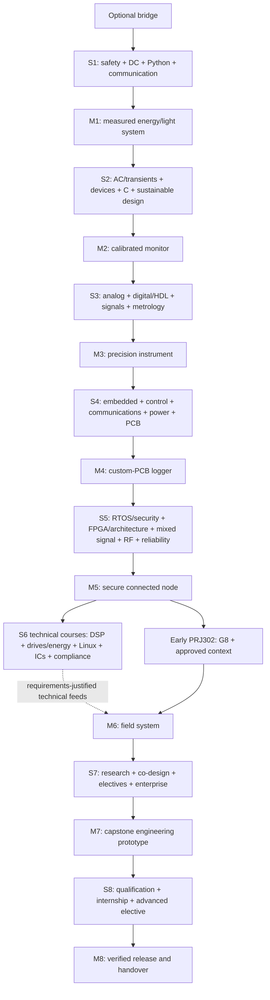

# Course Master Document / Document directeur du cursus

**Program:** Electronics Systems Engineering / Ingénierie des systèmes électroniques  
**Document ID:** ESE-CMD-001  
**Status:** English working edition of the foundational blueprint; a complete paired French edition is required before institutional release / Édition de travail anglaise du plan directeur; une édition française complète et appariée est requise avant diffusion institutionnelle\
**Version:** 0.2.0\
**Review date:** 2026-07-13  
**Review cycle:** minor review each semester; full curriculum review annually  
**Scope:** four academic years, 240 ECTS-equivalent credits, university/technical-school/self-study adaptations  
**Primary audiences:** faculty, laboratory staff, content authors, translators, reviewers, and program leaders  
**License target for original courseware:** CC BY-SA 4.0; code and hardware designs under an approved permissive license selected at repository setup  

> This is the program's source of truth. It defines what is taught, why it is taught, how students demonstrate mastery, how English and French editions remain equivalent, and how courseware is produced. It is not accreditation by itself. A deploying institution must map credits, safety rules, and degree requirements to its national regulator.
>
> Ce document constitue la source de référence du programme. Il définit les contenus, les finalités, les preuves de maîtrise, l'équivalence des versions anglaise et française et le processus de production. Il ne constitue pas à lui seul une accréditation. Chaque établissement doit adapter les crédits, la sécurité et les exigences du diplôme à son cadre national.

---

## 1. How to use this document / Mode d'emploi

This document is deliberately more than a course list. It contains:

- the course philosophy and program outcomes;
- the eight-semester learning architecture and prerequisite rules;
- the recurring project spine and dependency map;
- the hardware, software, laboratory, and component baselines;
- the assessment and evidence model;
- the English–French language policy and controlled glossary;
- specifications and templates for chapters, problem sets, laboratories, slides, professor notes, projects, and assessments;
- implementation, quality, inclusion, maintenance, and risk plans.

Program teams use it in four passes:

1. **Adopt:** approve the outcomes, safety policy, credit model, and local constraints.
2. **Instantiate:** create every course from the canonical repository templates in §14.
3. **Teach:** collect direct evidence through notebooks, measurements, design reviews, practical exams, and portfolios.
4. **Improve:** review outcome data, defects, translation parity, component availability, and graduate/employer feedback.

The program is a **complete bachelor-level curriculum design baseline**, not yet an accredited or institution-approved award and not a promise that every graduate will be a specialist in every subfield. All learners master a rigorous systems core; final-year clusters provide depth in selected state-of-practice and emerging areas. Bachelor-level equivalence remains a claim to demonstrate through workload, outcome, facility, assessment, and local-regulatory mappings.

### 1.1 Non-negotiable program invariants

- Every technical claim must be testable, derivable, or cited, with version and review date where it can become stale.
- Every major concept moves through **Discover → Understand → Experiment → Analyze → Design**.
- Every student must personally make, interpret, and defend wiring, measurement, debugging, programming, configuration, and evidence decisions. When physical dexterity is not the assessed construct, a documented outcome-equivalent accommodation may provide manipulation assistance under the learner's direction.
- Simulation supports but never replaces physical measurement in core laboratory courses.
- Safety, ethics, sustainability, security, accessibility, and manufacturability are design inputs, not final-week additions.
- English and French learning outcomes, assessment difficulty, diagrams, data, and release status must remain equivalent.
- Projects must address plausible local needs as well as international professional practice.
- Required work must be achievable with intermittent internet after an initial offline bundle is installed.
- Vendor-specific teaching is subordinate to transferable concepts and interfaces.
- Country, language, equipment, or income context may change the access route, examples, and apparatus; it may not lower the outcome, reasoning, safety, or evidence threshold.
- Claims of local manufacture or origin must be traceable to actual design, production, test, and service work; aspiration is never presented as provenance.

---

## 2. Program identity and philosophy / Identité et philosophie

### 2.1 Mission

Prepare learners to conceive, analyze, implement, verify, manufacture, deploy, and responsibly maintain electronic systems under real technical, economic, environmental, and social constraints.

Former des apprenants capables de concevoir, analyser, réaliser, vérifier, fabriquer, déployer et maintenir de manière responsable des systèmes électroniques soumis à des contraintes techniques, économiques, environnementales et sociales réelles.

### 2.2 Teaching philosophy

1. **Phenomenon before formula.** Start with a device, failure, waveform, or human need. Prediction creates a reason to learn the model.
2. **Models with domains of validity.** Learners use ideal models first, then quantify tolerance, loading, bandwidth, noise, temperature, parasitics, uncertainty, and failure.
3. **Hardware from week one.** The first semester includes safe measurement and construction; complexity grows without losing foundational habits.
4. **Debugging is a primary competence.** Fault localization is explicitly taught, practiced with seeded faults, assessed, and reflected upon.
5. **One system, many representations.** Physical circuit, schematic, equations, simulation, code, timing, layout, measurements, requirements, and test evidence must agree.
6. **Spiral progression.** Core ideas—energy, feedback, sampling, abstraction, state, interfaces, uncertainty, and trade-offs—return at increasing depth.
7. **Design for context.** Cost, repairability, local sourcing, power quality, heat, dust, humidity, connectivity, language, and technician skill are legitimate engineering requirements.
8. **Open and reproducible practice.** Students use version control, open formats, scripted builds, traceable data, and documented tool versions.
9. **Professional evidence over polished appearance.** A negative result with sound method is stronger than an attractive demonstration without proof.
10. **Responsible innovation.** Technical excellence includes public safety, cybersecurity, privacy, ecological impact, accessibility, and honest communication.
11. **Engineering agency.** Learners estimate before calculating, predict before measuring, seek disconfirming evidence, debug by hypothesis, own interface decisions, and document enough for another person to reproduce the work.
12. **Capability grows through making.** Projects progress from inspection and repair through local adaptation, original design, repeatable production, qualification, service, and responsible product ownership.

### 2.3 Signature learning cycle

| Phase | Student action | Teacher action | Required evidence |
|---|---|---|---|
| Discover / Découvrir | Observe, predict, state assumptions | Pose a real problem or discrepant event | Initial prediction in notebook |
| Understand / Comprendre | Build intuition and derive a model | Connect phenomenon, diagram, and mathematics | Worked model with units and validity |
| Experiment / Expérimenter | Simulate, construct, instrument | Coach safe and disciplined practice | Schematic, setup photo, raw data |
| Analyze / Analyser | Compare, quantify error, isolate faults | Question claims and uncertainty | Plot, residual/error, diagnosis |
| Design / Concevoir | Meet requirements under constraints | Conduct design reviews | Requirements trace and verification report |

### 2.4 Intended delivery modes and derived-program profiles

| Mode | Required adaptation | Outcome rule |
|---|---|---|
| Four-year university degree | Local general-education, accreditation, internship, and credit mapping | All program outcomes required |
| Three-year locally authorized profile | Derive a separately named 180-credit/locally mapped plan; retain safety, labs, PCB, embedded, and individual practical evidence while explicitly dispositioning omitted advanced outcomes | Publish its own approved award, credit, outcome, gate, internship, and progression contract; never imply the four-year outcome set |
| Modular technical school | Package semesters as stackable certificates | Never award a module without its practical gate |
| Supported self-study | Replace controlled laboratory hazards and team roles with safe alternatives and remote review | No unsupervised mains, high-energy battery, RF-power, or high-voltage work |

The 240-ECTS reference program is the only profile in this document that targets every PLO at the stated graduation level. A three-year, stackable, or technical profile is a separately named derived program: it requires its own approved credit table, retained outcome set, gate map, award title, and local authorization. It must not imply equivalence to the four-year outcome profile merely because it reuses courses. In particular, *Licence*, *Bachelor*, engineer, and other protected or regulated award language is used publicly only after the deploying institution documents the applicable national and regional approval.

### 2.5 International equivalence, local agency, and portability

This is not a reduced “resource-constrained” version of electronics engineering. The 240-credit reference program defines one rigorous bachelor-level evidence threshold and several legitimate delivery paths that preserve its full PLO contract. A shorter derived program defines a separate threshold for its explicitly retained outcomes and may not claim equivalence to the full profile. Benin is a reference deployment context, not a proxy for Africa; African countries and communities are not interchangeable.

Every deployment separates three layers:

| Layer | What belongs here | What may change |
|---|---|---|
| Universal engineering contract | PLOs, prerequisite logic, mathematics and science depth, safe practice, individual evidence, mastery thresholds, technical review, and release gates | only through controlled program revision |
| National/institutional deployment pack | award and credit mapping, regulations, calendar, language support, grid/environment data, facilities, computing access, suppliers, costs, and staff capacity | reviewed locally and dated |
| Project/user context | observed need, user and service languages, environment, maintenance, acceptance, data, cost, and lifecycle constraints | selected from evidence for each project |

Equivalent standard does not mean identical hardware. A minimal apparatus, substitute board, or offline workflow is acceptable only when learners still produce evidence for the same outcome at the same cognitive, measurement, safety, and independence threshold. Prepared data can teach analysis of an inaccessible phenomenon; it cannot certify a personal construction, instrumentation, or debugging competence.

The “Made in Benin” ambition is therefore expressed as increasing **local engineering and product authority**: people in Benin define needs and requirements, make architecture and make/buy decisions, own design files and configuration, assemble and test repeatably where feasible, qualify suppliers, document imported dependencies honestly, and operate, repair, improve, and retire the product. Modern electronics supply chains are international; importing silicon or a specialized fabrication service does not erase local value, while assembling an opaque imported design does not by itself demonstrate local engineering ownership. Any public origin claim must match current law and the traceable evidence in §7.5.

---

## 3. Learners, entry, and bridge / Public, admission et mise à niveau

### 3.1 Assumed entry profile

Students should have secondary-school algebra, elementary trigonometry, scientific notation, and basic physical science. Prior programming, soldering, or electronics experience is not assumed. Instruction may begin in either English or French, but learners progressively acquire professional reading competence in both.

### 3.2 Zero-semester diagnostic and bridge

Before Semester 1, administer a low-stakes diagnostic in the learner's stronger language. It samples algebra, graphs, proportional reasoning, units, vectors, basic mechanics/electricity, reading, and digital literacy. It is used for placement, never exclusion.

The optional 4–6 week bridge contains:

- algebra, trigonometry, logarithms, complex-number intuition, graphs, and estimation;
- SI units, dimensional analysis, scientific notation, significant figures, and calculator/spreadsheet use;
- basic English/French technical reading and glossary habits;
- computer files, terminal basics, keyboard fluency, offline documentation, and version-control concepts;
- tool recognition, electrical safety, breadboard topology, wire preparation, and first measurements;
- learning-to-learn routines: retrieval, spaced practice, notebook discipline, and productive help-seeking.

Students who demonstrate mastery may bypass the bridge. Diagnostic results trigger tutoring and accessible resources; they do not lower later outcomes.

### 3.3 Access and participation commitments

- Core pages, captions, transcripts, datasets, and assessment instructions exist in English and French.
- Diagrams do not rely on color alone; plots use distinguishable line styles and labels.
- Videos have transcripts, captions, chapter markers, and low-bandwidth versions.
- Laboratory teams rotate **builder, instrument lead, analyst, and verifier** roles unless an outcome-equivalent accommodation is documented; every learner must still direct, interpret, and defend relevant practical decisions.
- Every team submission includes an individual check or oral defense.
- Component kits include tactile labels and high-contrast storage maps where needed.
- Accommodation changes the access route, not the competence being assessed, unless a documented program-level exception applies.

---

## 4. Educational objectives and graduate outcomes / Objectifs et acquis de sortie

### 4.1 Program educational objectives (3–5 years after graduation)

Graduates should be able to:

- **PEO-1 Practice:** contribute effectively to the design, verification, deployment, or maintenance of electronic and embedded products;
- **PEO-2 Grow:** learn unfamiliar devices, standards, and tools from primary documentation and continue into employment, entrepreneurship, or advanced study;
- **PEO-3 Lead responsibly:** communicate and collaborate across disciplines and languages while considering safety, ethics, sustainability, security, and community impact;
- **PEO-4 Create value:** adapt globally sound engineering to local constraints and increase local design, production, test, service, and improvement capability;
- **PEO-5 Improve systems:** use measurements, field evidence, and stakeholder feedback to improve both products and engineering processes.

### 4.2 Program learning outcomes

At graduation, each student can:

| ID | Outcome / Acquis | Observable graduation evidence |
|---|---|---|
| PLO-01 | Apply mathematics, science, and computation to formulate and solve complex electronics problems. / Appliquer les mathématiques, les sciences et le calcul. | Defensible model, computation, assumptions, and validation |
| PLO-02 | Analyze and design analog, mixed-signal, digital, power, and feedback circuits. / Analyser et concevoir des circuits analogiques, mixtes, numériques, de puissance et asservis. | Design review plus measured performance |
| PLO-03 | Design embedded software with peripherals, concurrency, real-time behavior, and resource constraints. / Concevoir des logiciels embarqués. | Tested firmware, timing and resource evidence |
| PLO-04 | Describe and implement digital logic and computer architecture, including an FPGA-based system. / Mettre en œuvre la logique numérique et l'architecture des ordinateurs. | HDL verification and FPGA demonstration |
| PLO-05 | Capture schematics and design manufacturable, testable, reliable PCBs and product realization packages. / Concevoir des circuits imprimés et dossiers produit fabricables, testables et fiables. | DRC-clean release, bring-up, assembly/test instructions, and production evidence |
| PLO-06 | Select sensors, actuators, power sources, interfaces, and communication links from requirements and datasheets. / Sélectionner capteurs, actionneurs, alimentations, interfaces et liaisons. | Trade study and requirements traceability |
| PLO-07 | Plan experiments; measure safely; quantify uncertainty; analyze data; and draw justified conclusions. / Planifier des expériences et quantifier l'incertitude. | Reproducible data package and uncertainty budget |
| PLO-08 | Debug hardware/software systematically using hypotheses, instruments, isolation, and evidence. / Déboguer systématiquement le matériel et le logiciel. | Timed fault-localization practical |
| PLO-09 | Engineer systems for safety, security, privacy, EMC, reliability, sustainability, and lifecycle. / Intégrer sécurité, cybersécurité, CEM, fiabilité et durabilité. | Hazard/threat analyses and verification cases |
| PLO-10 | Create solutions responsive to user, cultural, environmental, economic, and manufacturing constraints, with a credible local realization and service plan. / Répondre aux contraintes humaines et contextuelles avec un plan crédible de réalisation et de maintenance locales. | Stakeholder-validated requirements, make/buy and local-value plan, and impact review |
| PLO-11 | Communicate technical reasoning through schematics, code, data, reports, talks, and demonstrations to varied audiences. / Communiquer le raisonnement technique. | Professional design dossier and defense in the chosen academic language, plus a bilingual abstract and prepared cross-language briefing |
| PLO-12 | Work effectively and inclusively in teams, plan work, manage interfaces, and resolve uncertainty. / Travailler efficacement en équipe. | Peer evidence, interface contracts, retrospectives |
| PLO-13 | Learn independently from datasheets, standards, research, and experiments; evaluate source quality. / Apprendre de manière autonome. | Datasheet-based implementation and literature trail |
| PLO-14 | Practice ethically, manage configuration and evidence, and make honest claims about system performance. / Exercer avec éthique et traçabilité. | Auditable repository, limitations, attribution, AI-use log |

The outcomes are designed to align with the International Engineering Alliance graduate-attribute benchmark, the ABET 2026–2027 engineering student outcomes, and the CDIO conceive–design–implement–operate model. Alignment is a design hypothesis to verify through an explicit mapping; it is neither accreditation nor a claim that the program has already demonstrated equivalence.

### 4.3 Competence progression scale

| Level | Name | What the student can do | Typical evidence |
|---|---|---|---|
| 0 | Encountered / Sensibilisé | Recognize language and purpose with guidance | Concept check |
| 1 | Assisted / Accompagné | Execute a documented method safely | Guided lab |
| 2 | Independent / Autonome | Select and apply a method to a bounded problem | Practical exam or design task |
| 3 | Integrated / Intégré | Combine domains under incomplete and conflicting constraints | Milestone project |
| 4 | Defensible / Défendable | Justify trade-offs, verify claims, handle anomalies, and transfer learning | Capstone review and individual defense |

Graduation requires Level 3 in every PLO and Level 4 in PLO-07, PLO-08, PLO-11, and at least two technical outcomes aligned to the student's chosen depth cluster.

---

## 5. Curriculum architecture / Architecture du cursus

### 5.1 Credit and workload model

The reference design uses 30 ECTS-equivalent credits per semester, 60 per year, 240 total. One ECTS represents approximately 25–30 hours of total learner effort; institutions must translate this to local credits. A 6-ECTS technical course therefore represents roughly 150–180 hours across class, laboratory, studio, preparation, assessment, and independent work.

The target program mix is:

| Area | ECTS | Share |
|---|---:|---:|
| Mathematics and natural science | 28 | 11.7% |
| Engineering and computing core | 135 | 56.3% |
| Projects, capstone, internship | 45 | 18.8% |
| Communication, design context, ethics, enterprise, research | 16 | 6.7% |
| Technical electives | 16 | 6.7% |
| **Total** | **240** | **100%** |

Elective depth also appears inside the final-year capstone and seminar. Mathematics is taught both in dedicated courses and just-in-time engineering studios. At least 35% of scheduled technical contact time is laboratory, design studio, tutorial, or project work.

### 5.2 Eight-semester reference plan

#### Year 1 — Observe, model, build / Observer, modéliser, réaliser

| Sem. | Code | Course / Unité d'enseignement | ECTS | Core practical result |
|---|---|---|---:|---|
| S1 | ESE101 | Engineering Practice, Safety and Prototyping / Pratique, sécurité et prototypage | 5 | Safe tool qualification; continuity tester |
| S1 | MAT101 | Engineering Mathematics I / Mathématiques I | 6 | Model and plot measured linear/nonlinear relations |
| S1 | PHY101 | Physics I: Mechanics, Energy and Thermal Science / Physique I | 5 | Energy and thermal experiment |
| S1 | CSC101 | Programming and Computational Thinking / Programmation | 5 | Tested Python data-acquisition/analysis script |
| S1 | ESE111 | DC Circuits and Measurement / Circuits continus et mesure | 6 | Characterize and debug a sensor interface |
| S1 | COM101 | Bilingual Technical Communication I / Communication technique bilingue I | 3 | EN/FR abstract, notebook and five-minute explanation |
|  |  | **Semester 1 total** | **30** | **Project M1: Solar study lamp monitor** |
| S2 | MAT102 | Engineering Mathematics II / Mathématiques II | 6 | Complex numbers, calculus, linear algebra in circuits |
| S2 | PHY102 | Physics II: Fields, Waves and Materials / Physique II | 5 | Field/wave/material characterization |
| S2 | ESE121 | AC Circuits, Transients and Signals / Circuits alternatifs, transitoires et signaux | 6 | Filter and transient verification |
| S2 | ESE122 | Electronic Devices I / Composants électroniques I | 6 | Diode/transistor switch and amplifier |
| S2 | CSC102 | C Programming and Data Structures / Langage C et structures de données | 4 | Tested C plus a scaffolded low-voltage MCU interface practical |
| S2 | DES102 | Human-Centered and Sustainable Design / Conception centrée usager et durable | 3 | Repairability and lifecycle teardown |
|  |  | **Semester 2 total** | **30** | **Project M2: Calibrated environmental monitor** |

#### Year 2 — Analyze subsystems, integrate interfaces / Analyser et intégrer

| Sem. | Code | Course / Unité d'enseignement | ECTS | Core practical result |
|---|---|---|---:|---|
| S3 | MAT201 | Differential Equations, Probability and Numerical Methods / Équations différentielles, probabilités et calcul numérique | 6 | Fit, simulate, and validate a dynamic stochastic model |
| S3 | ESE211 | Analog Electronics / Électronique analogique | 6 | Low-noise multistage sensor front end |
| S3 | ESE212 | Digital Logic and HDL / Logique numérique et HDL | 6 | Verified finite-state controller on programmable logic |
| S3 | ESE213 | Signals and Systems / Signaux et systèmes | 5 | Time/frequency analysis of a measured signal |
| S3 | ESE214 | Instrumentation and Metrology / Instrumentation et métrologie | 4 | Calibrated instrument with uncertainty statement |
| S3 | PRJ201 | Integrated Design Studio I / Atelier de conception intégrée I | 3 | Project M3 design reviews and verification |
|  |  | **Semester 3 total** | **30** | **Project M3: Precision instrument** |
| S4 | ESE221 | Embedded Systems I / Systèmes embarqués I | 6 | Bare-metal drivers, interrupts, timers, low power |
| S4 | ESE222 | Feedback and Control / Automatique | 5 | Identified and stabilized physical plant |
| S4 | ESE223 | Communications and Data Networks / Communications et réseaux | 5 | Robust wired/wireless telemetry link |
| S4 | ESE224 | Power Electronics and Energy Systems / Électronique de puissance et énergie | 5 | Protected DC conversion and power budget |
| S4 | ESE225 | PCB Design, EMC and Manufacturing / Conception de PCB, CEM et fabrication | 6 | Fabrication-ready two-layer PCB and bring-up plan |
| S4 | PRJ202 | Integrated Design Studio II / Atelier de conception intégrée II | 3 | Project M4 production release |
|  |  | **Semester 4 total** | **30** | **Project M4: Custom-PCB data logger** |

#### Year 3 — Engineer robust products / Industrialiser des produits robustes

| Sem. | Code | Course / Unité d'enseignement | ECTS | Core practical result |
|---|---|---|---:|---|
| S5 | ESE311 | Embedded Systems II: RTOS, Concurrency and Security / RTOS, concurrence et sécurité | 6 | RTOS product with tests, update and threat model |
| S5 | ESE312 | Computer Architecture and FPGA Systems / Architecture et systèmes FPGA | 6 | Pipelined RISC-V subset or accelerator with verification |
| S5 | ESE313 | Mixed-Signal Systems and Data Conversion / Systèmes mixtes et conversion de données | 5 | Converter chain with noise/error budget |
| S5 | ESE314 | RF, Wireless and Antennas / RF, radio et antennes | 5 | Legal low-power link and link-budget validation |
| S5 | ESE315 | Engineering Statistics, Reliability and Test / Statistiques, fiabilité et test | 4 | DOE, accelerated test, and production-test concept |
| S5 | PRJ301 | Product Engineering Sprint / Sprint d'ingénierie produit | 4 | Project M5 alpha prototype and design history file |
|  |  | **Semester 5 total** | **30** | **Project M5: Secure connected node** |
| S6 | ESE321 | Digital Signal Processing / Traitement numérique du signal | 5 | Real-time filter/classifier with fixed-point analysis |
| S6 | ESE322 | Drives, Renewable Energy and Advanced Control / Entraînements, énergies renouvelables et commande avancée | 5 | Motor or energy-conversion controller |
| S6 | ESE323 | Embedded Linux and Edge Networking / Linux embarqué et réseaux périphériques | 5 | Reproducible Linux service, device interface and telemetry |
| S6 | ESE324 | Semiconductor and Integrated-Circuit Fundamentals / Semi-conducteurs et circuits intégrés | 5 | CMOS block analysis and layout-aware simulation |
| S6 | ESE325 | Systems Safety, Cybersecurity and Compliance / Sûreté, cybersécurité et conformité | 4 | Hazard, threat, EMC and compliance plan |
| S6 | PRJ302 | Community Field Engineering / Ingénierie de terrain communautaire | 6 | Project M6 pilot deployment and field evidence |
|  |  | **Semester 6 total** | **30** | **Project M6: Context-responsive field system** |

**Recommended interval:** an 8–12 week supervised industrial placement after S6, recognized in S8 after submission of evidence.

#### Year 4 — Specialize, validate, transfer / Se spécialiser, valider, transmettre

| Sem. | Code | Course / Unité d'enseignement | ECTS | Core practical result |
|---|---|---|---:|---|
| S7 | RES401 | Research Methods, Standards, Ethics and IP / Recherche, normes, éthique et PI | 4 | Review, experiment plan, ethics/IP analysis |
| S7 | ESE401 | Secure Hardware–Software Co-design / Co-conception matériel–logiciel sécurisée | 5 | Root-of-trust, secure update or fault-injection study |
| S7 | ELE4A | Technical Elective A / Option technique A | 5 | Cluster-specific evidence |
| S7 | ELE4B | Technical Elective B / Option technique B | 5 | Cluster-specific evidence |
| S7 | CAP401 | Capstone I: Discovery through Engineering Validation / Projet de fin d'études I | 8 | Requirements, architecture, risks, prototypes, CDR |
| S7 | ENT401 | Enterprise, Manufacturing and Product Lifecycle / Entrepreneuriat, fabrication et cycle de vie | 3 | Costed production and service plan |
|  |  | **Semester 7 total** | **30** | **Project M7: Capstone engineering prototype** |
| S8 | CAP402 | Capstone II: Verification, Field Trial and Handover / Projet de fin d'études II | 15 | Verified product, dossier, defense and handover |
| S8 | IND402 | Internship or Applied Engineering Clinic / Stage ou clinique d'ingénierie | 6 | Supervisor evidence and reflective technical report |
| S8 | ELE4C | Technical Elective C / Option technique C | 6 | Cluster-specific advanced work |
| S8 | SEM402 | Emerging Technology and Professional Seminar / Technologies émergentes et séminaire professionnel | 3 | Technical horizon scan and bilingual briefing |
|  |  | **Semester 8 total** | **30** | **Project M8: Qualified capstone release** |

### 5.3 First-year chapter sequence

The first year is highly coordinated so mathematics, physics, programming, and circuits reinforce rather than race one another.

| Weeks | Mathematics/physics ideas | Electronics and computing | Integrated encounter |
|---|---|---|---|
| S1 1–2 | Units, algebra, energy | Safety, breadboard, source/load, algorithm | Measure a battery-powered lamp |
| S1 3–4 | Lines, slopes, uncertainty | Ohm/Kirchhoff, DMM, plotting | Infer an unknown resistor network |
| S1 5–6 | Systems of equations | Nodal/mesh ideas, Python arrays | Solve then measure a network |
| S1 7–8 | Functions and local linearity | Sensors, dividers, loading | Calibrate a light/temperature sensor |
| S1 9–10 | Power and thermal models | LEDs, source resistance, ratings | Explain heating and efficiency |
| S1 11–12 | Statistics introduction | Tolerance, repeated measurements | Compare a class population of parts |
| S1 13–14 | Integrated review | Fault isolation and communication | M1 validation and individual practical |
| S2 1–2 | Complex numbers, sinusoids | Oscilloscope, amplitude, phase | Audit an unfamiliar waveform |
| S2 3–4 | Derivative/integral intuition | Capacitor, inductor, RC/RL transient | Fit a time constant from data |
| S2 5–6 | First-order differential model | Filters, impedance, Bode intuition | Design a noise-reduction filter |
| S2 7–8 | Exponentials and piecewise models | Diodes, rectification, protection | Build a protected supply front end |
| S2 9–10 | Multivariable relations | BJT/MOSFET switch, logic levels | Drive a load safely from logic |
| S2 11–12 | Linearization and gain | Biasing and single-stage amplifier | Compare switch and amplifier operation |
| S2 13–14 | Data structures and design synthesis | Sampling intro, sensor integration | M2 verification and public demonstration |

### 5.4 Technical depth clusters and rotating frontier modules

Students choose electives coherently; they do not assemble a random menu. Each cluster contains one enduring foundation and one annually refreshed frontier module.

| Cluster | Enduring depth | Frontier examples (review annually) |
|---|---|---|
| Embedded intelligence | RTOS internals, DSP, optimization | TinyML/edge AI, heterogeneous MCUs, model compression, responsible AI |
| Digital hardware | Advanced HDL, verification, timing closure | RISC-V systems, hardware acceleration, formal verification, chiplets overview |
| Power and climate | Converters, drives, control, protection | Microgrids, wide-bandgap devices, battery management, energy harvesting |
| RF and connected systems | RF design, antennas, protocols | SDR, low-power wide-area networks, satellite/NTN overview, RF sensing |
| IC and mixed signal | CMOS, data converters, layout | Open PDK flow, analog automation, hardware assurance |
| Robotics and instrumentation | Estimation, mechatronics, sensors | Sensor fusion, autonomous edge systems, precision agriculture |
| Secure resilient systems | Embedded security, dependability | Post-quantum implementation awareness, side channels, secure lifecycle/SBOM |
| Biomedical and assistive electronics | Biopotentials, isolation, human factors | Wearables, point-of-care instruments, privacy-preserving sensing |

Frontier modules are taught as evidence-based engineering, not trend surveys. Each must culminate in a reproduced result, benchmark, or critical design review and state its technology-readiness and ethical limitations.

The Year-3 core is deliberately broad but is not allowed to become a survey of tool names. Before release, workload and assessment pilots must show that each core course reaches its declared competence and physical-evidence level. If RTOS, FPGA/architecture, mixed signal, RF, DSP, drives/energy, Linux, IC, assurance, and field integration cannot fit the credit model at that depth, the program board moves an advanced application to a depth cluster rather than cutting experiment, debugging, or product-realization evidence. M5 and M6 use only the concurrent technologies justified by their requirements; they are not checklists requiring every course topic in one product.

---

## 6. Knowledge and skill threads / Fils conducteurs

| Thread | Year 1 | Year 2 | Year 3 | Year 4 exit |
|---|---|---|---|---|
| Mathematics/models | Algebra, calculus intuition, complex numbers | ODEs, probability, transforms | stochastic, numerical, optimization use | choose/defend model and validate |
| Analog/mixed signal | passive circuits, devices | op-amps, feedback, instrumentation | conversion, noise, RF | specification-driven mixed-domain design |
| Digital/computer | Boolean logic encounter | HDL, FSM, timing | architecture, FPGA, RISC-V | verified hardware/software co-design |
| Embedded/software | Python, C fundamentals | bare metal, drivers, protocols | RTOS, Linux, DSP, security | maintainable, tested, updateable product |
| Power/control | energy, thermal | feedback and DC conversion | drives, renewables, advanced control | safe, efficient system integration |
| PCB/manufacture | prototyping, soldering | schematic, layout, DFM, EMC | production test, reliability | controlled release and supplier handoff |
| Local product authority | inspect, repair, authenticate | adapt, design, source and document | repeat build, fixture, quality, field service | control product evidence and grow supplier capability |
| Experiment/debug | DMM/scope, uncertainty | metrology, fault trees | DOE, coverage, field diagnosis | independently defend performance claims |
| Professional/context | notebooks, bilingual explanation | teamwork, user/design constraints | field deployment, compliance | ethics, enterprise, leadership, handover |

### 6.1 Cross-curriculum minimum experiences

Before graduation, every student must archive attributable individual evidence for at least the following. Items explicitly described as individual are personally executed unless an approved outcome-equivalent accommodation applies. Team, field, and pooled-production experiences name the learner's contribution, decisions, and individual defense rather than treating the whole team process as personal work:

- 12 safe instrument practicals, including DMM, oscilloscope, supply, function generator, logic analyzer, and debug probe;
- 8 datasheet interpretation tasks and 3 standards-navigation tasks;
- 6 seeded-fault debugging practicals across analog, digital, firmware, PCB, communications, and power;
- 4 individual soldering/rework artifacts, including through-hole and surface-mount work;
- 3 PCB cycles: guided, team-owned, and capstone-owned;
- 2 HDL designs with self-checking testbenches and one physical FPGA implementation;
- 3 embedded levels: bare metal, RTOS, and embedded Linux/edge integration;
- 2 formal peer design reviews and 2 manufacturing/service reviews;
- one field deployment with stakeholder evidence;
- one individual bilingual technical explanation in each program year;
- one capstone design dossier with requirements-to-test traceability;
- one locally executed repeat-build exercise—at least three nominally identical units per team or an approved larger pooled sample—with work instructions, serialization, sample size, observed first-pass/defect/rework results, cost, and production-test evidence; no generalized yield or process-capability claim may be inferred from an inadequate sample;
- one audited repair/fabrication/supplier workflow and local-value dossier that distinguishes local contribution from imported parts and services.

---

## 7. Project spine and dependency map / Colonne vertébrale des projets et dépendances

Projects are not extracurricular demonstrations. They are scheduled integration environments with requirements, reviews, configuration control, individual evidence, and explicit verification.

### 7.1 Milestone projects

| ID | Timing | Product challenge | New integration burden | Required design gates | Indicative incremental student BOM* |
|---|---|---|---|---|---:|
| M1 | S1 | **Solar study-lamp monitor:** measure source, battery, load, light and temperature without modifying hazardous circuitry | measurement, calibration, energy, technical explanation | safety check; measurement review; claims audit | USD 8–15 |
| M2 | S2 | **Calibrated environmental monitor:** sense two variables, display/log them, and justify enclosure/use context | transistor interface, filtering, scaffolded MCU C, calibration | concept; bench prototype; verification | USD 15–25 |
| M3 | S3 | **Precision instrument:** create a low-level sensor/instrumentation front end and quantify uncertainty | op-amps, noise, ADC, metrology | requirements; analog review; calibration audit | USD 15–30 |
| M4 | S4 | **Custom-PCB resilient data logger:** operate from an imperfect local supply and communicate data | MCU, power, PCB, EMC, DFM, firmware | SRR; PDR; PCB review; bring-up; release | USD 25–45 |
| M5 | S5 | **Secure connected node:** use an RTOS, authenticated communications, power management, and a programmable-logic element | concurrency, threat model, FPGA integration, reliability | architecture; threat review; alpha qualification | USD 30–60 |
| M6 | S6 | **Context-responsive field system:** solve a validated agriculture, water, energy, health, mobility, or education need | stakeholders, Linux/edge, field reliability, service | needs review; field-readiness; pilot; impact review | USD 40–80 |
| M7 | S7 | **Capstone engineering prototype:** resolve the highest technical risks for a sponsored or entrepreneurial system | research, standards, economics, complex interfaces | SRR; PDR; CDR; test-readiness review | project-specific |
| M8 | S8 | **Qualified capstone release:** verify, trial, document, cost, and hand over a reproducible result | verification coverage, manufacture, maintenance, defense | qualification review; acceptance; defense; retrospective | project-specific |

\* Planning bands exclude reusable instruments and computing, vary by region, and must be requoted before procurement. Projects should recover and reuse modules where this does not hide relevant design work.

Approved M6/M8 themes should be co-defined with users. Examples include solar cold-chain monitoring, irrigation control, pump protection, water-quality instrumentation, energy metering, accessible learning devices, repair diagnostics, crop-storage monitoring, and clinic equipment monitoring. A project must not claim medical, safety, or revenue-critical fitness without the corresponding regulatory and verification scope.

### 7.2 Project dependency map



### 7.3 Course prerequisite rules

Prerequisites represent demonstrated competence, not merely seat time.

- ESE111 and ESE101 are co-requisites and gate all later physical laboratories.
- ESE121 requires DC-network and safe-instrument qualification; ESE122 additionally requires source/load and power reasoning.
- ESE211 requires ESE121, ESE122, and calculus foundations; ESE214 may be co-taught.
- ESE212 requires CSC102, including its Boolean/truth-table and bit-level foundation; a short diagnostic/bridge precedes HDL if that evidence is missing. No FPGA board is required for the earliest simulations.
- ESE221 requires CSC102, ESE122, and individual C proficiency.
- ESE225 requires ESE211 or an approved analog foundation and ESE212. ESE221 is an explicitly sequenced co-requisite: PCB MCU/interface work begins only after the relevant ESE221 electrical-interface and bring-up units, and layout begins only after schematic and power reviews.
- ESE311 requires ESE221 and software test/version-control competence.
- ESE312 requires ESE212 and CSC102; architecture work may run in simulation before hardware.
- ESE313 requires ESE211, ESE213, and ESE214.
- PRJ302 requires M4 release competence and M5 architecture competence; field work additionally requires ethics, safety, and stakeholder approval.
- Before any student-led stakeholder research, interview, personal-data collection, site access, or M6 deployment, every student passes the early PRJ302/ESE325 G8 module covering consent, stakeholder ethics, field safety, privacy/data governance, lawful communications, incident reporting, and technical rollback. Until then, students use staff-approved context briefs and non-human-participant technical work. Institutional/partner ethical approval is separate and cannot be replaced by a student pass.
- CAP401 requires G1–G8, every named prerequisite course outcome at least at Level 2, completion or approved remediation for M6, and an accepted proposal.
- CAP402 begins only after a passed critical design review and approved verification, safety/security, ethics/data, procurement, local-value, and acceptance plans.

### 7.4 Standard engineering gates

| Gate | Minimum question answered | Mandatory artifacts |
|---|---|---|
| Needs review | Is this a real, ethical, sufficiently understood need? | stakeholder map, use context, problem evidence |
| SRR—System Requirements Review | Are requirements necessary, measurable, feasible, and traceable? | numbered requirements, acceptance criteria, constraints |
| PDR—Preliminary Design Review | Is the architecture plausible and are major risks attacked? | block diagram, interfaces, trade studies, risk register |
| CDR—Critical Design Review | Is the detailed design ready to implement? | schematics/layout/code architecture, calculations, test plan |
| TRR—Test Readiness Review | Can testing proceed safely and answer each claim? | procedures, calibrated tools, fixtures, expected bounds |
| Qualification review | Did objective evidence meet the requirements? | test matrix, raw data, deviations, limitations |
| Release/handover review | Can another competent person reproduce, operate, repair, and retire it? | release tag, BOM, build/service/user docs, licenses |

### 7.5 Local value-creation and product-authority ladder

The program measures local capability through evidence, not slogans or the nationality of a development board. The ladder is portable; a deployment records the applicable place, organizations, and jurisdiction. For the initial Benin deployment, “local” means work demonstrably performed and controlled in Benin.

| Level | Capability | Required evidence |
|---|---|---|
| V0 — Diagnose and maintain | identify functions, authenticate/characterize parts, localize faults, repair safely, and document limits of an existing product | teardown/service map, measurements, fault/repair record, component passport |
| V1 — Adapt and integrate | select modules/components; design interfaces, harness/enclosure, firmware, calibration, and user/service adaptation | interface contract, make/buy record, locally executable build and calibration instructions |
| V2 — Design and verify | own measurable requirements, architecture, schematic/PCB, firmware/HDL as applicable, test points, verification, and controlled release | editable design source, design reviews, bring-up, raw verification data, independent reproduction |
| V3 — Pilot-production readiness | execute a controlled repeat assembly/test process; manage incoming inspection, serialization, work instructions, fixtures, nonconformance/rework, alternates, cost, and service; size evidence to the claim | locally executed repeat batch, traveler, checked/calibrated production test, sample size and observed first-pass/defect/rework/cost report, technician handoff; process capability or generalized yield requires a justified larger sample |
| V4 — Exercise product authority | control configuration and product decisions; manage compliance, supplier quality, scale, warranty/service, improvement, IP/data, and end of life while developing local partners | accepted product dossier, supplier/capability plan, field/quality evidence, training and truthful contribution/origin statement |

Typical targets are M1 V0; M2 V1; M3 V1→V2; M4 V2 plus a pooled institutional V3-readiness exercise; M5 V2→V3; M6 V2→V3 only when its approved risk/maturity plan justifies repeat production; and M7/M8 V3→V4 where project scope permits. Graduation requires individual V2 evidence and an attributable, defended contribution to at least one V3-readiness process. V4 is a program and capstone ambition, not a reason to exaggerate a student prototype.

Every M2/M4/M6/M8 product maintains a **local-value and provenance dossier** that records, with organizations and locations:

- need/requirements ownership and stakeholder decision authority;
- architecture, electronics, PCB layout/fabrication, firmware/HDL, mechanical/enclosure, harness, assembly, test/calibration, documentation, deployment, and service contributions;
- imported parts, tools, services, licenses, and knowledge dependencies;
- make/buy rationale, dated landed cost, feasible substitutes, capability gaps, and the next locally controllable step;
- the exact product-origin or local-contribution wording that evidence and current law permit.

A project may be excellent without reaching V4. It may not claim a higher level than another competent team can reproduce from the released process evidence.

---

## 8. Hardware platform strategy / Stratégie des plateformes matérielles

### 8.1 Selection principles

Platforms are selected by learning value, documentation quality, debug access, toolchain openness, availability, lifecycle, electrical robustness, and total class cost—not raw performance. Every course specifies required capabilities first, a reference platform second, and validated substitutes third.

The baseline is reviewed annually using this scorecard:

| Criterion | Weight | Evidence |
|---|---:|---|
| Transferable learning and visibility of hardware | 20% | registers/interfaces accessible; minimal hidden framework |
| Documentation, schematics, examples, community | 15% | downloadable primary docs and design files |
| Local/regional availability and landed cost | 15% | quotes from at least two channels; counterfeit risk |
| Open, offline, cross-platform tool support | 15% | reproducible install bundle and CI path |
| Debug/test access | 10% | SWD/JTAG/UART/test points and affordable probe |
| Lifecycle and second-source strategy | 10% | vendor commitment, replaceable module, abstraction path |
| Electrical robustness and repairability | 10% | protection, headers, replaceable parts |
| Accessibility and licensing | 5% | install without paid seat/cloud account; usable documentation |

### 8.2 Reference platform ladder (2026 baseline)

| Stage | Reference choice | Why it is used | Approved capability-equivalent alternatives |
|---|---|---|---|
| First MCU encounter | **Raspberry Pi Pico 2 (RP2350)** | low cost; drag-and-drop recovery; C/C++ and MicroPython; Arm Cortex-M33 and optional RISC-V cores; PIO exposes timing and interfaces | Pico/RP2040 where already stocked; ESP32-C3/C6; STM32 Nucleo entry boards |
| Professional MCU/RTOS | **STM32 Nucleo with Cortex-M33 and on-board debug** (exact stocked model frozen per cohort) | exposes professional debug, timers, ADC/DAC where available, low power, security, and broad middleware | Nordic nRF52/nRF53 DK; NXP FRDM; supported ESP32-C6; another Zephyr-supported board with SWD/JTAG |
| Wireless node | **ESP32-C3/C6 module board** or stocked Zephyr-supported radio board | affordable Wi-Fi/BLE; C3/C6 introduces RISC-V; strong module availability | Pico 2 W, nRF52840 DK/module, certified sub-GHz module where regulation permits |
| FPGA | **iCE40-class education board with open-source-capable flow** and accessible PMOD-style I/O | small enough to understand; supports simulation-first and open synthesis/place-route flows | Tang Nano 9K/20K, UPduino, iCEBreaker, or institution-stocked Artix-7 board; instructor validates tool image first |
| Embedded Linux | **Raspberry Pi 4/5-class or equivalent supported SBC**, shared 1:2–1:4 | broad Linux ecosystem, GPIO/networking, replaceable storage | BeagleBone/BeaglePlay, Orange Pi where fully imaged, refurbished x86 mini-PC plus remote MCU |
| PCB target | **module-on-carrier first, then direct MCU where capability permits** | reduces early assembly risk while teaching power, connectors, signal integrity, test and production | locally stocked modules; no project may depend on an uninspectable cloud-only module |
| Architecture | **RISC-V RV32I/M model and soft core** | open, stable ISA for tracing datapaths, compilers, privilege/security, and FPGA realization | pedagogical custom ISA first; Arm Cortex-M comparison; not vendor marketing |

The Pico 2 is a teaching baseline, not the sole professional target. Students move from friendly recovery to register-level C, hardware debug, an RTOS, production constraints, and a second architecture. Arduino-compatible libraries may accelerate a project prototype, but core embedded assessments require learners to explain timing, memory, peripherals, interrupts, and electrical behavior below the framework.

### 8.3 Software and document toolchain

| Purpose | Reference tool | Policy |
|---|---|---|
| Authoring/publishing | Markdown + YAML, Quarto or Pandoc, Mermaid, LaTeX math | source remains readable without renderer; freeze build environment |
| Slides | Quarto Reveal.js or equivalent generated from Markdown | accessible PDF fallback and speaker notes required |
| Circuit/PCB | KiCad stable major version frozen per academic year | archive native source, PDFs, Gerbers, drill, BOM, position and fabrication notes |
| Analog simulation | ngspice via KiCad or standalone | models and licenses archived; measurements compared to simulation |
| Digital simulation | Verilator and/or GHDL plus waveform viewer | self-checking tests required; pin to tested versions |
| FPGA flow | board-supported open flow where reliable; vendor flow as documented fallback | preflight offline image before semester; do not assess installation luck |
| Numerical/data work | Python, Jupyter optional, NumPy/SciPy/Matplotlib | scripts produce figures; notebooks cleared/tested before release |
| Firmware | C/C++, CMake, compiler toolchain, OpenOCD/probe tools | warnings enabled; formatter, static checks, unit and hardware tests where meaningful |
| RTOS | supported Zephyr LTS baseline (3.7 LTS, verified 2026-07-13 and frozen per cohort) | recheck support/security at cohort freeze; upgrade only through a tested migration branch; a current stable release may be demonstrated |
| Version control/CI | Git plus institution-selected forge; local/offline Git works | tagged releases; CI reproduces docs, software tests, and HDL tests |
| Requirements/test | Markdown tables + stable IDs; machine-readable CSV/YAML when scaled | bidirectional requirement–test–evidence traceability |

No required learning artifact may exist only inside a proprietary binary format or cloud service. Where industry-relevant proprietary tools are taught, an open or offline path must preserve student access.

Before adopting the toolchain, the institution benchmarks the complete document, KiCad, firmware, HDL/FPGA, numerical, and Linux workflows on representative lowest-supported computers, including refurbished candidates. The deployment pack records exact CPU/RAM/storage/OS, build times, offline storage, repair/loan strategy, and which advanced tasks use shared build machines. Marketing minimum specifications are not accepted as evidence of a workable student experience.

### 8.4 Obsolescence and substitution protocol

1. Freeze exact board revisions, tool versions, USB drivers, and firmware images six months before teaching.
2. Procure a 10–15% spare pool and at least two instructor-qualified exemplars of any substitute.
3. Maintain a hardware abstraction sheet mapping pins, voltage limits, ADC reference, timers, buses, debug, boot, and known errata.
4. Run a golden project and all automated tests on every supported variant.
5. Mark content as **concept-stable**, **platform-bound**, or **frontier/annual** in front matter.
6. Never change assessed hardware mid-cohort unless safety or supply failure requires it; document equivalence.
7. Archive the complete toolchain and documentation bundle permitted by licenses.
8. Review lifecycle, landed price, documentation links, security maintenance, radio legality, and replacement lead time annually.

---

## 9. Component and laboratory inventory / Inventaire des composants et du laboratoire

All quantities below are planning quantities per **two-student team**, plus the shared-equipment ratio. Before procurement, local staff validate voltage ratings, quality, safe storage, landed cost, and substitutes. Inventory is tracked by functional specification and manufacturer part number where performance matters.

### 9.1 Personal foundational kit (one per student)

| Category | Baseline contents | Qty. |
|---|---|---:|
| Hand tools | ESD-safe tweezers, small flush cutter, wire stripper, screwdriver set, safety glasses | 1 set |
| Prototyping | full-size breadboard, small breadboard, solid jumper kit, test hooks/alligator leads | 1 set |
| Passive basics | E12/E24 1% resistors 100 Ω–1 MΩ; ceramic 100 pF–1 µF; electrolytic 1–1000 µF; trimmers | assorted |
| Indicators/control | red/green/blue/white LEDs, tactile buttons, switches, potentiometers, buzzer | assorted |
| Semiconductors | signal/Schottky/rectifier/Zener diodes; general NPN/PNP BJTs; logic-level N-MOSFET/P-MOSFET | 3–10 each |
| Core ICs | dual op-amp suitable for single supply, comparator, 555 timer, common CMOS logic gates, shift register | 2–4 each |
| MCU | Pico 2 or validated equivalent, headers, USB data cable | 1 |
| Sensors | temperature, light, magnetic; one I2C environmental sensor module | 1 each |
| Loads | small low-voltage DC motor, micro servo, 8 Ω speaker, protected relay or MOSFET driver module | 1 each |
| Storage/docs | labeled compartment box, printed safety card, inventory map, QR/short link to offline docs | 1 |

Do not issue loose lithium cells in the first-year kit. Use protected, enclosed power banks or supervised battery holders. A student-owned multimeter is encouraged only if it passes an instructor check; otherwise issue meters from the laboratory.

### 9.2 Team progression kit (one per pair)

| Stage | Additions |
|---|---|
| Analog/instrumentation | low-noise/precision op-amps, instrumentation amplifier, voltage reference, ADC/DAC, current-sense IC, thermistor, strain/load or pressure element, shielded cable |
| Digital/embedded | professional MCU board with debug, USB logic analyzer, level shifter, EEPROM/FRAM, SD module, display, rotary encoder, RTC |
| Communications | RS-485/CAN transceivers, isolated option, Wi-Fi/BLE board, approved sub-GHz/LoRa module where lawful, antennas/connectors |
| Power/control | protected buck/boost modules, inductors, gate drivers, MOSFETs, current shunts, flyback parts, encoder motor, thermal pads/heatsinks, fuses |
| FPGA | one qualified FPGA board, PMOD-style accessories, JTAG/programmer if not integrated |
| PCB/manufacture | solderable prototype PCB, connector families, test points, mounting hardware, enclosure samples, stencil/assembly consumables |
| Field deployment | IP-rated enclosure as needed, glands, conformal-coating samples, surge/ESD protection, labeled harness, service spares |

### 9.3 Shared bench equipment

| Equipment | Minimum useful capability | Ratio | Notes |
|---|---|---:|---|
| Digital multimeter | reputable, fused current input, continuity, voltage/current/resistance; category rating appropriate to actual use | 1:1–1:2 | student meters are restricted to extra-low voltage unless rated/trained |
| Oscilloscope | 2+ channels, 50 MHz class or better, probes with compensation, USB export | 1:2 | bandwidth is less important than enough functional units and maintained probes |
| Bench supply | isolated output, current limiting, 0–30 V class, visible V/I | 1:2 | default current limit before connection |
| Function generator | sine/square, amplitude/offset control, at least audio through low-MHz | 1:2–1:4 | scope generator may substitute if independently usable |
| Soldering station | temperature controlled, grounded tip, fume extraction | 1:2 | separate supervised rework area |
| Debug probe | SWD/JTAG plus UART capability appropriate to board | 1:2–1:4 | at least one known-good probe reserved for staff |
| Logic analyzer | 8-channel USB class, safe input limits documented | 1:2 | low-cost units acceptable for low-voltage digital buses |
| Precision reference instruments | calibrated bench DMM, reference source, component meter | 1:12–1:24 | locked reference set for metrology labs |
| Safety infrastructure | RCD/GFCI protection, emergency disconnect, extinguishers, first aid, ESD controls, fume extraction | room | inspected and logged |

Advanced shared resources may include a 4-channel oscilloscope, mixed-signal scope, spectrum analyzer or SDR, electronic load, programmable supply, thermal camera, microscope, hot-air rework, reflow oven with ventilation, isolation transformer, impedance analyzer/VNA, environmental chamber, and PCB mill. Prepared or remote datasets may satisfy explicitly analytical sub-outcomes, demonstrations may support conceptual outcomes, and validated accessible apparatus may substitute where it produces equivalent evidence. If a core outcome requires personal measurement, construction, or debugging with capability unavailable locally, the program must book an accessible partner/regional facility or provide a validated substitute; otherwise that outcome/course cannot be released as core and must be redesigned or moved to an elective.

### 9.4 Consumables, spares, and logistics

- Stock at least 15% spare boards, 25% spare high-failure cables/connectors, and 50% spare commodity passives/semiconductors.
- Create **known-good**, **student-use**, **quarantine**, and **failed-for-debugging** bins.
- Label drawers in both languages with internal IDs and electrical limits.
- Maintain dry storage for moisture-sensitive parts and batteries; log battery inspections.
- Prefer two or more regionally available distributor channels; document customs and lead-time assumptions.
- Keep critical learning functional across substitutions: resistor networks can change vendor; precision references cannot change unreviewed.
- Harvesting parts from e-waste is a valuable elective activity, never a source for unverified safety-critical components.
- Record each project BOM at prototype quantity, 100-unit estimate, and likely locally serviceable substitute.
- Maintain a total-cost-of-ownership model by equipment path and cohort size: deployment currency and source-currency quote, exchange-rate/date, tax/duty/freight, tooling, computers, calibration, consumables, spares, repair, storage, power backup, staff time, and replacement cycle. The USD project bands in §7.1 are planning signals only, not verified Benin budgets.

### 9.5 Safety progression and authorization matrix

| Level | Scope | Authorization evidence |
|---|---|---|
| L0 | observation and unpowered assembly | induction complete |
| L1 | energy-limited extra-low-voltage work with task-defined limits for current, power, stored energy, and temperature; normally ≤12 V DC; call it SELV only when the adopted standard's source/system requirements are met | written quiz + practical tool check |
| L2 | energy-limited extra-low-voltage work normally ≤24 V DC plus soldering, low-energy motors, protected batteries, bench instruments, and explicitly fused/limited fault energy | soldering + bench qualification and relevant task briefing |
| L3 | higher fault-energy DC, power converters, battery packs, thermal/rotating risks, chemicals/coatings, or RF transmitters within law | task-specific risk assessment, current authorization, and instructor sign-off |
| L4 | mains, high voltage, high-energy storage, lasers or safety-critical equipment | advanced course only, direct supervision, institutional procedure; never required for unsupported self-study |

Voltage alone never determines authorization. The institutional safety manual sets and cites task limits for available current and fault power; capacitor and battery stored energy; chemistry and state of charge; fusing and conductor ratings; accessible temperature; rotating/mechanical energy; solder/flux/coating/chemical exposure; oscilloscope grounding and measurement category; RF exposure; enclosure; and field conditions. It defines authorization expiry/requalification, emergency isolation, fire/first-aid response, incident/near-miss reporting, and damaged-energy-source quarantine.

Before energizing, students perform: visual inspection → polarity/short check → fault-energy/current-limit calculation → supply set with output off → instructor/peer check at required level → energize with escape path → monitor temperature/current. Incidents and near misses are reported without grading penalty; concealment is a serious professional violation.

---

## 10. Assessment philosophy and evidence system / Philosophie de l'évaluation

### 10.1 Principles

Assessment is **criterion-referenced, evidence-centered, cumulative, and recoverable**. Grades communicate current achievement; the evidence system demonstrates outcome attainment.

- Assess what engineers actually do: reason, build, measure, debug, design, verify, communicate, and learn.
- Separate team product quality from individual competence.
- Use frequent low-stakes retrieval and feedback before high-stakes gates.
- Reward justified method and honest uncertainty; never reward fabricated precision or hidden failure.
- Permit structured reassessment after corrective work for core competencies, while preserving deadlines and professional accountability.
- Use unseen transfer problems and practical stations, not only repetition of tutorial patterns.
- Make rubrics, language policy, permitted resources, and safety gates visible before work begins.
- Collect a manageable sample of direct evidence for program improvement; do not turn every activity into accreditation paperwork.

### 10.2 Reference weighting by course type

| Evidence | Theory-heavy | Laboratory-heavy | Design/project |
|---|---:|---:|---:|
| Retrieval/MCQ/concept checks | 10% | 5% | 0% |
| Problem sets/calculation/datasheet work | 25% | 15% | 10% |
| Laboratories/notebooks/data | 15% | 35% | 20% |
| Design/debug practical | 10% | 20% | 20% |
| Exams or individual oral/written defense | 35% | 20% | 20% |
| Team project/release evidence | 5% | 5% | 30% |

Each reference column totals 100%. Course teams may vary weights by ±10 percentage points with approval only when another row is rebalanced so the total remains 100%; no core technical course may omit either physical practical evidence or individual reasoning evidence.

### 10.3 Program gates

These are pass/fail competencies independent of compensation by other grades:

1. **G1 Safe bench user** by S1 week 4.
2. **G2 Fundamental measurement and uncertainty** by end S1.
3. **G3 Soldering and rework** by end S2.
4. **G4 C programming and source control** before ESE221.
5. **G5 Analog/digital fault localization** by end S3.
6. **G6 PCB release and safe bring-up** by end S4.
7. **G7 Embedded timing/concurrency debug** by end S5.
8. **G8 Field readiness and deployment ethics** before student-led stakeholder research, interviews, personal-data collection, site access, or M6 deployment.
9. **G9 Independent system defense** at capstone.

Failure triggers targeted remediation and reassessment. Each gate specification states the mastery cut, allowed variants/resources, maximum ordinary attempts and escalation route, evidence-retention period, assessor-calibration check, and appeal/moderation process. Reassessment changes values, fault, or setup so it tests transfer rather than rehearsal. Safety authorization can expire or be suspended and requires requalification after specified incidents or long inactivity. Oral/practical defenses offer standardized access accommodations without prompting the competence being judged. Unsafe behavior may stop work immediately. A student cannot progress past a named prerequisite or graduate with an unmet gate even if numerical course averages pass.

### 10.4 Common analytic rubric

| Dimension | 1—Beginning | 2—Developing | 3—Proficient | 4—Defensible |
|---|---|---|---|---|
| Problem/requirements | task restated; key constraints absent | partial measurable requirements | necessary measurable requirements and trace | conflicts prioritized; stakeholders/standards justified |
| Model/reasoning | formula use without assumptions | plausible model, incomplete validation | correct model, units, assumptions, bounds | compares models; sensitivity and validity defended |
| Implementation | works only by imitation or intermittently | major functions work; weak interfaces | reproducible implementation meets defined scope | robust architecture; failure modes and lifecycle handled |
| Measurement/test | screenshots or selected results only | procedure present; limited controls | calibrated setup, raw data, uncertainty, repeatability | coverage traced; anomalies investigated; independent replication |
| Debugging | random replacement | hypotheses but weak isolation | structured observe–hypothesize–test–update | efficient localization; root cause and prevention verified |
| Communication/configuration | unclear, unversioned | mostly understandable, gaps in provenance | audience-fit, versioned, cited, reproducible | concise design argument; excellent handover and limitations |
| Responsibility | safety/context considered late | checklist compliance | safety, security, ethics, sustainability built in | trade-offs, residual risk, and stakeholder consequences defended |

Level 3 is the default mastery threshold. Safety-critical rubric items use conjunctive scoring: excellence elsewhere cannot compensate for a dangerous design or dishonest evidence.

Course rubrics map their rows to named course outcomes, PLOs, and the Level 0–4 descriptors. A PLO judgment is never inferred from one total course grade: the program defines a decision rule using multiple direct artifacts, required rubric rows, recency, and individual evidence. Course-level assessment can show progression; only the designated graduation evidence confirms the exit level.

### 10.5 Problem sets and MCQs

Each pilot-ready chapter begins with 8–12 independently reviewed MCQs across beginner, intermediate, and advanced levels; a mature stable bank grows to at least 20 after learner use and item review. MCQs are primarily formative and diagnostic. Quality, misconception coverage, and explanation value take precedence over filling a quota. Each item stores:

- stable ID, outcome, difficulty, cognitive level, prerequisite, language parity status;
- question, four credible choices, answer, explanation for every choice where useful;
- source/provenance, review history, discrimination/difficulty statistics after use;
- diagram alt text and numerical parameterization if used.

Problem sets deliberately mix:

- **F** foundations/fluency;
- **M** modeling and derivation;
- **D** datasheet/standards navigation;
- **S** simulation and code;
- **X** experiment or data analysis;
- **B** debugging/fault diagnosis;
- **O** open design and trade-off;
- **R** reflection, ethics, context, and communication.

A typical 6-ECTS technical course has 6–8 weekly/fortnightly sets, two cumulative sets, and a separate instructor solution edition. At least 30% of summative problems are novel variants not present in worked examples.

### 10.6 Academic integrity and AI-assisted work

Generative AI, code completion, translators, simulators, and calculators are tools whose permitted use is declared per assessment. Students remain responsible for every claim and line submitted.

- **Green:** brainstorming, language feedback, practice questions, formatting, or code explanation when declared.
- **Amber:** generated code, calculations, translation, or design alternatives allowed only with provenance, verification, and oral defense.
- **Red:** fabricated data/citations, undisclosed generated work where prohibited, bypassing an individual competence check, or exposing protected project/user data.

Every substantial project includes a tool-use log: tool/version where known, purpose, material output used, verification performed, and changes made. Assessment should be resilient through process evidence, live practicals, version history, parameter changes, and individual questioning—not unreliable AI-text detection.

### 10.7 Outcome measurement and improvement

For each PLO, the program committee selects 3–4 direct measures spanning introduction, reinforcement, and graduation, including at least one individual direct graduation measure. A direct measure names the artifact and rubric rows, not merely a course grade. Annual review uses:

- attainment distribution and confidence/sample size;
- language/version and cohort comparisons;
- gate failure and reassessment patterns;
- laboratory incident/near-miss and equipment-failure data;
- student workload, belonging/access, and resource availability;
- project requirement coverage, field reliability, and sponsor/user feedback;
- graduate, employer, internship, and external-review evidence.

Changes are logged as **observation → interpretation → action → owner/date → later effectiveness check**. Small cohorts are not over-interpreted statistically; qualitative evidence and multi-year trends are used.

---

## 11. Bilingual authoring and language equity / Production bilingue et équité linguistique

### 11.1 Two coequal editions, one technical contract

English and French are two instructional routes to the same engineering competence. Neither is enrichment, remediation, nor a lower-status translation.

The canonical object is a language-neutral **technical contract**: artifact ID, outcomes, prerequisites, equations, component values, safety limits, expected ranges, rubrics, data, and project dependencies. English and French explanations are separately authored because good pedagogy is not word substitution.

- Release EN and FR assets together at the same maturity status.
- Give each semantic asset a stable ID shared across languages.
- Preserve equations, symbols, reference designators, net names, code, register names, protocol tokens, and raw data.
- Localize prose, examples, captions, alt text, long descriptions, and assessment wording.
- Keep software labels in their actual interface language and explain them locally on first use.
- Use machine translation only as an internal draft aid; a technical reviewer and a fluent pedagogical reviewer approve both editions.
- Any technical correction opens a paired-language issue and blocks the next release until reconciled.

EN/FR parity governs the academic course editions. Project user/service communication follows the actual audience: a project may additionally require a national/community language, validated pictograms, audio, or a demonstrated oral route. These additions are user-tested and versioned, but do not replace either academic edition or assume that one language represents an entire community.

### 11.2 Style and notation policy

| Topic | English edition | French edition | Shared rule |
|---|---|---|---|
| Learner address | direct imperative; plain international English | **vous**; direct imperative (*Mesurez, comparez, justifiez*) | avoid idiom and irrelevant reading complexity |
| Decimal | 3.3 V | 3,3 V in prose | use `3.3` in code, SPICE, machine data and filenames |
| Units | 10 kΩ | 10 kΩ | nonbreaking space where supported; unit symbols never plural |
| Prefix | 1 µF | 1 µF | `uF` accepted in ASCII tool fields |
| Acronyms | spell out on first use | give preferred FR term and common datasheet acronym | retain GPIO, PWM, SPI, I²C, UART, PCB, FPGA, CMRR, PSRR where professionally useful |
| Schematics | teach IEC and recognize ANSI | teach IEC and recognize ANSI | legend states convention; logic/polarity never color-only |
| Code/tools | original tokens and diagnostics | original tokens plus explanation | do not translate identifiers, commands, paths, or register names |
| Large numbers | explicit SI prefix | explicit SI prefix | avoid EN/FR *billion* ambiguity |

Use international technical French understandable across Benin and other Francophone contexts. A local instructor may add a familiar synonym, but assessment and core text use the approved concept term.

### 11.3 Translation and release workflow

1. Create the shared design brief: concept, audience, misconceptions, outcomes, evidence, equations, data, and safety claims.
2. Draft the first pedagogically complete edition and shared assets.
3. Author/adapt the second edition for natural explanation, not line alignment.
4. Run a termbase and notation pass.
5. Independently review electronics, mathematics, code, safety, expected measurements, and answer keys in both languages.
6. Review linguistic naturalness and regional comprehensibility.
7. Run parity checks for outcomes, cognitive demand, points, values, limits, equations, figures, and timing.
8. Pilot with learners representing both language pathways; distinguish technical misconception from wording failure.
9. Release both editions under one version tag.
10. Monitor item statistics and reported ambiguities by language, then correct both fairly.

### 11.4 Assessment language-equity rules

- Students may choose English or French unless language production is itself an explicit outcome.
- Grade technical meaning, evidence, safety, reasoning, and clarity—not accent, idiom, or nonessential grammar.
- Accept established technical synonyms and mixed professional acronyms when meaning is unambiguous.
- Preserve identical figures, data, tolerances, allowed resources, mastery thresholds, and rubric totals.
- Author high-stakes forms from one construct specification; do not translate only after the first exam is frozen.
- Avoid idioms, double negatives, grammatical traps, and context that advantages one locale.
- Review omission rate, response time, difficulty, distractor behavior, and possible differential item functioning by language.
- Issue corrections simultaneously, provide a rapid wording-challenge route, and resolve a defective item for the affected cohort.
- Calibrate graders with anchor responses from both languages; double-mark a sample of high-stakes work.
- Permit bilingual glossaries in ordinary engineering assessment. Restrict them only when terminology is explicitly assessed.
- Safety authorization can occur in the learner's stronger language; the safety threshold never changes.

### 11.5 Longitudinal professional-language development

COM101 begins, but does not complete, professional bilingual development. Every year includes embedded reading, terminology, listening/speaking, and writing support tied to current technical work. Students receive a low-stakes annual diagnostic, targeted language clinics or peer practice, and a published proficiency rubric for the required yearly cross-language explanation. Technical-course staff coordinate with language educators; they do not silently convert a circuits or control assessment into a grammar test.

For core technical judgments, a learner chooses English or French and is held to the same engineering threshold. The separate cross-language graduation construct is a bilingual abstract plus a short, prepared explanation or service/design briefing in the other academic language, with the approved termbase and reasonable preparation support. It does not require two complete capstone defenses, and grammar or accent cannot conceal or compensate for the engineering evidence. Capstone support therefore covers the bilingual abstract, the cross-language briefing, user/service communication, and preparation for the full technical defense in the chosen language.

### 11.6 Controlled terminology glossary / Glossaire contrôlé

This table seeds the termbase. The production termbase must also store a concept ID, definition in both languages, domain, approved alternatives, avoided terms, acronym policy, example, reviewer, and status.

#### Foundations, measurement, and analog

| English | Français préféré | Note / piège |
|---|---|---|
| voltage | tension électrique | avoid formal *voltage* |
| current | courant électrique | not *actuel*; use *intensité* only when context calls for it |
| electric charge | charge électrique | distinguish from load |
| load | charge | rewrite when *charge électrique* would be ambiguous |
| resistance | résistance | quantity; informal FR may also mean component |
| resistor | résistance / composant résistif | *résistor* is a recognized regional/technical synonym |
| capacitance | capacité | quantity in farads |
| capacitor | condensateur | not *capacité* |
| inductance | inductance | quantity |
| inductor | bobine / bobine d'inductance | define regional synonym if used |
| impedance | impédance | complex opposition in sinusoidal regime |
| node | nœud | not necessarily a physical junction |
| branch | branche | circuit-analysis sense |
| source | source / générateur | choose by model/context |
| open circuit | circuit ouvert | differs from floating node |
| short circuit | court-circuit | hyphenated noun |
| RMS value | valeur efficace | retain RMS recognition for instruments/datasheets |
| transient | transitoire / régime transitoire | opposed to steady state |
| steady state | régime permanent | not necessarily DC |
| phase shift | déphasage | state sign convention |
| power | puissance | never *alimentation* when measured in watts |
| power supply | alimentation / source d'alimentation | distinguish device from physical power |
| mains | secteur / réseau électrique | explicitly state local voltage/frequency and hazard |
| protective earth | terre de protection | PE; safety conductor |
| signal ground | masse de signal / référence 0 V | not automatically earth |
| chassis ground | masse châssis | may bond differently from signal ground |
| ground loop | boucle de masse |  |
| bias | polarisation | not *biais* |
| small-signal model | modèle petit signal | state operating point/domain |
| gain | gain | specify voltage/current/power and linear/dB |
| feedback | réaction | generic term |
| negative feedback | contre-réaction | use only for negative feedback |
| positive feedback | réaction positive |  |
| operational amplifier | amplificateur opérationnel (AOP) | also teach *op amp* |
| common mode | mode commun |  |
| differential mode | mode différentiel |  |
| common-mode rejection ratio | taux/rapport de réjection du mode commun | retain CMRR |
| slew rate | vitesse maximale de variation | define units and effect |
| input offset voltage | tension de décalage d'entrée | *offset* may be recognized synonym |
| rail-to-rail | rail à rail | always verify actual guaranteed limits |
| decoupling capacitor | condensateur de découplage |  |
| cutoff frequency | fréquence de coupure | state convention (often −3 dB) |
| bandwidth | largeur de bande / bande passante | define endpoints/context |
| ripple | ondulation résiduelle | common in power conversion |
| noise | bruit | distinguish deterministic interference |
| overshoot | dépassement |  |
| ringing | oscillations parasites |  |
| settling time | temps d'établissement | differs from digital setup time |
| rise time | temps de montée | define measurement bounds |
| sampling | échantillonnage |  |
| sample-and-hold | échantillonneur-bloqueur |  |
| aliasing | repliement de spectre | teach English *aliasing* for tools |
| quantization | quantification | preferred formal term |
| resolution | résolution | not accuracy |
| accuracy | exactitude / justesse selon le cas | define the metrological property |
| precision | fidélité / précision selon définition | do not collapse with accuracy |
| uncertainty | incertitude de mesure | more than tolerance |
| tolerance | tolérance | specified/manufacturing interval |

#### Digital, embedded, PCB, and FPGA

| English | Français préféré | Note / piège |
|---|---|---|
| logic high/low | niveau logique haut/bas | say level, not simply voltage 1/0 |
| active high/low | actif à l'état haut/bas |  |
| don't-care condition | condition indifférente / valeur X | differs from unknown unless defined |
| flip-flop | bascule | edge-triggered context |
| latch | verrou / bascule sensible au niveau | do not collapse with flip-flop |
| clock edge | front d'horloge | *front montant/descendant* |
| propagation delay | temps de propagation |  |
| setup time | temps de prépositionnement | retain *setup* recognition |
| hold time | temps de maintien |  |
| clock skew | décalage d'horloge | define sign convention |
| metastability | métastabilité |  |
| duty cycle | rapport cyclique | never literal *cycle de travail* |
| pulse-width modulation | modulation de largeur d'impulsion (MLI/PWM) | PWM dominates software labels |
| source current | fournir / débiter du courant | verb phrase is clearer |
| sink current | absorber du courant | avoid unexplained literalism |
| open-drain | drain ouvert |  |
| pull-up resistor | résistance de rappel à l'état haut | recognize *pull-up* |
| high impedance | haute impédance | recognize Hi-Z |
| driver | pilote / circuit de commande | software vs gate/line/motor context |
| firmware | micrologiciel / firmware | *logiciel embarqué* is broader |
| bootloader | chargeur d'amorçage |  |
| toolchain | chaîne d'outils | *chaîne de compilation* is narrower |
| interrupt | interruption |  |
| polling | scrutation / interrogation cyclique |  |
| watchdog timer | temporisateur chien de garde | teach *watchdog* after definition |
| debounce | antirebond | hardware or software |
| peripheral | périphérique |  |
| GPIO | entrée-sortie à usage général (GPIO) | retain GPIO |
| throughput | débit | distinguish bandwidth/latency |
| latency | latence |  |
| pin | broche | not pad |
| component lead | patte / connexion du composant | never *plomb* except element Pb |
| header | barrette de broches / connecteur | not *en-tête* |
| jumper | cavalier / fil de liaison | distinguish removable shunt from wire |
| breadboard | plaque d'essai sans soudure | never literal *planche à pain* |
| probe | sonde | oscilloscope/measurement context |
| printed circuit board | circuit imprimé / carte de circuit imprimé (PCB) | retain PCB; CI is ambiguous |
| schematic | schéma électrique/électronique |  |
| net | connexion logique / équipotentielle / net | set project convention |
| footprint | empreinte | not package |
| package | boîtier | physical component package |
| pad | pastille |  |
| via | via / trou métallisé d'interconnexion |  |
| trace | piste |  |
| ground plane | plan de masse |  |
| solder mask | vernis épargne | recognize tool wording |
| silkscreen | sérigraphie |  |
| bill of materials | nomenclature (BOM) | retain BOM |
| design rule check | vérification des règles de conception (DRC) | retain DRC |
| clearance | espacement d'isolement | distinguish creepage |
| creepage distance | ligne/distance de fuite | safety-critical distinction |
| return path | chemin de retour | not automatically ground plane |
| crosstalk | diaphonie |  |
| signal integrity | intégrité du signal |  |
| hardware description language | langage de description de matériel (HDL) | retain HDL |
| register-transfer level | niveau transfert de registres (RTL) | retain RTL |
| synthesis | synthèse | FPGA/ASIC sense |
| place and route | placement-routage |  |
| timing constraint | contrainte temporelle |  |
| timing closure | convergence temporelle | teach industry synonym |
| testbench | banc de test |  |
| waveform | forme d'onde / chronogramme | use *chronogramme* for timing diagram where clearer |
| nonblocking assignment | affectation non bloquante | HDL sense |

#### Systems, assurance, manufacture, and lifecycle

| English | Français préféré | Note / piège |
|---|---|---|
| requirement | exigence | must be necessary, measurable and traceable; not merely a wish |
| verification | vérification | evidence that specified requirements were met; distinguish from validation |
| validation | validation | evidence that the result addresses the intended use/need in context |
| qualification | qualification | formal evidence under the declared qualification scope |
| acceptance | acceptation / réception | decision by the named acceptance authority; not automatically qualification |
| hazard | danger / phénomène dangereux | source or situation with potential harm; select term with safety framework |
| risk | risque | combine stated likelihood/exposure and consequence model; do not use as synonym for hazard |
| fault | faute / défaut causal | system-dependent cause or abnormal condition; define the adopted dependability vocabulary |
| failure | défaillance | loss/inability to perform a required function |
| defect | défaut / non-conformité | product or process nonconformity; do not collapse with failure |
| safety | sécurité des personnes, des biens et de l'environnement | state the protected subject; French *sécurité* is otherwise ambiguous |
| functional safety | sécurité fonctionnelle | safety that depends on correct operation of control/protection functions |
| security / cybersecurity | sécurité / cybersécurité | state whether physical, information, or cyber security is meant |
| dependability | sûreté de fonctionnement | umbrella property; not a generic translation for every use of *safety* |
| threat model | modèle de menace | security context; separate from hazard analysis |
| software bill of materials | nomenclature logicielle (SBOM) | component/dependency inventory; not a vulnerability claim by itself |
| hardware bill of materials | nomenclature matérielle (BOM/HBOM) | include approved alternates and configuration/revision |
| make-or-buy decision | décision fabriquer ou acheter | include capability, risk, lifecycle and cost, not unit price alone |
| work instruction / traveler | instruction de travail / fiche suiveuse | controlled production sequence and trace record |
| test fixture / jig | montage d'essai / outillage de test | state calibration/function-check needs |
| manufacturing yield | rendement de fabrication | do not confuse with energy-conversion efficiency |
| nonconformance | non-conformité | disposition explicitly: use-as-is, rework, repair, scrap or return |
| traceability | traçabilité | identify requirements, evidence, configuration, unit/batch, and source as applicable |
| product authority | maîtrise du produit et des décisions | control of requirements, configuration, release and lifecycle; not a legal title by default |
| measurement trueness | justesse de mesure | VIM concept associated with systematic effects; distinct from precision |
| measurement repeatability | répétabilité de mesure | precision under stated repeatability conditions |
| PVT variation | variations procédé–tension–température (PVT) | IC design/verification context; expand on first use |

Dangerous general traps include: **control** (*commande*, *régulation*, or *contrôle* by meaning), **rating** (*valeur assignée*, *calibre*, or *caractéristique nominale*), **failure** (*défaillance* in reliability), **library** (*bibliothèque*), **support** (often *prendre en charge*), and **eventually** (*finalement/à terme*, not *éventuellement*).

---

## 12. Course content production map / Carte de production des contenus

The sequence below is the minimum chapter architecture. Authors may split a long item, but may not omit an item without a documented outcome/dependency decision. Each numbered unit receives its own chapter package, formative bank, and associated teaching resources.

### 12.1 Year 1

| Course | Minimum chapter sequence | Required practical/resource spine |
|---|---|---|
| ESE101 | 1 engineering roles and ethics; 2 energy/safety; 3 tools and breadboards; 4 DMM; 5 oscilloscope/probes; 6 soldering; 7 drawings/version control; 8 requirements; 9 systematic debugging; 10 prototyping/rework | 8 guided explorations, 6 tool stations, safety practical, failure notebook, M1 professor pack |
| MAT101 | 1 units/estimation; 2 algebra; 3 functions/graphs; 4 trigonometry; 5 vectors; 6 systems of equations; 7 limits; 8 derivatives; 9 integrals; 10 introductory probability/data | electronics datasets, weekly retrieval, calculation psets, Python plots |
| PHY101 | 1 measurement/models; 2 vectors/motion; 3 forces; 4 work/energy; 5 momentum; 6 rotation; 7 oscillation; 8 waves; 9 fluids; 10 thermal science | 5 experiments tied to sensors, motors, structures, energy and heat |
| CSC101 | 1 algorithms; 2 Python/types; 3 control flow; 4 functions; 5 collections; 6 files/CSV; 7 plotting; 8 numerical computation; 9 tests/debugging; 10 Git/reproducibility | autograded exercises, measured-data mini-project, code review notes |
| ESE111 | 1 charge/current/voltage; 2 sources/loads; 3 resistance/Ohm; 4 KCL/KVL; 5 series/parallel; 6 nodal analysis; 7 Thévenin/Norton; 8 power/energy; 9 loading/meters; 10 tolerance/uncertainty; 11 sensors/dividers; 12 faults | 10 physical labs, SPICE comparisons, 3 seeded-fault stations, M1 |
| COM101 | 1 audience/purpose; 2 notebook; 3 figures/tables; 4 technical vocabulary; 5 explanation/argument; 6 sources/citation; 7 bilingual abstract; 8 oral/demo communication | paired language exercises, information-literacy pset, oral rubric |
| MAT102 | 1 complex numbers; 2 phasor geometry; 3 differential calculus; 4 integration; 5 first-order ODE; 6 second-order ODE; 7 linear algebra; 8 eigenvalue intuition; 9 multivariable models; 10 numerical solution | circuit-linked psets and scripts |
| PHY102 | 1 electric field/potential; 2 capacitance/dielectrics; 3 magnetic field; 4 induction; 5 materials; 6 waves; 7 optics; 8 semiconductor physics; 9 thermal/electrical coupling; 10 field safety | 5 experiments and component/material characterization |
| ESE121 | 1 capacitor/inductor; 2 RC/RL steps; 3 second-order response; 4 sinusoids; 5 impedance/phasors; 6 AC power; 7 resonance; 8 filters; 9 Bode plots; 10 Fourier/sampling preview; 11 transformers/coupling; 12 nonidealities | 9 labs, simulation set, waveform gallery, filter mini-design |
| ESE122 | 1 semiconductor intuition; 2 diodes; 3 rectification/protection; 4 BJT operation; 5 BJT switch; 6 BJT amplifier; 7 MOSFET operation; 8 MOSFET switch; 9 bias/small signal; 10 op-amp preview; 11 thermal/SOA; 12 device selection | curve tracing, switch/amplifier comparison, datasheet psets, M2 interface |
| CSC102 | 1 C model/types; 2 control/functions; 3 arrays/strings; 4 pointers/memory; 5 structures; 6 Boolean logic/truth tables and bitwise operations; 7 modular design; 8 defensive C; 9 unit tests; 10 data structures; 11 build/debug tools; 12 scaffolded hardware-facing patterns | weekly code labs, debugger practical, host tests, and a provided-driver MCU interface practical for M2; register-level embedded design remains in ESE221 |
| DES102 | 1 stakeholder discovery; 2 observation/interview ethics; 3 requirements; 4 ideation; 5 prototyping; 6 usability/accessibility; 7 lifecycle/repair; 8 environmental impact; 9 economics/local sourcing; 10 verification | teardown, repairability audit, M2 enclosure/use-context review |

### 12.2 Years 2–4

| Course | Minimum chapter sequence | Required practical/resource spine |
|---|---|---|
| MAT201 | ODE systems; Laplace; Fourier; probability; random variables; estimation; numerical linear algebra; integration/ODE solvers; optimization; Monte Carlo | engineering-data psets and reproducible notebooks |
| ESE211 | device models; op-amp limits; feedback; precision gain; active filters; oscillators; power stages; noise; stability; thermal/tolerance design | 8 labs, two design reviews, front-end project |
| ESE212 | Boolean review/minimization; combinational RTL; sequential logic; FSM; HDL semantics; self-checking tests; clock/reset; metastability/CDC; memories; synthesis/timing | diagnostic bridge as needed, weekly HDL simulations, FPGA practical, deliberate timing bugs |
| ESE213 | LTI systems; convolution; Fourier series/transform; Laplace; poles/zeros; frequency response; sampling; reconstruction; discrete-time systems; applications | measured-signal labs and mathematical psets |
| ESE214 | measurement systems; traceability; uncertainty; bridges; amplification; grounding/shielding; sensor conditioning; calibration; DAQ; experiment design | calibration portfolio and timed instrument practical |
| ESE221 | CPU/memory map; C/ABI; GPIO; timers/PWM; ADC/DAC; interrupts; buses; DMA; low power; debug; driver design; boot/recovery | register-level labs, SWD practical, no-framework individual task |
| ESE222 | modeling; transfer functions; transient response; stability; root locus; frequency design; PID; state space; discretization; identification; saturation/robustness | physical plant identification/control and fault cases |
| ESE223 | information/signals; coding/framing; modulation; noise/BER; physical links; UART/SPI/I²C; CAN/RS-485; networking; wireless/link budget; error handling; privacy | wired-bus diagnosis and lawful low-power telemetry |
| ESE224 | switches/magnetics; losses; buck; boost; isolated overview; control; gate drive; protection; thermal; batteries/BMS boundaries; solar/harvesting; power integrity | SELV converter labs, electronic-load data, power budget |
| ESE225 | requirements/library control; schematic; footprints; stack-up; placement; return paths; decoupling; SI/PI; EMC/ESD; routing; DFM/DFT; release files; assembly; bring-up | guided PCB, peer layout review, manufacturer package, M4 |
| ESE311 | real-time concepts; scheduling; tasks/threads; synchronization; race/deadlock; IPC; drivers/device tree; memory; networking; secure boot/update; observability; test/HIL | Zephyr-LTS labs, fault injection, threat model, long-duration test |
| ESE312 | ISA/datapath; assembly; memory hierarchy; pipeline/hazards; buses/peripherals; caches; privilege/interrupts; RISC-V; RTL CPU; verification/formal; FPGA timing; accelerators | trace exercises, RV32 subset, self-checking/formal tests, FPGA |
| ESE313 | sampling circuits; ADC architectures; DACs; references; clock jitter; quantization; noise/distortion; anti-aliasing; grounding; isolation; calibration; mixed-signal PCB | converter characterization and complete error budget |
| ESE314 | EM review; transmission lines; S-parameters; matching; RF blocks; modulation; noise; antennas; propagation; link budget; SDR; coexistence/regulation; test | conducted low-power experiments, antenna/link measurement |
| ESE315 | probability review; confidence; DOE; process capability; reliability models; derating; FMEA/FMECA; accelerated tests; fault coverage; production test; quality/change control | DOE, HALT-style safe study, test-fixture concept |
| ESE321 | discrete signals; z-transform; DFT/FFT; FIR; IIR; fixed point; multirate; spectral estimation; adaptive methods; detection/classification; real-time implementation | benchmarked real-time implementation and classical baseline |
| ESE322 | machines; power stages; sensing; PWM; motor models; current/speed control; state estimation; solar conversion; MPPT; storage; microgrid overview; protection; efficiency | low-voltage motor or renewable-energy control rig |
| ESE323 | Linux architecture; processes/IPC; build/cross compile; device tree/drivers; storage; networking; services/logging; isolation; security; update; Buildroot; edge gateway; observability | reproducible image/service, MCU link, offline failure cases |
| ESE324 | crystal/device physics; MOS capacitor; MOSFET; CMOS inverter; combinational/sequential CMOS; interconnect; analog IC blocks; memories; fabrication; layout/parasitics; PVT; open PDK overview | SPICE/PVT studies and layout-aware design exercise |
| ESE325 | systems lifecycle; hazards/risk; functional safety overview; threat modeling; secure lifecycle/SBOM; privacy; EMC compliance; environmental tests; human factors; regulation/standards; incident response | integrated assurance case and compliance plan for M6 |
| RES401 | research questions; literature/source quality; reproducibility; experimental design; statistics; standards; ethics/human participants; data governance; IP/licenses; technical argument | capstone review and preregistered validation plan |
| ESE401 | roots of trust; keys/identity; secure boot; updates/rollback; debug lifecycle; memory protection; cryptographic hardware use; side channels; fault injection; FPGA trust; recovery/decommission | safe lab exercises, designated sacrificial hardware only |
| ENT401 | value proposition; cost/landed cost; make/buy; supply chain; DFM scale-up; quality; certification; business models; finance; service/repair; circular lifecycle; contracts/IP | 1/100/1000-unit cost model, manufacturing and service review |
| CAP401/402 | need; requirements; architecture; risk retirement; design reviews; implementation; test readiness; qualification; field acceptance; manufacturing/service; defense; handover | complete design history file and individual oral/practical defense |
| IND402 | workplace safety; objectives; professional log; technical contribution; feedback; ethics; reflection; evidence and confidentiality | supervisor rubric, technical artifact or protected evidence summary |
| SEM402 | horizon-scanning method; standards watch; research replication; technology readiness; societal analysis; professional pathways | bilingual briefing and one reproduced benchmark/result |

PRJ201/202/301/302 do not duplicate lecture chapters. Each has a studio handbook organized around the project gates in §7.4, interface clinics, risk reviews, team retrospectives, and individual skill checks.

### 12.3 Curriculum-to-outcome map

Use **I** = introduced, **R** = reinforced, **A** = directly assessed in a named course/project, and **G** = confirmed against the graduation threshold. An `A` before Year 4 is progression evidence, not a claim that learning is permanently mastered. The full machine-readable matrix is created and validated before chapter authoring; this summary prevents orphan outcomes.

| Outcome group | Year 1 | Year 2 | Year 3 | Year 4 |
|---|---|---|---|---|
| PLO-01 modeling | I: MAT/PHY/ESE111/121 | R/A: MAT201/ESE213/222 | R/A: DSP, RF, power, statistics | G: research/elective/capstone |
| PLO-02 circuits | I: ESE111/121/122 | R/A: ESE211/224/225 | A: ESE313/314/322 | G: capstone |
| PLO-03 embedded | I: CSC101/102 | I/R/A: ESE221 | R/A: ESE311/323/321 | G: ESE401/capstone |
| PLO-04 digital/architecture | I: CSC102/device logic | I/R/A: ESE212 | R/A: ESE312 | G: co-design/elective/capstone |
| PLO-05 PCB/product realization | I: prototyping/soldering | R/A: ESE225/M4 | A: M5/M6 production test | G: capstone release |
| PLO-06 component/system choice | I: M1/M2 | R/A: instrumentation/communications/power | A: M5/M6 | G: capstone |
| PLO-07 experiment | I/R: every lab | R/A: ESE214/projects | A: ESE315/M6 | G: capstone research/qualification |
| PLO-08 debug | I: ESE101/111/CSC | R/A: analog/digital/embedded/PCB | A: RTOS/FPGA/field | G: capstone individual defense |
| PLO-09 assurance/lifecycle | I: safety/DES102 | R/A: EMC/power/field | A: ESE315/325 | G: ESE401/capstone |
| PLO-10 context/design | I: DES102/M1/M2 | R/A: M3/M4 | A: M6 field deployment | G: capstone acceptance |
| PLO-11 communication | I/R: COM101/all reports | R/A: design reviews | R/A: field and technical defense | G: chosen-language dossier/defense plus bilingual abstract and cross-language briefing |
| PLO-12 teamwork | I: rotating lab roles | R/A: PRJ201/202 | A: PRJ301/302 | G: capstone/clinic |
| PLO-13 independent learning | I: datasheets/sources | R/A: standards/unknown parts | A: architecture/field work | G: research/frontier seminar |
| PLO-14 ethics/configuration | I: ESE101/COM/DES | R/A: PCB release/source control | A: field/security/compliance | G: design history and claims audit |

---

## 13. Teaching-resource specification / Spécification des ressources pédagogiques

### 13.1 Complete course package

No course is considered production-ready from slides alone. A normal 5–6 ECTS technical course ships the following paired EN/FR resources:

| Resource | Normal quantity | Student or staff | Acceptance condition |
|---|---:|---|---|
| Course guide/syllabus | 1 | both | outcomes, schedule, workload, prerequisites, grading, safety, resources |
| Diagnostic/prerequisite check | 1 | both | maps wrong responses to remediation |
| Chapters | 10–12 | student | complete learning cycle and accessibility checks |
| Lecture/studio plans | 10–14 | staff | timing, questions, fallback and evidence plan |
| Slide decks | 10–14 | both | speaker notes, PDF/static fallback, alt text |
| Demonstrations | 4–8 | staff | setup, expected ranges, failure recovery, video/data fallback |
| Guided explorations | 6–10 | student | prediction, equipment, procedure, questions, expected observation/explanation |
| Problem sets | 6–8 + 2 cumulative | student | mixed task types, time estimate, rubric, hints policy |
| Worked solutions | one per pset | restricted staff/release policy | reasoning, alternatives, common errors, grading notes |
| Laboratory experiments | 6–10 | both | pilot data, safety, substitutions, debugging, extension |
| MCQ/item bank | 8–12 per pilot-ready chapter; ≥20 at mature stable bank | both/restricted answers | difficulty levels, explanations, misconception tags, parity and item review |
| Practical/design assessments | 2–4 | both | authentic task, setup variants, rubric, examiner calibration |
| Milestone/project brief | 1 where applicable | both | requirements, architecture expectations, cost, gates, test and improvements |
| Professor notes | one per teaching unit | staff | intent, likely misconceptions, minute plan, differentiation and reflection |
| Figure/source pack | as needed | both | editable source, localized caption/alt/long description, license |
| Reference data/code/HDL/PCB | as needed | both | builds/runs from tagged environment; expected output documented |
| Remediation/enrichment paths | one map | student | prerequisite recovery plus advanced route |
| Course QA record | 1 per release | staff | reviewers, pilots, defects, changes, known limitations |
| Technical claim/source register | one per unit or controlled shared ledger | staff; citations exposed where appropriate | claim class, derivation/test or primary source, version/date, limits, reviewer and review-due trigger |

For smaller courses, quantity scales with credits but the resource **types** remain. Laboratory manuals include both student-facing instructions and separable instructor expected ranges. Public solutions may be released after a teaching window; a restricted current assessment bank remains separate.

### 13.2 Common front matter

```yaml
---
semantic_id: ESE111-CH04      # shared concept ID across editions
id: ESE111-CH04-en            # unique artifact ID
type: chapter                 # use the controlled resource-type enum in the schema
language: en                  # en | fr
paired_with: ESE111-CH04-fr
title: Kirchhoff models
version: 1.0.0
status: draft                 # draft | technical-review | language-review | pilot | released
owners:
  technical: role-or-name
  language: role-or-name
outcomes: [ESE111-LO04, PLO-01, PLO-07]
prerequisites: [ESE111-LO03]
glossary_terms: [ee.node, ee.branch, ee.current]
estimated_student_time: 180 min
equipment_tier: minimal       # minimal | standard | advanced
safety_level: L1
platform_binding: concept-stable  # concept-stable | platform-bound | frontier-annual
localization_layer: universal-core  # universal-core | deployment-pack | project-context
context_ids: []                 # required when a local claim/context is used
claim_register: shared/claims/ESE111-CH04.yml
claim_review_due: YYYY-MM-DD  # required for platform/standard/regulatory/frontier claims
last_parity_review: YYYY-MM-DD
license: CC-BY-SA-4.0
---
```

### 13.3 Chapter template

Every chapter follows the required learning cycle while remaining readable as a reference.

```markdown
# Title / Titre

## Why this matters and historical/context note
## Learning outcomes with stable IDs
## Prerequisite retrieval and remediation links

## Discover
Real problem, demonstration, initial prediction, assumptions.

## Understand
### Mental model and its limits
### Definitions, sign convention, symbols and units
### Mathematical development
### Engineering rules of thumb and domains of validity
### Worked examples: estimate -> calculate -> sanity-check -> interpret

## Visualize
Circuit/block/timing diagrams, waveforms, localized captions, alt text,
and long descriptions. Editable source is linked.

## Experiment
Objective, minimal/standard/advanced equipment paths, prediction,
safe procedure, raw-data table and expected ranges.

## Analyze
Compare prediction, model, simulation and measurement; quantify uncertainty;
investigate anomalies and nonidealities.

## Design
Open task with constraints, trade-offs and acceptance tests.

## Professional practice
Primary-source navigation and currency, tolerances, safety, security,
manufacturing, local-value choices, repairability and sustainability where relevant.

## Misconceptions and debugging
Symptom -> hypothesis -> discriminating test -> explanation.

## Retrieval and MCQs
Beginner, intermediate and advanced items; explanations are separable.

## Summary and concept map
## Next dependencies
## References and further study
```

### 13.4 Guided exploration template

```markdown
# Exploration: [question, not topic]

- Objective and outcome ID
- Why the question matters
- Required equipment and approved substitutions
- Safety/stop conditions
- Initial prediction and reasoning
- Numbered procedure with expected checkpoints
- Measurements/observations to record
- Questions from description -> explanation -> transfer
- Expected observation range
- Explanation and model limits
- One-variable extension and one open design extension
- Evidence to submit
```

The expected observation is not revealed in the student pre-lab view when it would defeat prediction. Instructor notes always contain ranges and likely substitute effects.

### 13.5 Problem-set template

```markdown
# Problem Set [ID]: [engineering theme]

## Purpose, outcomes and prerequisite check
## Conventions, provided data and allowed resources
## A. Retrieval and estimation (F)
## B. Modeling/derivation (M)
## C. Datasheet or standard navigation (D)
## D. Simulation/code and interpretation (S)
## E. Experimental data or uncertainty (X)
## F. Debug from evidence (B)
## G. Open design under constraints (O)
## H. Context, ethics or reflection (R)
## Submission checklist and rubric
## Optional staged hints
```

The instructor solution contains the reasoning path, accepted alternatives, common wrong approaches and diagnostic meaning, units/significant-figure policy, approximate completion time, misconception tags, and grading notes. Shared parameter files generate equivalent numerical variants for both languages.

### 13.6 Laboratory template

```markdown
# Laboratory [ID]: [engineering question]

## Learning outcomes
## Duration, group size, prerequisites and role rotation
## Safety, energy sources and stop conditions
## Components, tools and approved substitutes
## Minimal / standard / advanced equipment pathways
## Circuit, architecture and test-point map
## Pre-lab calculation and prediction
## Setup inspection checkpoint
## Numbered procedure (one observable action per step)
## Measurement plan: settings, units, uncertainty, raw-data tables
## Compare prediction <-> simulation <-> measurement
## Debugging decision tree and seeded fault
## Design extension
## Cleanup, component recovery and e-waste procedure
## Evidence, individual check and rubric
```

Instructor annex:

- pilot setup photo and editable schematic;
- expected **ranges**, not fictitious exact numbers;
- golden data and representative plots;
- setup/preparation time, consumables, reset procedure;
- common mistakes and a diagnostic tree;
- substitute-component effects and equipment-path equivalence;
- demonstration failure fallback and safe stopping point;
- accessibility adaptations that preserve the outcome.

### 13.7 MCQ/item template

```yaml
id: ESE111-CH04-MCQ-07
outcomes: [ESE111-LO04]
cognitive_level: analyze
difficulty_target: intermediate
misconception: kcl-current-consumed
shared_stimulus: figures/ESE111-F023.svg
en:
  stem: "..."
  options: ["...", "...", "...", "..."]
  explanations: ["...", "...", "...", "..."]
fr:
  stem: "..."
  options: ["...", "...", "...", "..."]
  explanations: ["...", "...", "...", "..."]
correct_option: B
calculator: false
estimated_time_s: 90
parity_status: reviewed
pilot_statistics: {}
status: draft
```

Distractors encode plausible misconceptions, calculation errors, waveform confusions, or unsafe next actions. Avoid “all of the above,” trivia, tiny wording differences, and reliance on color. At least one fifth of a mature technical item bank uses schematics, plots, waveforms, code, datasheet fragments, or “best next diagnostic step” evidence.

### 13.8 Slide-deck template and rules

```markdown
---
type: slides
format: revealjs
---

# Hook: a claim, failure or engineering question
# Outcomes and prerequisite retrieval
# Prediction poll
# Visual model
# Governing relation and limits
# Worked estimate/calculation
# Checkpoint question
# Live or recorded demonstration
# Measurement versus model
# Misconception/fault diagnosis
# Design decision/trade-off
# Exit ticket and next lab/project
```

- One main claim per slide; the title states the claim, not merely the topic.
- Use slides to orchestrate reasoning and visuals, not replace the chapter.
- Derivations reveal in meaningful steps and have a static printable fallback.
- Speaker notes contain teaching cues, answers, glossary cautions, and timing.
- Every animation/video/live demo has still-image or data fallback.
- PDF and low-bandwidth HTML are released with the editable source.
- Logic, polarity, pass/fail, and traces never depend on color alone.

### 13.9 Professor-note template

```markdown
# Professor Notes [ID]

## Instructional intent: why this unit exists
## Outcomes, prerequisites and evidence to collect
## Preparation, tested setup and estimated prep time
## Minute-by-minute sequence
## Prediction, diagnostic and transfer questions
## Expected student responses
## Misconceptions: how to surface, not merely tell
## Board/slide/demo cues
## Demonstration failure recovery and minimal-equipment route
## Safety emphasis and authorization level
## EN/FR terminology and notation cautions
## Accessibility and class-size adaptations
## Local-context alternatives without stereotyping
## What may be cut if time is short; what must not be cut
## Rubric calibration and sample evidence
## Remediation and enrichment
## Instructor reflection and revision log
```

Professor notes explain the pedagogical decision and observable evidence of learning. They do not merely restate slide content.

### 13.10 Project-brief template

```markdown
# Milestone Project [ID]

## Need, users and ethical boundaries
## Learning outcomes and prerequisites
## Goal and explicit non-goals
## Measurable requirements and acceptance tests
## Required and forbidden energy/radio/hazard scope
## Reference architecture and interfaces (not a complete solution)
## Components, approved alternatives, cost band and procurement lead time
## Local-value target, contribution/provenance map, make/buy plan and permitted origin claim
## Team roles plus individual evidence
## Design steps and required reviews: needs/SRR/PDR/CDR/TRR/release
## Verification matrix and field test
## Deliverables: source, hardware, data, dossier, demo, defense
## Common failure modes and recovery route
## Extension challenges and possible improvements
## Rubric, schedule and change-control policy
```

### 13.11 Figure, code, HDL, and PCB rules

- Each figure has an ID, editable source, license/provenance, EN/FR caption, alt text, and complex-figure long description.
- Circuit schematics use named nodes/test points, visible values, source/ground conventions, and a stated symbol standard.
- Waveforms state scale, reference, trigger/measurement context, and whether ideal, simulated, or measured.
- Code examples compile in CI, expose relevant errors, avoid unexplained framework magic, and include tests proportional to risk.
- HDL examples use explicit clock/reset assumptions, self-checking tests, versioned constraints, no unexplained latches, and documented CDC policy.
- PCB examples archive schematic, project-local symbols/footprints, layout, ERC/DRC reports, stack-up/rules, BOM, fabrication/position files, assembly drawing, 3D/render, and bring-up data.
- Generated binaries, fabrication outputs, PDFs, and HTML are products; source remains authoritative.

### 13.12 Definition of Done for a released teaching unit

A unit is released only when:

- outcomes, prerequisites, learning activity, and assessment evidence align;
- all five phases of the learning cycle are present where applicable;
- calculations, code, simulations, schematics, and expected ranges were independently checked;
- the lab or demo was physically piloted on each declared hardware path;
- instructor notes include misconceptions, timing, safety, accessibility, and failure fallback;
- EN/FR parity and glossary checks pass;
- figures have editable sources and accessible descriptions;
- citations and third-party licenses are verified; content is original or appropriately reused;
- student and instructor views are separated correctly;
- automated builds/tests pass from the frozen offline environment;
- known limitations and review date are visible;
- owners approve a tagged release and the change log is updated;
- the claim/source register is complete; date-sensitive claims have an owner and review/expiry trigger;
- a second prepared instructor has rehearsed the unit and at least one learner from each intended EN and FR pathway has completed a formative usability pilot before pilot-ready status, unless a documented pre-release exception is owned and time-bounded;
- a broader small-cohort pilot, including the declared accessibility and equipment paths, has been completed before stable course release;
- engagement evidence shows that learners predict/retrieve, reason, act on evidence, make a decision, and receive an exit check rather than only listen;
- any deployment context cites an approved context-brief version and has a portable alternative or an explicit reason it is deployment-specific;
- any local-value or origin statement is supported by the project contribution/provenance record.

### 13.13 Piece-by-piece teaching-unit production protocol

Courseware is produced as **vertical teaching units**, not as a horizontal pile of chapters followed later by labs and assessments. A course contract may be planned as a whole, but a unit moves through the following controlled loop before the team opens too many new units:

1. **Brief and retrieve:** freeze stable unit ID, outcomes, prerequisites, downstream use, misconceptions, authentic question, safety scope, context layer, time budget, and required evidence.
2. **Establish accuracy:** create the claim/source register; independently derive calculations and identify which claims are concept-stable, platform-bound, standard/regulation-bound, contextual/empirical, or frontier/annual.
3. **Design evidence first:** write the exit check, practical/design evidence, rubric rows, expected transfer, and likely remediation before expanding the exposition.
4. **Build the shared technical contract:** freeze equations, notation, figures, values, code/data, equipment capability, expected ranges, fault, design decision, and EN/FR parity fields.
5. **Author the learning experience:** produce natural EN and FR explanations, professor notes, slides, exploration/lab, problem set/solutions, assessment items, and accessible/offline alternatives as one coherent arc.
6. **Verify independently:** recompute, compile, simulate, inspect citations/licenses, run safety and accessibility review, and physically test every claimed apparatus/component path.
7. **Pilot teaching:** a second instructor rehearses the unit; before pilot-ready status, learners representing both intended academic-language pathways expose timing, prerequisite, language, cognitive-load, engagement, apparatus, and misconception failures. Before stable course release, a broader small cohort exercises the declared accessibility and equipment paths.
8. **Correct and release:** resolve or explicitly own defects, rerun affected tests, approve both languages, tag the vertical slice, archive its offline outputs, and feed evidence into the next unit.

The claim/source register contains, at minimum: claim ID and wording; claim class; derivation, experiment, or primary source; source edition/version and retrieval date; assumptions/domain; verification performed; affected EN/FR assets; responsible reviewer; and review date or trigger. Textbooks and secondary explanations can support pedagogy, but standards, regulations, device behavior, safety limits, platform support, and current technical capabilities are checked against authoritative primary material. Historical or contextual claims are sourced rather than used as decorative anecdotes.

“Engaging” means observable thinking, not spectacle. A normal interactive session provides an inclusive response route and several purposeful reasoning events—retrieval, prediction, worked-example completion/fading, data interpretation, fault choice, or design trade-off—spaced through the lesson. At least one decision changes because of evidence, and the exit ticket reveals the next teaching action. Pilots check misconception change, clarity, time and cognitive load; enjoyment alone is not an acceptance measure.

---

## 14. Repository and publication architecture / Architecture du dépôt et de publication

### 14.1 Recommended structure

```text
blueprint/
  COURSE_MASTER_DOCUMENT.md          # this source of truth
  decisions/                         # architecture/platform decision records
  mappings/                          # regulator/accreditation mappings

curriculum/
  _quarto.yml
  _quarto-en.yml
  _quarto-fr.yml
  courses/
    ESE111/
      course.yml
      en/{chapters,labs,psets,slides,projects}/
      fr/{chapters,labs,psets,slides,projects}/
      instructor/en/
      instructor/fr/
      shared/{claims,data,code,hdl,pcb,simulations}/
  assessments/                       # public/released assessment examples only
    item-bank/
    practicals/
    rubrics/
  data/
    outcomes.yml
    prerequisite-graph.yml
    component-inventory.yml
    platform-matrix.yml
    project-dependencies.yml
    deployment-profiles/             # dated locale overlays; Benin is one profile
    context-briefs.yml
    local-value-ladder.yml
  i18n/
    termbase.yml
    interface-strings.yml
    style-guide-en.md
    style-guide-fr.md
  figures/
    source/
    rendered/en/
    rendered/fr/
    descriptions/en/
    descriptions/fr/
  templates/
  scripts/
  environments/                      # lock files, container/VM recipes, checksums
  build/                             # generated; never edited manually

curriculum-private/                  # separately permissioned repository/store
  current-assessments/
  restricted-solutions/
  protected-student-partner-data/    # separated further where policy requires
```

Quarto is the recommended publishing layer because it can produce books, web pages, slides, equations, citations, and PDF from Markdown-family source. Plain Markdown remains valid for governance and simple pages. A deploying team may substitute Pandoc, MkDocs, or another Markdown-first static system if it preserves IDs, paired editions, accessibility, math, offline output, and reproducible builds.

Restricted solutions and live assessment material never enter the public courseware Git history. The public manifest may reference a restricted artifact ID and approved version; access, backup, retention, and release are governed in a separately permissioned repository or assessment store.

### 14.2 Versioning and release policy

- Use semantic versions for the program and teaching artifacts.
- A **patch** fixes editorial defects, links, formatting, or other changes that cannot alter a technical construct, expected result, safety decision, or assessment judgment.
- A **minor** release adds compatible content, supported hardware, or assessments and may correct a technical defect only after impact analysis, paired-language reconciliation, a cohort erratum, and an explicit reassessment decision where learner evidence may be affected.
- A **major** release changes outcomes, prerequisites, credit structure, safety scope, or assessment construct.
- Freeze a cohort release before teaching. Urgent safety corrections apply immediately, withdraw unsafe material where necessary, and carry an incident/change note, affected-cohort notification, impact analysis, and reassessment decision; semantic-version convenience never delays a safety correction.
- Tag student editions and instructor editions together while controlling access to current solutions.
- Maintain `CHANGELOG`, decision records, component/tool lifecycle notes, and migration guides.
- Never rewrite published measurement data or assessment evidence silently.

### 14.3 Automated quality checks

The build should detect:

- missing EN/FR pair, stale pairing, or outcome mismatch;
- equation, component value, answer key, rubric total, or safety-limit mismatch;
- unresolved glossary term or locale formatting error;
- missing caption, alt text, long description, transcript, or static fallback;
- broken internal/external reference and uncited third-party asset;
- code/HDL compile or test failure;
- KiCad ERC/DRC failures not explicitly waived;
- unknown prerequisite/outcome/project ID or dependency cycle;
- missing tool version, hardware binding, license, or review status;
- missing/expired review trigger for platform-, standard-, regulation-, price-, or frontier-bound claims;
- deployment-specific claims embedded in universal-core content without a context-profile ID;
- local-value or product-origin wording without a linked contribution/provenance dossier;
- accidentally published instructor solution or restricted assessment material.

Nightly networked CI may check external links and dependency vulnerabilities. The ordinary course build must also run offline.

---

## 15. Signature teaching designs / Dispositifs pédagogiques distinctifs

These recurring designs make the program more than a conventional lecture sequence.

### 15.1 One function, three realizations

Students implement one requirement—filter, timer, protocol detector, controller, or classifier—as an analog circuit, MCU program, and FPGA logic where appropriate. They compare latency, determinism, power, area/BOM, accuracy, noise, flexibility, verification burden, repairability, and skill/tool cost. The “best” solution depends on requirements.

### 15.2 Debugging dojo and failure portfolio

Controlled boards, simulations, code, and PCB designs contain realistic faults: wrong value, open reference, reversed polarity, probe-loading error, aliasing, saturation, race condition, bus contention, swapped pins, bad timing constraint, brownout, EMI, corrupted packet, and incomplete test. Students receive symptoms and evidence, maintain a hypothesis table, choose discriminating tests, and earn credit for efficient method even before repair.

Every learner curates a **failure portfolio** with the original claim, symptom, observations, hypotheses, dead ends, root cause, corrective action, prevention, and general lesson. Fabrication is never hidden; honest negative results can earn full analytical credit.

### 15.3 Three-equipment-path laboratory

Each core lab defines:

- **minimal:** DMM, low-cost logic analyzer, MCU-based stimulus/acquisition, prepared data for inaccessible phenomena;
- **standard:** bench supply, oscilloscope, function generator, solder/debug station;
- **advanced:** precision/RF/power instruments for deeper characterization.

Paths may differ in apparatus but must gather equivalent evidence for the outcome. A simulation-only path cannot certify physical measurement or construction competence.

### 15.4 Component passports

Students build short passports for important parts: function, model, pins, absolute maximum versus recommended operation, key curves, tolerances, thermal/SOA limits, interface levels, package/footprint, substitutes, lifecycle/sourcing, counterfeit indicators, salvage limits, test method, and disposal. Passports become a reviewed class resource, not unverified crowdsourced notes.

### 15.5 Context and resilience injection

Every project team draws two context cards and one fault card, such as:

- intermittent grid and cellular connectivity;
- high heat/humidity/dust or insect ingress;
- replacement limited to locally stocked packages;
- multilingual user/service interface;
- six-month maintenance interval and limited test tools;
- sensor drift, connector corrosion, brownout, or lost packets.

The cards force explicit requirements without presenting any region only through scarcity. High-performance scientific, artistic, industrial, consumer, and entrepreneurial contexts remain represented alongside agriculture, water, health, education, energy, and repair.

### 15.6 Evidence ladder

For every major claim, students climb:

```text
opinion -> estimate -> calculation -> simulation -> bench measurement
        -> repeated/uncertainty-aware test -> independent reproduction
        -> field evidence -> qualified claim with stated limits
```

Courses state the required rung. “It worked once” is never field qualification.

### 15.7 Design clinic and repair handoff

Senior students run supervised clinics for junior projects and local partners. They may advise but not replace junior work. At handoff, a different team must reproduce one build step, locate a seeded service fault, and use the bilingual service guide. This makes maintainability observable.

### 15.8 Local product-realization studio

From M4 onward, students treat manufacture as an engineering experiment. They plan make/buy and local-value targets, verify incoming parts, design harnesses/enclosures and test access, write assembly travelers, serialize units, build a small repeat batch, use a checked fixture, classify nonconformances, and report the sample-specific first-pass fraction, defects, rework, labor/tooling, scrap, and landed cost. A different local team or technician executes a controlled part of the process and reports ambiguities. Generalized yield or process-capability claims require a statistically justified larger sample. The product dossier names every imported dependency and every locally controlled contribution; “Made in …” language is used only when the documented process and applicable rules support it.

The credited curriculum carries this work explicitly: DES102 and M2 introduce V1 make/buy, lifecycle, and contribution records; ESE225 and PRJ202 deliver V2 design-release evidence and the institution's pooled pilot-production exercise; ESE315 and PRJ301 teach production-test statistics, quality, and reliability; PRJ302 adds field service and technician handoff; ENT401 covers scale, supply, cost, and enterprise decisions; and CAP401/CAP402 own the final product-authority dossier and defense. Course manifests allocate these hours inside the published credit workload—local production evidence is not an uncredited extracurricular expectation.

---

## 16. Staffing, facilities, and delivery / Personnel, installations et mise en œuvre

### 16.1 Reference staffing

For a cohort of 24 students:

- one accountable faculty lead per course;
- one laboratory instructor/engineer for each simultaneous lab section;
- at least one trained teaching assistant per 12 students in L1/L2 labs and per 8 students in unfamiliar L3 work;
- a technician or designated engineer responsible for procurement, calibration, repair, tool images, and hazardous inventory;
- named English and French pedagogical editors, plus discipline reviewers;
- a program assessment/curriculum coordinator;
- a capstone panel with at least one independent technical member and an appropriate user/industry/community voice.

Self-study cannot substitute for supervision in L3/L4 hazards, human-participant field research, or safety-critical deployments. Remote mentoring may review design evidence, while a qualified local person controls the physical risk.

### 16.2 Weekly pattern for a 6-ECTS technical course

A typical 14-week teaching pattern is 2 hours interactive lecture, 1 hour problem tutorial, and 3 hours lab/studio weekly, plus 5–7 hours independent work. Weeks 1–9 build concepts and practices; weeks 10–12 emphasize integration/design; week 13 runs practical/defense; week 14 completes synthesis, reassessment, and reflection. Institutions adapt contact hours but publish the total workload honestly.

### 16.3 Laboratory operating model

- Preflight each exercise on actual cohort hardware and the frozen software image.
- Reserve the first 15 minutes for energy-source/safety check, roles, prediction, and setup plan.
- Use checkpoints before energizing and before moving to higher energy or expensive equipment.
- Maintain a booking system that does not systematically disadvantage commuting, working, or caregiving students.
- Record calibration/function checks, faults, repairs, consumables, near misses, and quarantine decisions.
- Keep one known-good instructor setup and one representative failed setup.
- Make the local offline server/USB bundle a first-class delivery path, not an emergency afterthought.

### 16.4 Faculty development

Before teaching, faculty and assistants complete:

- outcome-based course and assessment design;
- bilingual and accessible authoring basics;
- laboratory safety and incident response appropriate to assigned levels;
- calibration, uncertainty, and systematic debugging facilitation;
- Git/content build workflow and toolchain recovery;
- rubric calibration using real student work;
- inclusive team-role management and language-equity practice;
- fieldwork ethics, data protection, project IP, and sponsor-boundary training.
- product realization, supplier/process qualification, production-test design, local-value accounting, and truthful origin/contribution communication.

### 16.5 Stackable recognition and exit points

Institutions may recognize demonstrated clusters without weakening the degree:

| Point | Possible recognition | Evidence |
|---|---|---|
| End S1 | Safe Electronics Foundations badge | G1/G2, M1, individual practical |
| End S2 | Electronics Prototyping certificate | Year-1 gate, M2, C and soldering practical |
| End S4 | Embedded and PCB Product Foundations diploma/certificate | M4, PCB release/bring-up, individual embedded practical |
| End S6 | Evidence checkpoint usable by a separately approved 180-credit derived program; *Licence* or advanced technical award only where locally authorized | The derived program's retained outcomes, M1–M6 and applicable G1–G8, plus its approved internship/general-education requirements and professional portfolio |
| End S8 | Bachelor-level program completion | all PLOs/gates, internship/clinic, capstone defense |

Names and legal award status require institutional and national approval. Re-entry uses competence diagnostics and targeted bridge modules rather than automatic repetition.

---

## 17. Governance, quality, and currency / Gouvernance, qualité et actualisation

### 17.1 Ownership

| Role | Accountability |
|---|---|
| Program board | objectives, outcomes, credits, gates, annual decisions |
| Course owner | coherence, workload, assessment, resource completeness |
| Laboratory owner | safe pilot, expected ranges, equipment and substitutes |
| Technical reviewer | correctness of theory, hardware, code, data, and claims |
| Language editor (EN/FR) | natural pedagogy, termbase, notation and parity |
| Accessibility reviewer | digital, print and laboratory access |
| Configuration/release manager | IDs, builds, versions, permissions, archives |
| Industry/community advisory group | relevance, context, field evidence, graduate needs |
| Student representatives | workload, access, clarity, learning and climate evidence |

One person may fill multiple roles in a small program, but no author solely approves a high-stakes assessment, hazardous lab, or final technical release.

### 17.2 Review cadence

| Cadence | Review |
|---|---|
| Every offering | defects, workload, attainment, incidents, equipment failure, language/access reports |
| Each semester | prerequisite handoffs, assessment calibration, translation parity, consumables and tool images |
| Annually | hardware sourcing/lifecycle, software LTS, standards, radio law, elective/frontier radar, outcome evidence |
| Every 3 years | program architecture, credit balance, stakeholder needs, external peer review |
| Every 5 years or regulator cycle | objectives, full curriculum, facilities, graduate/employer data, formal approval mapping |

### 17.3 State-of-the-art radar

The annual radar evaluates developments in semiconductor technology, RISC-V, FPGA/open EDA, embedded OSs, chip design, power devices/storage, communications, edge AI, security, sensing, manufacturing, standards, and engineering education.

Each candidate is labeled:

- **Watch:** important but unstable, inaccessible, weakly documented, or not yet educationally justified;
- **Trial:** optional seminar or staff-piloted lab with a fallback;
- **Adopt:** stable enough for an elective, with outcomes, equipment, offline tools, and reviewers;
- **Core:** enduring professional competence across vendors and contexts;
- **Retire:** obsolete, unsafe, unmaintained, or low learning value; preserve historical migration notes.

Promotion requires primary documentation, a tested learning activity, cost/access review, safety/security review, faculty capacity, and a plan for obsolescence. At most roughly 20% of a technical course changes in one annual cycle unless a safety or standards issue compels more.

### 17.4 External and student review

- Each core course receives an external technical review at least every three years.
- Capstone panels sample traceability, raw evidence, individual competence, and limitations—not only demonstrations.
- Students review clarity, workload, access, lab readiness, team functioning, and language parity after the relevant experience.
- Community/field partners approve use, consent/data boundaries, maintenance ownership, and exit/handover conditions.
- Graduate and employer feedback is interpreted with outcome evidence and changing labor conditions, not as a popularity vote.

### 17.5 Originality, citations, and licenses

The program may be inspired by excellent textbooks and courses but does not imitate their prose, figures, problems, or sequencing without permission. Authors:

- write original explanations, examples, diagrams, datasets, and assessments;
- cite primary standards, datasheets, research, and licensed resources at the point of use;
- store creator, source, license, modification, and attribution metadata for every third-party asset;
- keep quotations minimal and pedagogically necessary;
- use openly licensed work according to its exact terms and preserve notices;
- separate student data, partner-confidential material, and publishable courseware;
- confirm contributor agreements and capstone IP/data terms before work begins.

### 17.6 Accessibility baseline

Digital material targets WCAG 2.2 AA where applicable. Requirements include semantic structure, keyboard access, sufficient contrast, no color-only information, MathML-compatible equations, text equivalents for code/tables, localized alt text and long descriptions, captions/transcripts, low-bandwidth/offline versions, and accessible assessment timing/interfaces. Laboratory design adds adjustable roles, safe probe holders/remote interfaces where available, high-contrast/tactile/audio outputs, pre-class transcripts, and outcome-equivalent adaptations. Essential competencies are stated separately from one physical method: an assistant may position or manipulate under the learner's explicit direction when dexterity is not the construct, while the learner still chooses the setup, predicts, controls safe decisions, interprets evidence, and defends conclusions. Remote interfaces and standardized oral/practical alternatives are piloted for construct equivalence.

---

## 18. Risks and mitigations / Risques et mesures d'atténuation

| Risk | Early signal | Mitigation/contingency | Owner |
|---|---|---|---|
| Component shortage/counterfeit | quotes fail, inconsistent markings/behavior | capability contracts, two sources, incoming test, spares, qualified alternative | lab/procurement lead |
| Tool/version breakage | install/support tickets, CI divergence | cohort freeze, lock files, offline image, golden project, migration branch | toolchain owner |
| Power/internet interruption | missed cloud builds/labs | local Git/docs/package mirror, UPS for server, print pack, battery-safe schedule | facilities/IT |
| Equipment scarcity/failure | queue time, unusable probes | three equipment paths, rotating stations, repair log, shared regional lab, prepared data | lab owner |
| Curriculum overload | actual workload exceeds credit model | time pilots, student logs, remove low-value breadth, protect integration weeks | course/program board |
| Weak mathematics transition | early pset/gate failure | zero-semester bridge, coordinated examples, tutoring, spaced retrieval | first-year lead |
| Language drift/inequity | different difficulty, stale translations | technical contract, joint release, parity CI, item analysis, challenge route | language leads |
| Unsafe practice | near miss, repeated bypass of checks | stop work, retraining, supervision ratio, authorization matrix, incident learning | safety officer |
| Team masking individual gaps | polished team artifact, weak defense | role rotation, commit/evidence trail, individual practical/oral, peer calibration | assessor |
| Field-project harm or abandonment | unclear consent/owner/service | ethics approval, co-design, data minimization, maintenance/exit plan, handover acceptance | project lead |
| Faculty turnover | undocumented tacit setup | professor notes, golden setups/data, recorded training, paired ownership | program head |
| Content copied/licensing unclear | missing provenance | asset registry, reviewer check, replace/quarantine until cleared | release manager |
| Frontier-topic hype | expensive demo, no transferable outcome | radar gates, reproduce/benchmark, compare simple baseline, optional trial first | curriculum board |
| Repository/data loss | untested backups, local-only history | mirrored remotes, offline archive, checksum, restoration drill, tagged releases | IT/release manager |
| Financial exclusion | students cannot replace parts/computers | institutional loan pool, reusable kits, pair model, no cloud fee, cost cap and support fund | program leadership |
| Standard eroded by resource pressure | prepared data replaces personal measurement; easier local form; missing practical access | invariant outcome/evidence threshold, bridge and loan/rotation support, equipment-path moderation, reschedule missed personal evidence | program board |
| “Made locally” reduced to a slogan | opaque imported design, one-off assembly, no process/yield/service evidence | V0–V4 ladder, contribution dossier, local pilot batch, technician reproduction, lawful origin wording | product-realization lead |

---

## 19. Implementation roadmap / Feuille de route de mise en œuvre

Attempting to author all four years at once will produce inconsistent, unpiloted material. Develop in controlled releases while preserving the full dependency design.

The windows below are planning ranges, not promises. Before authorizing a phase, the program converts every course contract into unit manifests, estimates author, laboratory, EN/FR adaptation, independent-review, accessibility, media, and pilot hours, names actual capacity, and publishes a course-by-course release train. A stop/go gate limits work in progress when physical pilot, review, or translation queues grow. Pilot-ready vertical units may be released internally in sequence; no public course is called complete until its full manifest and required cohort evidence pass.

### Phase 0 — Ratify and prototype (0–3 months)

- approve mission, PLOs, credit assumptions, safety scope, bilingual policy, license, and owners;
- map local/national degree and general-education requirements;
- run entry diagnostics with representative learners under an approved ethics/privacy/data route;
- quote and test hardware from at least two supply channels;
- create the first dated deployment profile and map the local repair, design, fabrication, assembly, test/calibration, service, and disposal ecosystem;
- establish repository, termbase, templates, build, CI, offline image, and equipment register;
- fully author and pilot one representative sequence: ESE111 chapter + pset + lab + slides + notes + MCQs in both languages.

**Exit:** governance approved; sample unit passes Definition of Done; safe bench and publishing toolchain work offline.

### Phase 1 — First-year minimum viable program (authoring starts in months 4–12; stable release follows full Year-1 delivery)

- author all Year-1 shared technical contracts and weekly coordination map;
- prioritize ESE101/ESE111/ESE121/ESE122/CSC resources and math/physics integration;
- train instructors and technicians; assemble/spare-label kits;
- pilot every lab with minimal and standard equipment paths;
- moderate G1–G4 practicals and M1/M2 rubrics;
- deliver to a limited cohort with weekly defect/workload triage.

**Exit:** paired EN/FR Year-1 release, pilot evidence, corrected workload, verified inventory and remediation route.

### Phase 2 — Subsystems and first product (authoring starts in months 10–24; stable release follows the Year-2 pilot)

- author Year 2 and M3/M4; fabricate pilot PCBs before student release;
- build FPGA and MCU toolchain smoke tests needed for later prerequisites;
- create calibration/reference set and equipment maintenance routine;
- establish industry/community advisory and placement relationships;
- conduct first external technical and bilingual review;
- execute a locally reproducible M4 pilot batch with controlled assembly/test instructions, a checked fixture, sample size, observed first-pass/defect/rework results, cost, and contribution evidence; label any inference beyond that sample as unverified.

**Exit:** students can deliver a tested custom PCB; all Year-2 gates and resources pass pilots.

### Phase 3 — Advanced integration and field work (authoring starts in months 20–36; stable release follows the Year-3 pilot)

- author Year 3, fieldwork governance, RTOS/Linux/FPGA images, and security labs;
- qualify radio modules against current deployment-jurisdiction rules before deployment;
- establish data protection, consent, partner handover, and incident routes;
- run M5/M6 field pilots with staff hardware one term early;
- demonstrate local operation, repair, spares, and service ownership at the approved M6 target; execute V3 repeat-production evidence only when the project's risk/maturity plan justifies it, otherwise record the V2 evidence and the capability gap without inflating the claim.

**Exit:** networked/FPGA/field systems have verified offline and recovery paths. The 240-credit program's Year-3 progression evidence is externally moderated; any separately authorized 180-credit derived program is judged only against its own published retained-outcome, credit, gate, internship, and award contract.

### Phase 4 — Depth and capstone (authoring starts in months 30–48; stable release follows first complete-cohort evidence)

- launch only electives with qualified staff/equipment; keep frontier trials optional;
- recruit capstone sponsors/users and review project feasibility before student allocation;
- publish capstone design-history, verification, IP/data, and individual-defense packs;
- run full outcome-attainment review, graduate portfolio audit, and external capstone moderation;
- require each capstone to declare and evidence its V3/V4 target, capability gaps, imported dependencies, and post-project local ownership.

**Exit:** first cohort completes a reproducible, field-evidenced capstone and every PLO/gate has direct evidence.

### Phase 5 — Sustain (annual thereafter)

- operate the technology radar and obsolescence review;
- refresh item statistics, translations, accessibility, software/security maintenance, and supply plans;
- close the improvement loop on changes from the prior offering;
- publish a stable release, migration note, known limitations, and archived offline bundle.

### 19.1 Priority order when resources are constrained

Protect, in order: safety and supervision → measurement/debug competence → mathematics/circuit foundations → individual practical evidence → reusable core labs → project integration → polished media → frontier equipment. A well-run low-voltage lab with rigorous evidence has more educational value than an advanced board used as a black box.

---

## 20. Reference framework and verified primary sources / Cadre de référence

These sources inform the blueprint; they do not transfer their content or confer approval.

### Curriculum and open education

- [International Engineering Alliance, Graduate Attributes and Professional Competencies v4 (2021, official in-use version)](https://www.internationalengineeringalliance.org/about/documents) — international benchmark for engineering knowledge, complex problem solving, design, investigation, practice, ethics, sustainability, communication, teamwork, and lifelong learning.
- [ABET, Criteria for Accrediting Engineering Programs 2026–2027](https://www.abet.org/accreditation/accreditation-criteria/criteria-for-accrediting-engineering-programs-2026-2027/) — outcomes, curriculum, continuous improvement, facilities and institutional support.
- [CDIO Standards 3.0](https://www.cdio.org/content/cdio-standards-30) and [CDIO Syllabus 3.0](https://www.cdio.org/content/cdio-syllabus-30) — integrated curriculum, design–implement experiences, active learning, workspaces, assessment and program evaluation.
- [ACM/IEEE-CS CE2016 Computer Engineering Curricula](https://www.acm.org/binaries/content/assets/education/ce2016-final-report.pdf) — computer-engineering knowledge areas and curricular guidance. It is a foundation to review, not a substitute for a current local needs analysis.
- [European Commission, ECTS Users' Guide](https://education.ec.europa.eu/ga/document/ects-users-guide-2015) — reference for ECTS workload and credit interpretation; a deployment must still map the reference model to its authorized local system.
- [UNESCO Recommendation on Open Educational Resources](https://www.unesco.org/en/legal-affairs/recommendation-open-educational-resources-oer) — open licensing, access, adaptation, multilingual capacity, inclusion, and sustainability.
- [W3C Web Content Accessibility Guidelines 2.2](https://www.w3.org/TR/WCAG22/) — digital accessibility baseline.
- [BIPM/JCGM, International Vocabulary of Metrology (VIM3)](https://jcgm.bipm.org/vim/en/) — authoritative bilingual concepts for measurement, accuracy, trueness, precision, repeatability, calibration, verification, and uncertainty.

### Technical platform evidence reviewed for this 2026 baseline

- [Raspberry Pi Pico-series documentation](https://www.raspberrypi.com/documentation/microcontrollers/pico-series.html) and [RP2350 documentation](https://www.raspberrypi.com/documentation/microcontrollers/microcontroller-chips.html) — Pico 2 capabilities, Arm/RISC-V options, PIO, memory, peripherals, documentation and recovery path.
- [RISC-V Ratified Specifications Library](https://docs.riscv.org/reference/home/index.html) — stable source for the open ISA used in computer-architecture work.
- [Zephyr supported releases](https://docs.zephyrproject.org/latest/releases/index.html), [boards](https://docs.zephyrproject.org/latest/boards/index.html), and [security](https://www.zephyrproject.org/security/) — LTS selection, board portability, update and vulnerability process. This blueprint pins 3.7 LTS for cohort stability; later cohorts must re-evaluate.
- [KiCad SPICE integration](https://www.kicad.org/discover/spice/) and [KiCad documentation](https://docs.kicad.org/) — open schematic/PCB workflow and ngspice-based analysis. The exact stable major/patch is frozen per cohort.

Every course adds primary datasheets, errata, application notes, standards, safety rules, and research specific to its content. Web links alone are not an offline archive; permitted copies, checksums, citation metadata, and retrieval dates belong in the cohort documentation bundle.

### 20.1 Required local mappings before degree launch

The deploying institution must add reviewed annexes for:

- the active jurisdiction's higher-education requirements—Benin and CAMES/LMD requirements for the initial profile—where applicable;
- institutional general education, language, internship, credit, progression, and award policies;
- electrical, occupational, fire, chemical, battery, RF/telecommunications, e-waste, environmental, data-protection, human-participant, product, and import rules;
- any targeted accreditation framework and its evidence vocabulary;
- local grid characteristics, climate/environmental design data, suppliers, prices in deployment and source currencies with date/rate (XOF for Benin), repair/manufacturing ecosystem, languages, computing access, and partner needs;
- current product-origin/local-content labeling rules and a capability map for design, PCB/enclosure/harness fabrication, assembly, test/calibration, certification, logistics, service, and e-waste.

These are maintained as mappings and constraints, not hard-coded stereotypes into universal technical content.

---

## 21. Master acceptance checklist / Liste d'acceptation du document directeur

Before this blueprint advances from foundational to institution-approved status, reviewers answer **yes**, **not applicable with reason**, or open an owned issue:

- [ ] Mission, learner profiles, award, exit points, and local framework are approved.
- [ ] Credits and real student workload are internally consistent and locally mapped.
- [ ] The universal engineering threshold and dated deployment profile are separated; equipment/context paths have equivalent outcome, safety, reasoning, and individual-evidence standards.
- [ ] Every PLO is observable, taught progressively, and directly assessed at graduation.
- [ ] Every course has outcomes, prerequisites, content sequence, practical evidence, and owner.
- [ ] The prerequisite graph has no accidental gaps, cycles, or assumed hidden knowledge.
- [ ] M1–M8 have safe scope, cost model, requirements, reviews, verification and individual evidence.
- [ ] V0–V4 targets, local/imported contribution dossiers, locally executed repeat-build evidence, and any public product-origin wording are reviewed.
- [ ] Platform choices pass the published scorecard and have tested substitutes.
- [ ] Inventory quantities, spares, storage, maintenance, calibration and landed-cost fields are budgeted.
- [ ] Safety levels, authorization gates, supervision, incident response and prohibited self-study work are adopted.
- [ ] English and French workflow, termbase, parity checks, reviewer capacity and assessment equity are funded.
- [ ] Chapter, exploration, pset, lab, MCQ, slide, professor-note and project templates are approved.
- [ ] Unit manifests, vertical production loop, claim/source registers, independent accuracy checks, and learner/instructor pilot gates are operational.
- [ ] Offline publishing/toolchain builds on student-accessible computers.
- [ ] Accessibility and accommodation routes preserve intended outcomes.
- [ ] Assessment moderation, reassessment, integrity/AI, and restricted-solution handling are operational.
- [ ] Fieldwork has consent, privacy, maintenance, data ownership, partner, and exit plans.
- [ ] Originality, citations, licenses, contributor terms, capstone IP and third-party assets are governed.
- [ ] Staffing and laboratory capacity match the largest planned cohort.
- [ ] Annual curriculum, technology, regulation, supply and improvement reviews have owners and dates.
- [ ] The first paired EN/FR unit and every first-year lab have completed a second-instructor rehearsal plus formative learner pilots representing both academic-language pathways before enrollment; a broader small-cohort pilot is scheduled before stable release.
- [ ] The public courseware repository contains no live assessment, restricted solution, or protected student/partner data in its history.

---

## 22. Decision log / Journal des décisions

| Date | Decision | Rationale | Revisit trigger |
|---|---|---|---|
| 2026-07-13 | Adopt a 240-ECTS, eight-semester reference architecture | internationally legible workload; enough depth for theory, practice and capstone | local regulator or award structure requires mapping |
| 2026-07-13 | Keep a common systems core and rotating depth/frontier layer | protects durable fundamentals while remaining current | annual radar finds a competence has become universal |
| 2026-07-13 | Use coequal EN/FR editions with shared technical contracts | technical parity plus natural teaching style | parity workflow proves unsustainable and needs redesign, not language demotion |
| 2026-07-13 | Make Markdown-family source and offline reproducibility mandatory | editability, versioning, access and long-term maintenance | a replacement offers equal openness, accessibility and reproducibility |
| 2026-07-13 | Use capability-based platforms; Pico 2 as first reference MCU, professional second MCU, open-flow-capable FPGA | low entry barrier without vendor lock-in; progression to professional debug and architecture | supply, lifecycle, tool support, security or local cost fails annual scorecard |
| 2026-07-13 | Default all core student work to low-voltage, current-limited hardware | maximizes hands-on access with controllable risk | never relaxed without institutional hazard controls |
| 2026-07-13 | Require individual gates within team project learning | authentic teamwork cannot substitute for personal engineering competence | outcome evidence shows a better validated method |
| 2026-07-13 | Use 8–12 reviewed items for pilot-ready chapters and grow mature banks to 20+ from evidence | makes piece-by-piece production feasible, prevents filler, and treats the mature set as a diagnostic bank rather than compulsory summative volume | item analysis supports a revised target |
| 2026-07-13 | Define one international technical threshold with dated deployment packs | permits rigorous Benin and other-country adaptation without creating a lower-standard regional curriculum | outcome/path moderation shows the contract is inadequate |
| 2026-07-13 | Adopt the V0–V4 local product-authority ladder and contribution dossier | turns “Made in Benin” into observable design, production, test, service, and ownership evidence without false supply-chain claims | applicable law or measured capability requires revision |
| 2026-07-13 | Produce teaching material as verified vertical units | protects alignment, physical pilot, bilingual parity, and engaging instruction while scaling | production evidence supports a safer workflow |

---

## 23. Immediate next artifacts / Prochains livrables

The next production sprint should create, in order:

1. machine-readable `outcomes.yml`, complete `prerequisite-graph.yml`, `termbase.yml`, claim-register schema, unit-manifest schema, and V0–V4/local-contribution schema from this master;
2. the bilingual style guide and contributor/reviewer workflow;
3. the local regulatory/accreditation mapping and safety manual;
4. the dated Benin deployment pack: regulatory/award mapping, evidence-backed context briefs, computing/facility baseline, manufacturing/service capability map, and procurement/inventory sheet with XOF/source-currency landed costs and substitutes;
5. repository templates plus a reproducible offline authoring/tool image;
6. the fully paired exemplar **ESE111 Chapter 4: Kirchhoff Models**, including slides, professor notes, pset, physical lab, simulation, 8–12 independently reviewed pilot-ready MCQs with a plan to grow the evidence-informed mature bank to 20+, and solutions;
7. complete ESE101/ESE111 and M1 content, followed by the coordinated first-year sequence;
8. a small-cohort pilot and documented correction release before scaling.

This order tests the hardest cross-cutting promises—technical rigor, physical labs, bilingual parity, accessibility, offline delivery, assessment validity, and maintainability—before the program multiplies content.
