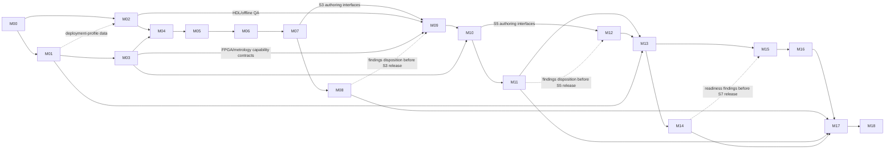

# Curriculum Production Workbench

This folder converts the [Course Master Document](../COURSE_MASTER_DOCUMENT.md) into a chronological execution backlog. It plans the creation, piloting, release, and maintenance of the complete English/French teaching system.

## Governing delivery rule

No lecture unit is complete until learners do something observable with the idea: predict, calculate, simulate, build or inspect, measure, diagnose, redesign, and explain a real claim. Slides support this work; they are never the work itself.

Every technical unit must answer all six questions:

1. What real-life problem, device, failure, or decision makes the concept necessary?
2. What will students predict before receiving the explanation?
3. What will they manipulate, construct, program, inspect, or measure?
4. What evidence will expose the limits of the ideal model?
5. What fault or ambiguity will they diagnose?
6. What constrained design decision will they make and verify?

It must also maintain a technical claim/source register. Enduring claims are derived or tested; device, software, standard, regulation, price, and context claims name the authoritative source/version, retrieval date, domain of validity, reviewer, and review trigger.

## Piece-by-piece production loop

The unit—not the slide deck and not the whole course—is the normal production batch. For each stable unit ID, the team tracks child work for every applicable resource, language edition, approval facet, pilot, defect, and release:

`brief + claims → shared EN/FR technical contract → evidence/assessment design → author → independent check → physical test → second-instructor and learner pilot → correct → QA/release`

Each course has a manifest generated from the canonical §12 sequence. It contains one row per unit and every applicable §13.1 resource type, with owner, effort estimate, dependency, EN/FR state, technical/safety/accessibility/license/build approvals, equipment paths, instructor/learner pilot evidence, defects, and release tag. A high-level task such as “Produce ESE221” is complete only when all manifest child items pass; an outline or chapter draft cannot close it. Omitted canonical content or a non-applicable resource requires an approved outcome/dependency disposition.

Lifecycle states are **brief → drafting → technically verified → staff-piloted → formative learner-usability pilot → pilot-ready → cohort-piloted → release candidate → stable → retired**. `pilot-ready` is a controlled prerelease channel, not a claim of successful cohort delivery: before it, the unit is tried with learners representing the intended EN and FR pathways; before `stable`, a broader cohort exercises the declared accessibility and equipment paths. Approval facets run in parallel and do not become true merely because the lifecycle state advanced. Limit work in progress whenever review, translation, laboratory, or pilot queues cannot keep pace; finish a defensible vertical slice before opening another large batch.

## How to use the milestone files

- Complete **releases** in dependency order. Drafting may overlap only after the named authoring-entry evidence exists.
- Every overlapping milestone has two controls: an **authoring entry gate** (stable upstream contracts/equipment sufficient to start reversible drafting) and a **release gate** (all named upstream pilot findings and required approvals dispositioned). Starting early never waives release evidence.
- A checked task means its artifact exists and its register links objective evidence plus the named approver; drafting alone is not completion.
- A milestone closes only when every mandatory exit criterion has objective evidence.
- EN and FR editions advance together. An English-only artifact may be an internal draft, never a released student resource.
- Staff pilot hazardous, expensive, field-facing, PCB, radio, security, and capstone activities at least one teaching term before students use them.
- If time or money is constrained, protect safety, hands-on measurement/debugging, individual competence, core labs, and project integration before polished media or frontier hardware.

## Task notation

Each task ID uses `Mnn-En-Tnn`:

- `Mnn`: milestone number;
- `En`: epic within that milestone;
- `Tnn`: task within the epic.

Tasks may name these evidence classes:

- **DEC** — approved decision record;
- **SPEC** — controlled specification or structured data;
- **MAT** — student/instructor teaching material;
- **HW** — qualified hardware, fixture, or inventory;
- **TEST** — automated, bench, usability, or field test evidence;
- **REV** — technical, language, safety, accessibility, or external review;
- **REL** — tagged and archived controlled prerelease or stable release; the task must name the channel and authority.

## Chronological milestone index

| Milestone | Planned window* | Outcome | Depends on |
|---|---|---|---|
| [M00](00-program-charter-and-governance.md) | Months 0–1 | Program authority, scope, owners, decision process | Master document |
| [M01](01-local-context-needs-and-regulatory-mapping.md) | Months 0–2 | Local needs, learner evidence, legal/accreditation constraints | M00 |
| [M02](02-content-operations-and-repository-foundation.md) | Months 1–3 | Structured curriculum data, templates, build, CI, offline workflow | M00; inputs from M01 |
| [M03](03-laboratory-safety-platforms-and-procurement.md) | Months 1–4 | Safe, costed, qualified minimal, standard, and advanced lab paths | M00–M01 |
| [M04](04-bilingual-exemplar-and-quality-gate.md) | Months 2–5 | One complete bilingual hands-on unit proves the production system | M02–M03 |
| [M05](05-entry-diagnostic-and-bridge-program.md) | Months 3–6 | Diagnostic and optional practical bridge | M01–M04 |
| [M06](06-semester-1-content-production.md) | Months 4–9 | Complete S1 teaching package and M1 | M04–M05 |
| [M07](07-semester-2-content-production.md) | Months 7–12 | Complete S2 teaching package and M2 | M06 interfaces approved |
| [M08](08-year-1-pilot-remediation-and-release.md) | First S1 delivery through 6–8 weeks after S2 | Piloted, corrected Year-1 release and G1–G4 evidence | M06–M07 pilot-ready releases |
| [M09](09-semester-3-content-production.md) | Months 10–18 | Complete S3 subsystem/instrumentation package and M3 | M07; M08 findings feed release |
| [M10](10-semester-4-content-and-first-pcb.md) | Months 14–24 | Complete S4 package, custom-PCB M4, first product-realization milestone | M09; M03 platform qualification |
| [M11](11-year-2-pilot-and-product-release.md) | First S3 delivery through correction after S4 | Piloted Year-2 release, calibrated lab and external review | M09–M10 pilot-ready releases |
| [M12](12-semester-5-advanced-systems-production.md) | Months 20–30 | RTOS, RISC-V architecture/RTL, FPGA implementation, mixed-signal, RF, reliability and M5 | M10 authoring interfaces; M11 findings before release |
| [M13](13-semester-6-field-systems-production.md) | Months 25–36 | DSP, energy/control, Linux, IC/compliance, governed M6 field pilot | M01, M11–M12 |
| [M14](14-year-3-pilot-and-licence-exit-validation.md) | First S5 delivery through correction after S6 | Piloted Year 3 and externally moderated 180-credit exit evidence | M12–M13 pilot-ready releases |
| [M15](15-semester-7-specialization-and-capstone-launch.md) | Months 30–42 | Approved electives, research/security/enterprise packages and CAP401 | M13; M14 findings feed release |
| [M16](16-semester-8-capstone-internship-and-handover.md) | Months 38–48 | CAP402, internship/clinic, frontier seminar and qualified handover | M15 |
| [M17](17-full-program-validation-and-stable-release.md) | 4–6 months after first complete-cohort evidence | Full outcome audit, external moderation and stable program release | M08, M11, M14, M16 |
| [M18](18-continuous-improvement-and-technology-radar.md) | Annual | Maintained, secure, locally relevant and current curriculum | M17; then recurrent |

\* Month windows identify earliest controlled authoring, not a promise of stable release. Pilot/correction milestones follow actual cohort delivery. Overlap means different trained teams may work concurrently after the authoring-entry evidence; it never waives a release gate or the one-term-early staff pilot.

## Dependency map

Solid arrows are authoring-entry dependencies. Dotted arrows are evidence that must be dispositioned before the downstream teaching-material release. Each milestone file names the exact intermediate baseline; a milestone number alone is not sufficient evidence.

## Program-wide terminology

- **Workbench milestone `M00`–`M18`:** curriculum-production phase. **Student Project `M1`–`M8`:** learner product challenge. Always retain the prefix or the word *Project* where confusion is possible.
- **Program competence gate `G1`–`G9`:** mandatory individual competence decision. **Engineering design review:** Needs/SRR/PDR/CDR/TRR/qualification/acceptance/release review of a product. **Unit release gate:** teaching-material QA. **Milestone exit:** authorization to close a workbench milestone.
- **Teaching-material release**, **product release**, and **cohort baseline** are distinct. A product tag does not release a course; a course tag does not prove a student product.
- **Minimal, standard, advanced** are equipment paths. A shared-regional laboratory is an access/ownership model, not a fourth equipment tier.
- **EN/FR parity** means the same outcomes, cognitive demand, safety, allowed support, evidence threshold, and fair access; prose and examples need not be literal mirrors.
- **Deployment profile** is a dated jurisdiction/institution overlay. **Project context** is an evidence-backed user/field brief. “Local” is never universal: the artifact names the place and organization.
- Use **license** for permissions, **Licence** only for an approved LMD award, **SBOM** for a software bill of materials, and **hardware BOM/HBOM** for hardware. Lawful RF work names its jurisdiction and authorization separately from the engineering link budget.

## Program-wide definitions

### Hands-on intensity

For each technical course, at least 35% of scheduled technical contact time is laboratory, studio, active tutorial, or project work. An instructor demonstration does not count merely because students predict; a student-operated investigation can count when learners generate and interpret evidence. Every chapter includes a physical or data-grounded exploration where relevant. Every core technical course contains physical practical evidence and individual reasoning evidence.

### Real-life connection

A context is valid only when it changes an engineering choice. “Used in agriculture” is decoration; temperature, dust, sensor drift, unreliable power, repair interval, cost ceiling, user language, and acceptance test are requirements. Context briefs must be based on observation, credible data, partner input, or documented professional practice.

### Resource completeness

A normal technical course is not released without its syllabus, diagnostic, chapters, lecture/studio plans, slides, demonstrations, guided explorations, psets and solutions, labs, MCQ bank, practical/design assessments, professor notes, figures/source files, reference code/simulation/HDL/PCB, remediation/enrichment paths, technical claim/source registers, project contribution/provenance dossiers where applicable, and QA record.

### Deployment-profile contract

Universal curriculum content never embeds one country's unversioned assumptions. A deployment profile stores jurisdiction and institution, award/credit mapping, languages and user-communication needs, currency plus source currency/rate, calendar, climate/environment, grid/power quality, connectivity, computing/facilities, regulation, radio authorization, suppliers/customs, repair/manufacturing/service/e-waste capability, accessibility support, partners, authoritative sources, owner, effective date, uncertainty, and review due date. The initial profile may be Benin and use XOF; another country instantiates the same schema.

### Local value and product authority

Student Projects use the master V0–V4 ladder. Their contribution/provenance dossier distinguishes locally controlled need definition, architecture, electronics/PCB/firmware/HDL, enclosure/harness, assembly, test/calibration, documentation, deployment, and service from imported parts, tools, designs, and services. A “locally designed,” “locally built,” or “Made in …” statement is allowed only when the named jurisdiction's current rules and the traceable process evidence support those exact words. Local content is a capability objective, never a substitute for technical quality.

### Unit release gate

Each unit must pass alignment, claim/source accuracy, technical, physical-pilot, safety, bilingual parity, accessibility, licensing, automated-build, second-instructor usability, and formative EN/FR-pathway learner checks defined in master §§13.12–13.13 plus this workbench before the `pilot-ready` prerelease. A broader cohort pilot is required before `stable`. At either gate it has zero open critical defects; accepted residual defects name owner, impact, due date, and approving authority.
