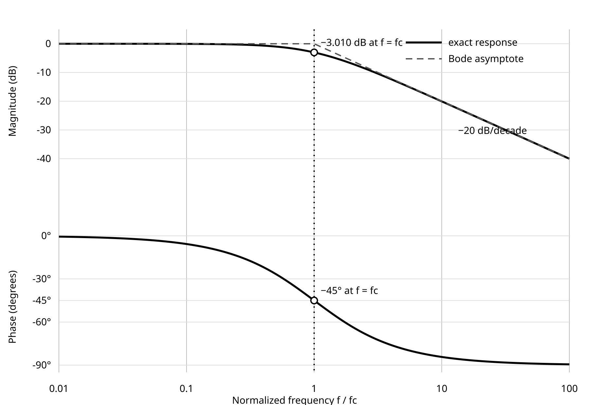

::: {.callout-note title="Chapter maturity — draft"}
This chapter presents a complete instructional path: phasor and impedance
derivations, worked network and resonance examples, executable arithmetic,
explicitly synthetic sweep data, a guarded filter decision, and a full exercise
set. It remains subject to technical and editorial revision. The synthetic data
teach analysis but do not qualify physical hardware; Lab **L05** supplies the
aligned evidence. See the [reading roadmap](../roadmap.qmd) for status meanings.
:::

::: {.callout-warning title="Safety boundary for frequency-response work"}
The practical reasoning here is limited to current-limited, extra-low-voltage,
low-energy circuits under an approved local procedure. A signal generator,
oscilloscope probe ground, and bench supply can share protective earth; attaching
their returns to different live nodes can create a short circuit. De-energize
before changing connections, verify the common reference, respect every source,
probe, and input rating, and stop if the return path or energy boundary is not
understood [@iec61010; @tektronix2024tds3000csafety]. Reading this chapter does
not authorize work on mains, high-energy resonance, RF power, or isolated
high-side circuits.
:::

## Central question

> How can one unchanged circuit pass a slow signal almost intact, attenuate a
> fast signal, and shift the timing between input and output?

Consider a 10.0 k$\Omega$ resistor followed by a 10.0 nF capacitor. The output is
taken across the capacitor. Apply a 1.000 V RMS sine wave. Before calculating,
predict the output at 100 Hz, 1.59 kHz, and 10.0 kHz. The same components produce
three different results:

| Frequency | Ideal output magnitude | Output phase relative to input |
|---:|---:|---:|
| 100 Hz | 0.998 V RMS | $-3.60^\circ$ |
| 1.59 kHz | 0.707 V RMS | $-45.0^\circ$ |
| 10.0 kHz | 0.157 V RMS | $-81.0^\circ$ |

These are calculations, not measurements. The chapter develops them from the
same capacitor relation used in F07, carries that reasoning into impedance and
frequency response, and then asks whether source resistance, load, component
tolerance, and the probe leave enough margin for a design decision. Sinusoidal
steady-state analysis is a standard way to characterize linear circuits because
a linear time-invariant circuit driven by one sinusoid responds at that same
frequency after its transient has decayed [@sedra2020microelectronic;
@oppenheim1996signals].

::: {.callout-tip title="Predict before calculating"}
At very low frequency the capacitor has ample time to charge and discharge with
the source, so expect the output to track the input. At very high frequency the
capacitor current required for the same voltage becomes large, so expect the
output amplitude to shrink and lag. The calculation will replace “low” and
“high” with a dimensionless ratio $\omega RC$.
:::

## Learning outcomes

This chapter assumes [F07](f07-capacitors-inductors-transients.qmd), especially
the ideal capacitor and inductor relations, stored energy, and time constants,
plus the complex arithmetic and graph-reading support in
[M01](../appendices/m01-algebra-units-complex.qmd). After completing it, you
should be able to:

- distinguish instantaneous, peak, peak-to-peak, average, and RMS values, and
  infer phase from a declared time reference;
- represent one-frequency sinusoidal steady state with RMS phasors using the
  $e^{j\omega t}$ convention;
- derive and use $Z_R$, $Z_C$, $Z_L$, admittance, complex KCL, and complex KVL
  with declared voltage and current references;
- derive a loaded transfer function and interpret magnitude, phase, decibels,
  corner frequency, bandwidth, and Bode asymptotes;
- calculate series-resonant frequency, half-power bandwidth, and loaded quality
  factor while identifying the resistance included in each quantity;
- plan a safe frequency sweep, distinguish calculation, executable arithmetic,
  synthetic data, and measurement, and make a guarded pass/fail decision.

## Sinusoidal quantities and phase

### Frequency, angular frequency, and amplitude

A real sinusoidal quantity $x(t)$ can be written

$$
x(t)=X_0+\widehat X\cos(\omega t+\phi),
\qquad \omega=2\pi f,
\qquad T=\frac{1}{f}.
$$ {#eq-f08-sinusoid}

This is a **definition of notation**. $X_0$ is the constant offset,
$\widehat X\ge0$ is peak amplitude, $\phi$ is phase relative to the chosen time
origin, $f$ is frequency in hertz, $T$ is period in seconds, and $\omega$ is
angular frequency in radians per second. Radians are dimensionless in SI, so
$\omega t$ is a valid dimensionless argument [@bipm2019si]. Phase differences
may be reported in radians or degrees, but trigonometric software must be told
which one is being used.

For a zero-offset sinusoid,

$$
X_\text{pp}=2\widehat X,
\qquad
X_\text{RMS}=\frac{\widehat X}{\sqrt 2}.
$$ {#eq-f08-amplitudes}

The first relation is geometric. The second follows from the RMS definition over
one complete period:

$$
X_\text{RMS}
=\sqrt{\frac{1}{T}\int_{t_0}^{t_0+T}x^2(t)\,\mathrm dt}
=\sqrt{\widehat X^2\frac{1}{T}
\int_{t_0}^{t_0+T}\cos^2(\omega t+\phi)\,\mathrm dt}
=\frac{\widehat X}{\sqrt2}.
$$ {#eq-f08-rms}

The result is independent of $t_0$ and $\phi$ only because the integration spans
a whole cycle. A zero-offset sine has zero whole-cycle average but nonzero RMS.
For a waveform with DC offset, the total RMS is
$\sqrt{X_0^2+\widehat X^2/2}$, not $X_0+\widehat X/\sqrt2$. For a nonsinusoidal
waveform, the peak-to-RMS relation in @eq-f08-amplitudes generally does not hold.

**Worked conversion.** A zero-offset 3.00 V peak sinusoid has
$V_\text{pp}=6.00$ V and $V_\text{RMS}=2.12$ V. Conversely, a 230 V RMS
sinusoid would have 325 V peak in the ideal mathematical description. That
conversion is not a safety authorization or a statement about any particular
supply waveform.

### Phase is a relative quantity

Let

$$
x_1(t)=\widehat X_1\cos(\omega t+\phi_1),
\qquad
x_2(t)=\widehat X_2\cos(\omega t+\phi_2).
$$

Define the phase of $x_2$ relative to $x_1$ as
$\Delta\phi=\phi_2-\phi_1$. A positive $\Delta\phi$ means $x_2$ **leads**;
a negative value means it **lags**. If $x_2$ is a delayed copy
$x_1(t-\Delta t)$, then

$$
\Delta\phi=-\omega\Delta t=-2\pi f\Delta t
\pmod{2\pi}.
$$ {#eq-f08-phase-delay}

At 1.00 kHz, a 100 $\mu$s delay corresponds to $-36.0^\circ$. The same delay at
10.0 kHz corresponds to $-360^\circ$, which is visually one whole cycle and is
indistinguishable from $0^\circ$ if only one pair of zero crossings is inspected.
Frequency-response instruments therefore unwrap phase or report a principal
range; the convention must be recorded.

The converse needs care. At one frequency, any phase shift can be expressed as
an equivalent delay modulo one period. A filter whose phase varies with
frequency is generally **not** a pure time delay for an arbitrary waveform,
because its frequency components acquire different phase shifts. Group delay
and waveform reconstruction belong to S01.

### RMS phasors

This chapter uses $j=\sqrt{-1}$, the time convention $e^{j\omega t}$, and **RMS
phasors**. The real sinusoid associated with phasor $\underline X$ is

$$
x(t)=\Re\!\left\{\sqrt2\,\underline X e^{j\omega t}\right\},
\qquad
\underline X=X_\text{RMS}e^{j\phi}
=X_\text{RMS}\angle\phi.
$$ {#eq-f08-phasor-definition}

Thus $x(t)=3.00\sqrt2\cos(\omega t-20^\circ)$ V corresponds to
$\underline V=3.00\angle-20^\circ$ V RMS. The underline is not decoration: it
distinguishes a complex phasor from an instantaneous real value.

A phasor is a compact coefficient, not a rotating physical voltage and not a
complete waveform. It suppresses the common $e^{j\omega t}$ factor. Phasors may
be added directly only when they represent quantities at the **same frequency**.
Offsets, startup transients, switching edges, harmonics from nonlinear elements,
and arbitrary waveforms require separate treatment. S01 later generalizes this
one-frequency idea to spectra and transforms [@oppenheim1996signals].

## Impedance and admittance

### Derivatives become multiplication by $j\omega$

For $x(t)$ represented by @eq-f08-phasor-definition,

$$
\frac{\mathrm dx}{\mathrm dt}
=\Re\!\left\{\sqrt2\,(j\omega\underline X)e^{j\omega t}\right\}.
$$ {#eq-f08-derivative-phasor}

This follows by differentiating $e^{j\omega t}$. It is exact for the stated
sinusoid. It is the bridge from F07's differential equations to algebraic AC
network equations [@sedra2020microelectronic].

For every element below, define voltage positive at terminal A relative to B,
and define current positive entering terminal A. These are passive-sign
references. Define impedance and admittance by

$$
\boxed{\underline Z(\omega)=\frac{\underline V}{\underline I}},
\qquad
\boxed{\underline Y(\omega)=\frac{1}{\underline Z}
=\frac{\underline I}{\underline V}}.
$$ {#eq-f08-zy-definition}

Impedance has units $\Omega$; admittance has units siemens (S). They are complex
ratios of same-frequency phasors, not time-varying resistances.

### Resistor, capacitor, and inductor impedances

Apply @eq-f08-derivative-phasor to the ideal constitutive relations established
in F07:

$$
\begin{aligned}
\text{resistor:}\quad &\underline V=R\underline I,
&\boxed{\underline Z_R=R},\\
\text{capacitor:}\quad &\underline I=j\omega C\underline V,
&\boxed{\underline Z_C=\frac{1}{j\omega C}
=-\frac{j}{\omega C}},\\
\text{inductor:}\quad &\underline V=j\omega L\underline I,
&\boxed{\underline Z_L=j\omega L}.
\end{aligned}
$$ {#eq-f08-element-impedances}

These are exact within ideal, linear, constant-$RLC$, lumped, sinusoidal
steady-state descriptions. A dimensional check for the capacitor gives
$1/(\text{s}^{-1}\text{F})=\text{s}/\text{F}=\Omega$; for the inductor,
$\text{s}^{-1}\text{H}=\Omega$.

| Element | $|\underline Z|$ | Impedance angle | Current relative to voltage |
|---|---:|---:|---|
| ideal resistor | $R$ | $0^\circ$ | in phase |
| ideal capacitor | $1/(\omega C)$ | $-90^\circ$ | leads by $90^\circ$ |
| ideal inductor | $\omega L$ | $+90^\circ$ | lags by $90^\circ$ |

At $f=1.00$ kHz, a 10.0 nF capacitor has

$$
\underline Z_C
=-j\frac{1}{2\pi(1.00\times10^3~\text{Hz})(10.0\times10^{-9}~\text{F})}
=-j15.9~\text{k}\Omega.
$$

The minus sign is phase, not a negative resistance. If the current reference or
voltage polarity is reversed, the corresponding signed phasor reverses; the
physical element has not changed.

The limits recover useful intuition: as $\omega\to0^+$,
$|Z_C|\to\infty$ and $|Z_L|\to0$; as $\omega\to\infty$ the ideal limits reverse.
These are limiting statements, not permission to replace every real capacitor
with a short or every real inductor with an open. Capacitor leakage and inductor
winding resistance dominate their respective low-frequency departures.
Capacitor ESR matters when it becomes comparable with capacitive reactance;
ESL and capacitor self-resonance defeat the ideal capacitor limit
[@vishay2026aluminumcaps; @murataemifilter6]. Inductor winding resistance,
parasitic capacitance, current dependence, and self-resonance defeat the ideal
inductor limits [@coilcraftinductorspecs].

### Complex network laws

KCL and KVL remain conservation laws in sinusoidal steady state. Only the
representation changes:

$$
\sum_k \underline I_k=0,
\qquad
\sum_k \underline V_k=0.
$$ {#eq-f08-complex-kcl-kvl}

Consequently, series impedances add and parallel admittances add:

$$
\underline Z_\text{series}=\sum_k\underline Z_k,
\qquad
\underline Y_\text{parallel}=\sum_k\underline Y_k.
$$ {#eq-f08-series-parallel}

The familiar divider is therefore an **impedance divider**:

$$
\underline V_2
=\underline V_\text{in}
\frac{\underline Z_2}{\underline Z_1+\underline Z_2}.
$$ {#eq-f08-impedance-divider}

It requires a genuine series path carrying one phasor current. A branch added at
the output changes $\underline Z_2$ and therefore changes the result.

```{mermaid}
%%| label: fig-f08-representation-chain
%%| fig-cap: "One linear circuit in synchronized representations. The physical assembly, named schematic, differential relations, phasor equations, transfer function, calculated response, and measured sweep should agree within the declared validity range and uncertainty. A discrepancy sends the investigation back to assumptions, connections, parameters, or measurement loading."
%%| fig-alt: "A vertical flow from physical circuit to named schematic, differential relations, phasor equations, transfer function, calculated magnitude and phase, measured sweep, reconciliation, and decision. A discrepancy loops back to assumptions and loading."
flowchart TB
  P["Physical circuit"]
  S["Named schematic and test points"]
  E["Differential and phasor equations"]
  B["Calculated magnitude and phase"]
  M["Measured sweep"]
  R["Reconcile, decide, and revise if needed"]
  P --> S --> E --> B --> M --> R
```

## AC network analysis

### Worked example: the RC circuit at 1 kHz

Use panel (a) of @fig-f08-rc-frequency. Voltage
$v_\text{in}=V_\text{TP1}-V_\text{TP0}$ is positive at the source-side node,
and $v_\text{out}=V_\text{TP2}-V_\text{TP0}$ is positive at TP2. Capacitor
current $i_C$ is referenced downward into its positive terminal. Assume ideal
$R=10.0$ k$\Omega$, $C=10.0$ nF, a 1.000 V RMS input phasor at $0^\circ$, and
sinusoidal steady state at 1.00 kHz.

{#fig-f08-rc-frequency width="100%" fig-alt="Panel a shows a sinusoidal source driving resistor R and capacitor C, with output TP2 measured across C relative to TP0. Panel b adds source resistance R_S, load resistance R_L, and the probe input represented by parallel resistance R_p and capacitance C_p. TP1 is the source-side test point and TP2 is the loaded output node."}

The series impedance is

$$
\underline Z_\text{total}
=R+\underline Z_C
=10.0~\text{k}\Omega-j15.9~\text{k}\Omega
=18.8~\text{k}\Omega\angle-57.9^\circ.
$$

Therefore

$$
\underline I
=\frac{1.000\angle0^\circ~\text{V}}
{18.8~\text{k}\Omega\angle-57.9^\circ}
=53.2~\mu\text{A}\angle+57.9^\circ,
$$

and

$$
\underline V_\text{out}
=\underline I\underline Z_C
=0.8467~\text{V}\angle-32.1^\circ.
$$

The current leads the input because the branch is net capacitive. Capacitor
voltage lags that current by $90^\circ$, leaving the output $32.1^\circ$ behind
the input. Direct use of @eq-f08-impedance-divider gives the same result. This
agreement between KVL, element phase, and divider arithmetic is a useful error
check.

## Sinusoidal power

Let the voltage and current references at a one-port obey the passive sign
convention, and write

$$
v(t)=\sqrt2 V_\text{RMS}\cos(\omega t+\theta_v),
\qquad
i(t)=\sqrt2 I_\text{RMS}\cos(\omega t+\theta_i).
$$

Average $p(t)=v(t)i(t)$ over one complete period. The double-frequency term
averages to zero, giving the exact whole-cycle sinusoidal result

$$
\boxed{P=V_\text{RMS}I_\text{RMS}\cos\phi},
\qquad \phi=\theta_v-\theta_i.
$$ {#eq-f08-average-ac-power}

Define complex power for RMS phasors as

$$
\boxed{\underline S=\underline V\underline I^*=P+jQ},
\qquad
|\underline S|=V_\text{RMS}I_\text{RMS},
\qquad
\text{power factor}=\frac{P}{|\underline S|}=\cos\phi.
$$ {#eq-f08-complex-power}

$P$ is real power in watts, $Q$ is reactive power in var, and
$|\underline S|$ is apparent power in volt-amperes. With passive references,
an ideal inductor has $Q>0$, an ideal capacitor has $Q<0$, and both have
$P=0$. “Reactive power” does not mean energy is destroyed: ideal $L$ and $C$
exchange energy with the network and return it, so their net stored-energy
change over a whole steady-state cycle is zero. During startup or shutdown,
accumulation need not vanish. This distinction follows the energy boundary
account of F05 and the standard RMS-phasor convention [@sedra2020microelectronic].

For the 1.00 kHz RC example, the **network absorbs**
$|S|=(1.000~\text{V})(53.2~\mu\text{A})=53.2~\mu\text{VA}$ at
$\phi=-57.9^\circ$, so
$\underline S_\text{network}=28.3-j45.0~\mu\text{VA}$. The resistor dissipates
$I^2R=28.3~\mu$W; the ideal capacitor has zero whole-cycle average power. The
loop current leaves the source's positive terminal, so under passive references
the source instead absorbs
$\underline S_\text{source}=-28.3+j45.0~\mu\text{VA}$—equivalently, it
delivers 28.3 $\mu$W of average real power. That closes the whole-cycle account
within the ideal circuit.

## Transfer functions and Bode response

### The RC low-pass relation

For panel (a) of @fig-f08-rc-frequency, define the frequency response from the
input test-point voltage to the capacitor voltage as

$$
\underline H(j\omega)
=\frac{\underline V_\text{out}}{\underline V_\text{in}}.
$$ {#eq-f08-transfer-definition}

This ratio is a **definition**. Applying the impedance divider gives

$$
\underline H_\text{LP}(j\omega)
=\frac{1/(j\omega C)}{R+1/(j\omega C)}
=\boxed{\frac{1}{1+j\omega RC}}.
$$ {#eq-f08-rc-lowpass}

Therefore

$$
|\underline H_\text{LP}|
=\frac{1}{\sqrt{1+(\omega RC)^2}},
\qquad
\angle\underline H_\text{LP}
=-\tan^{-1}(\omega RC).
$$ {#eq-f08-rc-lowpass-mag-phase}

The dimensionless product $\omega RC$ decides the operating region. Define the
corner angular frequency and corner frequency by

$$
\boxed{\omega_c=\frac{1}{RC}=\frac{1}{\tau}},
\qquad
\boxed{f_c=\frac{1}{2\pi RC}=\frac{1}{2\pi\tau}}.
$$ {#eq-f08-rc-corner}

This is the promised bridge to F07: the same time constant that sets exponential
settling sets sinusoidal corner frequency. Units check as
$1/(\Omega\,\text{F})=\text{s}^{-1}$.

At $\omega=\omega_c$, magnitude is $1/\sqrt2$, phase is $-45^\circ$, and the
squared voltage ratio is one-half. Calling this a “half-power point” is valid
only when the compared powers share the same resistive denominator; a voltage
ratio alone does not establish a general power ratio.

### Decibels and asymptotes

A power ratio expressed in decibels is

$$
G_\text{dB}=10\log_{10}\!\left(\frac{P_2}{P_1}\right).
$$ {#eq-f08-db-power}

Independently, define the decibel value of a voltage transfer ratio as

$$
G_\text{dB}=20\log_{10}|\underline H|.
$$ {#eq-f08-db-amplitude}

This voltage-ratio definition does not require equal impedances. Equal
impedances are required only when interpreting that same number as the
corresponding power ratio, because then power is proportional to voltage
squared. Do not infer power gain from a voltage ratio when the two voltages see
different impedances. For orientation, $|H|=0.5$ is $-6.02$ dB; conversely,
$-20$ dB corresponds to $|H|=10^{-20/20}=0.1$.

For a first-order low-pass:

- $f\ll f_c$: $|H|\approx1$, phase $\approx0^\circ$;
- $f=f_c$: $|H|=0.7071$, magnitude $=-3.010$ dB, phase $=-45^\circ$;
- $f\gg f_c$: $|H|\approx f_c/f$, giving $-20$ dB per decade and phase
  approaching $-90^\circ$.

The asymptotes are approximations, not the exact curve at the corner. A Bode
plot places frequency on a logarithmic axis and shows magnitude in decibels and
phase in degrees; this makes corners, slopes, and bandwidth visible over many
decades [@oppenheim1996signals; @astrom2021feedback]. For a first-order
low-pass, bandwidth extends from DC to the frequency where magnitude has fallen
to $1/\sqrt2$ of the passband plateau. If the loaded plateau is $K<1$, the
bandwidth threshold is $K/\sqrt2$, not an absolute gain of 0.707.

@fig-f08-bode shows the exact normalized response and its straight-line
magnitude approximation. The figure is **calculated**, generated from
@eq-f08-rc-lowpass-mag-phase by the recoverable standard-library script
`curriculum/figures/f08_bode.py`; it is not measured data.

{#fig-f08-bode width="85%" fig-alt="Two vertically aligned plots against logarithmic normalized frequency f over corner frequency. Exact magnitude is near zero decibels at low frequency, is minus 3.010 decibels at the corner, and approaches a dashed minus 20 decibels per decade asymptote. Exact phase moves from zero degrees through minus 45 degrees at the corner toward minus 90 degrees."}

For the 10.0 k$\Omega$, 10.0 nF example,

$$
f_c=\frac{1}{2\pi(10.0~\text{k}\Omega)(10.0~\text{nF})}
=1.59~\text{kHz}.
$$

The opening table now follows directly from @eq-f08-rc-lowpass-mag-phase.
Doubling $C$ halves $f_c$; reversing the output polarity adds $180^\circ$ to
the reported phase but does not change magnitude.

### The RC high-pass relation

Move the output terminals across $R$ while retaining the same series $RC$
network. Then

$$
\underline H_\text{HP}(j\omega)
=\frac{R}{R+1/(j\omega C)}
=\boxed{\frac{j\omega RC}{1+j\omega RC}}.
$$ {#eq-f08-rc-highpass}

Its magnitude is

$$
|\underline H_\text{HP}|
=\frac{\omega RC}{\sqrt{1+(\omega RC)^2}},
$$

and its phase is $90^\circ-\tan^{-1}(\omega RC)$. It suppresses low frequency,
equals $-3.010$ dB at the same $f_c$, and approaches unity at high frequency.
For this **unloaded series pair**, KVL also gives
$H_\text{LP}+H_\text{HP}=1$ as a complex identity. Cascading two sections
usually invalidates that simple complement because the second section loads the
first unless buffering or impedance separation is provided.

### The RL first-order pair

The time/frequency bridge is not peculiar to capacitors. In
@fig-f08-rl-frequency, $i(t)$ is referenced clockwise, $v_R$ is positive from
TP1 to TP2, and $v_L$ is positive from TP2 to TP0. Assume ideal constant $R$ and
$L$, a lumped linear circuit, negligible load at both output ports, and
sinusoidal steady state.

{#fig-f08-rl-frequency width="55%" fig-alt="A sinusoidal source drives resistor R and inductor L in series. Current i is referenced clockwise. TP1 and TP2 span resistor R with v_R positive where current enters; v_L is positive at TP2 relative to return TP0."}

The series impedance is $R+j\omega L$. Applying the impedance divider to each
element gives

$$
\boxed{\underline H_R(j\omega)
=\frac{\underline V_R}{\underline V_\text{in}}
=\frac{R}{R+j\omega L}},
\qquad
\boxed{\underline H_L(j\omega)
=\frac{\underline V_L}{\underline V_\text{in}}
=\frac{j\omega L}{R+j\omega L}}.
$$ {#eq-f08-rl-pair}

The resistor output is low-pass; the inductor output is high-pass. Their common
corner is set by $\omega_cL=R$:

$$
\boxed{f_c=\frac{R}{2\pi L}
=\frac{1}{2\pi\tau_L}},
\qquad \tau_L=\frac{L}{R}.
$$ {#eq-f08-rl-corner}

Thus the same $R=100~\Omega$, $L=100$ mH pair that had
$\tau_L=1.00$ ms in F07 has $f_c=159$ Hz. Increasing total series resistance
shortens the transient time constant and raises the RL corner. Source and
winding resistance belong in that total if they are present; a connected load
requires re-analysis rather than blind substitution [@sedra2020microelectronic].

## Resonance, bandwidth, and quality factor

The RC response has one energy-storage element and no resonance. With both an
inductor and capacitor, electric- and magnetic-field energy can exchange. In a
series RLC circuit this produces a current maximum when the two reactances
cancel [@sedra2020microelectronic].

In @fig-f08-series-rlc, $i(t)$ is referenced clockwise. The measurable sense
resistor voltage $v_M=V_\text{TP1}-V_\text{TP2}$ is positive where current
enters $R_M$. Let $R_\text{loss}$ be an **equivalent** series resistance for
source resistance, inductor winding and core loss, capacitor ESR, and connection
loss that are approximately constant over the resonance band. Then
$R_\Sigma=R_M+R_\text{loss}>0$. The single drawn $R_\text{loss}$ is an
analysis equivalent; its distributed physical contributions are not all
measurable between TP1 and TP2.

{#fig-f08-series-rlc width="75%" fig-alt="A sinusoidal source drives measured resistor R_M, equivalent loss resistor R_loss, inductor L, and capacitor C in one loop. Current i is referenced clockwise. TP1 and TP2 span only R_M so v_M is positive where current enters; TP0 is the zero-volt return."}

The loop impedance is

$$
\underline Z_\text{RLC}
=R_\Sigma+j\left(\omega L-\frac{1}{\omega C}\right).
$$ {#eq-f08-series-rlc-z}

Series resonance is **defined** by zero net reactance:

$$
\omega_0L=\frac{1}{\omega_0C},
\qquad
\boxed{\omega_0=\frac{1}{\sqrt{LC}}},
\qquad
\boxed{f_0=\frac{1}{2\pi\sqrt{LC}}}.
$$ {#eq-f08-resonance}

At $\omega_0$, $Z=R_\Sigma$, current is maximum for a fixed source voltage,
and source current is in phase with source voltage. The inductor and capacitor
voltages can each greatly exceed the source voltage while remaining opposite in
phase. Resonance therefore redistributes voltage and stored energy; it does not
create energy.

For the measured sense-resistor output,

$$
\underline H_M(j\omega)
=\frac{R_M}
{R_\Sigma+j(\omega L-1/(\omega C))}.
$$ {#eq-f08-rlc-bandpass}

Its resonant magnitude is $R_M/R_\Sigma$, not necessarily unity. Its magnitude
falls to $1/\sqrt2$ of that resonant value when

$$
\left|\omega L-\frac{1}{\omega C}\right|=R_\Sigma.
$$

Solving the two quadratic equations gives

$$
\omega_1
=\frac{\sqrt{R_\Sigma^2+4L/C}-R_\Sigma}{2L},
\qquad
\omega_2
=\frac{\sqrt{R_\Sigma^2+4L/C}+R_\Sigma}{2L}.
$$ {#eq-f08-rlc-half-power-roots}

Their exact difference and geometric mean are

$$
\boxed{\Delta\omega=\omega_2-\omega_1=\frac{R_\Sigma}{L}},
\qquad
\sqrt{\omega_1\omega_2}=\omega_0.
$$ {#eq-f08-rlc-bandwidth}

For this **series topology**, define loaded quality factor by

$$
\boxed{Q
=\frac{\omega_0}{\Delta\omega}
=\frac{\omega_0L}{R_\Sigma}
=\frac{1}{\omega_0CR_\Sigma}}.
$$ {#eq-f08-series-q}

Quality factor is dimensionless. “Loaded” matters: adding source, winding,
or connection loss **that has been validly reduced to constant series
resistance** increases $R_\Sigma$, broadens bandwidth, and lowers $Q$. An
external load contributes to $R_\Sigma$ only if that reduction has actually
been derived over the band. An arbitrary shunt load or probe must instead be included in the complete network;
it can change both damping and resonant frequency. Parallel resonators have
different resistance placement and different formulas; @eq-f08-series-q must
not be transplanted by pattern matching.

::: {.callout-note title="Two unrelated uses of Q"}
$Q$ in @eq-f08-complex-power means reactive power and has unit var. $Q$ in
@eq-f08-series-q means resonator quality factor and is dimensionless. Context is
usually enough in advanced work; here, always write the unit or say “quality
factor” so the two cannot be confused. Physically, a larger resonator $Q$ means
less energy is lost per cycle relative to energy stored, and therefore a
narrower normalized resonance under the stated linear conditions.
:::

**Worked example.** Let $R_M=68.0~\Omega$,
$R_\text{loss}=32.0~\Omega$, $L=10.0$ mH, and $C=100$ nF. Thus
$R_\Sigma=100~\Omega$, and

$$
f_0=5.03~\text{kHz},
\qquad Q=3.16,
\qquad \Delta f=\frac{R_\Sigma}{2\pi L}=1.59~\text{kHz}.
$$

The sense-resistor peak is $R_M/R_\Sigma=0.680$ ($-3.35$ dB). The exact
half-power frequencies relative to that peak are 4.30 kHz and 5.89 kHz. Their arithmetic
offsets from $f_0$ are unequal, but their geometric mean is $f_0$ and their
difference is 1.59 kHz. In the ideal constant-element description, the inductor
and capacitor voltages at resonance each have magnitude about $Q$ times the
source. Real ratings, ESR, winding loss, saturation, temperature, and parasitic
self-resonance must be checked before energizing a resonator. If the equivalent
series loss varies materially across 4.30–5.89 kHz, the exact constant-$R_\Sigma$
bandwidth relation no longer applies.

## Loading, parasitics, and measurement bandwidth

### The loaded RC response

Panel (b) of @fig-f08-rc-frequency makes two boundaries explicit. The ideal
Thévenin source $V_S$ and its internal $R_S$ are upstream of the accessible
generator terminal TP1. The filter input is the voltage actually observed at
TP1; its output is TP2. Define $R_T=R_S+R$, $R_P=R_L\parallel R_p$, and
$C_T=C+C_p$. These combinations assume the probe input is adequately described
by $R_p\parallel C_p$ and that all capacitances share TP2 and TP0. The parallel
branch impedance is

$$
\underline Z_P
=R_P\parallel\frac{1}{j\omega C_T}
=\frac{R_P}{1+j\omega R_PC_T}.
$$

Complex KCL at TP2, with currents referenced away from TP2, gives

$$
\frac{\underline V_\text{TP2}-\underline V_S}{R_T}
+\frac{\underline V_\text{TP2}}{R_P}
+j\omega C_T\underline V_\text{TP2}=0.
$$ {#eq-f08-loaded-kcl}

Solving for the source-referenced ratio gives

$$
\boxed{
\frac{\underline V_\text{TP2}}{\underline V_S}
=\frac{K_\text{src}}{1+j\omega\tau_\text{src}}},
\qquad
K_\text{src}=\frac{R_P}{R_T+R_P},
\qquad
\tau_\text{src}=(R_T\parallel R_P)C_T.
$$ {#eq-f08-loaded-lowpass}

That relation includes inaccessible internal $V_S$. A physical two-channel
sweep instead uses the accessible DUT boundary. Repeating KCL with
$\underline V_\text{TP1}$ on the other side of $R$ gives

$$
\boxed{
\frac{\underline V_\text{TP2}}{\underline V_\text{TP1}}
=\frac{K_\text{DUT}}{1+j\omega\tau_\text{DUT}}},
\qquad
K_\text{DUT}=\frac{R_P}{R+R_P},
\qquad
\tau_\text{DUT}=(R\parallel R_P)C_T.
$$ {#eq-f08-measured-lowpass}

Loading changes two distinct things: $K<1$ changes low-frequency gain, while
$\tau$ changes the corner. Treating a probe as “10 M$\Omega$” at every
frequency misses its input capacitance. A probe, oscilloscope, and source form
one interacting measurement system; source impedance and probe capacitance can
alter both amplitude and phase [@tektronixprobesprimer].

**Revealing variation.** A 1.00 M$\Omega$, 100 pF RC low-pass has the same ideal
$f_c=1.59$ kHz as the 10.0 k$\Omega$, 10.0 nF circuit. Connect an illustrative
10 M$\Omega$, 12 pF probe. The loaded DC gain becomes 0.909, the corner becomes
1.56 kHz, and the magnitude at the intended ideal corner is only 0.637 rather
than 0.707. The nominal time constant was unchanged by scaling $R$ up and $C$
down, but measurement intrusion was not. The probe values are representative,
not universal; the selected probe's guaranteed specifications and compatibility
must be checked.

### Component and interconnection limits

Real component parameters depend on frequency, temperature, bias, construction,
and sometimes aging. A capacitor may be approximated by capacitance with ESR,
leakage, and ESL only over a bounded range; beyond self-resonance it can appear
inductive [@vishay2026aluminumcaps; @murataemifilter6]. An inductor has winding
resistance, parasitic capacitance, frequency-dependent loss, and a
current-dependent inductance near saturation [@coilcraftinductorspecs].
Breadboard contacts and long probe returns add resistance and inductance;
probe-ground inductance can itself create ringing [@tektronixprobesprimer]. At
sufficiently large electrical length, node voltage is no longer uniform and a
distributed transmission-line description replaces lumped KCL/KVL
[@ulaby2015electromagnetics; @ott2009electromagnetic].

Symptoms of leaving the simple description include:

- a slope that is not near the expected $\pm20$ dB/decade per first-order
  section;
- a corner that moves when the probe, cable, source impedance, or load changes;
- peaking or ringing absent from the ideal first-order calculation;
- amplitude-dependent response, new harmonics, heating, or drift;
- different results for physically different return-path geometry despite an
  apparently identical low-frequency schematic.

### Frequency-sweep procedure

For an approved L1 RC measurement using panel (b):

1. De-energize. Confirm that generator return, both probe returns, and TP0 may be
   connected. Record source current limit and stop conditions.
2. Record $R$, $C$, tolerances and conditions; generator output impedance;
   probe mode, $R_p$, $C_p$, compensation state, and ground accessory; scope
   bandwidth limit, sample rate, coupling, vertical ranges, and calibration
   status.
3. Connect channel 1 from TP1 to TP0 and channel 2 from TP2 to TP0. The measured
   transfer ratio is $\underline V_\text{TP2}/\underline V_\text{TP1}$; do not
   silently compare TP2 with the generator's unloaded amplitude setting.
4. Use a sine wave with zero offset and an amplitude that keeps every component
   and instrument in its linear range. Verify the input at every frequency.
5. Sweep logarithmically, with extra points near the predicted corner. At each
   point record frequency, input RMS amplitude, output RMS amplitude, phase,
   ranges, and raw instrument indications.
6. Plot $20\log_{10}(|V_\text{out}|/|V_\text{in}|)$ and phase. Compare with the
   **loaded** prediction and its tolerance band, not only the nominal ideal line.
7. Repeat a few points after changing probe mode or load. A shift that matches
   Equation @eq-f08-measured-lowpass is evidence of measurement loading; it is not a DUT
   fault.

Instrument bandwidth is part of the transfer chain. A scope or probe at its
rated $-3$ dB bandwidth already attenuates a sinusoid substantially; the
combined response must be adequate at the highest frequency of interest
[@tektronixprobesprimer]. A bandwidth number alone also does not establish phase
accuracy, noise floor, or uncertainty.

## Evidence reconciliation

### Executable cross-check

The following standard-library Python evaluates the printed relations. It is
**executable arithmetic**, not a circuit simulator and not a measurement.
Complex arithmetic provides an independent check on the hand calculation, while
the explicit parameter names keep resistance, capacitance, and evidence status
visible.

```python
from cmath import phase
from math import log10, pi, sqrt


def rc_low_pass(freq_hz, resistance_ohm, capacitance_f):
    omega = 2.0 * pi * freq_hz
    return 1.0 / (
        1.0 + 1j * omega * resistance_ohm * capacitance_f
    )


def report(freq_hz, response):
    magnitude = abs(response)
    magnitude_db = 20.0 * log10(magnitude)
    phase_deg = phase(response) * 180.0 / pi
    print(f"{freq_hz:8.2f} Hz  {magnitude:7.4f}  "
          f"{magnitude_db:7.3f} dB  "
          f"{phase_deg:7.2f} deg")


resistance_ohm = 10.0e3
capacitance_f = 10.0e-9
corner_hz = 1.0 / (
    2.0 * pi * resistance_ohm * capacitance_f
)

print(f"RC corner: {corner_hz:.2f} Hz")
for freq_hz in (100.0, corner_hz, 10.0e3):
    response = rc_low_pass(
        freq_hz, resistance_ohm, capacitance_f
    )
    report(freq_hz, response)

probe_resistance_ohm = 10.0e6
probe_capacitance_f = 12.0e-12
high_z_resistance_ohm = 1.0e6
high_z_capacitance_f = 100.0e-12
parallel_resistance_ohm = (
    high_z_resistance_ohm * probe_resistance_ohm
    / (high_z_resistance_ohm + probe_resistance_ohm)
)
loaded_capacitance_f = (
    high_z_capacitance_f + probe_capacitance_f
)
loaded_dc_gain = probe_resistance_ohm / (
    high_z_resistance_ohm + probe_resistance_ohm
)
loaded_corner_hz = 1.0 / (
    2.0 * pi
    * parallel_resistance_ohm
    * loaded_capacitance_f
)
print(f"Loaded high-Z corner: {loaded_corner_hz:.2f} Hz")
print(f"Loaded high-Z DC gain: {loaded_dc_gain:.4f}")

series_resistance_ohm = 100.0
inductance_h = 10.0e-3
resonant_capacitance_f = 100.0e-9
resonance_hz = 1.0 / (
    2.0 * pi
    * sqrt(inductance_h * resonant_capacitance_f)
)
quality_factor = (
    2.0 * pi * resonance_hz * inductance_h
    / series_resistance_ohm
)
bandwidth_hz = (
    series_resistance_ohm / (2.0 * pi * inductance_h)
)
print(f"RLC: f0={resonance_hz:.2f} Hz, "
      f"Q={quality_factor:.3f}, "
      f"BW={bandwidth_hz:.2f} Hz")
```

```{=latex}
\newpage
```

Expected output, verified with Python 3:

```text
RC corner: 1591.55 Hz
  100.00 Hz   0.9980   -0.017 dB    -3.60 deg
 1591.55 Hz   0.7071   -3.010 dB   -45.00 deg
10000.00 Hz   0.1572  -16.072 dB   -80.96 deg
Loaded high-Z corner: 1563.13 Hz
Loaded high-Z DC gain: 0.9091
RLC: f0=5032.92 Hz, Q=3.162, BW=1591.55 Hz
```

### Synthetic diagnosis: the corner is low

The table below is **synthetic**. It was generated from $R=10.0$ k$\Omega$ and
a hidden $C=12.0$ nF, then rounded. It teaches diagnosis but qualifies no
physical component or instrument.

| Frequency | Synthetic magnitude | Synthetic phase |
|---:|---:|---:|
| 100 Hz | 0.997 | $-4.31^\circ$ |
| 500 Hz | 0.936 | $-20.7^\circ$ |
| 1.00 kHz | 0.798 | $-37.0^\circ$ |
| 1.59 kHz | 0.640 | $-50.2^\circ$ |
| 5.00 kHz | 0.256 | $-75.1^\circ$ |
| 10.0 kHz | 0.131 | $-82.4^\circ$ |

Both magnitude and phase indicate a corner below 1.59 kHz. The phase reaches
$-45^\circ$ near 1.33 kHz, implying

$$
C_\text{effective}
\approx\frac{1}{2\pi Rf_c}
=\frac{1}{2\pi(10.0~\text{k}\Omega)(1.33~\text{kHz})}
\approx12.0~\text{nF}.
$$

That effective capacitance is an **unallocated quantity**, not yet a proven bad
capacitor. A high component value, probe capacitance, cable capacitance, a larger
series resistance, or a wrong source-impedance assumption can produce similar
terminal evidence. Discriminating tests are to measure de-energized resistance,
repeat with a lower-capacitance probe, characterize the capacitor separately,
and compare TP1 with the actual source terminal. Only after every declared path
has been independently evaluated can a closure residual be assessed.

## Worked design: a bounded low-pass response

### Requirements and nominal selection

Design the low-pass of panel (b) for 20–25 °C with these illustrative
requirements:

- generator output resistance $49~\Omega\le R_S\le51~\Omega$, with the actual
  TP1 input amplitude measured at every frequency;
- load resistance $R_L\ge1.00$ M$\Omega$ over the test band;
- corner relative to passband gain strictly between 1.45 and 1.75 kHz;
- $|H(100~\text{Hz})|>0.980$ and $|H(10.0~\text{kHz})|<0.180$;
- the assembly remains in its linear, lumped range and the measurement loading
  is included or corrected.

Begin with synthesis rather than a guessed component pair. For a nominal
unity-gain first-order response, the corner requirement gives

$$
\frac{1}{2\pi(1.75~\text{kHz})}<\tau
<\frac{1}{2\pi(1.45~\text{kHz})},
\quad\text{or}\quad
90.95~\mu\text{s}<\tau<109.76~\mu\text{s}.
$$

The 100 Hz passband inequality by itself requires
$\tau<323~\mu$s, while the 10.0 kHz stopband inequality requires
$\tau>86.98~\mu$s. The corner interval is therefore the binding nominal
constraint. Choose a target $\tau=100~\mu$s.

The split between $R$ and $C$ is set by loading, not by $\tau$ alone. Requiring
at least 0.990 low-frequency gain with $R_L=1.00$ M$\Omega$ gives
$R\le10.1$ k$\Omega$. A 100 k$\Omega$/1 nF pair has the same nominal corner but
only $K_\text{DUT}=0.909$ at the minimum load, so reject it. Choose
$R=10.0$ k$\Omega$ with $\pm1\%$ total bound and $C=10.0$ nF with
$\pm5\%$ total bound **over the stated conditions**. A purchase tolerance alone
does not automatically include temperature, bias, aging, or frequency effects.
The nominal unloaded corner is 1.592 kHz.

Using the accessible TP1-to-TP2 relation in @eq-f08-measured-lowpass without
probe loading, $K_\text{DUT}=R_L/(R+R_L)$ and
$\tau_\text{DUT}=(R\parallel R_L)C$. The generator's $R_S$ is upstream of TP1,
so it can change the required generator setting but not this measured ratio.
Conservative independent bounds are

$$
K_\text{DUT}\ge0.99000,
\qquad
93.13~\mu\text{s}\le\tau_\text{DUT}\le106.05~\mu\text{s},
$$

which give

$$
1.501~\text{kHz}\le f_c\le1.709~\text{kHz}.
$$

Both bounds remain strictly inside the required interval. At 100 Hz,
$|H|\ge0.9878>0.980$. At 10.0 kHz,
$|H|\le0.1685<0.180$. The inequalities retain margin after component and
minimum-load bounds. Connection resistance and probe capacitance still need
either bounded inclusion or measurement correction; otherwise this is a
component-level feasibility result, not final hardware verification.

### Acceptance test and decision rule

The measurands are low-frequency gain, corner relative to that gain, and the
100 Hz and 10.0 kHz magnitude ratios from TP1 to TP2. Use the sweep procedure
above at 20–25 °C, with the specified source and at least 1.00 M$\Omega$ load.
Record the actual probe impedance description and correct the fitted DUT
response for probe loading only if the correction and its uncertainty are
validated.

Define expanded uncertainty intervals for $f_c$ and each dB ratio using the
documented instrument specifications, repeatability, frequency accuracy,
amplitude extraction, loading correction, and fit method. The decision rule is:

- **pass** only if the entire expanded interval for $f_c$ lies strictly inside
  1.45–1.75 kHz, the entire 100 Hz interval lies above
  $20\log_{10}(0.980)=-0.175$ dB, and the entire 10.0 kHz interval lies below
  $20\log_{10}(0.180)=-14.895$ dB;
- **fail** if an interval lies wholly on the nonconforming side;
- otherwise report **indeterminate** and improve the measurement or margin.

For illustration, suppose the **synthetic** standard-uncertainty contributions
to a fitted corner are 0.012 kHz from repeatability, 0.002 kHz from frequency
accuracy, 0.015 kHz from fitting, and 0.006 kHz from loading correction. Treating
them as uncorrelated gives

$$
u_c=\sqrt{0.012^2+0.002^2+0.015^2+0.006^2}~\text{kHz}
=0.020~\text{kHz}.
$$

Using coverage factor $k=2$ gives $U=ku_c=0.040$ kHz. The often-used
“approximately 95%” interpretation of $k=2$ requires suitable distribution and
degrees-of-freedom assumptions; it is not automatic. Suppose the complete
**synthetic acceptance record** reports
$f_c=(1.61\pm0.04)$ kHz, $G_{100}=(-0.06\pm0.03)$ dB, and
$G_{10\text{k}}=(-16.2\pm0.2)$ dB, where each $\pm$ value is an expanded
uncertainty with its documented coverage basis for the stated procedure. The intervals 1.57–1.65 kHz,
$-0.09$ to $-0.03$ dB, and $-16.4$ to $-16.0$ dB all lie on the conforming side,
so the rule returns pass. This arithmetic demonstrates the rule but does not
qualify a physical filter. Equality at a strict boundary would not pass, and a
typical probe specification cannot be promoted into a guaranteed uncertainty
bound [@jcgm2012conformity].

## Summary

A sinusoid separates amplitude, frequency, and phase. RMS phasors suppress the
common $e^{j\omega t}$ factor, turning derivatives into multiplication by
$j\omega$ and the ideal $RLC$ relations into complex impedances. KCL, KVL,
series/parallel reduction, and divider reasoning then work as algebra in
sinusoidal steady state.

The transfer function $H(j\omega)$ relates output to input at each frequency.
For a first-order RC low-pass and a first-order RL pair, the same time constant
that governs transient settling sets $f_c=1/(2\pi\tau)$; magnitude and phase are
two inseparable parts of the response. Bode plots expose corners and asymptotic
slopes. Adding both $L$ and $C$ permits resonance, whose frequency, bandwidth,
and quality factor depend on topology and on every relevant loss.

The physical circuit, schematic, equations, executable arithmetic, sweep, and
decision describe one object. Source impedance, load, probe capacitance,
component variation, parasitics, and instrument bandwidth are not cleanup
details: they determine whether those descriptions agree. A calculation can
support a prediction; only a documented measurement can support a claim about
an assembly.

## Exercises

### Quick check

Choose one best answer for each item.

1. A zero-offset sine wave is 4.00 V peak. Its RMS value is:

    a. 2.00 V;
    b. 2.83 V;
    c. 4.00 V;
    d. 5.66 V.

2. With the $e^{j\omega t}$ convention and passive references, the impedance of
   an ideal capacitor is:

    a. $j\omega C$;
    b. $-j\omega C$;
    c. $1/(j\omega C)$;
    d. $j/(\omega C)$.

3. At the corner of an ideal first-order RC low-pass, the output is:

    a. 0 dB and $0^\circ$;
    b. $-3.010$ dB and $-45^\circ$;
    c. $-6.020$ dB and $-90^\circ$;
    d. zero because the capacitor is a short.

4. A 10 M$\Omega$ probe can strongly disturb a 1 M$\Omega$, 100 pF filter
   mainly because:

    a. resistance has no meaning in AC analysis;
    b. the probe input capacitance is parallel with the filter capacitor;
    c. RMS meters always double peak voltage;
    d. phase cannot be measured.

5. Increasing total series resistance in a series RLC circuit while holding
   $L$ and $C$ fixed does what?

    a. raises $f_0$ and raises $Q$;
    b. lowers $f_0$ and leaves bandwidth unchanged;
    c. leaves ideal $f_0$ unchanged, broadens bandwidth, and lowers $Q$;
    d. leaves all three unchanged.

6. A calculated filter corner is inside specification, but its expanded
   uncertainty interval crosses a strict limit. The stated decision rule should
   return:

    a. pass because the central value is inside;
    b. pass because equality is acceptable;
    c. indeterminate unless the procedure defines a different justified rule;
    d. fail every component in the batch.

**Answer key:** 1 b — divide peak by $\sqrt2$; 2 c — it equals
$-j/(\omega C)$; 3 b; 4 b — probe impedance is frequency dependent; 5 c — use
@eq-f08-resonance, @eq-f08-rlc-bandwidth, and @eq-f08-series-q; 6 c — the guarded
interval does not establish conformity.

### Retrieval and explanation

1. State the amplitude, time, and complex-exponential conventions used in
   Equation @eq-f08-phasor-definition.
2. Distinguish instantaneous, peak, peak-to-peak, RMS, and average voltage.
3. Explain why a phasor is not a waveform and why phasors at different
   frequencies cannot be added directly.
4. Explain physically why capacitor current leads capacitor voltage under
   passive references.
5. Distinguish impedance from resistance and admittance from conductance.
6. State when $20\log_{10}(V_2/V_1)$ represents a power-gain ratio.
7. Explain why “$Q$ of the resonator” is incomplete unless topology and loading
   are named.

### Estimation and calculation

1. A sine wave is 8.00 V peak-to-peak at 2.00 kHz with zero offset. Find peak,
   RMS, period, and angular frequency. **Self-check:** 4.00 V peak, 2.83 V RMS,
   500 $\mu$s, and 12.6 krad/s.
2. Find $Z_C$ for 47.0 nF at 100 Hz and 10.0 kHz. Report magnitude and phase.
   **Self-check:** $-j33.9$ k$\Omega$ at 100 Hz and
   $-j339~\Omega$ at 10.0 kHz.
3. Find $Z_L$ for 22.0 mH with 18.0 $\Omega$ winding resistance at 1.00 kHz.
   State whether the branch is mostly resistive or inductive.
4. For the chapter's 10.0 k$\Omega$, 10.0 nF low-pass, calculate magnitude,
   dB, and phase at $0.1f_c$, $f_c$, and $10f_c$.
5. A 1.00 V RMS source drives series $R=1.00$ k$\Omega$ and $L=100$ mH at
   1.00 kHz. Find current magnitude and phase, resistor voltage, inductor
   voltage, $P$, and $Q$. Check KVL as a complex sum.
6. A series RLC circuit has $L=4.70$ mH, $C=220$ nF, and
   $R_\Sigma=68.0~\Omega$. Find $f_0$, bandwidth, $Q$, and both half-power
   frequencies. **Self-check:** $f_0=4.95$ kHz, bandwidth $=2.30$ kHz,
   $Q=2.15$, $f_1=3.93$ kHz, and $f_2=6.23$ kHz.

### Derivation and limiting cases

1. Starting from $i_C=C\,\mathrm dv_C/\mathrm dt$ and the declared phasor
   convention, derive $Z_C$. Repeat for $Z_L$.
2. Derive @eq-f08-rms for an arbitrary phase and show why a non-whole-cycle
   interval need not give the same result.
3. Derive @eq-f08-average-ac-power from the product of two cosines. Identify the
   term that averages to zero and the condition that makes it do so.
4. Derive @eq-f08-rc-lowpass-mag-phase and test the limits
   $\omega\to0$, $\omega=1/RC$, and $\omega\to\infty$.
5. Starting from @eq-f08-series-rlc-z, derive @eq-f08-rlc-bandwidth and show that
   $\omega_1\omega_2=\omega_0^2$.
6. Derive @eq-f08-loaded-lowpass. Test $R_P\to\infty$, $C_p\to0$, and
   $R_P\to0$ and explain each physical limit.

### Data interpretation

1. Use the synthetic diagnosis table to estimate $f_c$ independently from
   magnitude and phase. Explain why agreement does not prove a capacitor fault.
2. A synthetic sweep has low-frequency gain $-0.8$ dB but the corner relative
   to that plateau is correct. Which parameter in @eq-f08-loaded-lowpass most
   directly explains the plateau? Propose two discriminating tests.
3. A measured first-order response falls at $-20$ dB/decade until 100 kHz, then
   rises and rings. Compare three hypotheses: capacitor ESL/self-resonance,
   probe-ground inductance, and generator/load mismatch. State one test whose
   predicted result differs for each.
4. An RLC sweep reports $f_1=4.20$ kHz, $f_0=5.00$ kHz, and $f_2=6.10$ kHz.
   Check the arithmetic bandwidth and geometric-mean relation. Decide whether
   the three picked points are internally consistent with a simple series RLC
   half-power interpretation.

### Debugging

1. A filter's corner moves upward when a second scope channel is disconnected.
   Draw both measurement circuits and use impedance to rank likely causes.
2. A low-pass magnitude agrees with calculation but phase is positive. Audit
   channel assignment, polarity, delay convention, phase wrapping, and trigger
   settings before changing the DUT.
3. A series resonator has a much lower $Q$ than predicted. Build a loss inventory
   containing generator resistance, deliberate resistance, winding DCR and core
   loss, capacitor ESR, load, probe, and contacts. Which can be checked with the
   circuit de-energized, and which require frequency-domain evidence?
4. A student uses $20\log_{10}(V_L/V_S)$ to claim power gain greater than one at
   resonance. Explain why a component voltage ratio can exceed one without
   violating energy conservation, and identify the correct power boundary.

### Open design

1. Design a passive RC anti-alias screen with a specified passband, stopband,
   source resistance, ADC input load, tolerance, and temperature range. This is
   not a complete anti-alias filter design: state what later sampling analysis is
   still required in S02.
2. Design a current-limited L1 procedure to measure the $Q$ of a series
   resonator. Include ratings, test points, frequency spacing, amplitude control,
   probe loading, uncertainty, stop conditions, and a guarded acceptance rule.
3. Design two RC networks with the same nominal $f_c$ but resistance values
   differing by a factor of 100. Compare loading, noise susceptibility, source
   current, capacitor availability, and probe intrusion. Recommend one for a
   stated instrument and justify the evidence still needed.

## Connections

Chapter ID: `F08`.

- **Prerequisites:** [F07 — Capacitors, inductors, and transients](f07-capacitors-inductors-transients.qmd)
  supplies constitutive relations, storage, time constants, and steady-state
  boundaries; [M01 — Algebra, units, graphs, and complex numbers](../appendices/m01-algebra-units-complex.qmd)
  supplies trigonometry, complex arithmetic, units, and graph reading; this
  chapter introduces the logarithmic decibel definitions it uses.
- **Next on the dynamics spine:** [S01 — Signals and systems in time and
  frequency](../05-domains/s01-signals-systems.qmd) generalizes sinusoidal
  response to spectra, Fourier/Laplace representations, convolution, poles, and
  zeros. S02, S04, and S07 then use bandwidth for conversion, control, and
  communication.
- **Direct downstream use:** [A03](../02-analog/a03-bias-small-signal-amplifiers.qmd),
  [A04](../02-analog/a04-op-amps-feedback.qmd), and
  [A06](../02-analog/a06-noise-nonlinearity-stability.qmd) use gain, phase,
  loading, and bandwidth; [E04](../04-embedded/e04-buses-networks-protocols.qmd)
  and [R03](../06-realization/r03-signal-power-integrity-emc.qmd) use
  frequency-dependent impedance and return-path reasoning.
- **Practice:** Lab **L05** supplies physical RC/RL transient and Bode evidence
  under the Part I L1 safety boundary. The [practice and project
  spine](../roadmap.qmd#practice-and-project-spine) maps F07–F08 into milestone
  **M2**, a calibrated environmental monitor.
- **Just-in-time support:** [F06 — Measurement, uncertainty, and
  debugging](f06-measurement-uncertainty-debug.qmd) supplies the uncertainty,
  loading, and guarded-decision discipline used in the acceptance test.

## References

Point-of-use citations above identify the canonical circuit and signals texts,
SI and conformity guidance, safety sources, and manufacturer-primary documents
used for probe and component limits. The complete
[bibliography](../references.qmd) contains full details. These sources support
the stated theory and specifications; they do not replace a local safety review
or physical verification of a particular assembly.
