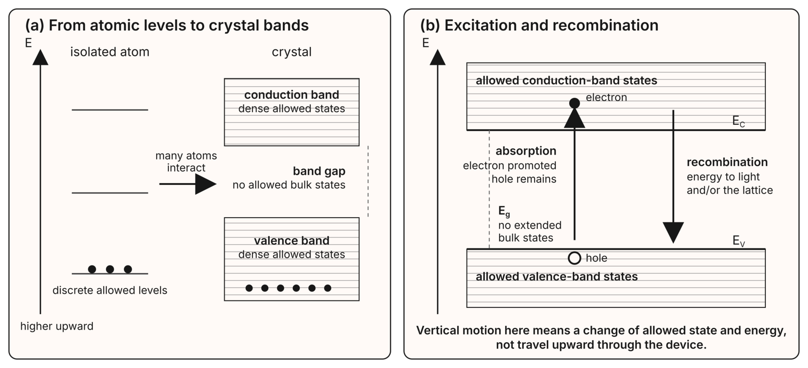
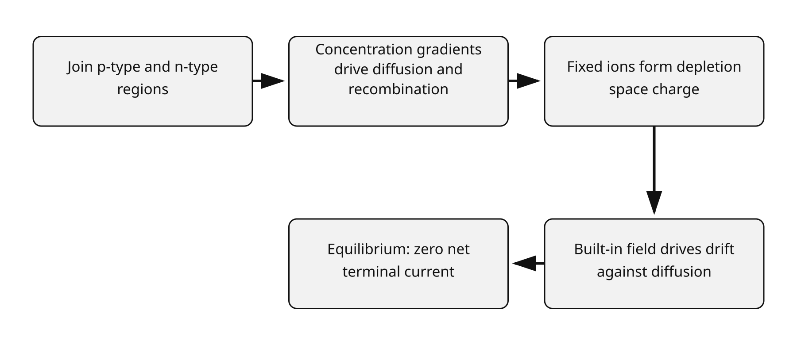
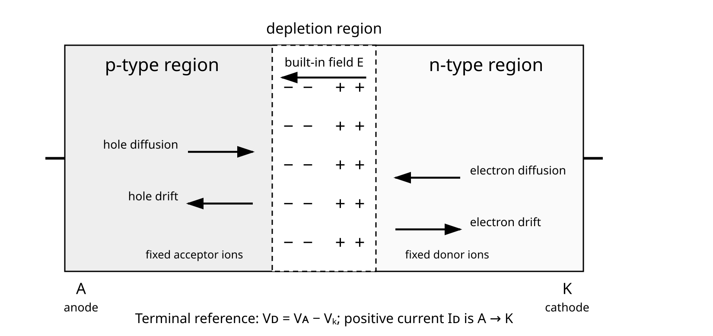
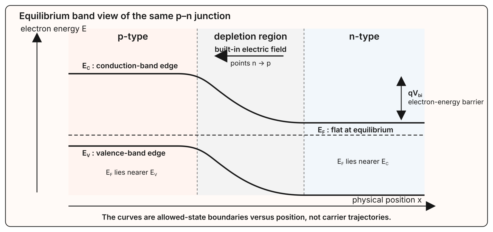
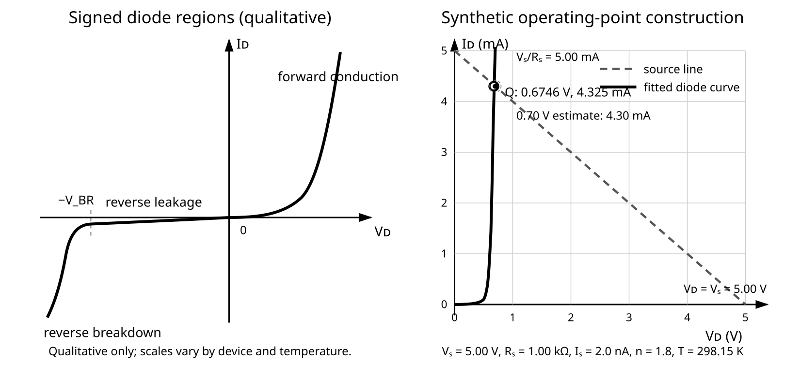
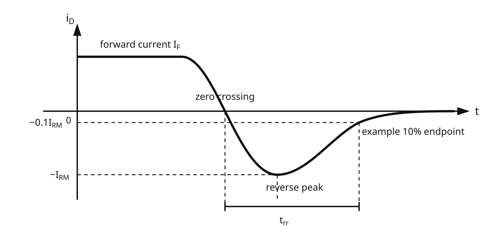

::: {.callout-note title="Chapter maturity — draft"}
This chapter provides a complete instructional path from energy bands and the
p–n junction to diode operating points, rectification, protection, optical
junctions, dynamic limits, datasheet selection, and exercises. Calculated and
synthetic values are identified as such; they are not measurements. Physical
terminal-curve and recovery evidence belongs in aligned Lab **L06**. The chapter
remains subject to technical and editorial revision. See the
[reading roadmap](../roadmap.qmd) for the meaning of status levels.
:::

::: {.callout-warning title="Safety boundary for diode work"}
Any practical work discussed here is limited to **current-limited,
extra-low-voltage** sources, approved components, local supervision, and an
approved procedure. Set the current limit before connecting a diode; a diode
connected without series impedance can fail hot or rupture even from a low
voltage. De-energize before changing polarity or topology, and do not stare into
an energized optical emitter. Bare laser diodes and unclassified optical
assemblies are outside this chapter's practical boundary; use only
institutionally approved, classified laser products and procedures
[@iec60825_1_2014]. This chapter does not authorize mains, high
voltage, high-energy batteries, unqualified optical sources, automotive load
dumps, medical equipment, or safety-critical protection [@iec61010].
:::

## Central question

> How does material physics produce a two-terminal device that conducts
> differently with direction and voltage, and how accurately must a circuit
> describe that behavior?

Place an ordinary silicon signal diode in series with a current-limited source
and a resistor. In an **illustrative** room-temperature sweep, at a diode voltage
of $+0.20$ V the current may be too small for a bench meter to resolve; near
$+0.7$ V it can be milliamperes. Reverse the diode voltage and the indicated
steady current again becomes very small—until a reverse limit is approached.
The transition is steep, but it is not an exact switch at $0.7$ V
[@sedra2020microelectronic; @vishay1n4148].

Before developing the physics, predict what happens in four changes:

- double the series resistance while holding source voltage constant;
- warm the junction while holding forward current constant;
- reverse the diode but remain far below breakdown; and
- change from a slow DC sweep to a fast polarity reversal.

A good answer needs several descriptions of one object. Doping and carrier
motion explain the junction; the symbol declares terminal references; a curve
and equation predict an operating point; a datasheet bounds a manufactured part;
and a measurement tests the assembled circuit. Disagreement among these
descriptions is not noise to hide. It tells us that the wrong region, temperature,
time scale, parasitic, or approximation may have been chosen.

## Learning outcomes

This chapter assumes [F04](../01-foundations/f04-networks-kirchhoff.qmd): KCL,
KVL, Thévenin equivalents, operating points, and declared references. It also
assumes [F05](../01-foundations/f05-energy-power-thermal.qmd): signed terminal
power, thermal resistance, conditional ratings, and margin. After completing the
chapter, you should be able to:

- relate energy bands, electrons and holes, doping, diffusion, drift, depletion,
  and the built-in field to forward conduction, reverse leakage, and breakdown;
- declare diode terminal references and use the junction equation, incremental
  resistance, or a bounded piecewise approximation without confusing one for a
  universal law;
- find a diode operating point from the intersection of a source-network line and
  a nonlinear device relation, then calculate current, voltage, power, and useful
  limiting cases;
- analyze elementary rectifiers and rail clamps, and screen polarity-protection
  and breakdown-reference choices while tracing every current path;
- distinguish major diode families by physical mechanism and terminal behavior,
  then select a plausible family from voltage, current, speed, capacitance, loss,
  optical, RF, and transient requirements without treating its name as a
  guarantee;
- explain at device level how LEDs emit and photodiodes detect light, while
  preserving electrical, radiant, and luminous quantities as distinct; and
- translate circuit requirements into datasheet parameters, account for
  tolerance and operating conditions, and state a guarded acceptance rule.

## Energy bands, mobile carriers, and doping

An energy-band diagram is first of all an **energy map**. Its vertical coordinate
is electron energy, not height or position inside a component. A **band** is a
range containing many quantum-mechanically allowed electron states distributed
through the crystal; it is not a material layer that an electron physically
climbs into.

An isolated atom has discrete allowed electron energies. When a large number of
atoms form a crystal, interactions among them split each relevant atomic level
into an enormous number of closely spaced levels. At circuit scales those levels
are treated as allowed bands. For an ideal semiconductor, the important bands
are the nearly filled **valence band** and the higher, nearly empty
**conduction band**. Let $E_C$ be the lowest conduction-band energy and $E_V$ the
highest valence-band energy. Their difference

$$
E_g\equiv E_C-E_V
$$

is the **band gap**. The gap contains no extended allowed states in the ideal
bulk crystal, although defects and deliberately introduced dopants can add
localized states [@kittel2005solidstate; @sze2006physics].

{#fig-a01-energy-bands fig-alt="Two energy-axis panels. The first shows discrete allowed levels of an isolated atom becoming dense valence and conduction bands when many atoms interact in a crystal, with a band gap between them. The second shows energy absorption promoting an electron from a valence-band state to a conduction-band state and leaving a hole; a reverse recombination transition releases energy. A note emphasizes that vertical motion is a change of state and energy, not upward travel through the device." width="98%"}

In @fig-a01-energy-bands, the horizontal lines represent possible states, while
the filled dots represent electrons occupying some of them. A completely filled
band cannot provide ordinary net conduction: changes available to one occupied
state are cancelled or blocked by the occupation of the other states. Conduction
becomes possible when a band contains both occupied states and nearby empty
states into which carriers can respond to a field.

An **interband excitation** changes an electron's quantum state and energy.
Thermal or optical energy can promote an electron from the valence band into an
available conduction-band state when energy and any required momentum conditions
are met. The missing valence-band electron is described as a mobile positive
**hole**. The reverse process, **recombination**, fills a hole with a
conduction-band electron and transfers energy to emitted light, lattice
vibration, or both. Neither arrow means that the electron has moved upward in
physical space. After excitation, real-space drift or diffusion can move the
electron through the crystal while it remains a conduction-band carrier
[@sze2006physics].

The conduction-band electron has charge $-q_e$, where
$q_e=1.602\,176\,634\times10^{-19}$ C is the exact positive magnitude of the
elementary charge in SI. A hole is not a separate elementary particle stored in
the crystal; it is a collective description of unoccupied valence-band states.
Conventional current follows positive-charge motion and is opposite the average
electron drift direction [@bipm2019si].

The **Fermi level** $E_F$ is an equilibrium occupancy reference, more precisely
the electron chemical potential. It is not a third band and need not equal the
energy of a particular electron. At equilibrium it is spatially constant through
a connected structure. Its position relative to $E_C$ and $E_V$ indicates how
likely states near those band edges are to be occupied: $E_F$ lies nearer $E_C$
in ordinary n-type material and nearer $E_V$ in ordinary p-type material
[@kittel2005solidstate; @sze2006physics].

Two mechanisms move carriers:

- **drift** is directed motion caused by an electric field; and
- **diffusion** is net motion from a region of higher carrier concentration to a
  region of lower concentration.

Random thermal motion is not itself a net current. Drift and diffusion can oppose
one another and cancel at equilibrium even while individual carriers continue to
move [@sze2006physics].

### Donors, acceptors, and charge neutrality

Pure semiconductor material is **intrinsic**. Controlled substitutional
impurities make it **extrinsic**:

- donor atoms add weakly bound electron states near the conduction band. When a
  donor electron is promoted into the conduction band, the donor remains as a
  fixed positive ion, producing **n-type** material whose majority carriers are
  electrons; and
- acceptor atoms add available states near the valence band. When an acceptor
  takes a valence-band electron, it becomes a fixed negative ion and leaves a
  mobile hole, producing **p-type** material whose majority carriers are holes.

The words *n-type* and *p-type* do not mean the bulk material carries a large net
negative or positive charge. Away from junctions, the mobile majority-carrier
charge is approximately balanced by the ionized dopant charge, so the material
remains nearly neutral. Both carrier types remain present: the less numerous type
is the **minority carrier**. Doping primarily changes state occupancy and carrier
concentration; it does not turn the valence and conduction bands into different
physical layers. Temperature, illumination, and injection can also change the
carrier concentrations [@sze2006physics].

## The p–n junction

Join p-type and n-type regions in one crystal. Near the interface, electrons
diffuse from the n side and holes diffuse from the p side because of their
concentration gradients. Recombination removes some mobile carriers near the
interface. It leaves exposed, essentially immobile ionized donors on the n side
and ionized acceptors on the p side. This **space charge** creates an electric
field directed from the positive donor ions toward the negative acceptor ions.

The field drives carriers opposite to diffusion. At thermal equilibrium, drift
and diffusion currents cancel, leaving no net terminal current. The carrier-poor
space-charge region is called the **depletion region**. Its built-in potential is
real inside the junction, but it is not a free external voltage source: contact
potentials elsewhere in an equilibrium terminal structure prevent extraction of
continuous energy from it [@sze2006physics].

{#fig-a01-junction-formation fig-alt="A two-row causal chain. Joining p-type and n-type regions creates concentration gradients. Diffusion and recombination expose fixed ions and form depletion space charge. The built-in field drives drift against diffusion. At equilibrium the net terminal current is zero." width="92%"}

In @fig-a01-junction-formation, joining the two regions creates concentration
gradients; diffusion and recombination expose fixed charge; the resulting field
drives opposing drift; and equilibrium is the condition in which the opposing
terminal-current contributions cancel.

{#fig-a01-pn-junction fig-alt="A horizontal p-type region connected to anode A meets an n-type region connected to cathode K. The depletion region contains fixed negative acceptor ions on the p side and fixed positive donor ions on the n side. The built-in electric field points from n to p. Hole diffusion and electron diffusion point toward the opposite regions; hole and electron drift point oppositely. The terminal reference is V D equals V A minus V K, and positive I D is from A to K." width="95%"}

@Fig-a01-pn-junction is a spatial cross-section, not a band-energy plot and not
to scale. It synchronizes the physical structure with the terminal names and
references used throughout the chapter. At equilibrium the shown diffusion and
drift contributions cancel in net terminal current; the arrows do not imply that
individual carriers stop moving [@sze2006physics].

The same junction can be represented on two axes at once. In the band diagram
below, the horizontal position $x$ runs from the p region to the n region, while
the vertical coordinate remains electron energy. The electrostatic potential
varies across the depletion region, so the electron potential energy
and both band edges bend with position. The edges shift together; their vertical
separation remains approximately the material band gap $E_g$. At equilibrium,
the Fermi level is flat. The difference between the conduction-band edges in the
neutral n and p regions is the built-in electron-energy barrier $q_eV_{bi}$.

{#fig-a01-junction-bands fig-alt="An equilibrium energy-band diagram uses electron energy vertically and physical position horizontally from a p-type region through the depletion region to an n-type region. The conduction- and valence-band edges bend downward together from p to n, maintaining an approximately constant band gap. The equilibrium Fermi level is horizontal. A bracket marks the built-in electron-energy barrier, and an arrow shows the electric field from n toward p. The curves are allowed-state boundaries, not carrier paths." width="98%"}

The band-edge curves are not particle trajectories. In ordinary forward
injection, an electron that crosses spatially from the n region into the p region
is still a conduction-band electron; only when it later recombines with a hole
does it make the interband transition illustrated in @fig-a01-energy-bands. This
distinction separates **transport across a junction** from **transition between
bands**.

### Forward and reverse bias

Call the p-side terminal the **anode** A and the n-side terminal the **cathode** K.
Applying a positive external voltage to A relative to K lowers the junction
barrier and narrows the depletion region. Majority carriers are injected across
the junction and become minority carriers on the other side; their diffusion and
recombination produce a rapidly increasing **forward current**. In the idealized
band picture, forward voltage $V_D>0$ reduces the equilibrium barrier from
$q_eV_{bi}$ toward $q_e(V_{bi}-V_D)$; this is a barrier-energy interpretation,
not a claim that every electron gains exactly that energy.

Applying a negative anode-to-cathode voltage raises the barrier and widens the
depletion region. Majority-carrier injection becomes small. Thermally generated
minority carriers still produce **reverse leakage**, so reverse current is not
identically zero. The widened depletion region also stores electric-field energy
and therefore has capacitance. In the same first-order picture, $V_D<0$ increases
the barrier because $V_{bi}-V_D>V_{bi}$ [@sze2006physics].

At a sufficiently large reverse field, carrier multiplication by impact
ionization (**avalanche breakdown**) or quantum-mechanical tunnelling
(**Zener breakdown**) makes reverse current rise sharply. Real breakdown can
contain both mechanisms. Breakdown is an operating region, not automatically
damage: Zener and transient-suppression diodes are designed and specified for it.
Current must still be limited so that junction current, power, and temperature
remain within their simultaneous ratings. An ordinary signal diode should not be
assumed safe in breakdown merely because a listed breakdown voltage exists
[@sze2006physics; @sedra2020microelectronic].

## Terminal current–voltage behavior

Before writing a signed relation, define the steady diode voltage and current:

$$
V_D\equiv V_A-V_K,
$$

and define $I_D$ positive from anode A to cathode K. Current therefore enters the
terminal marked positive for $V_D$, and the passive-sign-convention power
absorbed by the diode is

$$
P_{D,\mathrm{abs}}=V_D I_D.
$$ {#eq-a01-diode-power}

On the schematic symbol, the bar marks the cathode. A package band often marks
the cathode of a named axial diode such as the cited 1N4148, but package markings
are not universal: confirm the outline and pin definition in the exact
manufacturer datasheet before energizing the circuit [@vishay1n4148].

Forward conduction has $V_D>0$ and normally $I_D>0$, so electrical energy is
absorbed and ultimately transferred to heat and, in an LED, partly to emitted
radiation. Reverse leakage has $V_D<0$ and $I_D<0$ with these references, so the
product is again positive. Reversing the current arrow would reverse the reported
current sign, not the physical behavior.

### The junction current relation

For an ideal abrupt p–n junction under steady conditions, negligible generation
and recombination in the depletion region, low-level injection, uniform
temperature, and negligible series resistance, solving the minority-carrier
transport problem gives the Shockley junction relation [@shockley1949junctions;
@sze2006physics]:

Here **low-level injection** means that the injected excess minority-carrier
concentration remains small compared with the equilibrium majority-carrier
concentration, so the bulk majority population and electric-field distribution
are not substantially altered.

$$
I_D=I_S\left[\exp\!\left(\frac{V_D}{V_T}\right)-1\right].
$$ {#eq-a01-shockley-ideal}

Here $I_S>0$ is the device- and temperature-dependent saturation-current
parameter. The **thermal voltage** is defined by

$$
V_T\equiv\frac{kT}{q_e},
$$ {#eq-a01-thermal-voltage}

where $k=1.380\,649\times10^{-23}$ J/K is the exact Boltzmann constant and $T$ is
thermodynamic temperature in kelvin. The dimensions are

$$
[V_T]=\frac{\text{J/K}\cdot\text{K}}{\text{C}}
=\frac{\text{J}}{\text{C}}=\text{V}.
$$

At $T=298.15$ K ($25.00~^\circ$C), $V_T=25.693$ mV. Raising $V_D$ by one thermal
voltage multiplies the forward exponential term by $e$; raising it by
$V_T\ln 10\approx59.16$ mV multiplies it by ten in the ideal case. The exact SI
constants and the resulting value are sourced from the SI definition
[@bipm2019si]. This is the origin of a steep curve, not an exact threshold. See
[M01](../appendices/m01-algebra-units-complex.qmd) for exponential and logarithm
support.

For circuit fitting, the empirical extension

$$
I_D\approx I_S\left[
\exp\!\left(\frac{V_D}{nV_T}\right)-1\right]
$$ {#eq-a01-diode-fit}

uses an **ideality factor** $n$, commonly fitted over a limited current range.
@Eq-a01-diode-fit is a compact constitutive approximation, not a
universal physical law. Recombination, high-level injection, bulk and contact
resistance, leakage paths, self-heating, and breakdown each make one fitted pair
$(I_S,n)$ fail outside its calibration range [@sze2006physics].
It also does not, without a different constitutive term, describe illumination,
a Schottky barrier, a tunnel-diode negative-slope region, or Gunn
transferred-electron behavior. The family map later in this chapter identifies
which physical feature has changed.

Three limiting cases expose the relation:

- if $V_D=0$, the two terms cancel and $I_D=0$;
- if $V_D\ll-nV_T$ but breakdown is absent, the fit approaches $I_D\approx-I_S$;
  and
- if $V_D\gg nV_T$, the $-1$ term is negligible and forward current is
  approximately exponential.

The reverse limit is especially easy to misuse. A packaged device's actual
leakage may be much larger and more temperature-dependent than the ideal
diffusion $I_S$, and the exponential relation does not describe breakdown.

### Incremental resistance around an operating point

A nonlinear diode has no single global resistance. Around a declared DC
operating point $Q=(V_{DQ},I_{DQ})$, a sufficiently small voltage change
$v_d$ can be related to the resulting current change $i_d$ by the local slope.
Differentiating @eq-a01-diode-fit gives

$$
g_d\equiv
\left.\frac{\mathrm d I_D}{\mathrm d V_D}\right|_Q
=\frac{I_{DQ}+I_S}{nV_T},
$$

so the **incremental resistance** is

$$
r_d\equiv\frac{1}{g_d}
=\frac{nV_T}{I_{DQ}+I_S}
\approx\frac{nV_T}{I_{DQ}}
\quad\text{when }I_{DQ}\gg I_S.
$$ {#eq-a01-incremental-resistance}

The units are V/A = $\Omega$. For the illustrative values $n=1.8$,
$T=298.15$ K, and $I_{DQ}=4.00$ mA, $r_d\approx11.6~\Omega$. This does **not**
mean $V_{DQ}=I_{DQ}r_d$; $r_d$ predicts only small changes around $Q$. If the
signal change is large enough that the curve's slope changes materially, the
linearized relation fails. A02 and A03 build on precisely this distinction
between a large-signal operating point and a local incremental description.

For example, at the stated operating point a $+5.0$ mV perturbation predicts

$$
i_d\approx\frac{5.0~\text{mV}}{11.6~\Omega}=0.43~\text{mA}.
$$

The perturbation is only about $0.11nV_T$, so a local estimate is plausible. A
$+100$ mV change would instead give a linear prediction of $8.6$ mA, while the
fitted exponential term alone changes by
$\exp[100~\text{mV}/(nV_T)]\approx8.7$; starting from 4.00 mA, that implies a
current change near 31 mA before series resistance and self-heating are included.
The wide disagreement is the warning: incremental resistance is a tangent, not a
large-signal replacement for the nonlinear relation.

## Bounded approximations for circuit analysis

The most detailed equation is not always the best engineering choice. The
appropriate description is the least complicated one that preserves the
decision being made.

| Approximation | Constitutive statement | Useful when | It cannot establish |
|---|---|---|---|
| ideal diode | conducting: $V_D=0$, $I_D\ge0$; blocking: $I_D=0$, $V_D\le0$ | path tracing, polarity, first estimates | forward loss, leakage, temperature, recovery, ratings |
| constant drop | on: $V_D=V_\gamma$, $I_D\ge0$; off: $I_D=0$, $V_D\le V_\gamma$ | current estimate when supply headroom greatly exceeds drop variation | behavior near onset or across decades of current |
| piecewise linear | on: $V_D=V_\gamma+I_Dr_f$, $I_D\ge0$, $r_f\ge0$; off: $I_D=0$, $V_D\le V_\gamma$ | a bounded current range with fitted slope $r_f$ | exponential curvature outside the fitted interval |
| exponential fit | @eq-a01-diode-fit | isothermal DC behavior in its fitted region | series-resistance dominance, breakdown, charge storage, self-heating |
| incremental | $i_d\approx v_d/r_d$ around $Q$ | changes small enough that local slope is nearly constant | a new bias point or large waveform |

: Diode descriptions are alternatives selected by purpose, not stages of one
mandatory calculation. Parameters marked fitted or approximate require a stated
source and operating range. {#tbl-a01-approximations}

For every switching approximation, the inequalities matter. Under the ideal
description, a proposed conducting solution is valid only if its solved current
is nonnegative; a proposed blocking solution is valid only if its voltage is
nonpositive. Under the constant-drop and piecewise descriptions, use their
$V_\gamma$ boundaries in @tbl-a01-approximations. This **assume, solve, verify**
procedure prevents choosing a state by visual intuition and never checking it.

The phrase “silicon diode drop is $0.7$ V” is therefore a rule-of-thumb screen.
It may be excellent when a 24 V path is being traced and unacceptable when a
1.0 V headroom or a precise clamp level is at stake. Forward voltage belongs to
an operating point, a part population, and a temperature—not to silicon as an
exact constant.

## Operating points in source–diode networks

Replace any linear source network at the diode port by its Thévenin voltage
$V_S$ and resistance $R_S>0$, as shown in @fig-a01-diode-operating-point. Keep
$V_D$ positive at the anode and $I_D$ entering it.

{#fig-a01-diode-operating-point fig-alt="A voltage source V S drives resistor R S and diode D1 in series. Diode current I D is referenced clockwise and enters the diode anode. Diode voltage V D is positive at the anode relative to the cathode. Test points TP S, TP1, and TP0 expose the source, diode anode, and zero volt reference." width="82%"}

KVL and the resistor relation give the exact source-network line

$$
V_S=I_D R_S+V_D,
\qquad
I_D=\frac{V_S-V_D}{R_S}.
$$ {#eq-a01-load-line}

@Eq-a01-load-line is not a diode law. It contains every $(V_D,I_D)$ pair
the linear source network permits. The device relation contains every pair the
chosen diode description permits. Their intersection is the operating point.
The line has intercepts $I_D=V_S/R_S$ at $V_D=0$ and $V_D=V_S$ at $I_D=0$.
These provide immediate bounds for $V_S>0$: $0\le V_D\le V_S$ and
$0\le I_D\le V_S/R_S$ if the diode is forward conducting.

{#fig-a01-diode-curves fig-alt="Two plots use diode voltage V D on the horizontal axis and diode current I D on the vertical axis. The left qualitative signed curve shows small reverse leakage, steep reverse breakdown, and steep forward conduction. The right synthetic plot shows the fitted exponential curve intersecting the line for a 5 volt source and 1 kilohm resistance at Q equals 0.6746 volt and 4.325 milliampere. It also marks the 5 milliampere current intercept, the 5 volt voltage intercept, and the nearby 0.70 volt constant-drop estimate." width="95%"}

The left panel of @fig-a01-diode-curves names the signed regions but is not to
scale. The right panel is **synthetic illustrative data** generated from the
parameters used below. It teaches the graphical intersection and does not
qualify a physical diode. The two source-line intercepts and the point $Q$ are
the graphical counterparts of @eq-a01-load-line and the executable
solution.

### Worked example: estimate, solve, and interrogate

Let $V_S=5.00$ V and $R_S=1.00~\text{k}\Omega$. First use a constant-drop
estimate $V_D\approx0.70$ V:

$$
I_D\approx\frac{5.00~\text{V}-0.70~\text{V}}
{1.00~\text{k}\Omega}
=4.30~\text{mA}.
$$

The diode's estimated absorbed power is

$$
P_D\approx(0.70~\text{V})(4.30~\text{mA})=3.01~\text{mW}.
$$

The resistor absorbs $I_D^2R_S\approx18.5$ mW and the source delivers about
$21.5$ mW; the signed terminal-power sum closes to rounding. This check does not
prove the assumed $0.70$ V. It only proves that the arithmetic is internally
consistent with that approximation.

For an **illustrative synthetic** exponential fit, take
$I_S=2.0$ nA, $n=1.8$, and $T=298.15$ K. These are teaching parameters, not a
fit to a named production diode. Bisection can solve the intersection without a
third-party library:

```python
from math import exp

k_b = 1.380649e-23       # J/K, exact SI value
q_e = 1.602176634e-19    # C, exact SI value
temp_k = 298.15          # K, illustrative isothermal junction
source_v = 5.00          # V
series_ohm = 1000.0      # ohm
sat_a = 2.0e-9           # A, illustrative fitted parameter
ideality = 1.8           # dimensionless, illustrative fit
thermal_v = k_b * temp_k / q_e

low_v, high_v = 0.0, source_v
for _ in range(100):
    diode_v = (low_v + high_v) / 2
    diode_a = sat_a * (
        exp(diode_v / (ideality * thermal_v)) - 1
    )
    line_a = (source_v - diode_v) / series_ohm
    if diode_a < line_a:
        low_v = diode_v
    else:
        high_v = diode_v

diode_v = (low_v + high_v) / 2
diode_a = (source_v - diode_v) / series_ohm
print(f"V_T = {thermal_v * 1e3:.3f} mV")
print(f"V_D = {diode_v:.4f} V")
print(f"I_D = {diode_a * 1e3:.3f} mA")
print(f"P_D = {diode_v * diode_a * 1e3:.3f} mW")
```

Expected output, reproduced with Python 3:

```text
V_T = 25.693 mV
V_D = 0.6746 V
I_D = 4.325 mA
P_D = 2.918 mW
```

The executable result is arithmetic from an assumed constitutive fit; it is not
a circuit simulation and not a measurement. Its value is that every assumption
is visible and the nonlinear intersection can be reproduced.

Interrogate the result:

- As $R_S\to\infty$ under the stated connected-diode relation, both $I_D$ and
  $V_D$ approach zero while $I_DR_S\to V_S$: nearly all source voltage appears
  across the increasingly large resistor. Near the origin,
  $I_D\approx I_SV_D/(nV_T)$, so the approach can be slow when
  $nV_T/I_S$ is tens of megohms. The constant-drop approximation fails in this
  limit.
- As $R_S\to0^+$, the source attempts to impose its voltage directly on the
  exponential device; current becomes extremely sensitive to parasitic series
  resistance and self-heating. The ideal voltage source plus ideal exponential
  description ceases to be physically adequate.
- Doubling $R_S$ to $2.00~\text{k}\Omega$ does not exactly halve current because
  $V_D$ also changes, but the current will be near half because the diode-voltage
  change is small compared with the 5 V source.
- Reversing $V_S$ to $-5.00$ V places the diode in reverse bias. The constant-drop
  forward approximation must be discarded; leakage and reverse rating become the
  relevant quantities.

### Evidence from a terminal sweep

A physical DC sweep should record pairs $(V_D,I_D)$, not merely the source
setting. The source resistance and meter loading belong in the same circuit. A
defensible record names the diode lot or specimen, mounting, ambient and estimated
junction temperature, source current limit, test points, instruments and ranges,
calibration state, raw observations, and uncertainty basis.

Reconcile in this order:

1. predict the region and order of magnitude;
2. calculate with a stated approximation;
3. compare against a manufacturer table or curve under its stated conditions;
4. measure the same terminal quantities at named test points; and
5. attribute a discrepancy only after checking temperature, polarity, resistor
   tolerance, meter burden, contacts, and self-heating.

A typical datasheet curve represents typical manufacturer characterization, not
a guaranteed limit for every unit. A chapter-generated curve from @eq-a01-diode-fit
is synthetic. Neither is a measurement of the bench specimen.
The evidence labels must remain visible even when all three curves look similar.

## Rectification

A rectifier makes current through a load predominantly one-directional. It does
not by itself regulate the output, remove ripple, or provide isolation.
The circuit in @fig-a01-half-wave-rectifier shows the simplest case with a
resistive load and no energy-storage element.

{#fig-a01-half-wave-rectifier fig-alt="A time-varying voltage source v s drives diode D1 and load resistor R L in series. Diode current i D points from source to load. Output voltage v o is positive at TP2 relative to zero volt test point TP0; TP1 observes the source." width="85%"}

Define $v_s(t)$ as the instantaneous TP1 voltage relative to TP0 and $v_o(t)$ as
TP2 relative to TP0. With an ideal diode and $R_L>0$,

$$
v_o(t)=
\begin{cases}
v_s(t), & v_s(t)\ge0,\\
0, & v_s(t)<0.
\end{cases}
$$ {#eq-a01-half-wave-ideal}

For a real forward drop $V_F$ treated as constant over the conducting interval,
$v_o(t)\approx\max[0,v_s(t)-V_F]$. That expression is piecewise and approximate;
the actual transition is smooth, and $V_F$ varies with current and temperature.

For the explicitly defined sinusoid $v_s(t)=V_p\sin(\omega t)$ with $V_p>0$,
define phase variable $\theta\equiv\omega t$. The ideal rectifier conducts for
$0<\theta<\pi$. Its whole-cycle average is

$$
\overline V_o
=\frac{1}{2\pi}
\int_0^{2\pi}v_o(\theta)\,\mathrm d\theta
=\frac{V_p}{2\pi}\int_0^\pi\sin\theta\,\mathrm d\theta
=\frac{V_p}{\pi}.
$$ {#eq-a01-half-wave-average}

The average is positive, but the output still falls to zero for half the cycle.
Squaring before averaging gives

$$
V_{o,\mathrm{RMS}}
=\sqrt{\frac{1}{2\pi}\int_0^\pi V_p^2\sin^2\theta\,\mathrm d\theta}
=\frac{V_p}{2}.
$$

The resistor's average power is therefore $V_p^2/(4R_L)$. Average voltage and
RMS voltage answer different questions. See
[M02](../appendices/m02-calculus-linear-differential.qmd) for the derivative and
integral tools used here and in @eq-a01-incremental-resistance.

For a real-part screen, require the half-wave circuit to accept a 1 kHz,
$5.00$ V peak source at $25~^\circ$C, drive $R_L=1.00~\text{k}\Omega$, keep
peak current below 10 mA, and deliver at least 3.80 V peak. With a Vishay 1N4148,
$I_{D,\mathrm{pk}}\le5.00$ mA using $V_F\ge0$. Because this is below the
datasheet's 10 mA test current, the monotonic forward curve and
$V_F\le1.0$ V at 10 mA give $V_{o,\mathrm{pk}}\ge4.00$ V at the stated
temperature. The inactive diode sees about 5 V reverse, below its 75 V reverse
rating, and peak diode power is screened by
$P_{D,\mathrm{pk}}\le(1.0~\text{V})(5.00~\text{mA})=5.00$ mW. The 1 ms period
is much longer than either specified nanosecond-scale recovery test, but the test
conditions differ, so this is a datasheet feasibility screen—not a measured
waveform qualification [@vishay1n4148].

A four-diode bridge can route both input polarities through a load in the same
direction. In @fig-a01-bridge-rectifier, define input voltage
$v_{ab}=v_a-v_b$ and output $v_o=V_{TP+}-V_{TP-}$. When $v_{ab}>0$, current flows
through $D_1$, $R_L$, and $D_4$. When $v_{ab}<0$, it flows through $D_2$, $R_L$,
and $D_3$. The load-current reference remains downward in both cases.

{#fig-a01-bridge-rectifier fig-alt="Four diodes form a diamond between alternating input terminals TPA and TPB and output terminals TP plus and TP minus. Load resistor R L connects from TP plus to TP minus, and load current points downward. When TPA is positive, D1 and D4 conduct; when TPB is positive, D2 and D3 conduct." width="90%"}

Two diodes conduct in series on each half-cycle, so a constant-drop estimate is

$$
v_o(t)\approx\max\!\left[0,|v_{ab}(t)|-2V_F\right].
$$

Each diode must also withstand its reverse voltage and the circuit's peak,
average, and surge currents. Adding a reservoir capacitor changes the path into
short charging pulses and introduces stored energy; that transient analysis
belongs with [F07](../01-foundations/f07-capacitors-inductors-transients.qmd).

## Limiting, clamping, and protection

**Limiting** prevents a quantity such as current from exceeding a chosen bound.
**Clamping** diverts current in an attempt to keep a node near a reference. A
series resistor can limit current without tightly fixing voltage; a shunt diode
can constrain voltage only if some other element limits the diverted current.

### Rail clamps and current paths

In @fig-a01-rail-clamp, define $V_{IN}$ and protected-node voltage $V_P$ relative
to TP0. The receiving input is assumed high impedance for the first calculation.
Upper diode $D_H$ has its anode at TP1 and cathode at $V_{DD}$; lower diode $D_L$
has its anode at TP0 and cathode at TP1.

{#fig-a01-rail-clamp fig-alt="Input voltage V IN drives protected node TP1 through series resistor R S. Upper diode D H has its anode at TP1 and cathode at V DD, with I H directed from TP1 to V DD. Lower diode D L has its anode at zero volts and cathode at TP1, with I L directed from TP0 toward TP1." width="95%"}

Trace all three regions:

- For $0\lesssim V_P\lesssim V_{DD}$, both diodes normally block and the input
  receives the signal apart from leakage and loading.
- For a sufficiently positive excursion, $D_H$ conducts from TP1 into the
  $V_{DD}$ rail. The rail or a dedicated shunt must safely absorb that current;
  otherwise the “protection” can raise the entire supply.
- For a sufficiently negative excursion, $D_L$ conducts from TP0 toward TP1,
  returning current to the source through $R_S$.

With constant forward drop $V_F$, the approximate clamp levels are
$V_P\approx V_{DD}+V_F$ and $V_P\approx -V_F$. They are not precision references.
During a fast event, wiring inductance, diode capacitance, forward recovery, and
the receiving input's own protection network can produce a larger excursion.
During power-off, $V_{DD}=0$ may make an otherwise valid input back-power the
unpowered rail.

### Breakdown references and transient suppressors

A reverse-operated Zener or avalanche diode can establish an approximate
reference or clamp voltage, but its stated nominal breakdown voltage applies at a
specified test current. Below the knee, leakage dominates; above it, dynamic
resistance gives a finite slope. Tolerance, current range, temperature coefficient,
power, and pulse waveform all matter. A transient-voltage suppressor is optimized
for specified pulses. Its working standoff voltage $V_\mathrm{RWM}$ is the
intended non-breakdown condition; breakdown voltage $V_\mathrm{BR}$ is measured
at a named test current; and clamping voltage $V_C$ is measured at a named peak
pulse current and waveform. A headline pulse-power number is inseparable from
that waveform and initial thermal condition. The source impedance, wiring,
return path, TVS, and protected load divide and dissipate the transient energy;
the TVS does not make it disappear [@sedra2020microelectronic;
@sze2006physics].

@Fig-a01-zener-reference shows why a breakdown reference is a current-window
problem rather than a “5 V component.” Define $V_S$ as the upper source
terminal relative to the grounded return. KCL gives
$I_R=I_Z+I_L$, where

$$
I_R=\frac{V_S-V_O}{R_S}.
$$

{#fig-a01-zener-reference fig-alt="Voltage source V S drives series resistor R S to output test point TP1. Reverse-operated Zener diode D Z connects from TP1 to ground, with its cathode at TP1. Load resistor R L is in parallel with the Zener. Resistor current I R divides into downward Zener current I Z and load current I L." width="72%"}

As a compact selection screen, suppose
$11.0~\text{V}\le V_S\le13.0$ V,
$0\le I_L\le0.50$ mA, and
$R_S=1.20~\text{k}\Omega\pm5\%$. Under the manufacturer's stated pulse-test
conditions, the Vishay BZX55C5V1 specifies
$4.8~\text{V}\le V_Z\le5.4$ V at $I_{ZT1}=5$ mA and dynamic resistance below
$35~\Omega$ at that current. It also lists a second pulse test current
$I_{ZT2}=1$ mA, at which the much larger knee-region dynamic-resistance limit
$Z_{ZK}$ is specified, a temperature-coefficient range of $-0.02$ to
$+0.02$ %/K, and 500 mW dissipation only under its stated lead-temperature
condition [@vishaybzx55].

Assume for this first screen that the stable breakdown branch has nonnegative
incremental slope. Then the 5 mA voltage limits can be used one-sided:
$V_Z\le5.4$ V below 5 mA and $V_Z\ge4.8$ V above 5 mA. The resulting opposing
corners are self-consistent because they give

$$
I_{Z,\min}\ge
\frac{11.0~\text{V}-5.4~\text{V}}{1.26~\text{k}\Omega}
-0.50~\text{mA}
=3.94~\text{mA},
$$

and

$$
I_{Z,\max}\le
\frac{13.0~\text{V}-4.8~\text{V}}{1.14~\text{k}\Omega}
=7.19~\text{mA}.
$$

Thus the screened current remains above the second test current and near, but
not exactly at, the 5 mA voltage-test condition. A voltage bound at 7.19 mA was
not provided, so do not multiply that current by 5.4 V as though both limits
applied at the same point. Instead, the source and series resistor supply at
most

$$
P_Z\le
\max_{0\le V_Z\le V_S}
\frac{V_Z(V_S-V_Z)}{R_S}
=\frac{V_{S,\max}^2}{4R_{S,\min}}
=\frac{(13.0~\text{V})^2}{4(1.14~\text{k}\Omega)}
=37.1~\text{mW},
$$

and a parallel load only reduces the power available to the diode. This
conservative bound is far below the conditional 500 mW boundary. The mandatory
series resistor also needs a rating screen. A conservative bound that includes a
shorted output is

$$
P_R\le\frac{V_{S,\max}^2}{R_{S,\min}}
=\frac{(13.0~\text{V})^2}{1.14~\text{k}\Omega}
=0.148~\text{W}.
$$

Select a resistor whose derated continuous rating exceeds 0.148 W with declared
margin under the actual ambient, mounting, and enclosure conditions. The current
screen does **not** prove
$4.8~\text{V}\le V_O\le5.4$ V over every corner: that tolerance is specified at
5 mA, while dynamic resistance is a local slope and temperature shifts the
breakdown relation. A qualified reference needs a full current- and
temperature-dependent voltage bound or measured acceptance evidence. A TVS,
whose purpose and test waveform are different, is not a substitute for this
reference calculation.

Reverse-polarity protection can place a series diode between a source and load.
The current path is obvious, but the forward drop wastes headroom and power
$P_D=V_FI_F$. A shunt diode across the input instead requires an upstream fuse or
current-limiting element that will act safely under the fault. Omitting that
element converts a polarity mistake into a high-current short.

## Light emission and detection at a junction

The interband processes introduced in @fig-a01-energy-bands are the bridge to
optoelectronics. A conduction-band electron recombining into an empty
valence-band state can release energy as a photon or into the lattice. In the
opposite direction, an absorbed photon can create an electron–hole pair if its
energy and the material's allowed energy-and-momentum transitions permit. Photon
energy is

$$
E_\gamma=h\nu=\frac{hc}{\lambda},
$$ {#eq-a01-photon-energy}

where $h$ is Planck's constant, $c$ is vacuum light speed, $\nu$ is frequency,
and $\lambda$ is vacuum wavelength. The rough relation
$\lambda\approx hc/E_g$ connects band gap to an emission or absorption edge, but
real spectra, indirect transitions, alloy composition, temperature, and package
optics prevent it from being an exact color formula [@sze2006physics].

@Fig-a01-optojunctions maps the two conversion directions to elementary circuits.
The LED branch uses the same source-line operating-point reasoning as an ordinary
diode. In the photodiode branch, $D_{PD}$ is reverse biased; increasing
$I_{ph}$ pulls TP1 downward through $R_L$. These are electrical interface
schematics, not complete optical systems.

{#fig-a01-optojunctions fig-alt="Panel a shows source V S, current-limiting resistor R LED, and LED D LED in series, with forward current I F. Panel b shows bias source V B feeding resistor R L and output TP1; photodiode D PD is reverse biased from the output node to ground, and light-generated current I ph points from the output toward ground." width="95%"}

### Light-emitting diodes

In an LED, forward injection and radiative recombination convert part of the
electrical input into optical output. The remaining input becomes heat. The
electrical operating point must therefore be set by a current-limiting resistor
or current regulator; applying a nominal voltage directly is unsafe because the
I–V curve is steep and shifts with junction temperature.

For a source $V_S$, series resistor $R$, and a datasheet-bounded LED drop, the
first-order current estimate is

$$
I_F\approx\frac{V_S-V_F}{R},
$$

but design bounds use the opposing extremes: maximum current uses maximum source
voltage, minimum resistance, and the lowest defensible $V_F$; minimum current uses
minimum source voltage, maximum resistance, and the highest defensible $V_F$.
Optical output must be bounded separately because luminous intensity depends on
current, wavelength, viewing geometry, temperature, and production bin.

The Vishay TLHK5100 red LED illustrates why conditions matter. At
$T_{amb}=25~^\circ$C its table gives $V_F=2.0$ V typical and $2.6$ V maximum at
$I_F=20$ mA; luminous intensity is 320 mcd minimum and 1400 mcd typical at
20 mA, tested with a 25 ms pulse. The maximum DC current is 30 mA only for
$T_{amb}\le65~^\circ$C, and the maximum junction temperature is
$100~^\circ$C [@vishaytlhk5100]. A typical forward voltage is not a guaranteed
minimum for a worst-case current calculation, and a short-pulse optical test is
not automatically a continuous-operation claim.

### Photodiodes

In a photodiode, absorbed photons generate carriers that the junction field can
separate. With $V_D$ and $I_D$ retaining the anode-to-cathode references already
declared, a useful steady approximation is

$$
I_D\approx
I_S\left[\exp\!\left(\frac{V_D}{nV_T}\right)-1\right]-I_{ph},
$$ {#eq-a01-photodiode}

where $I_{ph}\ge0$ is a light-generated current magnitude under the specified
irradiance, wavelength, area, and geometry. At $V_D=0$, the short-circuit current
is approximately $-I_{ph}$ when $I_{ph}\gg I_S$. In reverse-biased
**photoconductive** operation, increased field can reduce capacitance and improve
speed, but dark current and noise remain. In zero-bias **photovoltaic** operation,
dark current can be lower but capacitance and response may differ. A photodiode is
therefore not simply a light-dependent resistor [@sze2006physics].

For the BPW34 at $25~^\circ$C, the manufacturer specifies 40 µA minimum and
50 µA typical reverse light current at 5 V reverse bias, irradiance
$1~\text{mW}/\text{cm}^2$, and wavelength 950 nm. At 10 V reverse bias in the
dark, reverse current is 2 nA typical and 30 nA maximum. Capacitance is 70 pF
typical at zero bias and 25 pF typical, 40 pF maximum, at 3 V reverse bias, both
at 1 MHz. The quoted 100 ns rise and fall times require 10 V reverse bias, a
1 kΩ load, and 820 nm illumination [@vishaybpw34]. Removing those conditions
turns a valid specification into an invalid generalization.

A08 develops optical power, responsivity, LED and detector drive, ambient-light
rejection, isolation, displays, and human interpretation. A01's handoff is the
junction behavior and the discipline of keeping electrical, radiant, and
luminous quantities distinct.

## Charge storage and reverse recovery

A DC terminal curve cannot predict every switching event. Two stored-charge
mechanisms matter:

- the depletion region behaves as a voltage-dependent **junction capacitance**;
  its displacement current is locally $i_C=C_D\,\mathrm dv_D/\mathrm dt$ when a
  single capacitance value is adequate over the excursion; and
- forward injection stores minority-carrier charge in the neutral regions,
  producing **diffusion capacitance** and a reverse current while that charge is
  removed after polarity reversal.

The interval from the forward-current zero crossing into reverse current until a
stated recovery-current criterion is met is reported as **reverse recovery time**
$t_{rr}$. It is not an intrinsic constant independent of the test. The Vishay
1N4148 specifies 8 ns maximum for
$I_F=I_R=10$ mA with recovery measured at $i_R=1$ mA, and 4 ns maximum under a
different test using $I_F=10$ mA, $V_R=6$ V, $R_L=100~\Omega$, and a 10% current
criterion [@vishay1n4148]. Quoting only “4 ns” discards the definition.

{#fig-a01-reverse-recovery fig-alt="Diode current is initially a positive forward current. After commutation it crosses zero, reaches a negative reverse-current peak, and returns toward zero. Reverse-recovery time is marked from the zero crossing to an example endpoint at ten percent of the reverse peak magnitude. Dashed guides mark the peak and endpoint; actual datasheet criteria and waveforms vary." width="88%"}

@Fig-a01-reverse-recovery is a definition aid, not measured data. It marks the
forward-current zero crossing, reverse peak $I_{RM}$, and an example 10% endpoint.
Some datasheets use a fixed current rather than a percentage, and the drive
circuit changes the waveform. Stored minority charge explains the recovery
component; depletion capacitance can add displacement current even in a
majority-carrier device [@sze2006physics; @vishay1n4148].

Junction capacitance can pass a brief current even when the DC description says
“off.” At $C_D=4$ pF and a voltage slew of $1~\text{V/ns}$, the capacitive current
estimate is

$$
i_C=C_D\frac{\mathrm dv_D}{\mathrm dt}
=(4~\text{pF})(1~\text{V/ns})=4~\text{mA}.
$$

That current is comparable to the DC current in the earlier example. The limit
$\mathrm dv/\mathrm dt\to0$ makes it vanish, which explains why it is absent from
a settled DC sweep.

## Temperature dependence and thermal limits

Temperature couples the electrical and thermal descriptions. At fixed current,
the forward voltage of many p–n diodes decreases with increasing junction
temperature over ordinary operating ranges, while reverse leakage increases
strongly. The coefficient is not a universal $-2~\text{mV/K}$ constant; it
depends on device, current, and temperature and must come from applicable data.
At fixed applied voltage, a lower forward voltage can increase current, which
raises $P_D=V_DI_D$ and junction temperature. Series resistance, current
regulation, thermal impedance, and layout determine whether the feedback is
benign or destructive [@sze2006physics].

For a steady, mounting-specific first screen,

$$
T_J\approx T_A+P_D R_{\theta JA},
$$

but [F05](../01-foundations/f05-energy-power-thermal.qmd) explains why
$R_{\theta JA}$ is not a universal package property. Pulses require transient
thermal impedance and peak-current limits, not merely average power. Equality to
an absolute maximum rating is not a pass.

## Diode families and system roles

This is the right point to build a broad family map, but a flat list would be
misleading. Diode names mix at least four classification axes:

- **physical mechanism or structure**, such as a p–n junction, metal–
  semiconductor barrier, PIN region, tunnelling junction, or bulk transferred-
  electron effect;
- **material**, such as silicon, gallium arsenide, or silicon carbide;
- **intended circuit role**, such as rectifier, steering diode, reference, TVS,
  RF switch, emitter, or detector; and
- **optimization**, such as fast, soft-recovery, low-capacitance, low-leakage, or
  high-surge construction.

The categories therefore overlap. A silicon PIN structure may be a power
rectifier, an RF control element, or a photodetector; “fast rectifier” describes
priorities rather than one unique structure. The family name narrows the search.
Only the exact part data establish voltage, current, leakage, charge, speed,
power, temperature, and package behavior [@sze2006physics; @baliga2019power].

{#fig-a01-diode-family-symbols fig-alt="Two rows of common diode symbols. The upper row shows an ordinary p-n diode, a Zener or avalanche diode, a Schottky diode, and a varactor. The lower row shows a tunnel diode, an LED, and a photodiode. Anode A and cathode K are marked on the ordinary diode." width="95%"}

@Fig-a01-diode-family-symbols is a recognition aid, not a complete taxonomy.
Ordinary signal, rectifier, fast-recovery, power, and many PIN devices share the
generic symbol. A unidirectional TVS often uses a Zener-like symbol, while a
bidirectional TVS has a two-direction variant. Symbols do not reveal material,
recovery, ratings, or pulse capability; retain the reference designator and
specified part number.

### Rectification, commutation, and protection families

| Family or application class | What physically or terminally distinguishes it | Common role and decisive evidence |
|---|---|---|
| silicon signal or switching p–n diode | minority-carrier junction optimized for small current and charge | steering, detection, and clamps; check forward curve, leakage versus temperature, reverse rating, capacitance, and the complete recovery test |
| general-purpose or power rectifier | larger-area junction, often with a lightly doped drift or PIN-like region to support voltage | line-frequency rectification and freewheel paths; check repetitive reverse voltage, average/RMS/peak current, surge waveform, thermal conditions, and recovery if commutated |
| fast, ultrafast, or soft-recovery rectifier | carrier lifetime and field profile are tailored to reduce or shape stored-charge removal | switched converters; compare recovered charge, $t_{rr}$ conditions, softness, forward loss, leakage, and thermal behavior—not the marketing adjective alone |
| silicon Schottky barrier diode | metal–semiconductor, majority-carrier transport with little minority-carrier storage | low-voltage rectification, ORing, clamps, and RF detection; check forward curve, strongly temperature-dependent reverse leakage, blocking voltage, capacitance, and capacitive charge |
| SiC Schottky or SiC p–n/PIN diode | wide-bandgap material is a separate axis from barrier or junction structure | high-voltage, high-frequency power paths; check blocking, forward curve versus temperature, capacitance/charge, surge capability, package inductance, and thermal mounting |
| Zener or avalanche reference diode | deliberately specified reverse-breakdown region; tunnelling and avalanche contributions may coexist | local reference, level shift, or sustained low-energy clamp; check voltage tolerance at test current, knee, dynamic resistance, temperature coefficient, noise, and continuous/pulse power |
| TVS diode or low-capacitance ESD array | avalanche junction and/or steering-array topology optimized for named transient waveforms or interface events | surge/ESD diversion; check $V_\mathrm{RWM}$, $V_\mathrm{BR}$ at test current, $V_C$ at peak pulse current, waveform, polarity, capacitance, leakage, repetition, and return-path inductance |

Silicon Schottky parts often trade low forward voltage for higher leakage and
lower blocking voltage than comparable silicon p–n rectifiers; SiC Schottky
devices occupy a different high-voltage design space. Neither has literally
zero reverse transient: low minority-carrier recovery does not remove depletion
capacitance, capacitive charge, package inductance, or switching loss. Detailed
converter loss, commutation, surge, and wide-bandgap design belong in
[S05](../05-domains/s05-power-electronics.qmd) [@baliga2019power].

### Voltage-controlled reactance and RF or microwave devices

| Family | Distinctive behavior | Common role and decisive evidence |
|---|---|---|
| varactor or varicap | synonymous names for a reverse-biased junction used through voltage-dependent depletion capacitance | VCO, tunable filter, phase shifter, and impedance tuning; check $C(V)$, capacitance ratio, series resistance, Q at frequency, bias range, breakdown, leakage, and distortion |
| PIN diode | wide, lightly doped intermediate region; stored charge can make forward-biased RF impedance behave as a bias-controlled resistance | RF switches, attenuators, limiters, photodetectors, and high-voltage rectifier structures; check carrier lifetime, RF resistance versus bias, capacitance, isolation, insertion loss, power, and thermal behavior |
| step-recovery or snap-off diode | stored charge is arranged to end abruptly during reverse transition | harmonic and pulse generation; check charge, transition time, drive waveform, repetition, and package parasitics |
| tunnel or Esaki diode | very heavily doped junction permits tunnelling and a bounded negative-differential-resistance region | niche ultrafast switching and microwave oscillation; check peak/valley voltage and current, differential slope, capacitance, bias stability, and available power |
| Gunn transferred-electron device | two-terminal bulk n-type device with a high-field transferred-electron effect—**not** a p–n junction despite the name “diode” | microwave oscillation; check threshold, resonator and bias conditions, frequency, RF power, package, and thermal mounting |
| IMPATT and related avalanche transit-time devices | avalanche generation and carrier transit delay produce a microwave negative-resistance effect | specialized microwave generation; check operating field, frequency, RF power, high noise, bias stability, and heat removal |

For a varactor, let $Q_j$ be the charge assigned to the anode terminal, with
$V_D=V_A-V_K$ and $i_D$ entering the anode. The rigorous charge relation is

$$
C_j(V_D)\equiv\frac{\mathrm dQ_j}{\mathrm dV_D},
\qquad
i_C\equiv\frac{\mathrm dQ_j}{\mathrm dt}
=C_j(V_D)\frac{\mathrm dV_D}{\mathrm dt}.
$$ {#eq-a01-varactor-charge}

The total terminal current is
$i_D=i_\mathrm{cond}+i_C$, where $i_\mathrm{cond}$ includes leakage and other
conduction mechanisms. The approximation $i_D\approx i_C$ is justified only
when conduction current is negligible at the intended reverse bias, temperature,
frequency, and signal amplitude. A single constant $C$ is therefore only a local
approximation. Between two
states, the stored-energy change is generally
$W(V_2)-W(V_1)=\int_{Q_j(V_1)}^{Q_j(V_2)}V_D(Q)\,\mathrm dQ$, not automatically
$\tfrac12CV^2$ using one fixed capacitance. A practical PIN layer is wide and
lightly doped, not necessarily a perfectly intrinsic macroscopic slab. Its RF
resistance interpretation also depends on bias, stored charge, carrier lifetime,
and signal frequency; at DC and sufficiently low frequency, it still exhibits
rectifying diode behavior [@sze2006physics].

In a tunnel device, negative **differential** resistance means

$$
r_d=\frac{\mathrm dV_D}{\mathrm dI_D}<0
$$

over a bounded region. It does not mean $V_DI_D<0$, nor is the device an
independent energy source; the DC bias supply provides the oscillator's energy.
Esaki's original report and Gunn's transferred-electron observation establish
the distinct mechanisms behind two historically important names
[@esaki1958tunnel; @gunn1963microwave]. Detailed varactor, PIN, step-recovery,
tunnel, Gunn, and avalanche transit-time circuit design belongs in
[S07](../05-domains/s07-communications-rf-antennas.qmd).

### Optical and energy-conversion families

| Family | Conversion mechanism | Common role and decisive evidence |
|---|---|---|
| LED | spontaneous radiative recombination under forward injection | indication, illumination, and communication; check current, $V_F$ bounds, spectrum, radiant or luminous output, geometry, binning, pulse/DC conditions, and thermal derating |
| laser diode | stimulated emission in an optical cavity above threshold | communications, sensing, ranging, and storage; check threshold/current curves, optical power, wavelength, monitor photodiode, temperature control, and completed-product laser classification |
| ordinary or PIN photodiode | photon-generated carriers are separated by the junction field; a PIN region enlarges the depleted collection volume | sensing and optical communication; check responsivity versus wavelength, active area, dark current, capacitance, noise, and speed under the stated bias/load |
| avalanche photodiode | reverse-biased detector operated near avalanche for internal multiplication | weak or high-speed optical detection; check multiplication versus bias and temperature, excess noise, dark current, breakdown margin, and bias safety |
| solar cell | large-area photovoltaic junction operated for delivered electrical power | energy harvesting and sometimes irradiance sensing; check the complete I–V curve versus irradiance and temperature, short-circuit current, open-circuit voltage, maximum-power point, area, and lifetime |

These devices share carrier physics but not interchangeable interface
requirements [@sze2006physics]. A08 owns laser/LED drive, detector noise and
bandwidth, ambient-light rejection, isolation, displays, and human-visible
evidence; [S09](../05-domains/s09-offgrid-solar-harvesting.qmd) owns
photovoltaic energy systems. Mentioning an APD or laser diode here does not
authorize high-bias or bare-emitter laboratory work.

### Names that do not identify a simple diode family

Several common labels describe a circuit role or a different internal device:

- **flyback**, **freewheel**, **clamp**, and **steering diode** name the current
  path; the underlying technology must still be selected;
- a MOSFET **body diode** is integral or parasitic and cannot be assumed
  equivalent to a chosen discrete diode, especially in recovery and commutation;
- an **ideal-diode controller** or synchronous rectifier is an active controller
  and transistor combination, not a zero-drop physical diode;
- a **current-regulator diode** is commonly a two-terminal JFET-based component;
  its compliance voltage and current tolerance replace the ordinary diode
  assumptions; and
- a four-layer **Shockley diode** and a **DIAC** are breakover switching devices,
  not devices described globally by @eq-a01-diode-fit.

Point-contact and backward diodes, hot-carrier microwave detectors, and other
specialist structures extend the map further. The durable design habit is to ask
which mechanism creates the useful terminal behavior, then verify every claimed
advantage and opposing trade-off in applicable data.

## Datasheet-based diode selection

Selection begins with the function and conditions, not a familiar part number.
Translate the circuit into at least these parameter questions:

| Circuit need | Datasheet evidence to seek |
|---|---|
| low-loss forward path | $V_F$ curve and bounds at relevant current and temperature; reverse leakage and blocking; average, peak, and surge current |
| reverse blocking | repetitive and DC reverse-voltage ratings; leakage bound at voltage and temperature; altitude or environment if the assembly makes it relevant |
| fast commutation | recovered charge, capacitance or capacitive charge; recovery definition and test circuit; softness and forward recovery if relevant |
| breakdown reference | tolerance at test current; knee current; dynamic resistance; temperature coefficient; noise; continuous power |
| transient suppression | $V_\mathrm{RWM}$, $V_\mathrm{BR}$ and test current, $V_C$ and peak pulse current; waveform, repetition, polarity, capacitance, and thermal initial condition |
| voltage-variable capacitance | $C(V)$ and capacitance ratio; series resistance and Q at frequency; bias range, leakage, breakdown, and distortion |
| RF switching or attenuation | RF resistance versus forward bias; reverse capacitance; isolation, insertion loss, linearity, power, and carrier lifetime |
| heat removal | allowable junction temperature; dissipation/derating; mounting-specific thermal data |
| optical emission | wavelength or spectrum; radiant versus luminous quantity; geometry, binning, threshold if a laser, pulse/DC conditions, and thermal derating |
| optical detection | responsivity versus wavelength; active area, bias, dark current, noise, capacitance, multiplication if applicable, and speed under stated load |

Absolute maximum ratings are stress boundaries, not recommended operating
points. Electrical-characteristic maxima are guaranteed only under their stated
conditions. Typical curves help predict shape and trade-offs but do not bound
every unit [@vishay1n4148].

### Worked design: a bounded rail clamp

Design the rail clamp of @fig-a01-rail-clamp for this **illustrative requirement**:

- $-15.0~\text{V}\le V_{IN}\le+15.0$ V steady fault range;
- $4.75~\text{V}\le V_{DD}\le5.25$ V while powered;
- during normal, unclamped operation
  $0\le V_{IN}\le4.25$ V, source output resistance is at most $100~\Omega$,
  receiver input resistance to TP0 is at least $100~\text{k}\Omega$, additional
  receiver input bias satisfies $|I_\mathrm{bias}|\le1.00~\mu\text{A}$, and the
  DC transfer must satisfy $|V_P-V_{IN}|<0.100$ V;
- throughout the steady protected-node range, the separately characterized
  receiver current satisfies $|I_P|\le0.10$ mA;
- $-1.20~\text{V}<V_P<6.50$ V and each clamp current is strictly below 10.0 mA;
- the manufacturer-condition analytical transfer and clamp-voltage screens use
  the datasheet's $25~^\circ$C leakage and forward-voltage conditions; assembly
  acceptance covers ambient temperatures from $23~^\circ$C to $27~^\circ$C by
  direct terminal measurement;
- the $V_{DD}$ rail is independently verified to sink at least 10.0 mA without
  leaving its allowed range; and
- only steady faults are claimed—no ESD, surge, cable-inductance, or power-off
  qualification.

Use Vishay 1N4148 diodes and a 5% E24 resistor. At
$T_\mathrm{amb}=25~^\circ$C, the manufacturer specifies
$V_F\le1.0$ V at $I_F=10$ mA,
$I_F=300$ mA continuous, $V_R=75$ V, $I_R\le25$ nA at $V_R=20$ V, and
$P_{tot}=440$ mW or 500 mW only under the listed lead-temperature conditions
[@vishay1n4148]. These are manufacturer specifications; the resistor and circuit
results below are chapter calculations.

The negative fault gives the stricter current-limiting requirement. Using
$V_F\ge0$ rather than inventing an unavailable guaranteed minimum, a 5% nominal
resistance must satisfy

$$
0.95R_{S,\mathrm{nom}}>
\frac{15.0~\text{V}}{10.0~\text{mA}-0.10~\text{mA}},
\qquad
R_{S,\mathrm{nom}}>1.595~\text{k}\Omega.
$$

Normal-signal loading supplies an upper bound. At $25~^\circ$C, each diode's
cited 25 nA reverse-current bound is conservatively carried down from 20 V to the
smaller normal reverse bias. Combining both diode leakages with the receiver
bias gives $I_\mathrm{off}\le1.05~\mu\text{A}$. With
$R_T=100~\Omega+1.05R_{S,\mathrm{nom}}$, minimum input resistance, and
$V_{IN}=4.25$ V, a conservative error bound is

$$
\left|V_P-V_{IN}\right|
\le
4.25~\text{V}\frac{R_T}{100~\text{k}\Omega+R_T}
+(1.05~\mu\text{A})R_T
<0.100~\text{V}.
$$

Numerically this gives $R_{S,\mathrm{nom}}<2.142~\text{k}\Omega$. The E24
candidates shared by the fault-current and normal-transfer intervals are
1.6 kΩ, 1.8 kΩ, and 2.0 kΩ. Choose
$R_S=2.00~\text{k}\Omega\pm5\%$ for greater fault-current margin. At maximum
resistance, $R_T=2.20~\text{k}\Omega$, and

$$
4.25~\text{V}\frac{2.20~\text{k}\Omega}
{100~\text{k}\Omega+2.20~\text{k}\Omega}
+(1.05~\mu\text{A})(2.20~\text{k}\Omega)
=0.0938~\text{V}<0.100~\text{V}.
$$

Its minimum resistance is

$$
R_{S,\min}=2.00~\text{k}\Omega(1-0.05)=1.90~\text{k}\Omega.
$$

For the negative fault, use the conservative lower bound $V_F\ge0$ rather than
inventing an unavailable guaranteed minimum. The resistor current is at most
7.89 mA; adding the declared receiver-current bound gives

$$
I_{L,\max}\le
\frac{15.0~\text{V}}{1.90~\text{k}\Omega}
+0.10~\text{mA}
=7.99~\text{mA}<10.0~\text{mA}.
$$

For the positive fault, minimum rail voltage gives the largest current:

$$
I_{H,\max}\le
\frac{15.0~\text{V}-4.75~\text{V}}
{1.90~\text{k}\Omega}
+0.10~\text{mA}
=5.49~\text{mA}<10.0~\text{mA}.
$$

Both diode-current bounds are below the 10 mA condition of the $V_F$ maximum.
At the manufacturer's $T_\mathrm{amb}=25~^\circ$C condition, using the monotonic
forward I–V relation over this region, the manufacturer bound gives the
analytical screen

$$
-1.00~\text{V}\le V_P\le5.25~\text{V}+1.00~\text{V}=6.25~\text{V}.
$$

The analytical margins at that one manufacturer ambient-temperature condition
are 0.20 V on the negative side and 0.25 V on the positive side. They are not
temperature-range guarantees. The worst calculated clamp current, 7.99 mA, is
far below the diode's 300 mA absolute current boundary, but that comparison does
not authorize operation near 300 mA. The diode-power screen at the stated
forward-voltage bound is

$$
P_{D,\max}\le(1.0~\text{V})(7.99~\text{mA})=7.99~\text{mW}.
$$

Only if the datasheet's $R_{\theta JA}=350~\text{K/W}$ mounting condition applies,
this would imply $\Delta T_J\approx2.8$ K. It shows why an ambient held at 25 °C
does not hold the operating junction at 25 °C and why the analytical voltage
screen cannot qualify the wider temperature range. The conservative
resistor-dissipation screen is

$$
P_{R,\max}\le\frac{(15.0~\text{V})^2}{1.90~\text{k}\Omega}
=0.118~\text{W}.
$$

Select a resistor whose manufacturer data permit at least 0.20 W continuous
dissipation at the actual ambient, mounting, and enclosure conditions; “0.25 W”
printed in a catalog is not enough without its derating conditions. The inactive
diode sees less than about 6.25 V reverse voltage in this bounded scenario, well
below 75 V. The chapter calculation supports feasibility at the cited
manufacturer condition and motivates an assembly test. It does not by itself
qualify the ambient range, dynamic transients, rail back-powering, receiver
survival, or production variation beyond the cited bounds.

### Acceptance test and limit of claim

A prospective acceptance test uses the assembled clamp, actual receiving input,
and verified rail sink. Stabilize and test at ambient temperatures of 23 °C,
25 °C, and 27 °C. At each temperature and measured rail voltages of 4.75 V and
5.25 V, first sweep the normal range $0\le V_{IN}\le4.25$ V slowly and record
the paired values $(V_{IN},V_P)$, including 0 V and both endpoints. Then use a
current-limited isolated bench source to sweep the steady-fault range slowly to
$+15.0$ V and $-15.0$ V. Measure $V_P$ from TP1 to TP0. Characterize the
installed $R_S$ and infer series current from the simultaneously measured drop
$(V_{IN}-V_P)$, avoiding ammeter burden. Use KCL and a separately bounded
receiver-input current $I_{P,\mathrm{bound}}$ to form the conservative
diode-current bound
$|I_D|\le|V_{IN}-V_P|/R_S+I_{P,\mathrm{bound}}$, and verify independently that
$I_{P,\mathrm{bound}}\le0.10$ mA throughout the sweep. Record the resistor,
diode lot, instruments, ranges, calibration state, raw voltage readings, rail
current, temperature, and stabilization criterion.

Before testing, establish expanded uncertainty limits $U_V$ and $U_I$ from a
documented contributor budget: calibration, resolution, loading, source and rail
stability, resistor characterization and temperature, temperature measurement,
repeatability, and covariance from reused voltage readings. State the coverage
factor and intended coverage probability. [F06](../01-foundations/f06-measurement-uncertainty-debug.qmd)
supplies the uncertainty and guarded-decision workflow. Let $U_\Delta$ bound the
expanded uncertainty of the reused difference $V_P-V_{IN}$. The normal-transfer
decision is

$$
\max_{0\le V_{IN}\le4.25~\mathrm V}|V_P-V_{IN}|+U_\Delta
<0.100~\text{V}.
$$

The guarded steady-fault decision is

$$
V_{P,\min}-U_V>-1.20~\text{V},\qquad
V_{P,\max}+U_V<6.50~\text{V},
$$

and

$$
|I_{D,\max}|+U_I<10.0~\text{mA}
$$

at every stated test condition. Equality fails each strict requirement, and loss
of rail regulation is also a failure. Smoke, odor, discoloration, or an
unplanned rapid temperature rise is a safety stop condition, not a quantified
acceptance criterion. No observations are supplied in this chapter, so no
physical assembly is claimed to pass. Passing this test
would qualify only the stated normal transfer and slow, powered, steady faults
within the voltage and temperature boundary; faster and unpowered cases need
separate tests and requirements.

## Reconcile the opening predictions

The four opening changes can now be answered with explicit conditions:

| Change | Predicted observation | Governing reason and limit |
|---|---|---|
| double series resistance at fixed source voltage | forward current decreases and the operating point moves down the diode curve | the source line becomes shallower; the diode voltage also changes, so current does not generally halve exactly |
| warm the junction at fixed forward current | forward voltage usually decreases over ordinary silicon operating ranges | the temperature coefficient depends on device, current, and range; fixed voltage would instead create a different feedback problem |
| reverse the diode below breakdown | settled current is small but nonzero | minority-carrier generation, surface leakage, temperature, and instrument resolution matter; capacitance can still carry transient current |
| reverse polarity rapidly after forward conduction | a reverse pulse can appear before blocking is established | stored minority charge produces recovery current; depletion capacitance can add a component proportional to $\mathrm dV_D/\mathrm dt$ |

The predictions are therefore not four isolated facts. Each is a change of
operating point, temperature, region, or time scale—the same four questions that
should be asked when a simple diode approximation disagrees with hardware.

## Summary

- An energy band is a range of allowed electron states, not a physical layer.
  Vertical motion on a band-only diagram means a change of state and energy;
  transport across a junction is motion through position and can occur while a
  carrier remains in the same band. At equilibrium the Fermi level is flat, while
  electrostatic potential makes the band edges bend across a depletion region.
- Doping changes carrier concentrations without making the bulk semiconductor a
  reservoir of net charge. At a p–n junction, diffusion exposes fixed ions, the
  depletion field drives opposing drift, and equilibrium has zero net terminal
  current.
- Define $V_D=V_A-V_K$ and $I_D$ from anode to cathode before using signs. The
  junction equation is a conditional transport result; fitted ideality factors,
  piecewise drops, ideal switching, and incremental resistance each have narrower
  purposes.
- A diode operating point is the intersection of the source-network relation and
  the diode relation. Neither description alone fixes both voltage and current.
- Rectifiers route current; clamps divert it; neither function removes the need
  for current limiting, reverse-voltage checks, thermal limits, and a traced return
  path.
- Diode-family names mix structure, material, role, and optimization. Zener,
  TVS, Schottky, varactor, PIN, tunnel, optical, and microwave devices retain
  different terminal signatures and selection parameters; a Gunn “diode” is not
  a p–n junction.
- Leakage, junction capacitance, stored charge, reverse recovery, and temperature
  explain many disagreements between a DC first approximation and hardware.
- LEDs and photodiodes are junction devices that exchange electrical and optical
  energy, but optical power, luminous response, geometry, bias, bandwidth, and
  temperature remain separate parts of the claim.
- Datasheet conditions and evidence status travel with every number. A bounded
  design carries tolerance and uncertainty into an explicit decision rule.

## Exercises

Unless an exercise names a cited manufacturer specification, its numerical
values are **illustrative assumptions**, not measurements or guaranteed device
limits. State any additional assumptions you introduce.

### Quick check

Choose the one best answer in each case.

1. On an energy-band diagram with no position axis, an upward transition from a
   valence-band state to a conduction-band state means:
   a. the electron physically moved toward the top surface of the device;
   b. the electron necessarily crossed a p–n junction;
   c. the electron changed allowed state and gained energy;
   d. the band gap collapsed to zero.

2. An n-type region is normally electrically neutral because:
   a. it contains no holes;
   b. mobile electron charge is approximately balanced by ionized donor charge;
   c. every donor captures a conduction electron permanently;
   d. diffusion has stopped.

3. With $V_D=V_A-V_K$ and $I_D$ defined from A to K, a reverse-leakage operating
   point normally has:
   a. $V_D>0$, $I_D>0$;
   b. $V_D>0$, $I_D<0$;
   c. $V_D<0$, $I_D<0$;
   d. $V_D<0$, $I_D=0$ exactly.

4. The statement “a silicon diode drops $0.7$ V” is best classified as:
   a. an exact conservation law;
   b. a universal material constant;
   c. a rule-of-thumb approximation requiring an operating range;
   d. a guaranteed minimum from every datasheet.

5. A datasheet's reverse recovery time can be compared directly with a circuit
   requirement only when:
   a. both values are called $t_{rr}$;
   b. the test currents, reverse drive, load, and endpoint criterion are relevant;
   c. the diode is silicon;
   d. average diode power is zero.

6. A rail-clamp diode from a signal node to $V_{DD}$ conducts fault current into
   the rail. A complete protection claim therefore also requires:
   a. only the diode's color band;
   b. proof that the rail can absorb the current without leaving its range;
   c. an infinite source resistance;
   d. zero junction capacitance.

**Answer key:** 1 c; 2 b; 3 c; 4 c; 5 b; 6 b.

### Retrieval and explanation

1. Explain what the vertical axis, horizontal axis, band-edge curves, occupied
   state dots, and transition arrows mean in @fig-a01-energy-bands and
   @fig-a01-junction-bands. In particular, distinguish an electron crossing a
   junction from an electron changing bands.
2. Explain how diffusion, fixed ionized dopants, the depletion field, and drift
   establish equilibrium at a p–n junction. State which quantities remain in
   motion even when net terminal current is zero.
3. Distinguish majority carriers, minority carriers, and net material charge in
   p-type and n-type regions.
4. Define forward conduction, reverse leakage, and reverse breakdown using the
   declared $V_D$ and $I_D$ references.
5. Explain why an ideal diode is a circuit approximation rather than a physical
   claim that the device literally becomes a wire or an empty gap.
6. Distinguish a typical curve, a guaranteed electrical maximum, an absolute
   maximum rating, and a chapter calculation.
7. Classify each name by what it primarily describes—structure/mechanism,
   material, application role, or optimization—and identify overlaps:
   Schottky, SiC, fast-recovery, freewheel, PIN, TVS, and photodiode.

### Estimation

1. A 9 V source drives a forward diode through $2.2~\text{k}\Omega$. Estimate
   current with a 0.7 V constant drop, then bound the current using
   $0.55~\text{V}\le V_D\le0.90$ V. Self-check: the central estimate is about
   3.8 mA.
2. Estimate $r_d$ at $I_D=1.0$ mA for $n=1$ and $T=300$ K. Repeat for 10 mA.
   What factor changes? Self-check: approximately $26~\Omega$ and $2.6~\Omega$.
3. A 6 pF reverse-biased diode experiences $0.5~\text{V/ns}$. Estimate its
   capacitive current and compare it with a 1 mA signal.
4. A diode carries 25 mA at 0.85 V for a 10% duty cycle. Estimate peak power and
   whole-cycle average power. List two reasons those numbers alone do not prove
   the pulse is safe.

### Derivation and calculation

1. Starting with @eq-a01-diode-fit and @eq-a01-load-line, derive an
   equation whose root is the operating-point voltage. Show that the root lies
   between 0 and $V_S$ for $V_S>0$ and $R_S>0$ in forward operation.
2. Derive @eq-a01-incremental-resistance. State the assumption needed
   for its final approximate form and the small-change condition needed to use it.
3. For $v_s(t)=V_p\sin\omega t$, derive both the average and RMS output of the
   ideal half-wave rectifier. Then calculate the load power for $V_p=10.0$ V and
   $R_L=100~\Omega$.
4. A constant-drop bridge rectifier has $V_F=0.80$ V per conducting diode and
   drives $47~\Omega$ from an instantaneous source magnitude of 8.0 V. Trace the
   conducting pair and calculate instantaneous load current. Repeat at 1.0 V and
   explain why the assumed state fails.
5. Recalculate the rail-clamp design for $V_{IN}=\pm24$ V. Find the minimum
   nominal E24 resistor with 5% tolerance that keeps both clamp currents below
   10 mA using $V_F\ge0$. Then screen its dissipation.
6. Starting from @eq-a01-varactor-charge, explain why
   $i=C\,\mathrm dV/\mathrm dt$ with one constant $C$ is local for a varactor.
   For a small excursion around a bias where $C_j=20$ pF, estimate current at
   $0.40~\text{V/ns}$, then state what additional $C(V)$ data are needed for a
   large excursion.

### Data interpretation

1. From the cited 1N4148 datasheet, make a four-column table of parameter,
   numerical value, test condition, and evidence class for $V_F$, $I_R$, $C_D$,
   and both $t_{rr}$ entries. Why must the two recovery numbers not be merged?
2. From the cited TLHK5100 datasheet, identify which forward-voltage and luminous
   intensity values are minimum, typical, or maximum. Which values can bound
   resistor current and which can bound brightness?
3. For the BPW34, compare the 2 nA typical and 30 nA maximum dark currents with
   the 40 µA minimum light current under its stated optical conditions. Calculate
   ratios, then explain why they are not a universal signal-to-noise ratio.
4. On a plot with $V_D$ horizontal and $I_D$ vertical, a synthetic terminal sweep
   lies 40 mV to the left of the chosen exponential fit at every
   milliampere-level point. Give at least four hypotheses and one discriminating
   observation for each. Do not label the residual “contact loss” until the
   evidence localizes it.
5. A TVS table lists $V_\mathrm{RWM}$, $V_\mathrm{BR}$ at $I_T$, and $V_C$ at
   $I_{PP}$ for a named waveform. Put the three voltages in their expected order
   and explain why none alone is “the protected voltage.” Identify the source,
   wiring, load, and thermal evidence still needed for a system claim.

### Debugging

1. In the operating-point circuit, TP1 remains at 5.00 V and current is below the
   meter resolution. Rank these hypotheses: diode reversed, open connection,
   wrong resistor, source current limiting, and an invalid meter connection. Give
   a safe next observation that distinguishes them.
2. A half-wave rectifier produces both polarities at TP2. Identify the reference,
   probe, topology, and component faults that could create the observation.
3. A rail clamp holds TP1 below 6.5 V, but $V_{DD}$ rises to 6.1 V. Explain why
   the diode appears to work while the protection system fails.
4. A diode meets its DC curve but causes a narrow reverse-current pulse on every
   edge. First distinguish a pulse proportional to $\mathrm dv_D/\mathrm dt$ that
   occurs without prior forward conduction from a pulse whose area and duration
   depend on prior $I_F$. Then rank leakage, junction capacitance, reverse
   recovery, and meter loading, and state the discriminating waveform evidence.

### Open design

1. Design an unsmoothed half-wave rectifier for a current-limited 6 V peak source
   and a load range of 470 Ω to 1.0 kΩ. Select a real diode. Bound forward current,
   reverse voltage, and power across source, load, temperature, and part variation;
   then write a test that distinguishes rectification from regulation.
2. Design a red LED indicator from a 4.75–5.25 V rail using the cited TLHK5100.
   State a current range requirement, carry resistor tolerance and the available
   $V_F$ bounds, screen power and temperature, and identify what additional
   evidence is needed to guarantee perceived brightness.
3. Design a BPW34 interface only to the level supported here: choose photovoltaic
   or reverse-biased operation, define the expected optical condition, load, and
   output polarity, and calculate a first voltage range. Hand forward explicit
   bandwidth, noise, and ambient-light requirements to A08 rather than silently
   assuming them away.
4. Specify a two-rail clamp for a sensor cable whose powered, unpowered, steady,
   and fast-transient cases are all distinct. Create a requirement table, select
   diode technology, trace every return path, and write separate acceptance rules
   for steady voltage, injected rail current, and peak transient voltage.
5. Build a justified family-selection matrix for five functions: low-voltage
   supply ORing, a relay freewheel path, RF tuning, a low-capacitance
   ESD-exposed data input, and a high-frequency 600 V power rectifier. For each,
   name at least two plausible families, the decisive parameters, the opposing
   trade-off, and the downstream chapter that must complete the design.

## Connections

- **Prerequisites:** [F04](../01-foundations/f04-networks-kirchhoff.qmd) supplies
  conservation, Thévenin reduction, load lines, and operating points;
  [F05](../01-foundations/f05-energy-power-thermal.qmd) supplies signed power,
  thermal reasoning, ratings, and margin. [F06](../01-foundations/f06-measurement-uncertainty-debug.qmd)
  is just-in-time support for the acceptance test's uncertainty budget and
  guarded decision.
- **Downstream chapters:** [A02](a02-transistors.qmd) reuses junction bias,
  operating regions, incremental reasoning, temperature dependence, and diode
  recovery in transistor switching. [A08](a08-optoelectronics-hmi.qmd) extends
  the LED and photodiode foundations into complete optical interfaces, isolation,
  displays, and human-facing evidence.
- **Practice and project:** [Lab **L06**](index.qmd#turn-reading-into-evidence)
  should obtain a diode terminal curve, record temperature and instrument loading,
  and expose either a recovery or capacitance limit without presenting synthetic
  values as measurement. [Project **M2**](../roadmap.qmd#practice-and-project-spine)
  consumes the chapter's protection and device-region reasoning in a calibrated
  environmental monitor.
- **Just-in-time support:** [M01](../appendices/m01-algebra-units-complex.qmd)
  supports exponentials, logarithms, and units; [M02](../appendices/m02-calculus-linear-differential.qmd)
  supports derivatives and waveform averages; [T01](../appendices/t01-datasheets-standards.qmd)
  supports datasheet evidence classes and conditional ratings.

## References

Semiconductor physics and the ideal junction derivation are supported by the
canonical and primary sources cited at their first use. Numerical device claims
come from the named manufacturer datasheets. The
[complete bibliography](../references.qmd) is generated from those point-of-use
citations; it does not turn illustrative calculations or synthetic executable
output into physical evidence.
