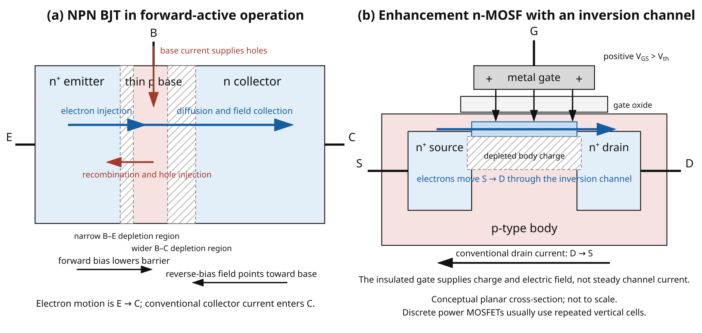

::: {.callout-note title="Chapter maturity — draft"}
This draft develops transistor switching from device control and operating
regions through drive, inductive loads, loss, and thermal limits. In Lab **L06**,
you compare the calculations with terminal curves and switching waveforms.
See the [reading roadmap](../roadmap.qmd) for the meaning of status levels.
:::

::: {.callout-warning title="Safety boundary for transistor work"}
Practical work in this chapter is limited to **current-limited,
extra-low-voltage** sources, approved components, local supervision, and an
approved procedure. Set the source current limit before connecting the circuit.
De-energize before changing wiring. Inductors can generate damaging voltage
when current is interrupted; install and verify the intended current-return path
before energizing a winding. Stop for smoke, odor, discoloration, unexpected
rapid temperature rise, or loss of current limiting. This chapter does not
authorize mains switching, high-energy batteries, high-current motors,
automotive transients, hazardous motion, safety relays, medical equipment, or
power-converter construction. Those applications require additional protection,
isolation, fault analysis, and qualified procedures [@iec61010].
:::

## Central question

> How can a small electrical signal control a larger current or voltage safely?

A **transistor** is a semiconductor device in which one terminal signal controls
current through another terminal path. Connect one between a current-limited
supply and a lamp, resistor, or relay coil. A control signal too small to power
the load directly can command nearly the entire load current. Remove the control
and the current nearly stops.

This behavior invites two shortcuts: “a transistor is a switch” and “a
transistor amplifies current.” Neither identifies the control terminal, the
controlled path, or the operating region. Neither shortcut tells you how much
drive the device needs, where the load line places the operating point, or what
happens during a transition.

Before continuing, predict how each of four variations exposes the limits of
the two shortcuts:

- replace an NPN BJT with an n-channel MOSFET but retain the same control
  voltage;
- drive a MOSFET gate only to its threshold-voltage specification;
- open a transistor carrying steady current through a coil, first without and
  then with a nearby flyback diode; and
- double switching frequency while leaving voltage, current, edge time, and
  duty ratio unchanged.

A useful model must agree with the terminal references, schematic, datasheet
conditions, switching waveforms, and thermal limits. A mismatch points to a
wrong operating region, insufficient drive, stored charge, stray inductance,
temperature rise, or a rating used outside its test condition.

## Learning outcomes

This chapter assumes [A01](a01-semiconductor-diodes.qmd): junction bias,
depletion, operating points, diode recovery, and conditional datasheet evidence.
It also assumes [F05](../01-foundations/f05-energy-power-thermal.qmd): signed
power, stored energy, thermal resistance, and margin. Use
[F07](../01-foundations/f07-capacitors-inductors-transients.qmd) when the analysis
needs exponentials, inductor-current continuity, and charge,
and [M02](../appendices/m02-calculus-linear-differential.qmd) for derivatives
and integrals. After completing the chapter, you should be able to:

- declare BJT and MOSFET terminal references and account for terminal current,
  voltage, and absorbed power without confusing carrier motion with conventional
  current;
- connect BJT carrier injection and MOSFET field control to their large-signal
  terminal behavior and identify cutoff, active or ohmic operation, saturation,
  body-diode conduction, and breakdown;
- find a source–load operating point, then design BJT base drive or MOSFET gate
  drive from guaranteed interface and transistor data rather than threshold
  voltage or typical gain alone;
- analyze low-side, high-side, open-collector/open-drain, and complementary
  stages, including their off-state definition and cross-conduction paths;
- trace an inductive load's current and energy before and after turn-off, then
  select and verify a complete clamp or freewheel path;
- separate conduction, transition, control-drive, and leakage loss; screen
  voltage, current, **safe operating area** (the allowed combinations of device
  voltage, current, and time), and temperature without multiplying unrelated
  headline ratings; and
- turn a switching requirement into a datasheet-based selection and an
  acceptance test that includes explicit limits, conditions, loading, and
  uncertainty.

::: {.callout-note title="Scope boundary — switching here, amplification next"}
Here you use transistor physics and large-signal regions to analyze switching
paths, drive, stress, and temperature. [A03](a03-bias-small-signal-amplifiers.qmd)
then develops DC bias or polarization circuits, bias sensitivity and thermal
stability, BJT and MOSFET small-signal equivalents, common-emitter and
common-source gain stages, emitter and source followers, coupling and bypass
networks, headroom, distortion, and multistage loading. A simple discrete
current source or mirror may support bias design there.

[A07](a07-integrated-circuits.qmd) is the primary home for current mirrors,
differential pairs, active loads, CMOS stages, matching, process variation, and
layout-dependent behavior. A Darlington pair is introduced in A02 where its
switching consequences matter; its follower and compound-amplifier use belongs
in A03.
:::

## Transistor control, terminal references, and power

A transistor is a three-terminal semiconductor device in which one terminal
condition changes the current–voltage relation seen at the other terminals. This
is **control**, not creation of energy. The load power comes from the load
supply. The control port changes the device state and may itself absorb power.

The two device types emphasized here use different control mechanisms:

- a **bipolar junction transistor** (BJT) uses carrier injection through a
  forward-biased base–emitter junction to control carrier collection; and
- a **metal–oxide–semiconductor field-effect transistor** (MOSFET) uses an
  electric field produced by gate charge to create or remove a conducting
  channel [@sze2006physics; @sedra2020microelectronic].

The schematic symbols do not define signs by themselves. For the NPN BJT
references shown in @fig-a02-terminal-references, define

$$
V_{BE}\equiv V_B-V_E,\qquad V_{CE}\equiv V_C-V_E.
$$

Define $I_B$ and $I_C$ as conventional currents entering the base and collector,
and define $I_E$ as current leaving the emitter. KCL gives the exact lumped
terminal balance

$$
I_E=I_B+I_C.
$$ {#eq-a02-bjt-kcl}

With these references, the instantaneous electrical power absorbed by the
three-terminal device is the exact port sum

$$
p_Q(t)=v_{BE}(t)i_B(t)+v_{CE}(t)i_C(t).
$$ {#eq-a02-bjt-power}

The first term is not automatically negligible. It matters in a drive budget
and can be appreciable when a BJT is driven deeply into saturation.

For the n-channel MOSFET, define

$$
V_{GS}\equiv V_G-V_S,\qquad V_{DS}\equiv V_D-V_S,
$$

with $I_G$ and $I_D$ entering gate and drain, and $I_S$ leaving the source. Then

$$
I_S=I_G+I_D,\qquad
p_Q(t)=v_{GS}(t)i_G(t)+v_{DS}(t)i_D(t).
$$ {#eq-a02-mos-power}

Steady gate conduction is normally small for an intact insulated gate, but
transient gate current is essential. Low average gate current does not imply
zero gate-drive power or zero peak driver current.

{#fig-a02-terminal-references fig-alt="Two panels show an NPN BJT and an n-channel enhancement MOSFET. BJT base and collector currents enter their terminals and emitter current leaves; V BE and V CE are positive at base and collector relative to emitter. MOSFET gate and drain currents enter and source current leaves; V GS and V DS are positive at gate and drain relative to source. An explicit body diode has anode at source and cathode at drain." width="96%"}

The body diode $D_B$ drawn in @fig-a02-terminal-references is important in
discrete vertical power MOSFETs. For an n-channel device it conducts conventional
current from source toward drain when that junction is forward biased. It is not
a second controllable channel, and its forward voltage, stored charge, reverse
recovery, and safe current retain their own conditions.

PNP and p-channel devices are complementary polarity cases. This chapter states
their drive conditions using signed voltages such as
$V_{BE}=V_B-V_E<0$ or $V_{GS}=V_G-V_S<0$. When a datasheet instead tabulates a
positive magnitude, the magnitude bars will be shown explicitly.

## Physical structures and control mechanisms

The paired cross-sections in @fig-a02-transistor-structures extend the spatial
p–n-junction picture from A01 to three-terminal devices. They are causal
teaching diagrams rather than fabrication layouts or band-energy plots. The NPN
panel shows a forward-active bias state; the n-MOSFET panel shows an enhanced
on state. Dimensions, dopant profiles, field shape, and carrier density are not
to scale [@sze2006physics; @sedra2020microelectronic].

{#fig-a02-transistor-structures fig-alt="Panel a is a horizontal NPN cross-section with an n-plus emitter, thin p base, and n collector. The base-emitter depletion region is narrow under forward bias and the base-collector depletion region is wider under reverse bias. Blue arrows show electrons injected from the emitter, diffusing through the base, and collected at the collector; a red base-current path supplies holes and supports recombination. Panel b is a conceptual planar enhancement n-MOSFET cross-section. A positively charged metal gate is separated from a p-type body by gate oxide. Downward electric-field arrows attract electrons into an inversion channel connecting n-plus source and drain. Electron motion is source to drain, opposite conventional drain current. A note says discrete power MOSFETs commonly use repeated vertical cells." width="100%"}

### Bipolar carrier injection and collection

An NPN BJT contains an n-type emitter, thin p-type base, and n-type collector.
The regions are not interchangeable: geometry and doping make the emitter an
efficient carrier injector and the collector able to sustain reverse bias. In
ordinary forward-active operation the base–emitter junction is forward biased
and the base–collector junction is reverse biased. Electrons injected from the
emitter diffuse across the thin base; most reach the collector field before
recombining, while the remainder contributes to base current. Both electron and
hole transport matter, which is why the device is called *bipolar*
[@shockley1949junctions; @sze2006physics].

Panel (a) of @fig-a02-transistor-structures makes the asymmetry visible. Forward
bias narrows the base–emitter barrier enough for strong injection. The thin base
limits recombination, while the reverse-biased base–collector depletion field
sweeps arriving electrons into the collector. Base current is still required:
it supplies the hole-injection and recombination components that the simplified
blue electron path does not erase.

In that region, a useful large-signal terminal approximation is

$$
I_C\approx I_S\exp\left(\frac{V_{BE}}{nV_T}\right),
\qquad
I_C\approx\beta_F I_B.
$$ {#eq-a02-bjt-active}

Here $I_S$ is a device- and temperature-dependent scale current, $V_T=kT/q_e$,
$n$ is a fitted ideality factor, and $\beta_F$ is the common-emitter DC current
gain for the stated operating point. The first relation expresses junction
injection; the second is an empirical current-ratio description. Neither is a
conservation law, neither says the collector supplies energy, and neither makes
$\beta_F$ constant. Production spread, collector current, collector voltage,
and junction temperature all change it. A datasheet $h_{FE}$ test in
forward-active operation does not guarantee saturation behavior
[@sedra2020microelectronic; @onsemi2n3904].

Base current does not release an unbounded collector current. It changes the
transistor's collector characteristic. The external collector circuit then
intersects that characteristic at the operating point, so the device and the
load set the current together.

### Field-effect channel control and insulated-gate charge

An enhancement n-channel MOSFET places an insulated gate above a semiconductor
surface between source and drain. Positive $V_{GS}$ attracts electrons toward
that surface. Above a device-dependent transition, a conducting inversion layer
links source and drain. The gate dielectric blocks steady conduction ideally,
but the electric field requires charge on the gate and corresponding charge in
the other terminals [@sze2006physics; @nexperia2025mosfetparameters].

Panel (b) of @fig-a02-transistor-structures shows the conceptual planar case.
Positive gate charge terminates on negative mobile channel charge and depleted
body charge. Once the inversion layer connects the source and drain regions, an
applied $V_{DS}$ produces carrier motion along the surface. A discrete power
MOSFET normally repeats vertical cells to reduce resistance and support voltage,
so the panel explains electrostatic control rather than package geometry.

Let $Q_G$ be signed charge assigned to the external gate terminal. The total gate
current is

$$
i_G(t)=i_{G,\mathrm{leak}}(t)+\frac{\mathrm dQ_G}{\mathrm dt}.
$$ {#eq-a02-gate-current}

This is a terminal charge balance, not a claim that one constant capacitor
describes a complete switching event. Gate charge depends on both $v_{GS}$ and
$v_{GD}$; drain voltage changes feed back through gate–drain charge. In steady
DC after charging, $\mathrm dQ_G/\mathrm dt=0$ and leakage may be small. During
an edge, $\mathrm dQ_G/\mathrm dt$ can dominate.

For a long-channel device at moderate field, define the overdrive
$V_{OV}=V_{GS}-V_{th}$ and
$k_n=\mu_n C_{ox}W/L$, with units A/V$^2$. A useful first-order constitutive
approximation is

$$
I_D\approx
\begin{cases}
0, & V_{GS}\le V_{th},\\[3pt]
k_n\left(V_{OV}V_{DS}-\dfrac{V_{DS}^2}{2}\right),
& 0<V_{DS}<V_{OV},\\[8pt]
\dfrac{k_n}{2}V_{OV}^2,
& V_{DS}\ge V_{OV}.
\end{cases}
$$ {#eq-a02-square-law}

This development is **conceptual background** for region boundaries; it is not
required to execute the later datasheet-based switch procedure and is not a
precision fit for a modern discrete power MOSFET. Short-channel effects,
distributed cell geometry, source resistance, mobility reduction, temperature,
subthreshold current, and channel-length modulation all disturb it. In switch
design, use guaranteed $R_{DS(on)}$ data at the actual gate drive and relevant
temperature, not a fitted $k_n$ from a typical curve.

The low-$V_{DS}$ limiting case is revealing. Dropping the second-order
$V_{DS}^2/2$ term gives

$$
I_D\approx k_nV_{OV}V_{DS},
\qquad
R_{\mathrm{channel}}\approx\frac{1}{k_nV_{OV}}.
$$ {#eq-a02-channel-resistance}

Thus more gate overdrive reduces channel resistance in this approximation.
Threshold voltage is only where a small specified test current begins to flow.
For the AO3400A, for example, $V_{GS(th)}=0.65$ to $1.45$ V is tested at only
$I_D=250~\mu$A, while guaranteed on-resistance is specified at 2.5 V and 4.5 V
gate drive and ampere-level pulse-test conditions [@aosao3400a]. “The threshold
is 1 V” therefore does not mean “1 V turns the switch fully on.”

## Device families and naming boundaries

Transistor names combine several axes: carrier mechanism, terminal structure,
semiconductor material, application role, and optimization. They are not one
exclusive taxonomy [@sze2006physics; @baliga2019power].

| Family or name | Control and characteristic behavior | Decisive datasheet evidence | Important design limit |
|---|---|---|---|
| NPN / PNP BJT | base–emitter injection controls collector current | $V_{CEO}$, $I_C$, $h_{FE}$ conditions, forced-drive $V_{CE(sat)}$, switching storage, SOA | $h_{FE}$ is not fixed; reverse base–emitter voltage is usually small |
| Darlington pair | two BJTs multiply current gain | required base current, larger $V_{CE(sat)}$, stored charge, integrated resistors | high gain does not imply low on-state loss or fast turn-off |
| enhancement MOSFET | normally off; gate field creates a channel | $R_{DS(on)}$ at stated $V_{GS}$ and $T_J$, $Q_G$, $V_{DS}$, $V_{GS}$, SOA, body-diode data | $V_{GS(th)}$ is not an on-state specification |
| depletion MOSFET / JFET | normally conducting at zero gate bias; reverse gate bias reduces channel current | zero-bias current, pinch-off/cutoff range, gate leakage, voltage rating | “FET” does not imply normally off or insulated gate |
| IGBT | MOS gate controls bipolar conduction | $V_{CE(sat)}$, gate charge, tail current, short-circuit and SOA data | lower conduction loss at high voltage can trade against slower turn-off |
| silicon-carbide MOSFET | wide-bandgap MOS structure optimized for high voltage and temperature | qualified $R_{DS(on)}$, gate range, short-circuit/SOA, capacitances, package and creepage | drive voltage and body-diode behavior differ from familiar silicon parts |
| GaN HEMT | high-mobility heterostructure channel, often no conventional body diode | allowed gate range, reverse-conduction behavior, dynamic on-resistance, layout and driver requirements | “GaN transistor” does not guarantee a silicon-MOSFET-compatible gate |
| phototransistor | optical generation controls collector current | spectral response, optical test geometry, dark current, gain and speed | belongs to optical sensing as much as to the BJT family; A08 owns the interface |

*Table status:* the table is a selection map supported by the cited canonical
sources. A family name does not guarantee a numerical capability. The exact
part datasheet, qualification, package, mounting, and test conditions decide.

Power MOSFETs may be lateral or vertical; BJTs may be discrete or integrated;
silicon, SiC, and III–V materials can support different structures. “Logic
level” is a manufacturer classification, not a universal gate voltage. “Power
transistor” describes an intended application and construction, not one
mechanism. Integrated transmission gates, current mirrors, and differential
pairs are developed in A07; converter-specific IGBT, SiC, and GaN drive belongs
in S05.

The Darlington entry is intentionally present here because a two-BJT compound
switch can reduce required external base current while increasing on-state
voltage and stored charge. A complete Darlington or complementary-feedback-pair
follower belongs with emitter-follower bias, headroom, output resistance, and
distortion in A03. A current mirror is different: it is a multi-transistor bias
topology whose accuracy depends on operating region, emitter/source degeneration,
output resistance, temperature, and matching. A03 may introduce the simplest
discrete mirror as a bias source; A07 develops mirrors, differential pairs, and
active loads in their natural integrated-circuit and layout context
[@sedra2020microelectronic].

## Large-signal terminal behavior and operating regions

### BJT cutoff, forward-active operation, and saturation

For an NPN BJT with the references already declared, the main large-signal
regions are:

| Region | Base–emitter junction | Base–collector junction | First-order terminal behavior | Common use |
|---|---|---|---|---|
| cutoff | not appreciably forward biased | not forward biased | $I_B\approx0$, $I_C$ limited mainly by leakage | open switch |
| forward active | forward biased | reverse biased | $I_C\approx\beta_F I_B$ or exponential control by $V_{BE}$ | controlled current; A03 develops linear amplification |
| saturation | forward biased | forward biased | collector current is load-limited; $V_{CE}$ is small but nonzero | closed switch |
| reverse active | base–collector forward biased | base–emitter reverse biased | emitter and collector roles partly exchange with poor performance | usually unintended |
| breakdown | one rating exceeded | device-dependent | current rises by avalanche or junction breakdown | prohibited unless explicitly rated |

“Saturation” does not mean $I_C$ reached an absolute device current limit. It
means the collector circuit asks for less current than the forward-active
relation would predict for the applied base drive, so the base–collector
junction becomes forward biased. More base current may lower $V_{CE}$ somewhat
but also stores additional charge and can slow turn-off.

For switching, define the **forced current ratio**

$$
\beta_{\mathrm{forced}}\equiv\frac{I_C}{I_B}.
$$ {#eq-a02-forced-beta}

This is a design ratio, not the transistor's intrinsic or guaranteed
forward-active gain. A saturation test such as
$I_C=50$ mA, $I_B=5$ mA uses $\beta_{\mathrm{forced}}=10$. Designing at an
equal or lower forced ratio can support a conservative saturation screen only
when current, temperature, pulse duration, and other conditions are applicable.

### MOSFET cutoff, ohmic operation, and saturation

For an enhancement n-channel MOSFET at positive $V_{DS}$:

- **cutoff** means the channel current is small enough to neglect for the stated
  purpose; leakage and subthreshold current are not literally zero;
- the **ohmic**, **linear**, or **triode** region has
  $0<V_{DS}<V_{GS}-V_{th}$ in the long-channel approximation, and the enhanced
  device behaves approximately as a controlled resistance;
- **MOSFET saturation** begins near $V_{DS}=V_{GS}-V_{th}$ in that same
  approximation; drain current is comparatively insensitive to further
  $V_{DS}$ increase, which is useful for controlled-current behavior but creates
  simultaneous voltage and current stress;
- **body-diode conduction** carries reverse source-to-drain current through the
  intrinsic junction of a typical discrete power device; and
- **avalanche** occurs when drain voltage drives a junction into breakdown.
  It is acceptable only within explicit single-pulse or repetitive conditions.

BJT saturation and MOSFET saturation are therefore almost opposite switch
states. A saturated BJT is normally used as an on switch with small $V_{CE}$.
A MOSFET used as an on switch is normally in the ohmic region, not MOSFET
saturation. Always name the device type with the region.

In the ohmic on state, the datasheet relation used for loss is

$$
V_{DS}\approx I_D R_{DS(on)},\qquad
P_{\mathrm{cond}}\approx I_{D,\mathrm{RMS}}^2R_{DS(on)}.
$$ {#eq-a02-mos-conduction}

The first relation is a bounded constitutive approximation over the
manufacturer's gate voltage, current, junction temperature, and pulse or steady
condition. The second follows from average $i^2R$ loss. Its units are
A$^2\cdot\Omega=$ W. At zero current it correctly predicts zero channel
conduction loss; at elevated junction temperature, using only the 25 °C
resistance can be optimistic.

## Source–load intersections and controlled current

The NPN low-side stage in @fig-a02-bjt-low-side connects the device
characteristic to a source–load constraint. $R_{\mathrm{OUT}}$ represents the
driver's finite output resistance, and $R_B$ provides mandatory current
limiting. The optional $R_{BE}$ provides a defined state and discharge path,
but it does not substitute for a valid driver.

{#fig-a02-bjt-low-side fig-alt="Driver voltage V DRV and output resistance R OUT feed base resistor R B and the base of NPN transistor Q1. Optional resistor R BE connects base to emitter. Load R L connects from supply V CC to the collector. Emitter and driver return share TP0. TPB and TPC expose distinct base and collector voltages; resistor current I RB and collector current I C are marked." width="78%"}

With $V_{CC}>0$, $R_L>0$, $I_C$ directed downward through the load and
transistor, and $V_{CE}$ positive at the collector, KVL gives the exact DC
source line

$$
V_{CE}=V_{CC}-I_CR_L.
$$ {#eq-a02-bjt-load-line}

The line has two limiting intercepts:

$$
I_C=0\Rightarrow V_{CE}=V_{CC},\qquad
V_{CE}=0\Rightarrow I_C=\frac{V_{CC}}{R_L}.
$$

The first is the ideal cutoff endpoint. The second is the current that an ideal
zero-voltage switch would allow; it is not permission to short the transistor.
The physical operating point is the intersection of @eq-a02-bjt-load-line with
the transistor output characteristic for the actual base drive.

The same statement is shown graphically in @fig-a02-controlled-source-load-line.
The control variable $u$ changes a device characteristic; it does not replace
the load supply. Each intersection simultaneously satisfies the transistor
relation and KVL. The curves are qualitative and are not a substitute for a
manufacturer's characterized or guaranteed data.

{#fig-a02-controlled-source-load-line fig-alt="Panel a shows load supply V S and resistor R L feeding a controlled current source I Q of control u, where u can be BJT base current or MOSFET gate-source voltage. The control port is separate from the load-power loop. Panel b plots three illustrative output-current curves for increasing control values and a descending source/load line; their intersections are the operating points." width="96%"}

**Illustrative worked point.** Let $V_{CC}=5.0$ V and $R_L=100~\Omega$.
The zero-voltage-switch current estimate is 50 mA. If the base drive produces
only $I_B=0.20$ mA and a representative active-region
$\beta_F=100$ applies, @eq-a02-bjt-active predicts 20 mA. Substitution into the
source line gives

$$
V_{CE}=5.0~\mathrm V-(20~\mathrm{mA})(100~\Omega)=3.0~\mathrm V.
$$

The transistor remains forward active and absorbs approximately
$60$ mW at the collector port. Increasing base current to 5 mA would make the
active relation predict 0.5 A, but the source line permits only about 50 mA.
The active assumption fails and the device enters saturation. If
$V_{CE(sat)}=0.20$ V is a valid bound, the load current becomes

$$
I_C=\frac{5.0-0.20}{100}=48~\mathrm{mA}.
$$

The useful method is **assume a region → solve the network → verify the region**.
Blindly applying $I_C=\beta I_B$ would violate KVL.

For the MOSFET stage in @fig-a02-mos-low-side, the same source line applies with
$V_{DS}$ and $I_D$. The on-state solution using @eq-a02-mos-conduction is

$$
I_D\approx\frac{V_{DD}}{R_L+R_{DS(on)}}.
$$ {#eq-a02-mos-load-current}

This expression demonstrates why the load usually sets current when
$R_{DS(on)}\ll R_L$. It also shows why a larger MOSFET current rating does not
force more current through a fixed resistor.

{#fig-a02-mos-low-side fig-alt="Driver voltage V DRV and output resistance R OUT feed gate resistor R G and the gate of n-channel MOSFET Q1. Pull-down R GS connects gate to source. Load R L connects from V DD to the drain. The source and driver share TP0. TPG exposes V GS and TPD exposes V DS." width="78%"}

**Illustrative MOSFET controlled-current point.** Use the conceptual square-law
parameters $V_{th}=1.0$ V and $k_n=0.10$ A/V$^2$, with $V_{GS}=3.0$ V,
$V_{DD}=10$ V, and $R_L=20~\Omega$. The overdrive is 2.0 V, so the saturation
branch of @eq-a02-square-law predicts

$$
I_D=\frac{0.10}{2}(2.0)^2=0.20~\mathrm A.
$$

The source line then gives
$V_{DS}=10-(0.20)(20)=6.0$ V. Because $6.0>V_{OV}=2.0$ V, the assumed MOSFET
saturation region is self-consistent. The load supply provides
$V_{DD}I_D=2.0$ W; the transistor absorbs $V_{DS}I_D=1.2$ W and the resistor
absorbs $I_D^2R_L=0.8$ W. This is a controlled-current example, not an efficient
switch design. Raising $R_L$ to $50~\Omega$ would place the predicted point at
$V_{DS}=0$, contradict saturation and forcing a new region solution.

## Low-side switching stages

### BJT base drive and forced saturation

For the steady base loop of @fig-a02-bjt-low-side, let the driver high voltage at
the stated source current be $V_{\mathrm{DRV,H}}$, and let
$V_{BE,\mathrm{on}}$ be bounded at the intended collector and base currents.
Neglecting $R_{BE}$ only when its current is explicitly small, KVL gives

$$
I_B=
\frac{V_{\mathrm{DRV,H}}-V_{BE,\mathrm{on}}}
{R_{\mathrm{OUT}}+R_B}.
$$ {#eq-a02-base-current}

A conservative design must satisfy two opposing inequalities:

$$
I_{B,\min}\ge\frac{I_{C,\max}}{\beta_{\mathrm{forced,max}}},
\qquad
I_{B,\max}<I_{\mathrm{DRV,allow}}.
$$ {#eq-a02-base-window}

The first requires enough drive at minimum driver high voltage, maximum
base–emitter voltage, and maximum resistance. The second protects the driver at
maximum driver voltage, minimum total resistance, and the smallest justified
base–emitter drop. If the windows do not overlap, no resistor solves the
interface; use a driver, a MOSFET, or a different requirement.

The base resistor must also be rated:

$$
P_{R_B}=I_B^2R_B
=\frac{(V_{\mathrm{DRV,H}}-V_{BE})^2R_B}
{(R_{\mathrm{OUT}}+R_B)^2}.
$$ {#eq-a02-base-resistor-power}

The familiar shortcut $(V_{\mathrm{DRV}}-0.7)/R_B$ is only a nominal estimate.
It cannot establish a worst-case interface without a bounded driver and
base–emitter condition.

Open-collector and open-drain outputs are the same low-side interface idea
without an internal load: the BJT collector or MOSFET drain can actively sink,
but an external pull-up and the receiving circuit define the high state.

| Check | Open collector | Open drain | Shared requirement |
|---|---|---|---|
| on state | bound $V_{CE(sat)}$ and base drive | bound $I_DR_{DS(on)}$ at actual $V_{GS}$ | pull-up current plus receiver currents remain within sink rating and low-level limit |
| off state | bound collector leakage | bound drain leakage and any body-diode path | pull-up minus leakage/input currents must reach the receiver's high threshold |
| supply choice | may translate to a rail above the controller only within $V_{CEO}$ | may translate only within $V_{DS}$ and gate/source fault limits | receiver input rating and rail sequencing still apply |
| unpowered or disconnected state | transistor and receiver leakage decide | body diode, drain leakage, and gate state decide | without a valid pull-up rail, the node is undefined rather than logic high |

Thus “off” does not mean that the transistor drives the node high. Wired-AND
or level-translation use is valid only after checking every sink, the pull-up
range and edge time, receiver thresholds, leakage at temperature, and behavior
when either rail is absent.

### MOSFET gate drive, pull resistance, and logic compatibility

At DC, a valid enhanced MOSFET gate draws mainly leakage, so $R_G$ need not set a
steady bias current. It does three other jobs:

1. limits peak source/sink current from the controller;
2. damps ringing with package and connection inductance; and
3. controls edge rate, trading switching loss against overshoot and
   electromagnetic interference [@balogh2018gatedriver; @ott2009electromagnetic].

At the instant of a commanded edge, a conservative short-circuit screen is

$$
|I_{G,\mathrm{pk}}|
\le
\frac{|V_{\mathrm{DRV,H}}-V_{\mathrm{DRV,L}}|}
{R_{\mathrm{OUT}}+R_G+R_{G,\mathrm{int}}}.
$$ {#eq-a02-gate-peak}

This is a current bound, not a switching-time prediction. Internal gate
resistance and driver pull-up/pull-down resistance can differ, and the gate
voltage is not fixed during the edge.

A gate–source resistor $R_{GS}$ gives the transistor a defined off state when the
driver is high impedance or unpowered. If total worst-case current into the
floating gate node is $I_{\mathrm{leak,max}}$, a simple DC screen is

$$
|V_{GS,\mathrm{off}}|
\le I_{\mathrm{leak,max}}R_{GS}.
$$ {#eq-a02-gate-off}

Smaller $R_{GS}$ improves immunity but wastes more DC power while the driver is
high. The driver must also tolerate current through $R_{GS}$.

Logic compatibility requires:

- a guaranteed $V_{OH}$ high enough to meet an $R_{DS(on)}$ test voltage or
  another qualified on-state condition;
- a guaranteed $V_{OL}$ and leakage bound that keep the device off at the
  maximum temperature;
- peak and average source/sink current capability for the chosen gate charge,
  resistor, frequency, and number of simultaneously switched gates; and
- a gate-voltage range that never violates the MOSFET's positive or negative
  $V_{GS}$ rating, including ringing.

The first bullet is why a 3.3 V signal cannot be declared compatible with a
MOSFET whose resistance is guaranteed only at 10 V, even if its threshold is
1–2 V.

## High-side and complementary switching stages

A low-side device disconnects the load from the return. A high-side device
disconnects it from the positive rail. The topology changes fault behavior,
off-state reference, sensing, and drive requirements.

In the P-channel stage of @fig-a02-high-side, the source is connected to
$V_{DD}$. The device is off when gate and source are nearly equal. Pulling the
gate below the moving source makes $V_{GS}<0$ and turns it on. A gate drive of
“0 V” therefore means $V_{GS}=-V_{DD}$, not a universal safe value. At large
$V_{DD}$, a level shifter and gate clamp are required.

For a bounded polarity example, suppose the rail spans 10.8–13.2 V, a candidate
P-channel device is guaranteed at $V_{GS}=-10$ V, has
$R_{DS(on)}\le0.20~\Omega$ at the relevant temperature, and permits
$|V_{GS}|\le20$ V. A 120 $\Omega$ load then draws at most
$13.2/(120+0.20)=109.8$ mA and the device dissipates at most 2.42 mW in the
resistive on state. Pulling the gate to 0 V produces
$-13.2~\mathrm V\le V_{GS}\le-10.8~\mathrm V$, which meets both the on-state
test voltage and oxide rating. Releasing it to the source rail turns it off.
These are illustrative bounds; a real design must add leakage, pull-up
tolerance, driver off-state voltage, load transients, SOA, and a named part
datasheet.

{#fig-a02-high-side fig-alt="Panel a shows a P-channel MOSFET between V DD and load R L, with gate resistor and gate-source pull-up. Panel b shows a P-channel high-side MOSFET and n-channel low-side MOSFET connected at switch node TPSW, which drives a load to ground. Separate high- and low-side drives are shown." width="92%"}

An NPN or n-channel device can also be used on the high side, but its base or
gate must be driven above the load-side emitter or source to preserve the
required $V_{BE}$ or $V_{GS}$ as the output rises. Bootstrap and isolated
drivers solve this in converter systems; S05 owns their detailed design.

The complementary half-bridge in @fig-a02-high-side can connect TPSW to either
rail:

| High-side command | Low-side command | Intended switch-node state | Principal risk |
|---|---|---|---|
| off | off | not actively driven; near 0 V for the shown resistor, otherwise load and body diodes decide | undefined node or inductive commutation |
| on | off | near $V_{DD}$ | high-side conduction loss |
| off | on | near 0 V | low-side conduction loss |
| on | on | invalid | cross-conduction from $V_{DD}$ to return |

The invalid state creates a current path containing both transistors and the
supply impedance but not the intended load. Non-overlap or **dead time** is
introduced to prevent it. Too little dead time risks shoot-through; too much can
force load current through a body diode, increasing loss and recovery stress.
These mechanisms set the timing constraints. [S05](../05-domains/s05-power-electronics.qmd)
develops converter timing and optimization.

BJT emitter followers and complementary push–pull stages have analogous
high-side/low-side structure, but base current, junction drops, and stored charge
replace MOSFET gate charge and on-resistance as dominant first-order terms.

## Inductive-load turn-off and energy paths

The derivation below uses a first-order differential equation and logarithm.
Review [F07](../01-foundations/f07-capacitors-inductors-transients.qmd) for the
physical continuity rule and [M02](../appendices/m02-calculus-linear-differential.qmd)
for the solution method if either step is unfamiliar.

The low-side MOSFET in @fig-a02-inductive-load drives a winding represented by
an ideal inductance $L$ in series with its winding resistance $R_w$. The
representation matters: the flyback diode spans the complete physical winding,
not only the ideal $L$ symbol. $C_{\mathrm{BYP}}$ provides a local high-frequency
supply/return path; it does not make wiring inductance vanish.

{#fig-a02-inductive-load fig-alt="A V DD supply feeds winding resistance R w and inductance L, then drain test point TPD and n-channel MOSFET Q1 to TP0. Flyback diode D F runs from TPD back to the supply across both R w and L. Bypass capacitor C BYP spans the supply and return. A finite driver, gate resistor, pull-down, and TPG are shown. Current arrows identify downward on-state winding current and upward turn-off return current through the diode." width="86%"}

Define $i_L$ downward from the supply through $R_w$ and $L$ toward TPD. In the
on state, before steady state,

$$
L\frac{\mathrm di_L}{\mathrm dt}
+(R_w+R_{DS(on)})i_L
=V_{DD}.
$$ {#eq-a02-coil-on}

This is an exact KVL statement for the declared lumped elements, followed by the
on-resistance approximation. At DC steady state,

$$
I_{L,\infty}\approx
\frac{V_{DD}}{R_w+R_{DS(on)}}.
$$ {#eq-a02-coil-steady}

At the instant the transistor opens, inductor current is continuous unless an
impulsive unbounded voltage occurs. The diode becomes forward biased and the
post-switch loop contains $R_w$, $L$, and $D_F$. With diode voltage $v_F(i)>0$
defined from anode at TPD to cathode at the positive rail,

$$
L\frac{\mathrm di_L}{\mathrm dt}+R_w i_L+v_F(i_L)=0.
$$ {#eq-a02-coil-off}

The supply is not in series as an energy source in this local flywheel loop.
The stored magnetic energy immediately before opening is

$$
E_L(0^-)=\frac12 LI_0^2.
$$ {#eq-a02-inductor-energy}

Multiply @eq-a02-coil-off by $i_L$:

$$
\frac{\mathrm d}{\mathrm dt}\left(\frac12Li_L^2\right)
=-R_wi_L^2-v_F(i_L)i_L.
$$ {#eq-a02-flyback-energy}

The left side is the rate of change of stored magnetic energy. The right side
separates conversion to winding heat and diode heat. Integrating until current
reaches zero gives

$$
\frac12LI_0^2
=\int_0^{t_{\mathrm{off}}}R_wi_L^2\,\mathrm dt
+\int_0^{t_{\mathrm{off}}}v_F(i_L)i_L\,\mathrm dt,
$$ {#eq-a02-flyback-balance}

provided other paths and field energy are negligible. This balance prevents a
common double count: the energy converted inside the diode and winding has not
also crossed the external thermal boundary at the same instant. Heat leaves
later while temperatures accumulate and change.

For the instructional constant-drop approximation $v_F=V_F$, the solution is

$$
i_L(t)=
\left(I_0+\frac{V_F}{R_w}\right)
\exp\left(-\frac{R_wt}{L}\right)-\frac{V_F}{R_w}
$$ {#eq-a02-flyback-current}

until it reaches zero at

$$
t_{\mathrm{off}}
=\frac{L}{R_w}
\ln\left(1+\frac{R_wI_0}{V_F}\right).
$$ {#eq-a02-flyback-time}

The dimensions are seconds because $L/R_w$ is H/$\Omega=$ s and the logarithm
is dimensionless. As clamp voltage increases, decay time decreases. The price is
higher switch-node voltage and potentially higher electromagnetic emission.
As $V_F\rightarrow0$, @eq-a02-flyback-current approaches the ordinary
$I_0e^{-R_wt/L}$ decay, which reaches zero only asymptotically.

**Illustrative numerical variation.** For $L=25$ mH, $R_w=24~\Omega$, and
$I_0=0.50$ A, a constant 0.60 V diode approximation gives

$$
t_{\mathrm{off}}
=\frac{25~\mathrm{mH}}{24~\Omega}
\ln\left(1+\frac{(24~\Omega)(0.50~\mathrm A)}{0.60~\mathrm V}\right)
=3.17~\mathrm{ms}.
$$

The initial stored energy is 3.13 mJ. These are **illustrative calculations**,
not data for the relay used later. Real diode voltage changes with current and
temperature, coil inductance can change with armature position, and wiring
inductance adds

$$
v_{\mathrm{stray}}=L_{\mathrm{stray}}\frac{\mathrm di}{\mathrm dt}
$$

outside the ideal local loop. The clamp must be placed near the load/switch
current path, and TPD must be measured with a short probe return
[@ott2009electromagnetic; @tektronixprobesprimer].

A Zener, TVS, active clamp, or avalanche-rated switch can allow a higher
turn-off voltage and faster release than a diode. Such a choice is a complete
energy-path design, not permission inferred from one avalanche number.

## Switching dynamics and interface loading

### BJT stored charge

A saturated BJT has both junctions forward biased. Excess minority-carrier charge
can remain in the base after the drive command changes. Collector current then
continues for a **storage time** until reverse or discharge base current removes
enough charge. The 2N3904 datasheet, for example, specifies switching times with
a particular $V_{CC}$, collector current, forward base current, and reverse base
current; those values do not transfer unchanged to a different base network
[@onsemi2n3904].

A base–emitter resistor provides a discharge and defined-state path. A driver
that actively sinks base current turns the BJT off faster than an equal-valued
passive resistor, but reverse base–emitter voltage must remain below its small
rating. Driving much deeper into saturation can reduce on voltage slightly while
increasing stored charge. This is the first dynamic limit that the static
forced-$\beta$ picture omits.

### MOSFET gate charge and the Miller interval

The equivalent in @fig-a02-mos-charge organizes the principal terminal-charge
paths. The capacitors are voltage dependent and coupled; they are not three
constant, independently measurable parts over a large transition.

{#fig-a02-mos-charge fig-alt="A time-varying driver with output resistance and gate resistor drives TPG. Voltage-dependent capacitors C GS from gate to source, C GD from gate to drain, and C DS from drain to source connect the three MOSFET terminals. TPD and TP0 name drain and source test points." width="84%"}

Initially, driver current raises $v_{GS}$. When drain current begins to transfer
from the load or freewheel path, $v_{DS}$ changes. Gate–drain charge then absorbs
driver current while $v_{GS}$ changes slowly through the **Miller interval**.
After the drain transition, additional charge raises the gate to its final drive
voltage [@balogh2018gatedriver].

For a specified gate-charge test, a useful average-current definition is

$$
I_{G,\mathrm{avg}}\equiv\frac{Q_G}{t_g},
\qquad
t_g=\frac{Q_G}{I_{G,\mathrm{avg}}}.
$$ {#eq-a02-gate-time}

This identity becomes a prediction only after an applicable $Q_G$ and a justified
average current are supplied. $C_{iss}V_{\mathrm{DRV}}$ is generally not a
substitute because capacitances vary and $v_{DS}$ changes.

If a driver charges the gate from 0 to $V_{\mathrm{DRV}}$ once per cycle and the
charge returns to ground on turn-off, the energy drawn from the driver supply is
approximately

$$
E_G\approx Q_GV_{\mathrm{DRV}},
\qquad
P_G\approx Q_GV_{\mathrm{DRV}}f_s.
$$ {#eq-a02-gate-drive-power}

The result follows from $\int V_{\mathrm{DRV}}i_G\,\mathrm dt$ for an
approximately constant driver supply. Its units are C·V = J. The energy is
distributed among external and internal gate resistance and driver devices; it
is not all transistor-die heat. Doubling switching frequency doubles this
average control-drive power if charge per cycle is unchanged.

This result is consistent with the familiar capacitor energy, not a competing
formula. For one ideal constant capacitor charged from 0 to $V$ through a
resistance, the supply delivers $CV^2$: one half is stored as
$\tfrac12CV^2$ and one half is dissipated during charge. Discharging returns no
energy to that simple supply and dissipates the stored half, so a complete
charge–discharge cycle costs $CV^2$. Since $Q=CV$, this is $QV$ per cycle.
A MOSFET's nonlinear, mutually coupled terminal charges make the datasheet
$Q_GV_{\mathrm{DRV}}f_s$ screen more useful than choosing one $C_{iss}$.

Parasitic drain-voltage slew can also inject current through $C_{GD}$ and raise
the gate of a nominally off transistor. A low-impedance off drive, suitable
$R_{GS}$, controlled layout, and sometimes a negative or Miller-clamp drive are
countermeasures. Specialist design belongs to S05.

## Loss, safe operating area, and temperature

### Conduction and transition energy

For any transistor, the most defensible switching-loss calculation begins with
the declared terminal power, not a memorized shortcut. Over one cycle of duration
$T_s$, the collector/drain-port energy is

$$
E_Q=\int_0^{T_s}v_Q(t)i_Q(t)\,\mathrm dt,
\qquad
P_{Q,\mathrm{avg}}=\frac{E_Q}{T_s}.
$$ {#eq-a02-switch-energy}

For a BJT, $v_Qi_Q=v_{CE}i_C$ plus the base-port term when total device input
power is required. For a MOSFET, it is $v_{DS}i_D$ plus the gate-port term. The
integral is exact for correctly measured device-terminal quantities. Probe
delay mismatch, bandwidth, common-mode error, and current-sensor insertion can
make the apparent integral wrong.

A first-order loss inventory is

$$
P_{\mathrm{device}}\approx
P_{\mathrm{cond}}+P_{\mathrm{transition}}+
P_{\mathrm{leak}}+P_{\mathrm{internal\ drive}},
$$ {#eq-a02-loss-inventory}

where:

- $P_{\mathrm{cond}}\approx I_{D,\mathrm{RMS}}^2R_{DS(on)}$ for a MOSFET, where
  RMS is taken over the complete cycle, or
  $P_{\mathrm{cond}}\approx D V_{CE(sat)}I_{C,\mathrm{on,avg}}$ for a BJT under
  applicable conditions;
- transition loss comes from simultaneous voltage and current during turn-on
  and turn-off;
- off-state leakage loss is approximately $(1-D)V_{\mathrm{off}}I_{\mathrm{leak}}$;
  and
- only the portion of gate/base-drive loss dissipated inside the transistor
  belongs in its junction-power budget.

A triangular-overlap estimate such as

$$
P_{\mathrm{transition}}\approx
\frac12V_{\mathrm{off}}I_{\mathrm{on}}
(t_{\mathrm{on}}+t_{\mathrm{off}})f_s
$$ {#eq-a02-transition-screen}

is a **rule-of-thumb screen**, not an exact derivation. It assumes the observed
overlap energy is reasonably represented by triangles. Diode recovery, load
commutation, ringing, nonlinear edges, output-capacitance energy, and current
overshoot can make it optimistic or pessimistic. Use @eq-a02-switch-energy on
bandwidth- and delay-corrected waveforms for evidence.

### Simultaneous voltage, current, and time limits

Absolute maximum voltage, continuous current, and package power are separate
ratings under different conditions. Their product is not an allowed operating
point. A **safe operating area** (SOA) curve limits simultaneous device voltage
and current for stated pulse duration, duty factor, starting temperature, and
mounting [@baliga2019power; @nexperia2025mosfetparameters].

Important mechanisms include:

- bond-wire, metallization, and package current limits;
- junction temperature from transient or steady power;
- BJT second breakdown caused by localized current and temperature;
- MOSFET linear-region hot spots and temperature-dependent threshold/current
  sharing;
- drain or collector breakdown and avalanche energy;
- gate-oxide voltage; and
- body-diode current and reverse recovery.

A MOSFET with an excellent low $R_{DS(on)}$ switching rating can have a much
narrower DC linear-mode SOA. Conversely, a pulse point inside an SOA plot is not
automatically safe when repeated before the junction cools.

### Thermal accumulation and margin

A thermal calculation first requires a boundary around the transistor and its
package. Electrical power is converted inside that boundary; heat crosses the
package, interface, heatsink or board, and ambient paths, while internal energy
accumulates as temperature changes. At thermal steady state, a simple
junction-to-ambient screen is

$$
T_J\approx T_A+P_{\mathrm{avg}}R_{\theta JA}.
$$ {#eq-a02-thermal-steady}

This is not a package-only constant. $R_{\theta JA}$ depends strongly on board
copper, airflow, orientation, enclosure, nearby heat, and the manufacturer's
test environment [@ti2024thermalmetrics]. For a characterized case-to-sink path,

$$
T_J\approx T_A+
P_{\mathrm{avg}}
(R_{\theta JC}+R_{\theta CS}+R_{\theta SA}).
$$ {#eq-a02-thermal-chain}

For a rectangular pulse, replace steady resistance by applicable transient
thermal impedance:

$$
T_{J,\mathrm{pk}}\approx T_{J,0}
+P_{\mathrm{pulse}}Z_{\theta}(t_p).
$$ {#eq-a02-transient-thermal}

For a repetitive rectangular train, use the manufacturer's
$Z_{\theta}(t_p,D)$ data with its defined duty ratio and initial condition
rather than the single-pulse curve. The pulse shape and repetition matter. A
strict junction-temperature
requirement needs margin below the absolute maximum and a justified relation
from an accessible temperature to $T_J$. A case-temperature reading alone is
not junction temperature, and an infrared surface reading depends on emissivity
and field of view.

### Worked dynamic screen: a resistive MOSFET pulse train

This compact paper design closes the dynamic calculations that a DC relay
example cannot. It is **not a construction instruction**. Suppose a
current-limited 15 V source and a 3.0 $\Omega$ noninductive load demand
100 $\mu$s pulses at 1.00 kHz, so $D=0.100$. The load-current bound is 5.0 A.
Require a 4.5 V gate drive, turn-on and turn-off transition intervals no longer
than 100 ns each, $T_A=25~^\circ$C, and the AO3400A mounted on the
manufacturer's specified 1 in$^2$, 2 oz-copper FR-4 test board.

At $V_{GS}=4.5$ V, $I_D=5$ A, and 25 °C pulse-test conditions, the AO3400A
specifies $R_{DS(on)}\le32$ m$\Omega$. Its maximum total gate charge is 7 nC
at the nearby but not identical condition
$V_{GS}=4.5$ V, $V_{DS}=15$ V, and $I_D=5.7$ A. Keeping those evidence
conditions visible, the first-pass screens are

$$
\begin{aligned}
P_{\mathrm{cond}}&\le
(0.100)(5.0~\mathrm A)^2(32~\mathrm{m}\Omega)=80~\mathrm{mW},\\
I_{G,\mathrm{avg,edge}}&\ge
\frac{7~\mathrm{nC}}{100~\mathrm{ns}}=70~\mathrm{mA},\\
P_G&\approx(7~\mathrm{nC})(4.5~\mathrm V)(1.00~\mathrm{kHz})
=31.5~\mu\mathrm W,\\
P_{\mathrm{transition}}&\approx
\frac12(15~\mathrm V)(5.0~\mathrm A)
\left[(100~\mathrm{ns})+(100~\mathrm{ns})\right]
(1.00~\mathrm{kHz})=7.5~\mathrm{mW}.
\end{aligned}
$$

The drain-port average is about 87.5 mW before leakage,
output-capacitance, and recovery terms. The driver must both source and sink at
least 70 mA average during the applicable charge interval; the peak-current
screen in @eq-a02-gate-peak may demand more.

SOA is a separate check. Enclose the measured transition inside
$0\le V_{DS}\le15$ V, $0\le I_D\le5$ A, and 100 ns. The manufacturer's
1 ms single-pulse SOA curve is a conservative duration comparison for that
envelope and includes the point 15 V, 5 A on its stated board at 25 °C; it does
not qualify a different board or repetition by itself. The resistive on-state
point is approximately 0.16 V, 5 A for 100 $\mu$s and is checked against the
on-resistance and pulsed-current conditions rather than the linear-mode SOA
alone [@aosao3400a].

Using the specified steady-state $R_{\theta JA}=125~^\circ$C/W gives a
first-pass repetitive temperature rise of
$(0.0875~\mathrm W)(125~^\circ\mathrm C/\mathrm W)=10.9~^\circ$C. This does
not close a production design: the 32 m$\Omega$ maximum is specified at 25 °C,
the gate-charge condition differs in current, and the typical
resistance–temperature curve is not a hot-resistance guarantee. The engineering
decision is therefore **candidate passes the 25 °C paper screen; qualify hot
$R_{DS(on)}$, actual edge overlap, repetitive thermal impedance, and the real
PCB before acceptance**. The example demonstrates why gate charge, transition
energy, SOA, and thermal evidence must remain condition-compatible.

## Datasheet-based transistor selection

A switch is selected from the complete current and energy path, not from device
type alone.

| Requirement question | BJT evidence | MOSFET evidence | Supporting-path evidence |
|---|---|---|---|
| Can it block the off-state voltage with margin? | $V_{CEO}$ and leakage at temperature | $V_{DS}$ and leakage at temperature | clamp tolerance, wiring overshoot, rail behavior |
| Can it carry the on-state current? | forced-drive $V_{CE(sat)}$, $I_C$, SOA | $R_{DS(on)}$ at actual $V_{GS}$/$T_J$, SOA | source current limit, load tolerance and startup |
| Can the controller command it? | base-current window, $V_{BE(sat)}$, storage | $V_{GS}$ limits, $R_{DS(on)}$ test voltage, $Q_G$, driver impedance | GPIO voltage/current, reset state, pull resistor |
| Can it turn off safely? | storage time and reverse base current | gate discharge, Miller coupling, avalanche | flyback/clamp current, energy, return, bypass |
| Will it remain cool enough? | $v_{CE}i_C+v_{BE}i_B$, thermal path | $i_D^2R$, transition and internal gate loss, thermal path | resistor, diode, winding, connector and board temperatures |
| Is the evidence applicable? | current, base drive, pulse, voltage, $T_J$ | gate drive, current, pulse, duty, board, $T_J$ | all datasheet test conditions and tolerances |

Those parameter questions lead to the following staged selection procedure:

1. **State the load and interface bounds.** Include supply, source impedance or
   current limit, load current or resistance, inductance or startup, duty,
   frequency, ambient, and controller high/low limits.
2. **Choose topology and off state.** Trace normal, reset, unpowered, open-load,
   short-load, and turn-off paths.
3. **Bound DC endpoints.** Use the load network to bound current and off voltage;
   do not start from the transistor current rating.
4. **Design the control port.** Bound BJT base current or MOSFET gate voltage,
   peak current, charge time, and pull resistance.
5. **Analyze transitions and stored energy.** Keep clamp conditions, SOA, and
   parasitic overshoot separate.
6. **Inventory loss and temperature.** Rate transistor, base/gate resistor,
   diode or clamp, load, driver, and return path.
7. **Define an acceptance test.** Name test points, instruments, bandwidth,
   loading, temperature, uncertainty, guard bands, and strict decision rules.

## Worked design: a current-limited relay interface

### Requirement and candidate circuit

Design an extra-low-voltage interface that allows a 5 V ATmega328P GPIO to
energize the standard 12 V coil of an Omron G2RL relay. Contacts are outside the
worked function and must remain unused or inside the same approved,
current-limited extra-low-voltage boundary.

The **illustrative system requirements** are:

- $11.4~\mathrm V\le V_{CC}\le12.6~\mathrm V$, current limit no greater than
  100 mA;
- ambient and initial coil temperature $23\pm2~^\circ$C, because the coil
  resistance tolerance is specified at 23 °C;
- GPIO supply 5.0 V, with the manufacturer's guaranteed
  $V_{OH}\ge4.1$ V at $I_{OH}=-20$ mA;
- the relay must operate at the low supply corner;
- the relay must release within 20.0 ms after the GPIO low command at the high
  supply corner;
- GPIO source current must remain below the illustrative design limit 10 mA;
- transistor collector voltage must remain strictly below 30 V including
  measured overshoot, leaving margin below a 40 V transistor rating;
- switching tests use no more than one command transition every 5 s; the
  thermal hold is one continuous 30 min energization at 12.6 V;
- every resistor is rated at least twice its calculated worst-case steady
  dissipation; and
- no numerical release-time or repetitive flyback-energy claim is made unless
  coil inductance or current decay is independently obtained.

The manufacturer specifies the G2RL 12 V standard coil as $360~\Omega\pm10\%$
at 23 °C, nominal current 33.3 mA, and must-operate voltage no greater than 70%
of rated voltage at 23 °C [@omron2025g2rl]. The implementation shown in @fig-a02-relay-interface
uses an onsemi 2N3904, $R_B=560~\Omega\pm5\%$,
$R_{BE}=100~\mathrm{k}\Omega\pm5\%$, and Vishay 1N5819. The bypass capacitor value
depends on source wiring and permitted rail disturbance and remains an
integration requirement.

{#fig-a02-relay-interface fig-alt="A 5 volt GPIO drives the base of 2N3904 Q1 through a 560 ohm resistor; a 100 kilohm base-emitter resistor defines the off state. The collector drives a G2RL 12 volt coil represented by winding resistance R w and inductance L w, with winding current I w marked. A 1N5819 flyback diode spans the complete coil, with anode at collector test point TPC and cathode at the locally bypassed 12 volt rail. TPB and TP0 are also marked." width="88%"}

### First-pass current and drive estimate

The load current sets the first estimate. A 12 V, 360 $\Omega$ coil draws about
33 mA. A forced current ratio of 10 needs about 3.3 mA base current. A
560 $\Omega$ resistor from a roughly 5 V output supplies several milliamperes,
so the BJT is plausible. A Schottky diode rated for 40 V reverse voltage and
ampere-scale forward current is plausible at a 33 mA initial flyback current.
These values establish a starting point, not the tolerance and temperature
limits.

### Worst-case current and drive

The largest winding current occurs at maximum supply and minimum specified
resistance. Treating the transistor as an ideal short gives a one-sided source
bound:

$$
I_{w,\max}
\le\frac{12.6~\mathrm V}{(360~\Omega)(1-0.10)}
=38.9~\mathrm{mA}.
$$ {#eq-a02-relay-current-max}

This bound does not depend on a guessed transistor drop. During the on state,
reverse leakage through $D_F$ also enters the collector without traversing the
winding. The 1N5819 maximum $I_R=1$ mA at 40 V and 25 °C is used as a
conservative lower-voltage screen, giving
$I_{C,\max}\le I_{w,\max}+I_{R,\max}=39.9$ mA. This use assumes reverse leakage
does not increase as reverse voltage is reduced at the same temperature; the
acceptance test measures the actual collector branch. The 2N3904 datasheet
specifies $V_{BE(sat)}\le0.95$ V and $V_{CE(sat)}\le0.30$ V at
$I_C=50$ mA and $I_B=5$ mA [@onsemi2n3904]. Using the 0.95 V maximum as a
one-sided monotonic screen is reasonable here because the bounded emitter
current is below the datasheet test current, but it is not a new manufacturer
guarantee at this interpolated point. With minimum GPIO high voltage and maximum
base resistance, the current delivered through $R_B$ is

$$
I_{R_B,\min}\ge
\frac{4.1~\mathrm V-0.95~\mathrm V}
{(560~\Omega)(1+0.05)}
=5.36~\mathrm{mA}.
$$ {#eq-a02-relay-base-min}

At most
$0.95~\mathrm V/[100~\mathrm{k}\Omega(1-0.05)]=10.0~\mu$A flows through
$R_{BE}$, so the transistor receives at least 5.35 mA. The worst forced ratio is
therefore

$$
\beta_{\mathrm{forced,max}}
\le\frac{39.9~\mathrm{mA}}{5.35~\mathrm{mA}}
=7.46,
$$

which is deeper drive than the datasheet test ratio 10. Applying the 0.30 V
saturation limit at lower collector current and lower forced ratio is a
reasonable one-sided engineering screen, but it is not the exact specified test
point. The acceptance test must verify TPC.

For the GPIO current upper screen, set the unknown base–emitter drop to zero,
which can only increase calculated current:

$$
I_{\mathrm{GPIO,max}}
<\frac{5.0~\mathrm V}{(560~\Omega)(1-0.05)}
=9.40~\mathrm{mA}<10~\mathrm{mA}.
$$ {#eq-a02-gpio-current}

This passes the chapter's per-pin design requirement and is below the
datasheet's 20 mA test load, but the ATmega328P's aggregate port and device
current limits must still be checked when other pins source current
[@atmel2015atmega328p].

At the low supply corner, the 0.30 V saturation screen leaves

$$
V_{\mathrm{coil,min}}\ge11.4~\mathrm V-0.30~\mathrm V=11.1~\mathrm V.
$$

The relay's must-operate threshold is at most
$0.70(12~\mathrm V)=8.4$ V at 23 °C, so nominal voltage margin is 2.7 V. This
does not qualify hot-coil operation; coil resistance and operate voltage change
with temperature.

### Loss and supporting components

The base-resistor dissipation is bounded without relying on $V_{BE}$:

$$
P_{R_B}
<\frac{(5.0~\mathrm V)^2}{(560~\Omega)(1-0.05)}
=47.0~\mathrm{mW}.
$$

A 0.125 W resistor exceeds twice that bound. The BJT collector-port loss screen
is

$$
P_{Q1,\mathrm{on}}
\le(0.30~\mathrm V)(39.9~\mathrm{mA})
=12.0~\mathrm{mW}.
$$

A separate conservative base-port bound is
$(0.95~\mathrm V)(9.40~\mathrm{mA})=8.93$ mW. Adding independently bounded
terms gives $P_{Q1}<20.9$ mW before transition loss. Using the datasheet's
$R_{\theta JA}=200~^\circ$C/W as a package-environment screen gives about
4.2 K rise. That metric remains conditional on the manufacturer's environment.
The bounded 0.2 Hz switching-test rate makes average transition loss small but
not mathematically zero; arbitrary repetition remains outside the claim.

For the 1N5819, the manufacturer specifies $V_{RRM}=40$ V and
$I_{F(AV)}=1.0$ A only with its stated lead-temperature and mounting condition.
Its $V_F\le0.600$ V at 1 A is a 300 $\mu$s, 1% duty pulse test; the 25 A surge
rating is one 8.3 ms half-sine superimposed on rated load
[@vishay1n5819]. The initial flyback current is bounded below 38.9 mA, and
12.6 V is below the reverse-voltage rating. Those facts make the diode plausible
but do not qualify repetitive energy because the relay datasheet does not state
$L_w$.

The nominal collector clamp is about $V_{CC}+V_F$, but connection inductance adds
overshoot. “The diode is 0.6 V” is not proof that TPC remains below 13.2 V.

### Executable corner check

The following standard-library code reproduces the static corner calculations.
It evaluates the stated equations; it does not simulate or measure the circuit.

```{.python}
# a02_switch_checks.py — A02 static design screens; standard library only.
v_supply_min, v_supply_max = 11.4, 12.6
r_coil_nom, r_coil_tol = 360.0, 0.10
v_gpio_high_min, v_gpio_max = 4.1, 5.0
r_base_nom, r_base_tol = 560.0, 0.05
r_be_nom, r_be_tol = 100e3, 0.05
v_be_sat_max, v_ce_sat_max = 0.95, 0.30

r_coil_min = r_coil_nom * (1.0 - r_coil_tol)
r_base_min = r_base_nom * (1.0 - r_base_tol)
r_base_max = r_base_nom * (1.0 + r_base_tol)

i_coil_max = v_supply_max / r_coil_min
i_diode_leak_screen = 1e-3
i_collector_max = i_coil_max + i_diode_leak_screen
i_rb_min = (v_gpio_high_min - v_be_sat_max) / r_base_max
i_rbe_max = v_be_sat_max / (r_be_nom * (1.0 - r_be_tol))
i_base_min = i_rb_min - i_rbe_max
i_gpio_max = v_gpio_max / r_base_min
forced_beta = i_collector_max / i_base_min
v_coil_min = v_supply_min - v_ce_sat_max
p_base_resistor = v_gpio_max**2 / r_base_min
p_collector_port = v_ce_sat_max * i_collector_max

print(f"coil-current upper bound: {1e3*i_coil_max:.2f} mA")
print(f"base-current lower bound: {1e3*i_base_min:.2f} mA")
print(f"forced-beta upper bound: {forced_beta:.2f}")
print(f"GPIO-current upper screen: {1e3*i_gpio_max:.2f} mA")
print(f"coil-voltage lower screen: {v_coil_min:.2f} V")
print(f"base-resistor power bound: {1e3*p_base_resistor:.1f} mW")
print(f"BJT collector-port loss: {1e3*p_collector_port:.1f} mW")
```

Expected output:

```text
coil-current upper bound: 38.89 mA
base-current lower bound: 5.35 mA
forced-beta upper bound: 7.46
GPIO-current upper screen: 9.40 mA
coil-voltage lower screen: 11.10 V
base-resistor power bound: 47.0 mW
BJT collector-port loss: 12.0 mW
```

### MOSFET alternative

The AO3400A is a plausible n-channel alternative. It specifies
$R_{DS(on)}\le48$ m$\Omega$ at $V_{GS}=2.5$ V, $I_D=3$ A, and 25 °C pulse-test
conditions. At the relay current, a 25 °C screen gives

$$
P_D\le(39.9~\mathrm{mA})^2(48~\mathrm{m}\Omega)
=76.4~\mu\mathrm W.
$$

A $330~\Omega\pm5\%$ gate resistor limits the initial 5 V short-circuit screen
to $5/[330(0.95)]=16.0$ mA; a 100 k$\Omega$ gate–source pull-down defines reset.
The gate charge is 7 nC maximum only at the stated 4.5 V, 15 V, and 5.7 A test
condition, so its switching time cannot be copied into this relay circuit
[@aosao3400a].

The MOSFET greatly reduces static controller current and conduction loss, but
its 30 V absolute maximum has no margin under the BJT circuit's
$V_{\mathrm{pk}}+U_{\mathrm{pk}}<30$ V rule, and the datasheet gives no
avalanche rating. It is therefore **not** a drop-in accepted alternative under
that rule. Use a transistor rated at least 40 V, or requalify the complete clamp
and impose a stricter AO3400A-specific peak limit, for example
$V_{DS,\mathrm{pk}}+U_{\mathrm{pk}}<24$ V. It is also surface mount and its
thermal/SOA data depend on a specified PCB. The BJT is
through-hole and already meets this low-current, low-frequency requirement with
comfortable static margins. For a breadboard teaching assembly, select the BJT;
for a PCB with constrained GPIO current or many channels, select the MOSFET
after checking its board-temperature and drive conditions. The decision follows
the implementation requirement, not a universal device ranking.

### Acceptance test for the relay interface

No physical observations are supplied here, so the circuit is a
**datasheet-based feasibility design**, not a verified assembly. An approved
L06 procedure should test the exact schematic in @fig-a02-relay-interface with
the power contacts unloaded and source current limited to 100 mA. An isolated,
current-limited 5 V, 1 mA maximum contact-sense circuit may observe one contact
solely to time mechanical release; it is not a functional contact load.

Record:

- exact part markings, coil variant, resistor values, wiring, bypass capacitor,
  and ambient/coil temperature;
- source voltage and current-limit settings;
- DMM identity, range, calibration state, and accuracy used for DC values;
- oscilloscope, voltage probe, bandwidth, attenuation, input capacitance,
  ground-spring arrangement, current sensor, deskew method, and sample rate for
  switching waveforms; and
- raw $V_{CC}$, $V_{GPIO}$, $V_{BE}$, TPC voltage, transistor collector current,
  winding current, contact-sense voltage, ambient and accessible component
  temperatures, with the uncertainty basis.

A 10× voltage probe loads TPC capacitively and may reduce high-frequency
overshoot in the favorable direction. Use the shortest approved return, state
the probe capacitance, and either establish that the loading change is
negligible or add a one-sided bound. A successful waveform capture alone is not
a loading correction [@tektronixprobesprimer].

Use these strict decision rules at both 11.4 V and 12.6 V and at
$23\pm2~^\circ$C:

1. **GPIO current:** $I_{\mathrm{GPIO,max}}+U_I<10.0$ mA while energized.
2. **On state:** $V_{CE,\max}+U_V<0.30$ V and the relay operates on every one of
   ten de-energized-to-energized trials at the 11.4 V corner. The repetition is
   a course-level screening rule, not a relay reliability qualification.
3. **Off state and release:** 20.0 ms after the GPIO low command,
   $I_C+U_I<100~\mu$A. Define release time from the 50% point of the GPIO falling
   edge to the first contact-sense transition that remains in the released state
   after bounce; require $t_{\mathrm{release,max}}+U_t<20.0$ ms on every trial.
   The relay datasheet's nominal release condition does not include this
   diode-suppressed winding, so it cannot replace the measurement.
4. **Collector stress:** $V_{CE,\mathrm{pk}}+U_{\mathrm{pk}}<30.0$ V at turn-off.
   Equality fails. The peak uncertainty includes bandwidth, attenuation,
   deskew, noise, and the justified probe-loading term. Also acquire deskewed
   $v_{CE}(t)$ and $i_C(t)$ and require the positive turn-off overlap energy
   $\int v_{CE}i_C\,dt+U_E<25~\mu$J. This 25 $\mu$J limit is an illustrative
   assembly requirement, not a manufacturer SOA guarantee; the 2N3904 datasheet
   provides no pulsed SOA curve. Passing therefore qualifies only the bounded
   0.2 Hz test condition. A higher repetition rate or available fault energy
   requires an SOA-qualified part and an applicable transient-thermal screen.
5. **Energy path:** $I_w$ immediately after opening has the same sign and is
   continuous within measurement resolution, while $I_C$ commutates toward
   zero and $I_F$ carries the retained winding current. Do not demand
   $\tfrac12L_wI_0^2$ closure from an operating relay: armature motion makes
   inductance position dependent, while mechanical work, core loss, impact, and
   parasitic energy are additional terms. That closure is valid only for an
   independently established fixed, linear inductor with all material paths
   included.
6. **Temperature:** after the 30 min continuous hold at 12.6 V, require each
   accessible Q1, $D_F$, $R_B$, and relay surface temperature plus its
   uncertainty to remain below 60.0 °C, with less than 1.0 °C change over the
   final 5 min. This is a conservative course-level assembly and stop limit, not
   a direct junction-temperature measurement or a general touch-temperature
   rating. Smoke, odor, discoloration, or unplanned rapid temperature rise is an
   immediate stop condition and cannot be recorded as a pass.

If the coil inductance and electromechanical energy partition remain unknown,
the test can qualify voltage stress, overlap energy, operation, release, and
observed current decay under the tested conditions, but it cannot claim a
general stored-energy or arbitrary repetition-rate rating.
Passing does not qualify relay contacts, hot-coil extremes, mechanical life,
unpowered-rail faults, external cables, automotive transients, or safety
functions.

## Drive, flyback, and switching-frequency predictions

| Opening change | Predicted behavior | Governing mechanism and limit |
|---|---|---|
| replace an NPN with an n-MOSFET at the same control voltage | it may work better, worse, or not at all | compare guaranteed base-current/saturation data with $R_{DS(on)}$ at the actual $V_{GS}$; terminal pinout and off-state pull path also change |
| drive a MOSFET only to threshold | drain current is only at the small threshold test level or in an uncontrolled transition region | $V_{GS(th)}$ defines incipient conduction, not low resistance |
| open a coil without and with a diode | without a path, voltage rises until a parasitic, clamp, avalanche, or arc carries current; with a nearby diode, current commutates into a bounded local loop and decays more slowly | inductor-current continuity, @eq-a02-coil-off, clamp placement, and stray inductance |
| double switching frequency | transition and gate-drive average power approximately double if per-edge waveforms and charge are unchanged; DC conduction loss need not double at fixed duty | energy per event times events per second; temperature may then change every supposedly fixed parameter |

The four changes are therefore one lesson: the control command does not define
the device state alone. The source–load network, drive impedance, stored charge,
current-return path, time scale, and temperature complete the operating point.

## Operating region, drive, and energy paths

- A transistor controls a source–load path; it does not supply the load's energy.
  Declared terminal references make KCL and port power unambiguous.
- BJT carrier injection produces forward-active current control, but
  $\beta_F$ varies. A switching BJT needs a bounded base-current window and a
  forced-drive saturation condition.
- An insulated MOS gate draws little steady current but must acquire and release
  terminal charge. Threshold voltage is an incipient-conduction test; guaranteed
  $R_{DS(on)}$ at the actual gate voltage is on-state evidence.
- BJT saturation is a low-voltage switch region. MOSFET saturation is a
  controlled-current region; a MOSFET on switch normally operates in its ohmic
  region.
- The load line and device characteristic jointly set voltage and current.
  Assume a region, solve the complete network, then verify the assumption.
- Low-side, high-side, open-collector/open-drain, and complementary stages have
  different reference and fault paths. High-side gate voltage is relative to a
  moving source; simultaneous half-bridge conduction is a supply short.
- Inductor current needs a complete post-switch path. A flyback diode trades
  lower switch stress for slower current decay, while stray inductance can still
  create overshoot.
- Conduction, transition, drive, leakage, and recovery loss are distinct.
  Voltage, current, power, SOA, pulse time, and thermal ratings cannot be combined
  across incompatible test conditions.
- A qualified design rates the transistor, controller, resistor, diode or clamp,
  load, bypass and return path, then makes a guarded decision from named
  measurands. The worked relay circuit remains a feasibility design until those
  observations exist.

## Exercises

Unless an exercise names a cited manufacturer specification, its numerical
values are **illustrative assumptions**, not measurements or guaranteed device
limits. State additional assumptions.

For a one-week core assignment, complete all six Quick checks; Retrieval 2–4;
Estimation 1–2; Derivation 1 and 4; Data interpretation 1; and Debugging 1.
That 15-problem route targets about 3–4 hours after reading. The remaining
items are extensions, lab preparation, or downstream bridge work. Data
interpretation normally needs 45–60 minutes per item plus the cited datasheet
and a spreadsheet or script; each Open design is a 2–4 hour desk study requiring
real datasheets and an explicit evidence table.

### Quick check

Choose the one best answer in each case.

1. An NPN BJT has $I_B=0.5$ mA and a load network that permits at most 20 mA.
   Applying $\beta_F=100$ to predict $I_C=50$ mA is wrong because:
   a. KCL requires $I_C=I_B$;
   b. the source–load line and saturation region limit the operating point;
   c. base current never controls collector current;
   d. the collector must be negative.

2. A MOSFET datasheet gives $V_{GS(th)}=1$ to 2 V at
   $I_D=250~\mu$A and $R_{DS(on)}$ at $V_{GS}=4.5$ V. The best evidence that
   3.3 V logic can carry 2 A is:
   a. the typical threshold;
   b. the absolute drain-current rating;
   c. a guaranteed resistance or transfer bound at 3.3 V and relevant
      temperature;
   d. the body-diode current rating.

3. In normal low-side switching, “BJT saturation” and “MOSFET saturation” mean:
   a. the same low-resistance state;
   b. maximum permitted junction temperature;
   c. low $V_{CE}$ for the BJT, but controlled-current behavior for the MOSFET;
   d. breakdown in both devices.

4. A flyback diode placed across a physical coil primarily:
   a. makes inductor current discontinuous;
   b. returns retained winding current through a local loop after switch opening;
   c. absorbs all energy in the transistor;
   d. guarantees zero overshoot at remote test points.

5. A MOSFET is rated 40 A, 60 V, and 100 W. The point 40 A at 60 V is:
   a. automatically allowed for 1 s;
   b. allowed whenever average power is below 100 W;
   c. allowed if threshold voltage is exceeded;
   d. not established; simultaneous SOA and thermal conditions are required.

6. Doubling switching frequency with unchanged per-edge waveforms most directly:
   a. halves gate-drive and transition power;
   b. doubles energy per transition;
   c. doubles average event-related loss;
   d. leaves junction temperature necessarily unchanged.

**Answer key:** 1 b; 2 c; 3 c; 4 b; 5 d; 6 c.

### Retrieval and explanation

1. Define all terminal currents and voltages in @fig-a02-terminal-references,
   then derive @eq-a02-bjt-kcl and the MOSFET KCL relation.
2. Explain the physical difference between BJT injection control and MOSFET
   field control. Identify which device has a forward-biased control junction in
   ordinary on operation.
3. Distinguish forward-active BJT operation, BJT saturation, MOSFET ohmic
   operation, and MOSFET saturation.
4. Explain why $h_{FE}$, forced $\beta$, $V_{GS(th)}$, and $R_{DS(on)}$ answer
   four different questions.
5. Trace every current path in @fig-a02-high-side for all four command
   combinations. Which path excludes the load?
6. Explain why the body diode, an external flyback diode, and an avalanche-rated
   MOSFET are not interchangeable evidence.
7. Classify Darlington, JFET, SiC MOSFET, IGBT, GaN HEMT, and phototransistor by
   mechanism, material, role, and optimization. Identify overlapping axes.

### Estimation

1. A 5 V source drives a 220 $\Omega$ load through a saturated BJT with
   $V_{CE(sat)}\approx0.2$ V. Estimate load current and transistor conduction
   power. Self-check: about 22 mA and 4.4 mW.
2. A MOSFET carries 3.0 A RMS with $R_{DS(on)}=40$ m$\Omega$ at the relevant
   condition. Estimate conduction loss. What happens if hot resistance is twice
   as large? Self-check: 0.36 W, then 0.72 W.
3. A 10 nC gate switches through a 5 V swing at 100 kHz. Estimate driver-supply
   gate-charge power using @eq-a02-gate-drive-power. Where is that power
   dissipated?
4. An ideal 50 mH inductor carries 0.20 A. Estimate stored energy. If a clamp
   absorbed all of it 20 times per second, estimate average clamp power; state
   why peak and thermal-impedance checks remain necessary.
5. A 20 nH connection carries a current edge of 1 A in 20 ns. Estimate
   $L\,\mathrm di/\mathrm dt$. Self-check: 1 V.

### Derivation and calculation

1. Starting from KVL, derive @eq-a02-bjt-load-line and solve its two intercepts.
   For $V_{CC}=12$ V and $R_L=240~\Omega$, compare active-region solutions at
   $I_B=0.1$, 0.5, and 5 mA for an illustrative $\beta=100$, verifying the
   region each time using $V_{CE(sat)}=0.2$ V.
2. Derive the BJT base-resistor interval implied by @eq-a02-base-window when
   $V_{\mathrm{DRV,H}}$ has minimum and maximum bounds, $V_{BE}$ has a
   justified range, and resistor tolerance is $t_R$.
3. Starting from the ohmic approximation, derive @eq-a02-mos-load-current.
   Evaluate the limits
   $R_{DS(on)}\rightarrow0$ and $R_L\rightarrow0$; explain why the latter
   reveals the need for source impedance and current limiting.
4. Solve @eq-a02-coil-off for constant $V_F$ to obtain the current expression
   in @eq-a02-flyback-current and the time in @eq-a02-flyback-time; verify the
   zero-current endpoint by substitution.
5. Integrate diode power for the constant-drop flyback case and show that

   $$
   E_D=V_F\frac{L}{R_w}
   \left[
   I_0-\frac{V_F}{R_w}
   \ln\left(1+\frac{R_wI_0}{V_F}\right)
   \right].
   $$

   Use the illustrative values in the chapter and reconcile
   $E_D+\int R_wi^2\,dt$ with $\tfrac12LI_0^2$.
6. A switch has measured, deskewed arrays $v_k$ and $i_k$ sampled uniformly at
   $\Delta t$. Derive a trapezoidal estimate of @eq-a02-switch-energy and state
   how voltage/current timing error biases a hard-switching result.

### Data interpretation

1. From the cited 2N3904 datasheet, tabulate $V_{CEO}$, $I_C$,
   $V_{CE(sat)}$, $V_{BE(sat)}$, $h_{FE}$, storage time, and
   $R_{\theta JA}$ with exact test conditions and evidence class. Which values
   can support the relay design and which cannot?
2. From the AO3400A datasheet, compare threshold, 2.5 V on-resistance, 4.5 V
   on-resistance, gate charge, switching times, and SOA. Identify every
   test-condition mismatch that prevents combining them into one guaranteed
   operating point.
3. A **synthetic** sweep of TPD shows 12.4 V off state, 0.08 V on state, and a
   36 V turn-off peak. A second probe with 8 pF more input capacitance shows
   29 V. Give at least four hypotheses and design a measurement that bounds the
   unloaded peak. Do not call the difference “noise.”
4. A BJT switch meets DC on voltage but turns off 3 $\mu$s late. Rank stored
   charge, driver high impedance, probe delay, load inductance, and collector
   capacitance using discriminating observations.
5. A thermal camera reports 45 °C on a MOSFET package at 25 °C ambient.
   Explain why this does not alone establish junction temperature or SOA
   compliance.

### Debugging

1. The relay never energizes; TPB is 0.1 V and TPC is 12 V. Rank firmware state,
   GPIO configuration, open base resistor, reversed transistor pinout, shorted
   base–emitter resistor, and failed coil. Give a safe next measurement.
2. TPB reaches 0.85 V, TPC remains at 5 V, and coil current is 20 mA. Use the
   source line to distinguish insufficient base drive, wrong coil, excessive
   supply resistance, and transistor pinout.
3. The relay operates but resets the microcontroller at turn-off. Trace shared
   return inductance, supply bypass, diode orientation/placement, and rail
   injection. State which two simultaneous waveforms are most discriminating.
4. A MOSFET is cool at DC but hot at 100 kHz. Separate conduction, gate-drive,
   transition, body-diode recovery, and output-capacitance hypotheses. Name one
   observation for each.
5. A half-bridge destroys both transistors only when commands change state.
   Explain shoot-through, Miller turn-on, insufficient dead time, diode
   recovery, and probe-ground faults; propose a current-limited diagnostic
   sequence.

### Open design

1. Redesign the worked relay interface for a controller with
   $V_{OH}\ge2.7$ V at 4 mA and a 3.3 V absolute maximum output. Compare a BJT,
   a Darlington, and a MOSFET. Use real datasheets and make an explicit decision.
2. Design a 24 V, 0.25 A current-limited solenoid switch with a release-time
   requirement. Compare diode, Zener-plus-diode, TVS, and avalanche clamps.
   Bound switch voltage, stored energy, clamp power, repetition, and wiring
   overshoot.
3. Specify a protected high-side switch for a resistive load whose return must
   remain connected. Compare P-channel and N-channel solutions, including
   unpowered controller, short load, reverse supply, and diagnostic current.
4. **S05 bridge; desk study only—do not construct.** A complementary stage
   drives a 100 $\Omega$ load between 0 and 5 V at 20 kHz. The measured
   turn-off uncertainty is 0.15 $\mu$s. Compare candidate dead times 0.2, 1.0,
   and 5.0 $\mu$s; trace current paths, bound cross-conduction and body-diode
   intervals, calculate conduction and gate-drive loss from supplied candidate
   datasheets, and define an acceptance test.
5. **S05 bridge; datasheet study only—do not construct.** Build a
   family-selection matrix for a 10 $\mu$A sensor disconnect, 100 mA relay,
   5 A heater, 400 V inverter switch, and fast RF control. For each, identify at
   least two plausible families, decisive datasheet evidence, opposing
   trade-off, and the downstream chapter that owns specialist design. Treat the
   400 V case only as a paper comparison with a notional isolated driver; no
   topology, clearance, protection, or construction authority is implied.

## Connections

- **Prerequisites:** [A01](a01-semiconductor-diodes.qmd) supplies junction bias,
  operating points, diode recovery, body-diode reasoning, and datasheet evidence;
  [F05](../01-foundations/f05-energy-power-thermal.qmd) supplies stored energy,
  signed power, thermal paths, ratings, and margin.
  [F07](../01-foundations/f07-capacitors-inductors-transients.qmd) is just-in-time
  support for gate charge, inductor-current continuity, and flyback transients.
- **Downstream chapters:** [A03](a03-bias-small-signal-amplifiers.qmd) starts from
  the forward-active BJT and saturated-region MOSFET to develop bias and local
  incremental gain. [A07](a07-integrated-circuits.qmd) combines transistor
  structures into CMOS, mirrors, differential pairs, and integrated stages.
  [D01](../03-digital/d01-bits-codes-logic.qmd) abstracts bounded electrical
  switch behavior into logic levels. [S05](../05-domains/s05-power-electronics.qmd)
  owns converter topologies, specialist gate drive, magnetics, PWM, and
  higher-energy switching.
- **Practice and project:** [Lab **L06**](index.qmd#practical-work)
  should measure transistor terminal curves and one current-limited switching
  transient with documented loading and temperature. [Project **M2**](../roadmap.qmd#practice-and-project-spine)
  uses the chapter's bounded switch and protection reasoning in an environmental
  monitor.
- **Just-in-time support:** [F06](../01-foundations/f06-measurement-uncertainty-debug.qmd)
  supports deskew, loading, uncertainty, and guarded decisions;
  [T01](../appendices/t01-datasheets-standards.qmd) supports evidence classes and
  conditional ratings; [M02](../appendices/m02-calculus-linear-differential.qmd)
  supports the charge, energy, and transient derivations.

## References

Transistor physics and large-signal behavior are supported by the canonical and
primary sources cited at first use. Numerical device, controller, relay, and
diode claims come from the named manufacturer documents with their test
conditions. The [complete bibliography](../references.qmd) is generated from
those point-of-use citations. It does not convert illustrative calculations,
executable arithmetic, or a proposed acceptance procedure into physical
measurement evidence.
