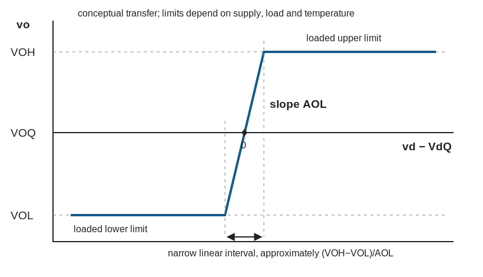
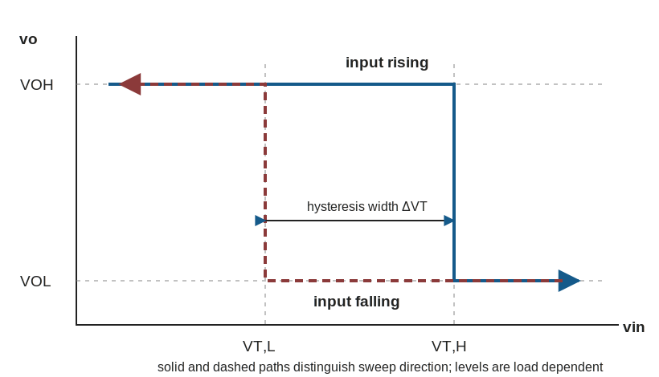
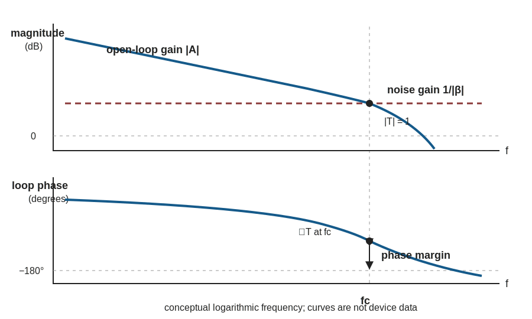

::: {.callout-note title="Chapter maturity — draft"}
This draft develops op-amp circuits from differential and loop gain through
closed-loop functions, practical limits, stability, and a datasheet-based
design. In Lab **L07**, you perform the corresponding physical measurements.
See the [reading roadmap](../roadmap.qmd) for the meaning of status levels.
:::

::: {.callout-warning title="Safety boundary for op-amp work"}
Practical work is limited to **current-limited, extra-low-voltage** supplies,
approved components, local supervision, and an approved procedure. Set the
supply current limit before connection, de-energize before rewiring, observe IC
orientation and capacitor polarity, and keep every applied input within the
device's permitted terminal-voltage range. Stop for smoke, odor, discoloration,
unexpected rapid temperature rise, oscillation that drives a load beyond its
rating, or loss of current limiting. This chapter does not authorize
mains-connected, medical, high-energy battery, RF-power, actuator, or other
safety-critical interfaces [@iec61010].
:::

## Central question

> When does feedback make an amplifier predictable, and when does the ideal
> op-amp approximation fail?

A transistor stage from [A03](a03-bias-small-signal-amplifiers.qmd) can provide
large gain. Its gain, however, depends on device parameters, bias, loading, and
temperature. An **operational amplifier (op amp)** combines several gain stages
in one device. It exposes two high-impedance inputs, a low-impedance output,
and supply terminals. These impedances are large or small only by comparison.
They remain finite and change with frequency.

In **open-loop operation**, no path returns the output to correct the input
error. Even a tiny voltage difference between the inputs then drives the output
toward a limit. **Negative feedback** returns part of the output with a sign
that opposes that difference. The op amp continually corrects the remaining
error. As a result, resistor or impedance ratios can control the
**closed-loop** function much more strongly than the op amp's internal gain
does [@sedra2020microelectronic; @astrom2021feedback].

Six changes to a non-inverting amplifier expose the conditions hidden by an
ideal-gain calculation. Before calculating, predict the result of each one:

- the open-loop gain falls by a factor of ten while the feedback resistors stay
  fixed;
- the signal frequency rises until the open-loop gain is no longer much larger
  than the intended closed-loop gain;
- the input common-mode voltage leaves its permitted range;
- the required output rises beyond a supply rail or requires too much load
  current;
- capacitance is connected directly from output to return; and
- the inverting and non-inverting input connections are exchanged.

“The op amp makes its inputs equal” cannot answer these questions. The device
produces output from the **difference** between its input voltages. The closed
loop can make that difference small only while the loop has the correct sign and
enough gain. It also needs enough **phase margin**, the angular distance from the
loop phase to $-180^\circ$ at the frequency where loop-gain magnitude equals
one. The demanded output must also lie inside the device's attainable voltage
and current range. A reliable analysis therefore follows one compact rule:

> Assume closed-loop operation, derive the demanded voltages and currents, then
> verify every condition that made the assumption possible.

## Learning outcomes

This chapter assumes [A03](a03-bias-small-signal-amplifiers.qmd): bias,
incremental gain, loading, headroom, saturation, and local feedback. It also
assumes [F08](../01-foundations/f08-sinusoids-impedance-frequency.qmd):
impedance, transfer functions, Bode plots, RMS phasors, and frequency response.
After completing the chapter, you should be able to:

- declare op-amp terminal references and derive closed-loop gain from finite
  differential gain rather than from ideal rules alone;
- explain loop gain, feedback factor, closed-loop sensitivity, the summing-node
  constraint, and the conditions under which “virtual short” and “virtual
  ground” are valid approximations;
- derive and use inverting, non-inverting, follower, summing, difference,
  **transimpedance** (output voltage per input current), low-pass, and practical
  integrating configurations;
- use an illustrative differential-pair, compensated-gain-stage, and output
  buffer model to connect internal mechanisms to external specifications
  without mistaking that model for a commercial-device schematic;
- distinguish a feedback amplifier from an open-loop comparator and design
  simple **hysteresis**, two switching thresholds that depend on sweep direction,
  with declared threshold values;
- calculate static error from finite open-loop gain, input offset voltage,
  input bias current, resistor tolerance, common-mode rejection, and output
  loading;
- calculate the separate small-signal bandwidth and large-signal slew-rate
  limits, and recognize saturation and overload recovery;
- reason from loop gain and noise gain to a stability screen, then identify
  capacitive loading, supply decoupling, layout, and measurement loading that
  require device-specific verification; and
- translate requirements into a datasheet-based design, executable
  cross-check, measurement plan, and uncertainty-guarded decision.

::: {.callout-note title="Scope boundary — feedback here, chain-level limits next"}
This chapter develops feedback deeply enough to design and verify ordinary
voltage-feedback op-amp stages. It introduces noise gain, phase margin, offset,
noise, distortion, and stability where they bound those stages.
[A06](a06-noise-nonlinearity-stability.qmd) owns full signal-chain noise,
nonlinearity, dynamic-range, bandwidth, and stability budgets. Dedicated
comparators, instrumentation amplifiers, sensor excitation, calibration,
grounding, shielding, and protection belong principally to
[A05](a05-sensors-instrumentation.qmd). A current-feedback amplifier controls its
internal correction current differently from the voltage-feedback devices used
here, so the constant gain-bandwidth approximation does not describe it.
Specialized RF amplifiers also require device-specific feedback and stability
methods.
Detailed differential pairs, current mirrors, active loads, output stages, and
IC process and layout choices belong to
[A07](a07-integrated-circuits.qmd).
:::

::: {.callout-tip title="A two-pass reading path"}
For a first pass, follow terminal references, finite feedback, canonical
circuits, attainable ranges, dynamic limits, stability, and the worked design.
On a second pass, return to the internal-stage bridge, stochastic noise and
distortion, conditional impedance transformation, and the full error
allocation. The second pass explains *why* the first-pass rules fail; it is not
optional for precision design.
:::

## Differential gain and closed-loop correction

### Terminal references and attainable operation

The schematic in @fig-a04-terminal-references declares the electrical boundary
before any idealization. TP0 is the reference chosen by the surrounding
circuit; it is not normally an op-amp terminal, and it is not automatically
earth, chassis, or a noise-free return. In a dual-supply circuit one commonly has
$V_{S-}<V_{\mathrm{TP0}}<V_{S+}$. In a single-supply circuit one commonly
chooses $V_{S-}=V_{\mathrm{TP0}}$ and calls $V_{S+}=V_{DD}$, but a separate
mid-supply signal reference may still be required. The supply pins are energy
ports even though the three-terminal signal symbol often hides them.

{#fig-a04-terminal-references fig-alt="An op amp with non-inverting and inverting input terminals, output terminal TPO, positive and negative supply terminals, and external circuit reference TP0. Input currents are positive into the input pins, output current is positive leaving the output, differential voltage is v plus minus v minus, and every terminal voltage is referenced to TP0. The negative power rail is explicitly distinguished from TP0." width="92%"}

Let $v_+(t)$ and $v_-(t)$ be instantaneous voltages at the non-inverting and
inverting input terminals, each positive relative to circuit reference TP0.
The **differential input voltage** is their signed difference. The **input
common-mode voltage** is their average:

$$
v_d(t)\equiv v_+(t)-v_-(t),
\qquad
v_{\mathrm{CM}}(t)\equiv
\frac{v_+(t)+v_-(t)}{2}.
$$ {#eq-a04-input-definitions}

Both relations are definitions. Small-change analysis is centered on a
**quiescent operating point**, the steady no-signal condition
$(V_{dQ},V_{OQ})$. Relative to that point, define
$\Delta v_d\equiv v_d-V_{dQ}$ and
$\Delta v_o\equiv v_o-V_{OQ}$. A positive change in $v_d$ asks the output to
move in the positive direction. The low-frequency, incremental open-loop
constitutive approximation is

$$
\Delta v_o=A_{\mathrm{OL}}\Delta v_d,
$$ {#eq-a04-open-loop}

where $v_o$ is positive at output TPO relative to TP0 and
$A_{\mathrm{OL}}>0$ is dimensionless incremental open-loop voltage gain.
Equivalently,
$v_o-V_{OQ}=A_{\mathrm{OL}}(v_d-V_{dQ})$. This is an **affine relation**: a
linear change is added to a fixed operating-point offset. That form matters
because $v_d$ does not change when you choose a different reference, whereas the
numerical value of $v_o$ does. The equation is not a conservation law and is
not valid for arbitrary output. It describes a bounded linear operating region.
The supply rails deliver the output energy; the input signal controls that
delivery.

The conceptual transfer in @fig-a04-open-loop-transfer shows why open-loop
linear operation is so difficult to observe. If the loaded output interval is
$V_{OL}<v_o<V_{OH}$, the corresponding differential-input interval is only
approximately

$$
\frac{V_{OL}-V_{OQ}}{A_{\mathrm{OL}}}
<v_d-V_{dQ}<
\frac{V_{OH}-V_{OQ}}{A_{\mathrm{OL}}},
$$ {#eq-a04-open-loop-input-window}

Its width is reference-independent:
$(V_{OH}-V_{OL})/A_{\mathrm{OL}}$. For
$A_{\mathrm{OL}}=100\,000$ and an illustrative 5.0 V total output interval,
the entire linear differential-input interval is only about 50 $\mu$V.
Outside it, the output approaches a load- and temperature-dependent limit
rather than continuing along the straight line.

{#fig-a04-open-loop-transfer fig-alt="Absolute output voltage versus differential-input departure from its quiescent value. A very steep central line crosses quiescent output V O Q with slope A O L and connects lower and upper limiting regions. The central differential-input interval is narrow, and the loaded output levels do not necessarily equal the supply rails." width="88%"}

Real operation also requires all of the following:

1. each input terminal voltage is within its permitted absolute and operating
   ranges;
2. $v_{\mathrm{CM}}$ is within the specified common-mode range;
3. the differential input voltage and any current through input-protection
   paths are within their permitted ranges, including power-off or
   input-before-supply conditions;
4. the demanded output voltage and current are within the specified output
   range for the actual load and temperature;
5. the signal changes slowly enough for the device's frequency and slew
   limits;
6. the feedback sign remains negative over the relevant frequency range; and
7. the supply is within range and locally bypassed as the manufacturer
   requires.

An op amp can violate one condition while apparently satisfying another.
**Rail-to-rail** describes input or output operation that extends close to both
supply voltages under stated conditions. It does not mean zero error at either
rail, equal drive into every load, or permission to exceed absolute input
ratings. The test conditions attached to each datasheet number remain part of
the claim
[@ti2026tlv906x].

### Finite-gain feedback relation

The signal-flow abstraction in @fig-a04-feedback-loop makes the feedback sign
explicit before the algebra. Every arrow carries a signed small-signal
quantity; the summing point subtracts the returned signal. A useful sign test
is immediate: a small positive change in $v_o$ must increase $v_f$ in a way
that decreases $v_d$. If it instead increases $v_d$, the loop is positive at
that frequency.

```{mermaid}
%%| label: fig-a04-feedback-loop
%%| fig-cap: "Canonical subtractive feedback. The arrows carry signed small-signal quantities; the returned signal is subtracted at the summing point. By convention T equals A beta with the explicit subtracting sign factored out."
%%| fig-alt: "A vertical incremental signal-flow loop. Source change delta v s enters a summing point. Returned change delta v f enters its subtracting port. Differential error change delta v d passes through forward amplifier A of s to output change delta v o. The output passes through feedback network beta of s and returns as delta v f."
%%| fig-width: 5.6
flowchart TB
  S["Source contribution Δvₛ"]
  E["Subtract return<br/>Δv_d = Δvₛ − Δv_f"]
  A["Forward amplifier A(s)"]
  O["Output Δvₒ"]
  B["Feedback network β(s)"]
  F["Returned signal Δv_f"]

  S --> E
  E --> A
  A --> O
  O --> B
  B --> F
  F --> E
```

This diagram describes the return loop; it does not replace the component
schematic. In an inverting amplifier, $\beta(s)$ is evaluated with independent
signal sources set to zero; it must not be confused with the signed signal gain
from $v_i$ to $v_o$. This chapter defines the conventional return-ratio magnitude
and phase as $T=A\beta$. The definition factors out the explicit minus sign at
the summing junction, so the characteristic equation is $1+T=0$. A signed
product that includes the displayed subtraction would instead be $-A\beta$.

In the scalar low-frequency case, the feedback network returns
$\Delta v_f=\beta\Delta v_o$. The dimensionless **feedback factor** $\beta$
states what fraction of an output change returns to the summing point. The
summing relation is

$$
\Delta v_d=\Delta v_s-\Delta v_f
=\Delta v_s-\beta\Delta v_o.
$$ {#eq-a04-error-sum}

Here $\Delta v_s$ is the incremental source contribution at the
non-inverting summing input. Substitution into @eq-a04-open-loop gives

$$
\Delta v_o=A_{\mathrm{OL}}
(\Delta v_s-\beta\Delta v_o).
$$

Therefore the exact closed-loop relation under this finite, linear,
frequency-independent approximation is

$$
A_{\mathrm{CL}}\equiv\frac{\Delta v_o}{\Delta v_s}
=\frac{A_{\mathrm{OL}}}{1+A_{\mathrm{OL}}\beta}.
$$ {#eq-a04-closed-loop}

The **loop gain** is

$$
T\equiv A_{\mathrm{OL}}\beta.
$$ {#eq-a04-loop-gain}

Thus

$$
A_{\mathrm{CL}}
=\frac{1}{\beta}\frac{T}{1+T}
=\frac{1/\beta}{1+1/T}.
$$ {#eq-a04-closed-loop-loopgain}

When $|T|\gg1$ and the loop is stable,

$$
A_{\mathrm{CL}}\approx\frac{1}{\beta},
\qquad
\frac{A_{\mathrm{CL}}-1/\beta}{1/\beta}
=-\frac{1}{1+T}\approx-\frac{1}{T}.
$$ {#eq-a04-feedback-approximation}

The first relation is an approximation, not an identity. It explains why a
passive feedback network can determine gain: the amplifier supplies enough
correction to make the input error small. The second relation gives the signed
relative gain error for positive real $T$ in this simple case.

The differential error is also finite:

$$
\Delta v_d=\frac{\Delta v_o}{A_{\mathrm{OL}}}
=\frac{\Delta v_s}{1+T}.
$$ {#eq-a04-differential-error}

If $A_{\mathrm{OL}}=100\,000$ and a stable non-inverting stage produces
$\Delta v_o=2.000$ V, then $\Delta v_d=20.0~\mu$V. Treating the input
increments as equal is excellent
for a millivolt-level calculation, but it erases the error mechanism needed for
a microvolt-level one.

### Sensitivity and impedance transformation

Differentiate the logarithm of @eq-a04-closed-loop with respect to the
logarithm of $A_{\mathrm{OL}}$, holding $\beta$ fixed:

$$
S_{A_{\mathrm{CL}}}^{A_{\mathrm{OL}}}
\equiv
\frac{\partial\ln A_{\mathrm{CL}}}
{\partial\ln A_{\mathrm{OL}}}
=\frac{1}{1+T}.
$$ {#eq-a04-sensitivity}

This dimensionless sensitivity is exact within the finite linear description.
Large loop gain reduces the effect of fractional open-loop-gain change by about
$1/T$. For the **voltage-series** topology represented by the canonical loop,
let $r_{id}$ be the open-loop differential input resistance and $r_o$ the
open-loop output resistance. Applying a test voltage at the series-mixed input
increases the current-producing differential voltage by only
$1/(1+T)$; applying a test current at the voltage-sampled output makes feedback
oppose the resulting output voltage by the same factor. Under the same linear
operating point, with the independent source set to zero for the output test,

$$
R_{\mathrm{in,cl}}\approx r_{id}(1+T),
\qquad
R_{\mathrm{out,cl}}\approx\frac{r_o}{1+T}.
$$ {#eq-a04-feedback-impedance-transform}

For complex $T$, these are impedance relations rather than simple positive
resistance multipliers. They also assume that the test source does not change
the operating point or bypass the sampled and mixed ports. Current sampling or
shunt mixing produces different transformations. The familiar $1+T$ factors
are therefore conditional topology results, not universal properties of every
feedback circuit [@astrom2021feedback; @sedra2020microelectronic].

### Conditional virtual constraints

The ideal voltage-feedback op-amp approximation uses two working constraints:

$$
i_+\approx i_-\approx0,
\qquad
v_+\approx v_-.
$$ {#eq-a04-ideal-constraints}

The first approximates high input impedance.
The result from @eq-a04-differential-error establishes only the incremental relation
$\Delta v_+\approx\Delta v_-$. The absolute relation
$v_+\approx v_-$ additionally neglects the quiescent differential voltage
$V_{dQ}$, including input offset, as a first-order idealization. Both require
active negative feedback, large loop gain, a stable loop, and an attainable
output operating point that is not voltage- or current-limited. Neither is a
device law.

A **virtual short** means nearly equal voltages without a physical short and
without implying equal terminal currents. A **virtual ground** is narrower: an
input node is nearly at TP0 because feedback makes it follow another input that
is actually tied to TP0. It is not a return conductor, cannot absorb arbitrary
current, and ceases to be near zero when the output saturates or the loop opens.

::: {.callout-important title="A reliable order of analysis"}
First assume the linear closed-loop region and use the ideal constraints to
derive the demanded transfer. Then calculate every input voltage, output
voltage, output current, bandwidth, and error that the result implies. Finally
compare those demands with condition-matched device specifications. If any
check fails, discard the ideal result and solve the relevant limited region.
:::

## Resistor feedback realizes standard voltage functions

The two canonical configurations are shown in @fig-a04-inverting-noninverting.
All node voltages are positive relative to TP0. Currents through the input and
feedback resistors are declared toward the
inverting summing node and away from it, respectively.

{#fig-a04-inverting-noninverting fig-alt="Two op-amp panels. The inverting stage sends input voltage through R IN to the inverting summing node, with R F returning output to that node and the non-inverting input at reference. The non-inverting stage drives the plus input directly; R F and R G form the feedback divider from output to reference at the minus input. Test points identify input, summing node, output, and zero-volt reference." width="100%"}

### Inverting gain and summing-node current

For the inverting circuit, let
$v_i=V(\mathrm{TPI})-V(\mathrm{TP0})$ and
$v_o=V(\mathrm{TPO})-V(\mathrm{TP0})$. The non-inverting input is at TP0.
Assume negligible input current, large stable loop gain, attainable output, and
resistors that can be treated as lumped and linear over the frequency range.
Then $v_-\approx0$. KCL at the summing node gives

$$
\frac{v_i-v_-}{R_{\mathrm{IN}}}
=\frac{v_--v_o}{R_F}.
$$

With $v_-\approx0$,

$$
\boxed{\frac{v_o}{v_i}\approx-\frac{R_F}{R_{\mathrm{IN}}}}.
$$ {#eq-a04-inverting-gain}

The negative sign follows from the declared polarities: a positive input
requires a negative output to return balancing current through $R_F$. It does
not mean negative power gain. The source sees approximately
$R_{\mathrm{IN}}$ because the summing node remains nearly at TP0; therefore the
configuration is not an infinite-input-resistance voltage buffer.

The **noise gain** is the closed-loop gain from a small voltage source placed in
series with the non-inverting input while independent signal sources are set to
zero:

$$
G_N=1+\frac{R_F}{R_{\mathrm{IN}}}.
$$ {#eq-a04-inverting-noise-gain}

Noise gain, not the magnitude of signal gain, sets the first bandwidth and
stability screen for an ordinary voltage-feedback op amp. An inverting signal
gain of zero can still have noise gain greater than one.

**Worked example — an inverting stage.** Let
$R_{\mathrm{IN}}=10.0$ k$\Omega$, $R_F=47.0$ k$\Omega$, and
$v_i=+0.300$ V DC. The ideal closed-loop prediction is

$$
v_o\approx-\frac{47.0}{10.0}(0.300~\text{V})
=-1.41~\text{V}.
$$

The input and feedback currents are both approximately
$0.300~\text{V}/10.0~\text{k}\Omega=30.0~\mu$A. Their units and signs agree
with KCL. On a $\pm2.5$ V supply this output may be feasible; on a 0 V to 5 V
single supply it is not. The same resistor calculation cannot decide both
circuits because their attainable output regions differ.

### Non-inverting gain and follower limit

For the non-inverting circuit,
$v_+=v_i$ and the unloaded feedback divider gives

$$
v_-=\beta v_o,
\qquad
\beta=\frac{R_G}{R_F+R_G}.
$$

With $v_+\approx v_-$,

$$
\boxed{\frac{v_o}{v_i}\approx
1+\frac{R_F}{R_G}}.
$$ {#eq-a04-noninverting-gain}

The signal source drives a high-impedance input rather than
$R_{\mathrm{IN}}$. This advantage is conditional on input bias, leakage,
capacitance, common-mode range, and protection paths.

As $R_F\rightarrow0$ and $R_G\rightarrow\infty$, the output connects directly
to the inverting input and

$$
\frac{v_o}{v_i}\approx1.
$$ {#eq-a04-follower}

This voltage follower is not redundant: it can isolate a high-resistance
source from a lower-resistance load. It still has finite input error, output
current, bandwidth, slew rate, and stability limits. Some decompensated
amplifiers are not stable at noise gain one, so “op amp” does not by itself
guarantee follower operation [@sedra2020microelectronic].

### Weighted sums and differences

The circuits in @fig-a04-summing-difference extend the same KCL reasoning. In
the inverting summer, input currents are referenced from sources
$v_1,\ldots,v_n$ toward the summing node. With the non-inverting input at TP0,

$$
v_o\approx-R_F
\left(
\frac{v_1}{R_1}+\frac{v_2}{R_2}+\cdots+\frac{v_n}{R_n}
\right).
$$ {#eq-a04-summing}

Each coefficient is dimensionless. Equal input resistors give a scaled,
inverted sum. The output must supply the sum of feedback and load currents, so
adding channels does not remove output-current limits.

{#fig-a04-summing-difference fig-alt="Two op-amp panels. An inverting summer routes two named input voltages through separate resistors into one inverting summing node and returns output through a feedback resistor. A difference stage applies v 1 through R 1 to the inverting input with feedback R 2, while v 2 drives a matched divider R 3 and R 4 at the non-inverting input." width="100%"}

For the difference stage, first define
$v_1$, $v_2$, and $v_o$ positive at their named nodes relative to TP0. The
non-inverting divider establishes

$$
v_+=v_2\frac{R_4}{R_3+R_4}.
$$

KCL at the inverting node, with $v_-\approx v_+$, gives

$$
v_o\approx
\left(1+\frac{R_2}{R_1}\right)
\frac{R_4}{R_3+R_4}v_2
-\frac{R_2}{R_1}v_1.
$$ {#eq-a04-difference-general}

If the ratios satisfy

$$
\frac{R_2}{R_1}=\frac{R_4}{R_3}=k,
$$ {#eq-a04-difference-ratio}

then

$$
\boxed{v_o\approx k(v_2-v_1)}.
$$ {#eq-a04-difference-gain}

The ratio equality, not four identical nominal values, creates common-mode
cancellation. Independent resistor tolerances convert common-mode input into
output error. The source resistances also alter the effective ratios. A
discrete four-resistor difference stage is therefore not automatically an
instrumentation amplifier; A05 develops the buffered, precision-ratio
structures used for demanding sensor interfaces.

**Worked tolerance screen.** Suppose the inverting ratio is
$R_2/R_1=10.000$, while the non-inverting ratio is 0.20% higher:
$R_4/R_3=10.020$. For equal inputs
$v_1=v_2=v_{\mathrm{CM}}=2.50$ V, @eq-a04-difference-general gives

$$
v_o=
\left[
11\left(\frac{10.020}{11.020}\right)-10
\right]\times(2.50~\text{V})
=4.54~\text{mV}.
$$

That is 4.54% of the intended 100 mV output from a 10.0 mV differential
signal. Opposite worst-case corners of four independently toleranced resistors
can be worse. The exact bound must use all four individual limits and their
correlation rather than multiplying common-mode voltage by nominal
differential gain and ratio mismatch.

## Impedance feedback shapes frequency response

### General inverting relation

In sinusoidal steady state, let underlined quantities be RMS phasors using the
$e^{j\omega t}$ convention from F08. Replace
$R_{\mathrm{IN}}$ and $R_F$ by impedances $Z_{\mathrm{IN}}(j\omega)$ and
$Z_F(j\omega)$. Under the same ideal closed-loop constraints, KCL gives

$$
\frac{\underline V_o}{\underline V_i}
\approx-\frac{Z_F(j\omega)}{Z_{\mathrm{IN}}(j\omega)}.
$$ {#eq-a04-inverting-impedance}

This compact relation is not permission to ignore op-amp dynamics. It describes
the intended external transfer only where loop gain remains large and stable
and where component parasitics do not invalidate the chosen impedances.

### Current-to-voltage conversion

The same summing-node KCL converts current to voltage.
In @fig-a04-transimpedance, define $i_s$ positive **into** the inverting node,
hold $v_+=V_{\mathrm{REF}}$, and let the feedback impedance carry current from
the summing node toward the output. With negligible op-amp input current and
$v_-\approx V_{\mathrm{REF}}$,

$$
\underline I_s\approx
\frac{\underline V_{\mathrm{REF}}-\underline V_o}{Z_F(j\omega)},
\qquad
\underline V_o\approx
\underline V_{\mathrm{REF}}-\underline I_sZ_F(j\omega).
$$ {#eq-a04-transimpedance}

Thus the **transimpedance**, the voltage output divided by current input,
$\underline V_o/\underline I_s$, is $-Z_F$ when
$V_{\mathrm{REF}}=0$. The sign follows from the declared current arrow: more
current entering the node requires a lower output voltage to carry that current
away through $Z_F$.

{#fig-a04-transimpedance fig-alt="An op amp transimpedance circuit. Current i s is defined positive into the inverting summing node TP minus. Feedback impedance Z F connects output to that node. The non-inverting input is held at V REF. Source capacitance C S connects the summing node to circuit reference TP0. The annotated ideal relation is v o approximately V REF minus i s times Z F." width="92%"}

The shunt source capacitance $C_S$ does not appear in the ideal signal
relation because feedback holds the summing-node voltage nearly constant. It
does appear in stability. With the independent current source set to zero,
the deliberately restricted source shown has $Z_S=1/(sC_S)$ and the noise
gain is

$$
G_N(s)=1+\frac{Z_F(s)}{Z_S(s)}.
$$ {#eq-a04-transimpedance-noise-gain}

It can rise toward loop crossover even while the intended transimpedance looks
well behaved. A feedback capacitor is often selected from the complete
source-capacitance, noise-gain, bandwidth, and stability requirements, not from
signal gain alone. A real sensor may add shunt resistance, series resistance,
package capacitance, and cable impedance to $Z_S$.
[A05](a05-sensors-instrumentation.qmd) develops the photodiode and sensor
interface; the present example establishes the feedback mechanism.

### First-order active low-pass stage

In @fig-a04-filter-integrator(a), $R_F$ is in parallel with $C_F$, so

$$
Z_F=
\left(\frac{1}{R_F}+j\omega C_F\right)^{-1}
=\frac{R_F}{1+j\omega R_FC_F}.
$$

Therefore

$$
H_{\mathrm{LP}}(j\omega)
\equiv\frac{\underline V_o}{\underline V_i}
\approx
-\frac{R_F/R_{\mathrm{IN}}}
{1+j\omega R_FC_F},
$$ {#eq-a04-active-lowpass}

with pole

$$
f_p=\frac{1}{2\pi R_FC_F}.
$$ {#eq-a04-lowpass-pole}

At $f\ll f_p$, the gain approaches $-R_F/R_{\mathrm{IN}}$. At
$f=f_p$, its magnitude is lower by $1/\sqrt2$ and its additional phase is
$-45^\circ$. At $f\gg f_p$, the magnitude falls approximately
20 dB per decade. These are limiting cases of the first-order external
network; the op amp adds further poles and phase.

{#fig-a04-filter-integrator fig-alt="Two op-amp panels show the same feedback resistor in parallel with capacitor C F. The first emphasizes finite DC gain and the low-pass pole; the second emphasizes the integrating band and uses R P to limit DC gain and provide a bias-current return. Both declare capacitor voltage from the summing node toward output and capacitor current in that direction." width="100%"}

**Worked example — low-pass selection.** For a DC gain of $-4.70$, choose
$R_{\mathrm{IN}}=10.0$ k$\Omega$ and $R_F=47.0$ k$\Omega$. For
$f_p=1.00$ kHz,

$$
C_F=\frac{1}{2\pi(47.0~\text{k}\Omega)(1.00~\text{kHz})}
=3.39~\text{nF}.
$$

A 3.3 nF nominal capacitor gives
$f_p\approx1.03$ kHz before tolerance and parasitics. A requirement of
$f_p<1.00$ kHz would not pass merely because the displayed nominal result
rounds near 1 kHz; component tolerance must be carried into the decision.

### Practical integration

An ideal inverting integrator would use $Z_F=1/(j\omega C_F)$:

$$
\frac{\underline V_o}{\underline V_i}
\approx-\frac{1}{j\omega R_{\mathrm{IN}}C_F}.
$$ {#eq-a04-ideal-integrator}

Equivalently in time, within the linear operating interval,

$$
\frac{dv_o}{dt}\approx
-\frac{v_i(t)}{R_{\mathrm{IN}}C_F}.
$$ {#eq-a04-integrator-time}

A sign derivation requires the capacitor state. Define charge on the
summing-node plate as $q=C_F(v_--v_o)$ and capacitor current positive from the
summing node toward the output as
$i_C=dq/dt=C_F\,d(v_--v_o)/dt$. With $v_-\approx0$, KCL gives
$v_i/R_{\mathrm{IN}}\approx i_C=-C_F\,dv_o/dt$, which produces the relation
in @eq-a04-integrator-time. Integrating from an initial time $t_0$ gives

$$
v_o(t)\approx v_o(t_0)
-\frac{1}{R_{\mathrm{IN}}C_F}
\int_{t_0}^{t}v_i(\tau)\,d\tau.
$$ {#eq-a04-integrator-state}

The initial capacitor charge therefore matters. It is not erased by writing a
transfer function.

A nonzero DC input or input offset would integrate without bound in the ideal
equation, while the real output reaches a rail.
The circuit in @fig-a04-filter-integrator(b) places $R_P$ in parallel with
$C_F$. Its feedback impedance is

$$
Z_F=\frac{R_P}{1+j\omega R_PC_F}.
$$

Below $1/(2\pi R_PC_F)$ it behaves as a finite-gain inverting amplifier;
well above that frequency, but below the op amp's own useful bandwidth, it
approaches integration. $R_P$ also provides a DC feedback and bias-current
path. With $v_-\approx0$, its time-domain equation is

$$
C_F\frac{dv_o}{dt}+\frac{v_o}{R_P}
\approx-\frac{v_i}{R_{\mathrm{IN}}}.
$$ {#eq-a04-practical-integrator}

For constant input, the finite equilibrium is
$v_o\approx-(R_P/R_{\mathrm{IN}})v_i$ if it lies within the output range. A
differentiator is possible by exchanging the reactive placement, but
it amplifies high-frequency noise and parasitic effects; a useful realization
therefore requires explicit band limiting [@sedra2020microelectronic].

The “low-pass” and “practical integrator” panels are the **same
$R\parallel C$ feedback topology** viewed in different frequency regimes.
Calling it a low-pass stage emphasizes its finite DC gain and pole; calling it
a practical integrator emphasizes operation sufficiently above that pole that
$|1/(j\omega C_F)|\ll R_P$. The circuit name does not change the transfer
function or remove the need to check the op amp's own loop bandwidth.

## Comparison requires a different operating assumption

An op amp without negative feedback does not satisfy $v_+\approx v_-$.
In @fig-a04-comparator-hysteresis(a), the open-loop relation drives the output
toward its high limiting state when $v_+>v_-$ and toward its low limiting state
when $v_+<v_-$. The exact limiting voltages, propagation delay, input range,
input phase reversal behavior, and overload recovery are device properties.
**Input phase reversal** is an unintended change in output polarity after an
input leaves its permitted common-mode range.

{#fig-a04-comparator-hysteresis fig-alt="Two op-amp-like comparison circuits. The first compares signal input v i at the non-inverting input with V REF at the inverting input and drives output toward a limit. The second returns output through positive-feedback resistor R H to non-inverting threshold node v T, connects V REF to that node through R B, and applies the signal at the inverting input, creating lower and upper thresholds V T L and V T H." width="100%"}

A **comparator** is an amplifier designed and specified to switch between
output states when one input crosses the other. Comparators are normally the
better choice for this job because manufacturers specify their open-loop
switching behavior and offer output structures suited to logic interfaces.
Some op amps tolerate repeated saturation poorly or recover slowly. Others
forbid differential input conditions that a comparator accepts. The triangle
symbol alone cannot justify the choice
[@horowitz2015art; @sedra2020microelectronic].

Positive feedback can add **hysteresis**, two different switching thresholds
that depend on the current output state. A slowly changing noisy input then
does not cause repeated switching.
For @fig-a04-comparator-hysteresis(b), define the threshold node voltage
positive relative to TP0. With negligible input current,

$$
v_T=
\frac{R_H}{R_B+R_H}V_{\mathrm{REF}}
+\frac{R_B}{R_B+R_H}v_o.
$$ {#eq-a04-hysteresis-threshold}

The output state therefore selects one of two thresholds:

$$
V_{T,H}=
\frac{R_HV_{\mathrm{REF}}+R_BV_{OH}}{R_B+R_H},
\qquad
V_{T,L}=
\frac{R_HV_{\mathrm{REF}}+R_BV_{OL}}{R_B+R_H}.
$$ {#eq-a04-hysteresis-levels}

Their separation is

$$
\Delta V_T=V_{T,H}-V_{T,L}
=\frac{R_B}{R_B+R_H}(V_{OH}-V_{OL}).
$$ {#eq-a04-hysteresis-width}

These equations use actual loaded output levels, not ideal supply rails. The
switching sense depends on which input receives the signal; redraw the
polarity rather than memorizing “upper” and “lower” threshold signs.

The plot in @fig-a04-hysteresis-transfer traces that switching sense. On a rising input,
the inverting Schmitt trigger stays at $V_{OH}$ until the threshold associated
with the high output, $V_{T,H}$, is crossed. On a falling input, it stays at
$V_{OL}$ until $V_{T,L}$ is crossed. The two paths are state dependent; a
single-valued static gain curve cannot represent them.

{#fig-a04-hysteresis-transfer fig-alt="Output voltage versus input voltage for an inverting Schmitt trigger. With input rising, output remains at V OH until upper threshold V T H and then drops to V OL. With input falling, output remains low until lower threshold V T L and then rises. The gap between thresholds is the hysteresis width." width="88%"}

## Non-ideal behavior sets error and range limits

### Finite gain and resistor uncertainty

For the non-inverting stage, retain finite $A_{\mathrm{OL}}$ and
$\beta=R_G/(R_F+R_G)$. From @eq-a04-closed-loop,

$$
\frac{\Delta v_o}{\Delta v_i}
=\frac{A_{\mathrm{OL}}}
{1+A_{\mathrm{OL}}\beta}.
$$ {#eq-a04-noninverting-finite}

Let the ideal noise gain be $G_N=1/\beta$. Then

$$
\frac{\Delta v_o}{\Delta v_i}
=\frac{G_N}{1+G_N/A_{\mathrm{OL}}}.
$$ {#eq-a04-finite-noisegain}

For $G_N=10.0$ and $A_{\mathrm{OL}}=100\,000$, the finite-gain result is
$9.9990$, a relative error of about $-100~\mu$V/V. If open-loop gain falls with
frequency, that error grows even before the conventional closed-loop corner.
Resistor-ratio tolerance can be larger or smaller; the two error mechanisms
must be budgeted separately.

### Input offset and bias currents

**Input offset voltage** $V_{\mathrm{OS}}$ represents the small differential
input a real op amp needs to produce its nominal balanced output. A differential
voltage source represents it in the first-order error analysis.
Its sign is generally not predictable for an untrimmed individual device.
The equivalent circuit in @fig-a04-static-input-errors collects that signed
source, both bias currents, source and reference Thévenin resistances, and the
compensation resistor on one declared boundary. It is an error-accounting
device, not a claim that a physical voltage source exists inside the IC.

{#fig-a04-static-input-errors fig-alt="An inverting op-amp error equivalent. A source Thévenin voltage and resistance feed R IN and the inverting node; R F returns output. Bias current I B minus enters that pin. The non-inverting reference has Thévenin resistance and compensation resistor R B, followed by a signed series offset source whose op-amp side is positive; bias current I B plus enters the plus pin. Supply pins, loaded output, and TP0 are explicit. A note gives the resistance-matching condition with independent sources set to zero." width="96%"}

Referred to output, a first estimate is

$$
V_{o,\mathrm{OS}}\approx G_NV_{\mathrm{OS}},
$$ {#eq-a04-offset-output}

where $G_N$ is the circuit's DC noise gain. This relation is conditional on
linear operation and ignores bias-current and resistor errors.

Real input terminals also draw **input bias currents**, the DC currents needed
by the input stage or its protection and bias paths. Declare $I_{B+}$ and
$I_{B-}$ positive **into** their respective input terminals. In an inverting stage,
source and feedback resistances convert $I_{B-}$ into a node-voltage and output
error. With the independent input source set to zero, the non-inverting input
connected directly to its reference, and the inverting summing node nearly at
that reference, KCL gives the first-order contribution

$$
V_{o,B-}\approx R_FI_{B-}.
$$ {#eq-a04-bias-inverting}

Let $R_{S,\mathrm{th}}$ be the source's Thévenin resistance after its
independent voltage is set to zero, and let $R_{\mathrm{REF,th}}$ be the
non-inverting reference source's Thévenin resistance. Adding a series
compensation resistor $R_B$ so that the two input terminals see approximately
equal DC resistance gives

$$
R_B+R_{\mathrm{REF,th}}
\approx (R_{\mathrm{IN}}+R_{S,\mathrm{th}})\parallel R_F.
$$ {#eq-a04-bias-compensation}

For ideal zero-resistance signal and reference sources, this reduces to the
familiar $R_B\approx R_{\mathrm{IN}}\parallel R_F$. The resistor between the
non-inverting input and its reference makes
$v_+-V_{\mathrm{REF}}\approx-I_{B+}(R_B+R_{\mathrm{REF,th}})$. Its output
contribution is approximately
$-G_NI_{B+}(R_B+R_{\mathrm{REF,th}})$. Because
$G_N(R_{\mathrm{IN}}\parallel R_F)=R_F$, the ideal-source special case gives

$$
V_{o,B}\approx
R_F(I_{B-}-I_{B+})=R_FI_{\mathrm{OS}},
$$ {#eq-a04-bias-compensated}

where the signed definition here is
$I_{\mathrm{OS}}\equiv I_{B-}-I_{B+}$. Datasheets often specify only its
magnitude. The resistor therefore cancels the first-order effect of equal bias
currents; it does not cancel their mismatch, input offset voltage, resistor
tolerance, or temperature dependence.

For an **illustrative** bipolar-input case with
$R_{\mathrm{IN}}=10.0$ k$\Omega$, $R_F=100$ k$\Omega$,
$I_{B+}=50$ nA, and $I_{B-}=55$ nA, uncompensated inverting-input current
contributes 5.50 mV at the output. Choosing
$R_B=R_{\mathrm{IN}}\parallel R_F=9.09$ k$\Omega$ reduces the first-order
result to $R_F(5~\text{nA})=0.500$ mV. These invented currents teach the KCL
mechanism; they do not characterize a device
[@horowitz2015art; @sedra2020microelectronic].

CMOS device input bias current can rise strongly with temperature. Board
contamination creates a separate external surface-leakage path; it must be
represented and diagnosed separately rather than attributed to the IC's input
bias specification [@ti2026tlv906x].

### Common-mode and supply rejection

The **common-mode rejection ratio (CMRR)** describes how strongly an amplifier
rejects a change shared by both inputs. The **power-supply rejection ratio
(PSRR)** describes how strongly it rejects a supply change. Both express the
residual change as an input-referred error under specified conditions. A
convenient CMRR magnitude definition is

$$
\mathrm{CMRR}=20\log_{10}
\left|\frac{A_d}{A_{\mathrm{CM}}}\right|,
$$ {#eq-a04-cmrr}

where $A_d$ and $A_{\mathrm{CM}}$ use the same voltage-gain units and declared
output reference. Equivalent datasheet definitions may report input-referred
change directly. A value in decibels is incomplete without frequency,
common-mode interval, supply, temperature, and measurement conditions.

If CMRR is defined by @eq-a04-cmrr and is treated as constant over a declared
small change $\Delta V_{\mathrm{CM}}$, the equivalent differential input error
screen is

$$
|\Delta V_{\mathrm{eq,CM}}|
\approx
\frac{|\Delta V_{\mathrm{CM}}|}
{10^{\mathrm{CMRR}/20}},
\qquad
|\Delta V_{o,\mathrm{CM}}|
\approx G_N|\Delta V_{\mathrm{eq,CM}}|.
$$ {#eq-a04-cmrr-error}

For 80 dB CMRR, a 1.00 V common-mode change corresponds to a 100 $\mu$V
input-referred and, at $G_N=4$, a 400 $\mu$V output-referred screen.

One common PSRR convention is

$$
\mathrm{PSRR}=20\log_{10}
\left|\frac{\Delta V_S}{\Delta V_{\mathrm{eq,S}}}\right|,
$$ {#eq-a04-psrr}

where $\Delta V_S$ is a declared supply change and
$\Delta V_{\mathrm{eq,S}}$ is its input-referred offset-equivalent change.
Under that convention, replace $\Delta V_{\mathrm{CM}}$ and CMRR in the
relation @eq-a04-cmrr-error by $\Delta V_S$ and PSRR. Manufacturers may instead tabulate
$\mu$V/V or separate positive- and negative-supply rejection; use the
datasheet's own definition before converting a number.

The TLV906x datasheet illustrates why conditions cannot be discarded: its
minimum CMRR differs between a restricted common-mode interval and the full
rail-extending interval over $-40$ °C to 125 °C. Its input common-mode range
may extend 0.1 V beyond each rail under stated operating conditions, but that
does not authorize exceeding absolute maximum terminal ratings
[@ti2026tlv906x].

### Noise and small-signal distortion are loop-shaped

**Noise gain is a transfer function, not a random-noise specification.** Let
$e_n(f)$ be the op amp's input voltage-noise amplitude spectral density in
V/$\sqrt{\text{Hz}}$, and let $i_{n-}(f)$ be its inverting-input
current-noise amplitude spectral density in A/$\sqrt{\text{Hz}}$. A
first-order output-referred screen is

$$
e_{o,e}(f)\approx
\left|G_N(j2\pi f)\right|e_n(f),
\qquad
e_{o,i-}(f)\approx
\left|Z_F(j2\pi f)\right|i_{n-}(f).
$$ {#eq-a04-opamp-noise-transfer}

For uncorrelated sources, powers rather than amplitudes add. If
$S_{e_n}=e_n^2$ and $S_{i_n}=i_n^2$, then a deliberately incomplete spectrum
is

$$
S_{v_o}(f)\approx
|G_N|^2S_{e_n}+|Z_F|^2S_{i_n}+\cdots,
\qquad
v_{n,\mathrm{rms}}=
\sqrt{\int_{f_1}^{f_2}S_{v_o}(f)\,df}.
$$ {#eq-a04-integrated-noise}

The ellipsis matters: source and resistor thermal noise, non-inverting current
noise, reference noise, correlations, interference, aliasing, and the
measurement bandwidth may all contribute. The integration also requires the
frequency dependence of both source spectra and transfer functions; multiplying
a wideband density by $\sqrt{f_2-f_1}$ is valid only when the integrand is
effectively flat. A06 owns the complete noise budget.

Within the stable, nonsaturated small-signal region, negative feedback can
reduce forward-path nonlinear error by a factor of order $1/(1+T)$ at the
distortion frequency. It cannot correct an unattainable output, common-mode
failure, current limit, or slew-limited waveform, and nonlinear internal
dynamics can create harmonics whose loop gains differ. **Total harmonic
distortion (THD)** compares the combined RMS content of output harmonics with
the RMS content of the fundamental under declared bandwidth and loading
conditions. Consequently “low closed-loop THD” and “no visible clipping” are
separate claims
[@sedra2020microelectronic; @horowitz2015art].

### Output swing, current, and load

The output is a controlled source with finite current and voltage capability.
Define the total op-amp output current $i_o$ positive leaving TPO, as shown in
the declared references of @fig-a04-terminal-references. For a resistive load $R_L$ connected to
reference, define its component $i_L$ positive leaving TPO toward the load:

$$
i_L=\frac{v_o}{R_L}.
$$ {#eq-a04-load-current}

The feedback network also draws current, and capacitive load current is
$i_C=C_L\,dv_o/dt$ with charge on the output-side capacitor plate defined as
$q=C_Lv_o$. The total output current is their signed sum plus any other path.
A short-circuit-current specification is a protective or test-condition value,
not a recommended continuous operating point.

Output swing must be checked at the actual load. The TLV906x datasheet, for
example, specifies different rail headroom at 10 k$\Omega$ and 2 k$\Omega$
loads under its stated supply and temperature conditions
[@ti2026tlv906x]. “Rail-to-rail output” is therefore a family description, not
the equation $v_o=V_+$ or $v_o=V_-$ under arbitrary current.

The IC must also dispose of the power it absorbs. For a boundary drawn around
the package, define every terminal current positive **into** the IC and every
terminal voltage relative to TP0. The passive-sign accounting identity is

$$
p_{\mathrm{IC}}(t)=\sum_k v_k(t)i_k(t),
\qquad
P_{\mathrm{IC}}=\langle p_{\mathrm{IC}}(t)\rangle .
$$ {#eq-a04-ic-power}

For the output convention declared above, the output-port term is $-v_oi_o$
because $i_o$ was defined leaving the IC. This prevents counting
load power twice. Quiescent supply power, output source or sink operation,
short-circuit protection, waveform duty cycle, package thermal resistance,
ambient temperature, copper area, and neighboring heat sources all affect
junction temperature. A simple
$T_J\approx T_A+\theta_{JA}P_{\mathrm{IC}}$ screen is useful only with the
manufacturer's board and airflow assumptions; it is not a substitute for the
datasheet's dissipation and absolute-maximum limits. Average electrical power
entering the package equals internal dissipation only when the average rate of
electrical stored-energy change is zero; it equals outward heat flow only at
thermal steady state. Keep this IC boundary separate from power dissipated in
the external reference generator, load, and feedback network.

## Inside an op amp: mechanisms behind the limits

At this point the external feedback functions and their static limits are
established. Opening the op-amp block by one level now connects those limits to
the dynamic behavior that follows. A complete transistor-by-transistor design
would interrupt that path and would be strongly device- and process-dependent.
The circuit in @fig-a04-internal-stages is therefore an **illustrative architecture**, not a
reconstruction of the TLV9061 or any other proprietary circuit. It connects
the transistor gain, current-mirror, and Miller concepts from A03 to an
illustrative differential pair, compensated voltage-amplifier stage, and
output buffer
[@sedra2020microelectronic; @horowitz2015art].

{#fig-a04-internal-stages fig-alt="An illustrative, not device-specific, op-amp interior. Bipolar transistors Q1 and Q2 form a differential pair driven by v minus and v plus and biased by a tail current. PNP transistors Q3 and Q4 form a current-mirror active load and produce a single-ended high-resistance node v x. An inverting voltage-gain and level-shift stage, Miller compensation capacitor C C, and non-inverting class-AB output buffer lead to v o." width="100%"}

For a matched bipolar pair in forward-active operation, with ideal tail
current $I_T$, negligible base currents, thermal voltage $V_T$, and the
balanced quiescent point $V_{dQ}=0$, the collector currents are

$$
i_{C+}=\frac{I_T}{2}
\left[1+\tanh\left(\frac{v_d}{2V_T}\right)\right],
\qquad
i_{C-}=\frac{I_T}{2}
\left[1-\tanh\left(\frac{v_d}{2V_T}\right)\right],
$$ {#eq-a04-differential-pair-currents}

Here $i_{C+}$ belongs to the transistor driven by $v_+$ and $i_{C-}$ to the
one driven by $v_-$. Their difference is

$$
i_{C+}-i_{C-}
=I_T\tanh\left(\frac{v_d}{2V_T}\right),
\qquad
\Delta(i_{C+}-i_{C-})
\approx \frac{I_T}{2V_T}\Delta v_d
\equiv g_{md}\Delta v_d.
$$ {#eq-a04-differential-pair-gm}

The first relation is the full matched-pair law. The second is its
linearization for $|\Delta v_d|\ll2V_T$ about $V_{dQ}=0$, so
$g_{md}=I_T/(2V_T)$. At a nonzero quiescent differential voltage the
derivative would include
$\operatorname{sech}^2(V_{dQ}/2V_T)$. The current mirror combines the
opposing collector-current changes into a single-ended signal. Pair and mirror
mismatch appear externally as input offset; finite tail-source resistance
degrades common-mode rejection; and transistor headroom helps determine the
permitted input common-mode range.

This bipolar $\tanh$ relation is a teaching example; it is not the input law of
the CMOS TLV9061 selected later. The following $\Delta$ variables explicitly
denote departures from the selected quiescent point, so adding a constant
reference voltage does not change the incremental relations.

Let the mirror drive node $v_x$, whose effective small-signal resistance to the
bias network is $r_x$ and effective capacitance is $C_x$. In the internal
circuit of @fig-a04-internal-stages, the physical compensation capacitor spans internal
nodes; $C_x$ denotes its Miller-shaped
effect together with parasitics, not a claim that the capacitor is physically
connected to TP0. A first-order incremental node equation is

$$
C_x\frac{d\Delta v_x}{dt}
+\frac{\Delta v_x}{r_x}
\approx-g_{md}\Delta v_d.
$$ {#eq-a04-internal-node}

If the following voltage-gain and level-shift stage is inverting with magnitude
$k_o$, so $\Delta v_o\approx-k_o\Delta v_x$, then

$$
A(s)\equiv\frac{\Delta V_o(s)}{\Delta V_d(s)}
\approx
\frac{k_og_{md}r_x}{1+s r_xC_x}.
$$ {#eq-a04-internal-one-pole}

Thus $A_0\approx k_og_{md}r_x$,
$\omega_p\approx1/(r_xC_x)$, and the one-pole unity-gain frequency is
$\omega_T\approx k_og_{md}/C_x$. The units close:
$g_{md}r_x$ and $k_o$ are voltage-gain factors, while
$g_{md}/C_x$ has units s$^{-1}$. Because
$\Delta v_o=-k_o\Delta v_x$, define
$I_{\mathrm{ch}+}$ as the magnitude of net current that removes charge from
$C_x$ and drives the output positive, and $I_{\mathrm{ch}-}$ as the magnitude
that adds charge and drives the output negative. The causal large-signal
estimates are then

$$
\left(\frac{d\Delta v_o}{dt}\right)_{\max}
\approx\frac{k_oI_{\mathrm{ch}+}}{C_x},
\qquad
\left|\left(\frac{d\Delta v_o}{dt}\right)_{\min}\right|
\approx\frac{k_oI_{\mathrm{ch}-}}{C_x}.
$$ {#eq-a04-internal-slew}

These relations explain why positive and negative slew rates need not match
and why adding compensation trades speed for a more manageable loop response.
They are architectural approximations, not parameter-extraction equations for
an unknown commercial design.

| Internal element or stage | Principal externally visible consequences |
|---|---|
| Input differential pair and tail source | $V_{\mathrm{OS}}$, $I_B$, input noise, CMRR, differential-input and common-mode limits |
| Mirror or active load and high-resistance node | open-loop gain, headroom, internal poles, saturation and recovery |
| Compensation and internal charging paths | dominant pole, GBP, phase margin, positive/negative slew rate, settling |
| Output buffer | output swing, source/sink current, output resistance, short-circuit behavior, capacitive-load sensitivity |
| Bias and supply circuitry | quiescent current, PSRR, startup, supply range, temperature dependence |

: Causal map from an illustrative internal architecture to external
specifications. Exact implementations differ. {#tbl-a04-internal-causal-map}

Detailed differential-pair, active-load, output-stage, process, and layout
design belongs to [A07](a07-integrated-circuits.qmd). The present approximation
is deep enough to interpret the feedback and datasheet limits used in this
chapter without pretending that all op amps share one transistor schematic.

## Dynamic limits separate small and large signals

### Open-loop response, noise gain, and bandwidth

For frequency analysis, replace real $A_{\mathrm{OL}}$ by the transfer function
$A(s)$. A dominant-pole approximation is

$$
A(s)=\frac{A_0}{1+s/\omega_p},
$$ {#eq-a04-dominant-pole}

where $A_0$ is dimensionless DC open-loop gain and $\omega_p$ has units
rad/s. For frequencies well above the dominant pole but below other important
poles,

$$
|A(j2\pi f)|\approx\frac{f_T}{f},
\qquad
f_T\approx A_0f_p.
$$ {#eq-a04-unity-gain}

$f_T$ is the approximate unity-gain frequency of $A(j2\pi f)$ in this one-pole
picture. The actual loop crossover also depends on $\beta(s)$. If the feedback
network is resistive and the stage has
constant noise gain $G_N$, its first closed-loop bandwidth estimate is

$$
f_{\mathrm{CL}}\approx\frac{\mathrm{GBP}}{G_N}.
$$ {#eq-a04-bandwidth}

The **gain-bandwidth product (GBP)** is the frequency–gain product under the
manufacturer's stated conditions.
This relation is an approximation for a dominant-pole voltage-feedback
amplifier. It is not a general law for current-feedback amplifiers,
decompensated devices, frequency-dependent noise gain, or circuits near
additional poles.

For the earlier inverting stage,
$G_N=1+47/10=5.70$. With an illustrative 10 MHz GBP,
$f_{\mathrm{CL}}\approx1.75$ MHz. This is a small-signal estimate. It says
nothing yet about the amplitude that can be reproduced at that frequency.

### Slew rate and full-power bandwidth

**Slew rate** is a large-signal bound on how quickly the output voltage can
change. Many devices specify one typical magnitude, but internal source and
sink paths can differ. A more general declaration is

$$
\left(\frac{dv_o}{dt}\right)_{\max}\le\mathrm{SR}_+,
\qquad
\left|\left(\frac{dv_o}{dt}\right)_{\min}\right|
\le\mathrm{SR}_-.
$$ {#eq-a04-slew-bound}

For an output sine wave

$$
v_o(t)=V_{OQ}+\widehat V_o\sin(2\pi ft),
$$

where $\widehat V_o$ is peak amplitude, the maximum required slope is
$2\pi f\widehat V_o$. Avoiding slew limitation therefore requires

$$
2\pi f\widehat V_o<\min(\mathrm{SR}_+,\mathrm{SR}_-),
$$ {#eq-a04-slew-condition}

This inequality links an output waveform, rather than merely a circuit gain,
to the device's large-signal capability.

The corresponding **full-power bandwidth** is the highest sine-wave frequency
that can reach a declared peak output without exceeding the slew-rate bound.
This is only the slew-rate-limited screen; bandwidth or output range may impose
a lower limit. Its nominal value is

$$
f_{\mathrm{FP}}\approx
\frac{\min(\mathrm{SR}_+,\mathrm{SR}_-)}
{2\pi\widehat V_o}.
$$ {#eq-a04-full-power}

For a symmetrically applied screen
$\mathrm{SR}_+=\mathrm{SR}_-=6.5$ V/$\mu$s and
$\widehat V_o=2.00$ V,
$f_{\mathrm{FP}}\approx517$ kHz. A circuit can therefore have megahertz
small-signal bandwidth yet distort a multi-volt sine wave at a lower frequency.
Equality provides no margin and does not satisfy the strict inequality given
in @eq-a04-slew-condition.

### Settling, saturation, and recovery

Bandwidth describes small-signal frequency response. Slew rate bounds maximum
slope. **Settling time** specifies when an output enters and remains within an
error band after a stated step. **Overload recovery** describes its return from
a voltage- or current-limited condition. These quantities are related, but
they are not interchangeable.

When the demanded output exceeds its range, feedback can no longer make the
input error small. Internal nodes may saturate or charge, and recovery may take
longer than the ordinary linear settling time. The TLV906x datasheet gives
typical settling and overload-recovery values only with explicit step, gain,
load-capacitance, supply, and error-band conditions
[@ti2026tlv906x]. A simulation whose generic op-amp element clips instantly
cannot qualify real recovery behavior.

## Stability depends on the complete loop

### Loop gain and phase margin

With frequency dependence, the loop gain is

$$
T(s)=A(s)\beta(s).
$$ {#eq-a04-loop-transfer}

Negative feedback at low frequency can become effectively positive when
accumulated phase shift approaches $180^\circ$ while $|T|$ remains at least
one. A standard screen finds the **gain-crossover frequency**, where $|T|=1$.
The **phase margin** is the angular distance from the loop phase to
$-180^\circ$ at that frequency. The **gain margin** is the magnitude distance
from unity at the **phase-crossover frequency**, where the loop phase reaches
$-180^\circ$. These margins describe a declared loop and operating point. They
are not permanent labels attached to the bare IC
[@astrom2021feedback; @analogdevices2019loopgain].

More precisely, at a gain-crossover frequency $\omega_{gc}$,

$$
|T(j\omega_{gc})|=1,
\qquad
\phi_m=180^\circ+\angle T(j\omega_{gc}).
$$ {#eq-a04-phase-margin}

At a phase-crossover frequency $\omega_{pc}$,

$$
\angle T(j\omega_{pc})=-180^\circ,
\qquad
G_m=\frac{1}{|T(j\omega_{pc})|},
\qquad
GM_{\mathrm{dB}}=-20\log_{10}|T(j\omega_{pc})|.
$$ {#eq-a04-gain-margin}

These scalar margins assume the relevant crossing is identified. Multiple
unity or phase crossings, delay, conditional stability, or a loop that is not
well represented by a single return ratio require examination of the complete
Nyquist or equivalent stability evidence.

The plot in @fig-a04-loop-gain-margin ties the magnitude and phase tests together for a
resistive feedback network. The intersection of open-loop gain magnitude
$|A|$ with noise gain $1/|\beta|$ is the loop crossover because
$|A\beta|=1$. Phase margin is evaluated at that same frequency, not where the
open-loop gain alone reaches unity. When $\beta(s)$ is complex, both its
magnitude and phase belong in $T(s)$.

{#fig-a04-loop-gain-margin fig-alt="Two aligned conceptual logarithmic-frequency plots. Open-loop gain falls through the horizontal noise-gain line at crossover f c, where loop-gain magnitude is one. The lower plot shows loop phase at f c and the remaining angle to minus 180 degrees, which is phase margin." width="96%"}

The return ratio around a real inverting circuit is not obtained by deleting
the feedback resistor and changing every node impedance. Loop-gain simulation
or measurement must preserve the DC operating point and relevant loading while
injecting a small test signal. Manufacturer macromodels can help, but their
coverage of overload, noise, input protection, output current, and process
corners must be checked before interpreting results as device evidence.

### Noise gain exposes hidden stability problems

The **noise gain** is found by setting independent signal sources to zero and
calculating the gain from an equivalent differential error source to the
output.
For a resistive non-inverting stage it equals signal gain; for an inverting
stage it is $1+R_F/R_{\mathrm{IN}}$; with capacitors it varies with frequency.

A photodiode or sensor capacitance at an inverting node can make noise gain rise
and add phase near crossover even when the desired signal gain seems benign.
Conversely, a feedback capacitor can limit noise gain or introduce a
compensating zero when designed with the complete source impedance. A06
develops detailed stability budgets; the essential rule here is to inspect
noise gain over frequency, not only the low-frequency signal transfer.

### Capacitive loads, decoupling, and layout

A capacitive load demands current proportional to output slope and can interact
with the op amp's finite output impedance to add a pole inside the loop. The
result may be overshoot, ringing, or sustained oscillation. A small series
isolation resistor can separate the capacitive load from the output at high
frequency, but it also creates load-dependent output error and must be chosen
from device-specific analysis or guidance [@king1997capacitive].

The comparison in @fig-a04-capacitive-load shows why “add an isolation resistor”
is not a complete design rule. Sensing before $R_{\mathrm{iso}}$ leaves the load capacitor
largely outside the high-frequency feedback path but permits load-dependent
voltage error after the resistor. Remote sensing after $R_{\mathrm{iso}}$
corrects low-frequency load error, yet places the resistor–capacitor network
inside $\beta(s)$ and changes loop gain. Neither arrangement is universally
better; the selected op amp, load, wiring, and accuracy requirement decide.

{#fig-a04-capacitive-load fig-alt="Two op-amp follower panels drive a capacitive load through R iso. In the first, feedback senses the op-amp side of R iso, so the load is outside the directly sensed node. In the second, feedback senses the load side, so R iso and C L are inside the feedback path. A warning notes that the sensing point changes loop gain and load error." width="100%"}

Supply conductors have impedance. Place local bypass capacitors as the device
datasheet recommends, with short current loops to the appropriate reference,
and provide bulk energy where load transients require it. A schematic ground
symbol does not make a breadboard contact equipotential at megahertz
frequencies. Long solderless-breadboard rows, probe ground leads, cable
capacitance, and an oscilloscope input all become circuit elements.

The TLV906x is specified as unity-gain stable and lists a typical 55° phase
margin at gain one under stated conditions; its typical-characteristic plots
also show overshoot versus capacitive load. Neither statement guarantees an
arbitrary layout and load [@ti2026tlv906x]. Stability is a property of the
complete loop.

### Device family follows the dominant constraint

“General-purpose op amp” is not a sufficient selection criterion.
The map in @tbl-a04-family-selection is a search aid, not a guarantee:
categories overlap, and the actual supply, common-mode, offset, bias, noise,
output, stability, package, temperature, and lifetime specifications must still
be checked in a current manufacturer datasheet
[@horowitz2015art; @sedra2020microelectronic].

| Dominant design need | Family or feature worth screening | Important tradeoffs or exclusions |
|---|---|---|
| Very high source resistance or low DC input current | CMOS- or JFET-input voltage-feedback op amp | leakage can rise with temperature; voltage noise, input capacitance, contamination, and protection current can dominate |
| Low voltage-noise density with modest source resistance | bipolar-input precision or low-noise op amp | input bias and current noise can dominate high source resistance |
| Very low DC offset and drift | zero-drift, auto-zero, or chopper-stabilized precision op amp | switching ripple, input transients, recovery, and wideband noise require screening |
| Battery life or low self-heating | micropower or low-quiescent-current op amp | usually lower GBP, slew rate, output drive, or slower recovery |
| High closed-loop speed | high-speed or decompensated voltage-feedback op amp | minimum stable noise gain, layout, source/load impedance, and RF measurement practice become decisive |
| Large load current or voltage | power op amp, buffer, or composite output stage | dissipation, safe operating area, current limiting, inductive-load protection, and thermal design become first-order requirements |
| Very wide bandwidth at variable gain | current-feedback amplifier | resistor selection and stability methods differ; the constant-GBP voltage-feedback model in this chapter does not apply |
| Differential signal path and differential ADC drive | fully differential amplifier | output common-mode control and two coupled feedback paths require a separate analysis |

: Device-family screening map. It narrows a search; only condition-matched
specifications and complete-loop evidence qualify a selected part.
{#tbl-a04-family-selection}

The worked example below selects a CMOS rail-to-rail voltage-feedback device
because its single-supply input/output range and modest speed are plausible for
the stated interface. It does not establish that CMOS is generally superior,
or that the chosen family label proves the required limits.

## Worked design: a single-supply level-and-gain stage

### Requirements and topology

Design a stage for these **illustrative teaching requirements**:

- supply: $5.00$ V nominal, current-limited;
- input: $v_i=2.00$ V to $3.00$ V DC, source resistance no more than
  1.00 k$\Omega$;
- desired transfer: $v_o=2.50~\text{V}+4(v_i-2.50~\text{V})$, hence
  0.500 V to 4.50 V;
- load: at least 20.0 k$\Omega$ to TP0;
- sine-wave content: no more than 20.0 kHz and 0.500 V peak at the input,
  centered on 2.50 V;
- worst-case DC gain contribution from independent resistor tolerances below
  0.25%;
- low-impedance reference-port input:
  $V_{\mathrm{REF}}=2.500~\text{V}\pm2.0$ mV over the declared test
  temperature, $|Z_{\mathrm{REF}}|\le10~\Omega$ from DC to 20.0 kHz, and
  bidirectional current capability of at least 50.0 $\mu$A;
- total DC output error relative to the desired transfer below 20.0 mV at
  25 °C after all allocated electrical contributions;
- center-point output residual below 10.0 mV at 25 °C, including offset,
  bias-current, leakage, reference-loading, and measurement contributions;
- guarded total measured endpoint gain satisfying
  $|G_{\mathrm{meas}}-4|+U_G<0.010$;
- no nominal common-mode, output-swing, output-current, small-signal-bandwidth,
  or slew-rate violation;
- small-signal gain magnitude from 1.00 kHz through 20.0 kHz within 0.25 dB
  of its 1.00 kHz value;
- at 20.0 kHz and 2.00 V peak output, guarded peak gain error below 1.0%,
  THD below 1.0% over a declared measurement bandwidth, and no rail clipping
  or constant-slope segment;
- with total declared capacitive load no greater than 100 pF, no sustained
  oscillation, small-step overshoot no greater than 20%, and 1.0% settling in
  no more than 2.0 $\mu$s; and
- acceptance is based on measured transfer points with a stated expanded
  uncertainty and guard band.

The design schematic @fig-a04-single-supply-design uses a non-inverting stage
whose lower feedback resistor returns to a 2.50 V reference rather than TP0.
The reference must be a low-impedance, bypassed node over the signal band; two
unbuffered equal resistors are not automatically adequate because feedback
current would move their midpoint. At the input endpoints the feedback network asks the reference
port to sink or source 50.0 $\mu$A. Its $\pm2.0$ mV error limit contributes at
most 6.013 mV at the resistor-ratio corners because
$\max|1-G|=3.00601$. The nominal first-order value is 6.0 mV.
How the parent system realizes that reference is an explicit interface
dependency, not an ideal source silently supplied by the op amp. The schematic
shows the signal, feedback, supply, bypass, load, and named test points that
belong to the calculation.

{#fig-a04-single-supply-design fig-alt="A 5 volt single-supply op-amp stage. Input source v i with finite source resistance drives the non-inverting input. The inverting input connects through R G to an explicitly external low-impedance 2.50 volt reference port with declared i REF direction, and through R F to output TPO. Local bypass capacitor C DEC is marked for close placement between supply and TP0. Load R L returns output to TP0, and test points identify input, reference, inverting node, output, and return." width="96%"}

KCL at the inverting node gives, with $v_-\approx v_i$,

$$
\frac{v_i-V_{\mathrm{REF}}}{R_G}
+\frac{v_i-v_o}{R_F}=0.
$$

Solving,

$$
v_o\approx
V_{\mathrm{REF}}
+\left(1+\frac{R_F}{R_G}\right)
(v_i-V_{\mathrm{REF}}).
$$ {#eq-a04-level-shift}

The candidate uses $R_G=10.0$ k$\Omega$ and $R_F=30.0$ k$\Omega$, each 0.1%,
so the nominal gain is 4.000. The exact worst-case ratio screen is

$$
G_{\max}=1+
\frac{30.0(1.001)}{10.0(0.999)}=4.00601,
$$

$$
G_{\min}=1+
\frac{30.0(0.999)}{10.0(1.001)}=3.99401.
$$

The nominal gain error is zero by calculation; the independent tolerance
interval is approximately $-0.150\%$ to $+0.150\%$, which satisfies the 0.25%
requirement before reference and temperature effects. This is a component
limit, not a statistical uncertainty.

Device selection depends on how the 20.0 mV DC output-error requirement is
allocated. The resistor and reference errors interact. With
$x=v_i-2.500~\mathrm{V}$ and
$\delta=V_{\mathrm{REF}}-2.500~\mathrm{V}$, their combined output error is

$$
E_{R,\mathrm{REF}}=(G-4)x+(1-G)\delta.
$$ {#eq-a04-reference-ratio-corner}

Evaluating $x=\pm0.500$ V, $\delta=\pm2.0$ mV, and both exact gain limits
gives $\max|E_{R,\mathrm{REF}}|=9.015$ mV. This joint corner arithmetic avoids
treating the separately rounded 6.0 mV and 3.01 mV screens as independent
bounds. The table in @tbl-a04-dc-allocation separates bounded, illustrative,
and unqualified contributions.

| Contribution | Output-referred screen | Status at this stage |
|---|---:|---|
| Joint reference accuracy and independent 0.1% resistor limits | 9.015 mV at the endpoint corners | bounded at 25 °C by @eq-a04-reference-ratio-corner; resistor temperature tracking not yet specified |
| Input offset | 6.4 mV at center datasheet condition | bounded only at that stated condition, not over the full trajectory |
| Finite open-loop gain | 0.080 mV at the endpoints for illustrative $A_{\mathrm{OL}}=100\,000$ | feasibility only; not a relocated device minimum |
| Bias current, CMRR, PSRR, and leakage | not yet allocated | requires condition-matched limits and reference/source resistances |
| Measurement uncertainty | reserved in guarded test, not an electrical error | not yet quantified |

: Preliminary DC error allocation for the illustrative design. Adding the
joint passive/reference bound and center-condition offset magnitude gives
15.415 mV, leaving 4.585 mV, but this is not yet a full-range proof because
the offset condition and omitted terms remain unqualified.
{#tbl-a04-dc-allocation}

### Device screens using TLV906x data

The TLV9061 is a real single CMOS voltage-feedback op amp specified for 1.8 V to
5.5 V operation, rail-to-rail input and output, 10 MHz typical GBP, unity-gain
stability, 6.5 V/$\mu$s typical slew rate, and maximum 25 °C input offset
voltage of $\pm1.6$ mV at the stated 5 V conditions
[@ti2026tlv906x]. These values are not all worst-case guarantees across
temperature, and typical values must not be turned into guaranteed acceptance
limits.

The design screens are:

1. **Input common mode.** Both inputs operate approximately from 2.00 V to
   3.00 V, inside the specified 5 V common-mode interval. This is a comfortable
   nominal screen, but absolute input and power-off conditions still require
   checking in a complete product.
2. **Output swing.** The demanded 0.500 V to 4.50 V remains 0.500 V from either
   rail. The datasheet's output-swing tests connect 2 kΩ or 10 kΩ to
   $V_S/2$ at $V_S=5.5$ V, not to TP0 at 5.00 V. At the high design endpoint,
   the op amp sources about $225+50=275~\mu$A; at the low endpoint it sinks
   about 25 $\mu$A net after the load and feedback currents are combined.
   The 2 kΩ datasheet test exercises larger source and sink currents with much
   smaller specified rail headroom, so it supports nominal feasibility. The
   different supply and load connection prevent treating it as an exact
   guarantee for this design corner.
3. **Output current.** At 4.50 V, the load draws
   $4.50~\text{V}/20.0~\text{k}\Omega=225~\mu$A. The feedback branch draws at
   most approximately
   $(4.50-3.00)~\text{V}/30.0~\text{k}\Omega=50.0~\mu$A in this range.
   The total is far below milliampere-scale drive, but a continuous-output
   operating curve, not short-circuit current, is the appropriate final
   evidence.
4. **Offset at the datasheet center condition.** The DC noise gain is 4. A
   25 °C maximum
   $|V_{\mathrm{OS}}|=1.6$ mV produces the first-order bound
   $|V_{o,\mathrm{OS}}|\le6.4$ mV at the electrical-characteristics table's
   default common-mode, output, and load conditions. That passes the 10.0 mV
   allocated screen only at that point. The design sweeps common-mode and
   output voltage, so full-range offset remains unqualified until bounded by
   additional condition-matched data or physical characterization. It is not
   an across-temperature claim.
5. **Small-signal bandwidth.** With $G_N=4$ and typical GBP of 10 MHz,
   the estimate in @eq-a04-bandwidth gives $f_{\mathrm{CL}}\approx2.5$ MHz, well above 20 kHz.
   Because GBP is typical, this establishes feasibility rather than a
   guaranteed lower bandwidth.
6. **Slew rate.** The output peak is $4(0.500~\text{V})=2.00$ V. At 20.0 kHz,
   the required peak slope is
   $2\pi(20.0~\text{kHz})(2.00~\text{V})
   =0.251~\text{V}/\mu\text{s}$, well below the typical
   6.5 V/$\mu$s value.
7. **Finite DC gain.** An illustrative 100 dB open-loop gain corresponds to
   $A_{\mathrm{OL}}=100\,000$. Using this value as a feasibility
   screen in @eq-a04-finite-noisegain gives
   $4/(1+4/100\,000)=3.99984$, about $-40~\mu$V/V relative error. The cited
   datasheet's open-loop-gain entries belong to particular supply, load,
   output, and temperature conditions; this illustrative value is not a
   relocated minimum guarantee.
8. **Supply current.** At 5.5 V the datasheet specifies
   quiescent current per amplifier with no output current, including a maximum
   over its stated temperature interval [@ti2026tlv906x]. The op-amp rail
   source must support quiescent current and the net DC and transient output
   current. The whole-system source budget additionally includes the external
   reference generator. Feedback-branch current is already part of total
   output current and must not be counted twice.
9. **Power and temperature.** A coarse 5 V quiescent-power estimate is the
   condition-matched supply current times 5 V. At the largest positive output,
   the stage delivers only about
   $(4.50~\mathrm{V})(275~\mu\mathrm{A})=1.24$ mW through the declared output
   paths. These quantities show that the teaching load is light, but they
   cannot be combined into an exact junction-power maximum from incompatible
   datasheet conditions. Final evidence applies @eq-a04-ic-power with measured
   supply and port currents, waveform duty cycle, package, ambient, and the
   manufacturer's thermal limits.

The calculation establishes a nominal design with some condition-matched
bounds. It does not yet establish physical gain, stability, reference accuracy,
temperature behavior, or uncertainty.

### Executable arithmetic cross-check

The following standard-library calculation reproduces the resistor, offset,
bandwidth, and slew screens. It is executable arithmetic, not circuit
simulation or measurement.

```python
from math import pi

rg = 10_000.0
rf = 30_000.0
tol = 0.001
vos_max = 1.6e-3
gbp_typ = 10.0e6
slew_typ = 6.5e6       # V/s
frequency = 20.0e3
vin_peak = 0.500

gain_nom = 1.0 + rf / rg
gain_min = 1.0 + rf * (1 - tol) / (rg * (1 + tol))
gain_max = 1.0 + rf * (1 + tol) / (rg * (1 - tol))
offset_out_max = gain_nom * vos_max
bandwidth_typ = gbp_typ / gain_nom
vout_peak = gain_nom * vin_peak
slope_required = 2 * pi * frequency * vout_peak

print(f"gain nominal: {gain_nom:.5f}")
print(f"gain interval: {gain_min:.5f} to {gain_max:.5f}")
print(f"center-point offset screen: {1e3 * offset_out_max:.2f} mV")
print(f"typical bandwidth screen: {bandwidth_typ / 1e6:.2f} MHz")
print(f"required slope: {slope_required / 1e6:.3f} V/us")
print(f"typical slew ratio: {slew_typ / slope_required:.1f}")
```

Expected output:

```text
gain nominal: 4.00000
gain interval: 3.99401 to 4.00601
center-point offset screen: 6.40 mV
typical bandwidth screen: 2.50 MHz
required slope: 0.251 V/us
typical slew ratio: 25.9
```

### Measurement and acceptance decision

An aligned physical test should record at minimum:

- device and package marking, resistor values and tolerance classes, reference
  source, load, supply setting and current limit, board construction, and local
  bypassing;
- ambient temperature and warm-up interval;
- DMM and oscilloscope identifiers, ranges, input loading, bandwidth limits,
  calibration state, and the basis of uncertainty;
- raw $V_{\mathrm{REF}}$, $v_i$, $v_+$, $v_-$, $v_o$, and supply-current
  observations at $v_i=2.00$, 2.50, and 3.00 V;
- reference-port voltage response to calibrated DC and small-signal injected
  current through 20.0 kHz;
- small-signal gain and phase versus frequency, plus a large-signal 20 kHz
  waveform at the required peak amplitude; and
- a step response that can reveal overshoot, ringing, slew limitation, or
  overload recovery.

For DC transfer, fit or calculate the endpoint slope

$$
G_{\mathrm{meas}}=
\frac{v_o(3.00~\text{V})-v_o(2.00~\text{V})}
{1.00~\text{V}}.
$$ {#eq-a04-measured-gain}

Let $U_G$ be an expanded uncertainty under a documented coverage basis. A
guarded pass rule for the strict requirement
$|G_{\mathrm{meas}}-4|<0.010$ is

$$
|G_{\mathrm{meas}}-4|+U_G<0.010.
$$ {#eq-a04-gain-decision}

Equality does not pass this strict gain rule. @tbl-a04-acceptance closes the
remaining requirements. Every $U$ is an expanded uncertainty under a
documented basis, and every waveform rule applies with the stated 20.0 kΩ load,
probe capacitance, 5.00 V supply, and ambient temperature. Define
$M(f)\equiv20\log_{10}|G_{\mathrm{meas}}(j2\pi f)|$ in dB. With $i_o$
positive leaving the op amp, a signed continuous-current interval is guarded
by requiring
$[i_{o,\mathrm{meas}}-U_I,\ i_{o,\mathrm{meas}}+U_I]$ to lie wholly within
$[-I_{\mathrm{sink,allow}},\ I_{\mathrm{source,allow}}]$ at the applicable
voltage and temperature.

| Measurand and condition | Guarded acceptance rule |
|---|---|
| Reference DC level and resistance at zero and $\pm50.0~\mu$A port current | $|V_{\mathrm{REF}}-2.500~\text{V}|+U_{\mathrm{REF}}\le2.0$ mV, and $|\Delta V/\Delta I|+U_{Z,\mathrm{DC}}\le10~\Omega$ |
| Reference small-signal impedance through 20.0 kHz | with a calibrated injected current that stays inside the port rating, $|Z_{\mathrm{REF,meas}}(f)|+U_Z(f)\le10~\Omega$ at every logarithmic sweep point and every resolved intervening peak |
| DC transfer at $v_i=2.00$, 2.50, and 3.00 V | at every point, $|v_o-[2.50+4(v_i-2.50)]|+U_E<20.0$ mV |
| Center-point output residual | $|v_o-V_{\mathrm{REF}}|+U_{\mathrm{diff}}<10.0$ mV when $v_i=V_{\mathrm{REF}}$; this residual includes offset, bias, leakage, loading, and measurement effects |
| Endpoint gain | rule in @eq-a04-gain-decision |
| Input common mode | the complete guarded intervals for both input voltages remain inside the datasheet operating interval used for the decision |
| Loaded output range and current | the guarded DC-transfer rule passes with 20.0 k$\Omega$; guarded output extrema remain inside the condition-matched swing interval; and the signed current interval defined above remains inside the separate condition-matched sink and source limits |
| Small-signal response, 1.00–20.0 kHz | at every logarithmically spaced point and resolved intervening peak, $|M(f)-M(1~\mathrm{kHz})|+U_{\Delta M}(f)\le0.25$ dB |
| 20.0 kHz, 2.00 V peak output | $|G_{\mathrm{pk}}/4-1|+U_{G,\mathrm{rel}}<0.010$ and $\mathrm{THD}+U_{\mathrm{THD}}<0.010$ over the declared bandwidth; guarded extrema remain inside the output interval, and no constant-slope segment is resolved above the declared voltage/time resolution |
| Stability screen from the intrinsic declared load through total $C_L=100$ pF, including probe and parasitic capacitance | no sustained oscillation above the declared amplitude/noise resolution; $M_p+U_{M_p}\le20\%$; and $t_{s,1\%}+U_{t_s}\le2.0~\mu$s at the 100 pF corner and any worse point found in the justified sweep |

: Acceptance rules for the illustrative single-supply design. Passing qualifies
only the tested device, construction, load, supply, temperature, and
measurement basis; production or wider-environment claims require corresponding
evidence. {#tbl-a04-acceptance}

A visible clean low-frequency waveform is not by itself a stability
qualification; the load, probe, frequency range, amplitude, construction, and
temperature are part of the claim.

::: {.callout-important title="Design disposition — feasible candidate, not yet qualified"}
The resistor ratio passes its calculation screen, and the 25 °C center-point
offset limit passes only at its datasheet table condition. Typical bandwidth
and slew data provide generous feasibility margin. The design is not yet
qualified because the reference error, physical
gain, output range at the exact operating corner, stability, temperature
behavior, and measurement uncertainty remain unverified. Accept the stage only
if the guarded physical tests pass; otherwise characterize, redesign, or select
a device with condition-matched guaranteed limits.
:::

## Fault isolation from measured patterns

A fault usually changes several related quantities, not just one output number.
The table in @tbl-a04-diagnostic-patterns pairs each observation with a
discriminating check.
Each proposed mechanism remains a hypothesis until the indicated measurement
supports it.

| Observation | Plausible mechanism | Discriminating next check |
|---|---|---|
| Output is fixed near a rail and $|v_+-v_-|$ is large | wrong feedback sign, open feedback path, or unattainable output | de-energize; verify continuity and input pin assignment; calculate demanded output |
| DC gain is wrong but $v_+\approx v_-$ | resistor ratio, reference error, or source loading | measure each resistor de-energized and measure $V_{\mathrm{REF}}$ under feedback current |
| DC is correct but large sine waves become triangular | slew-rate limitation | reduce amplitude at fixed frequency; compare required $2\pi f\widehat V_o$ with observed slope |
| Small signals ring after a step | low phase margin or probe/load interaction | change capacitive load or isolation; shorten probe ground; repeat with documented loading |
| Error grows near an input rail | common-mode limitation or input-stage crossover behavior | sweep common-mode voltage while holding differential demand small |
| Output approaches one rail under load but not unloaded | output-current and swing interaction | measure load current and compare with condition-matched output curves/specifications |
| Recovery after clipping is much slower than linear settling | internal overload or saturation recovery | reduce demand to avoid clipping; compare step records with identical small-signal endpoint |

: Diagnostic patterns for op-amp stages. These are reasoning aids, not measured
evidence and not universal signatures. {#tbl-a04-diagnostic-patterns}

Consider a **synthetic** record constructed with
$V_{\mathrm{REF}}=2.49802$ V,
$R_F/R_G=2.99000$, and
$v_--v_+=20~\mu$V. The displayed digits are exact within this invented
arithmetic example, not claims of instrument resolution:

| $v_i$ | $v_+$ | $v_-$ | $v_o$ |
|---:|---:|---:|---:|
| 2.00000 V | 2.00000 V | 2.00002 V | 0.51100 V |
| 2.50000 V | 2.50000 V | 2.50002 V | 2.50600 V |
| 3.00000 V | 3.00000 V | 3.00002 V | 4.50100 V |

: Synthetic DC observations for diagnostic practice. They are internally
generated, have no instrument or uncertainty basis, and do not qualify a
physical circuit. {#tbl-a04-synthetic-dc}

Each row satisfies the nominal node equation
$v_o=v_-+(R_F/R_G)(v_--V_{\mathrm{REF}})$. The endpoint gain is
$(4.50100-0.51100)/1.00000=3.99000$, which lies at the strict
measurement acceptance boundary before uncertainty and therefore does **not** pass the
strict rule. The constant $v_--v_+=20~\mu$V suggests a differential
input-referred error, while the slope error also suggests resistor ratio. The
record was constructed from those mechanisms, but a physical record alone
could not allocate them uniquely. Measure resistor ratios and the reference
under load, then substitute another device or use a manufacturer-supported
offset test fixture that preserves negative feedback. Reversing the op-amp
inputs in this circuit is not such a test because it changes the feedback sign.
Defining the unexplained remainder as “op-amp error” would only rename an
unallocated quantity.

## Feedback functions and validity conditions

An operational amplifier produces output from a differential input; negative
feedback returns part of the output so large loop gain makes that differential
error small. The exact finite-gain relation
$A_{\mathrm{CL}}=A_{\mathrm{OL}}/(1+A_{\mathrm{OL}}\beta)$ explains both
predictable gain and its residual error. The ideal input constraints are
conditional consequences of this loop, not unconditional device laws.

KCL and impedance then yield inverting, non-inverting, summing, difference,
transimpedance, low-pass, and integrating functions. Comparison is a separate
large-signal operating mode, and hysteresis uses positive rather than negative
feedback. An illustrative differential pair, active load, compensated gain
stage, and output buffer explain the causal origins of open-loop gain, offset,
common-mode range, GBP, slew rate, recovery, and output limits without
pretending to reproduce a commercial CMOS device.

Every ideal result requires checks in four groups:

- **input and output range:** common-mode voltage, differential input, output
  swing, output current, source, and load;
- **static error:** offset, bias current, and resistor tolerance;
- **dynamic behavior:** bandwidth, slew rate, settling, overload recovery, noise
  gain, noise bandwidth, distortion, and stability; and
- **physical realization:** dissipation, supply decoupling, layout, and
  measurement loading.

Typical datasheet values establish expectations, not guarantees. The schematic,
equations, executable arithmetic, datasheet, and physical test must refer to the
same terminal quantities and conditions. The stated uncertainty and decision
rule then determine the result.

## Exercises

### Quick check

Choose one best answer for each item.

1. The approximation $v_+\approx v_-$ is justified when:

    a. any op amp has power applied;
    b. large, stable negative loop gain exists and the output remains attainable;
    c. the two input pins are physically shorted;
    d. the output is saturated.

2. An inverting stage has $R_F=90$ k$\Omega$ and
   $R_{\mathrm{IN}}=10$ k$\Omega$. Its ideal signal gain and noise gain are:

    a. $-9$ and 9;
    b. $-9$ and 10;
    c. $+10$ and 10;
    d. $-10$ and 9.

3. A 10 MHz GBP op amp used at noise gain 20 has a first dominant-pole
   bandwidth estimate of:

    a. 200 MHz;
    b. 10 MHz;
    c. 2 MHz;
    d. 0.5 MHz.

4. A 2 V peak, 1 MHz sine requires a minimum nominal slew rate of:

    a. 2 V/$\mu$s;
    b. 6.28 V/$\mu$s;
    c. 12.6 V/$\mu$s;
    d. 20 V/$\mu$s.

5. Four nominally equal-valued resistors in a difference amplifier:

    a. guarantee infinite CMRR;
    b. cancel input offset voltage;
    c. require ratio matching and source-resistance control for useful
       common-mode rejection;
    d. make input common-mode range irrelevant.

6. A unity-gain-stable op amp connected to a large capacitive load:

    a. is unconditionally stable because its signal gain is one;
    b. may lose phase margin because the load interacts with output impedance;
    c. cannot source capacitive current;
    d. has infinite full-power bandwidth.

**Answer key:** 1 b; 2 b; 3 d; 4 c; 5 c; 6 b.

### Retrieval and explanation

1. Define differential input voltage, common-mode voltage, feedback factor,
   loop gain, noise gain, phase margin, slew rate, and settling time.
2. Explain why a virtual ground is neither a physical short nor a power return.
3. Distinguish closed-loop gain error caused by finite open-loop gain from
   error caused by resistor tolerance.
4. Explain why an input common-mode specification and an absolute maximum
   input rating answer different questions.
5. Distinguish small-signal bandwidth, full-power bandwidth, settling time, and
   overload recovery.
6. Explain why short-circuit current is not an allowable continuous output
   design current.
7. Explain why a general-purpose op amp and a comparator are not interchangeable
   merely because their schematic symbols resemble one another.
8. Use @tbl-a04-internal-causal-map to explain one internal cause each for
   input offset, finite CMRR, dominant-pole bandwidth, unequal slew rates, and
   capacitive-load sensitivity. State why the table is not a transistor
   schematic for a named commercial op amp.
9. Distinguish noise gain, voltage-noise density, integrated RMS noise, and
   THD.

### Estimation and calculation

1. A non-inverting stage has $R_F=39.0$ k$\Omega$ and
   $R_G=10.0$ k$\Omega$. Find ideal gain, feedback factor, and noise gain.
2. Repeat item 1 for $A_{\mathrm{OL}}=20\,000$ using the finite-gain relation
   in @eq-a04-noninverting-finite. Find relative gain error.
3. An inverting stage has $R_{\mathrm{IN}}=4.70$ k$\Omega$,
   $R_F=22.0$ k$\Omega$, and $v_i=-0.250$ V. Find $v_o$ and both resistor
   currents with declared references. State the minimum symmetric output
   magnitude required.
4. Choose $R_F$ for an inverting summer with
   $v_o=-(2v_1+5v_2)$ when $R_1=20.0$ k$\Omega$. Choose $R_2$ and check units.
5. Design a first-order inverting low-pass stage for DC gain $-3.30$ and
   $f_p=2.00$ kHz using $R_{\mathrm{IN}}=10.0$ k$\Omega$. Choose a preferred
   capacitor and recalculate the nominal pole.
6. A 5 MHz GBP op amp is used in an inverting stage with signal gain $-24$.
   Find noise gain and the dominant-pole bandwidth estimate.
7. Find the required slew rate for a 3.00 V peak sine at 100 kHz.
   **Self-check:** 1.88 V/$\mu$s; a design equal to this value has no margin.
8. For $V_{OH}=4.80$ V, $V_{OL}=0.10$ V,
   $V_{\mathrm{REF}}=2.50$ V, $R_B=10.0$ k$\Omega$, and
   $R_H=90.0$ k$\Omega$, calculate both hysteresis thresholds and their
   separation.
9. An op amp has maximum $|V_{\mathrm{OS}}|=2.0$ mV at the relevant
   condition. Bound offset output error for noise gains 1, 10, and 100.
10. A 1.00 nF load must move at 2.00 V/$\mu$s while a 10.0 k$\Omega$ load is
    at 4.00 V. Calculate the signed capacitive and resistive current demands
    when both currents leave the output. **Self-check:** 2.00 mA and 0.400 mA.
11. A transimpedance stage has $V_{\mathrm{REF}}=1.20$ V,
    $R_F=200$ k$\Omega$, and a DC current of $+5.00~\mu$A defined into the
    summing node. Find $v_o$ and determine whether a 0–3.3 V output range is
    sufficient.
12. An input pair has $I_T=200~\mu$A at 300 K. Using
    $V_T=25.9$ mV and @eq-a04-differential-pair-gm, calculate $g_{md}$ and
    estimate the differential output current
    for $\Delta v_d=100~\mu$V about the balanced point. Check that the
    small-signal condition is satisfied.
13. A flat output-noise density of 40 nV/$\sqrt{\text{Hz}}$ is observed from
    100 Hz to 10.0 kHz and is negligible elsewhere. Estimate RMS noise over
    that band, then state why this shortcut would fail for a $1/f$ spectrum.
14. A centered non-inverting stage has noise gain 5, maximum
    $|v_i-V_{\mathrm{REF}}|=0.400$ V, reference error 2.0 mV, gain-ratio
    error 0.2%, $|V_{\mathrm{OS}}|\le0.50$ mV,
    $R_F=100$ k$\Omega$, $|I_{\mathrm{OS}}|\le5.0$ nA, and 80 dB CMRR over
    a 1.00 V common-mode change. Calculate a conservative output-referred sum
    of these magnitudes, keeping the reference coefficient, gain-error
    coefficient, and units explicit. State which correlations or omitted
    terms would be needed for a qualification budget.

### Derivation and limiting cases

1. Derive @eq-a04-closed-loop from @eq-a04-open-loop and
   the summing relation in @eq-a04-error-sum. Check $\beta\rightarrow0$,
   $A_{\mathrm{OL}}\rightarrow\infty$, and the mathematical extension
   $T\rightarrow-1$. Explain why the last limit represents loss of the
   subtractive-loop stability condition rather than ordinary negative-feedback
   operation.
2. Derive @eq-a04-sensitivity by logarithmic differentiation and interpret
   both $T\ll1$ and $T\gg1$.
3. Derive the inverting gain without setting $v_-=0$: retain finite
   $A_{\mathrm{OL}}$ and negligible input current.
4. Derive @eq-a04-difference-general and prove the ratio condition given by
   the expression in @eq-a04-difference-ratio.
5. Derive @eq-a04-active-lowpass from the parallel feedback impedance. Check
   its DC and infinite-frequency limits.
6. Starting from capacitor charge, derive @eq-a04-integrator-time and state
   the required current reference. Identify why the ideal DC case is
   physically unattainable.
7. Derive @eq-a04-full-power from the derivative of a sine wave. Repeat for a
   triangular output and explain why the numerical factor changes.

### Data interpretation

1. Using the TLV906x datasheet, distinguish minimum, typical, and maximum
   entries for input offset, open-loop gain, GBP, phase margin, slew rate, and
   output swing. Keep each test condition attached to the number
   [@ti2026tlv906x].
2. Apply @eq-a04-gain-decision to
   $G_{\mathrm{meas}}=4.004$ with $U_G=0.004$. Then repeat with
   $U_G=0.007$. State pass, fail, or indeterminate under the strict rule.
3. Recalculate the endpoint gain in @tbl-a04-synthetic-dc. List at least three
   independent measurements needed before allocating its error.
4. A **non-inverting** stage with a resistive feedback network gives synthetic
   gain magnitudes 9.98 at 100 Hz, 9.95 at 10 kHz, 7.05 at 100 kHz, and 1.00
   at 1 MHz. Estimate the closed-loop corner and low-frequency noise gain,
   then state whether a one-pole interpretation is supported or merely
   plausible.
5. Two step records have the same final value. Record A rises monotonically
   and settles to 0.1% in 8 $\mu$s. Record B overshoots 35%, rings, and settles
   in 40 $\mu$s. Explain which observations suggest lower phase margin and
   what load/probe information is missing.
6. A large-signal sine becomes triangular at 200 kHz but a 20 mV peak sine at
   the same frequency remains sinusoidal. Use the pattern to distinguish slew
   rate from small-signal bandwidth.
7. Loop-gain evaluation gives the following **synthetic** crossover records.
   Magnitude is $20\log_{10}|T|$.

   | Case | At gain crossover $f_{gc}$ | At phase crossover $f_{pc}$ |
   |---|---|---|
   | Constant noise gain | $f_{gc}=10$ MHz, $|T|=0$ dB, $\angle T=-150^\circ$ | $f_{pc}=30$ MHz, $\angle T=-180^\circ$, $|T|=-12$ dB |
   | Noise gain rises and adds feedback-network phase | $f_{gc}=3.0$ MHz, $|T|=0$ dB, $\angle T=-165^\circ$ | $f_{pc}=6.0$ MHz, $\angle T=-180^\circ$, $|T|=-4$ dB |

   Calculate phase and gain margin for both cases. Identify the weaker loop,
   and explain why an earlier magnitude crossover did not by itself guarantee
   more phase margin when $\beta(s)$ also contributed phase.

### Debugging

1. An inverting amplifier's output remains at the positive rail. Give a
   de-energized continuity and pinout check, a DC test-point sequence, and a
   prediction that distinguishes an open $R_F$ from swapped input pins.
2. A follower oscillates only when connected to a 1 m cable. Draw the cable as
   a load, identify the loop it changes, and propose two device-supported tests
   that do not hide the problem by reducing oscilloscope bandwidth.
3. A single-supply stage works at mid-supply but clips when the input nears
   ground. Separate common-mode, output-swing, and gain-demand hypotheses with
   measurements.
4. A practical integrator slowly drifts to a rail with zero commanded input.
   Rank input offset, bias current, leakage, missing $R_P$, reference error, and
   source DC as hypotheses. Identify the first three measurements.
5. A difference stage rejects a common-mode signal on the simulator but not on
   the bench. Include resistor ratios, source resistances, reference impedance,
   op-amp CMRR versus frequency, grounding, and probe mismatch in the
   reconciliation.

### Open design

1. Design a single-supply amplifier that maps a specified sensor interval to an
   ADC interval. Allocate reference error, resistor tolerance, offset, bias
   current, common-mode range, output swing, bandwidth, slew rate, noise, and
   uncertainty. Define a guarded acceptance test.
2. Design a weighted summer for three bounded sources. Prove that every input
   combination keeps output voltage and current attainable, and state what
   happens if one source is unpowered.
3. Design a practical integrator over one decade of frequency. Specify DC
   gain, integration error, output drift, reset or discharge behavior, and
   saturation recovery.
4. Compare a general-purpose op amp used open loop with a dedicated comparator
   for a slow, noisy threshold signal. Use real datasheets and include input
   range, overdrive, propagation delay, hysteresis, output interface, and
   recovery.
5. Plan the L1-safe portion of Lab **L07** that measures closed-loop gain,
   bandwidth, slew rate, clipping, step response, and capacitive-load
   sensitivity. Include instruments, loading, calibration state, raw data,
   uncertainty, stop conditions, and decision rules.

## Connections

Chapter ID: `A04`.

- **Direct prerequisites:** [A03 — Bias and small-signal
  amplifiers](a03-bias-small-signal-amplifiers.qmd) supplies finite device gain,
  headroom, loading, saturation, and local feedback; [F08 — Sinusoids,
  impedance, and frequency
  response](../01-foundations/f08-sinusoids-impedance-frequency.qmd) supplies
  phasors, impedances, transfer functions, poles, and Bode reasoning.
- **Direct downstream chapters:** [A05 — Sensors, bridges, and
  instrumentation](a05-sensors-instrumentation.qmd) uses feedback stages in
  complete measurement chains; [A06 — Noise, nonlinearity, bandwidth, and
  stability](a06-noise-nonlinearity-stability.qmd) develops detailed error and
  stability budgets; [R02 — Schematic capture and PCB
  layout](../06-realization/r02-schematic-pcb.qmd) turns bypassing,
  grounding, loading, and feedback paths into a physical board.
- **Parallel implementation depth:** [A07 — Integrated-circuit building
  blocks and layout](a07-integrated-circuits.qmd) develops the differential
  pairs, mirrors, active loads, output stages, and IC implementation that were
  opened only one level here. Its prerequisite branch is independent of A04,
  so it can be read before or after this chapter.
- **Broader conceptual handoff:** [S04 — Feedback and
  control](../05-domains/s04-feedback-control.qmd) generalizes
  loop-gain reasoning to dynamic systems.
- **Practice:** Lab **L07 — Amplifier gain, limits, and feedback** supplies
  physical gain, frequency-response, clipping, slew, step-response, and
  stability evidence. The [practice and project
  spine](../roadmap.qmd#practice-and-project-spine) carries these results toward
  milestone **M3**, a precision instrument.
- **Just-in-time support:** [F06 — Measurement, uncertainty, and systematic
  debugging](../01-foundations/f06-measurement-uncertainty-debug.qmd) supports
  the guarded decision; [M02 — Calculus, linearization, and differential
  equations](../appendices/m02-calculus-linear-differential.qmd) supports
  sensitivity and differential equations; [T01 — Datasheets, standards, and
  evidence](../appendices/t01-datasheets-standards.qmd) supports
  condition-matched specification use.

## References

Point-of-use citations identify the canonical microelectronics and feedback
texts, manufacturer-primary TLV906x data, loop-gain measurement guidance,
capacitive-load guidance, and laboratory safety requirements used in this
chapter. The complete [bibliography](../references.qmd) contains full details.
These sources support the stated theory and conditional specifications; they
do not replace local safety review, device-specific design, uncertainty
analysis, or physical verification.
