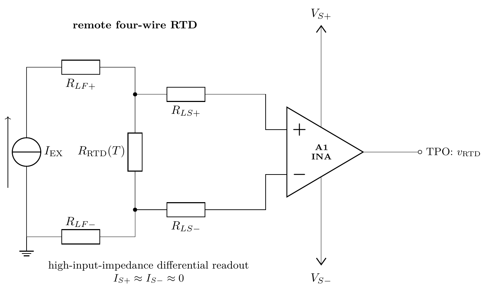
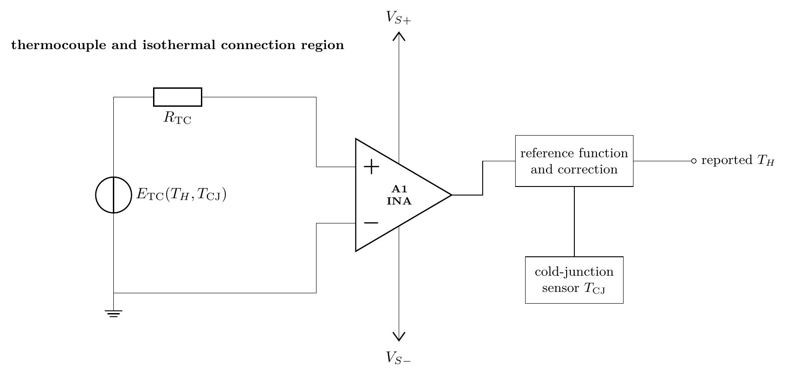
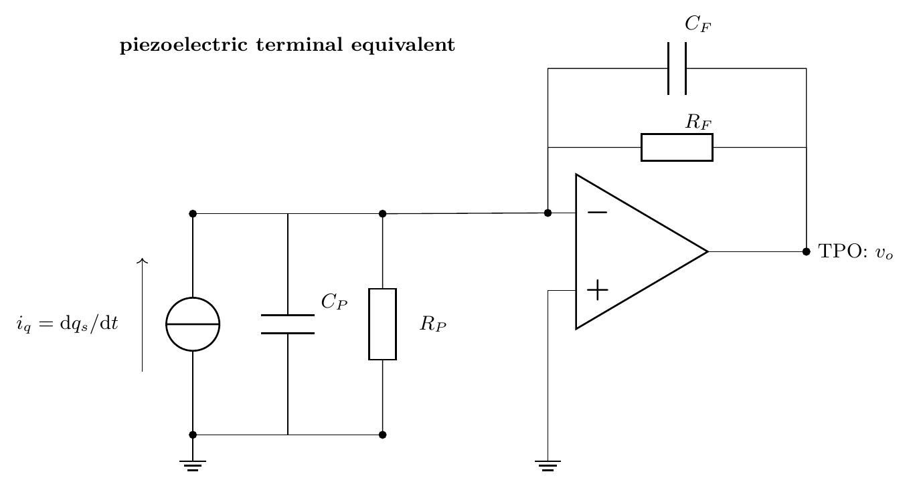
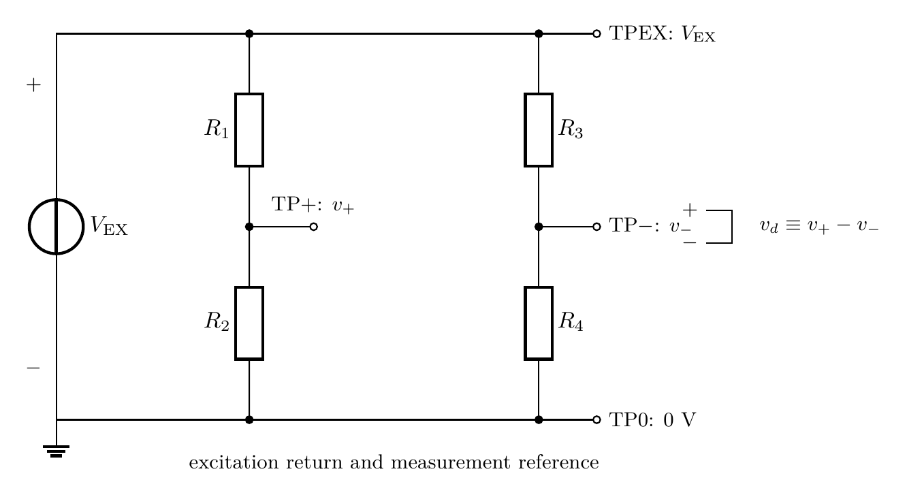
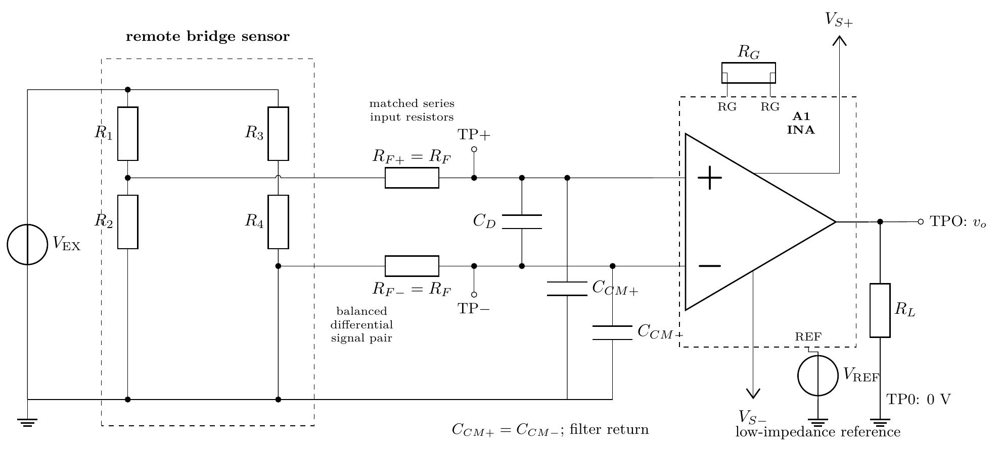

::: {.callout-note title="Chapter maturity — draft"}
This draft develops the path from transduction through a
guarded measurement decision. The numerical bridge examples and calibration
data are explicitly illustrative or synthetic. They teach the method but do not
qualify hardware. Physical claims require the aligned laboratory evidence and
remain subject to technical and editorial revision. See the
[reading roadmap](../roadmap.qmd) for the meaning of status levels.
:::

::: {.callout-warning title="Safety boundary for sensor work"}
All practical discussion is limited to current-limited, extra-low-voltage
circuits under an approved local procedure. A sensor cable can connect the bench
to a machine, outdoor conductor, battery, body, or process that carries
unrecognized energy. Isolation, a shield, an input resistor, or an
instrumentation amplifier does not by itself establish safe separation or
protection. Do not connect to mains, high-energy sources, medical electrodes, or
unreviewed industrial wiring. Stop when the source, return, common-mode range,
fault current, isolation rating, or local authorization is uncertain
[@iec61010].
:::

## Central question

> How does a physical quantity become a calibrated electrical measurement?

Press on a load cell and its bridge output may change by only a few millivolts
while both signal leads remain several volts above the circuit reference. A
voltmeter can display that change, but the display does not yet establish force.
Excitation drift, bridge self-heating, lead resistance, amplifier offset,
common-mode interference, calibration, and instrument loading all stand between
the physical event and a supported result.

A **sensor** is an element whose observable output changes with a physical,
chemical, or biological quantity. A **transducer** converts energy or
information from one physical domain into another. These terms overlap in
practice. In this chapter, “sensor” names the element at the physical boundary,
while “measurement chain” names everything from that element to the reported
result [@fraden2016sensors; @pallas2001sensors].

Consider an illustrative resistive bridge excited by 5.000 V. Its two output
nodes both sit near 2.500 V, but their difference changes from 0 to 10.0 mV over
the intended force range. Predict before calculating:

- If the excitation rises by 1 %, what happens to the raw bridge output?
- If the amplifier rejects common-mode voltage imperfectly, can a 2.5 V shared
  level matter more than a 10 mV differential signal?
- If you calibrate only zero and full scale, what observation would reveal
  curvature between those points?

A valid force result needs an explicit relation at every conversion from the
mechanical load path to the guarded decision.

## Learning outcomes

This chapter builds directly on feedback and op-amp limits from
[A04](a04-op-amps-feedback.qmd) and measurement discipline from
[F06](../01-foundations/f06-measurement-uncertainty-debug.qmd). After completing
it, you should be able to:

- define a measurand and map it through transduction, excitation, conditioning,
  calibration, and a decision without confusing an indication with the physical
  quantity;
- select among resistive, capacitive, inductive, magnetic, thermoelectric,
  piezoelectric, optical, and integrated sensors using terminal behavior,
  sensitivity, bandwidth, environment, loading, and decisive datasheet evidence;
- derive the exact output of a Wheatstone bridge, linearize it for small
  resistance changes, and test the approximation against its limiting cases;
- design an instrumentation-amplifier interface with declared differential and
  common-mode inputs, gain, reference, input/output range, loading, bias-current
  return paths, and complete protection paths;
- construct a calibration relation, interpret residuals, propagate an
  uncertainty budget, and apply an explicit guard-banded decision rule; and
- diagnose excitation, wiring, grounding, shielding, saturation, and
  cross-sensitivity faults using measurements that discriminate among competing
  explanations.

## The measurand-to-decision chain

A **measurand** is the specific quantity intended to be measured
[@jcgm2012vim]. “Force on the sensor” is incomplete. A workable definition is:

> the time-average compressive force normal to the loading surface, over a 1 s
> interval after 10 s settling, at an ambient temperature from 20 °C to 25 °C,
> with the load centered inside the marked area.

This definition fixes sign, direction, time behavior, settling, temperature, and
loading geometry. Change one of them and the value itself may change.

Before drawing the electronics, inspect the mechanical load path. The diagram
uses solid arrows for intended force transfer and a dashed arrow for an
unintended parallel path. A cable strain, mounting contact, or housing path that
bypasses the sensing structure changes the physical input presented to the
bridge even when every electrical test passes.

```{mermaid}
%%| label: fig-a05-load-path
%%| fig-cap: "Architectural load path for a force sensor. Solid arrows are the intended mechanical force path; the dashed branch is an unintended bypass. The electrical bridge observes deformation of the sensing structure, not force that bypasses it."
%%| fig-alt: "Applied force passes through a centered loading surface, sensing structure, and supports. Deformation of the sensing structure changes bridge resistance. A dashed bypass path can carry force directly from the loading surface to supports without passing through the sensing structure."
%%| fig-width: 4.8
flowchart TB
  F["Applied compressive force"]
  L["Centered loading surface"]
  S["Sensing structure"]
  P["Supports and reaction force"]
  B["Bridge resistance change"]
  X["Unintended bypass path"]
  F --> L --> S --> P
  S --> B
  L -.-> X -.-> P
```

The figure below is architectural, not a component schematic. Inspect the
arrows. Each transformation needs a physical relation or a calibration relation,
and each connection can add loading, variation, or uncertainty.

```{mermaid}
%%| label: fig-a05-measurement-chain
%%| fig-cap: "The measurand-to-decision chain. Solid arrows mean that the upstream quantity becomes an input to the downstream stage; the reference chain supports calibration and uncertainty rather than carrying the sensor signal."
%%| fig-alt: "A vertical flow from defined measurand through sensor, excitation and interface, analog conditioning, indication, calibration and correction, reported result, and decision. Environment and installation feed the sensor. A calibration reference chain feeds calibration and correction."
%%| fig-width: 5.5
flowchart TB
  M["Defined measurand"]
  S["Sensor and installation"]
  E["Excitation and interface"]
  C["Analog conditioning"]
  I["Electrical indication"]
  K["Calibration and correction"]
  R["Result with uncertainty"]
  D["Decision rule"]
  X["Environment and cross-sensitivities"]
  T["Reference and traceability chain"]
  M --> S --> E --> C --> I --> K --> R --> D
  X -.-> S
  T -.-> K
```

The chain in @fig-a05-measurement-chain separates several quantities that casual
language merges:

- The **input quantity** $x$ is the physical quantity presented to the sensor.
- The **sensor output** $s$ is an electrical parameter or signal, such as
  resistance, charge, current, frequency, or voltage.
- The **indication** $z$ is the observed electrical output of the measuring
  system.
- The **measurement result** $\hat{x}$ is the value attributed to the measurand
  after corrections, calibration, and uncertainty evaluation.
- The **decision** applies a rule to $\hat{x}$ and its uncertainty. It is not
  contained in the display digits.

A compact chain relation is

$$
\hat{x}=f\!\left[
z,\ E,\ T,\ \boldsymbol{\theta},\ \boldsymbol{c}
\right],
$$ {#eq-a05-measurement-function}

where $E$ describes excitation, $T$ is temperature, $\boldsymbol{\theta}$
contains fitted calibration parameters, and $\boldsymbol{c}$ contains declared
corrections. This is a **measurement equation**, a defined data-reduction
relation. It is not a conservation law. Its adequacy depends on whether every
effect large enough to change the decision has been inventoried
[@jcgm2008gum].

::: {.callout-tip title="Follow disagreement upstream"}
If the reported result disagrees with a reference, move upstream one boundary at
a time. Check the corrected electrical indication, raw amplifier output,
differential sensor output, common-mode level, excitation at the sensor, and
finally the physical installation. This order turns “the sensor is wrong” into
testable hypotheses.
:::

## Sensor terminal behavior and selection

The sensor family name does not determine the interface. The decisive question
is what electrical quantity changes at the terminals and what excitation makes
that change observable. A passive resistive element needs applied electrical
energy. A thermocouple can generate an electromotive force from a temperature
difference. A piezoelectric element moves charge during changing stress but
cannot represent static force indefinitely through a real leaky interface.

| Family and examples | Terminal behavior | Required interface | Dominant questions |
|---|---|---|---|
| **Resistive**: strain gauge, RTD, thermistor, magnetoresistor | resistance changes with the measurand and other influences | voltage or current excitation; divider, bridge, or four-wire measurement | self-heating, lead resistance, temperature coefficient, allowable power, tolerance |
| **Capacitive**: displacement, pressure, humidity, touch | geometry or dielectric changes capacitance | charge, AC bridge, oscillator, or capacitance-to-digital interface | cable capacitance, leakage, guarding, excitation frequency, dielectric absorption |
| **Inductive**: LVDT, variable reluctance, eddy-current probe | inductance, mutual coupling, or loss changes | AC excitation and amplitude/phase-sensitive demodulation | core range, frequency, target material, coil heating, electromagnetic pickup |
| **Magnetic**: Hall, magnetoresistive, fluxgate | voltage, resistance, or current changes with field | bias or excitation appropriate to the structure; often integrated conditioning | field axis, offset, hysteresis, saturation, temperature, nearby currents and magnets |
| **Thermoelectric**: thermocouple | voltage depends on junction temperatures and conductor materials | high-input-impedance differential input and cold-junction measurement | reference junction, wire alloys, small signal, thermal gradients, drift |
| **Piezoelectric**: force, vibration, acoustic | generated charge changes with applied dynamic stress | charge amplifier or very-high-impedance voltage interface | low-frequency droop, cable motion, leakage, resonance, preload |
| **Optical**: photodiode, phototransistor, photoresistor | photocurrent, gain-dependent current, or resistance changes with radiation | transimpedance, bias, or divider | spectrum, geometry, dark signal, ambient light, shot noise, temperature |
| **Integrated sensor**: conditioned analog, frequency, or digital output | internal transducer and electronics present a specified interface | supply, reference, loading, timing, and protocol defined by datasheet | hidden filtering, latency, clipping, calibration status, supply/reference coupling |

: Sensor-family selection map. Families overlap: a capacitive MEMS pressure
sensor may include an integrated digital interface, and a magnetic sensor may be
resistive. Select by documented terminal behavior and operating conditions, not
by the marketing family alone. {#tbl-a05-sensor-families}

The broad distinctions in @tbl-a05-sensor-families follow established sensor
and conditioning classifications [@fraden2016sensors; @pallas2001sensors].
“Integrated” is an implementation axis, not a transduction mechanism. An
integrated device can contain any mechanism in the other rows. Chemical,
electrochemical, acoustic, resonant, and inertial sensors likewise span several
mechanisms and interfaces; the table is a selection map, not an exhaustive
taxonomy.

Use the same selection sequence for every candidate:

1. Define the measurand, range, sign, spatial boundary, dynamics, and allowed
   interaction with the object.
2. Screen mechanisms for sensitivity, zero output, linearity, hysteresis,
   overload, and environmental cross-sensitivity.
3. Identify terminal behavior, excitation, source impedance, physical loading,
   self-heating, settling, and cable effects.
4. Match the interface's range, common mode, bandwidth, loading, and fault
   behavior to that terminal source.
5. Identify calibration references, correction method, uncertainty
   contributors, and the final decision rule.
6. Accept a candidate only from condition-matched guaranteed data, a standard,
   or suitable physical evidence. A typical curve can guide a prototype but
   cannot establish a worst-case pass.

For static force, a resistive bridge can retain a DC indication, while a
piezoelectric element connected through finite leakage loses its static charge
indication. For temperature, a platinum resistance sensor needs excitation and
can self-heat. A thermocouple instead produces an electromotive force that
depends on conductor materials and the temperature distribution, including the
reference junction. The measurand selects the mechanism; terminal behavior then
selects the interface [@fraden2016sensors; @nist1993thermocouples].

Specific standards and datasheets still control a design. For example,
IEC 60751 specifies resistance–temperature relations and requirements for
industrial platinum resistance sensors [@iec60751_2022]. NIST Monograph 175
provides reference functions and tables for letter-designated thermocouples
based on ITS-90 [@nist1993thermocouples]. Neither source makes an unspecified
probe, wiring arrangement, or installation conformant.

### Static transfer, sensitivity, and cross-sensitivity

Suppose a sensor output $s$ depends on measurand $x$, temperature $T$, excitation
$E$, elapsed time $t$, and internal state $h$ that records relevant history:

$$
s=g(x,T,E,t,h).
$$ {#eq-a05-sensor-relation}

This is a **constitutive relation**: it describes device behavior under stated
conditions. A single-valued local description requires a declared branch and a
reproducible state. Near $(x_0,T_0,E_0,t_0,h_0)$, with history held fixed, a
first-order linearization gives

$$
\Delta s \approx
S_x\Delta x+S_T\Delta T+S_E\Delta E+S_t\Delta t,
$$ {#eq-a05-linearization}

with local sensitivities

$$
S_x=\left.\frac{\partial g}{\partial x}\right|_0,\qquad
S_T=\left.\frac{\partial g}{\partial T}\right|_0,
$$

and analogous definitions for excitation and time. **Sensitivity** is the change
in output per change in input. Its unit depends on the variables: V/N,
$\Omega$/°C, or C/Pa are examples. **Cross-sensitivity** is response to an
influence quantity other than the intended measurand.

The approximation in @eq-a05-linearization neglects second and higher powers.
It is local, not global. At $\Delta x=0$ all incremental terms vanish, which is
the expected limiting case. If doubling $\Delta x$ does not approximately
double $\Delta s$ after other inputs and state are controlled, curvature,
saturation, or changing sensitivity has become visible. Comparing paths or
cycling the input is necessary to identify hysteresis.

**Hysteresis** means the output at one input depends on the direction or history
of approach. **Drift** is a change in metrological properties with time.
**Repeatability** concerns agreement under defined repeated conditions. These
effects need separate tests because one two-point calibration cannot distinguish
them [@jcgm2012vim; @fraden2016sensors].

### Dynamic response and charge-based interfaces

A static relation is insufficient when the measurand changes. A common
first-order approximation declares time constant $\tau>0$ and static
sensitivity $K$:

$$
\tau\frac{ds}{dt}+s=Kx.
$$ {#eq-a05-first-order-sensor}

For a step from zero to constant $x_0$, with $s(0)=0$, the solution is
$s(t)=Kx_0(1-e^{-t/\tau})$. It reaches about 63.2 % of final value after one
$\tau$ and about 99.3 % after five $\tau$. Mechanical resonance, delay,
internal filtering, thermal gradients, and multiple storage mechanisms can
break this lumped approximation [@fraden2016sensors; @pallas2001sensors].

For a capacitive sensor, define signed charge $q$ on the observed terminal. The
total current can include conduction as well as charge rate:

$$
i=i_\text{cond}+\frac{dq}{dt}.
$$

If $q=C(x)v$, then

$$
\frac{dq}{dt}
=C\frac{dv}{dt}+v\frac{dC}{dx}\frac{dx}{dt}.
$$ {#eq-a05-variable-capacitance-current}

The familiar $i=C\,dv/dt$ applies only when $C$ is effectively constant and
conduction is negligible. A piezoelectric element can be represented over a
declared frequency range by a generated charge source with sensor capacitance
and leakage. With total input resistance $R_\text{in}$ and capacitance
$C_\text{tot}$, its voltage indication has a low-frequency corner of order
$1/(2\pi R_\text{in}C_\text{tot})$. A real voltage interface therefore cannot
hold a static piezoelectric force indication indefinitely
[@pallas2001sensors; @fraden2016sensors].

### Excitation and self-heating

Excitation makes a passive parameter change observable, but it also transfers
energy into the sensor. Define current $I_\text{ex}$ positive into a resistive
sensor terminal at which excitation voltage $V_\text{ex}$ is positive. In DC
steady state the electrical input power is exactly

$$
P_\text{ex}=V_\text{ex}I_\text{ex}.
$$

For an ohmic element at its operating temperature, the constitutive relation
$V_\text{ex}=I_\text{ex}R$ gives

$$
P_\text{ex}=I_\text{ex}^2R
=\frac{V_\text{ex}^2}{R}.
$$ {#eq-a05-self-heating}

During warm-up, part of this input increases stored thermal energy and part
crosses the sensor boundary as heat. Only at thermal steady state does
accumulation vanish. The resulting sensor temperature depends on mounting,
medium, airflow, geometry, and temperature-dependent resistance. A maximum
excitation voltage without those conditions is not a complete self-heating
claim.

If voltage excitation doubles while $R$ remains approximately constant, the
self-heating relation in @eq-a05-self-heating predicts four times the power.
This limiting trend explains why “more signal” can create more measurement
error.

## Representative sensor interfaces

The family map becomes useful when terminal behavior selects a circuit. The
three interfaces below cover distinct cases: a passive resistance that needs
excitation, a self-generating EMF that also needs a reference-junction
measurement, and a generated charge that needs a finite DC return. They are
canonical starting points, not universal finished designs.

### Four-wire resistance measurement

Inspect where the sense conductors join the RTD. They connect at the sensor
terminals, after the force-lead resistances.

{#fig-a05-rtd-four-wire fig-alt="An excitation current source drives an RTD through two force leads with resistance. Separate sense leads connect at the RTD terminals to the positive and negative inputs of a high-input-impedance instrumentation amplifier. The sense currents are approximately zero and the output is v RTD." width=82%}

Define $I_\text{EX}$ positive through the RTD from its upper terminal to its
lower terminal. Define
$v_\text{RTD}=V_\text{upper}-V_\text{lower}$. Within the ohmic,
steady-temperature description,

$$
v_\text{RTD}=I_\text{EX}R_\text{RTD}(T).
$$ {#eq-a05-rtd-four-wire}

Force-lead voltage drops affect the current source's required compliance, but
they do not enter @eq-a05-rtd-four-wire if the current source regulates the
actual sensor current. A sense lead with resistance $R_{LS}$ contributes
$I_SR_{LS}$. Four-wire cancellation is therefore an approximation based on
small, bounded amplifier input current and leakage, not on the sense resistance
being zero. Excitation power $I_\text{EX}^2R_\text{RTD}$ still heats the sensor.
The resistance–temperature relation, tolerance class, current, mounting, and
calibration conditions must remain attached to the result [@iec60751_2022;
@pallas2001sensors].

Two-wire measurement includes both lead resistances in the indicated
resistance. Three-wire circuits can cancel equal lead terms in a symmetric
arrangement, but unequal or temperature-divergent leads leave a residual.
Four-wire sensing is the clearest topology when the required uncertainty
justifies the extra conductors.

### Thermocouple EMF and cold-junction observation

A thermocouple does not directly produce the absolute temperature of one
junction. Inspect the two inputs to the correction block below: measured EMF and
the connection-region temperature are both required.

{#fig-a05-thermocouple-interface fig-alt="A thermocouple EMF source depending on hot-junction and cold-junction temperatures drives an instrumentation amplifier through thermocouple resistance. A separate cold-junction temperature sensor and the amplified EMF feed a reference-function correction block that reports hot-junction temperature." width=92%}

For a declared thermocouple material pair and polarity, an ideal reference
relation can be written

$$
E_\text{TC}(T_H,T_\text{CJ})
=
\int_{T_\text{CJ}}^{T_H} S_{AB}(T)\,dT,
$$ {#eq-a05-thermocouple-emf}

where $S_{AB}(T)$ is the differential Seebeck coefficient in V/K,
$T_H$ is the measuring-junction temperature, and $T_\text{CJ}$ is the
temperature of the isothermal connection region. The integral has volts because
(V/K) times K gives V. If $T_H=T_\text{CJ}$, the ideal EMF is zero. Reversing
the material order reverses the declared sign.

In practice, use the published reference functions for the thermocouple type
rather than assuming constant $S_{AB}$. Extension-wire material, unintended
junctions, thermal gradients across the connector region, input bias current,
open-circuit detection, and amplifier offset can all create error. NIST
Monograph 175 supplies ITS-90 reference functions and tables for the standard
letter-designated types [@nist1993thermocouples].

### Piezoelectric charge amplification

The piezoelectric interface must account for generated charge, sensor
capacitance, leakage, cable capacitance, and amplifier input current. Inspect the
feedback paths: $C_F$ establishes charge gain, while $R_F$ prevents indefinite
DC accumulation.

{#fig-a05-piezo-charge-amplifier fig-alt="A generated charge-rate current source is in parallel with piezoelectric sensor capacitance and leakage resistance. Their common node drives the inverting input of an op amp. The non-inverting input is grounded. Feedback capacitor C F and resistor R F connect from output to the summing node." width=82%}

Define generated current $i_q=dq_s/dt$ positive into the summing node. In the
ideal, nonsaturated op-amp approximation, the summing node remains near TP0.
The topology figure omits the op-amp supply and local decoupling connections so
the charge and leakage paths remain legible; a realizable circuit must add them
and verify input range, output range, bandwidth, stability, and recovery.
Neglect $R_F$ over the signal interval and assume the initial output is zero.
KCL then gives

$$
\frac{dq_s}{dt}
=-C_F\frac{dv_o}{dt},
\qquad
v_o=-\frac{q_s}{C_F}.
$$ {#eq-a05-charge-amplifier}

The first relation is a current balance; the second follows by integration under
the stated initial condition. Its dimensions are C/F = V. Larger $C_F$ reduces
voltage per unit charge and increases charge range before clipping. With finite
$R_F$, the feedback time constant is $\tau_F=R_FC_F$ and the approximate
low-frequency corner is

$$
f_L\approx\frac{1}{2\pi R_FC_F}.
$$ {#eq-a05-charge-low-corner}

The circuit therefore measures changing force or acceleration over a bounded
band, not static force indefinitely. Cable capacitance affects noise, stability,
and attainable bandwidth. Under the ideal relation
in @eq-a05-charge-amplifier, charge gain depends on $C_F$. Leakage, dielectric behavior,
amplifier bias current, and saturation recovery break the first-order picture
[@pallas2001sensors; @fraden2016sensors].

Capacitive, inductive, magnetic, and optical sensors need the same reasoning:
identify the terminal source, supply its excitation or bias, preserve the
measurand-dependent component, and bound unwanted components. Detailed optical
interfaces belong to A08. A06 develops the noise and bandwidth budgets that
select practical component values.

## Resistive bridges convert small parameter changes

A Wheatstone bridge compares two divider ratios. It does not directly measure
resistance. Inspect the topology below: the excitation acts from the top node to
TP0, and the output is the difference between the two divider midpoints.

{#fig-a05-wheatstone-bridge fig-alt="Excitation voltage V EX is applied from the common top node of two divider branches to TP0. R1 is above R2 in the left branch with midpoint TP plus. R3 is above R4 in the right branch with midpoint TP minus. Differential output v d equals v plus minus v minus, positive at TP plus." width=72%}

Let $V_\text{EX}=V_\text{top}-V_\text{TP0}$ and take
$V_\text{EX}>0$. Define $v_-=V_{\text{TP-}}-V_\text{TP0}$,
$v_+=V_{\text{TP+}}-V_\text{TP0}$, and
$v_d=v_+-v_-$. Assume the readout draws negligible current and each arm is
ohmic at its operating temperature. The divider relation gives the exact result

$$
v_d=V_\text{EX}
\left(
\frac{R_2}{R_1+R_2}
-
\frac{R_4}{R_3+R_4}
\right).
$$ {#eq-a05-bridge-general}

The bracket is dimensionless, so the result has volts. The bridge is balanced
when

$$
\frac{R_1}{R_2}=\frac{R_3}{R_4},
$$ {#eq-a05-bridge-balance}

provided all resistances are positive. Equal arms are one balanced case, not the
only one. Scaling all four resistances by the same positive factor leaves the
ideal output unchanged but changes source resistance, power, noise, and loading.

### Quarter-bridge response and linearization

Let a tensile strain gauge occupy the upper-left arm:
$R_1=R+\Delta R$, while $R_2=R_3=R_4=R$.
In @fig-a05-wheatstone-bridge, a positive $\Delta R$ lowers $v_+$. The predicted
sign is therefore $v_d<0$. Substitution in @eq-a05-bridge-general gives

$$
\frac{v_d}{V_\text{EX}}
=
-\frac{\Delta R}{2(2R+\Delta R)}
=
-\frac{\delta}{2(2+\delta)},
\qquad
\delta\equiv\frac{\Delta R}{R}.
$$ {#eq-a05-quarter-exact}

This relation is exact under the four-resistor, unloaded, isothermal assumptions.
For $|\delta|\ll1$, expand about $\delta=0$:

$$
\frac{v_d}{V_\text{EX}}
\approx-\frac{\delta}{4}.
$$ {#eq-a05-quarter-linear}

The neglected leading term is $+\delta^2/8$. The approximation therefore
slightly overpredicts the magnitude for positive $\delta$ and remains a local
relation.

For a metallic strain gauge, the **gauge factor** $k$ is defined over stated
conditions by

$$
k=\frac{\Delta R/R}{\varepsilon},
$$ {#eq-a05-gauge-factor}

where engineering strain $\varepsilon=\Delta L/L$ is dimensionless. Combining
the definition with @eq-a05-quarter-linear gives

$$
\frac{v_d}{V_\text{EX}}\approx-\frac{k\varepsilon}{4}.
$$ {#eq-a05-quarter-strain}

Use illustrative values $R=350~\Omega$, $k=2.00$,
$\varepsilon=1000~\mu\varepsilon=1.000\times10^{-3}$, and
$V_\text{EX}=5.000$ V. Predict a few millivolts because the fractional
resistance change is only 0.2 %. The linear result is

$$
v_d\approx
(5.000~\text{V})
\left[-\frac{(2.00)(1.000\times10^{-3})}{4}\right]
=-2.500~\text{mV}.
$$

The exact relation gives

$$
v_d=(5.000~\text{V})
\left[-\frac{0.002000}{2(2.002000)}\right]
=-2.498~\text{mV}.
$$

The 2.50 $\mu$V magnitude difference is about 0.10 % of the linear value,
consistent with the small second-order term. These are checkable illustrative calculations, not
specifications for a gauge. Real strain measurement also depends on transverse
sensitivity, temperature response, bonding, strain transfer, lead arrangement,
and allowable grid power [@fraden2016sensors; @pallas2001sensors].

Quarter-, half-, and full-bridge factors are not names to memorize; they follow
from active-arm placement. The table uses the chapter polarity and a declared
pattern. Positive $\delta$ denotes tension and negative $\delta$ compression
for gauges with positive gauge factor.

| Arrangement | Declared active arms | Exact or first-order normalized output |
|---|---|---|
| quarter bridge | $R_1=R(1+\delta)$; other arms $R$ | $v_d/V_\text{EX}=-\delta/[2(2+\delta)]\approx-\delta/4$ |
| adjacent-arm half bridge | $R_1=R(1+\delta)$, $R_2=R(1-\delta)$; right arms $R$ | $v_d/V_\text{EX}=-\delta/2$ exactly for this ideal pattern |
| full bridge | $R_1,R_4=R(1+\delta)$ and $R_2,R_3=R(1-\delta)$ | $v_d/V_\text{EX}=-\delta$ exactly for this ideal pattern |

: Active-arm placement determines bridge sign and sensitivity. Other mechanical
arrangements can reverse signs; derive them from their actual arms.
{#tbl-a05-bridge-arrangements}

If a temperature change multiplies every arm by the same positive factor, that
factor cancels from both divider ratios. Real cancellation requires matched
temperature response, shared temperature, and suitable completion resistors.
Temperature gradients, lead resistance, adhesive behavior, or unequal gauge
installation break the ideal cancellation [@ti1999wheatstone;
@pallas2001sensors].

### Source resistance, lead resistance, and active-arm arrangements

Looking into one bridge midpoint with the ideal excitation source set to zero
means shorting the top node to TP0. The Thévenin resistance of that midpoint is

$$
R_{\text{th},+}=R_1\parallel R_2,\qquad
R_{\text{th},-}=R_3\parallel R_4.
$$ {#eq-a05-bridge-source-resistance}

For four equal 350 $\Omega$ arms, each midpoint has 175 $\Omega$ to AC
reference. A differential load spans both sources, so its loading calculation
must include both sides. A one-op-amp difference stage can load these finite and
signal-dependent source impedances; a high-input-impedance instrumentation
amplifier largely separates bridge loading from gain. TI's bridge-conditioning
analysis demonstrates this distinction and the gain error that finite bridge
source resistance can create in a loaded difference stage [@ti1999wheatstone].

A quarter bridge is especially sensitive to lead resistance because the lead
can be indistinguishable from the active arm. Three-wire compensation can cancel
equal lead resistances in a suitable bridge arrangement. Four-wire Kelvin
sensing separates excitation current conductors from voltage-sense conductors.
Neither method cancels unequal, time-varying contacts automatically.

Half- and full-bridge arrangements can place active gauges so intended strain
changes add while a shared temperature response cancels to first order. That
cancellation requires matched gauge behavior and shared temperature. A
temperature gradient or unequal bonding breaks it.

### Ratiometric observation

The normalized bridge output

$$
r\equiv\frac{v_d}{V_\text{EX}}
$$ {#eq-a05-ratio-definition}

is a **ratiometric indication**. If $v_d=V_\text{EX}h(x)$ and the denominator
observes the same excitation at the same time and terminals, then

$$
r=h(x).
$$ {#eq-a05-ratiometric-cancellation}

Common multiplicative excitation change cancels exactly in this ideal algebra.
The cancellation does not remove:

- amplifier offset or gain error;
- excitation-dependent sensor self-heating;
- voltage drop between the excitation source and bridge terminals;
- time skew between numerator and denominator;
- reference noise transferred differently through the two paths; or
- common-mode and input-range violations.

“Uses the same nominal 5 V rail” is therefore weaker than “observes the same
bridge-terminal excitation.” Practical bridge systems often route sense leads
back from the transducer or use the bridge excitation as the converter reference
for this reason [@ti1999wheatstone].

## Instrumentation amplification preserves a small difference

An **instrumentation amplifier** is a differential amplifier designed for high
input impedance, controlled gain, and high rejection of voltage common to its
inputs. It extends the A04 difference-amplifier idea by buffering the input
terminals and controlling critical resistor ratios internally. It does not
eliminate the need to check common-mode range, output swing, bias-current return
paths, source imbalance, bandwidth, or protection.

An instrumentation amplifier is in the op-amp family of feedback amplifiers, but
it is not interchangeable with one ordinary op amp. A classic integrated
instrumentation amplifier uses multiple op-amp stages and precision-matched
resistors. Its external behavior is still naturally shown by a triangle with
$+$, $-$, and output terminals. The dashed package boundary in the circuit
below adds the INA-specific gain-set and REF pins that a general-purpose op amp
does not have [@ti1999wheatstone; @ti2020ina821].

Define

$$
v_d=v_+-v_-,
\qquad
v_{\text{CM}}=\frac{v_++v_-}{2}.
$$ {#eq-a05-diff-common}

These definitions can be inverted exactly:

$$
v_+=v_{\text{CM}}+\frac{v_d}{2},
\qquad
v_-=v_{\text{CM}}-\frac{v_d}{2}.
$$

The intended low-frequency transfer is

$$
v_o=V_\text{REF}+Gv_d.
$$ {#eq-a05-ina-transfer}

Here $V_\text{REF}$ is the voltage applied to the amplifier's reference terminal,
not necessarily ground. It needs a low source impedance within the device's
allowed reference range. The signal output is referenced to TP0:
$v_o=V_\text{TPO}-V_\text{TP0}$.

Inspect the complete interface below. Equal series elements preserve symmetry;
the common-mode and differential capacitors provide distinct return paths; both
amplifier inputs retain DC bias-current paths through the bridge; and the
reference driver establishes output level.

{#fig-a05-bridge-instrumentation fig-alt="A four-resistor bridge excited from V EX to TP0 drives TP plus and TP minus through equal series filter resistors to the positive and negative inputs of instrumentation amplifier A1. Matched common-mode capacitors return each input to TP0 and one differential capacitor connects the input pair. Gain resistor R G programs A1. A low-impedance V REF source drives the reference terminal, and output TPO is measured relative to TP0. Supply and return connections are shown." width=100%}

### Gain, range, and reference checks

The INA821 provides a concrete device example. Its manufacturer gives the gain
relation

$$
G=1+\frac{49.4~\text{k}\Omega}{R_G},
$$ {#eq-a05-ina821-gain}

and specifies a gain range from 1 to 10 000. The same datasheet specifies an
input-stage operating range nominally from $V_{S-}+2~\text{V}$ to
$V_{S+}-2~\text{V}$ under
listed conditions, but directs the designer to common-mode versus output plots
because differential input, gain, reference, supplies, and output interact. It
also lists output swing, offset, bias current, CMRR, gain error, bandwidth, and
temperature conditions [@ti2020ina821].

Suppose an illustrative full bridge has a specified nominal sensitivity
magnitude of 2.000 mV/V at 1000 N and uses 5.000 V excitation. Its declared
wiring makes positive compression produce positive $v_d$. The nominal full-scale
differential output is therefore

$$
v_{d,\text{FS}}=
(2.000~\text{mV/V})(5.000~\text{V})
=10.00~\text{mV}.
$$

The required nominal output spans 0.500 V to 2.500 V, so the required gain is

$$
G_\text{req}=
\frac{2.500~\text{V}-0.500~\text{V}}
{10.00~\text{mV}}
=200.0.
$$

Solving @eq-a05-ina821-gain gives

$$
R_G=\frac{49.4~\text{k}\Omega}{G_\text{req}-1}
=248.2~\Omega.
$$

A selected resistor, its tolerance, temperature coefficient, connection
resistance, and the INA's own gain error all affect the realized gain.
Calibration can correct a stable system gain but cannot create headroom or undo
clipping.

At bridge balance, each 700 $\Omega$ leg draws
$5.000~\text{V}/700~\Omega=7.143$ mA. The complete bridge draws 14.286 mA
and receives 71.43 mW; each balanced 350 $\Omega$ arm dissipates 17.86 mW.
These are nominal feasibility calculations. A real sensor rating and its
installation thermal path must support them before 5.000 V excitation is
accepted.

For a 5.000 V bridge, both inputs sit near 2.500 V. On a single 12 V supply,
with $V_{S+}=12$ V and $V_{S-}=\text{TP0}$, this lies inside the nominal
$V_{S-}+2$ V to $V_{S+}-2$ V interval. The desired 0.500–2.500 V output also
appears plausible. The schematic above is generic; this worked case ties its
negative supply to TP0 and requires local supply bypassing at A1. This is only a
nominal feasibility screen: the condition-matched common-mode/output plot, load,
supply tolerance, temperature, reference range, and transient inputs still
require checking against the current datasheet.

### Common-mode rejection is finite

Using the A04 definition,

$$
\mathrm{CMRR}=20\log_{10}\left|\frac{A_d}{A_{\text{CM}}}\right|.
$$ {#eq-a05-cmrr}

For a small common-mode change $\Delta v_\text{CM}$ within a specified
operating region, an input-referred error screen is

$$
|\Delta v_{\text{eq,CM}}|
\approx
\frac{|\Delta v_\text{CM}|}
{10^{\mathrm{CMRR}/20}}.
$$ {#eq-a05-cmrr-error}

At 100 dB CMRR, a 1.00 V common-mode change corresponds to 10.0 $\mu$V
input-referred. With $G=200$, that becomes a 2.00 mV output contribution. The
number is not a device guarantee until frequency, gain, common-mode interval,
temperature, supply, and source imbalance match the datasheet test conditions.
The INA821, for example, gives different minimum CMRR values at different gains
and conditions [@ti2020ina821].

External imbalance converts shared interference into differential voltage before
the amplifier can reject it. At one declared angular frequency, let the
sinusoidal steady-state interference-current phasor be $I_n$ and the two path
impedances be $Z_+$ and $Z_-$. The first-order differential-voltage phasor is

$$
V_{d,n}\approx I_n(Z_+-Z_-).
$$ {#eq-a05-impedance-imbalance}

The exact result depends on the complete coupling network. Equal-looking
resistors do not guarantee equal impedance after tolerances, sensor source
resistance, cable capacitance, and protection devices are included.

### Balanced filtering and bias-current return

The differential capacitor in @fig-a05-bridge-instrumentation acts directly
between the signal inputs. The two common-mode capacitors act from each input to
the reference plane. Component mismatch can convert common-mode energy into a
differential error. Choose matched parts and calculate both differential- and
common-mode poles from the actual source and series resistances.

Input bias currents need closed DC paths. A transformer, series capacitor,
piezoelectric element, or floating source may not provide them. Without return
resistors the input nodes can charge until the amplifier saturates. Return
resistors add thermal noise, bias-current drop, leakage sensitivity, and a
possible connection to a previously floating domain, so their values and
reference belong in the schematic and error budget.

## Calibration correction and curve fitting

**Calibration** establishes a relation between indications and reference values,
with associated uncertainties. It is not adjustment. **Metrological
traceability** requires a documented, unbroken chain of calibrations to a
reference, each link contributing uncertainty [@jcgm2012vim; @nisttraceability].

### One-point, two-point, and multipoint information

A one-point calibration can estimate an offset at one condition. A two-point
calibration can estimate offset and average sensitivity for a linear relation.
It cannot test curvature. A multipoint calibration can expose curvature and
support a fitted correction, but only over the covered input and environmental
domain.

For two reference inputs $x_0$ and $x_1$ with indications $z_0$ and $z_1$, define
the affine correction

$$
\hat{x}=x_0+
(z-z_0)\frac{x_1-x_0}{z_1-z_0}.
$$ {#eq-a05-two-point-calibration}

This is a calibration relation, not a physical law. It requires
$z_1\ne z_0$ and assumes interpolation is adequately linear. Substitution of
$z=z_0$ returns $x_0$; substitution of $z=z_1$ returns $x_1$. Those limiting
checks are exact by construction and therefore do not independently verify the
sensor.

Suppose the following values were generated to teach the calculation.

| Applied reference $x_i$ (N) | Raw ratio $z_i$ (mV/V) | Fitted $\hat{x}_i$ (N) | Residual $e_i=\hat{x}_i-x_i$ (N) |
|---:|---:|---:|---:|
| 0 | 0.012 | 0.0 | 0.0 |
| 250 | 0.505 | 248.2 | −1.8 |
| 500 | 1.004 | 499.5 | −0.5 |
| 750 | 1.501 | 749.7 | −0.3 |
| 1000 | 1.998 | 1000.0 | 0.0 |

: **Synthetic calibration data.** The endpoint fit uses 0 N and 1000 N.
Interior residuals reveal curvature or other unallocated behavior, but these
generated values do not establish performance of any physical sensor.
{#tbl-a05-synthetic-calibration}

Using $z_0=0.012$ mV/V, $z_1=1.998$ mV/V, and the synthetic
$z=1.004$ mV/V in @eq-a05-two-point-calibration gives

$$
\hat{x}=
0+
(1.004-0.012)
\frac{1000~\text{N}}{1.998-0.012}
=499.5~\text{N}.
$$

The ratios of mV/V cancel, leaving newtons. The 250 N residual is larger than
the 500 N residual, so a constant offset correction alone cannot explain the
pattern. Repeat runs in both directions and at controlled temperatures would
help separate nonlinearity, hysteresis, repeatability, and thermal effects.

The ratio is the chosen calibration indication, but it remains connected to the
analog output. With $G=200$, $V_\text{EX}=5.000$ V, and
$V_\text{REF}=0.500$ V,

$$
v_o=0.500~\text{V}
+(1.000~\text{V per mV/V})z.
$$ {#eq-a05-ratio-to-output}

Thus the synthetic endpoint indications correspond to 0.512 V and 2.498 V, not
the ideal 0.500 V and 2.500 V. An analog zero-and-span adjustment can map those
calibration points to the target voltage scale. Alternatively, later data
processing can apply @eq-a05-two-point-calibration while preserving the raw
conditioned voltage. In either case, the calibration record must identify where
the correction is applied; calling an unadjusted output “calibrated” would hide
the observed offset.

::: {.callout-tip title="Reconcile the opening predictions"}
A 1 % excitation rise produces a 1 % raw bridge-voltage rise in the ideal
voltage-excited bridge, while the simultaneous ratio $v_d/V_\text{EX}$ stays
fixed. A finite-CMRR amplifier can turn a shared common-mode change into an
error larger than the bridge signal. Zero and full-scale calibration fix two
points by construction. Specifically,
the data in @tbl-a05-synthetic-calibration show curvature at the interior points.
:::

### Correction functions and extrapolation

Polynomial, piecewise-linear, lookup-table, and physics-based corrections are
all possible. A more flexible correction can reduce residuals at calibration
points while increasing parameter uncertainty or overfitting sparse data. Keep
raw observations, fitted parameters, residuals, environmental conditions, and
software version together.

Extrapolation is a new claim. A calibration from 0 N to 1000 N does not qualify
operation at 1200 N, even if the fitted equation returns a number. Mechanical
overload, electrical headroom, and changed sensitivity may invalidate the
relation before the arithmetic fails.

## Worked design: bridge to calibrated analog output

This worked design carries one illustrative transducer requirement through
bridge excitation, amplification, calibration, and a guarded decision. The
input values do not represent a product datasheet.

### Requirements and evidence status

| Item | Requirement or design input | Evidence status |
|---|---|---|
| Measurand | 0–1000 N compression, 1 s average after 10 s settling, 20–25 °C | illustrative requirement |
| Bridge | nominal 350 $\Omega$ arms; 2.000 mV/V at 1000 N | illustrative input |
| Excitation | 5.000 V measured at bridge terminals | design requirement |
| Analog output | nominal 0.500–2.500 V relative to TP0 | design requirement |
| Acceptance point | at reference 500.0 N, strict $|e|<5.0$ N | illustrative requirement |
| Amplifier candidate | INA821, $G\approx200$, single 12 V supply | manufacturer data plus chapter calculation |
| Calibration data | values in @tbl-a05-synthetic-calibration | synthetic teaching evidence |

: Requirements and provenance for the worked design. Nothing in the table is a
physical measurement. {#tbl-a05-design-requirements}

The nominal bridge span and gain calculations above predict a 2.000 V output
span. The INA reference is set to 0.500 V by a low-impedance source, giving the
nominal relation

$$
v_o=0.500~\text{V}
+
(200.0)v_d.
$$

The endpoint observations above show why the nominal relation and calibration
relation are separate descriptions. The physical output is the conditioned
analog quantity. The analog adjustment or attached correction function makes
its force scale calibrated.

The candidate must still pass these screens:

1. bridge-terminal excitation, arm power, and sensor thermal limits;
2. input common-mode range for every bridge imbalance and fault;
3. output swing and output current for the actual load;
4. input offset, drift, bias-current drop, gain error, and reference error;
5. bandwidth and settling for the 1 s average;
6. cable imbalance, interference, grounding, and protection;
7. calibration residuals and uncertainty across force and temperature.

### Uncertainty budget at 500 N

F06 develops uncertainty propagation in detail. The same method applies here,
with reported error defined as

$$
e=\hat{x}-x_\text{ref}.
$$

Assume the listed inputs are expressed as standard uncertainties in newtons and
are independent for this illustrative screen:

| Contribution | Standard uncertainty $u_i$ (N) | Basis |
|---|---:|---|
| reference force | 0.50 | certificate expanded uncertainty 1.00 N with stated $k=2$ |
| repeatability of indication mean | 0.30 | sample standard deviation 0.67 N for five repeats, divided by $\sqrt{5}$ |
| calibration interpolation after multipoint correction | 0.40 | independent validation bound ±0.69 N, rectangular distribution, divided by $\sqrt{3}$ |
| temperature correction | 0.80 | validation bound ±1.39 N over 20–25 °C, rectangular distribution |
| residual ratiometric excitation effect | 0.20 | bound ±0.35 N, rectangular distribution |
| resolution | 0.10 | 0.346 N display step, uniform rounding interval, divided by $\sqrt{12}$ |

: **Illustrative uncertainty budget** for the synthetic 500 N result. The
independence assumption must be replaced by covariance terms when inputs share a
reference, fit, or environmental cause. This budget applies after a separate
multipoint correction. The residuals in @tbl-a05-synthetic-calibration show why
that correction is needed.
{#tbl-a05-uncertainty-budget}

Under the stated independence assumption, the combined standard uncertainty is

$$
u_c=
\sqrt{\sum_i u_i^2}
=
\sqrt{0.50^2+0.30^2+0.40^2+0.80^2+0.20^2+0.10^2}
=1.09~\text{N}.
$$ {#eq-a05-combined-uncertainty}

Using coverage factor $k=2$ by stated policy gives an expanded uncertainty
$U=ku_c=2.18$ N. This factor does not prove 95 % coverage unless the
distributional and effective-degrees-of-freedom conditions support that
interpretation [@jcgm2008gum; @nist1994tn1297].

For this synthetic arithmetic test, $V_\text{EX}$ is observed at the bridge
terminals, $v_+$ and $v_-$ are observed relative to TP0 with a differential
input that is treated as negligibly loading the 175 $\Omega$ midpoint sources,
and $z=v_d/V_\text{EX}$ uses those same terminal observations. The reference
force and temperature are evaluated under the stated 1 s average and 10 s
settling condition. Instrument ranges, calibration status, loading, and raw
observations would be mandatory in a physical record.

At the synthetic 500.0 N reference point, $\hat{x}=499.5$ N, so
$e=-0.5$ N. Use the conservative guard rule

$$
|e|+U<5.0~\text{N}.
$$ {#eq-a05-guard-rule}

The left side is $0.5+2.18=2.68$ N using displayed inputs, or 2.69 N using the
unrounded combined uncertainty. Both are strictly below 5.0 N. The synthetic
case passes its illustrative rule. Equality would not pass. This conclusion
qualifies only the supplied numbers and assumptions; it is not evidence that a
physical bridge, amplifier, calibration, or installation meets the requirement
[@jcgm2012conformity].

### Executable arithmetic cross-check

The following standard-library code reproduces the bridge, calibration, and
uncertainty arithmetic. It is executable calculation, not simulation or
measurement.

```python
from math import sqrt

v_ex = 5.000
delta = 0.002000
v_d_exact = -v_ex * delta / (2.0 * (2.0 + delta))
v_d_linear = -v_ex * delta / 4.0

x0_n, x1_n = 0.0, 1000.0
z0_mvv, z1_mvv = 0.012, 1.998
z_mvv = 1.004
x_hat_n = x0_n + (z_mvv - z0_mvv) * (
    (x1_n - x0_n) / (z1_mvv - z0_mvv)
)

u_terms_n = [0.50, 0.30, 0.40, 0.80, 0.20, 0.10]
u_c_n = sqrt(sum(value**2 for value in u_terms_n))
u_expanded_n = 2.0 * u_c_n
error_n = x_hat_n - 500.0
guard_n = abs(error_n) + u_expanded_n

print(f"quarter bridge exact: {1e3 * v_d_exact:.3f} mV")
print(f"quarter bridge linear: {1e3 * v_d_linear:.3f} mV")
print(f"calibrated result: {x_hat_n:.1f} N")
print(f"combined u: {u_c_n:.2f} N")
print(f"expanded U (k=2): {u_expanded_n:.2f} N")
print(f"guard quantity: {guard_n:.2f} N < 5.00 N")

# Expected output:
# quarter bridge exact: -2.498 mV
# quarter bridge linear: -2.500 mV
# calibrated result: 499.5 N
# combined u: 1.09 N
# expanded U (k=2): 2.18 N
# guard quantity: 2.69 N < 5.00 N
```

## Wiring, grounding, shielding, isolation, and protection

Small sensor signals make the interconnection part of the circuit. A schematic
that stops at a connector hides the conductor resistance, capacitance, shield
current, return path, fault source, and common-mode coupling that often dominate
the result.

### Differential pair and reference path

Route the two signal conductors together so external fields couple as equally as
possible. Twisting reduces loop area and improves symmetry, but it does not
remove differential pickup or repair input-range violations. Keep excitation
and high-current returns from sharing impedance with the signal reference.

A **ground loop** is not any circuit with several ground symbols. It is an
unintended closed conductive path in which current creates an error voltage.
Draw the shield, chassis, protective earth, signal reference, excitation return,
and sensor body as distinct nodes until the design deliberately joins them
[@ott2009electromagnetic].

### Shield and guard serve different currents

A **shield** intercepts electric-field coupling and routes displacement or
interference current to a chosen reference. Its termination depends on
frequency, safety, cable construction, and chassis architecture. “Ground one
end” can reduce low-frequency loop current in one arrangement but performs
poorly as a universal high-frequency rule [@ott2009electromagnetic].

A **guard** is a low-impedance conductor driven near the potential of a
high-impedance node. It reduces leakage current through insulation by reducing
the voltage across that insulation. Guarding is especially relevant to
capacitive, piezoelectric, photodiode, and high-resistance sensor interfaces. A
guard is not a protective-earth conductor and should not be used as a safety
barrier [@ott2009electromagnetic].

### Isolation changes the reference boundary

Galvanic isolation removes an intended DC conductive path between domains while
transferring signal or power through another mechanism. It can break a
measurement loop or accommodate common-mode voltage, but its barrier has finite
working voltage, transient rating, creepage, clearance, capacitance, lifetime,
and certification conditions. Isolated signal transfer may also need isolated
power. Use an approved system-level safety design when hazardous energy is
present; this chapter does not authorize one [@iec61010].

### Protection requires a complete current path

An input-protection claim must identify:

- the external source and its maximum voltage, current, energy, and impedance;
- cable and connector parasitics;
- series limiting elements and their pulse, continuous-power, voltage, and
  temperature ratings;
- clamp devices and their condition-dependent voltage;
- the protected input's absolute and operating limits;
- the destination of diverted current, including whether a supply rail can sink
  it; and
- the return path.

Matched series resistance can protect and filter, but tolerance and nonlinear
clamp capacitance can reduce common-mode rejection. A clamp that prevents
absolute-maximum violation can still drive the amplifier outside its linear
input range. Conversely, an amplifier advertised with input overvoltage
protection does not automatically protect the bridge, reference source, filter,
connector, or downstream converter. The INA821 specifies input protection and
operating limits under distinct conditions; those statements must not be
merged into one operating point [@ti2020ina821].

## Reconciliation and fault isolation

Suppose the worked bridge should produce 1.000 mV/V near 500 N, but the observed
ratio is 0.820 mV/V and the amplifier output sometimes approaches its lower
limit. “Bad sensor” is only one hypothesis.

| Hypothesis | Distinguishing prediction | Useful observation |
|---|---|---|
| excitation drop in cable | local bridge excitation is low; raw volts change more than terminal-normalized mV/V | measure excitation at source and bridge sense terminals |
| open or resistive bridge arm | midpoint common-mode level shifts, bridge resistance changes, and output may become large | de-energize; compare arm resistances and both midpoint voltages |
| amplifier input-range violation | raw bridge differential remains plausible while output clips as common mode changes | measure $v_+$, $v_-$, $v_\text{CM}$, and $v_o$ relative to TP0 |
| unequal input filter or leakage | error changes with cable interference, humidity, or swapped inputs | swap symmetric paths or substitute a local bridge emulator |
| reference-source error | output offset moves while raw $v_d$ does not | measure $V_\text{REF}$ under load |
| mechanical bypass or off-center load | electrical chain passes substitution test but sensitivity depends on load position | apply controlled reference loads at declared positions |
| temperature cross-sensitivity | error follows sensor or cable temperature with time lag | record temperature and repeat at controlled steady states |

: Competing hypotheses for a low bridge indication. Each proposed observation
separates at least two explanations. {#tbl-a05-fault-hypotheses}

A disciplined sequence is:

1. Verify safety, source limits, references, and instrument ratings.
2. Observe bridge-terminal excitation and both midpoint voltages relative to
   TP0. Calculate $v_d$ and $v_\text{CM}$ from the raw values.
3. Compare amplifier output with
   $V_\text{REF}+Gv_d$, including declared offset and gain bounds.
4. Substitute a traceable or characterized bridge emulator. This separates much
   of the electronics from the sensor and mechanics.
5. Apply reference inputs in both directions and at relevant temperatures.
6. Assign discrepancy only as far as independent evidence permits.

If a bridge emulator reproduces the fault, replacing the mechanical sensor is
unlikely to address the cause. If the emulator passes but off-center physical
loading fails, test the mechanical installation next. Each mismatch narrows the
set of plausible causes and determines the next observation.

## From measurand to guarded decision

A sensor result becomes trustworthy only when every transformation from
measurand to decision is explicit.

- Sensor selection starts with terminal behavior, excitation, sensitivity,
  source impedance, dynamics, environment, and condition-matched evidence.
- A Wheatstone bridge compares divider ratios. Its exact output precedes the
  small-change approximation, and excitation affects both signal and heating.
- Ratiometric observation cancels a shared multiplicative excitation term, not
  amplifier error, lead drop, self-heating, timing mismatch, or range failure.
- An instrumentation amplifier extracts a differential signal from a
  common-mode level only within finite input, output, gain, bandwidth, and
  rejection limits.
- Calibration establishes a relation to references. Multipoint residuals test
  claims that endpoint calibration cannot.
- Grounding, shielding, guarding, isolation, and protection are current and
  reference paths, not component labels.
- A decision combines a defined measurand, conditions, raw evidence,
  corrections, uncertainty, and an explicit guard rule.

The chapter ends at a conditioned, calibrated analog quantity. A06 develops the
chain-level noise, nonlinearity, bandwidth, and stability limits. S02 continues
with sampling and data conversion.

## Exercises

### Quick check

Choose the one best answer.

1. A balanced bridge has all four resistances doubled while its ideal excitation
   voltage remains fixed. What happens?

   a. Its ideal normalized output changes sign.
   b. Its ideal normalized output is unchanged, but power and source resistance
   change.
   c. Its ideal normalized output doubles.
   d. Its common-mode voltage becomes zero.

2. A two-point calibration establishes:

   a. zero hysteresis across the range;
   b. traceability without reference uncertainty;
   c. offset and average sensitivity for an assumed affine relation;
   d. safe extrapolation beyond the calibrated range.

3. A bridge output is 8 mV on a 2.5 V common-mode level. Which amplifier
   property directly describes rejection of a change shared by both inputs?

   a. slew rate
   b. CMRR
   c. output resistance
   d. PSRR only

4. Why can increasing bridge excitation worsen accuracy?

   a. Resistance can never be measured above 1 V.
   b. The differential signal always falls.
   c. Sensor power can increase and change its temperature.
   d. Ratiometric observation stops working at all higher voltages.

5. What does a shield primarily do in this chapter?

   a. guarantee safety isolation
   b. route coupled interference current to a chosen reference
   c. replace the signal return conductor
   d. eliminate all magnetic pickup

6. A synthetic data table can support which claim?

   a. the physical sensor passed
   b. the calibration laboratory is traceable
   c. the arithmetic and interpretation method can be demonstrated
   d. the device meets a datasheet limit

**Answer key:** 1-b, 2-c, 3-b, 4-c, 5-b, 6-c.

### Retrieval and explanation

7. Define measurand, indication, sensitivity, cross-sensitivity, calibration,
   and traceability. For each, give one sentence explaining what it does not
   establish.

8. Explain why a thermocouple interface needs information about more than the
   hot-junction temperature. Cite the physical quantity represented by its
   voltage.

9. Distinguish a shield, a guard, signal reference, chassis, and protective
   earth by the current each is intended to carry.

### Estimation and calculation

10. A quarter bridge uses $R=120~\Omega$, $k=2.05$,
    $\varepsilon=500~\mu\varepsilon$, and $V_\text{EX}=3.300$ V.
    Predict the sign and order of magnitude of $v_d$, then calculate the linear
    and exact results with the polarity of @fig-a05-wheatstone-bridge.
    *Self-check:* both results are negative and have magnitude about 0.846 mV.

11. Four equal 350 $\Omega$ bridge arms use 5.000 V DC excitation. Calculate
    total bridge current, total electrical input power, and power in each arm at
    balance. If excitation rises by 10 %, by what percentage does power change
    under the constant-resistance approximation?
    *Self-check:* the power change is 21 %, not 10 %.

12. An instrumentation amplifier has $G=250$, $V_\text{REF}=1.000$ V,
    $v_+=2.504$ V, and $v_-=2.496$ V. Calculate $v_d$,
    $v_\text{CM}$, and ideal $v_o$. Then decide whether a 0–2.5 V output stage
    can realize the ideal result. *Self-check:* the ideal output is 3.000 V, so
    that output range cannot realize it.

13. Convert a 0.50 V common-mode change into input-referred error for CMRR values
    of 80 dB, 100 dB, and 120 dB. State why these numbers are screens rather than
    device guarantees. *Self-check:* 50 $\mu$V, 5.0 $\mu$V, and 0.50
    $\mu$V.

### Derivation and limiting cases

14. Starting from @eq-a05-bridge-general, derive the exact quarter-bridge
    relation for a sensor in the lower-left arm. Keep the chapter's
    $v_d=v_+-v_-$ reference and interpret the sign for $\Delta R>0$.

15. Expand @eq-a05-quarter-exact through second order. Find the strict upper
    bound on positive $\delta$ for which the magnitude of the second-order term
    is less than 0.1 % of the first-order term. *Self-check:* $\delta<0.002$.

16. Derive the bridge balance condition without assuming equal arms. Test the
    limits $R_1\rightarrow0$ and $R_1\rightarrow\infty$ and explain the
    corresponding midpoint voltages.

17. Extend @eq-a05-combined-uncertainty to include covariance between temperature
    correction and calibration interpolation. Show how positive and negative
    covariance change $u_c$.

### Data interpretation

18. Plot the residuals in @tbl-a05-synthetic-calibration against applied force.
    Which additional points and loading directions would best distinguish
    curvature from hysteresis?

19. A test records the following synthetic raw values:

    | Force (N) | $V_\text{EX}$ at source (V) | $V_\text{EX}$ at bridge (V) | $v_d$ (mV) |
    |---:|---:|---:|---:|
    | 0 | 5.000 | 4.960 | 0.060 |
    | 500 | 5.000 | 4.955 | 4.970 |
    | 1000 | 5.000 | 4.950 | 9.870 |

    Compute mV/V using source excitation and bridge-terminal excitation. Which
    normalization better isolates sensor response? What remains unproven?

20. A multipoint calibration has small residuals at 23 °C but a nearly linear
    gain change at 40 °C. Propose a measurement equation that includes
    temperature and state the calibration grid needed to estimate it.

### Debugging

21. A bridge amplifier output is correct with a local emulator but wrong with a
    20 m cable. List three competing hypotheses. For each, name one observation
    that should change in a different way.

22. Adding identical nominal input capacitors causes a strong 50 Hz output that
    was absent before. Explain how capacitor tolerance, grounding, or common-mode
    range can create the symptom. Specify raw test points and instrument
    references.

23. A floating piezoelectric source drives an instrumentation amplifier through
    two coupling capacitors. The output slowly saturates. Draw the missing DC
    paths, choose a first resistor range from leakage and low-frequency
    requirements, and state the new noise and loading trade-offs.

### Open design

24. Design a current-limited, extra-low-voltage interface for one sensor family
    in @tbl-a05-sensor-families. State the measurand, range, dynamics,
    environment, excitation, terminal relation, conditioning, calibration
    points, uncertainty contributors, protection boundary, and decision rule.
    Include at least one complete schematic and one limiting-case calculation.

25. Compare a quarter bridge, half bridge, and full bridge for a bending
    measurement. Allocate active gauges to make the intended strain add and a
    shared temperature change cancel to first order. State what mounting
    asymmetry breaks the cancellation.

26. Write an acceptance plan for the worked 0–1000 N chain. Include reference
    standards, loading sequence, temperatures, test points, instrument loading,
    raw-data retention, uncertainty basis, guard band, safety stop conditions,
    and the exact claim that a pass would support.

## Connections

Chapter ID: `A05`.

- **Direct prerequisites:** [A04 — Operational amplifiers and
  feedback](a04-op-amps-feedback.qmd) supplies difference amplification,
  reference nodes, CMRR, finite range, and feedback limits.
  [F06 — Measurement, uncertainty, and systematic
  debugging](../01-foundations/f06-measurement-uncertainty-debug.qmd) supplies
  measurand definitions, loading correction, uncertainty propagation,
  traceability, fault isolation, and guarded decisions.
- **Parallel limit analysis:** [A06 — Noise, nonlinearity, bandwidth, and
  stability](a06-noise-nonlinearity-stability.qmd) develops the spectral,
  dynamic-range, distortion, and chain-stability budgets that A05 identifies but
  does not duplicate.
- **Direct downstream chapters:** [A08 — Optoelectronics, displays, and
  human-machine interface](a08-optoelectronics-hmi.qmd) applies the measurement chain to optical
  detection and human-facing indication. [S02 — Sampling and data
  conversion](../05-domains/s02-sampling-data-conversion.qmd) begins with the
  conditioned analog quantity and adds sampling, quantization, references, and
  converter architectures.
- **System and realization handoffs:** [R05 — Metrology, reliability, and
  production test](../06-realization/r05-metrology-reliability-test.qmd) extends calibration
  and decision rules across units and time. [X01 — System study: a precision
  instrument](../07-systems/x01-precision-instrument.qmd) integrates A05 with
  A06, S02, and R05 into a complete instrument.
- **Practice:** **L08 — Sensor calibration and uncertainty** supplies physical
  evidence for excitation, conditioning, calibration, uncertainty, and a
  decision. The [practice and project
  spine](../roadmap.qmd#practice-and-project-spine) carries this work toward
  milestone **M3**, a precision instrument.
- **Just-in-time support:** [M02 — Calculus, linearization, and differential
  equations](../appendices/m02-calculus-linear-differential.qmd) supports local
  sensitivity; [M03 — Probability, statistics, and numerical
  methods](../appendices/m03-probability-numerical.qmd) supports fitting and
  covariance; [T01 — Datasheets, standards, and
  evidence](../appendices/t01-datasheets-standards.qmd) supports
  condition-matched specification use.

## References

Point-of-use citations identify canonical sensor and conditioning texts,
measurement vocabulary and uncertainty guides, the current industrial platinum
sensor standard, NIST thermocouple reference functions, manufacturer-primary
bridge guidance and INA821 data, EMC guidance, and laboratory safety
requirements. The complete [bibliography](../references.qmd) contains full
details. These sources support the stated relations and conditional
specifications; they do not replace sensor-specific datasheets, installation
instructions, calibration records, local safety review, or physical
verification.
