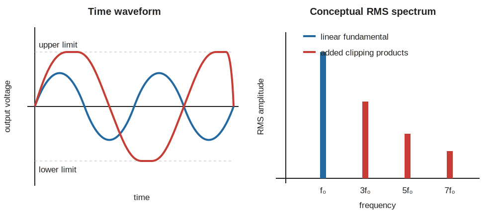
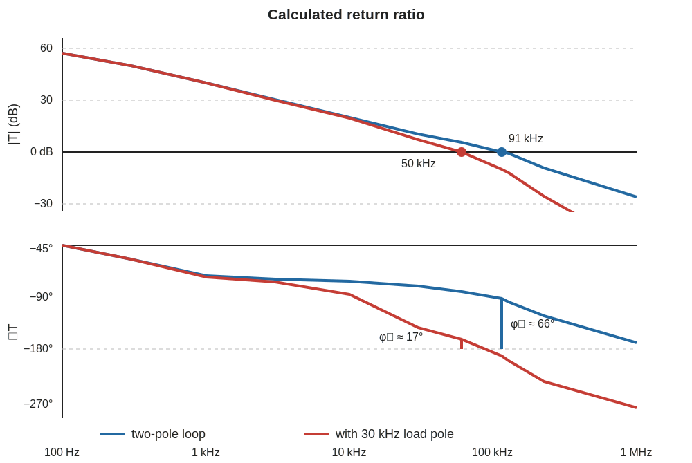

::: {.callout-note title="Chapter maturity — draft"}
This draft develops the path from random noise and
interference through distortion, bandwidth, and feedback stability to a
requirements-based signal-chain decision. Values marked **illustrative** and
records marked **synthetic** are teaching evidence, not measurements. Physical
evidence belongs in Labs **L07** and **L16**. The chapter remains subject to
technical and editorial revision; see the
[reading roadmap](../roadmap.qmd) for the meaning of status levels.
:::

::: {.callout-warning title="Safety boundary for analog tests"}
Practical work is limited to approved, **current-limited, extra-low-voltage**
circuits under local supervision. Set the current limit before connection.
De-energize before changing components. Keep generator common terminals and
earth-referenced oscilloscope grounds on the intended circuit reference.
Stop for smoke, odor, discoloration, unexpected rapid temperature rise,
current-limit operation, or oscillation that drives a device or load outside
its rating. This chapter does not authorize work on mains, high-energy
batteries, RF-power transmitters, medical equipment, or other safety-critical
systems [@iec61010; @tektronixprobesprimer].
:::

## Central question

> Which non-ideal effect limits a real analog chain, and what evidence
> distinguishes the limiting mechanism?

Suppose a sensor produces a 100 $\mu$V RMS sine wave at 100 Hz. An amplifier
with gain 101 should produce 10.1 mV RMS. Instead, the oscilloscope trace looks
thick, a 50 Hz component appears in the spectrum, and a small step causes
ringing. Increasing gain makes the trace larger, but it does not reveal whether
the original signal is trustworthy.

Four different mechanisms may be present:

- **noise** is an unpredictable fluctuation described statistically;
- **interference** is unwanted coupled energy whose source often has a
  deterministic waveform or recognizable spectrum;
- **nonlinearity** makes the output depend on input level so new frequencies or
  clipping appear; and
- **instability** lets feedback reinforce a disturbance strongly enough to
  produce excessive ringing or sustained oscillation.

Bandwidth connects all four. A wider passband admits more noise and
interference. It may expose frequencies where the amplifier has less loop gain
and phase margin. A narrower passband rejects unwanted content, but it can also
attenuate the signal, slow settling, and hide fast faults. These are distinct
phenomena, not four names for a rough-looking waveform
[@horowitz2015art; @sedra2020microelectronic].

**Bandwidth** is the frequency interval admitted by a declared signal,
circuit, or measurement criterion. A $-3$ dB signal bandwidth, an analyzer
span, and an equivalent noise bandwidth answer different questions. This
chapter names which one it uses each time.

Predict before calculating:

- If a flat noise amplitude density passes through twice the noise bandwidth,
  does RMS noise double or rise by $\sqrt{2}$?
- If you double a sine-wave amplitude in a weakly nonlinear circuit, which grows
  faster: the fundamental or a third-order distortion product?
- If a probe adds capacitance to a feedback node, must it improve stability?
- Can averaging remove a coherent 50 Hz component when each record starts at
  the same 50 Hz phase?

The next sections separate these mechanisms by how each changes the time
record, spectrum, bandwidth dependence, and loop response.

## Learning outcomes

This chapter builds on feedback and op-amp limits from
[A04](a04-op-amps-feedback.qmd) and sinusoidal frequency response from
[F08](../01-foundations/f08-sinusoids-impedance-frequency.qmd). After completing
it, you should be able to:

- distinguish random noise, deterministic interference, drift, offset, and
  distortion using time-domain and spectral evidence;
- convert voltage- or current-noise spectral density into integrated RMS noise
  using the complete transfer function and equivalent noise bandwidth;
- obtain a scaled finite-record PSD using declared sampling, window, ENBW, and
  averaging conventions, then reconcile its integral with time-domain RMS and
  the instrument background;
- construct input-referred, output-referred, noise-factor, and cascaded noise
  budgets without adding uncorrelated amplitudes linearly or counting one
  source twice;
- derive harmonic products from a polynomial transfer, calculate SNR, THD, and
  two-tone IMD, and interpret SINAD, SFDR, compression, and usable dynamic range
  under declared amplitude and bandwidth conventions;
- relate bandwidth to rise time, settling, noise, and large-signal slew limits;
- assess feedback with loop gain, crossover, gain margin, phase margin, and
  time-domain evidence while accounting for load, layout, source impedance, and
  probe intrusion; and
- define an acceptance test that distinguishes prediction, calculation,
  simulation, measurement, and qualified design evidence.

## Random noise and deterministic interference

### Time records, ensembles, and spectra

Let $v(t)$ be a voltage measured at TPO relative to TP0. The decomposition used
here separates it into a repeatable or estimated signal $s(t)$ and a residual
fluctuation $n(t)$:

$$
v(t)=s(t)+n(t).
$$ {#eq-a06-signal-noise}

This equation is a chosen decomposition, not proof that every term has been
identified. A periodic interferer left inside $n(t)$ does not become random
because the decomposition labels the remainder as noise.

An **offset** is a repeatable displacement from the intended zero indication.
A **drift** is a slow change of an indicated quantity with time or an influence
such as temperature. These deterministic components require estimation or
correction before the remaining fluctuation can be treated statistically.

For a wide-sense stationary noise process, the mean
$\mu_n=\operatorname{E}\{n(t)\}$ is constant and the autocovariance depends only
on time separation. The **variance**

$$
\sigma_n^2=\operatorname{E}\{[n(t)-\mu_n]^2\}
$$ {#eq-a06-noise-variance}

has units V$^2$. Its positive square root is the RMS fluctuation about the mean.
The expectation $\operatorname{E}\{\cdot\}$ refers to an ensemble or to a
justified time average under an ergodicity assumption. One finite oscilloscope
record only estimates it [@oppenheim1996signals].

The **power spectral density (PSD)** $S_{\tilde v}(f)$ allocates the variance of
the zero-mean fluctuation
$\tilde v(t)=v(t)-\mu_v$ by frequency. This chapter uses a **one-sided**
covariance PSD for $f\ge0$, with units V$^2$/Hz, so

$$
\sigma_v^2=\int_0^\infty S_{\tilde v}(f)\,df.
$$ {#eq-a06-psd-integral}

The **amplitude spectral density (ASD)** is
$e_v(f)=\sqrt{S_{\tilde v}(f)}$ in V/$\sqrt{\text{Hz}}$. A density is not an RMS voltage
until it has been squared, weighted by a transfer magnitude squared, and
integrated over frequency. Two-sided PSD conventions allocate half as much
density to each sign of frequency. Mixing one- and two-sided conventions causes
a factor-of-two error in variance. A PSD of the uncentered $v(t)$ also contains
a DC impulse for a nonzero mean and integrates to mean square rather than
variance [@oppenheim1996signals].

For a stable linear time-invariant path with transfer $H(f)$ from a noise source
to the observation point,

$$
\sigma_o^2
=\int_0^\infty |H(f)|^2S_i(f)\,df.
$$ {#eq-a06-noise-transfer}

The squared magnitude appears because PSD is a mean-square quantity. Phase does
not affect the contribution of one isolated source to output variance, but
relative phase does matter when sources are correlated.

### Physical source families

Noise names describe mechanisms and spectral behavior. They do not by
themselves specify the terminal quantity or operating conditions.

| Source | First useful description | Important conditions and limits |
|---|---|---|
| **Thermal noise** | equilibrium carrier agitation in a dissipative element; white over the ordinary low-frequency circuit range | absolute temperature, real part of impedance, bandwidth; the classical form requires $hf\ll kT$ |
| **Shot noise** | randomness in independent discrete charge-transfer events | average DC current, charge, device mechanism, bandwidth; full shot noise can be suppressed or multiplied by correlations and gain |
| **Flicker noise** | low-frequency excess noise whose PSD often varies approximately as $1/f^\alpha$ | device, bias, area, process, frequency, and observation time; coefficient and exponent are empirical |
| **Burst or popcorn noise** | random switching among discrete levels | device defects, bias, temperature, and record length |
| **Quantization error** | difference between a continuous input and a converter's discrete output code | step size, input distribution, overload, correlation, dither, sampling, and digital filtering |
| **Interference** | coupled unwanted voltage or current, often coherent | electric, magnetic, conductive, radiated, or shared-impedance path; source and return geometry |

: Noise and interference source map. The formulas below are conditional
descriptions, not universal device guarantees
[@horowitz2015art; @ott2009electromagnetic; @sedra2020microelectronic].
{#tbl-a06-noise-families}

For a resistor $R$ in thermal equilibrium at absolute temperature $T$, the
classical one-sided open-circuit voltage-noise PSD is

$$
S_{v,R}=4kTR,
\qquad
e_R=\sqrt{4kTR},
$$ {#eq-a06-johnson-voltage}

and the equivalent short-circuit current-noise PSD is

$$
S_{i,R}=\frac{4kT}{R},
\qquad
i_R=\sqrt{\frac{4kT}{R}}.
$$ {#eq-a06-johnson-current}

Here $k=1.380\,649\times10^{-23}$ J/K exactly in SI. The voltage form has units
$\text{J}\,\Omega=\text{V}^2\text{s}=\text{V}^2/\text{Hz}$.
These are two equivalent terminal representations of one resistor. Adding both
to the same budget would count the source twice. For a complex passive
impedance, the dissipative real part, not reactance alone, generates thermal
noise [@nyquist1928thermal; @bipm2019si].

For independent charge carriers of magnitude $q$ crossing a boundary with
average current $I$ in the full shot-noise regime, the one-sided current PSD is

$$
S_{i,\mathrm{shot}}=2q|I|,
\qquad
i_{\mathrm{shot}}=\sqrt{2q|I|}.
$$ {#eq-a06-shot}

The absolute value appears because PSD cannot be negative when the declared
current reference reverses. The relation is a constitutive noise description,
not charge conservation. Semiconductor correlations, recombination, avalanche
multiplication, and device gain can change it, so use the device's specified
noise data when available [@sedra2020microelectronic; @sze2006physics].

Flicker voltage noise is often fitted over a bounded frequency interval as

$$
S_{v,1/f}(f)=\frac{K_v}{f^\alpha},
\qquad \alpha\approx1.
$$ {#eq-a06-flicker}

This is an empirical fit. Its coefficient carries the units needed to make the
PSD V$^2$/Hz. Extending an exact $1/f$ law to $f=0$ would make the integral
diverge. A real claim must state the lowest relevant frequency, observation
time, drift-removal procedure, and device conditions.

For $\alpha=1$, integration over a finite rectangular band gives

$$
\sigma_{1/f}^2
=\int_{f_L}^{f_H}\frac{K_v}{f}\,df
=K_v\ln\left(\frac{f_H}{f_L}\right).
$$ {#eq-a06-flicker-integral}

**Worked colored-noise comparison.** Suppose an illustrative input has a white
ASD of 10.0 nV/$\sqrt{\text{Hz}}$ and a $1/f$ PSD equal to that white PSD at
100 Hz. Then $S_w=1.00\times10^{-16}$ V$^2$/Hz and
$K_v=(100~\text{Hz})S_w=1.00\times10^{-14}$ V$^2$. Over
0.100 Hz to 1.00 kHz, the rectangular-band contributions are

$$
\sigma_w
=\sqrt{S_w(f_H-f_L)}
=0.316~\mu\text{V RMS},
$$

and

$$
\sigma_{1/f}
=\sqrt{K_v\ln(f_H/f_L)}
=0.303~\mu\text{V RMS}.
$$

Their uncorrelated combination is 0.438 $\mu$V RMS. Raising the declared lower
edge from 0.100 Hz to 1.00 Hz reduces the flicker term only to
0.263 $\mu$V RMS because the dependence is logarithmic. That change also
removes evidence about slower behavior. A high-pass filter, shorter record, or
detrending rule must therefore be justified by the measurand, not selected only
to improve the reported number [@horowitz2015art; @sedra2020microelectronic].

For an ideal uniform quantizer with step $\Delta$, no overload, and
quantization error uniformly distributed and sufficiently uncorrelated with
the input,

$$
\sigma_q=\frac{\Delta}{\sqrt{12}}.
$$ {#eq-a06-quantization-rms}

This result follows from the variance of a uniform error on
$[-\Delta/2,+\Delta/2]$. It fails for a constant or coherently sampled input,
missing codes, nonlinear transfer, and overload. [S02](../05-domains/s02-sampling-data-conversion.qmd)
develops sampling, aliasing, converter noise, and dither; here quantization is
only one signal-chain contribution.

### Interference is a coupling problem

A narrow spectral line at 50 Hz is not enough to identify its path. The same
line can enter through capacitive coupling from mains wiring, magnetic coupling
into a loop, conducted supply ripple, a shared return impedance, or the signal
source itself. The remedy follows the coupling mechanism
[@ott2009electromagnetic].

```{mermaid}
%%| label: fig-a06-interference-paths
%%| fig-cap: "Interference enters through a source, coupling path, susceptible boundary, and return path. Solid arrows carry intended signal; dashed arrows represent candidate unwanted coupling. A mitigation is effective only if it weakens the actual path."
%%| fig-alt: "A vertical intended signal path runs from sensor through analog interface to output. Dashed branches from an electric-field source, magnetic-field source, supply source, and shared return feed different points of the interface. The diagram emphasizes that source, coupling, victim, and return must all be identified."
%%| fig-width: 5.8
flowchart TB
  S["Sensor signal"]
  A["Analog interface"]
  O["Observed output"]
  E["Electric-field source"]
  M["Magnetic-field source"]
  P["Supply or reference ripple"]
  R["Shared return impedance"]
  S --> A --> O
  E -.-> A
  M -.-> A
  P -.-> A
  R -.-> O
```

Use discriminating changes. Rotate or shrink a loop to test magnetic coupling.
Change source impedance or add a grounded electrostatic shield to test electric
coupling. Power the source from a different approved supply to test conduction.
Measure differentially across the intended return to expose shared-impedance
voltage. A low-pass filter may reduce the displayed line without proving which
path created it.

### A spectrum is an estimate made by an instrument

An ideal PSD describes an ensemble or an indefinitely long stationary process.
A real analyzer observes a finite record through analog input circuitry,
sampling, a window, and numerical scaling. Its displayed spectrum is therefore
an estimate with loading, bandwidth, bias, random variation, and an instrument
floor.

For $N$ uniformly spaced samples at sample rate $f_s$, the record duration is
$T_r=N/f_s$. The DFT-bin spacing is

$$
\Delta f=\frac{f_s}{N}=\frac{1}{T_r}.
$$ {#eq-a06-bin-spacing}

Zero-padding evaluates the same finite-record transform at more frequency
points. It does not lengthen $T_r$, separate two unresolved tones, or create
new information. Longer records improve bin spacing but assume that the
process remains sufficiently stationary over the longer interval
[@oppenheim1996signals].

A **window** is a deliberate weighting of the samples before the transform.
It controls the trade-off between spectral leakage, main-lobe width, and
amplitude scaling. If the window samples are $w[n]$, define their coherent gain
for a bin-centered tone as

$$
C_w=\frac{1}{N}\sum_{n=0}^{N-1}w[n],
$$ {#eq-a06-window-coherent-gain}

and their noise-equivalent bandwidth as

$$
B_{n,w}
=f_s\frac{\sum_{n=0}^{N-1}w^2[n]}
{\left(\sum_{n=0}^{N-1}w[n]\right)^2}.
$$ {#eq-a06-window-enbw}

The ratio $B_{n,w}/\Delta f$ is ENBW in bins. A rectangular window has
$C_w=1$ and $B_{n,w}=\Delta f$. For a periodic Hann window,
$\sum w=N/2$ and $\sum w^2=3N/8$, so $C_w=0.5$ and
$B_{n,w}=1.5\Delta f$. Correct tone amplitudes by coherent gain. Convert noise
power per bin to density using window ENBW. Applying the tone correction to
random noise, or dividing a tone by $\sqrt{B_{n,w}}$, mixes two different
scalings.

For a zero-mean record $x[n]=v[n]-\bar v$, an unnormalized DFT, and an even
$N$, one useful one-sided periodogram convention for interior positive-
frequency bins $1\le k<N/2$ is

$$
\widehat S_{vv}[k]
=\frac{2}
{f_s\sum_{n=0}^{N-1}w^2[n]}
\left|
\sum_{n=0}^{N-1}w[n]x[n]e^{-j2\pi kn/N}
\right|^2.
$$ {#eq-a06-periodogram}

The DC and Nyquist bins omit the factor two because they have no distinct
negative-frequency partners. With this normalization, units are V$^2$/Hz and
a Parseval closure check is

$$
\sum_{k=0}^{N/2}\widehat S_{vv}[k]\Delta f
=\frac{\sum_n w^2[n]x^2[n]}{\sum_n w^2[n]}.
$$ {#eq-a06-periodogram-closure}

For a rectangular window the right side is the sample mean square after mean
removal. For other windows it is a window-weighted estimate. A material
failure of this closure points to a scaling, endpoint, one-sided-factor, or
unit error. Removing the mean deletes DC evidence. Detrending removes still
more low-frequency content, so either operation belongs in the measurement
definition rather than being hidden as data cleanup
[@oppenheim1996signals; @welch1967spectrum].

**Spectral leakage** is energy spread among bins because the finite record
does not contain the waveform in a form periodic at its boundaries. A
non-bin-centered sine leaks even when the physical source is perfectly
sinusoidal. A lower-sidelobe window can reveal a small spur near a large tone,
but its wider main lobe can merge nearby tones. State the window, record
duration, sample rate, one- or two-sided scaling, amplitude type, and analog
front-end bandwidth with every reported spectrum.

Many instruments label a **resolution bandwidth (RBW)**. It is an
analyzer-defined width for the selected IF filter or spectral estimator, not
merely the distance between displayed points. A swept analyzer may specify its
$-3$ dB IF bandwidth as RBW, while the corresponding noise-equivalent bandwidth
$B_{n,\mathrm{RBW}}$ depends on filter shape. An FFT analyzer's noise bandwidth
depends on its window ENBW. Use the manufacturer's noise-bandwidth correction
rather than assuming nominal RBW equals ENBW. For approximately white noise,
reducing $B_{n,\mathrm{RBW}}$ lowers RMS noise in one displayed bin as
$\sqrt{B_{n,\mathrm{RBW}}}$ while the ASD should remain approximately constant
after correct normalization. A narrow tone retains its integrated RMS amplitude
when the filter contains the tone, although its displayed peak depends on
detector and scaling conventions.

Periodogram values fluctuate strongly even for stationary Gaussian noise.
Averaging independent or weakly correlated segments reduces estimator
variation, but shorter segments worsen frequency resolution. Overlapping
segments are not fully independent. Quote confidence or repeatability only
from a statistical method whose record count, overlap, window, and distribution
assumptions are stated [@oppenheim1996signals; @jcgm2008gum].

### The measurement floor must be separated from the source

Let $S_{\mathrm{obs}}$ be an observed input-referred PSD with the device under
test connected. Let $S_{\mathrm{bg}}$ be every unchanged background
contribution in a second configuration: instrument voltage and current noise,
termination thermal noise, coupled interference, and any retained source
noise. Only when impedance, loading, gain, range, bandwidth, grounding, and
coupling paths remain equivalent, and the added DUT contribution is
uncorrelated with that background, can you infer

$$
\widehat S_{\mathrm{DUT,added}}
=S_{\mathrm{obs}}-S_{\mathrm{bg}}.
$$ {#eq-a06-noise-floor-subtraction}

Subtract PSDs or mean-square values, not ASDs or RMS amplitudes. The inference
is invalid if replacing the DUT by a short or 50 $\Omega$ termination changes
source thermal noise or conversion of instrument current noise. If the required
measurand is total configuration noise, retain the source termination noise
rather than subtracting it. A negative difference is not negative physical
noise; it means the data cannot resolve the added DUT contribution under the
stated uncertainty.

**Worked floor subtraction.** Suppose a condition-matched measurement gives
$e_{\mathrm{obs}}=10.0$ nV/$\sqrt{\text{Hz}}$ and a condition-equivalent
background record gives $e_{\mathrm{bg}}=8.0$ nV/$\sqrt{\text{Hz}}$. Under the
uncorrelated assumptions,

$$
\widehat e_{\mathrm{DUT,added}}
=\sqrt{e_{\mathrm{obs}}^2-e_{\mathrm{bg}}^2}
=6.0~\text{nV}/\sqrt{\text{Hz}}.
$$ {#eq-a06-floor-example}

Now assign illustrative standard uncertainties of
0.5 nV/$\sqrt{\text{Hz}}$ to each ASD. First-order propagation gives

$$
u(e_{\mathrm{DUT,added}})
=\sqrt{
\left(\frac{e_{\mathrm{obs}}}{e_{\mathrm{DUT,added}}}u_{\mathrm{obs}}\right)^2
+
\left(\frac{e_{\mathrm{bg}}}{e_{\mathrm{DUT,added}}}u_{\mathrm{bg}}\right)^2}
=1.07~\text{nV}/\sqrt{\text{Hz}}.
$$ {#eq-a06-floor-uncertainty}

The subtraction has amplified uncertainty because two comparable powers were
differenced. If the observed floor approaches the instrument floor, the
inferred value becomes increasingly sensitive and eventually supports only an
upper bound. Cross-correlation instruments can reject uncorrelated noise from
two independent measurement channels, but shared source, clock, grounding,
and front-end noise remains correlated and sets a different floor.

The measurement architecture below keeps the source-equivalent termination,
DUT, analog bandwidth, analyzer loading, and numerical estimator in one chain.
It is an architectural diagram, not a replacement for the component schematic.

```{mermaid}
%%| label: fig-a06-noise-measurement-chain
%%| fig-cap: "Noise-measurement chain. Solid arrows carry the observed voltage record; dashed arrows are contributions or controls that must remain equivalent between DUT and background records."
%%| fig-alt: "A vertical chain runs from source-equivalent termination through the device under test, TPO, analog anti-alias and analyzer input, sampled record, window and PSD estimator, and integrated result. Dashed branches show analyzer loading and self-noise entering the analog input and a background record entering the comparison."
%%| fig-width: 5.8
flowchart TB
  S["Source-equivalent termination"]
  D["Device under test"]
  O["TPO observed voltage"]
  A["Analog bandwidth and analyzer input"]
  R["Sampled record"]
  P["Window, PSD scaling, and averaging"]
  I["Integrated result and uncertainty"]
  L["Analyzer loading and self-noise"]
  B["Condition-equivalent background record"]
  S --> D --> O --> A --> R --> P --> I
  L -.-> A
  B -.-> I
```

A defensible procedure records the termination impedance and temperature,
amplifier gain transfer, TPO loading, analog bandwidth, sample rate, record
duration, mean-removal or detrending rule, window, averaging, and raw data.
Varying sample rate can expose aliasing. Varying record duration can expose
low-frequency drift or insufficient stationarity. Integrate coherent lines
separately from the broadband floor when their mechanism or acceptance
allocation differs.

## Bandwidth turns density into RMS noise

### Equivalent noise bandwidth

Suppose $S_i(f)=S_0$ is flat and $H(0)\ne0$. Define the **equivalent noise
bandwidth (ENBW)** as the width of an ideal rectangular filter with the same
DC gain and the same output noise power:

$$
B_n\equiv
\frac{1}{|H(0)|^2}
\int_0^\infty |H(f)|^2\,df.
$$ {#eq-a06-enbw}

Then

$$
\sigma_o=|H(0)|\sqrt{S_0B_n}
=|H(0)|e_i\sqrt{B_n}.
$$ {#eq-a06-white-noise}

The units are
$(\text{V}/\sqrt{\text{Hz}})\sqrt{\text{Hz}}=\text{V}$.
Therefore doubling bandwidth raises RMS white noise by $\sqrt{2}$, not by two.

For a first-order low-pass response

$$
H(f)=\frac{H_0}{1+jf/f_c},
$$ {#eq-a06-one-pole}

substitution into @eq-a06-enbw gives

$$
B_n=\int_0^\infty
\frac{df}{1+(f/f_c)^2}
=\frac{\pi}{2}f_c.
$$ {#eq-a06-one-pole-enbw}

Thus ENBW is 1.571 times the $-3$ dB corner. Replacing it by $f_c$ would
underestimate RMS white noise by $\sqrt{\pi/2}=1.253$. Cascaded poles, zeros,
peaking, and digital filters require their actual squared response
[@horowitz2015art; @oppenheim1996signals].

**Worked example — thermal noise of a filtered resistor.** Let a 10.0 k$\Omega$
resistor be at an illustrative 300 K. Predict first: its density should be on
the order of 10 nV/$\sqrt{\text{Hz}}$, and a 1 kHz bandwidth should produce
less than 1 $\mu$V RMS. From @eq-a06-johnson-voltage,

$$
e_R=\sqrt{
4(1.380\,649\times10^{-23}~\text{J/K})
(300~\text{K})(10.0\times10^3~\Omega)}
=12.9~\text{nV}/\sqrt{\text{Hz}}.
$$

After a one-pole 1.00 kHz low-pass,

$$
v_{n,\mathrm{RMS}}
=(12.9~\text{nV}/\sqrt{\text{Hz}})
\sqrt{\frac{\pi}{2}(1.00\times10^3~\text{Hz})}
=0.510~\mu\text{V RMS}.
$$ {#eq-a06-resistor-example}

The result agrees with the prediction. Doubling $R$ doubles PSD but raises ASD
and integrated RMS noise by only $\sqrt{2}$. Cooling to 150 K has the same
$\sqrt{2}$ reduction under this classical approximation.

### Time averaging and record averaging

An average over a rectangular time interval $\tau$ is convolution with a pulse
of area one. Its magnitude response is a sinc function, and its one-sided ENBW
for white noise is

$$
B_{n,\mathrm{avg}}=\frac{1}{2\tau}.
$$ {#eq-a06-average-enbw}

Longer time averaging therefore reduces independent white-noise RMS in
proportion to $1/\sqrt{\tau}$. A rectangular time average over an integer
number of 50 Hz periods has a response zero at 50 Hz, but a slightly different
duration need not. The result does not guarantee equal improvement for flicker
noise or drift. If a changing measurand is time-averaged, the result also
represents a different time-defined measurand.

**Record averaging** instead aligns repeated records and averages corresponding
sample positions. Independent random noise can fall as $1/\sqrt{N}$ for $N$
records. A coherent 50 Hz component survives when each record starts at the
same 50 Hz phase. Time averaging and synchronized record averaging are
different filters, so their rejection claims must not be exchanged.

Sampling adds another boundary. Out-of-band analog noise that reaches a sampler
can alias into the retained band. Digital averaging after sampling cannot undo
aliasing that already occurred. The analog anti-alias response, sample rate,
digital response, and record length therefore belong to one bandwidth statement
[@oppenheim1996signals].

## Referred noise and complete budgets

### Moving contributions to one boundary

An **input-referred noise** is the hypothetical noise at the chain input that
would produce the observed output noise through the intended signal transfer.
The phrase has two related uses that must not be mixed.

First, if the frequency-dependent signal transfer is $H_s(f)$, the
frequency-by-frequency input-referred PSD is

$$
S_{n,\mathrm{in}}(f)
\equiv\frac{S_{n,\mathrm{out}}(f)}{|H_s(f)|^2},
$$ {#eq-a06-input-referred}

where $H_s(f)\ne0$. This is a bookkeeping transformation. It does not claim
that the physical source is located at the input. Near a transfer zero, the
input-referred value can become very large even while output noise remains
finite. Integrating this referred PSD over all frequency is not generally
meaningful: dividing out a low-pass response can turn finite output noise back
into an idealized white density with infinite integral.

Second, define a **band-limited equivalent input RMS noise** relative to a
declared nonzero reference gain $G_{\mathrm{ref}}$ and output measurement band
$\mathcal B$:

$$
V_{n,\mathrm{eq,in}}(\mathcal B;G_{\mathrm{ref}})
\equiv
\frac{
\sqrt{\int_{\mathcal B}S_{n,\mathrm{out}}(f)\,df}}
{|G_{\mathrm{ref}}|}.
$$ {#eq-a06-equivalent-input-rms}

This chapter uses $G_{\mathrm{ref}}=G_N$, the low-frequency gain from the
non-inverting input to TPU, when it reports the worked chain's 0.738 $\mu$V
equivalent input RMS value. The value includes the TPO filter's finite output
noise bandwidth before division by $G_N$. To calculate SNR for a tone at
$f_0$, use the actual $|H_s(f_0)|$ for the signal and the integrated output
noise. Do not compare the tone directly with
$V_{n,\mathrm{eq,in}}$ unless $G_{\mathrm{ref}}=|H_s(f_0)|$.

An **output-referred noise** is the PSD or integrated RMS noise at a named
output boundary after every upstream contribution has passed through its
transfer to that boundary. Output referral is usually closest to what the
instrument observes; input referral is usually closest to what the source must
overcome.

For mutually uncorrelated sources $x_k$ with transfers $H_k$ to the output,

$$
S_{o,\mathrm{total}}(f)
=\sum_k |H_k(f)|^2S_k(f).
$$ {#eq-a06-uncorrelated-sum}

Variances or PSDs add, not ASDs. If two sources are correlated, cross terms
remain:

$$
S_o
=|H_1|^2S_1+|H_2|^2S_2
+2\operatorname{Re}\{H_1H_2^*S_{12}\}.
$$ {#eq-a06-correlated-sum}

The **cross-PSD** $S_{12}$ describes frequency-dependent correlation and
relative phase between two processes. It can make the result larger or smaller than the
uncorrelated sum. Treating coupled supply noise, reference noise, and signal
noise as independent without evidence can therefore produce a false budget.

### Source impedance and noise factor

**Noise factor** compares the input SNR with the output SNR:

$$
F\equiv\frac{\mathrm{SNR}_{\mathrm{in}}}
{\mathrm{SNR}_{\mathrm{out}}},
\qquad
\mathrm{NF}\equiv10\log_{10}F.
$$ {#eq-a06-noise-factor}

Noise figure NF is noise factor expressed in decibels. The source impedance,
reference temperature, frequency band, bias, and gain condition are inseparable
from the result. This is why A03's 2N3904 noise-figure value applies only at its
datasheet test conditions, not to every circuit using that transistor
[@onsemi2n3904].

For a high-input-resistance voltage amplifier driven by a real resistance
$R_S$ at reference temperature $T_0$, assume flat, mutually uncorrelated
equivalent amplifier densities $e_n$ and $i_n$. Neglect feedback-network and
other noise. The source thermal PSD is $4kT_0R_S$, while the amplifier adds
$e_n^2+i_n^2R_S^2$. Under these specific assumptions,

$$
F
=1+\frac{e_n^2+i_n^2R_S^2}{4kT_0R_S}
=1+\frac{e_n^2}{4kT_0R_S}
+\frac{i_n^2R_S}{4kT_0}.
$$ {#eq-a06-noise-factor-source}

The voltage-noise penalty falls as $R_S$ rises, while the current-noise penalty
rises. Differentiating with respect to $R_S$ gives the conditional optimum

$$
R_{S,\mathrm{opt}}=\frac{e_n}{i_n}.
$$ {#eq-a06-noise-optimum}

For the later illustrative values
$e_n=8.0$ nV/$\sqrt{\text{Hz}}$ and
$i_n=1.0$ pA/$\sqrt{\text{Hz}}$,
$R_{S,\mathrm{opt}}=8.0$ k$\Omega$. At 300 K the simple description gives
$F_{\min}=1.97$ or NF $\approx2.94$ dB. Do not replace a sensor's
10 k$\Omega$ source by 8 k$\Omega$ on that basis: the change may load and attenuate the
signal. Complex impedance, capacitance, voltage/current-noise correlation,
feedback-resistor noise, bias current, leakage, and colored noise can move or
remove this optimum. Use condition-matched device noise parameters for a real
selection [@horowitz2015art; @sedra2020microelectronic].

### Cascaded stages

Later-stage noise must be transferred backward through earlier gain. For
uncorrelated stages with frequency-dependent signal gains $G_1(f),G_2(f),\ldots$
and input-referred PSDs $S_{n1},S_{n2},\ldots$, the cascade input-referred PSD
is

$$
S_{n,\mathrm{cascade}}(f)
=S_{n1}(f)
+\frac{S_{n2}(f)}{|G_1(f)|^2}
+\frac{S_{n3}(f)}{|G_1(f)G_2(f)|^2}
+\cdots.
$$ {#eq-a06-cascade-noise}

This is the voltage-noise form of the same referral logic used in a noise-
factor cascade. It assumes each $S_{nk}$ is defined at its own stage input and
that correlations between stages are negligible.

**Worked cascade.** Let stage 1 have gain 20 and 2.00 $\mu$V RMS
input-referred noise over the declared band. Let stage 2 have gain 5 and
50.0 $\mu$V RMS referred to its own input. The complete chain has gain 100 and

$$
V_{n,\mathrm{eq,in}}
=\sqrt{
(2.00~\mu\text{V})^2
+\left(\frac{50.0~\mu\text{V}}{20}\right)^2}
=3.20~\mu\text{V RMS}.
$$

The output-referred result is 320 $\mu$V RMS. If stage-1 gain were only 2,
the same stage-2 noise would refer back as 25.0 $\mu$V RMS and dominate.
Early gain can suppress later-stage noise, but it also consumes headroom,
amplifies offset and interference, and can reduce bandwidth or stability. The
gain allocation must pass all of those screens at once.

### Non-inverting amplifier budget

Inspect the schematic before using a noise number. The source resistance makes
op-amp input-current noise into voltage noise. The feedback resistors generate
thermal noise and set **noise gain**, the gain from an equivalent input-voltage
source to the unfiltered output TPU. A physical post-amplifier low-pass then
connects TPU to the observed output TPO. Its resistor adds thermal noise, and
its capacitance loads TPU through that resistor. The supplies deliver output
energy but are omitted from this small-signal noise budget; their ripple enters
through finite supply rejection and must be added separately when
consequential.

{#fig-a06-noise-budget-amplifier fig-alt="A voltage source v s and source resistance R S drive the non-inverting input of op amp U1. Feedback resistor R F connects unfiltered output TPU to the inverting node, and R G connects that node to TP0. Series resistor R LP and shunt capacitor C LP form a post-amplifier low-pass from TPU to filtered output TPO. Labels identify resistor thermal noise and equivalent op-amp voltage and current noise." width="100%"}

Assume the following bounded white-noise description:

1. $R_S$, $R_G$, and $R_F$ are at common temperature $T$.
2. Their thermal sources and the op-amp equivalent sources are mutually
   uncorrelated.
3. The source becomes zero voltage when evaluating noise but leaves $R_S$ in
   place.
4. Input capacitance and resistor parasitics are negligible over the integrated
   band.
5. The closed-loop noise gain is
   $G_N=1+R_F/R_G$ and remains flat over that band.
6. The amplifier output resistance is much smaller than $R_{\mathrm{LP}}$, the
   measuring load at TPO is much larger than $R_{\mathrm{LP}}$, and
   $R_{\mathrm{LP}}C_{\mathrm{LP}}$ sets the displayed one-pole response.

The feedback pair's combined thermal noise can be derived rather than
memorized. $R_F$ contributes output PSD $4kTR_F$. The $R_G$ source reaches TPU
with magnitude $R_F/R_G$, so it contributes
$4kTR_G(R_F/R_G)^2=4kTR_F^2/R_G$. Dividing their sum by $G_N^2$ gives

$$
\frac{4kT(R_F+R_F^2/R_G)}
{(1+R_F/R_G)^2}
=4kT(R_G\parallel R_F).
$$ {#eq-a06-feedback-resistor-noise}

Thus the feedback pair's combined thermal noise, referred to the non-inverting
input, equals the thermal noise of $R_G\parallel R_F$. The op amp's
non-inverting current-noise density $i_{n+}$ flows through $R_S$. Its inverting
current-noise density $i_{n-}$ flows through $R_G\parallel R_F$. Thus

$$
e_{\mathrm{in,total}}^2
=4kTR_S+e_n^2
+i_{n+}^2R_S^2
+4kT(R_G\parallel R_F)
+i_{n-}^2(R_G\parallel R_F)^2.
$$ {#eq-a06-amplifier-density}

The relation is an approximation for the stated circuit and band. It omits
flicker noise, source self-noise beyond $R_S$, offset drift, supply/reference
coupling, correlations, and frequency dependence. Output density is
$G_Ne_{\mathrm{in,total}}$ only where noise gain is flat.

The transfer inventory shows where each term comes from. Magnitudes refer to
TPU before the output filter; every TPO contribution then receives the common
low-pass magnitude $|H_{\mathrm{LP}}(f)|$, except that the
$R_{\mathrm{LP}}$ source begins inside that filter.

| Physical or equivalent source | Magnitude to TPU | Input-referred ASD term |
|---|---:|---:|
| $R_S$ thermal voltage | $G_N$ | $\sqrt{4kTR_S}$ |
| op-amp $e_n$ | $G_N$ | $e_n$ |
| op-amp $i_{n+}$ through $R_S$ | $G_NR_S$ | $i_{n+}R_S$ |
| $R_F$ thermal voltage | 1 | $\sqrt{4kTR_F}/G_N$ |
| $R_G$ thermal voltage | $R_F/R_G$ | $(R_F/R_G)\sqrt{4kTR_G}/G_N$ |
| op-amp $i_{n-}$ | $R_F$ | $i_{n-}(R_G\parallel R_F)$ |
| $R_{\mathrm{LP}}$ thermal voltage to TPO | not present at TPU | $\sqrt{4kTR_{\mathrm{LP}}}/G_N$ before common ENBW integration |

: Transfer inventory for the white-noise budget. Signs do not affect an
uncorrelated source's individual PSD, but the declared transfers are still
needed for correlation and interference analysis. {#tbl-a06-noise-transfers}

**Worked budget — a 100 $\mu$V signal.** Use the following illustrative values
at 300 K:

- $R_S=10.0$ k$\Omega$, $R_G=1.00$ k$\Omega$, and
  $R_F=100$ k$\Omega$, so $G_N=101$;
- $e_n=8.0$ nV/$\sqrt{\text{Hz}}$ and
  $i_{n+}=i_{n-}=1.0$ pA/$\sqrt{\text{Hz}}$;
- $R_{\mathrm{LP}}=100~\Omega$ and
  $C_{\mathrm{LP}}=1.59~\mu$F, giving
  $f_c\approx1.00$ kHz under the stated output/load approximation.

These values do not describe a selected device. A qualified design would use
condition-matched maximum data or measured distributions. The individual
input-referred densities are:

| Contribution | Density, nV/$\sqrt{\text{Hz}}$ | Provenance |
|---|---:|---|
| $R_S$ thermal noise | 12.9 | calculated at 300 K |
| op-amp voltage noise $e_n$ | 8.0 | illustrative assumption |
| $i_{n+}R_S$ | 10.0 | calculated from illustrative $i_{n+}$ |
| feedback-resistor thermal noise | 4.05 | calculated using $R_G\parallel R_F=990~\Omega$ |
| $i_{n-}(R_G\parallel R_F)$ | 0.99 | calculated from illustrative $i_{n-}$ |
| $R_{\mathrm{LP}}$ thermal noise referred through $G_N$ | 0.0127 | calculated at 300 K; negligible at the displayed precision |

: Illustrative white-noise density budget for @fig-a06-noise-budget-amplifier.
The table is calculated teaching evidence, not device data or measurement.
{#tbl-a06-white-budget}

Quadrature addition gives

$$
e_{\mathrm{in,total}}
=\sqrt{12.9^2+8.0^2+10.0^2+4.05^2+0.99^2}
=18.6~\text{nV}/\sqrt{\text{Hz}}.
$$ {#eq-a06-budget-density}

The filter-resistor term changes neither 18.6 nV/$\sqrt{\text{Hz}}$ nor the
following values at their displayed precision. With the TPO white-noise
compliance band defined as the entire output of the physical one-pole response,
$0\le f<\infty$, its ENBW is
$B_n=(\pi/2)(1.00~\text{kHz})=1.571$ kHz. This is not the same as the wanted
signal-frequency interval used later.

$$
v_{n,\mathrm{in,RMS}}
=(18.6~\text{nV}/\sqrt{\text{Hz}})
\sqrt{1571~\text{Hz}}
=0.738~\mu\text{V RMS},
$$

and

$$
v_{n,\mathrm{out,RMS}}
=(101)(0.738~\mu\text{V})
=74.6~\mu\text{V RMS}.
$$ {#eq-a06-budget-output}

For a 100 $\mu$V RMS input sine at 100 Hz, the output-filter magnitude is
$|H_{\mathrm{LP}}|=0.9950$. The TPO signal is 10.05 mV RMS. The
noise-limited signal-to-noise ratio must use that actual signal transfer:

$$
\mathrm{SNR}
=20\log_{10}
\left(\frac{10.05~\text{mV RMS}}{74.6~\mu\text{V RMS}}\right)
=42.6~\text{dB}.
$$ {#eq-a06-budget-snr}

The amplifier makes signal and upstream input-referred noise larger by the same
factor when source conditions, topology, bandwidth, and component noise are
held fixed. Under those conditions, gain alone does not improve this stage's
SNR. It can improve system SNR if it raises both above noise added by a later
stage without causing clipping, distortion, or instability.

### Executable arithmetic check

The following standard-library code reproduces the illustrative budget. It is
executable arithmetic, not a circuit simulation or measurement.

```python
from math import log10, pi, sqrt

k = 1.380649e-23
temperature = 300.0
r_source = 10.0e3
r_ground = 1.00e3
r_feedback = 100.0e3
r_output_filter = 100.0
voltage_noise = 8.0e-9
current_noise = 1.0e-12
corner = 1.00e3
signal_rms = 100.0e-6
signal_frequency = 100.0

r_parallel = 1.0 / (1.0 / r_ground + 1.0 / r_feedback)
noise_gain = 1.0 + r_feedback / r_ground
terms_squared = [
    4.0 * k * temperature * r_source,
    voltage_noise**2,
    (current_noise * r_source)**2,
    4.0 * k * temperature * r_parallel,
    (current_noise * r_parallel)**2,
    4.0 * k * temperature * r_output_filter / noise_gain**2,
]
input_density = sqrt(sum(terms_squared))
noise_bandwidth = pi * corner / 2.0
input_noise_rms = input_density * sqrt(noise_bandwidth)
output_noise_rms = noise_gain * input_noise_rms
filter_magnitude = 1.0 / sqrt(1.0 + (signal_frequency / corner)**2)
output_signal_rms = noise_gain * filter_magnitude * signal_rms
snr_db = 20.0 * log10(output_signal_rms / output_noise_rms)

print(f"noise gain: {noise_gain:.0f}")
print(f"input density: {input_density * 1e9:.2f} nV/sqrt(Hz)")
print(f"noise bandwidth: {noise_bandwidth:.1f} Hz")
print(f"input noise: {input_noise_rms * 1e6:.3f} uV RMS")
print(f"output noise: {output_noise_rms * 1e6:.1f} uV RMS")
print(f"SNR: {snr_db:.1f} dB")
```

Expected output:

```text
noise gain: 101
input density: 18.63 nV/sqrt(Hz)
noise bandwidth: 1570.8 Hz
input noise: 0.738 uV RMS
output noise: 74.6 uV RMS
SNR: 42.6 dB
```

## Nonlinearity creates new frequencies

### Local polynomial behavior

A linear circuit obeys superposition within its declared operating region.
A **nonlinear** circuit does not: gain depends on amplitude, bias, or signal
history. Near an operating point, a memoryless transfer can be approximated by

$$
y=a_0+a_1x+a_2x^2+a_3x^3+\cdots.
$$ {#eq-a06-polynomial}

This Taylor description is local. It fails at discontinuities, strong clipping,
hysteresis, slew limitation, and dynamics with memory. Let
$x(t)=A\cos\omega t$, with $A$ a peak amplitude. Using
$\cos^2\theta=(1+\cos2\theta)/2$ and
$\cos^3\theta=(3\cos\theta+\cos3\theta)/4$ gives

$$
\begin{aligned}
y(t)\approx{}&
\left(a_0+\frac{a_2A^2}{2}\right)\\
&+\left(a_1A+\frac{3a_3A^3}{4}\right)\cos\omega t\\
&+\frac{a_2A^2}{2}\cos2\omega t
+\frac{a_3A^3}{4}\cos3\omega t.
\end{aligned}
$$ {#eq-a06-single-tone-products}

The second-order term produces a DC shift and a second harmonic. The
third-order term changes the fundamental and produces a third harmonic. At
small $A$, the second harmonic grows approximately as $A^2$ and the third as
$A^3$, while the fundamental grows as $A$. Doubling amplitude therefore raises
the third-order-to-fundamental ratio by about four, or 12 dB, while the local
polynomial remains valid [@sedra2020microelectronic].

Symmetry matters. If the transfer is odd about the operating point, even-order
coefficients vanish in the ideal symmetric description. A measured second
harmonic can therefore reveal bias asymmetry or unequal positive and negative
limits. It does not uniquely identify the physical component.

### Harmonic and intermodulation metrics

For a periodic output, let $V_1$ be the RMS fundamental amplitude and
$V_2,\ldots,V_N$ the RMS harmonic amplitudes inside a declared analysis
bandwidth. **Total harmonic distortion (THD)** is

$$
\mathrm{THD}
\equiv
\frac{\sqrt{V_2^2+V_3^2+\cdots+V_N^2}}{V_1}.
$$ {#eq-a06-thd}

State whether THD is a ratio, percent, or decibels and state the included
harmonics, window, record length, load, level, and frequency. **THD+N** also
includes noise and non-harmonic content in the measurement band, so it is not
interchangeable with THD. A narrow analyzer bandwidth can make either number
look better by excluding products rather than improving the circuit
[@horowitz2015art].

**Signal-to-noise-and-distortion ratio (SINAD)** compares the RMS fundamental
with the root-sum-square of noise, harmonics, and other included spurs after
declared DC and fundamental exclusions. **Spurious-free dynamic range (SFDR)**
compares the RMS fundamental with the largest single spur in a declared band.
SINAD aggregates the floor and all products; SFDR can look excellent while many
smaller bins contain substantial integrated noise. Neither metric is complete
without the signal level, load, band, window, and exclusions. Converter-specific
links among SINAD, ENOB, and sampling belong to S02.

Two tones expose products that a single-tone THD test can miss. Let

$$
x(t)=A_1\cos\omega_1t+A_2\cos\omega_2t.
$$

Substitution into @eq-a06-polynomial produces sum and difference frequencies.
The second-order cross term produces peak amplitudes

$$
\widehat Y_{f_1+f_2}
=\widehat Y_{|f_1-f_2|}
=|a_2|A_1A_2.
$$ {#eq-a06-im2-products}

The cubic cross terms produce near-band third-order products

$$
\widehat Y_{2f_1-f_2}
=\frac{3}{4}|a_3|A_1^2A_2,
\qquad
\widehat Y_{2f_2-f_1}
=\frac{3}{4}|a_3|A_2^2A_1.
$$ {#eq-a06-im3-products}

The cubic correction to the $f_1$ fundamental has peak contribution

$$
a_3\left(\frac{3}{4}A_1^3+\frac{3}{2}A_1A_2^2\right),
$$

with the indices exchanged for $f_2$. For equal small tones
$A_1=A_2=A$, each wanted fundamental is approximately $a_1A$, while each
near-band IM3 product is $(3/4)|a_3|A^3$. A 1 dB rise in each input tone
therefore raises absolute IM3 by about 3 dB and worsens IM3 relative to the
fundamental by about 2 dB. This slope test applies only in the weak-polynomial
region.

**Worked two-tone example.** Use the same illustrative coefficients
$a_1=10$, $a_2=2.0~\text{V}^{-1}$, and
$a_3=-1.0~\text{V}^{-2}$. Let equal 0.100 V peak input tones occur at 400 Hz
and 450 Hz. The second-order difference and sum products at 50 Hz and 850 Hz
are each 20.0 mV peak. The near-band IM3 products at
$2(400)-450=350$ Hz and $2(450)-400=500$ Hz are each
0.750 mV peak. Including the cubic correction, each fundamental is
0.99775 V peak, so each IM3 product is

$$
20\log_{10}\left(\frac{0.750~\text{mV}}{0.99775~\text{V}}\right)
=-62.5~\text{dBc}.
$$ {#eq-a06-im3-example}

Doubling both input amplitudes raises each IM3 product to 6.00 mV peak and
changes its ratio to approximately $-50.4$ dBc: 18 dB more absolute IM3 and
12 dB worse relative IM3 for a 6 dB tone increase. Because the 350 Hz and
500 Hz products lie beside the wanted tones, a later filter cannot remove
them without affecting the signal band.

The **input third-order intercept (IIP3)** is the input level where
small-signal extrapolations of the fundamental and IM3 lines intersect.
**OIP3** is the corresponding extrapolated output level. They are local
line-fit metrics, not reachable operating points: compression or clipping
normally occurs first.

Two-tone test hardware can generate its own products. Use two isolated
low-distortion sources, an isolating combiner, the DUT, output attenuation, and
an analyzer with adequate headroom. If added attenuation after the DUT changes
the apparent IMD more than the known attenuation predicts, the analyzer may be
contributing distortion. A source-only bypass record and a level sweep are
part of the evidence.

```{mermaid}
%%| label: fig-a06-two-tone-test
%%| fig-cap: "Two-tone intermodulation test architecture. Isolation prevents one source from modulating the other; output attenuation tests whether the analyzer is generating products."
%%| fig-alt: "Two low-distortion tone sources feed separate isolators and a passive combiner. The combined signal drives the device under test, followed by adjustable attenuation and a spectrum analyzer. A bypass path supports source and analyzer residual checks."
%%| fig-width: 6.2
flowchart TB
  S1["Source 1 at f₁"]
  S2["Source 2 at f₂"]
  I1["Isolation"]
  I2["Isolation"]
  C["Passive combiner"]
  D["Device under test"]
  A["Known output attenuation"]
  X["Spectrum analyzer"]
  B["Bypass residual check"]
  S1 --> I1 --> C
  S2 --> I2 --> C
  C --> D --> A --> X
  C -.-> B -.-> X
```

**Worked example — amplitude exposes distortion order.** Let an illustrative
memoryless transfer use $a_1=10$, $a_2=2.0~\text{V}^{-1}$, and
$a_3=-1.0~\text{V}^{-2}$. For $A=0.100$ V peak,
the result from @eq-a06-single-tone-products gives peak amplitudes

$$
\widehat V_1=0.99925~\text{V},\qquad
\widehat V_2=10.0~\text{mV},\qquad
\widehat V_3=0.250~\text{mV}.
$$

Peak-to-RMS conversion divides every sinusoidal component by $\sqrt{2}$, so it
cancels from the THD ratio. Therefore

$$
\mathrm{THD}
=\frac{\sqrt{(10.0~\text{mV})^2+(0.250~\text{mV})^2}}
{0.99925~\text{V}}
=1.001\%.
$$ {#eq-a06-polynomial-thd-example}

Doubling $A$ to 0.200 V peak produces
$\widehat V_1=1.994$ V, $\widehat V_2=40.0$ mV, and
$\widehat V_3=2.00$ mV. Relative second harmonic rises from $-39.99$ dB to
$-33.95$ dB, approximately 6 dB. Relative third harmonic rises from
$-72.03$ dB to $-59.97$ dB, approximately 12 dB. The scaling matches the
prediction. Extrapolating farther would be unjustified because the local
polynomial may stop representing the physical transfer before clipping.

### Clipping and compression

**Clipping** occurs when the demanded output crosses a voltage, current, or
internal operating limit and the waveform is constrained. **Gain compression**
means the fundamental large-signal ratio $G(A)=V_1(A)/A$ falls below its
small-signal extrapolation as amplitude rises. The **1 dB compression point**
is the input or output level where that fundamental is 1.00 dB below the
small-signal extrapolated line under stated tone, load, supply, and bandwidth
conditions. Falling incremental gain is related, but it is not the standard
1 dB-compression measurand. Compression often precedes visibly flat peaks.

Inspect the time waveform and spectrum together. The conceptual figure shows
centered symmetric hard clipping. It emphasizes the odd products added by that
symmetry; clipping also changes the fundamental amplitude. The drawing is
explanatory, not device data.

{#fig-a06-clipping-harmonics fig-alt="The left panel compares a sinusoidal output with a larger waveform limited at upper and lower voltage bounds. The right panel shows a conceptual spectrum: the linear sine has a fundamental, while symmetric clipping produces odd harmonics at three, five, and seven times the fundamental." width="100%"}

An unclipped-looking trace does not prove linearity. Weak curvature can produce
measurable harmonics before the eye sees flat peaks. Conversely, a bandwidth-
limited oscilloscope can round clipped edges and hide the fast content. Check
the source, load, output current, common-mode range, supply, analyzer range,
probe attenuation, and bandwidth before attributing a spectrum to the device
under test.

Multitone headroom uses waveform peaks, not the RMS value of either tone alone.
Two equal 0.500 V RMS output tones can align to demand
$2(\sqrt{2})(0.500~\text{V})=1.414$ V peak. They violate a strict
$\pm1.00$ V boundary even though each tone alone reaches only 0.707 V peak.
Random uncorrelated noise may be combined statistically under a declared
description. Deterministic tones and signal peaks require phase-aware or
worst-case peak addition.

## Signal range and information quality

### SNR, headroom, and dynamic range

**Signal-to-noise ratio (SNR)** compares wanted RMS signal with RMS noise at
the same boundary and over declared bandwidths:

$$
\mathrm{SNR}_{\mathrm{dB}}
=20\log_{10}\left(\frac{V_{s,\mathrm{RMS}}}
{V_{n,\mathrm{RMS}}}\right).
$$ {#eq-a06-snr}

The same ratio can be written
$10\log_{10}(P_s/P_n)$ only when the powers use the same impedance convention.
Never insert a peak signal above an RMS noise value.

**Headroom** is the remaining distance between the present waveform extremum
and a declared limit. If a centered output must stay within
$-V_L<v_o<+V_L$, a sine of peak amplitude $\widehat V_o$ has nominal voltage
headroom $V_L-\widehat V_o$. Real headroom must also include DC offset, drift,
gain error, signal crest factor, interference, output-current limits, and
uncertainty.

**Dynamic range** is the ratio between a declared largest usable signal and a
declared smallest usable signal:

$$
\mathrm{DR}_{\mathrm{dB}}
=20\log_{10}\left(\frac{V_{\max}}{V_{\min}}\right).
$$ {#eq-a06-dynamic-range}

The definition is incomplete until both endpoints are specified. $V_{\min}$
might be RMS noise, a detection threshold for a required false-alarm rate, or a
guarded accuracy limit. $V_{\max}$ might be the onset of 0.1% THD, 1 dB
compression, clipping, or a protected input rating. Different endpoint choices
produce different dynamic ranges.

For the illustrative gain-101 chain, suppose a centered sine output must remain
strictly inside $\pm1.00$ V peak. The ideal voltage-limit boundary at equality
is

$$
V_{\max,\mathrm{in,RMS}}
=\frac{1.00~\text{V}}{101\sqrt{2}}
=7.00~\text{mV RMS}.
$$

Equality does not pass the strict limit. An accepted maximum must be smaller
after guard band and uncertainty are applied. Using the boundary value and the
calculated 0.738 $\mu$V RMS noise gives a nominal noise-to-voltage-boundary
range of

$$
20\log_{10}
\left(\frac{7.00~\text{mV}}{0.738~\mu\text{V}}\right)
=79.5~\text{dB}.
$$ {#eq-a06-example-dynamic-range}

This is not a qualified dynamic range. It ignores distortion before 1 V peak,
offset and interference, device tolerances, overload recovery, and measurement
uncertainty. It is a feasibility estimate whose endpoint definitions remain
visible.

### Error budgets do not erase mechanisms

Offset, gain error, noise, drift, and distortion affect different questions.
An RMS root-sum-square budget is appropriate only for quantities treated as
uncorrelated random variables under a stated probabilistic interpretation.
Worst-case bounded errors add by the signs that maximize the decision quantity.
Coherent tones add with phase. A harmonic is not uncertainty about the
fundamental; it is another output component.

| Effect | Useful representation | Can ordinary averaging remove it? |
|---|---|---|
| constant offset | signed voltage or input-referred equivalent | not without a valid zero correction |
| white random noise | PSD/ASD and integrated variance | usually decreases with longer independent averaging |
| flicker noise and drift | low-frequency spectrum, time stability, or bounded change | not with a universal $1/\sqrt{N}$ law |
| coherent interference | amplitude, phase, frequency, coupling path | only if the averaging response rejects it |
| gain error | dimensionless signed or bounded ratio | no |
| harmonic distortion | harmonic RMS amplitudes or THD | no; synchronous averaging can preserve it |
| clipping | waveform extrema, overload state, recovery | no |

: Mechanism-preserving error inventory. Combine terms only after moving them to
one boundary and choosing a rule consistent with their physical and statistical
status [@jcgm2008gum; @horowitz2015art]. {#tbl-a06-error-inventory}

## Bandwidth, speed, and large-signal limits

### A one-pole response in time and frequency

For the normalized one-pole low-pass in @eq-a06-one-pole, the time constant is

$$
\tau=\frac{1}{2\pi f_c}.
$$ {#eq-a06-time-constant}

The response to a step from 0 to final value $V_F$ is

$$
v_o(t)=V_F(1-e^{-t/\tau}),\qquad t\ge0.
$$ {#eq-a06-step}

The 10% and 90% crossing times satisfy
$t_{10}=-\tau\ln0.9$ and $t_{90}=-\tau\ln0.1$. Therefore

$$
t_r\equiv t_{90}-t_{10}
=\tau\ln9
=\frac{\ln9}{2\pi f_c}
\approx\frac{0.350}{f_c}.
$$ {#eq-a06-rise-time}

This 10%–90% relation belongs to a single-pole, small-signal response. It is not
a universal definition of bandwidth. Multiple poles, zeros, delay, ringing,
slew limiting, and instrument response change it.

To settle within a fractional band $\epsilon$ of the final value in the same
one-pole case,

$$
t_s\ge-\tau\ln\epsilon.
$$ {#eq-a06-settling}

For $f_c=1.00$ kHz, $\tau=159~\mu$s$, $t_r\approx350~\mu$s$, and 1% settling
requires $t_s\ge733~\mu$s$. Narrowing bandwidth reduces white noise but slows
the response to a real signal change. A system requirement must state both.

### Slew rate is not small-signal bandwidth

For $v_o(t)=\widehat V_o\sin(2\pi ft)$, the largest required slope is

$$
\left|\frac{dv_o}{dt}\right|_{\max}
=2\pi f\widehat V_o.
$$ {#eq-a06-sine-slope}

If this exceeds the device's available slew rate under the stated load and
supply conditions, the waveform becomes large-signal limited even when its
frequency lies below the small-signal bandwidth. Reducing amplitude at fixed
frequency distinguishes slew limiting from an ordinary linear bandwidth limit:
the small signal recovers its sine shape, while the large signal does not.
[A04](a04-op-amps-feedback.qmd) derives the op-amp slew and full-power
bandwidth screens in detail [@ti2026tlv906x].

Bandwidth also changes loop gain. An external filter placed after an amplifier
can reduce measured wideband noise without improving the amplifier's internal
stability. A capacitor placed inside the feedback network changes signal gain,
noise gain, loop crossover, and possibly phase margin. Topology determines
whether the capacitor filters the observed output or changes the feedback loop.

## Stability belongs to the complete loop

### Return ratio and margins

A04 defined the loop gain $T(s)=A(s)\beta(s)$ with the subtracting sign shown
explicitly at the summing junction. The closed-loop characteristic equation is

$$
1+T(s)=0.
$$ {#eq-a06-characteristic}

Asymptotic continuous-time stability requires every closed-loop pole to lie
strictly in the open left half of the complex $s$ plane. A simple pole on the
imaginary axis is marginal rather than asymptotically stable, and a repeated
one is unstable. The **Nyquist criterion** determines closed-loop pole count
from encirclements by the complete return-ratio contour together with the
number of open-loop right-half-plane poles. A Bode phase-margin reading is a
useful screen only when the loop has the crossing structure and open-loop pole
conditions that make that interpretation valid [@astrom2021feedback].

A **gain-crossover frequency** $\omega_{gc}$ is a frequency where
$|T(j\omega_{gc})|=1$. At that crossing, define

$$
\phi_m=180^\circ+\angle T(j\omega_{gc})
$$ {#eq-a06-phase-margin}

using a continuous phase branch near $-180^\circ$. The **phase margin**
$\phi_m$ is the remaining phase lag before the return reaches the critical
$-180^\circ$ direction at unity magnitude.

A **phase-crossover frequency** $\omega_{pc}$ is a frequency where
$\angle T(j\omega_{pc})=-180^\circ$. At that crossing, the
**gain margin** is

$$
G_m=\frac{1}{|T(j\omega_{pc})|},
\qquad
G_{m,\mathrm{dB}}=-20\log_{10}|T(j\omega_{pc})|.
$$ {#eq-a06-gain-margin}

**Worked stability screen — a load pole consumes margin.** Consider the
illustrative return ratio

$$
T_0(s)=
\frac{1000}
{\left(1+s/(2\pi\,100~\text{Hz})\right)
 \left(1+s/(2\pi\,200~\text{kHz})\right)}.
$$ {#eq-a06-two-pole-loop}

Solving $|T_0(j2\pi f)|=1$ gives
$f_{gc}=91.0$ kHz. The phase there is $-114.4^\circ$, so
$\phi_m=65.6^\circ$. Now suppose the connected load and output impedance add a
pole at 30.0 kHz:

$$
T_L(s)=
\frac{T_0(s)}
{1+s/(2\pi\,30.0~\text{kHz})}.
$$ {#eq-a06-loaded-loop}

The new crossover is 50.0 kHz, but the three poles contribute
$-162.9^\circ$ at that frequency. Phase margin falls to $17.1^\circ$. Predict
the time record before seeing it: the loaded loop should be much more weakly
damped and sensitive to further delay or capacitance.

The loaded phase reaches $-180^\circ$ at 77.6 kHz. There
$|T_L|=-7.27$ dB, so gain margin is 7.27 dB. The unloaded two-pole loop
approaches $-180^\circ$ only asymptotically and has no finite phase-crossover
frequency in this ideal description.

The calculated curves make the change visible. They are generated from
the relations in @eq-a06-two-pole-loop and @eq-a06-loaded-loop, not measured
device data.

{#fig-a06-loop-margin-load-pole fig-alt="Two logarithmic-frequency plots compare a two-pole return ratio with the same loop after a 30 kilohertz load pole is added. The original loop crosses zero decibels near 91 kilohertz at minus 114 degrees, leaving about 66 degrees phase margin. The loaded loop crosses near 50 kilohertz at minus 163 degrees, leaving about 17 degrees." width="100%"}

The **sensitivity function**

$$
\mathcal S(s)\equiv\frac{1}{1+T(s)}
$$ {#eq-a06-sensitivity-function}

quantifies how a disturbance injected at the loop's summing relation can be
amplified or suppressed. Near the critical point $T=-1$, $|1+T|$ becomes small
and $|\mathcal S|$ peaks before the loop necessarily becomes unstable.
Numerical evaluation of the illustrative curves gives
$\max|\mathcal S|=1.27$ (2.09 dB) for $T_0$ and 3.80 (11.6 dB) for $T_L$.
The load pole has therefore increased sensitivity as well as reduced phase
margin. Not every physical noise source is shaped by $\mathcal S$; each source
still needs its actual injection transfer [@astrom2021feedback].

This example is a screening calculation. A justified stability conclusion still
needs the open-loop right-half-plane pole count, the complete Nyquist behavior,
all relevant crossings, and operating-corner evidence. A step response can
reconcile the damping trend, but a scalar phase margin does not uniquely set
overshoot for a general higher-order loop.

Positive margins at one selected crossing do not prove stability when the loop
has multiple crossings, delay, open-loop right-half-plane poles, uncertain
phase wrapping, or conditional stability. Neither margin alone guarantees a
particular overshoot, settling time, or robustness. Use the complete loop and
the relevant operating corners.

The familiar oscillation screen says a disturbance can reproduce itself when
the loop returns with unity magnitude and net phase equivalent to positive
feedback. In this sign convention that critical point is $T=-1$. The
gain-and-phase statement is a local sinusoidal condition. Start-up, amplitude
limiting, nonlinear operation, and the existence of a stable limit cycle
require more than this screen.

### Parasitic paths change the loop

The intended schematic is not the complete high-frequency circuit. Output
capacitance, input capacitance, a breadboard row, a cable, shared return
inductance, supply impedance, and a probe can create paths absent from the
low-frequency drawing. In the schematic below, $C_P$ couples the output into
the non-inverting input side. Its effect depends on $R_S$, frequency, phase,
output impedance, geometry, and the intended feedback network.

{#fig-a06-parasitic-feedback fig-alt="A voltage source and source resistance drive the non-inverting input of op amp U1. R F and R G form the intended negative-feedback network. A dashed path containing parasitic capacitance C P returns from the output to the source-side non-inverting input node, showing unintended frequency-dependent feedback." width="92%"}

If $R_S$ is large, even a small $C_P$ can produce appreciable coupling near
$1/(2\pi R_SC_P)$. The path may reduce or increase damping depending on its sign
and phase. Therefore “add a capacitor” is not a stability method. Place,
connect, and calculate the capacitor's path.

Capacitive load at the output creates another loop interaction. The op amp's
finite output impedance and load capacitance add phase lag. A series isolation
resistor can help for some devices, but sensing before or after that resistor
changes both load accuracy and loop gain. A04's capacitive-load schematic makes
that sensing-point distinction explicit
([A04 capacitive-load figure](a04-op-amps-feedback.qmd#fig-a04-capacitive-load))
[@king1997capacitive].

### Measurement without destroying the operating point

Opening a feedback loop can remove DC bias and create a circuit different from
the one being tested. A practical loop-gain measurement inserts a small AC test
signal at a point that preserves the operating condition and derives the return
ratio from the responses on both sides. Injection impedance, transformer
bandwidth, analyzer dynamic range, amplitude, and probe loading become part of
the result [@analogdevices2019loopgain].

Use at least two evidence views:

- a frequency-domain return-ratio result over a range wide enough to reveal all
  relevant crossings;
- a small-signal step response at the declared load and operating corners;
- output-noise spectra that can reveal narrow oscillation or peaking;
- a load, supply, temperature, and probe sweep justified by the likely
  parasitics; and
- a large-signal recovery test kept separate from the small-signal stability
  test.

A clean step at one amplitude and load is not proof of unconditional stability.
An oscilloscope bandwidth limit can hide high-frequency oscillation. A long
probe ground can create ringing that the unprobed circuit did not have. The
measurement configuration belongs in the stability claim
[@tektronixprobesprimer].

## Layout, filtering, and shielding decisions

The right mitigation follows the dominant mechanism. Use this sequence:

1. Define the signal boundary, source impedance, wanted band, allowable delay,
   largest signal, smallest signal, and required decision.
2. Reduce noise at its source when possible: lower unnecessary resistance,
   select the device for the actual source impedance and frequency, and avoid
   excess bandwidth.
3. Prevent coupling: minimize loop area, keep high-$dv/dt$ and high-$di/dt$
   nodes away from sensitive nodes, route a deliberate return, and use
   differential transmission where appropriate.
4. Filter before a nonlinear or sampling boundary when later removal would be
   impossible. Check settling and phase as well as attenuation.
5. Add gain early enough to overcome later-stage noise, but preserve input and
   output headroom at DC, signal peaks, interference peaks, and faults.
6. Verify loop gain after source, load, filter, protection, layout, cable, and
   probe parasitics are included.
7. Measure at the source, amplifier input, output, supply, and return so a
   disagreement can be moved upstream one boundary at a time.

Shielding does not mean surrounding the board with metal and hoping. An
electrostatic shield needs a deliberate reference connection and must not form
an unintended current path. A cable shield termination that is effective for
low-frequency electric-field coupling may not control high-frequency
common-mode current. Twisted conductors reduce magnetic loop area when the
forward and return currents are equal and adjacent. Guarding drives a conductor
near a high-impedance node to nearly the same potential to reduce leakage; it is
not the same as shielding [@ott2009electromagnetic; @pallas2001sensors].

Filtering and averaging trade information for rejection:

| Action | Likely benefit | Cost or failure boundary |
|---|---|---|
| lower a resistor value | lower voltage thermal noise and less current-noise conversion | more source loading, power, and possible sensor self-heating |
| narrow analog bandwidth | lower integrated noise and out-of-band interference | slower response; changed loop phase; wanted transients may be lost |
| increase front-end gain | reduces relative importance of later-stage noise | less headroom; more offset output; possible bandwidth and stability change |
| average longer | reduces independent wideband noise | latency; drift or coherent interference may remain |
| add shielding | can reduce electric-field coupling | capacitance, ground current, and termination can create new paths |
| add an output isolation resistor | can improve some capacitive-load cases | load error and a different loop if feedback senses after it |

: Design trade-offs for low-level analog chains. Each action requires a
mechanism-specific calculation and test [@horowitz2015art;
@ott2009electromagnetic; @king1997capacitive]. {#tbl-a06-mitigation-tradeoffs}

## Worked decision: a microvolt front end

### Requirements and architecture

Consider the illustrative gain-101 chain from
the schematic in @fig-a06-noise-budget-amplifier. The design objective is not
a selected product. It is a bounded architecture screen:

- input signal: 100 $\mu$V RMS sine from 10.0 k$\Omega$ at 100 Hz;
- wanted tone-frequency interval: 10 Hz to 500 Hz, with measured gain within
  2.0% of the calculated RC-shaped transfer;
- physical post-amplifier one-pole low-pass:
  $R_{\mathrm{LP}}=100~\Omega$, $C_{\mathrm{LP}}=1.59~\mu$F, and
  $f_c\approx1.00$ kHz at a load of at least 1.00 M$\Omega$ in parallel with at
  most 100 pF;
- white-noise architecture screen: ideal one-pole ENBW integrated from
  $0$ to $\infty$, with
  $V_{n,\mathrm{eq,in}}(\mathcal B;G_N)<1.00~\mu$V;
- physical noise acceptance: measured from 0.100 Hz to 10.0 kHz with the
  stated record and detrending rules, plus conservative low- and
  high-frequency tail bounds; flicker, drift, and coherent lines retain
  separate allocations;
- minimum SNR: 40.0 dB for the 100 $\mu$V RMS, 100 Hz input;
- output extrema plus expanded uncertainty: strictly inside $\pm1.00$ V;
- system THD at TPO: less than 0.10% for 100 Hz and 500 Hz tones at
  0.500 V RMS fundamental, with a 1.00 M$\Omega\parallel100$ pF load and
  harmonics evaluated from 10 Hz to 10 kHz;
- two-tone IMD at TPO: 400 Hz and 450 Hz, each 0.250 V RMS, with each
  350 Hz and 500 Hz IM3 product below $-50.0$ dBc after source/analyzer
  residual qualification;
- stability: every closed-loop pole strictly in the open left half-plane,
  guarded phase margin greater than 45° at every relevant unity crossing, and
  no sustained oscillation over the declared load, supply, temperature, cable,
  and 0–100 pF additional-capacitance sweep;
- 1% small-signal settling at TPO: at most 1.00 ms, conditional on the selected
  amplifier being much faster than the external pole and stable over the
  declared sweep;
- recovery after a ten-cycle controlled overload that demands 1.20 V peak:
  return to the 1% band within 2.00 ms after the demand becomes attainable; and
- evidence boundary: calculations may establish nominal feasibility, but
  device selection requires guaranteed data and physical acceptance tests.

The white-noise calculation gave 42.6 dB SNR, so nominal margin above the 40 dB
requirement is 2.6 dB. That margin is too small to absorb unspecified flicker
noise, device spread, temperature, source excess noise, and interference.
The nominal smallest input satisfying only the 40.0 dB white-noise criterion is

$$
V_{\min,\mathrm{white}}
=\frac{(74.6~\mu\text{V RMS})10^{40/20}}
{101(0.9950)}
=74.2~\mu\text{V RMS}.
$$ {#eq-a06-smallest-white-signal}

This answers the central question only inside the white-noise description.
Flicker noise, a coherent line, drift, distortion, or uncertainty can set a
higher usable endpoint. The accepted smallest signal is the largest lower
bound imposed by all declared criteria, not automatically the white-noise
value.

The external 1.00 kHz pole alone has a 1% settling screen of
$733~\mu$s<1.00$ ms. Total-chain settling meets that value only if the selected
amplifier adds negligible settling error and remains stable. At 100 Hz, the
filter magnitude is 0.9950. The nominal 100 $\mu$V RMS signal therefore
produces 10.05 mV RMS or 14.21 mV peak at TPO, far inside the voltage boundary.
At equality, 1.00 V peak is the ideal limit boundary rather than a compliant
maximum; guard band and uncertainty must move an accepted signal inward.

A finite analyzer cannot measure from DC to infinity. For the ideal one-pole
white-noise description, the fraction of total variance captured between
0 and $f_{\max}$ is

$$
q(f_{\max})
=\frac{2}{\pi}
\tan^{-1}\left(\frac{f_{\max}}{f_c}\right).
$$ {#eq-a06-one-pole-captured-variance}

At $f_{\max}=10f_c$, $q=0.9365$, so 6.35% of the ideal white-noise variance
remains above the measured band. Correcting the measured RMS by
$1/\sqrt{q}=1.033$ is justified only after data support the one-pole white
tail. The range below 0.100 Hz needs a separate bound from longer records,
drift specifications, or a stated high-pass behavior. It cannot be inferred
from the white plateau.

These calculations support one decision:

> The external-filter architecture is nominally feasible for calculated
> white-noise SNR, RC bandwidth, conditional settling, and voltage headroom.
> It is not yet a verified design because the noise margin is small and the
> amplifier, interference, distortion, total settling, and complete-loop
> stability evidence are absent.

### Sensitivity and alternatives

The squared terms in @eq-a06-budget-density show where design effort can help:

| Contribution | Fraction of illustrative white-noise variance |
|---|---:|
| 10.0 k$\Omega$ source thermal noise | 47.7% |
| non-inverting current noise through $R_S$ | 28.8% |
| op-amp voltage noise | 18.4% |
| feedback-network thermal noise | 4.7% |
| inverting current noise and output-filter resistor | 0.3% |

: Variance sensitivity of the illustrative white-noise budget. Fractions are
calculated from the stated nominal densities and are not device statistics.
{#tbl-a06-noise-sensitivity}

The source resistor already supplies nearly half the variance. An amplifier
cannot remove that physical source noise. The 10.0 nV/$\sqrt{\text{Hz}}$
non-inverting current-noise contribution is a meaningful device-selection
target.

| Alternative | Calculated consequence | Decision at this evidence level |
|---|---|---|
| reduce both illustrative input-current densities from 1.0 to 0.3 pA/$\sqrt{\text{Hz}}$ | total density falls from 18.63 to 15.97 nV/$\sqrt{\text{Hz}}$; equivalent input RMS becomes 0.633 $\mu$V; 100 Hz SNR becomes 43.9 dB | test before selection; maximum density, flicker noise, bias, capacitance, and stability remain unspecified |
| reduce $f_c$ from 1.00 kHz to 500 Hz | white-noise RMS falls by $\sqrt{2}$ to 0.522 $\mu$V, but 1% settling becomes 1.47 ms and the 500 Hz response becomes $-3.01$ dB | reject against the present settling and transfer requirements unless those requirements are reallocated |
| seek 3 nV/$\sqrt{\text{Hz}}$ voltage noise and 0.3 pA/$\sqrt{\text{Hz}}$ current noise | nominal density becomes about 14.2 nV/$\sqrt{\text{Hz}}$ and equivalent input RMS about 0.561 $\mu$V; the source thermal floor dominates | test before selection; these are illustrative targets, not a claim that a suitable part meets every other limit |

: Quantified architecture alternatives. Lower density and narrower bandwidth
are not interchangeable because bandwidth also changes signal transfer,
settling, and possibly stability. {#tbl-a06-design-alternatives}

A robust selection must also close the following corners:

| Quantity or condition | Why it can reverse the decision |
|---|---|
| $R_S$ range and temperature | changes source thermal noise, current-noise conversion, signal loading, and the noise-factor optimum |
| guaranteed $e_n(f)$, $i_n(f)$, flicker corner, and drift | typical spot densities do not bound integrated noise or low-frequency behavior |
| $R_F$, $R_G$, $R_{\mathrm{LP}}$, and $C_{\mathrm{LP}}$ tolerances and temperature coefficients | high $f_c$ worsens white noise; low $f_c$ worsens settling and 500 Hz transfer |
| amplifier gain-bandwidth, phase, input capacitance, and load capacitance | changes noise gain, crossover, peaking, and stability margin |
| offset, bias current, common-mode range, output swing/current, and supply range | can consume headroom or leave the linear region even when the noise budget passes |
| analyzer loading, background floor, calibration, and tail bounds | can make an apparent pass unresolved or condition-dependent |

: Corner inventory required before part selection or physical qualification.
{#tbl-a06-corner-inventory}

### Acceptance evidence

The acceptance plan must keep each measurand and test condition visible.

| Test | Configuration and measurand | Guarded decision rule |
|---|---|---|
| gain and bandwidth | calibrated low-distortion source; 10.0 k$\Omega$ source; justified logarithmic sweep covering 10–500 Hz, including endpoints and 100 Hz; TPO relative to TP0; stated RMS detector and loading | a validated one-pole transfer with bounded $R$, $C$, amplifier, and loading errors supports interpolation; at every measured or bounded point, $|G_{\mathrm{meas}}/G_{\mathrm{calc}}-1|+U_{G,\mathrm{rel}}<0.020$ |
| equivalent input noise | shielded 10.0 k$\Omega$ source-equivalent termination at stated temperature; measured 0.100 Hz–10.0 kHz; record, detrending, sample rate, window, anti-alias response, background, and tail model documented | measured variance plus conservative low/high tail bounds gives $V_{n,\mathrm{eq,in}}(\mathcal B;G_N)+U_{V_n}<1.00~\mu$V; unresolved background subtraction yields an upper bound, not zero |
| coherent interference | same termination; spectra with intended supplies and nearby equipment in declared states | each allocated input-referred line plus uncertainty is below 0.10 $\mu$V RMS; unallocated lines trigger investigation |
| THD | 100 and 500 Hz; 0.500 V RMS fundamental at TPO; 1.00 M$\Omega\parallel100$ pF load; 10 Hz–10 kHz analysis; source residual measured separately | $\mathrm{THD}+U_{\mathrm{THD}}<0.0010$ at each tone; TPU spectrum is retained as a diagnostic so filter attenuation is visible |
| two-tone IMD | isolated 400 and 450 Hz sources adjusted for 0.250 V RMS per tone at TPO; source-only bypass and post-DUT attenuation checks; same load and analysis band | each 350 and 500 Hz product, including amplitude uncertainty and residual bound, is below $-50.0$ dBc |
| clipping and recovery | amplitude sweep with the declared load; controlled ten-cycle overload demanding 1.20 V peak; TPO extrema and recovery measured | guarded extrema remain strictly inside $\pm1.00$ V during required operation; $t_{\mathrm{rec}}+U_t\le2.00$ ms after overload demand ends |
| loop stability | non-invasive loop injection preserving bias; declared load, supply, temperature, cable, and 0–100 pF added-capacitance sweep | guarded phase margin is $>45^\circ$ at every relevant crossover; Nyquist pole count places every closed-loop pole strictly in the open left half-plane |
| step response | small step inside the linear region, repeated over the same sweep with documented probe loading | no sustained oscillation; $t_{s,1\%}+U_t\le1.00$ ms at TPO |

: Acceptance plan for the illustrative microvolt front end. Instrument
identifiers, ranges, calibration state, loading, raw records, correction
methods, uncertainty basis, and environmental conditions belong in the actual
test record [@jcgm2008gum; @jcgm2012conformity]. {#tbl-a06-acceptance}

Do not subtract an independently measured source THD magnitude from the combined
THD magnitude. Harmonic components add as complex quantities with phase.
Likewise, do not declare a noise pass from the difference of two nearly equal
RMS readings without propagating uncertainty and checking that the same
bandwidth and loading apply.

### Fault isolation

The following records are **synthetic diagnostic patterns**. They teach which
next test separates hypotheses. They do not establish performance of a physical
amplifier.

| Observation | Leading hypotheses | Discriminating next test |
|---|---|---|
| broadband floor rises when $R_S$ changes from 100 $\Omega$ to 10 k$\Omega$ | resistor thermal noise or input-current noise | compare the squared density change with $4kT\Delta R$ and $i_n^2\Delta(R^2)$ over a flat band |
| narrow 50 Hz line changes strongly when cable loop area changes | magnetic or shared-return coupling | twist forward/return conductors; measure differential return voltage; rotate the loop |
| noise rises below 10 Hz but not above 1 kHz | flicker noise, drift, or environmental change | extend record length; vary temperature and bias; avoid fitting one white density to the whole band |
| THD rises 12 dB when input rises 6 dB | third-order-dominated weak nonlinearity | verify source residual and output headroom; repeat at a second pair of tones |
| large sine becomes triangular while small sine remains clean | slew-rate limit | compare measured slope with $2\pi f\widehat V_o$; reduce amplitude at fixed frequency |
| small step rings only with long probe ground lead | measurement-induced loop | use a short spring ground or differential probe with documented loading |
| oscillation appears only after adding an input filter | filter impedance changed noise gain or added a loop path | calculate complete source/feedback impedance versus frequency and measure return ratio without removing bias |

: Synthetic fault patterns for separating noise, interference, nonlinearity,
large-signal speed, and stability mechanisms. {#tbl-a06-faults}

## Usable signal range and loop integrity

A trustworthy analog chain must preserve information between two boundaries.
At the bottom, random noise and interference obscure small signals. At the top,
nonlinearity, clipping, and overload corrupt large signals. Bandwidth determines
how much noise enters and how quickly the chain responds. Feedback determines
gain only while the complete loop remains stable.

The central working relations are:

- integrate PSD through $|H(f)|^2$; do not multiply a density by an unnamed
  bandwidth;
- scale finite-record spectra with the window's tone gain and noise ENBW,
  verify Parseval closure, and keep the analyzer background inside the
  uncertainty statement;
- add uncorrelated PSDs or variances, and retain cross terms for correlated
  sources;
- distinguish frequency-by-frequency input referral from a band-limited
  equivalent RMS referral, and move every cascade contribution to one declared
  boundary;
- use a polynomial only inside its local amplitude and memory limits, and use a
  two-tone level sweep to expose near-band IM3 and compression;
- define SNR, THD, SINAD, SFDR, noise figure, and dynamic range with consistent
  amplitude types, source conditions, bandwidths, loads, and endpoints;
- distinguish small-signal bandwidth from slew rate and overload recovery; and
- treat phase and gain margin as screens derived from the complete return ratio,
  not as properties of an op amp separated from its source, load, layout, and
  measurement.

A usable-range claim must identify the tested signal, bandwidth, source and
load, operating conditions, instrument floor, uncertainty, and decision rule. A
mismatch among the circuit, spectrum, time record, and measurement setup
identifies the description that needs revision.

## Exercises

### Quick check

1. A flat 10 nV/$\sqrt{\text{Hz}}$ density passes through an ideal 4.00 kHz
   rectangular noise bandwidth. The RMS noise is:

   a. 0.200 $\mu$V RMS

   b. 0.632 $\mu$V RMS

   c. 40 $\mu$V RMS

   d. 2.00 mV RMS

2. Two uncorrelated input-referred noise sources are
   3 nV/$\sqrt{\text{Hz}}$ and 4 nV/$\sqrt{\text{Hz}}$. Their combined density
   is:

   a. 1 nV/$\sqrt{\text{Hz}}$

   b. 3.5 nV/$\sqrt{\text{Hz}}$

   c. 5 nV/$\sqrt{\text{Hz}}$

   d. 7 nV/$\sqrt{\text{Hz}}$

3. In a weakly third-order-dominated circuit, input amplitude doubles while
   the local polynomial remains valid. The third-harmonic-to-fundamental ratio
   changes by approximately:

   a. $-6$ dB

   b. 0 dB

   c. +6 dB

   d. +12 dB

4. A one-pole low-pass has $f_c=2.00$ kHz. Its white-noise ENBW is:

   a. 1.27 kHz

   b. 2.00 kHz

   c. 3.14 kHz

   d. 12.6 kHz

5. A large sine becomes triangular at 100 kHz, but a sine ten times smaller at
   the same frequency remains sinusoidal. The best first hypothesis is:

   a. DC offset

   b. slew-rate limiting

   c. resistor thermal noise

   d. a lower source frequency

6. A phase-margin value at one gain crossing is not a complete stability proof
   when:

   a. the circuit has only resistors;

   b. the signal is expressed in RMS;

   c. multiple crossings or open-loop right-half-plane poles may exist;

   d. the output is measured relative to TP0.

**Answer key:** 1 b; 2 c; 3 d; 4 c; 5 b; 6 c.

### Retrieval and explanation

1. Define PSD, ASD, ENBW, input-referred PSD, equivalent input RMS noise,
   noise factor, SNR, THD, SINAD, SFDR, headroom, dynamic range, phase margin,
   and gain margin. Include units or amplitude conventions.
2. Explain why a 50 Hz spectral line should initially be called interference
   rather than random noise.
3. Explain why the voltage- and current-noise representations of one resistor
   must not both be included in one budget.
4. State the assumptions behind $\Delta/\sqrt{12}$ quantization RMS error.
5. Explain why more gain can overcome later-stage noise but cannot improve the
   SNR already established at the first stage.
6. Distinguish small-signal bandwidth, full-power bandwidth, settling time,
   overload recovery, and stability.

### Estimation and calculation

1. Estimate and then calculate the thermal-noise density of 1.00 k$\Omega$,
   10.0 k$\Omega$, and 1.00 M$\Omega$ resistors at 300 K.
2. A flat 25 nV/$\sqrt{\text{Hz}}$ density passes through:
   (a) an ideal 10.0 kHz rectangular filter and
   (b) a one-pole filter with $f_c=10.0$ kHz. Find RMS noise in each.
3. A photodiode carries 20.0 $\mu$A DC. Under the full independent-event shot
   description, calculate its current-noise density and RMS current noise over
   an ideal 5.00 kHz bandwidth.
4. A gain-20 stage has 2.0 $\mu$V RMS input-referred noise. Find output noise
   and SNR for a 200 $\mu$V RMS input signal.
5. A 2.00 V peak sine at 200 kHz is required. Calculate the minimum nominal
   slope. If the specified slew-rate lower bound is 1.5 V/$\mu$s, does the
   strict screen pass?
6. A one-pole chain has $f_c=500$ Hz. Calculate 10%–90% rise time, 1% settling
   time, and ENBW.
7. A centered gain-50 stage must stay inside $\pm2.0$ V peak. Find the largest
   input sine in RMS. Then state why the result is not a dynamic-range claim.
8. An analyzer samples at 20.0 kS/s for 1.00 s using a periodic Hann window.
   Find $N$, bin spacing, window ENBW in hertz, and RMS noise per bin for a flat
   20.0 nV/$\sqrt{\text{Hz}}$ ASD. Explain which number should remain constant
   if record duration doubles and the ASD scaling is correct.
9. An observed ASD is 8.5 nV/$\sqrt{\text{Hz}}$ and a condition-equivalent
   background is $8.0\pm0.5$ nV/$\sqrt{\text{Hz}}$. The observed ASD also has
   standard uncertainty 0.5 nV/$\sqrt{\text{Hz}}$. Infer the added ASD and its
   first-order standard uncertainty. Decide whether a precise subtraction or
   an upper bound is more defensible.
10. A $1/f$ PSD has $K_v=2.00\times10^{-14}$ V$^2$. Calculate RMS noise from
    0.100 Hz to 100 Hz and from 1.00 Hz to 100 Hz. Reconcile the modest change
    with the tenfold change in lower frequency.

**Selected self-check values:** 1. 4.07, 12.9, and
129 nV/$\sqrt{\text{Hz}}$; 2. 2.50 and 3.13 $\mu$V RMS;
3. 2.53 pA/$\sqrt{\text{Hz}}$ and 179 pA RMS;
4. 40.0 $\mu$V RMS and 40.0 dB; 5. 2.51 V/$\mu$s, so the strict screen fails;
6. 0.699 ms, 1.47 ms, and 785 Hz; 7. 28.3 mV RMS is the ideal equality
boundary, not a guarded maximum; 8. 20,000 samples, 1.00 Hz, 1.50 Hz, and
24.5 nV RMS per bin.

### Derivation and limiting cases

1. Starting from @eq-a06-enbw, derive $B_n=(\pi/2)f_c$ for a first-order
   low-pass.
2. Derive the thermal-noise contribution of $R_G$ and $R_F$ in the circuit
   shown by @fig-a06-noise-budget-amplifier and confirm that its input-referred form is
   $4kT(R_G\parallel R_F)$.
3. Derive @eq-a06-single-tone-products from @eq-a06-polynomial. Predict which
   terms vanish for an exactly odd transfer.
4. Expand a two-tone input through $a_2x^2$ and identify DC, second-harmonic,
   sum-frequency, and difference-frequency terms.
5. Derive the one-pole 10%–90% rise-time relation and examine the limits
   $f_c\rightarrow0$ and $f_c\rightarrow\infty$. State the physical effects
   that prevent the latter ideal limit.
6. Derive @eq-a06-correlated-sum from
   $Y=H_1X_1+H_2X_2$. Evaluate the limiting cases of perfectly in-phase and
   perfectly anti-phase equal sources.
7. For unequal two-tone peak amplitudes $A_1$ and $A_2$, derive the
   $2f_1-f_2$ and $2f_2-f_1$ coefficients in @eq-a06-im3-products. Show that
   increasing both tones by 1 dB increases absolute IM3 by 3 dB while the local
   cubic description remains valid.
8. Starting from the one-pole PSD integral, derive the captured-variance result
   in @eq-a06-one-pole-captured-variance and the high-frequency tail fraction.

### Data interpretation

1. A spectrum analyzer reports the following **synthetic** output values for a
   1.000 kHz fundamental:

   | Component | RMS amplitude |
   |---|---:|
   | 1.000 kHz | 1.000 V |
   | 2.000 kHz | 0.80 mV |
   | 3.000 kHz | 1.50 mV |
   | 4.000 kHz | 0.20 mV |
   | integrated non-harmonic noise, 20 Hz–20 kHz | 0.60 mV |

   Calculate THD and THD+N. State the bandwidth and source-residual evidence
   still needed before attributing the result to the amplifier.

2. A terminated input shows 20 nV/$\sqrt{\text{Hz}}$ from 100 Hz to 10 kHz,
   rising as approximately $1/\sqrt{f}$ below 100 Hz, plus a 50 Hz line.
   Separate the white, flicker-like, and coherent contributions. Explain why one
   flat-density calculation is inadequate.

3. A loop measurement gives two unity crossings:

   | Crossing | Phase |
   |---|---:|
   | 30 kHz | $-125^\circ$ |
   | 2.0 MHz | $-195^\circ$ |

   Explain why reporting only the 55° phase margin at the first crossing is
   misleading. Name the additional return-ratio and pole information needed.

4. Recalculate the worked noise budget if $R_S$ becomes 100 k$\Omega$ while all
   illustrative op-amp densities remain unchanged. Identify the dominant term
   and propose a device-selection direction.
5. The same stationary synthetic record is analyzed first with a rectangular
   window and then with a periodic Hann window. The reported tone falls by
   6.02 dB and the uncorrected noise per bin rises. Explain both changes using
   coherent gain and ENBW. State which corrected ASD and integrated-variance
   checks should agree.
6. Two equal input tones rise in 2 dB steps. The wanted output tones rise about
   2 dB per step, while nearby products rise about 6 dB per step until the final
   point, where they rise only 3 dB. Identify the weak cubic region and the
   evidence that compression has begun.

### Debugging

1. A 50 Hz line falls when the oscilloscope ground lead is moved, but broadband
   noise is unchanged. Write two coupling hypotheses and a test that
   discriminates between them without exceeding the safety boundary.
2. An amplifier is quiet with its input shorted directly but noisy with a
   1 M$\Omega$ sensor connected. Explain why the shorted-input result does not
   qualify the sensor configuration.
3. Adding a 10 nF capacitor across $R_F$ reduces output noise but creates
   ringing. Trace which signal, noise-gain, and loop-gain relations changed.
4. THD improves when the oscilloscope bandwidth limit is enabled. Explain why
   this does not establish that the circuit became more linear.
5. A step response rings only on one bench. Construct a test sequence for probe
   loading, cable capacitance, supply decoupling, load, and physical layout.
6. A background subtraction produces a negative PSD in several bins. Explain
   why clipping those bins to zero biases the integrated result. Develop a
   condition check and an upper-bound reporting rule.

### Open design

1. Design a front end for a 1.00 mV RMS, 10 Hz–100 Hz signal from a 100 k$\Omega$
   source. Allocate input-referred noise among source resistance, amplifier
   voltage noise, current noise, feedback network, interference, and converter.
   State bandwidth, settling, headroom, and evidence requirements.
2. Compare two ways to improve the worked chain's SNR by 6 dB: halving
   input-referred density or reducing ENBW by a factor of four. Quantify the
   settling-time consequence of the bandwidth choice.
3. Plan a two-tone test that distinguishes second- and third-order distortion.
   Include tone frequencies, levels, expected products, source characterization,
   analyzer bandwidth, window, and pass rule.
4. Develop the L1-safe portion of Lab **L07** that measures gain, clipping,
   slew behavior, step response, and probe-dependent ringing.
5. Develop the L1-safe portion of Lab **L16** that separates broadband noise,
   coherent interference, aliasing, and converter contribution without
   presenting synthetic data as measurement.
6. Create a tolerance-corner decision for the worked RC filter. Include
   resistor and capacitor limits, high-corner integrated white noise,
   low-corner 500 Hz attenuation and 1% settling, load capacitance, and a
   guarded pass rule.

## Connections

- **Prerequisites:** [A04 — Operational amplifiers and feedback](a04-op-amps-feedback.qmd)
  supplies loop gain, noise gain, op-amp limits, slew rate, and the canonical
  feedback sign convention. [F08 — Sinusoids, impedance, and frequency
  response](../01-foundations/f08-sinusoids-impedance-frequency.qmd) supplies
  phasors, transfer functions, Bode plots, and filter behavior. These are the
  direct prerequisites recorded in `chapters.toml`.
- **Related analog work:** [A05 — Sensors and instrumentation](a05-sensors-instrumentation.qmd)
  develops the measurand-to-decision chain, sensor source behavior, calibration,
  and uncertainty. A05 and A06 are parallel continuations of A04; neither is a
  formal prerequisite of the other.
- **Downstream chapters:** [S02 — Sampling and data conversion](../05-domains/s02-sampling-data-conversion.qmd)
  owns aliasing, converter noise, quantization, and dither in full.
  [S03 — Digital signal processing](../05-domains/s03-digital-signal-processing.qmd)
  develops DFT implementation, window selection, spectral estimators, and
  digital filtering beyond the measurement bridge used here.
  [S04 — Feedback control](../05-domains/s04-feedback-control.qmd) develops
  Nyquist stability and robustness for dynamic plants.
  [R03 — Signal integrity, power integrity, and EMC](../06-realization/r03-signal-power-integrity-emc.qmd)
  develops board- and enclosure-level coupling control.
  [R05 — Metrology, reliability, and test](../06-realization/r05-metrology-reliability-test.qmd)
  develops qualification, repeatability, and guarded acceptance.
  [X01 — Precision instrument](../07-systems/x01-precision-instrument.qmd)
  integrates A05 and A06 into a qualified system.
- **Practice:** Lab **L07** provides amplifier limit and feedback evidence. Lab
  **L16** develops a converter-noise and mixed-signal error budget. Project
  **M3** uses the chapter to defend the smallest and largest trustworthy signals
  in a precision instrument.
- **Just-in-time appendices:** [M02 — Calculus, linear systems, and differential
  equations](../appendices/m02-calculus-linear-differential.qmd) supports
  exponential settling and local linearization. [M03 — Probability and
  numerical methods](../appendices/m03-probability-numerical.qmd) supports
  variance, correlation, and statistical estimation. [T03 — Reproducible
  engineering](../appendices/t03-reproducible-engineering.qmd) supports raw
  records, executable checks, and evidence provenance.

## References

Point-of-use citations identify the governing canonical texts, standards,
manufacturer documents, and primary sources. The consolidated bibliography is
in the book's [References](../references.qmd).
