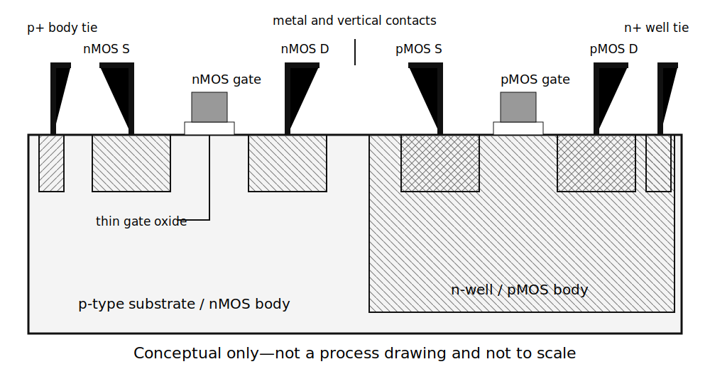
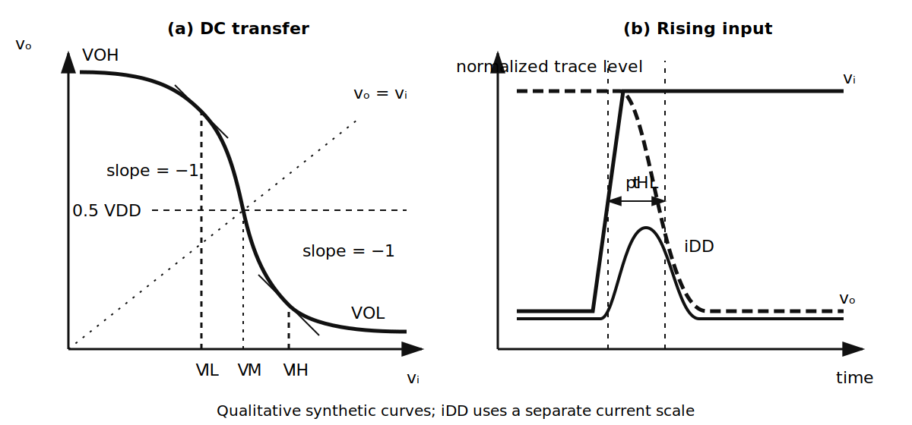
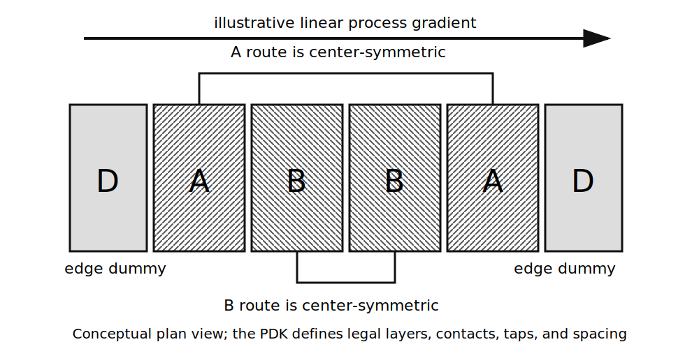

::: {.callout-note title="Chapter maturity — draft"}
You will trace CMOS structures through building blocks, layout, physical
verification, and an equation-level decision with stated limits. Every numerical
record here is illustrative. This repository does not yet provide a
version-pinned PDK run with genuine PVT, DRC, LVS, and pre/post-PEX artifacts.
You therefore cannot use this chapter to make a PDK-backed pre-silicon claim or
qualify a fabrication process. See the
[reading roadmap](../roadmap.qmd) for the meaning of chapter status.
:::

::: {.callout-warning title="Safety boundary for this chapter"}
Keep every practical exploration inside an approved, current-limited,
extra-low-voltage environment. **Electrostatic discharge (ESD)** is a rapid
transfer of accumulated charge between bodies at different potentials. An
integrated circuit may contain protection structures rated for a specified ESD
event, and it may also contain charge pumps, exposed thermal paths, or
interfaces to higher-energy systems. None of those structures widen the bench
boundary. Neither this chapter nor a component rating authorizes work outside
the approved bench boundary. Stop if you cannot identify and control the
source, return path, stored energy, temperature, and measurement connection
[@iec61010].
:::

## Central question

> What changes when you design transistors and interconnect together on silicon
> instead of assembling discrete parts on a board?

An **integrated circuit** places electronic devices and much of their
interconnection on one substrate through a shared fabrication sequence.
Integration does more than make a schematic smaller. Device dimensions set
current and capacitance.
Nearby devices share wells, substrate, temperature, and process history.
**Complementary MOS (CMOS)** combines n-channel and p-channel MOS devices so
that the complementary pair can pull a node toward either supply rail.
Micrometres of routing add
**parasitic effects**: unintended resistance, capacitance, inductance, or
coupling that physical construction creates. A package then inserts pads,
protection, leads, thermal paths, and another set of parasitics between the die
and the board [@sze2006physics; @baker2019cmos].

Imagine building two nominally equal current sinks. The discrete version uses
two transistors taken from a bag. The integrated version uses adjacent,
identically oriented device fingers on one die. Predict three trends before
reading on:

1. Which version should track temperature and process changes more closely?
2. If you double every MOS gate width, what happens to current capability,
   input capacitance, and occupied area?
3. After a clean schematic simulation, will extracted interconnect usually make
   a switching edge faster, slower, or unchanged?

The integrated pair usually tracks more closely because proximity supports
**matching**, similarity between nominally equal devices under stated
conditions. Doubling width has no single “better” outcome: current capability
and capacitance both rise. The extracted edge is usually slower because the
added interconnect resistance and capacitance were absent from the schematic.
**Parasitic extraction**
calculates those unintended physical-network elements from layout geometry and
process data. Each prediction has conditions. Poor layout can make nearby
devices systematically unequal. Fingered geometry can reduce some costs of a
wider device. Coupling can speed one transition while slowing another.

## Learning outcomes

After completing this chapter, you should be able to:

- translate a CMOS schematic into a simplified physical structure with explicit
  gates, diffusions, bodies, wells, contacts, vias, and interconnect, building on
  the MOS terminal behavior of [A02](a02-transistors.qmd);
- derive a CMOS inverter switching point and transition energy under declared
  approximations;
- define and extract its **static noise margins**, the DC input displacement
  tolerated between guaranteed output and input ranges;
- determine propagation delay from the charging current and load capacitance,
  and inventory the static and short-circuit current mechanisms that the
  square-law approximation predicts to be zero;
- analyze integrated switches, mirrors, differential pairs, transistor loads
  that provide bias and high incremental resistance, bias networks, and gain
  stages using the quiescent and incremental quantities from
  [A03](a03-bias-small-signal-amplifiers.qmd);
- separate global fabrication cases, environmental variation, systematic layout
  error, and local random differences, then choose appropriate deterministic
  and statistical evidence;
- explain how physical placement, extracted interconnect effects, hierarchical
  organization, geometry and connectivity checks, packaging, and test access
  change a block-level performance claim; and
- make a pre-silicon decision from calculations and versioned simulation while
  stating its evidence limit, without presenting an equation-level exercise as
  PDK extraction, measured yield, or product qualification.

Unless a section states otherwise, $V_{DD}$ names the positive supply,
$V_{SS}$ names the lower supply, and the chapter schematics set
$V_{SS}=0$ V. All nMOS bodies connect to $V_{SS}$ and all pMOS bodies connect
to $V_{DD}$ in the introductory bulk-CMOS circuits. Later topologies must state
any different body connection explicitly.

## CMOS structure and fabrication layers

The schematic symbol hides a fourth MOS terminal. In addition to gate, drain,
and source, the **body** or **bulk** terminal controls the channel through its
electrostatic potential and contains junctions to source and drain. A discrete
MOSFET often connects body to source internally. When you design an IC, you
must place each device in a substrate or well and provide an intentional body
connection.

Inspect the conceptual cross-section below. The nMOS sits in p-type material.
The pMOS sits in an n-well. Source and drain regions form p–n junctions to those
bodies, so normal bias keeps the junctions reverse biased. Metal reaches each
region through contacts and vias. The drawing establishes connectivity and
polarity; it is not a legal mask layout or an accurate process cross-section
[@sze2006physics; @skywater2026pdk].

{#fig-a07-cmos-cross-section fig-alt="An nMOS lies in a p-type substrate with n-type source and drain diffusions and a p-type substrate tie. A pMOS lies in an n-well with p-type source and drain diffusions and an n-type well tie. Thin oxide separates each gate from its channel, while contacts and metal connect terminals." width="95%"}

Group the fabrication layers by the electrical structures they create:

- **front end of line (FEOL)** forms wells, isolation, channels, gates, and
  source/drain regions;
- **middle of line (MOL)** forms local contacts and short local connections; and
- **back end of line (BEOL)** builds the stacked conductors and vias that connect
  devices into a circuit.

These names identify fabrication stages, not independent electrical systems.
The channel current depends on FEOL geometry, but BEOL capacitance may set the
speed. A resistive well tie can let switching current move body potential and
therefore change threshold voltage. The circuit is one physical object even
when the design flow separates its views.

### Wells, body ties, and unintended paths

For the nMOS convention used in A02, $V_{GS}=V_G-V_S$ and
$V_{DS}=V_D-V_S$. Drain current $I_D$ enters the drain. Define
$V_{SB}=V_S-V_B$. Increasing a positive $V_{SB}$ usually increases the nMOS
threshold magnitude through the **body effect**, so the same gate voltage
produces less channel current. The mechanism is electrostatic: a positive
source-to-body bias widens the depletion region under the channel, so the gate
must supply more charge before inversion begins. The standard first-order
description is

$$
V_T=V_{T0}+\gamma\left(\sqrt{2\phi_F+V_{SB}}-\sqrt{2\phi_F}\right),
$$ {#eq-a07-body-effect}

where $V_{T0}$ is the threshold at $V_{SB}=0$, $\phi_F$ is the bulk Fermi
potential, and $\gamma$ is the **body-effect coefficient** in
$\sqrt{\mathrm{V}}$. Substrate doping and oxide capacitance set its value
[@taur2021vlsi]. The
square-root form matters more than the constants: the sensitivity
$dV_T/dV_{SB}$ is largest near $V_{SB}=0$ and falls as $V_{SB}$ grows. For a
representative $\gamma=0.5~\sqrt{\mathrm{V}}$ and $2\phi_F=0.7$ V, moving $V_{SB}$
from 0 to 0.5 V raises $V_T$ by about 0.13 V — enough to change the bias point
of a stacked device. The process compact description supplies the actual
coefficients and valid range. A schematic that silently connects every body to
source may miss this effect entirely [@sedra2020microelectronic;
@berkeley2025bsim4].

The source/body and drain/body junctions add leakage and voltage-dependent
capacitance. Well and substrate resistances distribute switching current.
Together with parasitic bipolar structures they can support **latch-up**, an
unintended low-resistance path between supply rails. Proper taps, spacing,
guard rings, supply integrity, and process-specific rules control this risk.
No generic spacing value is valid across processes; use the selected process
design kit [@skywater2026pdk].

### Process design kits

A **process design kit (PDK)** is the versioned set of information and software
that connects a foundry process to design tools. Depending on the process, it
contains:

- layer definitions and legal geometric rules;
- parameterized devices and reusable cells;
- compact device descriptions for DC, transient, AC, and noise analysis;
- process, voltage, temperature, and sometimes statistical cases;
- layout-versus-schematic and parasitic-extraction rules; and
- documentation for device limits, density, antenna, latch-up, reliability,
  and supported tools.

The open SKY130 documentation gives you a concrete example because it publishes
device, layer, rule, DRC, LVS, and extraction information. Its public release is
explicitly an experimental preview, so it is suitable for education and initial
verification rather than an unqualified production claim
[@skywater2026pdk]. Treat a PDK as an implementable abstraction of a process,
not as fabrication truth, a yield guarantee, or permission to ignore rules that
its automated decks do not encode.

## Geometry sets terminal behavior

For a long-channel enhancement nMOS in strong inversion, ignore channel-length
modulation, mobility reduction, velocity saturation, series resistance, and
body effect. Define

$$
\beta_n=\mu_n C_{\mathrm{ox}}\frac{W}{L},
$$ {#eq-a07-beta}

where $\mu_n$ is effective electron mobility, $C_{\mathrm{ox}}$ is gate-oxide
capacitance per unit area, and $W/L$ is effective channel width divided by
effective channel length. This is a compact first-order parameter, not a claim
that drawn mask dimensions equal electrical dimensions.

For $V_{GS}>V_{Tn}$ and $V_{DS}\ge V_{OV}=V_{GS}-V_{Tn}$, the same square-law
approximation used in A02 gives

$$
I_D\approx\frac{1}{2}\beta_n V_{OV}^{2}.
$$ {#eq-a07-square-law}

At a fixed overdrive, doubling $W$ approximately doubles current, gate area,
and the capacitances that scale with width. A wider device may
therefore increase transconductance and reduce on-resistance while increasing
drive energy, input loading, diffusion capacitance, and layout area. Modern
compact descriptions such as BSIM include many effects that the square law
omits; use the square law for trends and hand estimates, then use the
PDK-supported description for a design decision [@berkeley2025bsim4].

At the quiescent point, differentiate @eq-a07-square-law with respect to
$V_{GS}$:

$$
g_m
\equiv
\left.\frac{\partial I_D}{\partial V_{GS}}\right|_Q
\approx\beta_n V_{OV}
=\frac{2I_D}{V_{OV}}.
$$ {#eq-a07-gm}

This local relation says that lower overdrive gives more transconductance per
unit bias current. But lower overdrive also makes mismatch more influential and
does not remove the capacitance required to create a larger device. Integrated
design repeatedly trades current, voltage headroom, area, matching, noise, and
speed rather than optimizing one number alone [@sedra2020microelectronic;
@baker2019cmos].

### Integrated resistors and capacitors

An IC can also form resistors and capacitors from process layers. A rectangular
resistor has the first-order relation

$$
R\approx R_{\square}\frac{\ell}{w},
$$ {#eq-a07-sheet-resistance}

where $R_{\square}$ is sheet resistance in ohms per square, $\ell$ is effective
length, and $w$ is effective width. End contacts, bends, temperature
coefficient, voltage coefficient, and process variation disturb this estimate.

A parallel-plate screen gives

$$
C\approx\epsilon\frac{A}{d},
$$ {#eq-a07-plate-capacitance}

but integrated capacitors also include fringing and coupling to neighboring
conductors and substrate. Device choice therefore depends on the PDK.
Metal–insulator–metal, MOS, junction, poly, and fringe structures have
different density, linearity, voltage rating, matching, and parasitic behavior.

Calculate the area before deciding whether either component is compact. Take an
**illustrative**
poly sheet resistance $R_{\square}=200~\Omega/\square$. A 100 k$\Omega$
resistor needs $\ell/w=500$ squares, so at a drawn width of $w=1~\mu$m it is
500 µm long and occupies about 500 µm² before contacts and spacing. Now take an
illustrative MIM capacitance density of $2~\text{fF}/\mu\text{m}^2$: the 1 pF
load used later in this chapter needs about 500 µm² as well. Either structure
is therefore about 80 times the 6.25 µm² gate area of the input device sized
later in this chapter. That comparison explains why integrated design often
replaces resistors with transistor loads and keeps deliberate capacitors small
[@baker2019cmos; @skywater2026pdk].

## The CMOS inverter as an analog transfer block

The CMOS inverter becomes a logic primitive in D01. Here you analyze it as two
nonlinear transistors sharing an output node. Inspect the left panel of
the inverter schematic in @fig-a07-cmos-inverter-switch. The pMOS connects the output toward $V_{DD}$.
The nMOS connects it toward the lower rail. Their common gate receives
instantaneous input $v_i(t)$, and their common drain drives $C_L$ at output
$v_o(t)$.

{#fig-a07-cmos-inverter-switch fig-alt="Panel a is a CMOS inverter: pMOS M P connects V DD to output TPO, nMOS M N connects TPO to ground, both gates connect to input TPIN, and C L loads the output. Panel b is a transmission gate: parallel nMOS and pMOS devices connect TPA to TPB, controlled by phi and its complement. The nMOS bodies connect to the lower rail and pMOS bodies to V DD." width="94%"}

### Static transfer and switching point

At low DC input, the nMOS is off in the square-law approximation and the pMOS
pulls the output high. At high input, the pMOS is off and the nMOS pulls low.
In the transition region both conduct, so the output voltage follows from equal
branch currents at DC. “MOS saturation” here names a controlled-current region;
it does not mean the low-resistance on-state of a saturated BJT.

Let $\beta_n$, $\beta_p$, $V_{Tn}>0$, and $|V_{Tp}|>0$ describe the
long-channel devices. At the **switching point** $V_M$, defined by
$V_i=V_o=V_M$, suppose both devices are in saturation and neglect
channel-length modulation. Equal current magnitudes give

$$
\beta_n(V_M-V_{Tn})^2
=
\beta_p(V_{DD}-V_M-|V_{Tp}|)^2.
$$ {#eq-a07-inverter-balance}

Both overdrives are nonnegative in the assumed region, so take the positive
square root and solve:

$$
V_M
=
\frac{
\sqrt{\beta_p}(V_{DD}-|V_{Tp}|)
+\sqrt{\beta_n}V_{Tn}
}{
\sqrt{\beta_n}+\sqrt{\beta_p}
}.
$$ {#eq-a07-switching-point}

For the illustrative symmetric case
$\beta_n=\beta_p$, $V_{Tn}=|V_{Tp}|=0.45$ V, and $V_{DD}=1.8$ V,
the result from @eq-a07-switching-point is $V_M=0.90$ V, as symmetry predicts.
Do not mistake $V_M$ for a noise margin or a guarantee that a fabricated
inverter switches at exactly half-supply.

Define the monotone DC transfer as $V_o(V_i)$. The input thresholds $V_{IL}$ and
$V_{IH}$ are the low- and high-side points where

$$
\frac{dV_o}{dV_i}=-1.
$$ {#eq-a07-logic-thresholds}

With $V_{OL}$ and $V_{OH}$ defined at the stated output loads, the static noise
margins are

$$
NM_L=V_{IL}-V_{OL},
\qquad
NM_H=V_{OH}-V_{IH}.
$$ {#eq-a07-noise-margins}

These definitions measure how much unwanted DC input displacement the following
stage can tolerate under the stated transfer curves. The ideal unloaded limits
$V_{OL}\approx0$ and $V_{OH}\approx V_{DD}$ are useful checks, not universal
terminal guarantees [@sedra2020microelectronic; @harris2021digital].

For the symmetric long-channel case these two points have a closed form, so you
can check them without a program. Take $\beta_n=\beta_p=\beta$ and
$V_{Tn}=|V_{Tp}|=V_T$. Near $V_{IL}$ the output is still high, so the nMOS is
saturated and the pMOS is in its ohmic region:

$$
\frac{\beta}{2}(V_i-V_T)^2
=
\beta\left[(V_{DD}-V_i-V_T)(V_{DD}-V_o)-\frac{(V_{DD}-V_o)^2}{2}\right].
$$ {#eq-a07-vil-balance}

Differentiate both sides with respect to $V_i$, then impose
$dV_o/dV_i=-1$. The terms in $dV_o/dV_i$ collapse to the condition
$V_{DD}-V_o=\tfrac12 V_{DD}-V_i$, and substituting it back gives

$$
V_{IL}=\frac{3V_{DD}+2V_{Tn}}{8},
\qquad
V_{IH}=\frac{5V_{DD}-2V_{Tn}}{8},
$$ {#eq-a07-symmetric-thresholds}

where $V_{IH}$ follows from the mirror-image argument with the nMOS in its
ohmic region. For the illustrative $V_{DD}=1.8$ V and $V_T=0.45$ V this gives
$V_{IL}=0.7875$ V and $V_{IH}=1.0125$ V, so
$NM_L=NM_H=0.7875$ V against the ideal rails. The later executable calculation
reproduces these independently derived values to three decimals and confirms
the arithmetic.

Inspect the left panel of @fig-a07-inverter-curves. The two slope markers define
$V_{IL}$ and $V_{IH}$. The intersection with the $v_o=v_i$ diagonal defines
$V_M$; the symmetric curve drawn here places that intersection at half-supply.
The curves are qualitative and synthetic. They show how to read the quantities
but do not describe a fabrication process.

Setting $\lambda=0$ creates a singular transfer prediction. A range of input
voltages permits both devices to satisfy their saturation inequalities for a
suitable output interval. However, their output-independent saturation
currents satisfy DC KCL only at $V_i=V_M$. At that input, the currents match for
every output voltage between $V_M-V_{Tn}$ and $V_M+V_{Tn}$. The predicted
transfer therefore falls vertically at $V_M$, and its incremental gain becomes
unbounded. Finite $\lambda$ gives a real inverter a finite central slope. It
also changes the saturated-device current and derivative at the two slope
thresholds, so it generally shifts $V_{IL}$ and $V_{IH}$. Treat the closed
forms above as $\lambda=0$ results; extract the thresholds again from any
finite-$\lambda$ transfer curve.

{#fig-a07-inverter-curves fig-alt="Panel a shows output voltage falling as input voltage rises. It marks high and low output levels, input points V IL and V IH where slope is minus one, and switching point V M. Panel b shows a rising input, delayed falling output, and a supply-current pulse during the transition." width="98%"}

### Charge, delay, and power

Declare positive current into the output capacitance from the pull-up device.
Let $i_p$ enter the output node from $V_{DD}$ and $i_n$ leave the node through
the nMOS. Charge conservation at the output gives the exact lumped relation

$$
\frac{dQ_L}{dt}=i_p-i_n.
$$ {#eq-a07-output-charge}

If $Q_L=C_Lv_o$ with constant $C_L$, this becomes

$$
C_L\frac{dv_o}{dt}=i_p-i_n.
$$ {#eq-a07-output-slew}

For a monotone transition with net current magnitude $|i_{\mathrm{net}}(v_o)|$,

$$
t
=
\left|
\int_{v_{o,1}}^{v_{o,2}}
\frac{C_L\,d v_o}{|i_{\mathrm{net}}(v_o)|}
\right|
$$ {#eq-a07-transition-integral}

The familiar $t_p\approx0.69R_{\mathrm{eq}}C_L$ is a one-pole approximation
with an effective resistance, not a transistor law. State whether the quantity
is high-to-low propagation delay $t_{pHL}$, low-to-high delay $t_{pLH}$, rise
time, or fall time. The right panel of @fig-a07-inverter-curves shows why these
names matter: output crossing occurs after input crossing, while supply current
can peak during the interval in which both devices conduct.

Now consider the energy boundary containing the inverter and load capacitance.
Define $i_{DD}$ as positive when it enters that boundary from the $V_{DD}$
supply.
Charging an initially discharged ideal capacitor from an ideal constant source
draws

$$
E_{\mathrm{sup}}
=\int V_{DD}i_{DD}\,dt
=V_{DD}\int_0^{C_LV_{DD}}dQ
=C_LV_{DD}^{2}.
$$ {#eq-a07-charge-energy}

The middle step uses $i_{DD}\,dt=dQ$: under the declared boundary and idealized
charging event, the conventional charge that crosses the positive supply port
equals the increase in capacitor charge. The source holds its terminal voltage
at $V_{DD}$ throughout, so you can take that voltage outside the integral.

The capacitor stores $\tfrac12C_LV_{DD}^{2}$. A conventional,
non-energy-recovering pull-up converts the other half to heat in its charging
path. The pull-down later converts the stored half to heat. One complete
low–high–low toggle therefore converts $C_LV_{DD}^{2}$ to heat inside this
first-order boundary. An adiabatic or resonant energy-recovery circuit crosses
the boundary differently, so this result does not govern that topology.

Define $\alpha$ as the average number of low-to-high output events per clock
period, $C_{\mathrm{sw}}$ as the total switched capacitance seen by the supply,
and $f$ as clock frequency. The average dynamic power is

$$
P_{\mathrm{dyn}}
=
\alpha C_{\mathrm{sw}}V_{DD}^{2}f.
$$ {#eq-a07-dynamic-power}

The definition of $\alpha$ prevents a factor-of-two ambiguity. For an
illustrative $C_{\mathrm{sw}}=20$ fF and $V_{DD}=1.8$ V, a complete toggle
dissipates

$$
E_{\mathrm{toggle}}
=(20~\mathrm{fF})(1.8~\mathrm V)^2
=64.8~\mathrm{fJ}.
$$

Dynamic charging is not the whole supply balance. During a finite input edge,
both transistors may conduct and create short-circuit power. In a static state,
subthreshold, reverse-junction, gate, and field-related leakage mechanisms can
draw current. A first-order average power inventory is therefore

$$
P_{\mathrm{sup}}
\approx
\alpha C_{\mathrm{sw}}V_{DD}^{2}f
+P_{\mathrm{sc}}
+V_{DD}I_{\mathrm{leak,avg}}.
$$ {#eq-a07-total-cmos-power}

The leakage term depends on state, process, voltage, and temperature. “Cutoff”
in the square-law approximation does not mean zero physical current.

### Static current and leakage mechanisms

The square law says a MOS device carries no current below threshold. That is an
artifact of the approximation. Below threshold the channel is weakly inverted
and conduction is diffusive, so drain current falls exponentially rather than
to zero [@taur2021vlsi]:

$$
I_D
\approx
I_{S}\frac{W}{L}
\exp\!\left(\frac{V_{GS}-V_T}{nkT/q}\right)
\left[1-\exp\!\left(-\frac{qV_{DS}}{kT}\right)\right].
$$ {#eq-a07-subthreshold}

Here $kT/q$ is the thermal voltage, $q$ is the positive elementary-charge
magnitude, $I_S$ is a process-determined current scale, and $n\ge1$ is the
**subthreshold slope factor**, the ratio of a gate-voltage change to the
surface-potential change it produces. When $qV_{DS}\gg kT$, the bracket
approaches one, so this first-order expression loses its explicit $V_{DS}$
dependence. The remaining current still depends on $W/L$, temperature, $I_S$,
$n$, and $V_T$. Real short-channel devices also retain drain-voltage
sensitivity through effects such as drain-induced barrier lowering
[@taur2021vlsi; @berkeley2025bsim4].

Use **subthreshold swing** $S$ to express the gate-voltage change that changes
off-state current by one decade:

$$
S
=\frac{dV_{GS}}{d(\log_{10}I_D)}
=n\frac{kT}{q}\ln 10.
$$ {#eq-a07-subthreshold-swing}

Check the dimensions: $kT/q$ is a voltage and $\ln 10$ is dimensionless, so $S$
is volts per decade. At $T=300$ K, $kT/q=25.85$ mV, so the ideal $n=1$ bound is
$S\approx59.5$ mV/decade. Illustrative bulk-CMOS values
$n=1.2$–$1.5$ give $S\approx71$–89 mV/decade; obtain the design value from the
selected device description [@taur2021vlsi; @berkeley2025bsim4]. Two
consequences follow directly. Lowering $V_T$ by 90 mV to gain speed multiplies
off-state current by about ten at $S=90$ mV/decade. Raising temperature raises
$kT/q$, which flattens
$\log I_D$ versus $V_{GS}$ by increasing $S$; temperature also changes $I_S$
and $V_T$, so leakage grows steeply with die temperature. This is
why the 60 mV/decade room-temperature floor bounds how far you can scale supply
and threshold voltages together.

Three other static paths matter at the same time:

- **reverse junction leakage** at the source/body and drain/body diodes, which
  is strongly temperature dependent;
- **gate tunnelling current** through a thin gate dielectric, which grows
  sharply as oxide thickness falls; and
- **gate-induced drain leakage (GIDL)**, a band-to-band current in the high-field
  overlap region when the gate is driven below the drain potential.

Put a number on the balance at the chapter's illustrative operating point. With
$C_{\mathrm{sw}}=20$ fF, $V_{DD}=1.8$ V, $\alpha=0.1$, and $f=100$ MHz, the
relation in @eq-a07-dynamic-power gives $P_{\mathrm{dyn}}=0.65~\mu$W. A leakage current of
1 nA against the same rail contributes $1.8$ nW, about 0.3% of the dynamic
term. Raise the temperature enough to multiply that leakage by 100, or slow the
clock to 1 MHz, and leakage stops being negligible. Static and dynamic power
therefore cross over as a function of activity, frequency, and temperature
rather than one always dominating.

Short-circuit power also depends on operating conditions. Current flows only
while the input lies between $V_{Tn}$ and $V_{DD}-|V_{Tp}|$, because both
devices conduct in that interval. For an unloaded symmetric inverter, linear full-rail input
ramps, and one rise of duration $t_r$ plus one fall of duration $t_f$ in each
period $T$, Veendrick's long-channel result gives the mean value

$$
P_{\mathrm{sc}}
=\frac{\beta}{24}[V_{DD}-2V_T]_{+}^{3}\frac{t_r+t_f}{T},
$$ {#eq-a07-short-circuit-power}

under the stated symmetric long-channel assumptions and negligible load
[@veendrick1984shortcircuit]. Here $[x]_+=\max(x,0)$ closes the conduction
window when $V_{DD}\le2V_T$. For equal edges
$t_r=t_f=\tau$, this reduces to Veendrick's commonly quoted
$\beta(V_{DD}-2V_T)^3\tau/(12T)$ form with the chapter's definition
$\beta=\mu C_{\mathrm{ox}}W/L$ when $V_{DD}>2V_T$. A nonlinear input waveform
requires integration over its actual voltage trajectory; its edge durations
alone do not determine the coefficient. Read the limits rather than the
constant. The term vanishes as both input edges become fast compared with the
period, and it vanishes when the conduction window closes. It also
grows as the cube of the usable supply excess, which is why a slow edge into a
wide buffer is an expensive input. A heavily loaded stage behaves differently:
the output moves slowly, the pull-up device stays near its own rail, and the
short-circuit share falls below this unloaded estimate.

## CMOS signal switches

The right panel of @fig-a07-cmos-inverter-switch places an nMOS and pMOS in
parallel. Their controls are complementary. This **transmission gate** connects
TPA and TPB bidirectionally when $\phi$ is high and
$\overline{\phi}$ is low.

An nMOS passes a strong low level but loses gate overdrive as its signal rises.
A pMOS has the complementary weakness near the lower rail. The parallel pair
reduces the signal-dependent on-resistance across a wider range than either
device alone [@baker2019cmos]. It remains non-ideal:

- on-resistance changes with signal and body voltage;
- off devices retain leakage and capacitive feedthrough;
- channel charge produces signal-dependent injection at turn-off;
- the complementary controls do not switch at exactly the same instant; and
- source and drain junctions constrain voltage range and fault paths.

Estimate the injected charge to see the sampling-error floor. After acquisition,
assume quasi-static strong inversion and
$|V_{DS}|\ll V_{OV}=V_{GS}-V_{Tn}$. Under that near-zero-$V_{DS}$ condition, a
uniform-channel approximation assigns the nMOS inversion channel the mobile
charge magnitude

$$
|Q_{\mathrm{ch}}|\approx WLC_{\mathrm{ox}}(V_{GS}-V_{Tn}).
$$ {#eq-a07-channel-charge}

At turn-off that charge must leave through the source and drain. If equal source
and drain impedances and a sufficiently fast control edge split it equally,
roughly half reaches a hold capacitor $C_H$, and the sampled voltage shifts in
magnitude by about $|Q_{\mathrm{ch}}|/(2C_H)$. Real partition depends on the
device region, source and drain impedances, control-edge rate, overlap
capacitance, and clock feedthrough [@baker2019cmos]. Two properties of that
error matter. It scales with
device area, so a switch made wide for low on-resistance injects more charge.
And it depends on $V_{GS}-V_{Tn}$, which itself depends on the sampled signal,
so the error is signal dependent and therefore a distortion rather than a fixed
offset. A complementary pair partially cancels the injection because the two
channels hold opposite carriers, but the cancellation is exact only at one
signal level.

Use a transmission gate as a controlled analog connection, not as an ideal
wire. Track the direct trade-off: wider switch geometry lowers on-resistance
but stores more channel charge. [S02](../05-domains/s02-sampling-data-conversion.qmd)
develops the resulting sampling errors and converter architectures.

## Integrated current replication and bias

A03 introduced the simple MOS current mirror. Integration makes matched
geometry and shared temperature practical, but it does not make current
replication exact. In the nMOS mirror of
the schematic in @fig-a07-simple-mirror, $M_1$ and $M_2$ share $V_{GS}$ and body
potential. Let both operate in saturation, and use the first-order
channel-length-modulation relation

$$
I_D
\approx
\frac12\mu_n C_{\mathrm{ox}}\frac WL
(V_{GS}-V_T)^2(1+\lambda V_{DS}).
$$ {#eq-a07-mirror-current}

Dividing output current by reference current gives the approximation

$$
\frac{I_O}{I_{\mathrm{REF}}}
\approx
\frac{(W/L)_O}{(W/L)_{\mathrm{REF}}}
\frac{1+\lambda V_{DS,O}}
     {1+\lambda V_{DS,\mathrm{REF}}}.
$$ {#eq-a07-mirror-ratio}

{#fig-a07-simple-mirror fig-alt="Panel a shows a two-NPN current-sink mirror with grounded emitters, shared bases, a diode-connected reference device, and output at the second collector. Panel b shows the analogous two-nMOS mirror with common gates and sources at the lower rail. The reference drain connects to the common gate and R REF; the output drain is TPO. The nMOS bodies connect to the lower rail but are not drawn." width="92%"}

If output and reference devices have equal drain voltage, equal threshold,
mobility, temperature, and effective geometry, the second factor approaches one.
Those conditions explain why “equal $V_{GS}$” alone is not a proof of equal
current.

For a simple nMOS current sink, the square-law compliance screen is

$$
V_{O,\min}\approx V_{OV}.
$$ {#eq-a07-mirror-compliance}

Below that output voltage, the output device enters the ohmic region and the
replicated current falls. Above it, finite $\lambda$ gives the incremental
output resistance

$$
r_o
\approx
\frac{1}{\lambda I_D}.
$$ {#eq-a07-output-resistance}

A **cascode** stacks a second device in series above the output device and holds
its gate at a fixed bias. For small output changes while both devices remain in
compliance, the upper device's source follows only a fraction of the output
movement. Its local action opposes changes in the lower device's drain voltage,
so the lower device changes its current less than it would alone. This
shielding raises output resistance. To first order, the stack multiplies the
lower device's resistance by the upper device's intrinsic gain:

$$
R_{\mathrm{out,casc}}
\approx
r_{o1}\left(1+g_{m2}r_{o2}\right)+r_{o2}
\approx
g_{m2}r_{o2}r_{o1}.
$$ {#eq-a07-cascode-resistance}

With the $r_o\approx1$ M$\Omega$ and $g_m\approx63~\mu$S values used later in
this chapter, $g_mr_o\approx63$, so a cascode raises output resistance by
roughly that factor. The price is headroom: the minimum output voltage rises
from about $V_{OV}$ in @eq-a07-mirror-compliance to about $2V_{OV}$ for a
simple cascode, and to $V_{OV}+V_{GS}$ for a naively biased one. Feedback
mirrors trade a different set of costs. Both add internal capacitance and
another node to the frequency response.

Mirror selection must keep at least six questions separate: reference accuracy,
transfer ratio, compliance, incremental output resistance, temperature drift,
and startup.

### Ratio and mismatch sensitivity

Suppose a 1:4 mirror uses four identical unit output fingers for every one
reference finger at equal current density. Ignoring $\lambda$, the nominal ratio
is four. If $I_{\mathrm{REF}}=25~\mu\text{A}$, then
$I_O\approx100~\mu\text{A}$. If $\lambda=0.10$ V$^{-1}$,
$V_{DS,\mathrm{REF}}=0.30$ V, and $V_{DS,O}=1.00$ V,
the relation in @eq-a07-mirror-ratio predicts

$$
\frac{I_O}{I_{\mathrm{REF}}}
\approx
4\frac{1+0.10(1.00)}{1+0.10(0.30)}
=4.27.
$$

Unequal drain voltages create the 6.8% ratio error in this illustrative
calculation; random mismatch does not.

Define each signed mismatch as output-device value minus reference-device
value: $\Delta I=I_O-I_{\mathrm{REF}}$ after normalizing away the intended
geometry ratio, $\Delta\beta=\beta_O-\beta_{\mathrm{REF}}$, and
$\Delta V_T=V_{T,O}-V_{T,\mathrm{REF}}$. For shared $V_{GS}$ and small local
parameter differences, differentiate the saturation relation while neglecting
$\lambda$. With
$I\propto\beta(V_{GS}-V_T)^2$,

$$
\frac{\Delta I}{I}
\approx
\frac{\Delta\beta}{\beta}
-\frac{2\Delta V_T}{V_{OV}}.
$$ {#eq-a07-mirror-mismatch}

At $V_{OV}=0.20$ V, a 2 mV threshold difference alone produces about 2%
current difference in magnitude. Lower overdrive increases $g_m/I_D$, but it
also increases the fractional current error caused by the same threshold
mismatch.

A self-biased network may also possess a zero-current equilibrium. If every
device is off, no internal signal forces it on. Such a loop requires an
intentional startup path that disturbs the zero-current state and then becomes
benign in normal operation.

## Differential stages and active loads

Trace the five-transistor **operational transconductance amplifier (OTA)** shown
in @fig-a07-five-transistor-ota. It converts differential input voltage into
output current. $M_1$ and $M_2$ steer the **tail current**, the nearly fixed
total current shared by both input branches. $M_3$ and $M_4$ form a pMOS mirror
**active load**, a transistor network that supplies bias and high incremental
resistance instead of using a large physical resistor. $M_5$ sets the tail
current. Their shared high-impedance drain node converts the resulting current
difference into output voltage at TPO.

{#fig-a07-five-transistor-ota fig-alt="Matched nMOS M1 and M2 form a differential pair with gate inputs TPP and TPN. Tail transistor M5 sinks their shared current from the common-source node to the lower rail; V BIAS drives M5's gate. P-channel M3 and M4 form a current-mirror active load from V DD. The M2-M4 drain node is single-ended output TPO and drives C L. The nMOS bodies connect to the lower rail and pMOS bodies to V DD." width="82%"}

Define input polarities before deriving a sign:

$$
v_d=v_p-v_n,
\qquad
v_{CM}=\frac{v_p+v_n}{2}.
$$ {#eq-a07-input-coordinates}

$v_d$ is the differential input and $v_{CM}$ is the input common-mode voltage,
both instantaneous. Let positive output current charge $C_L$ and raise $v_o$.
Increasing $v_p$ relative to $v_n$ makes $M_1$ take more tail current and
$M_2$ take less. The pMOS mirror copies the increased left-branch current into
the right side, so the net current at TPO rises. The single-ended output
therefore rises for positive $v_d$ in this topology.

### Current steering

Use identical long-channel nMOS devices with parameter $\beta$ and ignore
channel-length modulation and body effect. Let the ideal tail source fix total
current $I_T$:

$$
i_1+i_2=I_T.
$$ {#eq-a07-tail-conservation}

At $v_d=0$, symmetry gives $i_1=i_2=I_T/2$. Applying
the square-law relation in @eq-a07-square-law gives each device the balanced
overdrive

$$
V_{OV0}=\sqrt{\frac{I_T}{\beta}}.
$$ {#eq-a07-pair-overdrive}

For inputs within the region where both devices conduct in saturation, solving
the two square-law currents with the conservation law gives

$$
i_1-i_2
=
\sqrt{\beta I_T}\,v_d
\sqrt{1-\frac{\beta v_d^2}{4I_T}}.
$$ {#eq-a07-pair-large-signal}

This expression is valid for
$|v_d|\le\sqrt{2I_T/\beta}$ under the stated assumptions. At zero differential
input it gives zero current difference. As $|v_d|$ reaches the boundary, one
device takes the full tail current and the other turns off. That limiting case
is the physical meaning of current steering.

Differentiate @eq-a07-pair-large-signal at $v_d=0$:

$$
g_{md}
\equiv
\left.\frac{d(i_1-i_2)}{dv_d}\right|_{v_d=0}
=\sqrt{\beta I_T}
=\beta V_{OV0}.
$$ {#eq-a07-differential-gm}

Each drain current changes by approximately
$\pm g_{md}v_d/2$. The mirror active load subtracts the branch changes at one
output node, so its ideal single-ended transconductance approaches $g_{md}$,
not $g_{md}/2$. Finite mirror output resistance, finite tail resistance,
mismatch, and loading reduce that result [@sedra2020microelectronic;
@baker2019cmos].

### Gain, common mode, and output swing

At the output quiescent point, first omit any external resistive load. The
intrinsic output resistance is approximately

$$
R_{\mathrm{out}}
\approx
r_{o,n}\parallel r_{o,p}.
$$ {#eq-a07-ota-output-resistance}

If an external small-signal resistance $R_L$ loads TPO, replace
$R_{\mathrm{out}}$ by $r_{o,n}\parallel r_{o,p}\parallel R_L$. The schematic
shows only the capacitive load $C_L$, so the first form corresponds to the drawn
topology.

The low-frequency incremental voltage gain is then

$$
A_{vd}
\equiv
\frac{v_o}{v_d}
\approx
+g_{md}R_{\mathrm{out}}.
$$ {#eq-a07-ota-gain}

The sign is positive for the input and output references declared above.
This is a local gain around the Q point. It remains valid only while every
device stays in its intended region and the signal is small enough for
linearization.

The common-mode input range is not the same as differential range. For an nMOS
input pair above an nMOS tail device, a useful lower screen is

$$
V_{CM,\min}
\approx
V_{SS}+V_{OV,\mathrm{tail}}+V_{GS,\mathrm{in}}.
$$ {#eq-a07-cm-low}

The upper screen depends on the pMOS load node and input-device saturation.
Using the diode-connected pMOS node
$V_D\approx V_{DD}-V_{SG,p}$ gives

$$
V_{CM,\max}
\approx
V_D+V_{Tn}.
$$ {#eq-a07-cm-high}

These are topology-specific long-channel estimates. Verify every device's
$V_{GS}$, $V_{DS}$, body bias, and saturation condition at every process,
supply, temperature, and signal corner.

With source node $V_S\approx V_{CM}-V_{GS,\mathrm{in}}$, the output swing screens
are

$$
V_{o,\min}\approx V_S+V_{OV,n},
\qquad
V_{o,\max}\approx V_{DD}-V_{OV,p}.
$$ {#eq-a07-output-swing}

An active load provides high incremental resistance, not infinite resistance or
unlimited swing.

### Bandwidth, settling, and large-signal rate

Let the output node see total small-signal capacitance $C_{\mathrm{out}}$ and
resistance $R_{\mathrm{out}}$. If one pole dominates, its frequency is

$$
f_p
\approx
\frac{1}{2\pi R_{\mathrm{out}}C_{\mathrm{out}}}.
$$ {#eq-a07-output-pole}

This approximation fails when another internal, package, or load pole is nearby.
For a large output step, available charging or discharging current bounds the
instantaneous slope:

$$
\left|\frac{dv_o}{dt}\right|
\le
\frac{I_{\mathrm{available}}}{C_{\mathrm{out}}}.
$$ {#eq-a07-ota-slew}

Small-signal bandwidth and large-signal slew rate are different constraints.

### Worked example: five-transistor OTA gain, bandwidth, and swing

Now calculate the stage from the relations derived above. The parameters are
**illustrative long-channel values**, not a PDK extraction: $V_{DD}=1.8$ V,
tail current $I_T=20~\mu$A, input-pair $\beta=200~\mu$A/V$^2$,
$\lambda=0.10$ V$^{-1}$ for every device, and a load $C_L=1$ pF that dominates
$C_{\mathrm{out}}$.

Predict first. Each input device carries half the tail current, so its overdrive
should be a few hundred millivolts. Output resistances of order 1 M$\Omega$
against a transconductance of order 100 $\mu$S suggest a gain near 100, not
1000. Now compute.

Applying @eq-a07-pair-overdrive gives the balanced overdrive

$$
V_{OV0}=\sqrt{\frac{20~\mu\text{A}}{200~\mu\text{A}/\text{V}^2}}=0.316~\text{V},
$$

and from @eq-a07-differential-gm the differential transconductance is
$g_{md}=\sqrt{\beta I_T}=63.2~\mu$S. Each branch carries
$I_D=I_T/2=10~\mu$A, so @eq-a07-output-resistance gives

$$
r_{o,n}=r_{o,p}=\frac{1}{(0.10~\text{V}^{-1})(10~\mu\text{A})}=1.00~\text{M}\Omega,
$$

and @eq-a07-ota-output-resistance gives $R_{\mathrm{out}}=500$ k$\Omega$. The
low-frequency gain from @eq-a07-ota-gain is then

$$
A_{vd}\approx(63.2~\mu\text{S})(500~\text{k}\Omega)=+31.6
\quad(30.0~\text{dB}).
$$

The parallel combination of two $r_o$ values halves the output resistance, and
the 0.316 V overdrive gives only modest $g_m$, so the result falls below the
order-of-magnitude prediction of 100. Substituting
$g_{md}=\sqrt{\beta I_T}$ and $R_{\mathrm{out}}=1/(\lambda I_T)$ collapses the
gain in @eq-a07-ota-gain to
$A_{vd}\approx1/(\lambda V_{OV0})$. The tail current still matters because
$V_{OV0}=\sqrt{I_T/\beta}$. With fixed geometry and therefore fixed $\beta$,
raising $I_T$ reduces this first-order gain in proportion to
$1/\sqrt{I_T}$: $g_{md}$ rises as $\sqrt{I_T}$ while
$R_{\mathrm{out}}$ falls as $1/I_T$. If you scale $\beta$ in proportion to
$I_T$ and thereby hold overdrive and current density constant, the first-order
gain remains constant.

The output pole from @eq-a07-output-pole is

$$
f_p\approx\frac{1}{2\pi(500~\text{k}\Omega)(1~\text{pF})}=318~\text{kHz},
$$

giving a gain–bandwidth product of about $31.6\times318$ kHz $\approx10$ MHz.
The large-signal limit is separate. The most current the stage can deliver into
$C_L$ is the full steered tail current, so @eq-a07-ota-slew bounds the slope at

$$
\left|\frac{dv_o}{dt}\right|\le\frac{20~\mu\text{A}}{1~\text{pF}}
=20~\text{V}/\mu\text{s}.
$$

A 1 V output step therefore cannot complete faster than about 50 ns regardless
of what the small-signal bandwidth predicts.

Finally check the operating window. With
$V_{GS,\mathrm{in}}=V_{Tn}+V_{OV0}=0.45+0.316=0.77$ V and a tail overdrive of
0.30 V, @eq-a07-cm-low gives $V_{CM,\min}\approx0+0.30+0.77=1.07$ V. Taking
$V_{SG,p}=0.77$ V puts the load node at $V_D=1.03$ V, so @eq-a07-cm-high gives
$V_{CM,\max}\approx1.03+0.45=1.48$ V. The usable common-mode window is about
0.4 V wide on a 1.8 V supply. That narrowness is the characteristic weakness of
this topology. A real design may use a pMOS input pair, a complementary
rail-to-rail pair, a folded topology, level shifting, or a deliberately
restricted input range. A complementary input pair also creates a
transconductance crossover that you must control. The output swing screens
of @eq-a07-output-swing, evaluated at $V_{CM}=1.2$ V so that $V_S=0.43$ V, run
from about 0.75 V to 1.48 V.

Every number here follows from equations already stated, so you can repeat
the whole example after changing one parameter. None of it is evidence about a
fabricated process.

### Mismatch and input-referred offset

The differential pair converts device mismatch into an apparent input signal.
Define the **input-referred offset voltage** $V_{OS}$ as the differential input
you must apply to null the specified DC output response. The input-pair-only
derivation below uses equal branch currents, $i_1-i_2=0$, as that null
condition. Let
$\Delta V_T=V_{T1}-V_{T2}$ and
$\Delta\beta/\beta=(\beta_1-\beta_2)/\beta$, with both differences taken as
the $M_1$ value minus the $M_2$ value. Linearizing the two branch currents and
setting $i_1-i_2=0$ gives

$$
V_{OS}
\approx
\Delta V_T-\frac{V_{OV0}}{2}\frac{\Delta\beta}{\beta}.
$$ {#eq-a07-input-offset}

Read the two terms separately. Threshold mismatch appears at full weight;
changing the bias does not reduce it. Half the overdrive scales current-factor
mismatch, and that term carries the opposite sign: a stronger $M_1$ needs a negative
$v_d$ to restore equal branch currents. Combining this with the
area scaling of @eq-a07-pelgrom below explains the standard sizing rule for a precision input
pair: increase $WL$ to shrink $\sigma(\Delta V_T)$, and keep $V_{OV0}$ small so
the $\Delta\beta$ term stays small. For the worked example above, a 5 mV
threshold difference and a 1% current-factor difference give
$V_{OS}\approx5~\text{mV}-(0.158~\text{V})(0.01)=3.4$ mV, which at a gain of
31.6 produces a 0.11 V output offset. Reversing either mismatch reverses that
term; independent random terms combine statistically rather than by assuming
equal signs. The input pair is only one offset source; mirror mismatch,
tail-source asymmetry, finite output resistance, and layout gradients also
contribute to the complete OTA offset. For this untrimmed illustrative stage,
the calculated DC offset can set the minimum resolvable DC or low-frequency
input. Noise sets a separate floor that you must integrate over the stated
bandwidth and observation interval. Trimming, chopping, and auto-zeroing change
the comparison.

### Multistage gain, compensation, and output drive

A later gain stage can multiply the low-frequency gain, but it also creates
another high-impedance node. Inspect the incremental two-stage representation
in @fig-a07-two-stage-incremental. It applies only around a valid quiescent point.
The ground symbols are AC reference; the omitted DC bias network must establish
the stated $G_{m1}$, $g_{m2}$, $R_1$, and $R_2$.

{#fig-a07-two-stage-incremental fig-alt="Differential input v d controls an upward current G m1 v d into high-impedance node TPX. R1 and C1 connect TPX to AC reference. TPX controls a downward current g m2 v x at output TPO. R2 and output capacitance connect TPO to AC reference. Compensation capacitor C C connects TPO back to TPX." width="90%"}

If the stage poles lie far apart and the following circuit adds no loading
beyond the displayed parameters, the low-frequency gain magnitude is

$$
|A_0|
\approx
(G_{m1}R_1)(g_{m2}R_2).
$$ {#eq-a07-two-stage-gain}

This product is a first-order approximation. Finite source resistance,
body effect, transistor capacitance, the compensation path, and output loading
change it.

The magnitude bars are deliberate, so state the sign separately. In the drawn
representation the second stage sinks $g_{m2}v_x$ from the output node, so it
inverts. The first stage, wired as in @fig-a07-five-transistor-ota, does not.
The overall low-frequency gain is therefore negative,
$A_0\approx-(G_{m1}R_1)(g_{m2}R_2)$, and that inversion is exactly what makes
$C_C$ a Miller feedback element rather than a plain load capacitor.

**Miller compensation** uses a capacitor across an inverting stage to separate
the stage poles. Follow the motion in @fig-a07-two-stage-incremental. When
$v_x$ rises, the second stage drives $v_o$ downward. The two terminals of
$C_C$ therefore move in opposite directions, so the capacitor draws more
current from TPX than the same capacitance connected from TPX to AC reference.
TPX behaves as though it carries an enlarged capacitance, which pushes its pole
down while the other pole moves upward. Under the usual dominant-pole
assumptions, this mechanism gives

$$
\omega_u\approx\frac{G_{m1}}{C_C},
$$ {#eq-a07-unity-frequency}

where $\omega_u$ is the amplifier's approximate open-loop unity-gain angular
frequency in rad/s under the displayed two-stage assumptions. Watch the units
against @eq-a07-output-pole, which gives a pole in Hz: the two differ by
$2\pi$, so $f_u=\omega_u/2\pi=G_{m1}/(2\pi C_C)$. Do not automatically treat
$f_u$ as a feedback-loop crossover; the applied feedback network also sets the
loop crossover.

Define $v_C=v_o-v_x$ as the signed voltage across $C_C$. The current available
to charge that capacitor bounds its large-signal voltage rate:

$$
\left|\frac{dv_C}{dt}\right|
\lesssim
\frac{I_{\mathrm{charge}}}{C_C}.
$$ {#eq-a07-compensation-slew}

Use this rate as an output-slew estimate only when one capacitor terminal moves
comparatively little or when a derived stage relation maps $v_C$ to $v_o$.

A simple two-stage topology can create a right-half-plane feed-forward zero of
order $g_{m2}/C_C$. This nonminimum-phase feature adds phase lag near crossover.
A nulling resistor or another compensation topology can move or remove the
zero. Parasitic extraction changes $C_1$, $C_2$, coupling, and node resistance.
Pads, package, and external load add more poles and zeros. Use the schematic
estimate to choose a starting $C_C$. Then use extracted loop analysis to decide
whether **phase margin**—the angular separation from the $-180^\circ$
condition at loop crossover—and settling meet their requirements
[@sedra2020microelectronic; @baker2019cmos].

An output stage solves a different problem: it supplies load current while
preserving swing, quiescent power, and stability.

A **class-A** output keeps its active device continuously biased. A
**class-AB** output uses complementary devices with a small overlap current near
the handoff between sourcing and sinking. Poor handoff creates
**crossover distortion**, a waveform error concentrated at the moments the
output current changes sign. Excessive overlap creates **shoot-through**, a direct
supply-to-return current path.

| Output arrangement | Main benefit | Main constraints |
|---|---|---|
| common-source gain stage | voltage gain and broad output range | high output resistance, limited load current, inversion |
| class-A source follower | low output resistance and continuous bias | asymmetric source/sink limits, one direction capped by bias current, threshold headroom |
| complementary class-AB | source and sink current with lower idle power | crossover control, bias spread, shoot-through, asymmetric limits |

: Integrated output-stage choices trade gain, current, headroom, quiescent
power, and dynamic behavior [@baker2019cmos]. {#tbl-a07-output-stages}

For every output stage, trace the positive and negative load-current paths.
Check quiescent current, source and sink limits, output swing, short-circuit
behavior, device stress, and the thermal path. “Rail-to-rail” is a
condition-specific terminal claim, not a property that a
complementary symbol proves. Use A04 and A06 to analyze feedback stability.
Here, track how integrated geometry and extracted parasitics alter that loop.

## Process variation, corners, and mismatch

No fabricated dimension or device parameter is exact. Keep the following
variation classes separate because each demands different evidence.

| Variation class | Typical cause | Shared by nearby devices? | Appropriate evidence |
|---|---|---:|---|
| Global process variation | wafer and lot shifts in dimensions, mobility, threshold, resistance | largely yes | PDK process cases and characterization |
| Supply and temperature | operating environment and self-heating | often correlated | voltage and temperature sweeps |
| Local random mismatch | microscopic differences between nominally equal devices | no | statistical mismatch description and Monte Carlo sampling |
| Systematic layout error | gradients, orientation, stress, proximity, routing, IR drop, coupling | geometry dependent | layout review, extraction, structured comparison |
| Aging and reliability drift | electric field, current density, temperature, time | stress dependent | foundry reliability rules and qualification |

: Variation mechanisms require different evidence; a corner sweep does not
replace mismatch analysis, and Monte Carlo sampling does not repair a systematic
layout error [@baker2019cmos; @pelgrom1989matching].
{#tbl-a07-variation-classes}

A **process corner** is a discrete set of compact-description parameters chosen
to represent a specified process case. Names such as TT, FF, SS, FS, and SF are
PDK-defined; do not infer their numerical meaning from the letters alone. A
corner is not a probability and not automatically worst for every metric.
Fast devices may improve delay while increasing leakage and reducing gain.
**Process–voltage–temperature (PVT) analysis** applies the defined process cases
across required supply and temperature values. The combinations belong to the
requirement; a process label alone does not cover environment.

**Mismatch** is the difference between nominally identical nearby devices under
the same stated conditions. Keep it distinct from global process shift.
Pelgrom and co-workers observed area-dependent matching behavior that is often
expressed in the empirical forms

$$
\sigma(\Delta V_T)
\approx
\frac{A_{V_T}}{\sqrt{WL}},
\qquad
\sigma\left(\frac{\Delta\beta}{\beta}\right)
\approx
\frac{A_\beta}{\sqrt{WL}}.
$$ {#eq-a07-pelgrom}

Here $W$ and $L$ are effective channel width and length, so $\sqrt{WL}$ has
units of length. For the left relation to yield volts, the **matching
coefficient** $A_{V_T}$ must carry units of volt·metre; it is conventionally
quoted in mV·µm. $A_\beta$ describes a relative spread, so its units are
per-unit·metre, conventionally quoted as %·µm. Both coefficients, together with
the extraction method and validity range, belong to the process and device
description. The relation in @eq-a07-pelgrom is an empirical scaling law, not a
universal physical constant [@pelgrom1989matching].

Size a pair with it. Suppose a process reports an **illustrative**
$A_{V_T}=5$ mV·µm and the input pair of the worked OTA above must hold
$\sigma(\Delta V_T)\le2$ mV. Then

$$
\sqrt{WL}\ge\frac{5~\text{mV}\cdot\mu\text{m}}{2~\text{mV}}=2.5~\mu\text{m},
\qquad
WL\ge6.25~\mu\text{m}^2,
$$

so each input device needs at least about 6.25 µm² of gate area — for example
$W=12.5$ µm at $L=0.5$ µm. Halving the offset target to 1 mV quadruples the
required area to 25 µm², because the relation is inverse-square-root. That
quadratic cost in area is the reason precision analog blocks are large compared
with the logic beside them. Increasing device area also increases gate and
diffusion capacitance, slows the stage, and spreads the pair across more spatial
variation. You can use common-centroid placement to cancel the first-order
linear component under symmetric weights and surroundings; extraction and
structured comparison must bound the residual nonlinear, routing, stress, and
thermal errors.

### Monte Carlo evidence and its limit

A **Monte Carlo analysis** repeatedly samples a declared statistical
description and recomputes circuit metrics. It estimates behavior *within that
description*. Record the PDK and simulator versions, statistical case, random
seed, sample count, correlations, stimuli, load, temperature, and metric
extraction.

Zero observed failures does not prove zero failure probability. If $N$
independent Bernoulli trials show no failures, a one-sided 95% upper confidence
bound on the modeled failure probability $p$ solves
$(1-p)^N=0.05$:

$$
p_{95}
=1-0.05^{1/N}
\approx\frac{3}{N}
\quad\text{for large }N.
$$ {#eq-a07-zero-failure-bound}

Thus 1000 clean independent modeled trials bound $p$ only to about 0.30% under
the stated statistical assumptions. They do not prove “three-sigma yield,”
cover missing mechanisms, or qualify fabricated product.

## Layout controls systematic error and parasitics

A **layout** is the process-layer geometry that directs device and interconnect
fabrication. Layout gives you another description of the schematic and adds
information that the schematic omits: orientation, spacing,
surroundings, routing, wells, taps, coupling, and thermal proximity.

For a matched pair, start with unit devices. Give corresponding units the same
orientation, current density, contacts, surroundings, and routing. The
conceptual array below uses an A–B–B–A sequence, equal weighted centroids, and
edge dummies.

{#fig-a07-common-centroid fig-alt="A horizontal device array has dummy, A, B, B, A, dummy fingers. A fingers connect symmetrically above and B fingers connect symmetrically below. A horizontal gradient arrow shows that A and B have the same weighted centroid." width="94%"}

**Common-centroid layout** places weighted device parts so that nominally matched
devices share the same geometric centroid. Symmetric weights, connectivity, and
surroundings let this arrangement cancel a first-order linear gradient. The
arrangement does not cancel random mismatch, nonlinear gradients,
well-proximity effects — the
threshold shift a device suffers when it sits close to a well edge —
isolation stress, density effects, IR drop, unequal heating, or asymmetric
coupling [@baker2019cmos; @pelgrom1989matching].

Match each layout technique to the error mechanism it suppresses:

- **interdigitation** alternates unit fingers to sample a spatial variation;
- **dummies**, electrically inactive replica fingers placed at array edges,
  make the active edge fingers see neighbors similar to those an interior
  finger sees;
- symmetric routing and equal contact/via counts reduce series-resistance and
  coupling imbalance;
- frequent well and substrate taps control body potential and resistance;
- guard rings collect substrate current and isolate sensitive blocks;
- short high-impedance nodes reduce parasitic capacitance and interference; and
- local supply routing and decoupling reduce shared impedance.

Each practice has costs in area, capacitance, resistance, or routing complexity.
The PDK also imposes minimum width, spacing, enclosure, density, antenna,
current-density, and reliability rules. Extraction may reveal electrical
asymmetry even when the drawn layout looks symmetric [@baker2019cmos;
@skywater2026pdk].

## Hierarchy and physical verification

**Hierarchy** organizes a design into cells with named instances, pins, and
nets. A cell may have schematic, symbol, layout, extracted, behavioral, and test
views. Hierarchy makes review and reuse possible, but every boundary must
preserve the same pin meaning and reference.

Read the flow below from requirements to test. Each arrow means “supplies the
next representation or check”; no arrow guarantees correctness. The table then
expands each phase into its stages.

{#fig-a07-physical-flow fig-alt="Five boxes connected left to right by arrows: requirements and test metrics, schematic analyses, layout with DRC and LVS, extraction and reanalysis, and fabrication and test." width="100%"}

Three checks answer different questions:

- **design-rule checking (DRC)** asks whether layout geometry satisfies the
  encoded manufacturing and reliability rules;
- **layout versus schematic (LVS)** asks whether extracted devices and
  connectivity correspond to the intended netlist under the selected
  comparison rules; and
- parasitic extraction, abbreviated **PEX**, estimates layout-dependent resistance,
  capacitance, and coupling that the extraction deck supports.

Each phase contains several stages, and each stage answers a narrower question
than its name suggests. Read the third column first: it is the one that keeps
an evidence claim honest.

| Stage | Establishes | Does not establish |
|---|---|---|
| Requirements and test metrics | measurands, conditions, limits, decision rules | that any implementation meets them |
| Schematic and pre-layout analyses | topology, bias, gain, and bandwidth estimates | any layout-dependent effect |
| Layout with PDK geometry | drawn layer geometry intended for mask-data preparation | electrical correctness |
| Design-rule checking (DRC) | geometry satisfies encoded manufacturing rules | connectivity or function |
| Layout versus schematic (LVS) | extracted devices and nets match the netlist | performance |
| Parasitic extraction (PEX) | resistance, capacitance, and coupling calculated from geometry | measured behavior |
| Extracted PVT and statistical analyses | metric spread across defined cases and samples | yield, or mechanisms absent from the description |
| Pad and package description | pad, ESD cell, bond or bump, and lead parasitics | in-package behavior |
| Package-aware reanalysis | revised poles, settling, and supply integrity | fabricated behavior |
| Fabrication | physical die | conformity of any individual unit |
| Wafer probe | accessible die measurements before packaging | packaged performance |
| Packaging and final test | packaged units screened against production limits | qualification or field reliability |

: Stages of the flow in @fig-a07-physical-flow. Treat a stage as passed only
when its evidence answers the question in the middle column.
{#tbl-a07-flow-stages}

Extraction is calculation from geometry and process data, not measurement.
Some rules require manual or specialized checks, including
electrical-rule, antenna, density, electromigration, IR-drop, ESD, and latch-up
analysis. An **antenna rule**
uses a process-specific metric, often a ratio of exposed conductor geometry to
connected gate area, to limit charge collection during plasma processing.
Excess collected charge can damage the thin gate oxide before a protecting
diode or later metal connection provides a discharge path.
**Electromigration** is the gradual transport of metal atoms by high current
density, which opens or shorts a conductor after long operation.
**IR drop** is the DC voltage lost along a supply conductor carrying current
through its own resistance, which lowers the supply a distant block actually
receives. The SKY130 documentation, for example, distinguishes automated rule,
LVS, and extraction resources and warns that not every rule is automatically
verified [@skywater2026pdk].

## Pads, packages, and test access

The die does not connect directly to an ideal board pin. A practical signal path
may contain:

$$
\text{core node}
\rightarrow
\text{I/O and ESD cell}
\rightarrow
\text{pad}
\rightarrow
\text{bond wire or bump}
\rightarrow
\text{package lead}
\rightarrow
\text{board}.
$$

Every arrow adds possible resistance, inductance, capacitance, coupling, and
fault paths. Pad capacitance can dominate a small internal node. Package
inductance produces $v_L=L\,di/dt$, so a rapid current change can move the
apparent supply or ground voltage at the die.
These electrical effects require package-aware reanalysis before fabrication
[@baker2019cmos].
Thermal resistance depends on the package, board, airflow, copper, and power
distribution. The standardized test environment attached to a quoted
$\theta_{JA}$ limits how you may use it; the number does not act as a universal
die-temperature multiplier
[@ti2024thermalmetrics].

**Design for test (DFT)** means adding structures that make important functions
controllable and observable during manufacturing or characterization. Analog
examples include test multiplexers, bias overrides, loopback paths, accessible
references, trim elements, and known loads. These structures consume area and
add parasitics, but you cannot directly screen performance you cannot access
[@bushnell2000testing].

Keep the evidence stages distinct:

- design verification compares representations before fabrication;
- wafer probe tests accessible die behavior before packaging;
- final test evaluates packaged parts against production limits;
- characterization maps detailed behavior across conditions;
- qualification addresses specified stresses and reliability mechanisms; and
- production screening applies a defined decision rule to each unit or lot.

A simulation result is not a measurement. A measured engineering sample is not
automatically a production guarantee [@bushnell2000testing].

## Worked pre-silicon decision: an illustrative inverter

You can now apply predict → calculate → simulate → reconcile → decide to the
inverter in @fig-a07-cmos-inverter-switch. This example demonstrates the
evidence structure with a transparent transistor relation; it does not
represent a PDK-backed design.

### Requirements and assumptions

The illustrative block has these pre-silicon screens:

- $V_{DD}=1.8$ V nominal;
- static noise margin $NM_L>0.70$ V and $NM_H>0.70$ V in every supplied case;
- $t_{pHL}<180$ ps when you drive an ideal, instantaneous, full-rail rising
  input at $t=0$ and stop the interval when the falling output crosses 0.9 V;
- report the delay increase caused by the postulated capacitance proxy and keep
  it below 1.8 times the 20 fF baseline delay;
- observe no $NM_L\le0.70$ V or $NM_H\le0.70$ V events in the 200-sample
  teaching Monte Carlo run, and state the statistical limitation.

Use the long-channel relations already derived. Nominal
$V_{Tn}=|V_{Tp}|=0.45$ V and
$\beta_n=\beta_p=200~\mu\text{A}/\text{V}^2$. The baseline load is 20 fF. A postulated
32 fF value acts as a **synthetic post-layout-capacitance proxy**. No layout or
extractor produced either value, and they do not describe a named process.

Before calculating, predict the trends. Symmetry puts $V_M$ near 0.9 V. A slow
case should increase delay. Raising capacitance from 20 fF to 32 fF should
increase delay by about $32/20=1.6$ if the device current does not change.

### Executable transistor-level calculation

The following standard-library program numerically solves the declared
square-law transistor currents at each DC input and integrates the relation
in @eq-a07-output-slew for a falling edge. This is an **illustrative transistor-level
simulation of the stated equations**, not a PDK compact-description simulation
and not measurement. The “slow” and “fast” cases are parameter perturbations,
not foundry process corners. Running CPython 3.13.13 with only its standard
library reproduced the expected output below.

```{.python}
from random import Random

VDD = 1.8

def ids_n(vg, vd, beta, vt):
    vov = max(vg - vt, 0.0)
    if vd < vov:
        return beta * (vov * vd - 0.5 * vd**2)
    return 0.5 * beta * vov**2

def ids_p(vg, vd, beta, vt):
    return ids_n(VDD - vg, VDD - vd, beta, vt)

def dc_output(vin, bn, bp, vtn, vtp):
    lo, hi = 0.0, VDD
    for _ in range(40):
        vo = 0.5 * (lo + hi)
        if ids_n(vin, vo, bn, vtn) > ids_p(vin, vo, bp, vtp):
            hi = vo
        else:
            lo = vo
    return 0.5 * (lo + hi)

def transfer_metrics(bn, bp, vtn, vtp, intervals=400):
    step = VDD / intervals
    vi = [i * step for i in range(intervals + 1)]
    vo = [dc_output(x, bn, bp, vtn, vtp) for x in vi]
    slope = [(vo[i + 1] - vo[i - 1]) / (2 * step)
             for i in range(1, intervals)]
    center = vi[1:-1]
    cross = []
    for i in range(1, len(slope)):
        y0, y1 = slope[i - 1] + 1.0, slope[i] + 1.0
        if y0 * y1 <= 0.0:
            fraction = -y0 / (y1 - y0)
            x = center[i - 1] + fraction * (
                center[i] - center[i - 1]
            )
            cross.append(x)
    vil, vih = cross[0], cross[-1]
    vol, voh = vo[-1], vo[0]
    return vil, vih, vol, voh, vil - vol, voh - vih

def falling_delay(beta, vt, capacitance):
    dt, t, vo = 1e-12, 0.0, VDD
    while vo > 0.5 * VDD:
        vo -= ids_n(VDD, vo, beta, vt) * dt / capacitance
        t += dt
    return t

beta0, vt0 = 200e-6, 0.45
cases = {
    "slow proxy": (0.75 * beta0, 1.10 * vt0),
    "typical": (beta0, vt0),
    "fast proxy": (1.25 * beta0, 0.90 * vt0),
}
typical_metrics = None
for name, (beta, vt) in cases.items():
    metrics = transfer_metrics(beta, beta, vt, vt)
    nm = min(metrics[-2:])
    tphl = falling_delay(beta, vt, 20e-15)
    print(f"{name:10s} NM={nm:.3f} V, tPHL={tphl*1e12:.1f} ps")
    if name == "typical":
        typical_metrics = metrics

vil, vih, vol, voh, nml, nmh = typical_metrics
print(f"typical VIL={vil:.3f} V, VIH={vih:.3f} V")
print(f"typical VOL={vol:.3f} V, VOH={voh:.3f} V")
print(f"typical NML={nml:.3f} V, NMH={nmh:.3f} V")
fine = transfer_metrics(beta0, beta0, vt0, vt0, intervals=800)
grid_change = max(abs(a - b) for a, b in zip(typical_metrics, fine))
print(f"400-to-800 grid maximum change: {1e3*grid_change:.2f} mV")

pre = falling_delay(beta0, vt0, 20e-15)
post = falling_delay(beta0, vt0, 32e-15)
print(f"capacitance-proxy delay ratio: {post/pre:.3f}")

rng = Random(7)
mc_margin = []

def positive_local_factor(sigma):
    while True:
        value = rng.gauss(1.0, sigma)
        if value > 0.0:
            return value

for _ in range(200):
    vtn = rng.gauss(vt0, 0.015)
    vtp = rng.gauss(vt0, 0.015)
    bn = beta0 * positive_local_factor(0.03)
    bp = beta0 * positive_local_factor(0.03)
    metrics = transfer_metrics(bn, bp, vtn, vtp)
    mc_margin.append(min(metrics[-2:]))
print(f"200-run minimum synthetic NM: {min(mc_margin):.3f} V")
failures = sum(value <= 0.70 for value in mc_margin)
print(f"200-run noise-margin failures: {failures}")
```

The DC sweep uses 4.5 mV input spacing and linearly interpolates between
finite-difference slope samples. A repeated nominal sweep at 2.25 mV spacing
checks numerical sensitivity. The transient integrator uses 1 ps time steps, so
its displayed crossing time has approximately 1 ps numerical resolution. The
200 teaching samples use independent Gaussian threshold draws with
$\sigma(V_{Tn})=\sigma(|V_{Tp}|)=15$ mV. They use Gaussian 3% local
perturbations for each $\beta$ and reject the nonphysical tail at
$\beta\le0$. This narrow Gaussian is a local teaching approximation, not a
foundry distribution. Independent draws deliberately omit process correlations
and therefore cannot support a yield claim.

Expected output:

```text
slow proxy NM=0.799 V, tPHL=144.0 ps
typical    NM=0.787 V, tPHL=101.0 ps
fast proxy NM=0.776 V, tPHL=76.0 ps
typical VIL=0.787 V, VIH=1.013 V
typical VOL=0.000 V, VOH=1.800 V
typical NML=0.787 V, NMH=0.787 V
400-to-800 grid maximum change: 0.03 mV
capacitance-proxy delay ratio: 1.604
200-run minimum synthetic NM: 0.750 V
200-run noise-margin failures: 0
```

Reconcile the result: in this symmetric illustrative relation, the slow proxy
has slightly larger static noise margin even though it
has worse delay. “Slow” is not worst for every metric. The 1.604 delay ratio
agrees with the predicted capacitance ratio within the 1 ps integration step.

### Decision and claim boundary

The supplied synthetic cases pass the stated numerical screens:

| Metric | Worst supplied result | Rule | Disposition |
|---|---:|---:|---|
| static noise margin | 0.750 V | $>0.70$ V | pass for supplied samples |
| falling delay | 144.0 ps | $<180$ ps | pass for supplied cases |
| capacitance-proxy delay ratio | 1.604 | $<1.8$ | pass for supplied comparison |
| Monte Carlo noise-margin failures | 0 of 200 | zero observed | observation only |

: **Synthetic illustrative decision record.** Use this record only to qualify
the displayed equations, parameters, sample seed, and metrics. It provides no
evidence about fabricated silicon. {#tbl-a07-inverter-decision}

The decision also needs an explicit limitation budget. Keep these entries
separate instead of combining them into a manufactured zero residual:

| Contribution | Class | Available bound or evidence | Effect on claim |
|---|---|---|---|
| DC grid and derivative | deterministic numerical | maximum displayed metric change 0.03 mV when intervals double | negligible against the 50 mV displayed margin, for this solver |
| transient time step | deterministic numerical | 1 ps crossing-time resolution | does not reverse the 36 ps worst supplied delay margin |
| 32 fF capacitance proxy | assumed systematic input | no extraction or uncertainty bound | cannot support a layout claim |
| square-law and proxy cases | description-form limitation | no PDK comparison | cannot support a process or PVT claim |
| 200 random samples | finite statistical evidence | zero noise-margin events; about 1.49% one-sided 95% upper bound under the sampling assumptions | cannot support a low-defect yield claim |

: **Illustrative error and limitation budget.** Deterministic numerical effects,
assumed systematic inputs, description-form limitations, and finite random
evidence remain separate. {#tbl-a07-inverter-limitations}

The program reports the two nominal margins separately, so you can audit each
requirement instead of seeing only their minimum. Keep the conclusion narrow:

> The illustrative inverter is feasible under the supplied long-channel
> equations and cases. Your next step is to replace it with a versioned PDK
> implementation, then collect pre-layout, PVT, DRC, LVS, extraction,
> post-layout, package-aware, and test-planning evidence.

You cannot claim process yield. With zero failures in only 200 independent
modeled samples, @eq-a07-zero-failure-bound gives a 95% upper failure-probability
bound near 1.49% under the assumed sampling description. The calculation also
omits leakage, short-circuit current, body effect, voltage-dependent
capacitance, interconnect resistance, coupling, package effects, and model-form
error. Those omissions prevent qualification even though every displayed
number passes.

A physical acceptance test must name the input edge rate, supply and
temperature points, output load, voltage thresholds, probe loading, calibrated
time-base and voltage uncertainty, sample plan, and guard bands. A result equal
to a strict limit fails. Production limits require a foundry-supported process,
silicon characterization, and an appropriate conformity policy
[@jcgm2012conformity].

## Replacing the teaching equations with a versioned PDK

The square-law program lets you audit every equation, but it cannot answer
whether a foundry-supported device meets the same requirements. Replace it with
a versioned PDK run when you have access to an approved process and toolchain.
The PDK defines device names, valid terminal voltages, compact descriptions,
corners, statistical parameters, layout rules, and extraction decks; do not
translate the words “slow” and “fast” into corner names by guesswork
[@skywater2026pdk; @baker2019cmos].

Start from the inverter topology in @fig-a07-cmos-inverter-switch, including
explicit body terminals. Then execute this evidence sequence:

1. **Freeze the environment.** Record the PDK release or commit, simulator and
   extractor versions, device-cell names, include files, and all command-line
   options. Store relative paths or a setup script; do not rely on an
   undocumented interactive session.
2. **Declare the testbench.** Parameterize $V_{DD}$, temperature, input rise and
   fall times, output capacitance, device dimensions, and initial conditions.
   Name the measurement references and define $t_{pHL}$, $t_{pLH}$,
   $V_{IL}$, $V_{IH}$, $V_{OL}$, $V_{OH}$, $NM_L$, $NM_H$, average supply
   current, and peak device voltage before running the solver.
3. **Run the pre-layout matrix.** Sweep every required process case across
   every required supply and temperature point. Measure both transition
   directions. A single diagonal list such as slow–low-voltage–hot and
   fast–high-voltage–cold can miss a worst combination, so use the Cartesian
   product unless the PDK documentation or requirement justifies a smaller set.
4. **Run the supported statistical analyses.** Select the relevant PVT points
   from the deterministic matrix, then run the PDK's process and mismatch
   descriptions without discarding their correlations. Record the statistical
   case, correlation policy, seeds, sample count, metric extraction, and every
   observed failure.
5. **Check numerical convergence.** Tighten tolerances and maximum transient
   step, then verify that each metric changes by less than its allocated
   numerical budget. Record convergence warnings instead of discarding them.
6. **Create and verify layout.** Use legal devices, wells, taps, contacts, vias,
   and routes. Save DRC and LVS reports. Do not begin the post-layout
   performance claim while either check has unresolved errors.
7. **Extract and rerun.** Generate the supported resistance, capacitance, and
   coupling view. Rerun the full deterministic PVT matrix with the same stimuli
   and metric code. Do not silently change device sizes, loads, thresholds, or
   edge definitions. Repeat the relevant statistical analyses when the PDK and
   extraction flow support them.
8. **Add the I/O and package boundary.** Include the selected pad and ESD cells
   plus the supported bond-wire, bump, and package description when the
   requirement reaches an external pin. Distinguish die-pad metrics from
   external-pin metrics, then rerun the affected timing, loading,
   supply-integrity, and stress requirements.
9. **Reconcile by metric.** For each case, compute
   $\Delta m=m_{\mathrm{post}}-m_{\mathrm{pre}}$ and the relative change
   $\Delta m/m_{\mathrm{pre}}$ when the denominator stays meaningfully away
   from zero. Use extracted-element reports and node sensitivities to explain
   the largest changes.
10. **Apply the decision rule.** Include numerical allowance and any declared
   model-form or extraction allowance in the guard band. A metric that equals a
   strict limit fails. A clean finite Monte Carlo sample remains a limited
   observation, not a yield guarantee.

Keep the run auditable with a compact manifest:

| Artifact | Minimum recorded content | Question it answers |
|---|---|---|
| environment manifest | PDK, simulator, extractor, operating system, commands | can another person reproduce the run? |
| schematic netlist and testbench | device cells, dimensions, bodies, sources, loads, metric definitions | what circuit and conditions did you analyze? |
| PVT result table | every case, supply, temperature, metric, and disposition | which supplied deterministic case controls each requirement? |
| DRC and LVS reports | deck versions, run options, error counts, waivers | does layout satisfy encoded geometry and connectivity checks? |
| extracted netlist and summary | extraction type, parasitic counts and totals, coupling policy | what physical network did the post-layout run include? |
| pre/post comparison | absolute and relative metric changes with explanations | which layout effects moved performance? |
| statistical record | statistical description, correlations, seed, samples, failures, confidence statement | what did the declared sampling experiment observe? |

: Minimum manifest for a reproducible PDK-backed inverter study. None of these
artifacts alone establishes fabricated behavior. {#tbl-a07-pdk-manifest}

Because this repository lacks those process-specific artifacts, you can execute
the method with an authorized PDK but cannot reinterpret the synthetic proxy as
extracted evidence.

## Predictions after physical implementation

The integrated pair can track better because nearby unit devices share much of
the global process and temperature variation. Random mismatch and systematic
error from gradients, stress, routing, body potential, or self-heating can
still separate their behavior.

Doubling width increases first-order current parameter $\beta$ but also
increases gate and diffusion capacitance and usually area. Whether the circuit
becomes faster depends on what drives the wider gate and what load it drives.

Additional capacitance slowed the illustrative proxy comparison. Extraction
often adds resistance and capacitance that slow a node, but coupling, changed
current distribution, and signal-dependent effects can move different edges in
different directions. Extracted analysis must therefore determine each case.

## Geometry-to-test claim boundary

Integration connects device geometry to circuit behavior. Wells and body ties
create electrical terminals and parasitic paths. Width, length, and current
density set useful gain and current together with capacitance, area, and
mismatch sensitivity. The CMOS inverter exposes static transfer, noise margins,
charge, delay, dynamic power, short-circuit current, and leakage in one compact
block.

Current mirrors turn geometry ratios into bias currents only within compliance
and matching limits. Differential pairs steer a conserved tail current, while
active loads convert that difference into single-ended gain. Common-mode range,
output swing, finite output resistance, capacitance, and available current bound
the gain and speed.

Layout is not decoration. It controls systematic error, parasitics, body
potential, coupling, and reliability. DRC, LVS, and PEX answer different
questions. Corners and Monte Carlo sampling provide different evidence. Pads,
packages, and test structures remain part of the circuit. Compare the physical
structure, schematic, equations, simulation, layout, extraction, package, and
test. Agreement strengthens your claim; disagreement tells you what to
investigate next.

## Exercises

### Quick check

1. In an nMOS current sink, “saturation” most directly means:

   a. the device is an ideal short circuit

   b. the drain current is comparatively insensitive to drain voltage

   c. the body diode conducts strongly

   d. the gate current equals the drain current

2. With activity, capacitance, and frequency fixed, reducing $V_{DD}$ by 10%
   changes first-order dynamic power by a factor closest to:

   a. 0.50

   b. 0.81

   c. 0.90

   d. 1.10

3. Two devices have a common-centroid layout and pass LVS. Which statement is
   defensible?

   a. Their electrical parameters are exactly equal.

   b. Random mismatch has been eliminated.

   c. A first-order linear gradient can be reduced, but other mismatch remains.

   d. PEX is unnecessary.

4. Which statement correctly distinguishes a process corner from Monte Carlo
   analysis?

   a. A corner is always the statistically least likely sample.

   b. Monte Carlo proves the absolute worst case.

   c. A corner is a defined parameter case; Monte Carlo samples a statistical
      description.

   d. They are interchangeable when both use the same PDK.

5. A layout passes DRC but fails LVS. The best interpretation is:

   a. its geometry satisfies encoded rules, but its extracted connectivity or
      devices do not match the intended circuit;

   b. its electrical performance is guaranteed;

   c. the package has excessive inductance;

   d. its Monte Carlo sample count is too small.

6. A post-layout inverter is slower than its schematic version. The first
   hypothesis to test is:

   a. DRC removed the pMOS;

   b. extracted resistance and capacitance increased the driven time constant;

   c. logic levels changed from binary to decimal;

   d. common-centroid layout eliminates output capacitance.

**Answer key:** 1-b, 2-b, 3-c, 4-c, 5-a, 6-b.

### Retrieval and explanation

7. Name the four MOS terminals. Explain why an IC body connection must be
   intentional even when a discrete three-terminal symbol was adequate.

8. Distinguish FEOL, MOL, and BEOL. Give one circuit consequence associated
   with each.

9. Define $V_M$, $V_{IL}$, $V_{IH}$, $NM_L$, and $NM_H$. Which one is not a
   noise margin?

10. Explain why equal $V_{GS}$ does not guarantee equal current in a mirror.
    Include drain voltage, body voltage, geometry, temperature, and mismatch.

11. Distinguish DRC, LVS, and PEX in one sentence each.

12. Explain why a clean extracted simulation is still not measured silicon.

### Estimation and calculation

13. An output switches 0→1→0 with $C_{\mathrm{sw}}=75$ fF and
    $V_{DD}=1.2$ V. Estimate energy per complete toggle. If it toggles on 20%
    of 200 MHz cycles, calculate first-order dynamic power. *Self-check:* the
    results are 108 fJ per complete toggle and 4.32 $\mu\text{W}$.

14. A node has $R_{\mathrm{out}}=800$ k$\Omega$ and
    $C_{\mathrm{out}}=60$ fF. Estimate its one-pole frequency. If available
    charging current is 15 $\mu\text{A}$, bound the maximum large-signal slope.
    *Self-check:* about 3.32 MHz and 250 V/µs.

15. A 1:8 mirror has $\lambda=0.08$ V$^{-1}$,
    $V_{DS,\mathrm{REF}}=0.25$ V, and $V_{DS,O}=1.20$ V. Use the relation
    of @eq-a07-mirror-ratio to estimate the actual current ratio.
    *Self-check:* about 8.60.

16. A mirror operates at $V_{OV}=0.15$ V. Estimate fractional current mismatch
    for $\Delta V_T=1.5$ mV and $\Delta\beta/\beta=-0.5\%$. State the sign
    convention you chose. *Self-check:* with output minus reference
    differences, the relation in @eq-a07-mirror-mismatch gives about $-2.5\%$.

17. A device has $S=85$ mV/decade and an off-state current of 2 nA at
    $V_{GS}=0$. Estimate its off-state current if you lower the threshold by
    170 mV with everything else unchanged. Then estimate the leakage power
    against a 1.8 V rail in both cases, and compare with the 0.65 µW dynamic
    power of the illustrative inverter. *Self-check:* 170 mV is two decades, so
    the current becomes about 200 nA, and leakage power rises from 3.6 nW to
    about 360 nW — from 0.6% to over half the dynamic term.

18. Size a matched pair for $\sigma(\Delta V_T)\le1.2$ mV given an
    illustrative $A_{V_T}=6$ mV·µm. Report the minimum gate area and one
    $(W,L)$ pair that meets it at $L=0.6$ µm. State what the result does *not*
    bound. *Self-check:* $\sqrt{WL}\ge5$ µm, so $WL\ge25~\mu\text{m}^2$ and
    $W\ge41.7$ µm; it bounds random mismatch only, not gradient or offset drift.

### Derivation and limiting cases

19. Starting from equal saturation currents, derive the switching
    point of @eq-a07-switching-point. Check the limit
    $\beta_n=\beta_p$ and $V_{Tn}=|V_{Tp}|$. Then, starting from the
    saturation–ohmic balance of @eq-a07-vil-balance, impose $dV_o/dV_i=-1$ and
    recover the symmetric closed forms of @eq-a07-symmetric-thresholds.
    Confirm that they reproduce the 0.787 V and 1.013 V printed by the chapter
    program, and explain why $NM_L=NM_H$ here but not in general.

20. Derive @eq-a07-charge-energy from $i=dQ/dt$. Account separately for energy
    entering from the supply, energy stored in the capacitor, internal
    conversion to heat, and later discharge.

21. Starting from $i_1+i_2=I_T$ and two square-law devices, derive the steering
    relation of @eq-a07-pair-large-signal. Verify the $v_d=0$ and full-steering limits.

22. Derive @eq-a07-zero-failure-bound. Evaluate it for $N=100$, 1000, and
    10 000. Explain why a larger sample does not cover missing physics.

### Data interpretation

23. A synthetic table in the form of an OTA PVT report gives:

| Case | Gain (dB) | Output pole (MHz) | Supply current (µA) |
|---|---:|---:|---:|
| SS, 1.62 V, 125 °C | 47 | 0.42 | 31 |
| TT, 1.80 V, 27 °C | 54 | 0.71 | 40 |
| FF, 1.98 V, −40 °C | 49 | 1.26 | 57 |

   The table is **synthetic**. Identify the worst supplied case for each metric.
   Why is there no single worst corner? What extra cases would you request?

24. Pre-layout gain is 56 dB and its dominant pole is 0.80 MHz. Post-layout
    values are 51 dB and 0.55 MHz. Give two circuit mechanisms that could explain
    each change. Name the evidence that would discriminate among them.

25. An LVS report lists one unmatched device and one swapped net, while DRC
    reports zero errors. Explain why these results are not contradictory. Use
    the LVS mismatch tree and cross-probing to decide whether one connectivity
    error causes both reports before choosing a repair order.

26. A pre-package output settles in 8 ns. Adding the pad, ESD cell, bond-wire,
    and package description changes the synthetic result to 13 ns and adds
    90 mV of supply bounce. Identify likely capacitance, inductance, and shared
    impedance mechanisms. Propose one internal test-access feature and one
    package-pin measurement that would discriminate among them.

### Debugging

27. A differential stage has correct tail current, but output offset changes
    strongly when the common-mode input moves. Form hypotheses involving finite
    tail resistance, body effect, input-pair region, mirror compliance, and
    layout asymmetry. Choose test points that distinguish them.

28. A mirror ratio changes after extraction. The devices have equal drawn
    geometry. Investigate unequal source resistance, drain-voltage difference,
    gate routing resistance, body-tie voltage, coupling, and contact count.
    State which extracted quantities you would compare.

29. A fabricated test chip oscillates only when probed at a high-impedance
    internal node. Explain how probe capacitance and ground inductance could
    either create or suppress the observed behavior. What non-intrusive or
    buffered observation would you add in the next revision?

### Open design

30. Design the floorplan and evidence plan for a 1:4 current mirror whose
    magnitude of ratio error must remain below 1.0% for
    $0.4~\text{V}\le V_O\le1.4~\text{V}$ across the required PVT set. Reserve
    0.2 percentage point as a numerical and extraction guard band, so the
    pre-silicon acceptance rule is $|\epsilon_{\mathrm{ratio}}|<0.8\%$.
    Specify unit-device arrangement, dummies, routing, taps, mismatch analysis,
    extracted metrics, and the boundary of the pre-silicon claim.

31. Develop a five-transistor OTA for a current-limited 1.8 V teaching process.
    Specify bias current, input common-mode range, output swing, load, DC gain,
    bandwidth, and settling requirements. Produce hand estimates, a versioned
    simulation plan, a layout strategy, DRC/LVS/PEX evidence, and a physical
    acceptance plan with uncertainty and guard bands. Do not claim yield from
    nominal or finite Monte Carlo results.

## Connections

Chapter ID: `A07`. Its direct prerequisites in the registry are A02 and A03.

- [A02](a02-transistors.qmd) supplies MOS terminal references, regions, gate
  charge, switching loss, and thermal limits. A07 adds shared bodies, geometry,
  integrated parasitics, and physical verification.
- [A03](a03-bias-small-signal-amplifiers.qmd) supplies the Q point,
  $g_m$, $r_o$, current mirrors, gain, loading, and headroom.
  A07 connects those quantities to matched geometry and active-load IC stages.
- [A04](a04-op-amps-feedback.qmd) and
  [A06](a06-noise-nonlinearity-stability.qmd) provide the feedback and stability
  tools needed when an extracted integrated amplifier closes a loop.
- [D01](../03-digital/d01-bits-codes-logic.qmd) abstracts inverter voltage
  ranges into logic states and develops digital electrical levels.
- [S02](../05-domains/s02-sampling-data-conversion.qmd) uses transmission
  switches, capacitors, matching, and layout in sampled-data and converter
  circuits.
- [R02](../06-realization/r02-schematic-pcb.qmd) moves outside the
  package to board-level schematic capture and PCB layout. IC layout and PCB
  layout share physical reasoning but use different materials, rules, and tools.
- [R05](../06-realization/r05-metrology-reliability-test.qmd) develops production
  metrology, screening, guard bands, and qualification after the pre-silicon
  evidence boundary used here.
- [M03](../appendices/m03-probability-numerical.qmd) supports statistical
  sampling and uncertainty. [M02](../appendices/m02-calculus-linear-differential.qmd)
  supports the derivatives, integrals, and local linearization used here.
  [T01](../appendices/t01-datasheets-standards.qmd) supports PDK,
  specification, and evidence reading. No current lab or project in the
  registry provides fabricated A07 silicon evidence; the chapter therefore
  stops at a versioned pre-silicon method and states the later test plan.

## References

Point-of-use citations identify the device-physics, CMOS design, matching, PDK,
thermal, metrology, and safety sources used in this chapter. Synthetic
calculations and simulations remain teaching artifacts; the citations do not
turn them into process or silicon evidence.
