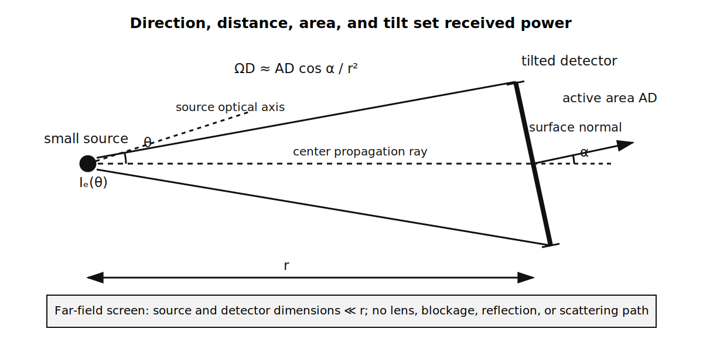
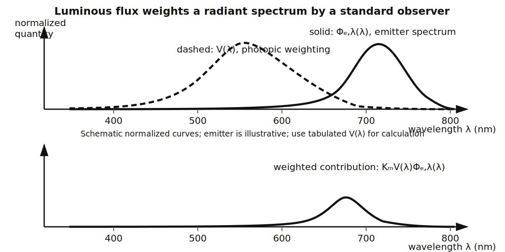
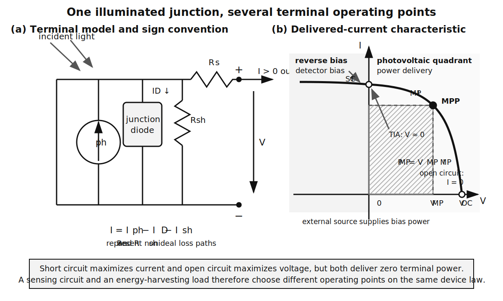
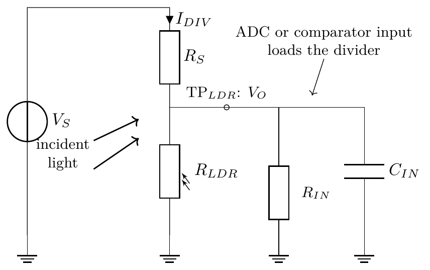
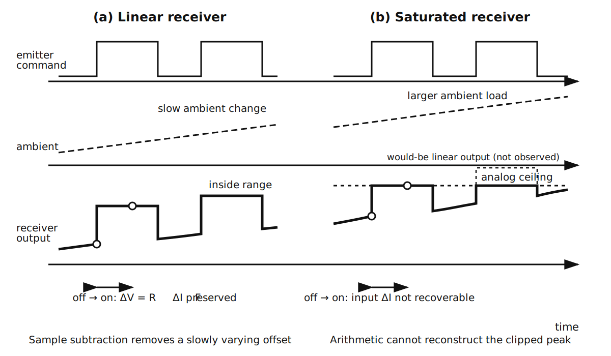
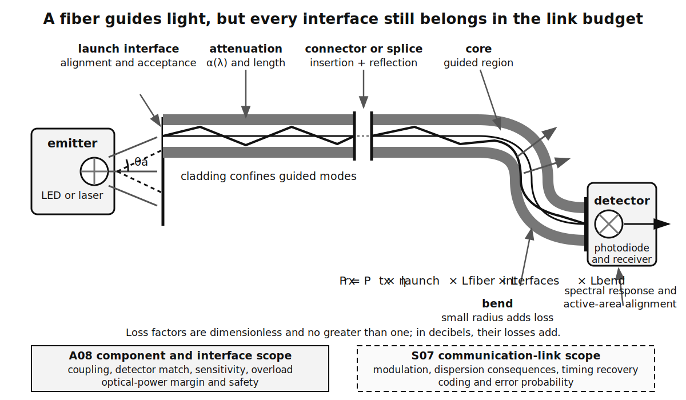
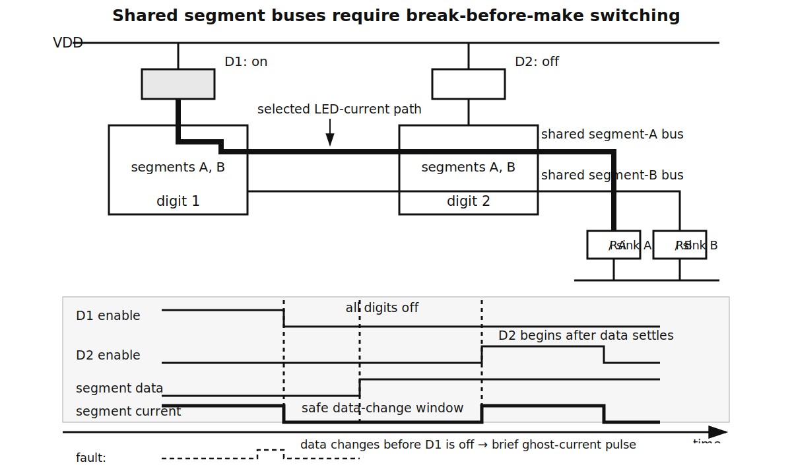
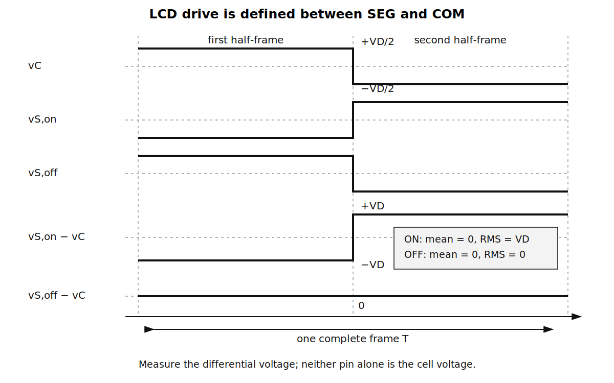

::: {.callout-note title="Chapter maturity — draft"}
This draft develops optical quantities, complete emitter and detector
interfaces, optocoupler margins, display driving, and human-readable state
presentation. Its numerical evidence comes from cited manufacturer data and
explicitly labelled calculations. The repository does not yet contain an
A08-specific physical data set, so the worked decisions are not hardware
qualification. The [reading roadmap](../roadmap.qmd) explains chapter maturity.
:::

::: {.callout-warning title="Safety boundary for optical and isolation work"}
Practical work remains limited to current-limited, extra-low-voltage sources,
approved components, local supervision, and an approved procedure. Do not stare
into an energized emitter or view it through magnifying optics. Visible-source
photobiological safety depends on accessible radiance, spectrum, exposure, and
the applicable product standard [@iec62471_7_2023]. A disconnected fiber end
can expose an invisible beam, and a viewing microscope can increase the hazard;
inspection requires a verified de-energized source and approved procedure.
Bare laser diodes, unclassified optical sources, mains-connected circuits, and
tests across unknown-energy insulation barriers are outside this chapter's boundary
[@iec60825_1_2014; @iec61010].

An optical signal-transfer component in a schematic does not authorize work on
a hazardous circuit. Insulation coordination, steady and transient voltage,
physical spacing, materials, layout, enclosure, and applicable approvals require
a qualified design process. Classroom continuity, resistance, or dielectric
tests cannot establish safety compliance.
:::

## Central question

> How do you convert reliably between electrical signals and light, and present
> a system's state to a person without misleading them?

A status LED can draw exactly its calculated current and still fail as an
indicator. Direct sunlight may hide it. A narrow viewing angle may direct most
of its light away from the operator. A red/green code may be ambiguous to a
person who does not distinguish the colors. If the LED, its driver, or the
supply fails open, darkness can falsely resemble a valid “off” state.

The reverse conversion has the same structure. A photodiode can generate the
expected current under a calibrated source, yet an optical receiver can fail
when ambient light consumes its analog **headroom**, the distance between its
operating signal and a range boundary. Software may subtract an
ambient estimate only while the detector, amplifier, and converter remain
unsaturated.

**Optoelectronics** is the engineering of devices and systems that convert
between electrical and optical quantities. A **human-machine interface (HMI)**
is the part of a system through which a person receives information or supplies
commands. This chapter concentrates on visual status presentation and optical
sensing; it does not develop command-entry controls. The two conversions follow
to their endpoints:

```{mermaid}
%%| label: fig-a08-conversion-chain
%%| fig-cap: "The two optical conversion chains. Each arrow means that the upstream quantity influences the downstream quantity; it does not imply lossless or one-to-one conversion."
%%| fig-alt: "The output chain runs from an electrical state through an emitter driver, optical field, display or indicator, human perception, and interpretation. The input chain runs from a scene through optical geometry, detector, analog interface, and electrical decision. Ambient light, temperature, component variation, contamination, and faults enter at several stages."
%%| fig-width: 5.4
flowchart TB
  S["electrical state"] --> ED["emitter and driver"]
  ED --> OF["optical field"]
  OF --> H["human perception"]
  H --> M["interpreted meaning"]

  X["scene or optical source"] --> G["free-space or guided path:<br/>geometry, spectrum, and loss"]
  G --> PD["photodetector"]
  PD --> A["analog interface"]
  A --> D["electrical decision"]

  N["ambient light, temperature,<br/>variation, contamination, faults"] --> OF
  N --> G
  N --> A
  N --> M
```

Predict three trends before continuing:

1. If ambient illumination rises while emitter output remains fixed, does
   visible contrast improve or degrade?
2. If a four-digit LED display lights one digit at a time at unchanged peak
   segment current, does each segment's average current rise, fall, or stay
   constant?
3. If a photodiode receiver clips during the “emitter off” interval, can exact
   digital subtraction recover the optical signal?

The answers are degrade, fall, and no. The rest of the chapter turns those
directions into design relations and testable requirements.

## Learning outcomes

This chapter assumes the junction behavior, LED operating point, photodiode
current relation, and rating discipline of
[A01](a01-semiconductor-diodes.qmd). It also assumes the measurement-chain,
cross-sensitivity, calibration, and decision concepts of
[A05](a05-sensors-instrumentation.qmd). After completing the chapter, you
should be able to:

- distinguish radiant, photometric, and geometric quantities, then select the
  quantity that a circuit or HMI requirement actually constrains;
- bound LED current and resistor dissipation across source, device, and
  resistance variation, and separate electrical safety from optical-output
  variation;
- relate photoconductivity, photovoltaic separation, transistor gain, and
  avalanche multiplication to photodiodes, phototransistors,
  photoresistors, and photovoltaic cells, then select a suitable detector and
  readout from speed, linearity, sensitivity, spectrum, and history;
- derive photodiode responsivity from photon conversion, distinguish
  photovoltaic sensing from power delivery, design a transimpedance operating
  point, and preserve headroom under ambient light;
- construct a bounded optical power budget through source launch, fiber,
  connectors, bends, and detector limits while keeping power margin distinct
  from timing and communication evidence;
- specify an **optocoupler**, an enclosed emitter-detector signal link, from
  guaranteed current-transfer,
  output-voltage, timing, and insulation conditions without treating one rating
  as a complete safety claim;
- choose among LED, LCD, OLED, and electrophoretic displays from ambient,
  update, power, drive, temperature, and retention requirements;
- calculate multiplex peak and average current, identify ghosting and LCD
  DC-bias failures, and define discriminating waveform tests; and
- construct an indicator state table and guarded acceptance test that uses
  redundant meaning, measured contrast, viewing geometry, and explicit fault
  behavior.

## Optical quantities connect devices to observers

The diode relation from A01 gives electrical current and voltage. It does not by
itself say how much optical energy reaches a detector or how bright an indicator
appears. Those questions require quantities that include spectrum, direction,
area, and the observer.

### Photons, power, and conversion efficiency

A01 established the photon energy

$$
E_\gamma=h\nu=\frac{hc}{\lambda},
$$ {#eq-a08-photon-energy}

where $\lambda$ is vacuum wavelength. The relation is exact for a photon in
vacuum. A real LED emits a spectrum rather than a single wavelength, so using
one $\lambda$ is a narrowband approximation [@sze2006physics].

**Radiant energy** $Q_e$ is optical electromagnetic energy in joules.
**Radiant flux** $\Phi_e$ is the rate at which radiant energy crosses a stated
boundary:

$$
\Phi_e\equiv\frac{\mathrm dQ_e}{\mathrm dt}.
$$ {#eq-a08-radiant-flux}

Its SI unit is watt. Optical datasheets often call $\Phi_e$ “radiant power.”
That wording does not make it electrical input power. For an emitter at thermal
steady state, a boundary containing the complete device gives

$$
P_{\mathrm{elec}}=\Phi_e+\dot Q_{\mathrm{heat,out}},
$$ {#eq-a08-emitter-balance}

provided no energy accumulates inside the boundary. During warm-up, the exact
balance also contains the rate of stored internal-energy change. The **wall-plug
efficiency**

$$
\eta_{\mathrm{WPE}}\equiv\frac{\Phi_e}{P_{\mathrm{elec}}}
$$ {#eq-a08-wall-plug}

is therefore a ratio of total outward radiant power to total electrical input
power under stated steady conditions. It is not luminous efficacy and it does
not identify where the unconverted power leaves as heat.

Direction and receiving area matter next. A **solid angle** is the
two-dimensional angular extent seen from a point, measured in steradians.
**Radiant intensity**
$I_e=\mathrm d\Phi_e/\mathrm d\Omega$ is radiant flux per solid angle in
W sr$^{-1}$. **Irradiance** $E_e=\mathrm d\Phi_e/\mathrm dA$ is radiant flux
incident on a surface per area in W m$^{-2}$. The subscript distinguishes
irradiance $E_e$ from photon energy $E_\gamma$.

For a sufficiently small source, let $I_e(\theta)$ be the radiant intensity in
the direction of a small detector. If the detector of area $A_D$ is at distance
$r$ and its surface normal is at incidence angle $\alpha$ to the arriving ray,
its projected solid angle is approximately
$\Omega_D=A_D\cos\alpha/r^2$ for $0\le\alpha<90^\circ$. Therefore

$$
\Phi_{e,D}\approx I_e(\theta)\frac{A_D\cos\alpha}{r^2}.
$$ {#eq-a08-inverse-square}

This is a far-field geometric approximation. It requires $r$ to be large
relative to source and detector dimensions, a known angular intensity, no
obstruction, and a direct path. A packaged LED is generally directional, not
isotropic; use its angular-intensity data at $\theta$. A nearby extended source,
lens, diffuser, or reflective enclosure can violate the point-source model.
Reflective sensing additionally needs target orientation, illuminated spot,
reflectance or a bidirectional-reflectance model, aperture, and contamination;
applying inverse square twice is not a sufficient target model
[@fraden2016sensors].

Before using the equation, identify the two different angles and the physical
boundary of the detector area in @fig-a08-optical-geometry.

{#fig-a08-optical-geometry fig-alt="A small source sends a cone of rays to a detector at distance r. The source direction is theta. The detector has active area A D, surface normal, and incidence angle alpha. Its accepted solid angle is approximately A D cosine alpha divided by r squared. A note lists the far-field assumptions." width="94%"}

For example, $I_e(\theta)=20~\mu\mathrm{W\,sr^{-1}}$,
$A_D=7.5~\mathrm{mm^2}$, $r=0.20$ m, and $\alpha=30^\circ$ predict
$\Phi_{e,D}=3.25$ nW. Doubling $r$ reduces that direct-path result by four;
turning the detector to $60^\circ$ reduces it by $\cos60^\circ=0.5$. These are
model predictions, not guaranteed powers.

**Self-check.** If only $\alpha$ changes from $0^\circ$ to $60^\circ$, what
fraction of received power remains? **Answer:** one half, provided every other
far-field assumption remains valid.

### Radiometry and photometry are different descriptions

**Radiometry** describes optical radiation with physical energy quantities and
weights every joule equally. **Photometry**
weights optical radiation according to a standardized description of human
visual response. For spectral radiant flux density
$\Phi_{e,\lambda}(\lambda)$, radiant flux per wavelength interval in
W m$^{-1}$, **luminous flux** is defined by

$$
\Phi_v
=K_m\int_0^\infty
V(\lambda)\Phi_{e,\lambda}(\lambda)\,\mathrm d\lambda,
$$ {#eq-a08-luminous-flux}

where $V(\lambda)$ is the selected dimensionless photopic spectral luminous
efficiency function, a standardized weighting for light-adapted vision, and
$K_m$ is its maximum luminous efficacy. In the SI
photometric system, the defining constant is tied to monochromatic radiation
at 540 THz and has exact value 683 lm W$^{-1}$; the wavelength-domain function
and interpolation conventions complete the calculation
[@bipm2019si; @cie2019photometry].

The dimensions are

$$
\left[\Phi_v\right]
=\frac{\mathrm{lm}}{\mathrm W}
\int
\left[
\frac{\mathrm W}{\mathrm m}
\right]\mathrm d\lambda
=\mathrm{lm}.
$$

The integral explains why equal radiant power at two wavelengths need not
produce equal luminous flux. It also explains why perceived brightness cannot
be inferred from LED current alone.

The spectral-weighting diagram in @fig-a08-spectral-weighting shows the
operation of the integral. Its schematic
curves are normalized: they explain multiplication and integration, but the
emitter is illustrative and calculations require tabulated $V(\lambda)$.

{#fig-a08-spectral-weighting fig-alt="Two schematic normalized plots versus wavelength. The upper plot overlays a dashed photopic weighting curve peaking near 555 nanometres and an illustrative solid far-red emitter spectrum. The lower plot shows their smaller, shifted product. A note directs calculations to tabulated photopic data." width="96%"}

**Luminous intensity** is luminous flux per solid angle.
**Illuminance** is luminous flux incident per surface area. **Luminance** is
directional luminous intensity per apparent source area. Its radiometric
counterpart, **radiance** $L_e$, is radiant intensity per projected source area
in W sr$^{-1}$ m$^{-2}$. Radiance matters when source size and viewing
direction affect imaging, detector coupling, or optical-radiation safety; total
flux alone does not describe those conditions [@cie2019photometry;
@iec62471_7_2023]. Keep these photometric and
radiometric quantities separate:

| Quantity | Symbol | Unit | Physical question |
|---|---:|---:|---|
| radiant flux | $\Phi_e$ | W | how much optical energy crosses per second? |
| radiant intensity | $I_e$ | W sr$^{-1}$ | how is radiant power distributed by direction? |
| irradiance | $E_e$ | W m$^{-2}$ | how much radiant power reaches a surface area? |
| radiance | $L_e$ | W sr$^{-1}$ m$^{-2}$ | how much directional radiant intensity comes from projected source area? |
| luminous flux | $\Phi_v$ | lm | how much photometrically weighted output is present? |
| luminous intensity | $I_v$ | cd = lm sr$^{-1}$ | how is luminous flux distributed by direction? |
| illuminance | $E_v$ | lx = lm m$^{-2}$ | how much luminous flux reaches a surface area? |
| luminance | $L_v$ | cd m$^{-2}$ | how much directional luminous intensity comes from an apparent area? |

A packaged LED rated in millicandela specifies luminous intensity under a test
current and angular condition. Converting that number to lumens requires the
full angular distribution. Converting it to lux requires distance, incidence,
and source geometry. None of those values alone guarantees that a symbol will
be recognizable.

The distinctions condense into four warnings: electrical watts are not radiant
watts; lumens, candela, lux, and cd m$^{-2}$ are not interchangeable;
photometric weighting describes a standard observer rather than every
individual; and inverse-square scaling requires a defensible far-field
geometry.

## LED drive, optical output, and thermal margin

An LED driver controls electrical current. The LED, package optics, temperature,
production bin, mounting, ambient field, and observer geometry jointly control
what the user or detector receives.

The left side of @fig-a08-led-photodiode-interface shows the complete emitter
current path: source, resistor, LED, switching transistor, base drive, and
return. Omitting the source tolerance or transistor voltage would change the
calculated current.

{#fig-a08-led-photodiode-interface fig-alt="Panel a shows source V S feeding a resistor, LED, and NPN low-side transistor in series. A driver reaches the transistor base through a resistor, and the emitter reaches the source return. Panel b shows a photodiode between the op-amp inverting summing node and V REF, the non-inverting input connected to V REF, and parallel feedback resistor and capacitor from output to the summing node." width="96%"}

### A bounded series-resistor design

The reference current $I_F>0$ flows downward through $R_{\mathrm{LED}}$, the
LED, and the transistor. The voltage $V_F>0$ is referenced from LED anode to
cathode, and $V_{CE}>0$ from transistor collector to emitter. KVL gives the
exact lumped branch relation

$$
V_S=I_FR_{\mathrm{LED}}+V_F+V_{CE}.
$$ {#eq-a08-led-kvl}

Under a piecewise conducting approximation,

$$
I_F\approx
\frac{[V_S-V_F-V_{CE}]_+}{R_{\mathrm{LED}}},
\qquad
[x]_+\equiv\max(x,0).
$$ {#eq-a08-led-current}

The clamp prevents the approximation from predicting negative forward current
when the source cannot overcome the device voltages. $V_F$ and $V_{CE}$ still
depend on current and temperature, so this relation finds a bounded estimate,
not a universal constant-current operating point.

For tolerances $V_S\in[V_{S,\min},V_{S,\max}]$ and
$R\in[R_{\min},R_{\max}]$, opposing corners give

$$
I_{F,\max}
\le
\frac{V_{S,\max}}{R_{\min}},
$$ {#eq-a08-led-current-upper}

if the only defensible lower bounds are $V_F\ge0$ and $V_{CE}\ge0$. This
source-network bound is conservative but does not invent a missing minimum
forward voltage. A minimum-current screen can use specified upper bounds:

$$
I_{F,\min}
\ge
\frac{[V_{S,\min}-V_{F,\max}-V_{CE,\max}]_+}{R_{\max}}.
$$ {#eq-a08-led-current-lower}

Both bounds require the same temperature and operating region to which the
device-voltage limits apply.

One bounded example uses a 220 $\Omega$, 5% resistor, a 4.75–5.25 V supply, and the cited
TLHK5100 red LED. The datasheet gives $V_F\le2.6$ V at 20 mA and
$T_{\mathrm{amb}}=25~^\circ$C, but it does not give a guaranteed minimum
$V_F$. Treat $V_{CE}\le0.20$ V as an illustrative transistor design
requirement at the branch-current and temperature corner, not as cited device
evidence.
The resistor limits are 209 and 231 $\Omega$. Before calculating, predict that
the high-source, low-resistance corner sets maximum current.

The source-network upper bound is

$$
I_{F,\max}
\le\frac{5.25~\mathrm V}{209~\Omega}
=25.1~\mathrm{mA}.
$$

The minimum-current screen assumes the forward I--V relation is monotone over
0–20 mA at 25 °C. A contradiction establishes self-consistency. If
$I_F<8.44$ mA, then $I_F<20$ mA and monotonicity makes
$V_F\le2.6$ V. KVL with the stated source, resistance, and transistor bounds
would then force $I_F\ge8.44$ mA, contradicting the premise. The screen is

$$
I_{F,\min}
\ge
\frac{4.75-2.60-0.20}{231}~\mathrm A
=8.44~\mathrm{mA}.
$$

The upper bound remains below the datasheet's 30 mA absolute maximum DC current
for $T_{\mathrm{amb}}\le65~^\circ$C. Equality to that rating would not pass,
and operation above 65 °C requires the datasheet derating curve. The datasheet
also specifies 100 mW maximum LED power dissipation up to 65 °C. The source-only
current bound cannot prove that independent limit because no guaranteed $V_F$
is available at 25.1 mA. A complete design must bound the terminal LED input
$P_{\mathrm{LED,elec}}=V_FI_F$ from a compatible guaranteed I--V envelope or
measurement and retain thermal margin. At steady state and for a boundary
through which radiant output escapes,
$P_{\mathrm{heat}}=P_{\mathrm{LED,elec}}-\Phi_e$. When escaped radiant power is
unknown, using $P_{\mathrm{LED,elec}}$ as the thermal load is a conservative
upper screen. A datasheet quantity named “power dissipation” retains the
manufacturer's stated definition and conditions; it must not silently be
relabelled radiant output or conducted heat.
The source-network bound does give a resistor shorted-load power screen:

$$
P_{R,\max}
\le I_{F,\max}^2R_{\min}
=0.132~\mathrm W.
$$

A 0.25 W resistor has nominal rating margin at the stated ambient, but its own
temperature derating, mounting, and pulse rating still require checking. The
driver must safely sink 25.1 mA, and $R_B$ must keep the transistor in the
assumed voltage region. For chosen forced gain $\beta_{\mathrm{forced}}$,
require $I_{B,\min}\ge I_{F,\max}/\beta_{\mathrm{forced}}$. Select $R_B$ from
minimum driver voltage, maximum base-emitter voltage, resistance tolerance, and
controller source-current limit. A02 develops that corner check. It must
demonstrate the assumed $V_{CE}\le0.20$ V and bound transistor power; otherwise
this remains a resistor screen.

The electrical bounds do not bound brightness. At 20 mA and 25 °C, the
TLHK5100 datasheet specifies luminous intensity from 320 mcd minimum to
1400 mcd typical using a 25 ms test pulse. It also specifies $V_F=2.0$ V
typical and 2.6 V maximum at 20 mA. Typical values do not set a guaranteed
optical maximum or electrical minimum [@vishaytlhk5100].

### Current regulation, PWM, and thermal behavior

A series resistor makes current depend on supply and LED voltage. A
**constant-current driver** uses feedback or current-source behavior to reduce
that dependence while it retains enough voltage compliance. It does not remove
LED optical binning, temperature dependence, aging, or driver dissipation.

**Pulse-width modulation (PWM)** switches between an off current and a selected
on current. For rectangular pulses of peak current $I_{\mathrm{pk}}$, period
$T$, and on-time $t_{\mathrm{on}}$, duty ratio and average current are defined by

$$
D\equiv\frac{t_{\mathrm{on}}}{T},
\qquad
I_{\mathrm{avg}}
\equiv\frac1T\int_0^T i(t)\,\mathrm dt
=DI_{\mathrm{pk}}.
$$ {#eq-a08-pwm-average}

This equality describes electrical average current for the stated waveform. It
does not establish equal perceived brightness between different peak currents.
Radiant output may be nonlinear in current and temperature, and visual response
is not a linear power meter.

A pulse-current rating is valid only with its stated pulse width, repetition,
duty ratio, waveform, and thermal condition. Multiplying a DC current by
$1/D$ is not permission to apply the result. The LED, switching device,
current-limiting element, connectors, shared supply, and return must all pass
peak, average, and temperature checks.

At steady operation, junction temperature may be estimated from a documented
thermal path:

$$
T_J\approx T_A+P_{\mathrm{heat,path}}\theta_{JA},
$$ {#eq-a08-led-temperature}

where $P_{\mathrm{heat,path}}$ is average heat entering the modeled
junction-to-ambient path and $\theta_{JA}$ is a configuration-dependent thermal
resistance. If only terminal input is known, substituting
$P_{\mathrm{LED,elec}}$ is the conservative screen just described. The approximation
requires the datasheet's mounting condition and sufficient time to approach
steady state. Pulsed operation instead needs transient thermal information.
Rising junction temperature changes $V_F$, optical efficiency, wavelength, and
lifetime; current regulation prevents electrical runaway but not thermal or
optical degradation [@sze2006physics; @vishaytlhk5100].

## Photodetection and transimpedance readout

A photodetector interface converts received optical power into a voltage that a
later circuit can discriminate. Its design begins with photon conversion, then
adds bias, headroom, bandwidth, noise, and ambient-light terms.

### Responsivity from collected charge

Suppose monochromatic radiant power $\Phi_{e,D}$ reaches the active detector
area at wavelength $\lambda$. The photon arrival rate is

$$
\dot N_\gamma=\frac{\Phi_{e,D}}{E_\gamma}.
$$ {#eq-a08-photon-rate}

The **external quantum efficiency** $\eta_{\mathrm{ext}}$ is the average
number of collected electron-hole pairs per incident photon for the stated
wavelength and bias. When each collected pair contributes charge magnitude
$q_e$, the photocurrent magnitude is

$$
I_{\mathrm{ph}}
=q_e\eta_{\mathrm{ext}}\dot N_\gamma
=\eta_{\mathrm{ext}}\frac{q_e\lambda}{hc}\Phi_{e,D}.
$$ {#eq-a08-photocurrent}

The **spectral responsivity**

$$
\mathcal R_\lambda
\equiv\frac{I_{\mathrm{ph}}}{\Phi_{e,D}}
=\eta_{\mathrm{ext}}\frac{q_e\lambda}{hc}
$$ {#eq-a08-responsivity}

has units A W$^{-1}$. This narrowband relation assumes that $\eta_{\mathrm{ext}}$
refers to collected terminal charge and that the incident power is the power on
the active area. For spectral power
$\Phi_{e,D,\lambda}$ incident on a filter of spectral transmittance
$\tau_f(\lambda)$,

$$
I_{\mathrm{ph}}
=\int_0^\infty
\mathcal R_\lambda(\lambda)\tau_f(\lambda)
\Phi_{e,D,\lambda}(\lambda)\,\mathrm d\lambda.
$$ {#eq-a08-broadband-photocurrent}

Emitter spectrum, filter transmittance, and detector responsivity therefore
multiply at every wavelength before integration. Responsivity also changes
with wavelength, temperature, bias, and device structure
[@sze2006physics; @vishaybpw34].

The limiting cases are revealing. If no photons arrive, this term gives zero
photocurrent, but dark current and electronic noise remain. If
$\eta_{\mathrm{ext}}=0$, incident photons produce no collected current. A
calculated value above $q_e\lambda/(hc)$ implies an internal gain mechanism or
an inconsistent definition, not more than one collected primary pair per
photon in an ordinary unity-gain photodiode.

### Effects, detector families, and terminal behavior

Photon absorption can create mobile electron--hole pairs, but the device
structure determines what appears at its terminals. In the **photoconductive
effect**, illumination changes carrier population and therefore the
conductance of biased material. A photoresistor exposes this bulk effect as a
two-terminal resistance. In the **photovoltaic effect**, a built-in junction
field separates photocarriers, so an illuminated junction can produce current
or voltage without an externally applied detector bias. A phototransistor adds
transistor current gain to a primary photocurrent; an avalanche photodiode adds
high-field carrier multiplication. A01 develops the band and junction physics
behind these effects [@sze2006physics].

The word *photoconductive* requires particular care. A reverse-biased
photodiode is conventionally said to operate in *photoconductive mode*, yet it
remains a junction current-source device. It has not become a light-dependent
resistor. The external field changes depletion width, capacitance, collection
time, dark-current consequences, and available headroom; it does not create the
primary photocurrent.

| Detector family | Terminal behavior and useful property | Important limits |
|---|---|---|
| PN or PIN photodiode | light-generated junction current; good linearity, speed, and defined responsivity | small current; capacitance, dark current, and amplifier noise |
| analog avalanche photodiode | high-field carrier multiplication provides internal gain | high and controlled bias, excess noise, temperature dependence, and gain stability |
| single-photon avalanche diode (SPAD) | Geiger-mode avalanche produces an event for a detected photon | quenching and reset, dead time, dark counts, afterpulsing, and event-processing readout |
| phototransistor or photodarlington | optically generated base drive receives current gain | wide gain spread, lower linearity, slower response, saturation storage, and temperature dependence |
| photoresistor or LDR | illumination changes bulk resistance; large, simple change for slow thresholds | slow, asymmetric, history-dependent response; spectral and material restrictions |
| photovoltaic cell used as a sensor | illuminated junction can produce measurable current or voltage without external bias | area and capacitance, load-dependent response, leakage, and modest signal bandwidth |
| image-sensor array | spatially resolved conversion with integrated addressing and readout | pixel nonuniformity, optics, timing, data volume, and calibration |
| thermal detector | absorbed radiation raises temperature; potentially broad spectral response | relatively slow response, thermal drift, and reference compensation |

This map guides selection rather than ranking. A photoresistor can be effective
for a slow ambient-light threshold, while a PIN photodiode is usually the more
tractable choice for a linear, modulated receiver. Avalanche and array devices
need operating and readout detail beyond this chapter [@fraden2016sensors].

### Photovoltaic sensing and photovoltaic power

An illuminated photodiode has three distinct terminal conditions. Using the
A01 diode-voltage convention and the first-order illuminated-junction relation

$$
I_D=I_S\!\left(\exp\!\frac{V_D}{nV_T}-1\right)-I_{\mathrm{ph}},
$$ {#eq-a08-illuminated-diode}

a short circuit gives $V_D=0$ and $I_D\approx-I_{\mathrm{ph}}$. The figure uses
delivered current $I_{out}\equiv-I_D$ at the positive external terminal, so its
power-producing quadrant plots positive output current rather than the negative
diode current used in @eq-a08-illuminated-diode. A TIA in
**photovoltaic mode** holds the photodiode near this zero-terminal-voltage
condition and measures current. This is not an open circuit, and zero applied
bias does not imply that the junction lacks its internal built-in field.

At open circuit, $I_D=0$. Under the single-diode law above, with shunt leakage
and other nonideal recombination branches neglected, the voltage is

$$
V_{OC}=nV_T\ln\!\left(1+\frac{I_{\mathrm{ph}}}{I_S}\right).
$$ {#eq-a08-open-circuit-voltage}

No external current flows at this endpoint. Between short circuit and open
circuit, a load can establish a nonzero voltage and current so that the
illuminated junction delivers power. The maximum-power point lies between the
two endpoints; $V_{OC}I_{SC}$ is a bounding rectangle, not the available
maximum output power. Series resistance, shunt leakage, recombination,
temperature, and spectrum alter the practical curve [@sze2006physics].

{#fig-a08-photovoltaic-operating-points fig-alt="An equivalent circuit shows a photocurrent source with a diode, shunt resistance, series resistance, and external load. A companion current-voltage plot marks short circuit at zero voltage, open circuit at zero current, a maximum-power point between them, and a near-zero-voltage TIA sensing point. The power-producing region is distinguished from the sensing endpoints." width="98%"}

A sensing photodiode and a solar cell share the photovoltaic mechanism, but
their optimization differs. A sensing device emphasizes responsivity,
capacitance, dark current, bandwidth, and amplifier compatibility. A power cell
emphasizes conversion efficiency, area, series and shunt losses, thermal
behavior, and operation near a power-producing load point. This chapter uses
the terminal curve to prevent measurement errors; S09 develops photovoltaic
modules, fill factor, maximum-power-point tracking, storage, and energy yield.

### Photoresistor interfaces retain spectrum and history

A **photoresistor**, also called a **light-dependent resistor (LDR)** or
photoconductive cell, is a passive two-terminal component. It does not generate
a defined output voltage. Its conductance is better represented conceptually as

$$
G_{LDR}=G_{dark}+\Delta G\!\left(E_{e,\lambda}(\lambda),T,\mathcal H\right),
$$ {#eq-a08-ldr-conductance}

where the incident spectral irradiance $E_{e,\lambda}(\lambda)$, temperature
$T$, and illumination history $\mathcal H$ all matter. A monochromatic source
reduces the spectral argument to irradiance at one wavelength. A resistance
quoted at a value in lux also
inherits the source spectrum and adaptation conditions of that test: lux is
weighted for human vision, not for the LDR's spectral responsivity. Equal-lux
lamps with different spectra need not produce equal resistance
[@cie2019photometry; @fraden2016sensors].

@fig-a08-photoresistor-divider supplies the required bias. With an unloaded
receiver and the LDR in the lower leg,

$$
V_O=V_S\frac{R_{LDR}}{R_S+R_{LDR}},
\qquad
R_{TH}=R_S\parallel R_{LDR}.
$$ {#eq-a08-ldr-divider}

Here $R_{TH}$ is the source resistance seen at $V_O$ after the ideal supply is
set to zero and before $R_{IN}$ is attached. Increasing illumination normally lowers $R_{LDR}$ and therefore lowers $V_O$
in this arrangement. Exchanging the two divider elements reverses the polarity.
Finite receiver resistance replaces the lower leg by
$R_{LDR}\parallel R_{IN}$, while input capacitance and ADC acquisition current
make the transient response depend on source resistance as well as on the LDR.

{#fig-a08-photoresistor-divider fig-alt="Supply V S drives fixed resistor R S and then a light-dependent resistor to ground. Their junction is test point TP LDR and output V O. An ADC or comparator input is represented by resistance R IN and capacitance C IN from the output to ground. Arrows illuminate the photoresistor, and divider current flows through both divider elements." width="82%"}

For a concrete scale, the NSL-19M51 CdS LDR datasheet specifies 20--100
k$\Omega$ at 10 lx under a 2854 K source, a typical 5 k$\Omega$ at 100 lx, a
typical 550 nm spectral peak, and at least 20 M$\Omega$ dark resistance measured
10 s after removal of light. These are condition-bound part data, not universal
LDR properties [@advancedphotonix_nsl19m51]. With $V_S=3.3$ V,
$R_S=47$ k$\Omega$, and $R_{IN}=1.0$ M$\Omega$, the specified 10 lx range gives
approximately 0.97--2.18 V. Ignoring $R_{IN}$ would predict 0.99--2.24 V. A
threshold designed from one typical resistance would therefore discard both
part spread and measurable loading.

Dark resistance depends on prior exposure and elapsed dark-adaptation time;
rise and decay can also differ substantially. A credible interface specification
therefore keeps the named source spectrum, light and dark resistance bounds,
adaptation time, response curves, temperature range, voltage and dissipation
limits, fixed-resistor tolerance, leakage, and material-compliance status
together. For a cadmium-containing part, the named product's material
declaration and the requirements of each target market remain explicit design
evidence rather than assumed interchangeability. A05 owns calibration and cross-sensitivity, while A04 owns
comparator hysteresis when the desired result is a binary threshold.

Returning to the junction detector before its readout, the BPW34 demonstrates
why the conditions stay attached. At 25 °C, 5 V reverse
bias, 950 nm, and irradiance $1~\mathrm{mW\,cm^{-2}}$, the manufacturer
specifies reverse light current of 40 µA minimum and 50 µA typical. At 10 V
reverse bias in darkness, reverse current is 2 nA typical and 30 nA maximum.
Capacitance is 70 pF typical at zero bias and 25 pF typical, 40 pF maximum at
3 V reverse bias, both at 1 MHz. The 100 ns typical rise and fall times use
10 V reverse bias, 820 nm illumination, and a 1 k$\Omega$ load
[@vishaybpw34]. Those values describe different test conditions and must not be
combined as one guaranteed operating point.

### Transimpedance, headroom, and stability

The right side of @fig-a08-led-photodiode-interface uses a
**transimpedance amplifier (TIA)**, a circuit that converts input current to
output voltage. Define $I_{\mathrm{ph}}>0$ as current leaving the summing node
through the photodiode. Let the non-inverting input and photodiode return both
connect to $V_{\mathrm{REF}}$ as drawn, keeping the photodiode near zero terminal
bias.
For an ideal op amp holding its inverting input at $V_{\mathrm{REF}}$, negligible
input current, and frequencies where $C_F$ is effectively open,

$$
V_O\approx V_{\mathrm{REF}}+I_{\mathrm{ph}}R_F.
$$ {#eq-a08-tia}

Reversing the photodiode or current reference reverses the output sign. The
relation remains valid only while the op amp input common-mode range, output
range, slew rate, gain bandwidth, and stability conditions hold.

The BPW34's typical 50 µA test-point current serves here only as an authentic
datasheet input, not as a guaranteed application current. With $R_F=47~\mathrm{k}\Omega$,
the predicted output change is

$$
\Delta V_O
=(50~\mu\mathrm A)(47~\mathrm{k}\Omega)
=2.35~\mathrm V.
$$

A 3.3 V amplifier referenced at 1.65 V would be asked to reach 4.00 V and would
clip. The correct response is to reduce optical power or gain, change the
reference and supply, or provide another analog range. Subtracting 2.35 V later
in firmware cannot restore the clipped waveform. This reconciles the opening
prediction: exact arithmetic cannot recover a value that never reached the
converter.

For the declared positive-output polarity, a reusable upper-headroom screen is

$$
R_F(I_{\mathrm{amb,max}}+I_{\mathrm{sig,max}}+I_{D,\max})
+V_{\mathrm{margin}}
\le
\min(V_{\mathrm{OA,max}},V_{\mathrm{ADC,max}})-V_{\mathrm{REF}},
$$ {#eq-a08-tia-headroom}

where $V_{\mathrm{OA,max}}$ is the op amp's guaranteed linear output limit,
$V_{\mathrm{ADC,max}}$ is the converter limit, and $V_{\mathrm{margin}}$
allocates offsets, ripple, tolerance, and transient settling. A lower-bound
screen is also required if disturbances or current reversal can drive the
output below $V_{\mathrm{REF}}$. Supply rails alone are not linear-range
guarantees.

**Self-check.** With a 3.0 V linear upper limit, $V_{\mathrm{REF}}=0.20$ V,
$R_F=100$ k$\Omega$, and 0.20 V reserved margin, what total positive detector
current fits? **Answer:** at most 26 µA under the declared polarity.

### Joined optical-link and receiver screen

Combining the earlier illustrative geometry with a narrowband detector of
$\mathcal R_\lambda=0.55~\mathrm{A\,W^{-1}}$ gives the following current for
the predicted 3.25 nW received signal:

$$
I_{\mathrm{sig}}=(0.55~\mathrm{A\,W^{-1}})(3.25~\mathrm{nW})
=1.79~\mathrm{nA}.
$$

For example, ambient light produces 8.0 µA with $R_F=100~\mathrm{k}\Omega$,
$V_{\mathrm{REF}}=0.20$ V, and a 3.0 V upper linear limit set by the smaller of
the op-amp and ADC ranges. Then $V_{\mathrm{off}}=1.000$ V and
$V_{\mathrm{on}}=1.000179$ V. The receiver preserves headroom, but a 12-bit,
3.3 V ADC has an ideal code width of about 0.806 mV, larger than the 0.179 mV
signal excursion. More gain would improve conversion resolution but consume
ambient headroom; filtering, synchronous accumulation, or ambient suppression
may be preferable.

As a deliberately incomplete lower noise screen at 300 K, negligible dark
current, and $B_n=1.0$ kHz, shot noise from the 8.0 µA background and thermal noise of the
100 k$\Omega$ feedback resistor combine to approximately

$$
i_{n,\mathrm{rms}}
\approx
\sqrt{2q_eI_{\mathrm{amb}}+\frac{4kT}{R_F}}\sqrt{B_n}
=52.2~\mathrm{pA}.
$$

The predicted 1.79 nA modulated signal is about 34 times that lower-bound RMS
noise. Doubling range to 0.40 m reduces the direct signal to 0.447 nA and this
screen to about 8.6. Neither figure is a qualified SNR: op-amp current noise,
voltage noise acting through detector and input capacitance, $1/f$ noise,
reference/ADC noise, quantization, interference, filter shape, and required
false-decision probability remain. The example nevertheless connects geometry,
responsivity, headroom, conversion resolution, and a first noise decision.

The feedback capacitor $C_F$ reduces high-frequency transimpedance and helps
control the loop formed by the op amp and total summing-node capacitance. A
first-order feedback pole is

$$
f_F=\frac{1}{2\pi R_FC_F},
$$ {#eq-a08-feedback-pole}

but that pole alone does not prove stability. Detector capacitance, op-amp input
capacitance, feedback capacitance, open-loop response, layout capacitance, and
source impedance determine noise gain and phase margin. A04 owns the full
feedback analysis.

Two unavoidable white-noise screens show how ambient current affects
sensitivity. Random independent carrier arrivals create current fluctuations.
For Poisson arrival statistics, the one-sided **shot-noise amplitude spectral
density**, RMS current fluctuation per square root bandwidth, is approximately

$$
i_{n,\mathrm{shot}}
=\sqrt{2q_e(I_{\mathrm{ph}}+I_D)}
\quad\mathrm{A/\sqrt{Hz}},
$$ {#eq-a08-shot-noise}

where $I_{\mathrm{ph}}$ is total mean light-generated current, including signal
and ambient components, and $I_D$ is the relevant dark-current magnitude. The
feedback resistor's equivalent current-noise density is

$$
i_{n,R}=\sqrt{\frac{4kT}{R_F}}
\quad\mathrm{A/\sqrt{Hz}}.
$$ {#eq-a08-resistor-noise}

These approximations require the white-noise region and stated temperature
[@horowitz2015art; @nyquist1928thermal]. Multiplying by $\sqrt{B_n}$ gives RMS
current only for a declared **equivalent noise bandwidth** $B_n$, the width of
an ideal rectangular filter that passes the same white-noise power as the actual
response. Ambient DC can be perfectly subtracted in the mean yet still
contributes shot noise. A06 develops the full budget.

### Ambient-light rejection

The received current contains signal, ambient, and dark contributions:

$$
I_{\mathrm{PD}}(t)
=I_{\mathrm{sig}}(t)+I_{\mathrm{amb}}(t)+I_D.
$$ {#eq-a08-detector-components}

An emitter-on/off measurement can estimate

$$
\Delta I
\equiv I_{\mathrm{on}}-I_{\mathrm{off}}
\approx I_{\mathrm{sig}},
$$ {#eq-a08-synchronous-difference}

when ambient and dark current remain sufficiently constant between samples. The
ordering is defined: on minus off. Slowly varying ambient terms cancel to first
order. Lamp flicker, motion, target reflectance change, or timing skew can leave
a residual.

Ambient rejection should start before the arithmetic:

- a baffle and aperture restrict accepted directions;
- an optical filter restricts accepted wavelengths;
- emitter modulation moves the signal away from DC;
- synchronous detection uses the known modulation phase;
- a reference detector can observe a common disturbance; and
- analog gain and bias preserve headroom for the remaining background.

No filter is ideal. A narrow optical filter can also attenuate the wanted source
when wavelength shifts with temperature or angle. Modulation does not remove
ambient components at nearby frequencies. Most decisively, subtraction happens
too late if the photodiode interface or ADC has saturated.

In @fig-a08-ambient-modulation, the sample difference is
meaningful in the left panel because both analog values remain distinct. In the
right panel, the ceiling has erased part of the on state before subtraction.

{#fig-a08-ambient-modulation fig-alt="Two sets of aligned emitter-command, ambient, and receiver-output waveforms. In the linear case, marked off and on samples retain their difference. In the saturated case, the on output reaches an analog ceiling while a dashed line shows the unobserved linear response. Notes state that arithmetic cannot reconstruct a clipped peak." width="98%"}

### Guided optical paths and fiber link loss

The preceding point-source geometry describes a freely spreading field. An
**optical fiber** instead guides light in a core whose refractive index $n_1$
exceeds the surrounding cladding index $n_2$. Total internal reflection gives a
useful ray picture; guided electromagnetic modes provide the more complete wave
description. For an ideal step-index fiber, the acceptance half-angle
$\theta_a$ in an input medium of index $n_0$ satisfies

$$
\mathrm{NA}=n_0\sin\theta_a\approx\sqrt{n_1^2-n_2^2},
$$ {#eq-a08-fiber-na}

where the **numerical aperture** (NA) describes the input acceptance cone. The
relation does not by itself predict launched power. Source wavelength, emitting
area, spot size, angular distribution, alignment, and the overlap with supported
fiber modes determine coupling [@agrawal2010fiber].

Multimode fiber supports multiple spatial modes and can simplify coupling over
short distances, but different modal paths can broaden a pulse. Single-mode
fiber suppresses intermodal dispersion when its normalized frequency is below
the next-mode cutoff ($V<2.405$ for the ideal step-index case), equivalently
when operating wavelength is above the specified cutoff wavelength. Chromatic
dispersion and source linewidth still matter.
Calling a fiber “single-mode” or “multimode” is therefore not a complete link
specification. Fiber type, wavelength, attenuation, dispersion, bend limits,
connectors, and test conditions remain attached. ITU-T G.652, for example,
specifies geometrical, mechanical, and transmission attributes for a class of
single-mode fiber rather than guaranteeing an assembled link
[@itut_g652_2024].

{#fig-a08-fiber-guided-link fig-alt="An emitter and coupling optic launch light within a fiber acceptance cone. A core surrounded by cladding carries the guided path through a connector, splice, and bend where distinct losses are marked, then reaches a wavelength-matched detector. A boundary note assigns static optical coupling and loss to A08 and modulation, dispersion consequences, timing, and bit-error evidence to S07." width="98%"}

Static power loss is conveniently assembled in decibels. Absolute optical power
in dBm is referenced to 1 mW:

$$
P(\mathrm{dBm})=10\log_{10}\!\left(\frac{P}{1~\mathrm{mW}}\right).
$$ {#eq-a08-dbm}

A dBm value is an absolute level; a signed dB value is a ratio, gain, or loss.
If $P_{launch}$ is the power already coupled into the fiber, a first link screen is

$$
P_R(\mathrm{dBm})=
P_{launch}(\mathrm{dBm})
-\alpha L
-\sum_k L_{connector,k}
-\sum_j L_{splice,j}
-L_{bend},
$$ {#eq-a08-fiber-budget}

where $\alpha$ is attenuation in dB per unit length and every listed $L$ is a
nonnegative insertion-loss allocation in dB. The $10\log_{10}$ power definition
makes independent loss ratios additive.
The free-space inverse-square relation must not be inserted inside the guide.

For an illustrative short link, suppose $P_{launch}=-10.0$ dBm, fiber loss is
0.8 dB, two connectors contribute 0.7 dB each, and a permitted bend contributes
0.5 dB. Then $P_R=-12.7$ dBm. A receiver specified from -20 to -3 dBm has 7.3 dB
of sensitivity margin and 9.7 dB of overload margin before other allocations.
Both limits matter: excessive power can saturate a detector just as insufficient
power can bury a signal. Engineering margin must also cover source aging,
temperature, connector repeatability, contamination, repair splices, and
measurement uncertainty.

This screen proves neither bandwidth nor communication reliability. Modal and
chromatic dispersion can broaden pulses even when average received power is
adequate; reflections can disturb some sources and receivers; coding,
modulation, timing recovery, and required error probability add further tests.
Those system-level questions belong to S07. A08 retains the physical interface:
launch alignment, wavelength compatibility, connector and end-face cleanliness,
bend radius, detector headroom, and accessible-source safety. Fiber is
dielectric, but a cable may contain conductive armor or strength members, so a
fiber cable alone is not evidence of a rated galvanic insulation barrier.

## Optical coupling and galvanic separation

**Galvanic separation** means that two electrical domains have no direct
conductive signal or reference connection across the stated barrier. Optical
paths can transfer a signal between such domains. A
transmissive interrupter detects an object blocking a path. A reflective sensor
depends on target distance, angle, reflectance, contamination, emitter output,
and detector response. An optocoupler encloses an emitter and detector so
that a signal can cross an insulation barrier without a conductive signal
connection.

@fig-a08-optocoupler-interface uses two ground symbols to name separate
reference domains. Joining them elsewhere may be useful for another purpose,
but it removes galvanic separation across that connection.

{#fig-a08-optocoupler-interface fig-alt="An input source and resistor drive an LED on the left. Light arrows cross a dashed insulation barrier to a phototransistor on the right. A separate output supply and pull-up resistor feed the collector and output test point. Input and output grounds are separate." width="88%"}

The shown pull-up makes the logic inversion explicit:

| Input LED | Phototransistor | Output node | Meaning under input-side loss |
|---|---|---|---|
| off | off except leakage | high | the default high does not prove the input domain is healthy |
| on | sinks current | low | low is valid only if CTR, saturation, and loading margins pass |

### Current-transfer ratio and logic margin

The input forward current $I_F>0$ flows through the optocoupler LED, and output
collector current $I_C>0$ enters the phototransistor collector. The
**current-transfer ratio (CTR)** is

$$
\mathrm{CTR}\equiv\frac{I_C}{I_F}.
$$ {#eq-a08-ctr}

Datasheets commonly report $100\,\mathrm{CTR}$ as a percentage. CTR is a
conditional transfer quantity, not an insulation-strength rating. It varies
with input current, collector-emitter voltage, temperature, production bin,
time, and device history.

The receiver accepts a low output only if $V_O\le V_{OL,\max}$. With output supply
$V_{OUT}$ and pull-up $R_{PU}$, first suppose receiver input current is
negligible. The collector must sink at least

$$
I_{C,\mathrm{req}}
=\frac{V_{OUT,\max}-V_{OL,\max}}{R_{PU,\min}}.
$$ {#eq-a08-optocoupler-required-current}

A first screen for input current is

$$
I_F\ge
\frac{I_{C,\mathrm{req}}}{\mathrm{CTR}_{\min}}.
$$ {#eq-a08-optocoupler-input-screen}

The receiver current $I_{\mathrm{RX,src}}>0$ is referenced into the output node.
KCL then gives $I_C=I_{PU}+I_{\mathrm{RX,src}}$ in the low state. Add the
receiver's worst-case sourced current to $I_{C,\mathrm{req}}$; if a datasheet
instead defines current leaving the node, convert its sign before using it.
This screen is valid only if $\mathrm{CTR}_{\min}$ applies at the chosen
$I_F$, $V_{CE}$, temperature, and lifetime condition.

The input resistor requires its own corner calculation. Define
$V_{\mathrm{DRV}}$ as the input-driver drop in the on state. Then

$$
I_{F,\min}
\ge
\frac{[V_{IN,\min}-V_{F,\max}-V_{\mathrm{DRV},\max}]_+}
{R_{IN,\max}},
$$ {#eq-a08-optocoupler-input-min}

while the source-network screen

$$
I_{F,\max}\le\frac{V_{IN,\max}}{R_{IN,\min}}
$$ {#eq-a08-optocoupler-input-max}

does not invent a missing minimum LED voltage. A resistor design must establish
the required input-current interval and bound input LED, resistor, and driver
power across temperature. Otherwise a regulated or measured 5 mA input is an
explicit test condition, not a completed input design.

For a VO617A-2 at 25 °C, the manufacturer specifies CTR from 63% to 125% at
$I_F=5$ mA and $V_{CE}=5$ V. It specifies $V_{CE,\mathrm{sat}}\le0.4$ V at
$I_F=5$ mA and $I_C=1.0$ mA. Take $V_{OUT}=5.0$ V,
$R_{PU}=4.7~\mathrm{k}\Omega$, and a required $V_O\le0.4$ V. The pull-up
requires

$$
I_{C,\mathrm{req}}
=\frac{5.0-0.4}{4.7~\mathrm{k}\Omega}
=0.979~\mathrm{mA}.
$$

At the cited active-region CTR test point, the guaranteed available-current
screen gives

$$
I_{C,\min}=(0.63)(5.0~\mathrm{mA})=3.15~\mathrm{mA}.
$$

The 3.15 mA is sink capability at the $V_{CE}=5$ V CTR test point, not current
that the 4.7 k$\Omega$ pull-up will force. As the output falls, the pull-up
limits actual collector current to about 0.979 mA. The decisive low-level
evidence is the separate $V_{CE,\mathrm{sat}}\le0.4$ V specification at
$I_F=5$ mA and $I_C=1.0$ mA. Together these conditions support a 25 °C nominal
interface screen.
It does not cover CTR degradation, resistor and supply tolerances, a different
collector voltage during transition, or the full temperature range
[@vishay2025vo617a].

The high state closes the other half of the logic design. Define
$I_{\mathrm{OFF,sink,max}}$ as the sum of guaranteed phototransistor off-state
leakage and receiver current that leaves the output node, and define
$V_{OH,\mathrm{req}}$ as the receiver's required high level. Then the pass
condition is

$$
V_{OUT,\min}-R_{PU,\mathrm{selected,max}}I_{\mathrm{OFF,sink,max}}
\ge V_{OH,\mathrm{req}}.
$$ {#eq-a08-optocoupler-high}

The pull-up must lie in a feasible interval. A guaranteed available low-state
sink current $I_{C,\mathrm{avail,min}}>I_{\mathrm{RX,src,max}}$ imposes

$$
R_{PU,\mathrm{allowed,min}}
\ge
\frac{V_{OUT,\max}-V_{OL,\max}}
{I_{C,\mathrm{avail,min}}-I_{\mathrm{RX,src,max}}},
$$ {#eq-a08-optocoupler-pullup-min}

while high-state leakage and a specified RC rise time impose

$$
R_{PU,\mathrm{allowed,max}}
\le
\min\left[
\frac{V_{OUT,\min}-V_{OH,\mathrm{req}}}
{I_{\mathrm{OFF,sink,max}}},
\frac{t_{r,\max}}{2.2C_{\mathrm{node,max}}}
\right].
$$ {#eq-a08-optocoupler-pullup-max}

For an illustrative allocation—not VO617A guaranteed data—take
$V_{OUT}=4.75$–5.25 V, $V_{OL,\max}=0.40$ V,
$V_{OH,\mathrm{req}}=4.50$ V, $I_{C,\mathrm{avail,min}}=1.00$ mA,
negligible sourced receiver current, $I_{\mathrm{OFF,sink,max}}=10~\mu$A,
$C_{\mathrm{node,max}}=50$ pF, and $t_{r,\max}=5.0~\mu$s. The low state
requires $R_{PU}\ge4.85$ k$\Omega$; high-state leakage requires
$R_{PU}\le25.0$ k$\Omega$; and the RC screen requires
$R_{PU}\le45.5$ k$\Omega$. The resulting illustrative feasible interval is
4.85–25.0 k$\Omega$. A real design replaces every allocation with compatible
guaranteed limits over temperature and lifetime, and the selected resistor's
full tolerance interval must lie inside the allowed interval. CTR aging or temperature
degradation must be covered by such data or an explicit degradation factor,
never by a typical curve.

**Self-check.** If the calculated minimum pull-up resistance exceeds the
calculated maximum, can changing to a value between them solve the design?
**Answer:** no feasible interval exists; loading, drive, leakage, capacitance,
timing, or the coupler selection must change.

Excess optical/base drive can force the phototransistor deeply into saturation.
Stored charge then slows turn-off. For the same VO617A family, the datasheet
lists typical non-saturated rise and fall times of 2 µs with
$I_F=5$ mA, $V_{CC}=5$ V, and $R_L=75~\Omega$. A different saturated test
lists typical turn-off time of 25 µs. Neither typical number is a guaranteed
limit, and the circuits are not interchangeable [@vishay2025vo617a].

The capacitance $C_{\mathrm{node}}$ includes receiver, phototransistor, wiring,
and probe capacitance at TPO. After the phototransistor turns off, an otherwise unloaded
pull-up has the first-order 10%–90% rise-time screen

$$
t_{r,RC}\approx2.2R_{PU}C_{\mathrm{node}}.
$$ {#eq-a08-optocoupler-rise}

Phototransistor storage and the input optical transition add device dynamics,
so the RC value is not the complete propagation limit. A timing requirement
needs guaranteed device data under a compatible circuit or measured worst-case
edges with loading and uncertainty included.

### Isolation claims require the complete barrier

An insulation design distinguishes at least:

- **working voltage**, the highest continuous or repetitive voltage the
  insulation must withstand under the stated operating conditions;
- expected transient and surge voltages;
- required basic, supplementary, double, or reinforced insulation;
- clearance through air and creepage along surfaces;
- package dimensions, PCB geometry, material group, and pollution conditions;
- dielectric-test conditions and partial-discharge requirements where
  applicable; and
- safety-agency approvals for the exact part, package, manufacturing process,
  and application standard.

A **clearance** is the shortest air distance across an insulation barrier. A
**creepage distance** is the shortest path along an insulating surface.
Insulation coordination selects those distances and solid insulation from the
working voltage, transients, environment, materials, and applicable equipment
standard [@iec60664_1_2020].

A high one-minute isolation test voltage is not the permitted continuous
working voltage. Coupling capacitance also allows transient common-mode current
across an otherwise insulating barrier; without declared polarities, a first
magnitude screen for a lumped barrier capacitance is
$|i_{\mathrm{CM}}|\approx C_{\mathrm{barrier}}
|\mathrm d v_{\mathrm{CM}}/\mathrm dt|$.
The optocoupler transfers no isolated
power by itself, and it does not supply surge limiting or a safe return path.
The safety warning at the start of this chapter remains the controlling
boundary.

## Display technologies and driving requirements

A display is an optical load, a driver load, a thermal object, and a
human-information channel. Technology selection begins with the use environment
and state semantics, not pixel count.

### A system-oriented family map

The principal display families create contrast differently
[@lee2020flatpanel]:

| Family | Optical action | Holding and update behavior | Decisive design questions |
|---|---|---|---|
| discrete or matrix LED | inorganic junctions emit light | continuous or multiplex current while lit | current limits, peak duty, thermal path, angular distribution, sunlight contrast |
| LCD | liquid crystal modulates transmitted or reflected light | segment voltage must be alternating; a backlight may dominate power | RMS on/off voltage, near-zero DC, polarizers, viewing angle, temperature, backlight |
| OLED | organic junctions emit light at each pixel | pixel current while lit; active-matrix storage between refreshes | current density, content-dependent power, differential aging, temperature, moisture barrier |
| electrophoretic e-paper | electric field moves charged pigment particles | image can remain without holding power; updates consume energy and time | update waveform, temperature, ghosting, reflectance, front lighting, retained stale image |

No row is universally best. A reflective LCD or electrophoretic display can
gain readability from brighter ambient light, while an emissive display must
overcome reflected ambient luminance. A backlit LCD works in darkness but pays
the backlight power cost. OLED black level in a dark room does not eliminate
surface reflection in sunlight. E-paper's **bistability**, retention of a set
optical state without continuous drive, reduces holding power but does not make
controller, update, leakage, or front-light power zero
[@eink2026technology].

Failure behavior matters. An electrophoretic panel can retain a plausible old
value after processor or power failure. An emissive display usually goes dark.
Neither behavior alone communicates whether the system is safe, healthy, or
current.

### LED multiplexing

**Multiplexing** shares drivers by activating only part of a display at one
time. In a one-of-$N$ digit scan with equal slot lengths and blanking time
$t_b$, let $T$ be the complete frame period and $f_{\mathrm{frame}}=1/T$.
The active duty ratio per digit is approximately

$$
D=\frac{T/N-t_b}{T}
=\frac1N-\frac{t_b}{T}.
$$ {#eq-a08-multiplex-duty}

For rectangular segment current,

$$
I_{\mathrm{seg,avg}}=DI_{\mathrm{seg,pk}}.
$$ {#eq-a08-multiplex-current}

A four-digit scan without blanking gives $D=0.25$. The unchanged peak current
therefore produces one quarter of that current as the average, reconciling the
opening prediction. Achieving an electrical
average of 5 mA would require 20 mA peak under the rectangular approximation.
That result does not authorize 20 mA. The LED pulse and DC ratings, number of
simultaneous segments, digit-switch current, resistor power, supply droop,
connector current, and thermal conditions must all pass.

The multiplex diagram in @fig-a08-multiplex-paths joins the shared current path
to the waveforms that control it. That relationship determines a safe sequence:
disable every digit, wait for the old switch to release, change segment data,
allow it to settle, enable exactly one new digit, and hold its active interval.

{#fig-a08-multiplex-paths fig-alt="The upper panel shows two digit blocks connected to shared segment A and B buses with per-segment current limiting. A bold current path selects digit one segment A. The lower timing panel shows digit one disabled, an all-digits-off blank interval, a segment-data change, and digit two enabled after settling. A faulty early transition is labeled as a ghost pulse." width="98%"}

**Ghosting** is unintended faint activation of a segment that should be dark.
It can result when segment data changes while the previous digit remains
enabled, when slow switches overlap, or when leakage and parasitic capacitance
provide an unintended current path. Oscilloscope measurements at digit and
segment test points discriminate timing overlap from optical persistence. A
blank interval reduces overlap at the cost of duty ratio.

The digit-slot rate is $Nf_{\mathrm{frame}}$, not the rate at which any one
digit repeats. The maximum dark interval, modulation depth, LED and observer
temporal response, eye or camera motion, and a camera's rolling shutter all
affect visible flicker or banding. Consequently, no single refresh threshold
qualifies every HMI and camera condition; verify the stated observer and
imaging requirements with measured timing.

Each simultaneously active LED path needs controlled current. One resistor in a
shared digit return does not enforce equal segment current because the number of
lit segments changes the shared voltage and current. Per-segment current sinks
or resistors make the paths more predictable.

### LCD differential drive

An LCD segment responds to the voltage difference between its segment electrode
and common electrode. Segment LCDs require alternating drive with very small DC
component; sustained DC can damage or electrochemically degrade the cell. The
on/off distinction depends on RMS differential voltage, while the time-average
differential voltage should remain near zero
[@ti2015segmentlcd].

For segment waveform $v_S(t)$ and common waveform $v_C(t)$ over frame $T$,
define

$$
V_{\mathrm{seg,RMS}}
=\sqrt{\frac1T\int_0^T[v_S(t)-v_C(t)]^2\,\mathrm dt}
$$ {#eq-a08-lcd-rms}

and

$$
V_{\mathrm{seg,DC}}
=\frac1T\int_0^T[v_S(t)-v_C(t)]\,\mathrm dt.
$$ {#eq-a08-lcd-dc}

The simplest two-level example makes the differential waveform visible. Let
$V_D>0$. The table contains two equal half-frames:

| Half-frame | $v_C$ | $v_{S,\mathrm{on}}$ | $v_{S,\mathrm{on}}-v_C$ | $v_{S,\mathrm{off}}$ | $v_{S,\mathrm{off}}-v_C$ |
|---|---:|---:|---:|---:|---:|
| first | $+V_D/2$ | $-V_D/2$ | $-V_D$ | $+V_D/2$ | 0 |
| second | $-V_D/2$ | $+V_D/2$ | $+V_D$ | $-V_D/2$ | 0 |

The on segment has $V_{\mathrm{seg,RMS}}=V_D$ and zero average differential
voltage. The idealized off segment has zero RMS and zero average. Real
multiplexed bias schemes use more levels, so both on and off segments can see
nonzero RMS voltage; the display's discrimination ratio and limits then govern
the decision [@ti2015segmentlcd].

The table and @fig-a08-lcd-differential-waveforms describe the same two
half-frames. The figure makes the phase relationship visible: either electrode
alone toggles, but only their difference determines the cell stress.

{#fig-a08-lcd-differential-waveforms fig-alt="Five aligned traces show COM voltage, on-segment voltage, off-segment voltage, on differential, and off differential over two half-frames. The on differential alternates between minus and plus V D, so its mean is zero and RMS is V D. The off differential remains zero." width="98%"}

An on segment receives an RMS voltage above its optical threshold under the
specified bias scheme. An off segment receives a lower RMS voltage. Both should
have $V_{\mathrm{seg,DC}}$ within the display's limit. Measuring only a COM pin
or only a SEG pin cannot establish either quantity; the measurand is their
difference. Multiplexed LCD drive uses multiple voltage levels and commons to
increase segment count, so a dedicated controller is usually safer than
improvised GPIO waveforms.

## Human-readable state and accessible signalling

A displayed symbol is evidence about system state only if the sensing,
decision, firmware, driver, optical output, environment, and observer can support
that interpretation. The indicator is not the state itself.

### Meaning needs redundant encoding

IEC 60073 establishes coding principles for visual, acoustic, and tactile
indications. Its application depends on the equipment and governing product
standard [@iec60073_2002]. A robust state code uses at least one cue beyond
color:

- text such as `READY`, `FAULT`, or a numeric value with unit;
- a distinct symbol or shape;
- a stable physical position;
- a temporal pattern whose meaning is documented; or
- an acoustic or tactile channel when the risk analysis requires it.

Color may reinforce those cues, but it should not carry the only meaning. WCAG
2.2 makes the same color-independence principle for web content and specifies
contrast metrics for encoded digital content [@w3c2024wcag22]. Those ratios are
useful design references, not substitutes for measuring a physical display
under its actual ambient light, surface reflection, angle, and enclosure.

Build a state table before choosing colors:

| System state | Primary visible code | Redundant cue | Power-loss behavior | Ambiguity control |
|---|---|---|---|---|
| starting | `STARTING` | moving or timed pattern | display may be absent | timeout becomes fault |
| healthy | `READY` plus value and unit | fixed position or check symbol | disappears or becomes stale | heartbeat or timestamp where freshness matters |
| warning | `WARNING` plus cause | distinct symbol and optional slow pulse | must not resemble healthy | latched history if consequence warrants |
| fault | `FAULT` plus action | distinct position, symbol, and optional sound | independent indication if required | lamp test and fault-path test |
| de-energized | blank or retained state | hardware power-present indication | technology dependent | never define blank alone as “safe” |

The table is illustrative. A safety-related HMI requires the applicable human
factors and product standards, hazard analysis, and validated fault response.
The state machine must also define priority and memory. In this chapter's
worked example, `FAULT` overrides `WARNING`, which overrides `READY`;
loss of freshness forces `FAULT`. Acknowledgement may silence an optional
audible signal or record that the message was seen, but it does not clear the
underlying condition. A latched fault returns to `READY` only after the cause
has cleared and the specified reset or recovery test passes.

### Contrast and viewing geometry

For an emissive indicator viewed against reflected ambient light, define
$L_{\mathrm{on}}$ and $L_{\mathrm{off}}$ as the indicator's own on- and
off-state luminances toward the observer. Let $L_{\mathrm{amb}}$ be the reflected
ambient luminance contributed equally to both states in the simplified geometry.
The luminance ratio is

$$
C_L\equiv
\frac{L_{\mathrm{on}}+L_{\mathrm{amb}}}
{L_{\mathrm{off}}+L_{\mathrm{amb}}}.
$$ {#eq-a08-luminance-ratio}

This is a declared ratio, not Weber or Michelson contrast. As
$L_{\mathrm{amb}}\to\infty$, $C_L\to1$: ambient reflection erases contrast even
when emitted luminance stays constant. A hood, matte surface, optical filter,
recessed indicator, or higher emitted luminance may improve the ratio, but each
changes geometry, power, or thermal behavior. This limiting case reconciles the
opening prediction that increasing ambient light degrades visible contrast.

Character size begins with **visual angle**, the angle a feature subtends at the
observer's eye. For character height $H$ at viewing
distance $d$, the exact vertical angle is

$$
\theta=2\tan^{-1}\left(\frac{H}{2d}\right).
$$ {#eq-a08-visual-angle}

For $H\ll d$,

$$
\theta\approx\frac Hd
\quad\text{radians}.
$$ {#eq-a08-small-angle}

A 10 mm character at 1.0 m subtends approximately 0.010 rad, or 0.57°. This
geometric result is necessary but not sufficient. Stroke width, typeface,
spacing, glare, motion, viewing angle, observer vision, language, and task time
also affect recognition.

Flashing can attract attention, but there is no universal frequency that is
simultaneously most visible, comfortable, camera-safe, and appropriate for
every observer. Temporal requirements should bound frequency, duty ratio,
contrast, duration, and the ability to stop nonessential motion. Avoid rapid
flashing patterns that can create photosensitive risk
[@w3c2024wcag22].

## Worked architecture decision: an environmental monitor front panel

The architecture decision concerns a current-limited, extra-low-voltage monitor
with these **illustrative engineering requirements**:

- display temperature and relative humidity plus their units;
- communicate `STARTING`, `READY`, `WARNING`, and `FAULT` without color alone;
- update the numeric reading at least once per second;
- use characters at least 10 mm high and remain readable from 1.0 m at
  0° and ±45° horizontally, with 100 lx and 1000 lx incident on the panel;
- achieve a lower guarded physical display contrast ratio of at least 4.0 and a
  lower guarded `POWER`-indicator on/off luminance ratio of at least 3.0 at
  those positions and ambient endpoints;
- pass the stated optical and electrical acceptance tests at 10 °C and 35 °C;
- consume no more than 250 mW average from the display subsystem;
- prevent blank, frozen, or power-loss states from being interpreted as
  confirmed healthy; and
- provide test points for display supply, driver activity, and the independent
  power-present indicator.

The environment excludes direct sunlight. Every selected part must cover the
declared 10–35 °C range. This boundary is a requirement, not an assumed
capability.

### Technology selection

A numeric LED module offers fast response and simple dark-room visibility but
needs continuous current and must overcome reflected ambient light. A segment
LCD can have low segment-drive power, but its backlight and viewing-angle
performance need separate checks. An OLED provides emissive pixels and flexible
symbols but has content-dependent power and differential-aging concerns.
Electrophoretic e-paper has low holding power and strong reflective behavior,
but a one-second update target, temperature-dependent update, ghosting, and
retention of stale data require careful qualification
[@lee2020flatpanel; @eink2026technology].

The family-level screen makes the decision traceable. “Conditional” means that
module data or assembly measurement must close the requirement; it is not a
pass.

| Requirement | LED | LCD | OLED | E-paper |
|---|---|---|---|---|
| readable at 100–1000 lx | conditional: reflection and emitted luminance | conditional: optical mode and viewing angle | conditional: reflection and drive | favorable reflectively; verify contrast |
| readable in darkness | pass while driven | conditional: rear/front light | pass while driven | needs front light |
| update at least once per second | pass | pass | pass | conditional on temperature and waveform |
| 250 mW subsystem limit | conditional on lit content | favorable without rear light; conditional with it | conditional on content | favorable holding power; update/light conditional |
| no plausible retained healthy value after power loss | goes dark | usually blank/undefined; verify module | goes dark | concern: image retention requires independent freshness evidence |
| 10–35 °C and ±45° | module evidence required | module evidence required | module evidence required | module evidence required |

For this stated indoor monitor, select a **transflective** segment LCD, whose
optical stack combines reflected ambient illumination with transmitted rear
illumination, using a
controllable rear light and dedicated AC driver, subject to module-specific
contrast, viewing-angle, and temperature verification. Add a separate current-limited
power-present LED whose label is `POWER`, not `READY`. The LCD provides text,
symbols, numbers, and units without relying on color. The LED distinguishes
loss of display content from loss of product power, but it still requires a lamp
test if its failure would affect a required decision.

### Electrical and semantic checks

The 220 $\Omega$ LED branch derived earlier remains on the 5 V rail. Its conservative
current upper bound is 25.1 mA and resistor dissipation screen is 0.132 W.
At nominal $V_S=5.0$ V, representative $V_F=2.0$ V, and assumed
$V_{CE}=0.20$ V, its nominal current is

$$
I_{F,\mathrm{nom}}
=\frac{5.0-2.0-0.20}{220}~\mathrm A
=12.7~\mathrm{mA},
$$

so nominal source input to the branch is
approximately

$$
P_{\mathrm{LED,branch,nom}}
=(5.0~\mathrm V)(12.7~\mathrm{mA})
=63.6~\mathrm{mW}.
$$

The conservative branch input-power bound is

$$
P_{\mathrm{branch,max}}
\le(5.25~\mathrm V)(25.1~\mathrm{mA})
=132~\mathrm{mW}.
$$

That leaves at most 118 mW for the LCD driver, controller allocation, and rear
light under a 250 mW maximum budget. This remains an architecture feasibility
screen until the independent LED-dissipation issue identified earlier is
closed. The selected module must provide maximum driver and light power over
voltage, content, PWM setting, and temperature; a nominal subtraction cannot
pass a maximum-power requirement.

The front-panel logic implements:

1. `STARTING` after reset;
2. `READY` only after sensor self-test, valid calibration data, and a fresh
   sample;
3. `WARNING` with a cause and current value when a warning threshold is crossed;
4. `FAULT` with a fault code when freshness, sensor, memory, or display-driver
   checks fail; and
5. a freshness marker or timestamp so a retained or frozen value cannot appear
   current indefinitely.

The design keeps the power LED independent of the `READY` state. A lit power LED
therefore means only that its monitored rail and driver path are operating
enough to emit light.

### Acceptance test and evidence boundary

An acceptance test must define measurands and decision rules:

For the transflective LCD test pattern, define $L_B$ as luminance from a
specified unactivated background patch and $L_D$ as luminance from the center
of an adjacent activated dark segment using the same meter aperture and
geometry. Define

$$
C_{\mathrm{LCD}}\equiv\frac{L_B}{L_D}.
$$ {#eq-a08-lcd-contrast}

At each point, let $\widehat C$ be the ratio calculated from repeated readings
and let $U_C$ be its expanded uncertainty with coverage factor $k=2$, obtained
by documented propagation of meter accuracy, repeatability, alignment, and
ambient stability. The lower guarded value is
$C_{\mathrm{LCD,low}}=\widehat C-U_C$. Apply the analogous guarded calculation
to the `POWER` LED using $C_L$ from @eq-a08-luminance-ratio.

- Measure average display-subsystem input power over at least 60 s while the
  declared worst-case screen content and backlight setting update once per
  second. Pass only if the upper guarded result is below 250 mW.
- At the minimum and maximum declared indoor illuminance, observe from 1.0 m at
  0° and ±45°. Measure physical on/off luminance or contrast using a documented
  aperture, field of view, alignment, range, and calibrated instrument. Include
  repeatability and instrument accuracy in the uncertainty. Pass only if the
  lower guarded display ratio is at least 4.0 and the lower guarded
  `POWER`-indicator ratio is at least 3.0 at all twelve
  illuminance-angle-temperature corners.
- After documented thermal acclimation and optical stabilization at each
  endpoint, measure illuminance in the plane of the front panel, zero or
  background-correct the meter as its method requires, and repeat observations
  in an order that exposes drift rather than hiding it. The twelve corners are
  2 temperatures × 2 illuminance endpoints × 3 angles.
- At every corner, representative users must correctly identify the numeric
  value, unit, and state within a declared task time and error limit, without
  color being the only cue. This task-level rule distinguishes **detectability**
  (a lamp is on), **legibility** (characters can be read), and
  **interpretability** (the value, state, and freshness have the intended
  meaning). Physical contrast and visual angle are necessary proxies, not proof
  of task performance.
- Inject startup timeout, stale-sample, sensor-disconnect, display-bus, and
  processor-watchdog faults. Pass only if none can persist as `READY`.
- Remove product power and restore it. Pass only if retained display content,
  if any, cannot be mistaken for a fresh healthy state.
- Measure LCD COM-to-SEG differential waveforms. Pass only if on/off RMS values
  and DC imbalance remain inside the exact module limits.
- Measure the LED branch current at supply and resistor corners. Pass only if
  the upper guarded interval stays below every device and resistor limit.
  Current alone does not pass visibility; the separate optical ratio test does.

The calculations establish feasibility and expose the required corners. Cited
datasheets characterize individual parts under their test conditions. Only a
documented physical test of the assembled front panel can establish its ambient
contrast, viewing-angle performance, fault presentation, and power.

## Fault patterns and discriminating observations

Several faults produce the same surface symptom. A useful diagnosis selects a
test point that separates their internal paths:

| Surface symptom | Plausible causes | Discriminating observations |
|---|---|---|
| LED dark | no command, open LED, reversed LED, open resistor, failed transistor, lost supply | compare TPIN, LED-rail voltage, branch current, and voltage across each element |
| detector always high | optical overload, TIA saturation, wrong reference, open feedback path | block light; inspect summing node and output headroom before ADC data |
| modulated receiver noisy | lamp flicker, timing error, shot noise, motion, poor shielding | compare emitter command, raw analog waveform, off sample, and spectrum |
| LDR threshold drifts after bright exposure | slow recovery and history, source-spectrum change, loading, leakage, or temperature | record divider voltage against time after a controlled exposure; repeat with a known spectrum and disconnected receiver |
| photovoltaic device shows normal $V_{OC}$ but cannot supply the load | low photocurrent, excessive series loss, load mismatch, or poor optical coupling | measure several loaded voltage-current points rather than open-circuit voltage alone |
| fiber received power is low | poor launch alignment, contaminated connector, tight bend, splice loss, wavelength mismatch, or aged source | inspect safely with the source verified off; measure power at accessible path boundaries and relax bends one at a time |
| optocoupler output never low | insufficient $I_F$, CTR shortfall, wrong pinout, pull-up too small, missing output return | measure input current and output-domain collector current separately |
| optocoupler output releases slowly | phototransistor saturation, excessive load capacitance, weak pull-up | compare collector waveform while changing $R_{PU}$ and input overdrive within ratings |
| multiplex display ghosts | missing blanking, overlapping digit drives, parasitic charge, leakage path | inspect segment and digit waveforms at the optical event |
| one digit dim | current-limit fault, high switch drop, duty error, connector resistance | compare peak current, active time, and digit-switch voltage |
| LCD contrast degrades | wrong RMS drive, DC imbalance, temperature, viewing angle, polarizer or backlight issue | measure COM–SEG differential waveform and repeat optical test by temperature and angle |
| correct-looking stale value | processor stopped, communications failed, e-paper retained state | inspect heartbeat, freshness data, bus activity, and power-cycle behavior |

A visually correct result does not prove the internal path is correct. A
waveform at the driver does not prove optical output. Agreement among command,
current, optical behavior, displayed semantics, and fault response supports the
system claim.

## Exercises

### Quick check

1. A red and green LED each receive 40 mW of terminal electrical input. Which
   conclusion is justified?

   a. They emit equal radiant flux.
   b. They emit equal luminous flux.
   c. They appear equally bright.
   d. None of these follows without optical and viewing data.

2. A photodiode TIA clips during the emitter-off sample. Which change can make
   later subtraction valid?

   a. Add more ADC bits after clipping.
   b. Preserve analog headroom by reducing optical power or transimpedance.
   c. Subtract the exact clipped code.
   d. Increase the display refresh rate.

3. A four-digit scan uses unchanged peak current and negligible blanking. The
   per-segment average current is approximately

   a. four times the peak current.
   b. equal to the peak current.
   c. one quarter of the peak current.
   d. independent of scan count.

4. A phototransistor optocoupler has 5 kV RMS dielectric test voltage. This
   number by itself establishes

   a. its allowed continuous working voltage.
   b. its minimum CTR.
   c. its PCB creepage requirement.
   d. none of these.

5. Which LCD measurement directly tests segment stress?

   a. SEG voltage relative to oscilloscope earth only.
   b. COM voltage relative to oscilloscope earth only.
   c. COM-to-SEG differential RMS and time-average voltage.
   d. backlight current only.

6. A green lamp means `READY` and a red lamp means `FAULT`, with no text,
   symbol, or position difference. The principal HMI defect is

   a. too many redundant cues.
   b. meaning depends on color alone.
   c. the circuit must use an LCD.
   d. green LEDs cannot be multiplexed.

7. A TIA holds an illuminated photodiode near zero terminal voltage. This is

   a. necessarily an open circuit.
   b. photovoltaic-mode current sensing.
   c. proof that the junction has no internal field.
   d. maximum-power operation.

8. Light enters a fiber successfully, but a receiver is overloaded. Which
   statement is correct?

   a. A successful sensitivity check excludes overload.
   b. Inverse-square spreading inside the fiber will cure the overload.
   c. Both receiver minimum and maximum input limits must be checked.
   d. Connector loss cannot affect the operating point.

**Answer key:** 1-d, 2-b, 3-c, 4-d, 5-c, 6-b, 7-b, 8-c.

### Retrieval and explanation

1. Define radiant flux, radiant intensity, irradiance, radiance, luminous
   intensity, and luminance with SI units. Give one engineering decision for
   which each is the appropriate quantity.
2. Explain why a typical LED forward voltage cannot set a worst-case maximum
   current.
3. Trace the causal chain by which reverse bias can make a photodiode interface
   faster without creating the primary photocurrent.
4. Explain why ambient subtraction can remove a DC offset but not its shot
   noise.
5. Distinguish CTR, dielectric test voltage, and working voltage.
6. Explain why a bistable display can present a dangerously stale but
   plausible value.
7. Distinguish bulk photoconductivity in an LDR from a reverse-biased
   photodiode's photoconductive operating mode.
8. Explain why photovoltaic-mode photodiode sensing is neither an open circuit
   nor necessarily a power-producing operating point.
9. Explain why a static fiber power margin does not establish pulse fidelity or
   bit-error performance.

### Calculation and derivation

10. An illustrative LED branch uses a 3.0–3.6 V source, a 150 $\Omega$ ±1%
   resistor, $V_F\le2.4$ V at the minimum-current condition, and
   $V_{CE}\le0.15$ V. Calculate the conservative source-network maximum current,
   the minimum-current screen, and maximum shorted-load resistor power. State
   what additional information is required for a design decision.

11. A monochromatic 850 nm photodiode has
   $\eta_{\mathrm{ext}}=0.72$ at the stated bias. Derive and calculate its
   responsivity. Check the dimensions and compare the result with the
   unity-quantum-efficiency limit.

12. A TIA has $R_F=100~\mathrm{k}\Omega$, $C_F=10$ pF, and a 1.20 V output
   range above its reference. Calculate the first-order feedback pole and
   maximum positive photocurrent before output clipping. Explain why neither
   result proves bandwidth or stability.

13. A three-digit display uses a 1.5 ms active interval and 0.10 ms blanking
    before every digit. Calculate frame period, frame rate, digit duty ratio,
    and average current for 18 mA peak. State the peak and total-driver checks
    still required.

14. For $L_{\mathrm{on}}=120~\mathrm{cd\,m^{-2}}$,
    $L_{\mathrm{off}}=2~\mathrm{cd\,m^{-2}}$, calculate $C_L$ for
    $L_{\mathrm{amb}}=5$ and 200 cd m$^{-2}$. Reconcile the trend with the
    limit of @eq-a08-luminance-ratio.

15. An ideal point source has radiant intensity
    $0.80~\mathrm{W\,sr^{-1}}$ toward a 6.0 mm² detector 0.50 m away. Calculate
    received radiant power for normal incidence and for 60° incidence. At
    normal incidence, let detector responsivity be
    $0.50~\mathrm{A\,W^{-1}}$, worst-case ambient current be 20 µA with
    maximum dark current negligible,
    $R_F=82$ k$\Omega$, $V_{\mathrm{REF}}=0.30$ V, and the upper linear limit
    be 2.8 V with 0.20 V reserved margin. Calculate off/on outputs and decide
    whether @eq-a08-tia-headroom passes. State the geometric and spectral
    assumptions that could invalidate the result.

16. In the VO617A example, explain why the CTR calculation gives 3.15 mA of
    active-region capability while the pull-up permits only about 0.979 mA near
    the low state. Which datasheet condition supports $V_O\le0.4$ V? Then use
    @eq-a08-optocoupler-high and @eq-a08-optocoupler-pullup-max to evaluate a
    10 k$\Omega$ pull-up for $V_{OUT,\min}=4.75$ V,
    $V_{OH,\mathrm{req}}=4.5$ V, $I_{\mathrm{OFF,sink,max}}=15~\mu$A,
    $C_{\mathrm{node,max}}=80$ pF, and $t_{r,\max}=3~\mu$s.

17. An illustrative LCD differential waveform is +3.0 V for 45% of a frame and
    -3.0 V for 55%. Calculate its RMS and DC values. Decide whether the waveform
    meets a strict $|V_{\mathrm{seg,DC}}|<50$ mV requirement.

18. The LDR divider example uses $V_S=3.3$ V, $R_S=47$ k$\Omega$, and a
    receiver with $R_{IN}=1.0$ M$\Omega$. Calculate the loaded and unloaded
    outputs at 20 k$\Omega$ and 100 k$\Omega$, and the Thevenin resistance seen
    by the receiver before it is attached. Explain why a 100 lx typical value
    cannot replace the bounded 10 lx data.

19. Starting from @eq-a08-illuminated-diode, derive
    @eq-a08-open-circuit-voltage. For an illustrative illuminated junction with
    $I_{SC}=40$ mA, $V_{OC}=0.62$ V, and a measured maximum-power point of
    0.50 V and 34 mA, calculate the maximum power and the ratio
    $P_{max}/(V_{OC}I_{SC})$. Interpret the ratio without treating it as a
    complete solar-module model. This ratio is conventionally called the
    **fill factor**; S09 develops its system use.

20. A fiber link launches -8 dBm. Fiber, two connectors, one splice, and bend
    allocation contribute 1.2, 1.4, 0.3, and 0.8 dB respectively. Calculate
    received power and check a receiver range of -18 to -2 dBm. Then state why
    this result cannot establish timing margin or error probability.

### Evidence interpretation and debugging

21. The VO617A-2 data used in this chapter specify CTR at 5 mA, 5 V, and 25 °C.
    A design uses 0.5 mA, 0.3 V, and 85 °C. Explain why the chapter's 63% bound
    cannot be transferred. List the exact evidence needed.

22. A multiplexed display shows faint segments only during pattern changes.
    Propose an oscilloscope test that distinguishes missing blanking from
    steady leakage. Name channels, references, trigger event, and expected
    evidence.

23. A reflective optical sensor works under daylight but fails under one LED
    luminaire. The raw signal contains a large periodic component. Develop a
    diagnosis that distinguishes amplifier clipping, aliasing, and modulation
    overlap.

24. An LCD looks correct, but the measured average SEG voltage is 1.2 V.
    Explain why this observation neither proves nor disproves DC stress. State
    the correct measurand.

25. An LDR threshold changes when an oscilloscope probe or ADC is connected and
    recovers slowly after a flashlight test. Develop measurements that separate
    electrical loading from illumination history and source-spectrum effects.

### Open design

26. Specify an accessible indicator for `OFF`, `STARTING`, `READY`, `WARNING`,
    and `FAULT` on a portable instrument. Include redundant codes, ambient and
    viewing conditions, power-loss behavior, current and thermal limits, and a
    guarded acceptance rule.

27. Design a modulated photodiode receiver for an object detector. State source
    wavelength, geometry, target range, ambient range, analog headroom,
    modulation frequency, bandwidth, noise requirement, fault detection, and
    evidence plan. Include a numeric worst-range link budget, headroom inequality,
    simplified SNR screen, and explicit list of effects omitted from that
    screen. Keep all practical work inside the chapter safety boundary.

28. Select a display family for a battery instrument that must work in bright
    ambient light and darkness, update every 2 s, stay below a stated average
    power budget, cover a declared temperature and viewing-angle range, and
    prevent a retained stale value from implying health. Compare LED, LCD,
    OLED, and e-paper in a traceable decision matrix. Identify the module-level
    evidence and assembled-product tests still required.

## Connections

- **Direct prerequisites:** [A01 — Semiconductor diodes](a01-semiconductor-diodes.qmd)
  supplies junction emission, absorption, LED operating points, photodiode
  current, temperature effects, and rating discipline.
  [A05 — Sensors and instrumentation](a05-sensors-instrumentation.qmd) supplies
  the measurand-to-decision chain, cross-sensitivity, calibration, and guarded
  acceptance.
- **Just-in-time support:** [F05 — Energy, power, and
  thermal behavior](../01-foundations/f05-energy-power-thermal.qmd) supports
  device dissipation and thermal paths. [F06 — Measurement, uncertainty, and
  debugging](../01-foundations/f06-measurement-uncertainty-debug.qmd) supports
  loading, waveform evidence, and guard bands. [A04 — Op-amps and
  feedback](a04-op-amps-feedback.qmd) supports TIA stability, and
  [A06 — Noise, nonlinearity, bandwidth, and
  stability](a06-noise-nonlinearity-stability.qmd) supports complete receiver
  noise and dynamic-range budgets.
- **Downstream use:** [D03 — State, clocks, and
  timing](../03-digital/d03-state-clock-timing.qmd) supplies synchronous scan
  implementation. [E02 — Microcontrollers and
  peripherals](../04-embedded/e02-microcontrollers-peripherals.qmd) supplies
  timers and display interfaces. [S07 — Communications, RF, and
  antennas](../05-domains/s07-communications-rf-antennas.qmd) applies
  modulation, dispersion, timing, coding, error-performance, and channel-budget
  tools to free-space and guided communication links.
  [S09 — Off-grid solar and energy
  harvesting](../05-domains/s09-offgrid-solar-harvesting.qmd) develops
  photovoltaic source sizing, maximum-power-point tracking, conversion,
  storage, and energy yield. [R05 — Metrology, reliability, and
  test](../06-realization/r05-metrology-reliability-test.qmd) turns the optical
  and fault requirements into qualification evidence.
- **Practice and project handoff:** The current lab catalog has no
  A08-specific physical lab, so this draft does not claim chapter-specific
  measurements. [Project M2 — build a calibrated environmental
  monitor](../roadmap.qmd#practice-and-project-spine) consumes the state table,
  display selection, indicator fault analysis, and acceptance-test structure.
- **Appendices:** [T01 — Datasheets and standards](../appendices/t01-datasheets-standards.qmd)
  supports conditional specifications and approvals.
  [M01 — Algebra, units, and complex numbers](../appendices/m01-algebra-units-complex.qmd)
  supports logarithms, solid-angle calculations, and RMS relations.

## References

Point-of-use citations identify the governing standards, canonical physics, and
manufacturer conditions. The complete bibliography appears in
[References](#sec-book-bibliography). Datasheet evidence applies to the cited parts
and test conditions; it does not qualify an assembled optical interface,
insulation system, or HMI.
