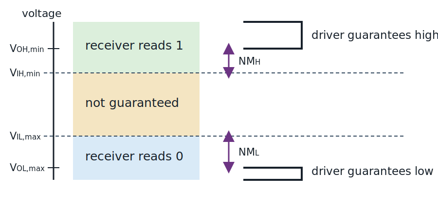

::: {.callout-note title="Chapter maturity — draft"}
This draft develops the complete static logic chain from electrical levels to
bits, codes, Boolean functions, transistor gates, and interface decisions. Its
calculations use manufacturer specifications and illustrative examples; Lab L09
is intended to supply the aligned physical observations. Timing, state, and HDL
evidence belong to later chapters. See the
[reading roadmap](../roadmap.qmd) for the meaning of status levels.
:::

::: {.callout-warning title="Safety boundary for this chapter"}
The interface examples assume current-limited, extra-low-voltage teaching
hardware. Reading this chapter does not authorize work on mains, high-energy
batteries, exposed high voltage, or safety-critical controls. De-energize a
circuit before changing connections, use approved ESD handling, and follow the
bench boundary established in [F01](../01-foundations/f01-safe-practice.qmd).
:::

## Central question

> How can continuous, imperfect voltages carry exact-looking symbols such as
> `0`, `1`, `0x3A`, and `true`?

A voltmeter connected to a digital output reports a voltage relative to a
reference node, not a bit. A receiver creates a discrete **logic level** by
mapping one permitted voltage range to 0 and another to 1; between them, its
ordinary input specification guarantees neither result. This bounded agreement,
in which many physical states may represent one discrete value, is the
**digital abstraction** [@harris2021digital].

A nominal 5 V output connected to an input immediately raises several questions
that cannot be answered before the relevant datasheets are known:

- Is 2.8 V necessarily a valid high?
- Does 0 V always mean logic 0?
- Does an output that stops actively driving mean that the wire carries logic 1?
- Can the bit pattern `1111 1111` mean 255, -1, a character fragment, or a set of
  eight flags?

Every answer depends on a contract. The first three depend on electrical
thresholds, loading, power state, and signal polarity. The last depends on the
chosen code. This chapter develops both contracts and then joins them.

```{mermaid}
%%| label: fig-d01-representations
%%| fig-cap: "One digital signal described in several languages. The arrows mean 'is interpreted or transformed as,' not that one description creates the others. Evidence must check the physical, encoding, and functional contracts separately."
%%| fig-alt: "A compact top-to-bottom diagram maps transistor paths and terminal voltage through a threshold and polarity contract to a logic bit and ordered vector. The vector branches to meaning under a code contract and to a Boolean transformation that produces an output bit."
%%| fig-width: 5.4
flowchart TB
  P["transistor paths and terminal voltage"]
  B["logic bit: 0 or 1"]
  W["ordered bit vector"]
  M["meaning under a code contract"]
  F["Boolean transformation under a requirement"]
  O["output bit"]
  P -->|threshold and polarity contract| B
  B --> W
  W --> M
  W --> F
  F --> O
```

The relationships in @fig-d01-representations require explicit contracts. A
voltage does not reveal whether a signal is active-high or active-low. A bit
pattern does not carry its own signedness or scale. A truth table does not prove
that a physical gate meets its voltage and timing requirements.

## Learning outcomes

After completing this chapter, with transistor switching from
[A02](../02-analog/a02-transistors.qmd) and algebra from
[M01](../appendices/m01-algebra-units-complex.qmd), you should be able to:

- convert bounded-width values among base-2, base-16, unsigned, signed, and
  explicitly scaled interpretations;
- explain why a stored pattern needs a declared width, numerical or symbolic
  meaning, scale, and field layout;
- translate a small logic requirement into an expression and a complete table
  of input and output values, then check an equivalent expression exhaustively;
- trace MOSFET inverter, NAND, and NOR paths, then explain how representative
  bipolar logic realizes the same Boolean functions under a different
  electrical contract;
- calculate worst-case static voltage margins and load limits from compatible
  datasheet conditions rather than nominal supply labels;
- distinguish low and high voltages, logic 0 and 1, assertion polarity,
  disconnected drive, unknown simulation state, and a physically floating
  node; and
- diagnose a static interface failure by testing the supply, thresholds,
  loading, pull network, contention, and power state, while recognizing that a
  static pass does not establish timing correctness.

## Bits and positional notation

A **bit** is a binary digit whose abstract value is either 0 or 1. A physical
memory cell, wire, optical mark, or magnetic region can carry a bit only after a
read rule maps physical states to those two values. A **bit vector** is an ordered
sequence of bits. Order matters: `1000` and `0001` contain the same counts of
zeros and ones but usually represent different values.

### Unsigned binary

For an integer $n\ge1$, an $n$-bit vector has the form
$b_{n-1}b_{n-2}\ldots b_1b_0$, where each $b_i\in\{0,1\}$.
$b_0$ is the **least significant bit (LSB)** because it has the smallest
positional weight. $b_{n-1}$ is the **most significant bit (MSB)**.
The unsigned value is defined as

$$
U(b_{n-1}\ldots b_0)
=
\sum_{i=0}^{n-1} b_i2^i.
$$ {#eq-d01-unsigned}

This is an exact definition, not a circuit approximation. Each term is
dimensionless, so the sum is dimensionless. If the number later represents a
physical quantity, a scale and unit must be supplied separately.

The vector `101101` demonstrates weighted evaluation:

$$
\begin{aligned}
U(101101)
&=1(2^5)+0(2^4)+1(2^3)+1(2^2)+0(2^1)+1(2^0)\\
&=32+8+4+1=45.
\end{aligned}
$$

The two limiting patterns check the definition: all zeros produce 0, while all
ones produce

$$
\sum_{i=0}^{n-1}2^i=2^n-1,
$$

so an unsigned $n$-bit vector represents exactly the integers
$0\le U\le2^n-1$ [@harris2021digital]. Adding one bit doubles the number of
available patterns from $2^n$ to $2^{n+1}$.

Conversion from a nonnegative integer to binary follows repeated division by 2.
The remainder is the next bit from LSB toward MSB. Applying that inverse process
to 45 gives:

| division | quotient | remainder |
|---|---:|---:|
| $45/2$ | 22 | 1 |
| $22/2$ | 11 | 0 |
| $11/2$ | 5 | 1 |
| $5/2$ | 2 | 1 |
| $2/2$ | 1 | 0 |
| $1/2$ | 0 | 1 |

Reading the remainders upward gives `101101`. Substitution into @eq-d01-unsigned
returns 45, confirming that the two representations agree.

### Hexadecimal as compact binary

**Hexadecimal** is base-16 positional notation. Its digits are `0`–`9` followed
by `A`–`F` for values 10–15. Because $16=2^4$, one hexadecimal digit corresponds
exactly to four bits:

| binary | hex | decimal | binary | hex | decimal |
|---:|:---:|---:|---:|:---:|---:|
| `0000` | `0` | 0 | `1000` | `8` | 8 |
| `0001` | `1` | 1 | `1001` | `9` | 9 |
| `0010` | `2` | 2 | `1010` | `A` | 10 |
| `0011` | `3` | 3 | `1011` | `B` | 11 |
| `0100` | `4` | 4 | `1100` | `C` | 12 |
| `0101` | `5` | 5 | `1101` | `D` | 13 |
| `0110` | `6` | 6 | `1110` | `E` | 14 |
| `0111` | `7` | 7 | `1111` | `F` | 15 |

Binary-to-hexadecimal conversion groups digits from the radix point outward in
sets of four. Leading-zero padding completes the leftmost group without changing
an unsigned integer:

$$
\texttt{101101}_2
=\texttt{0010 1101}_2
=\texttt{2D}_{16}
=45_{10}.
$$

Prefixes such as `0b` and `0x` belong to a notation or programming language, not
to the stored bits. This chapter uses `0b101101` and `0x2D` when a prefix avoids
ambiguity.

### Width is part of the value contract

Mathematics lets an integer grow without a fixed bound. Hardware stores a fixed
number of bits. The operation

$$
S=(A+B)\bmod 2^n
$$ {#eq-d01-modular-add}

defines $n$-bit wraparound addition. For 8-bit unsigned values,
$250+10=260$, but $260\bmod256=4$. The stored pattern is `0000 0100`; the
mathematical sum did not become 4. The representation discarded the carry
beyond bit 7.

An **overflow** occurs when the exact mathematical result lies outside the range
of the chosen representation. A carry out of the MSB reveals unsigned addition
overflow, but signed overflow follows a different rule developed next.

## Signed integers and fixed-point scale

### Two's-complement integers

An $n$-bit **two's-complement** code gives the MSB the negative weight
$-2^{n-1}$ and keeps the other binary weights positive:

$$
T(b_{n-1}\ldots b_0)
=
-b_{n-1}2^{n-1}
+\sum_{i=0}^{n-2}b_i2^i.
$$ {#eq-d01-twos-complement}

The range is

$$
-2^{n-1}\le T\le2^{n-1}-1.
$$ {#eq-d01-signed-range}

For eight bits, `1111 1011` has the two's-complement value
$-128+64+32+16+8+2+1=-5$. Under the unsigned definition in @eq-d01-unsigned,
the same pattern has value 251. Bits alone do not choose between those meanings.

A practical way to encode a negative value $-x$, with
$1\le x\le2^{n-1}$, is to compute $2^n-x$ and write that unsigned result in
$n$ bits. For $-5$ in eight bits,
$256-5=251=\texttt{1111 1011}_2$. Equivalently, complement every bit of
`0000 0101` and add one. Both procedures follow from modular arithmetic; neither
changes the definition in @eq-d01-twos-complement [@harris2021digital].

**Sign extension** increases width without changing a two's-complement value by
copying the sign bit into every new leading position. Extending
`1011` gives `1111 1011`; both represent -5. Zero extension would produce
`0000 1011`, which represents +11, so extension is an interpretation-dependent
operation.

Signed overflow occurs when a sum of two values with the same sign produces a
stored result with the opposite sign. In four-bit two's complement,
$7+3=10$ is outside the range -8 to +7. Modular hardware produces `1010`,
which the signed code interprets as -6. There is no carry out, yet signed
overflow occurred. Conversely, `1111` + `0001` produces `0000` with a carry:
$-1+1=0$ is exact and has no signed overflow.

The examples separate carry from signed overflow. For unsigned $n$-bit operands
$A$ and $B$, the exact sum is $Q=A+B$, the stored result is
$R=Q\bmod2^n$, and the carry is

$$
C=\left\lfloor\frac{Q}{2^n}\right\rfloor.
$$ {#eq-d01-carry}

For two's-complement addition, $s_A=a_{n-1}$, $s_B=b_{n-1}$, and
$s_R=r_{n-1}$ denote the operand and result sign bits. The exact signed-overflow
predicate is

$$
OV=\overline{\left(s_A\oplus s_B\right)}\cdot
   \left(s_R\oplus s_A\right).
$$ {#eq-d01-signed-overflow}

The overbar spans the complete first parenthesis: the operands have the same
sign. The second parenthesis is 1 when the result sign differs from the first
operand sign. Carry and signed overflow are therefore independent. The asymmetric
signed range creates a related negation edge case: the minimum value $-2^{n-1}$
has no positive counterpart in the range.
Complementing it and adding one therefore returns the same pattern modulo
$2^n$ while setting an overflow condition.

| Question | Unsigned interpretation | Two's-complement interpretation |
|---|---|---|
| range for $n$ bits | $0$ to $2^n-1$ | $-2^{n-1}$ to $2^{n-1}-1$ |
| extension preserving value | add leading zeros | replicate the sign bit |
| addition overflow test | carry out of MSB | same-sign inputs, opposite-sign result |
| bit pattern for all ones | $2^n-1$ | -1 |

The table separates representation from the bit-level adder. D02 develops the
adder circuit and its overflow outputs.

### Fixed-point values

Signedness changes how the integer pattern is decoded; a fixed-point scale can
then map that decoded integer to a physical or fractional quantity. An integer
code $N$ with a declared number $F$ of fractional bits represents

$$
x=N\,2^{-F}u,
$$ {#eq-d01-fixed-point}

where $u$ is the physical unit, or $u=1$ for a dimensionless value.
This **fixed-point** representation has constant step

$$
\Delta x=2^{-F}u.
$$

A signed 12-bit voltage field with $F=8$ provides a worked example. Its stored
integer `0001 1001 0000` equals 400, so

$$
x=400(2^{-8})~\mathrm V=1.5625~\mathrm V.
$$

The signed range is

$$
-2^{11}2^{-8}~\mathrm V
\le x\le
(2^{11}-1)2^{-8}~\mathrm V,
$$

or -8 V to approximately +7.996 V. These endpoints result from multiplying the
signed-integer limits by $2^{-8}$ V. Increasing $F$ improves resolution but
reduces range when width stays fixed. The step has units of volts, and the
integer code is dimensionless.

If a real value lies between representable levels, the encoder must choose a
rounding rule. Rounding to nearest produces an error no larger than
$\Delta x/2$ for values inside the range; either choice at an exact tie preserves
that bound, though the tie rule affects bias. The bound excludes overflow.
Truncation and directed rounding have different bounds and bias. An out-of-range
result can wrap modulo $2^n$ or
**saturate**, meaning clamp to the nearest endpoint. The data contract must say
which occurs. Later converter and DSP chapters add sampling, analog error, and
algorithmic scaling; those effects are distinct from representation step size.

Names such as `Qm.n` are used inconsistently across tools because some conventions
count the sign bit in `m` and others do not. A portable specification states the
total width, signedness, $F$, unit, rounding rule, and overflow behavior instead
of relying on the short name.

## Codes give bit patterns meaning

Width, signedness, scale, rounding, and overflow together form a numerical code
contract. Other code contracts assign non-numerical meanings to the same kind
of vector.

A **code** is an agreed mapping between symbols or conditions and bit patterns.
Unsigned binary and two's complement are numerical codes. A set of status flags,
a character encoding, and a sensor-state enumeration are also codes. No voltage
or bit pattern contains its interpretation by itself.

### Fields, masks, and bitwise operations

A multi-bit word often contains several **fields**, contiguous or selected bit
positions assigned to separate meanings. The following illustrative 8-bit status
word assigns four such fields:

| bits | name | meaning |
|---:|---|---|
| 7 | `FAULT` | 1 means a diagnosed fault is present |
| 6 | `READY` | 1 means initialization completed |
| 5:4 | `MODE` | `00` idle, `01` acquire, `10` transmit, `11` reserved |
| 3:0 | `COUNT` | unsigned event count from 0 to 15 |

A **mask** is a bit pattern whose ones select positions. The Boolean operations
used here act on one bit at a time: AND produces 1 only from `1 AND 1`; OR
produces 1 when either bit is 1; XOR produces 1 when the bits differ; and NOT
complements one bit. Bitwise AND clears all
unselected bits; bitwise OR sets selected bits; XOR toggles selected bits; NOT
complements every bit inside the declared width.

For status `0b1101 0110`:

$$
\begin{aligned}
\text{MODE field}
&=(\texttt{1101 0110}\mathbin{\&}\texttt{0011 0000})\mathbin{\gg}4\\
&=\texttt{0000 0010},
\end{aligned}
$$

so the mode code is `10`, transmit. Here `&` denotes bitwise AND and `>>4`
shifts the selected bits four positions toward the LSB. A **logical operation**
acts on truth values; a **bitwise operation** applies the corresponding operation
independently at each bit position. Programming-language type conversions and
shift edge cases belong to E01; this definition assumes an exact fixed-width
bit vector. For an unsigned vector $U$ and $0\le k<n$, a fixed-width logical
left shift represents $(U2^k)\bmod2^n$, while a logical right shift represents
$\lfloor U/2^k\rfloor$. An arithmetic right shift replicates the sign bit.
Languages differ on signed shifts, so E01 states the C rules separately.

### Character encoding

Fields partition one word into regions with separate meanings; character
encodings instead map numeric code values into a text system. Text demonstrates
why “one character equals one byte” is not a general rule. The
Unicode Standard assigns abstract characters to numerical **code points**, then
encoding forms map those code points to code units. UTF-8 uses one to four 8-bit
code units and preserves the single-byte values `0x00`–`0x7F` for the
corresponding ASCII-range code points [@unicode2025standard17].

For example, the character `A` has code point U+0041 and UTF-8 byte `0x41`.
The euro sign has code point U+20AC and UTF-8 bytes `E2 82 AC`. Counting bytes,
code points, user-perceived characters, and display glyphs are therefore
different operations. Byte order in memory and C string processing are developed
in E01.

### Error-detecting and non-positional codes

A code may also reserve structure so that some received patterns are invalid.
Not every useful code is a binary number. A **one-hot code** assigns one bit to
each state and requires exactly one bit to be 1. Four states then use `0001`,
`0010`, `0100`, and `1000`. Patterns such as `0000` and `0011` are invalid and
can reveal some faults.

An **even-parity bit** is chosen so the total number of ones in the transmitted
word is even. XOR computes parity because it is 1 when an odd number of its
inputs are 1. A receiver that recomputes parity detects every odd number of bit
flips, including any single-bit error, but misses every even number of flips.
Parity detection therefore does not correct the data and does not prove that a
word is intact. More powerful codes belong with communication and storage
systems.

## Boolean functions and truth tables

Codes assign meaning to stored vectors. Boolean functions answer the next
question: how does hardware transform their individual bits?

**Boolean algebra** operates on variables whose values are 0 and 1. A
**Boolean function** maps a finite set of input bits to an output bit. Shannon's
switching-circuit analysis established the direct use of Boolean algebra for
relay and switching networks [@shannon1938relay].

This chapter uses an overbar for NOT, juxtaposition or $\cdot$ for AND, $+$
for OR, and $\oplus$ for XOR. The overbar applies to *every symbol physically
under it and no others*. Thus $\overline{A\cdot B}=\lnot(A\mathbin{\mathrm{AND}}B)$,
whereas $\overline{A}\cdot B=(\lnot A)\mathbin{\mathrm{AND}}B$.
Parentheses make the scope explicit in plain text. NOT binds first, then AND,
then OR; parentheses override that precedence. Conventions for XOR mixed with
other operators vary, so this book parenthesizes every such expression. These
are Boolean operators, not ordinary integer arithmetic. The truth tables for the principal one- and
two-input operations are:

| $A$ | $B$ | $\overline{A}$ | $A\cdot B$ | $A+B$ | $A\oplus B$ |
|---:|---:|---:|---:|---:|---:|
| 0 | 0 | 1 | 0 | 0 | 0 |
| 0 | 1 | 1 | 0 | 1 | 1 |
| 1 | 0 | 0 | 0 | 1 | 1 |
| 1 | 1 | 0 | 1 | 1 | 0 |

NAND and NOR complement the complete AND and OR expressions:

| $A$ | $B$ | NAND: $\overline{A\cdot B}$ | NOR: $\overline{A+B}$ |
|---:|---:|---:|---:|
| 0 | 0 | 1 | 1 |
| 0 | 1 | 1 | 0 |
| 1 | 0 | 1 | 0 |
| 1 | 1 | 0 | 0 |

A **truth table** lists a Boolean function for every possible input
combination. With $m$ input bits, a complete table contains $2^m$ rows. A truth
table is an exact functional specification only for the variables and states it
lists. It says nothing about delay, voltage, startup, or power-off behavior.

### Requirement, expression, and exhaustive check

A cooling request $Y$ provides a compact example. It must assert when the
system is enabled $E$ and either the high-temperature flag $H$ or manual-test
flag $T$ is true:

$$
Y=E(H+T).
$$ {#eq-d01-cooling-logic}

The limiting cases provide an immediate check: if $E=0$, $Y$ remains 0; if
$E=1$, $Y$ follows $H+T$. The truth table confirms both:

| $E$ | $H$ | $T$ | $H+T$ | $Y=E(H+T)$ |
|---:|---:|---:|---:|---:|
| 0 | 0 | 0 | 0 | 0 |
| 0 | 0 | 1 | 1 | 0 |
| 0 | 1 | 0 | 1 | 0 |
| 0 | 1 | 1 | 1 | 0 |
| 1 | 0 | 0 | 0 | 0 |
| 1 | 0 | 1 | 1 | 1 |
| 1 | 1 | 0 | 1 | 1 |
| 1 | 1 | 1 | 1 | 1 |

The following short Python program enumerates all rows. It is executable
arithmetic on Boolean values, not a transistor or timing simulation. The
expected output below matches all eight truth-table rows.

```python
for enable in (0, 1):
    for hot in (0, 1):
        for test in (0, 1):
            request = enable & (hot | test)
            print(enable, hot, test, request)
```

Expected output:

```text
0 0 0 0
0 0 1 0
0 1 0 0
0 1 1 0
1 0 0 0
1 0 1 1
1 1 0 1
1 1 1 1
```

Exhaustive evaluation proves equality for this finite Boolean description. It
does not prove that a gate meets an electrical interface or that a changing
input cannot produce a transient output.

### Boolean laws

Exhaustive tables establish equality directly, while Boolean identities compress
the same row-by-row reasoning. The following laws support direct simplification:

| law | identity |
|---|---|
| identity | $A+0=A$, $A\cdot1=A$ |
| domination | $A+1=1$, $A\cdot0=0$ |
| idempotence | $A+A=A$, $A\cdot A=A$ |
| complement | $A+\overline{A}=1$, $A\cdot\overline{A}=0$ |
| commutative | $A+B=B+A$, $AB=BA$ |
| associative | $A+(B+C)=(A+B)+C$, $A(BC)=(AB)C$ |
| distributive | $A(B+C)=AB+AC$, $A+BC=(A+B)(A+C)$ |
| De Morgan | $\overline{A\cdot B}=\overline{A}+\overline{B}$; $\overline{A+B}=\overline{A}\cdot\overline{B}$ |

Each identity can be proven by comparing both sides for all input combinations.
For example, $\overline{A\cdot B}$ is 0 only when both $A$ and $B$ are 1.
$\overline{A}+\overline{B}$ is also 0 only in that row, so the functions are
equal. D02 develops systematic canonical forms, minimization, and larger
combinational structures.

## Transistor circuits realize Boolean gates

The Boolean function does not prescribe a device technology. MOSFETs, bipolar
transistors, diodes, and resistors can realize the same truth table while
presenting different input currents, output structures, voltage limits, power,
and dynamic behavior. D01 develops representative static paths so that the
family-dependent electrical contract has a physical cause. A02 owns the device
physics and transistor sizing; A07 owns integrated implementation details.

### Complementary MOS inverter, NAND, and NOR

A logic symbol hides a transistor network. **Complementary
metal--oxide--semiconductor (CMOS) logic** uses p-channel and n-channel MOSFETs
as complementary switches. Static CMOS uses a pMOS **pull-up network** to
connect the output toward $V_{DD}$ and an nMOS **pull-down network** to connect
it toward $V_{SS}$. The networks are arranged so that, for each valid steady
input combination, one establishes the intended output rail while the other is
off [@baker2019cmos; @harris2021digital].

In @fig-d01-cmos-logic, following the paths from output $Y$ toward both rails
reveals one device in each inverter path. The NAND instead has parallel pMOS
pull-up paths and series nMOS pull-down devices.

{#fig-d01-cmos-logic fig-alt="Panel a shows a CMOS inverter with a pMOS transistor from V DD to output Y and an nMOS transistor from Y to ground, both gates driven by A. Panel b shows a two-input CMOS NAND: two pMOS transistors in parallel connect V DD to Y, and two nMOS transistors in series connect Y to ground; inputs A and B each drive one pMOS and one nMOS." width="96%"}

For the inverter, a low input turns the nMOS off and the pMOS on, so the output
moves high. A high input turns the pMOS off and the nMOS on, so the output moves
low. For the NAND, both $A$ and $B$ must be high before the series nMOS path
conducts from $Y$ to $V_{SS}$. If either input is low, its pMOS device supplies
a pull-up path. The resulting function is
$Y=\overline{A\cdot B}=\lnot(A\mathbin{\mathrm{AND}}B)$.

The same dual-network rule produces a CMOS NOR gate. Parallel nMOS devices make
the pull-down conduct when *either* input is high. Series pMOS devices leave a
complete pull-up path only when *both* inputs are low. The table keeps the MOS
examples synchronized with their Boolean functions:

| CMOS gate | pMOS pull-up conducts when | nMOS pull-down conducts when | output |
|---|---|---|---|
| inverter | $A=0$ | $A=1$ | $Y=\overline{A}$ |
| NAND | $A=0$ or $B=0$ | $A=1$ and $B=1$ | $Y=\overline{A\cdot B}$ |
| NOR | $A=0$ and $B=0$ | $A=1$ or $B=1$ | $Y=\overline{A+B}$ |

Each row is a first-order static description, not an ideal switch hidden behind
a gate symbol. During a finite input transition, both networks may conduct, and
the output capacitance charges or discharges through finite channel and
interconnect resistance. Leakage, process variation, supply variation,
temperature, and loading further shift the terminal behavior. A qualified
electrical library bounds those effects before a design replaces the transistor
network by its Boolean gate symbol. A07 develops the inverter transfer and
integrated-circuit effects; D03 develops the timing contract.

### Bipolar resistor-transistor gates

**Resistor--transistor logic (RTL)** uses resistors to establish input or output
currents and bipolar junction transistors as switching elements. Its
collector-resistor output extends the low-side BJT switch from A02 into the
inverter and NOR current paths shown in @fig-d01-bipolar-logic.

{#fig-d01-bipolar-logic fig-alt="Panel a shows an RTL inverter: V CC feeds output Y through collector resistor R C, NPN transistor Q1 pulls Y to ground, and input A drives its base through R B. Panel b shows an RTL NOR: V CC feeds Y through R C, and either of two NPN transistors can pull Y to ground; A and B drive their bases through separate resistors." width="96%"}

In the inverter, a low input supplies insufficient base current, so $Q_1$ is
off and $R_C$ pulls $Y$ high. A high input supplies base current through $R_B$,
so $Q_1$ conducts and pulls $Y$ low. In the NOR gate, either high input turns on
one pull-down transistor. The output is high only when both transistors are off,
so $Y=\overline{A+B}$. The collector resistor draws current whenever the output
is low, and each asserted input requires base current. Output level, fanout,
static power, and release time therefore depend on the resistor values and
loads. This representative topology teaches the mechanism; it is not a
qualified modern interface or a complete discrete-gate design.



### TTL and other logic families

**Transistor--transistor logic (TTL)** is a specific bipolar integrated-circuit
family, not a generic name for every logic gate made from transistors. In a
representative classic NAND, a multi-emitter or equivalent coupled input stage
feeds intermediate gain, phase splitting, and a bipolar output stage. Any low
input suppresses the pull-down command and leaves the output high, whereas
all-high inputs activate the pull-down. The function remains
$Y=\overline{A\cdot B}$ under a terminal contract unlike CMOS
[@sedra2020microelectronic; @harris2021digital].

The SN7400 is an authentic TTL example rather than a generic template. Its
datasheet identifies BJT technology, TTL input levels, a push-pull output, a
4.75--5.25 V recommended supply range for the commercial SN7400, and unequal
source and sink current capabilities [@ti2017sn7400]. Those statements belong
to that named device and conditions. They do not automatically apply to LS,
S, HCT, or another family. In particular, *TTL-compatible inputs* describe a
voltage contract and do not prove that the internal circuit uses TTL.

| family | representative input decision | representative primitive/output | interface consequence |
|---|---|---|---|
| RTL | base current through resistors | inverter or NOR with resistor pull-up | input current and high level depend strongly on loading |
| DTL | diode steering followed by BJT gain | NAND with resistor pull-up | diode drops and BJT current define the decision |
| TTL | bipolar coupled-input and gain stages | NAND; push-pull or open-collector variants | input currents and source/sink drive are asymmetric |
| ECL | differential current steering | complementary buffered outputs | small non-rail swing and continuous bias require a distinct contract |
| CMOS | complementary pMOS/nMOS networks | inverter, NAND, NOR, and push-pull output | small DC input current, but leakage, capacitance, switching current, and clamps remain |

The rows are representative rather than universal family specifications. DTL
means **diode--transistor logic**; ECL means **emitter-coupled logic**. These
decision mechanisms explain why a truth table can stay fixed while thresholds,
currents, output structures, and power change. Exact design still begins with
the named part's datasheet, not this family map.

The family mechanisms therefore lead to a more precise interface question:
which voltages and currents does a particular driver guarantee, and which ones
will its receiver accept? The answer is an electrical contract rather than a
family label.

## Electrical levels form a driver–receiver contract

An electrical high is not one exact voltage. A driver promises output ranges
under stated loads, and a receiver promises interpretations for input ranges.
Unless an interface standard states otherwise, every voltage below is relative
to the shared reference node:

- $V_{OL,\max}$ is the largest output-low voltage the driver guarantees under
  the specified low-state load.
- $V_{OH,\min}$ is the smallest output-high voltage the driver guarantees under
  the specified high-state load.
- $V_{IL,\max}$ is the largest input voltage the receiver guarantees to
  interpret as low.
- $V_{IH,\min}$ is the smallest input voltage the receiver guarantees to
  interpret as high.

The interval $V_{IL,\max}<V_I<V_{IH,\min}$ is the **indeterminate input
range**: the datasheet makes no ordinary low/high interpretation guarantee
there. It is not a third Boolean value.

The voltage contract in @fig-d01-level-contract shows the ordering required for
a compatible interface. Its two gaps separate the worst allowed driver outputs
from the corresponding receiver thresholds.

{#fig-d01-level-contract fig-alt="A vertical voltage scale shows guaranteed driver-low voltage below V OL max, receiver-low range below V IL max, an indeterminate input region between V IL max and V IH min, receiver-high range above V IH min, and guaranteed driver-high voltage above V OH min. Arrows show low and high static noise margins." width="92%"}

The **static low noise margin** and **static high noise margin** are defined by

$$
NM_L=V_{IL,\max}^{(R)}-V_{OL,\max}^{(D)},
\qquad
NM_H=V_{OH,\min}^{(D)}-V_{IH,\min}^{(R)}.
$$ {#eq-d01-noise-margins}

Superscripts $(D)$ and $(R)$ identify driver and receiver. Positive margins are
necessary for static voltage compatibility. Zero margin provides no allowance
for disturbance. A negative margin means the driver's guaranteed output range
is not contained in the receiver's guaranteed valid-input range at that corner,
so compatibility is not established. These margins do not cover crosstalk,
ground shift, ringing, measurement uncertainty, or a signal that is sampled
before it settles.

### Worked interface: one SN74HC04 gate drives others

This worked interface uses a Texas Instruments SN74HC04 at $V_{CC}=4.5$ V over
the specified $-40~^\circ$C to $85~^\circ$C range. Its datasheet specifies
$V_{IH,\min}=3.15$ V and $V_{IL,\max}=1.35$ V. At
$I_{OH}=-4$ mA it guarantees $V_{OH,\min}=3.84$ V; at $I_{OL}=4$ mA it
guarantees $V_{OL,\max}=0.33$ V. The negative $I_{OH}$ sign follows the
datasheet convention for current leaving the output [@ti2021sn74hc04].

Before calculating, which margin should be smaller, and could either one be
negative? The output limits near the rails and the input thresholds at 0.3 and
0.7 of the supply suggest positive margins on the order of 1 V. Substitution
gives

$$
\begin{aligned}
NM_L&=1.35~\mathrm V-0.33~\mathrm V=1.02~\mathrm V,\\
NM_H&=3.84~\mathrm V-3.15~\mathrm V=0.69~\mathrm V.
\end{aligned}
$$

Both results have units of volts and are positive. The high margin is smaller,
so high-state disturbance is the tighter static-voltage screen at the stated
4 mA load. This is a datasheet-based bound, not a measurement of a particular
device.

The same datasheet guarantees $V_{OH}\ge4.4$ V and $V_{OL}\le0.1$ V at the
much lighter $\lvert I_O\rvert=20~\mu$A conditions. Combining either lightly
loaded output guarantee with a 4 mA load would mix incompatible test conditions.
The load condition is part of the number.

### Current loading and fanout

**DC fanout** is the number of receiver inputs that one output can drive while
all current and voltage limits remain satisfied. Here $I_{IH,\max}$ and
$I_{IL,\max}$ denote the magnitudes of one receiver's high- and low-state
currents. The quantities $I_{OH,\mathrm{guar}}$ and $I_{OL,\mathrm{guar}}$
denote output-current magnitudes for which the required $V_{OH}$ and $V_{OL}$
are guaranteed, not absolute-maximum current ratings.
A conservative current screen is

$$
N_{\max}
\le
\min\left(
\left\lfloor\frac{I_{OH,\mathrm{guar}}}{|I_{IH,\max}|}\right\rfloor,
\left\lfloor\frac{I_{OL,\mathrm{guar}}}{|I_{IL,\max}|}\right\rfloor
\right),
$$ {#eq-d01-fanout}

provided all currents use compatible supply, voltage, and temperature
conditions. The chosen integer must also meet the $V_{OH}$ and $V_{OL}$
guarantees. Input capacitance and wiring can impose a tighter dynamic fanout
than the DC current screen.

The SN74HC04 specifies input leakage up to $\pm1~\mu$A at $V_{CC}=6$ V,
while the 4.5 V output levels above are specified at 4 mA. The quotient suggests
thousands of inputs, but that is not a useful practical fanout claim: the
conditions differ, package supply current has limits, and total capacitance
would slow and distort the edge. A defensible interface checks every relevant
static and dynamic condition instead of reporting the largest quotient.

### Compatibility also includes stress and power state

The family comparison above explains why labels such as “CMOS,” “TTL
compatible,” “3.3 V,” and “5 V” cannot establish an interface. Compatibility
follows from the two exact datasheets at the required operating corner; the
SN74HC04, for example, specifies input thresholds separately at each listed
supply voltage [@ti2021sn74hc04]. Stress limits and power states add conditions
that threshold and output-level checks alone do not cover.

A receiver's absolute-maximum input voltage is a stress limit, not a logic
threshold or recommended operating point; exceeding it may damage the device
[@ti2014sn74lvc1g125]. A 5 V output can exceed a 3.3 V
receiver's allowed input voltage even if the receiver happens to read it as
high. An unpowered receiver may conduct through an input protection structure,
raise its supply rail, and partially power internal circuitry. A level-shifting
claim therefore includes the powered and unpowered states, source impedance,
clamp current, rail sink capability, and return path.

## Signal polarity, high impedance, and shared nodes

Voltage margins establish whether a driven low or high can cross a receiver's
threshold. They do not yet say what that level means, who is driving the node,
or what happens when a driver releases it. Polarity and output structure supply
those missing parts of the contract.

### Active-low signals

An **active-low signal** asserts its named function when its logic value is 0.
An overbar over an *expression* is the Boolean NOT operator. An overbar over a
complete *signal name* declares asserted-low polarity. Thus
$Y=\overline{A\cdot B}$ computes a complement, whereas
$\overline{\mathrm{RESET}}$ names a wire whose low state asserts reset. In
plain-text identifiers, this chapter writes that wire as `RESET_n`; the `_n`
suffix is a polarity convention, not a second negation operator.
The electrical level and functional assertion must remain separate:

| electrical level | logic value | `RESET_n` function |
|---|---:|---|
| low | 0 | reset asserted |
| high | 1 | reset released |

Calling the low level “off” would invert the intended meaning. A schematic,
equation, firmware field, and test procedure should use the same polarity name.
Once polarity fixes the meaning of each driven level, the output structure
determines whether the source drives that level or releases the node.

### Push-pull and three-state outputs

A **push-pull output** actively drives both high and low through separate output
devices. Always-enabled push-pull outputs must not be tied together. Push-pull
stages that also provide a three-state disable may share a node only when
break-before-make control guarantees that at most one is enabled
[@ti2014sn74lvc1g125]. If one drives high while the other
drives low, **contention** creates a low-impedance current path from one supply
through both outputs to the return. The node voltage may sit in an indeterminate
range while the devices exceed current or thermal limits.

A **three-state output** adds a high-impedance drive state, written `Z`, in
addition to driving 0 and driving 1. High impedance means the output intentionally
supplies little current; it is not a third logic value on the wire. Another
enabled driver or a pull resistor determines the node. If no element establishes
a level, the node is **floating** and its voltage depends on stored charge,
leakage, coupling, and measurement loading.

Simulation notation commonly uses `X` for a logic value that is unknown,
conflicting, or not yet determined, and `Z` for high-impedance drive. `X` is an
information state in the simulation, not a special physical voltage. A physical
voltage in the receiver's indeterminate band may be reported as `X` by a digital
test model, but the ordinary static specification guarantees neither result
[@harris2021digital]. A slow or floating CMOS input can also increase supply
current or respond to coupled noise; unused inputs therefore require a defined
level [@ti2021sn74hc04].
The SN74LVC1G125 is one documented example of a buffer with an active-low output
enable and a three-state output [@ti2014sn74lvc1g125].

### Open-drain nodes and pull resistors

An **open-drain output** can actively pull a node low but cannot drive it high.
An open-collector BJT output has the same interface role. A pull-up resistor and
the receiving loads establish the released high state. Multiple open-drain
outputs may share a node because any one may assert the active-low state without
fighting another high-side transistor.

The two states are visible in @fig-d01-open-drain. When either MOSFET is on,
current flows from $V_{DD}$ through $R_{PU}$ and the transistor to the return.
When both are off, the pull-up supplies leakage currents and charges the node
capacitance.

Positive-true controls $R_1$ and $R_2$ turn on the two pull-down devices, while
$X$ denotes the node's ordinary voltage-logic value. In the ideal static model,

$$
X=\overline{R_1+R_2}.
$$

If the node is named $\overline{\mathrm{REQ}}$, the positive-true function is
$\mathrm{REQ}=R_1+R_2$: either requester asserts the shared function. Stating
the node polarity before calling the connection “wired-AND” or “wired-OR”
avoids an otherwise common ambiguity.

{#fig-d01-open-drain fig-alt="A pull-up resistor connects V DD to active-low shared node REQ. Two n-channel MOSFET drains and a receiver input connect to the node. Each MOSFET source returns to ground and has a separate request control. Pull-up current flows downward when either transistor turns on." width="78%"}

$V_{L,\max}\le V_{IL,\max}$ is the design's maximum allowed low-node voltage,
and the enabled sink guarantees at least $I_{\mathrm{sink},\max}$ while the node
remains at or below $V_{L,\max}$.
Neglecting leakage into the low node only when it is small relative to $I_L$,

$$
I_L\approx\frac{V_{DD}-V_{DS,\mathrm{on}}}{R_{PU}}.
$$ {#eq-d01-pull-low}

A conservative lower bound follows from that guaranteed low-state operating
point:

$$
R_{PU}
\ge
\frac{V_{DD,\max}-V_{L,\max}}{I_{\mathrm{sink},\max}}.
$$ {#eq-d01-pull-lower}

Here $I_{\mathrm{sink},\max}$ names the stated guaranteed operating point, not
an absolute current rating. A separate path-current condition keeps the worst
possible pull-up current below the allowed $I_{\mathrm{path},\max}$:

$$
R_{PU}\ge\frac{V_{DD,\max}}{I_{\mathrm{path},\max}}.
$$ {#eq-d01-pull-current}

In the released state, $I_{\mathrm{leak},\max}$ denotes the total worst-case
current leaving the node through all receivers, disabled drivers, and board
paths. The resulting high-state bound is

$$
V_H\ge V_{DD,\min}-I_{\mathrm{leak},\max}R_{PU}.
$$ {#eq-d01-pull-high}

Requiring $V_H\ge V_{IH,\min}$ gives

$$
R_{PU}
\le
\frac{V_{DD,\min}-V_{IH,\min}}{I_{\mathrm{leak},\max}}.
$$ {#eq-d01-pull-upper}

The design has a feasible static interval only when the lower bound does not
exceed the upper bound. A stronger pull-up means smaller resistance, more sink
current, and a faster rising edge. A weaker pull-up saves low-state current but
leakage produces more voltage drop and the node rises more slowly.

For a first-order lumped capacitance $C_N$, the released node rises from 0 V as

$$
v_N(t)=V_{DD}\left(1-e^{-t/(R_{PU}C_N)}\right),
$$ {#eq-d01-pull-rise}

when leakage is set to zero, the pull-up is linear, and the capacitance is
constant. Solving for the time to reach $V_{IH,\min}$ gives

$$
t_{IH}
=
-R_{PU}C_N
\ln\left(1-\frac{V_{IH,\min}}{V_{DD}}\right).
$$ {#eq-d01-rise-time}

The logarithm is negative because $0<V_{IH,\min}<V_{DD}$, so $t_{IH}>0$.
As $R_{PU}\to0$, the idealized rise time tends to zero but low-state current
becomes excessive. As $R_{PU}\to\infty$, static current tends to zero but the
node may never meet the threshold in time. F07 develops RC transients and D03
turns threshold-crossing time into a sampling requirement.

### Worked pull-up interval

An illustrative 3.3 V active-low node has the following conditions:

- $3.1~\mathrm V\le V_{DD}\le3.5~\mathrm V$;
- receiver $V_{IL,\max}=0.8$ V and $V_{IH,\min}=2.0$ V;
- sink capability of 3.0 mA while keeping the node at or below 0.4 V;
- allowed continuous pull-up path current of 3.0 mA;
- total worst-case released-state leakage of 50 µA; and
- lumped node capacitance $C_N=80$ pF.

The values are illustrative, not a device specification. A first estimate puts
the feasible range in the low kilohms: a 1 kΩ pull-up would draw about 3 mA,
while 20 kΩ with 50 µA leakage would lose about 1 V.

The low-voltage operating-point screen gives

$$
R_{PU}\ge\frac{3.5-0.4}{3.0~\mathrm{mA}}
=1.03~\mathrm{k}\Omega,
$$

This bound covers the sink's guaranteed low-voltage operating point, but the
complete pull-up path also has its own current limit.

The independent path-current screen is tighter:

$$
R_{PU}\ge\frac{3.5~\mathrm V}{3.0~\mathrm{mA}}
=1.17~\mathrm{k}\Omega.
$$

The released-high screen from @eq-d01-pull-upper gives

$$
R_{PU}\le\frac{3.1-2.0}{50~\mu\mathrm A}
=22.0~\mathrm{k}\Omega.
$$

A standard 4.7 kΩ nominal resistor lies inside the static interval before
tolerance is applied. At nominal 3.3 V and 80 pF, the nominal RC-only
calculation sets leakage to zero. The idealized time to 2.0 V is

$$
t_{IH}
=-(4.7~\mathrm{k}\Omega)(80~\mathrm{pF})
\ln\left(1-\frac{2.0}{3.3}\right)
\approx350~\mathrm{ns}.
$$

The units reduce to $\Omega\mathrm F=\mathrm s$. This nominal timing estimate
does not yet guarantee a deadline. If the full adverse 50 µA is treated as a
constant sink, the asymptote becomes
$3.3~\mathrm V-(50~\mu\mathrm A)(4.7~\mathrm{k}\Omega)=3.065$ V, and the
crossing time becomes approximately 397 ns. At the 3.1 V supply corner it is
approximately 450 ns. Final qualification must also include resistor tolerance,
capacitance range, leakage at temperature, threshold guarantee, wiring, and the
receiver's sampling time.

## Static interface diagnosis and bounded decisions

A digital symptom often originates outside the Boolean expression. A truth
table may be correct while the receiver sees an invalid voltage. Diagnosis is
more reliable when the representations remain synchronized through the
following sequence.

1. **Intended code and polarity.** The description records width, field
   meaning, signedness or scale, and whether the signal asserts high or low.
2. **Every driver state.** The analysis includes startup, reset, disabled,
   disconnected, and unpowered states, together with the push-pull,
   three-state, or open-drain output classification.
3. **The complete current path.** The path includes the supply, driver, pull
   elements, receivers, protection structures, return, and instrument.
4. **The electrical contract.** Guaranteed $V_{OH}$, $V_{OL}$, $V_{IH}$,
   $V_{IL}$, leakage, current, and input-voltage limits retain their supply,
   temperature, and load conditions.
5. **Margins and loading.** The calculation combines compatible worst-case
   conditions and accounts for every receiver and the total current.
6. **Discriminating observations.** A missing pull-up, contention, and a wrong
   threshold family can produce similar logic symptoms but different node
   voltages and currents.
7. **Measurement influence.** The result records the reference node, instrument
   loading, bandwidth, and uncertainty. A DMM reading can establish a static
   level under its loading; it cannot qualify a fast edge.
8. **A guarded decision.** A pass requires the loading-corrected uncertainty
   interval to remain inside the valid range with margin.

### Fault patterns

| observation | plausible cause | discriminating check |
|---|---|---|
| node sits near a rail but receiver reports wrong value | polarity or field interpretation is wrong | compare signal name, truth table, and raw voltage |
| node sits between $V_{IL,\max}$ and $V_{IH,\min}$ | overload, contention, weak pull, or incompatible levels | disable drivers separately and measure supply current |
| node becomes valid when probed | floating node or probe-provided capacitance/return | add the specified pull element; compare high-impedance and buffered measurements |
| released open-drain node never reaches high | missing pull-up, excessive leakage, unpowered rail, or pull too weak | measure $V_{DD}$ and node current; substitute a bounded pull-up |
| low state exceeds $V_{IL,\max}$ | pull too strong or sink too weak | calculate pull current and compare with guaranteed sink condition |
| static levels pass but data fail at speed | edge, propagation, ringing, or sampling problem | preserve the static result and continue with the timed test in D03/L09 |

These checks isolate plausible causes, but a diagnosis becomes an acceptance
decision only after the test conditions and guarded limits are explicit.

### Acceptance boundary for a static interface

A defensible static acceptance test names:

- the driver and receiver part numbers and revisions;
- supply ranges, temperature range, and power-sequencing states;
- test points and common reference;
- every DC load and pull-element tolerance;
- required $V_{OH,\min}$, $V_{OL,\max}$, $V_{IH,\min}$, and
  $V_{IL,\max}$;
- the instrument input resistance, probe current, accuracy basis, and
  calibration state; and
- a pass rule that keeps the guarded measured interval inside the valid receiver
  range.

For a required low state, $\hat V_L$ denotes the corrected measured voltage and
$U_L$ the reported expanded-uncertainty interval half-width for a stated
coverage factor and uncertainty basis. [F06](../01-foundations/f06-measurement-uncertainty-debug.qmd)
develops that construction. A conservative pass rule is

$$
\hat V_L+U_L<V_{IL,\max}.
$$

For a required high state, $\hat V_H$ and $U_H$ denote the corrected voltage and
uncertainty half-width on the same basis, giving

$$
\hat V_H-U_H>V_{IH,\min}.
$$

Strict inequalities preserve actual margin. These tests establish static
voltage compatibility only for the declared configuration and conditions. They
do not prove setup/hold timing, immunity to every transient, long-term
reliability, a population-level manufacturer guarantee from a specimen test, or
correct encoding of every possible word.

### Worked synthesis: an active-low fault output

A status-word fault bit and an external alarm output now join the chapter's
encoding, logic, and voltage contracts. Enable $E$ and fault flag $F$ are bits
in the status word, while `ALARM_n` asserts low only when both are 1. Its Boolean
requirement is

$$
\mathrm{ALARM\_n}=\overline{E\cdot F}.
$$

Here `_n` records the output signal's polarity; the overbar on the right-hand
side is the Boolean operation that produces its electrical logic value.

A two-input NAND supplies exactly that active-low function. If a qualified HC
NAND has the same 4.5 V electrical limits used in the inverter example, a loaded
asserted output no higher than 0.33 V gives
$NM_L=1.35-0.33=1.02$ V at the receiving HC input. A deasserted output no lower
than 3.84 V gives $NM_H=3.84-3.15=0.69$ V.

The predicted static observation is therefore low only for status bits
$E=F=1$ and high for the other three rows, with those bounded margins at the
stated load and corner. A different field layout, inverted signal name,
incompatible threshold, or overloaded output would break a different link in
the same result. D02 develops larger logic structures; D03 adds the question of
whether `ALARM_n` becomes valid before it is sampled.

## From voltage contract to digital design

Digital reasoning becomes trustworthy when each layer states its contract:

- transistor paths establish bounded terminal behavior;
- valid voltage ranges represent low and high;
- polarity maps those levels to logic 0 and 1;
- ordered bits form a fixed-width vector;
- a code assigns that vector a number, character, state, or field meaning;
- Boolean functions transform the values; and
- a test checks the same quantities and conditions used by the requirement.

No layer erases the one below it. A correct Boolean expression cannot repair a
negative noise margin. A valid voltage cannot reveal an omitted scale. A
successful static test cannot establish timing. D02 now builds larger
combinational decisions and arithmetic from the functions developed here. D03
adds state, clocks, and timing; E01 makes the bit and code contracts explicit at
the C and hardware-register boundary.

## Exercises

State widths, interpretations, reference nodes, and operating conditions.
Estimate before calculating. Full solutions and assessment variants remain
outside the public book; selected self-checks appear below.

### Quick check

One best answer each; the key follows.

1. The 8-bit pattern `1111 1111` has which inherent meaning?
    a. 255 only
    b. -1 only
    c. a text character only
    d. none until a code and width interpretation are declared
2. A receiver input lies between $V_{IL,\max}$ and $V_{IH,\min}$. The receiver
   is guaranteed to read
    a. 0
    b. 1
    c. neither value by the ordinary input specification
    d. high impedance
3. A three-state output is in `Z`. This means
    a. it drives a third voltage;
    b. it intentionally supplies little current, so another element determines
       the node;
    c. the node must be logic 1;
    d. the node is necessarily damaged.
4. Four-bit two's-complement `1111` represents
    a. 15
    b. -1
    c. -8
    d. 0
5. An open-drain output is off and no pull-up or other driver exists. The node is
    a. guaranteed high;
    b. guaranteed low;
    c. floating;
    d. a valid third Boolean state.
6. Positive $NM_L$ and $NM_H$ prove
    a. complete timing correctness;
    b. static voltage compatibility under the conditions used;
    c. that no transient can cross a threshold;
    d. that any nominally equal supply families interoperate.

*[Key: 1-d, 2-c, 3-b, 4-b, 5-c, 6-b.]*

### Retrieval and explanation

1. Define bit, bit vector, code, Boolean function, and electrical logic level.
   Give one sentence that distinguishes each item from the next.
2. Explain why `0x80` can represent 128, -128, a flag, or part of a UTF-8
   sequence without contradiction.
3. Distinguish an electrical low, logic 0, an asserted active-low signal, `X`,
   `Z`, and a floating node.
4. State the input conditions that make a two-input CMOS NAND output low. Trace
   the conducting path to the lower rail.

### Estimation and conversion

5. Decode `0b11010110` as (a) unsigned and (b) 8-bit two's complement.
   Convert the bit pattern to hexadecimal. *[Self-check: 214, -42, `0xD6`.]*
6. Encode -37 in 8-bit two's complement. Sign-extend it to 16 bits and verify both
   values using @eq-d01-twos-complement.
7. A 16-bit unsigned counter increments at 1 kHz and wraps. Estimate the wrap
   interval before calculating it.
8. A signed 10-bit fixed-point field has $F=6$ and unit amperes. Determine its
   step and endpoint range. Encode -2.25 A.

### Derivation and Boolean reasoning

9. Derive the two's-complement range in @eq-d01-signed-range from the definition
   in @eq-d01-twos-complement.
10. Prove both De Morgan identities with truth tables.
11. A pump command $P$ must assert when enable $E$ is true, the physical
    condition `LEVEL_LOW` is true, and neither fault $F$ nor emergency stop $S$
    is active. Write the Boolean expression and all 16 truth-table rows. Then
    assume `OK` and `LOW` are the only valid physical states. Map the raw logic
    value on an asserted-low sensor net named `LEVEL_OK_n` to the positive-true
    Boolean variable `LEVEL_LOW`. Explain why the raw value equals
    `LEVEL_LOW` under this two-state assumption even though the signal's name
    contains `_n`.
12. Show that $A+AB=A$ by algebra and by exhaustive evaluation. D02 will name
    and generalize this form of simplification.

### Data interpretation

13. A driver guarantees $V_{OH}\ge2.6$ V at $I_{OH}=-8$ mA and
    $V_{OL}\le0.5$ V at $I_{OL}=8$ mA. A receiver guarantees high above 2.0 V
    and low below 0.8 V. Calculate both static margins. State exactly what the
    result does and does not establish.
14. A table lists a typical output-high voltage of 3.28 V at $25~^\circ$C and a
    guaranteed minimum of 2.4 V over temperature at a stated load. Which value
    belongs in a worst-case compatibility calculation, and why?
15. The illustrative open-drain node from the worked example is measured at
    1.92 V while released, with expanded uncertainty $U_H=0.08$ V on the stated
    basis. Apply the chapter's strict guarded decision for
    $V_{IH,\min}=2.0$ V. Does it pass?

### Debugging

16. A 5 V HC-family output drives a 3.3 V input. The logic analyzer decodes
    clean ones. Explain why this observation does not prove electrical
    compatibility. List the datasheet limits and power states required for a
    decision.
17. A push-pull bus draws excess current only when two enables overlap. Predict
    the shared-node voltage and supply-current trend. Propose two measurements
    that distinguish contention from a weak pull-up.
18. A reset input works only while a 10× oscilloscope probe is attached. Give
    two probe-induced mechanisms and design a test that does not treat the
    probe's apparent repair as proof.

### Logic notation and implementation families

19. For $A=1$ and $B=0$, evaluate $\overline{A\cdot B}$,
    $\overline{A}\cdot B$, and $\overline{A+B}$. Rewrite each expression with
    `NOT(...)` so that the scope of every negation is unambiguous.
20. Trace the conducting paths for all four input combinations of (a) the CMOS
    NAND in @fig-d01-cmos-logic and (b) the CMOS NOR topology described in the text.
    For each row, identify the pull-up or pull-down network that determines the
    output.
21. Compare the CMOS NAND in @fig-d01-cmos-logic with the representative RTL
    NOR in @fig-d01-bipolar-logic. Which properties follow from their Boolean
    functions, and which require electrical evidence about thresholds, current,
    delay, and power?
22. A disconnected classic TTL input may appear high. Explain why leaving it
    open is still not a valid design rule. State the datasheet and measurement
    evidence needed to establish a defined input state at the connector or IC
    pin.

### Open design

23. Specify an 8-bit environmental-alarm word containing a signed temperature
    offset, two status flags, and a three-level severity enumeration. Allocate fields;
    state scale, range, reserved patterns, and overflow behavior; and provide
    three test vectors.
24. Design an active-low open-drain alert node shared by four devices. Given
    actual candidate datasheets, derive a pull-resistor interval across supply,
    temperature, leakage, sink, tolerance, and a stated threshold-crossing
    deadline. Define a static acceptance test and identify what L09/D03 must
    still test.
25. For status `0b1011 0101`, design masks and operations that (a) extract bits
    5:4, (b) set bit 6, (c) clear bit 7, and (d) toggle bits 1:0. Report each
    8-bit result.
26. Classify unsigned carry and signed overflow separately for the 8-bit sums
    `0x64 + 0x28` and `0xC8 + 0x64`. Interpret both operands and results under
    each code.
27. Add an even-parity bit to `1011011`. Give one two-bit corruption that the
    parity check misses and explain why no parity result proves the word correct.
28. A driver guarantees the required output levels at 6 mA. Each receiver draws
    at most 20 µA in either state and adds at most 8 pF. The interface permits
    at most 80 pF total load, including 16 pF of wiring. Calculate the DC-current
    and capacitance fanout screens, then choose the bounded fanout. State which
    timing evidence remains missing.

## Connections

Chapter ID: `D01`. Its direct prerequisites in the registry are A02 and M01.

- [A02](../02-analog/a02-transistors.qmd) supplies MOSFET and BJT switching,
  open-drain/open-collector behavior, drive limits, and complete current paths.
  D01 uses those devices in CMOS and representative resistor-transistor gates,
  then abstracts qualified switch behavior into logic levels and values.
- [M01](../appendices/m01-algebra-units-complex.qmd) supplies powers, sums,
  inequalities, and unit discipline. This chapter develops binary and Boolean
  notation from first principles.
- [A07](../02-analog/a07-integrated-circuits.qmd) gives the deeper analog
  inverter transfer, device variation, biasing, and integrated implementation.
  It is the proper destination for detailed TTL transistor design; here TTL is
  used only to connect a Boolean NAND with a distinct terminal contract.
- [D02](d02-combinational-logic.qmd) develops canonical forms, simplification,
  multiplexers, decoders, adders, arithmetic units, delay, glitches, and
  exhaustive combinational verification.
- [D03](d03-state-clock-timing.qmd) adds state, clocks, setup and hold,
  metastability, reset, and timing. [F07](../01-foundations/f07-capacitors-inductors-transients.qmd)
  develops the RC behavior previewed by the pulled-up node.
- [E01](../04-embedded/e01-c-hardware-boundary.qmd) applies integer
  representations, fields, masks, and bit operations to C types and
  memory-mapped hardware.
- [F06](../01-foundations/f06-measurement-uncertainty-debug.qmd) supplies the
  uncertainty and guarded-decision method used by the optional static
  acceptance test.
- **Lab L09** adds measured logic levels, edges, timing, and state under its
  approved L1 safety plan. The [practice and project
  spine](../roadmap.qmd#practice-and-project-spine) identifies its place in the
  course.
- [T01](../appendices/t01-datasheets-standards.qmd) supports the datasheet
  condition and rating distinctions used in interface qualification.

## References

Claims are cited at their point of use. The mathematical and architectural
development follows the canonical digital-design treatment
[@harris2021digital], while the connection between Boolean algebra and switching
circuits rests on Shannon's primary paper [@shannon1938relay]. CMOS conduction
paths and inverter behavior use the established circuit reference
[@baker2019cmos]. Bipolar logic-family context follows the circuit treatment in
[@sedra2020microelectronic], and the classic SN7400 example uses its
manufacturer datasheet [@ti2017sn7400]. Other electrical examples use the
manufacturers' guaranteed conditions for the SN74HC04 and SN74LVC1G125
[@ti2021sn74hc04; @ti2014sn74lvc1g125]. Character terminology and UTF-8 behavior
follow the Unicode Standard [@unicode2025standard17]. The complete
[bibliography](../references.qmd) collects these sources.
