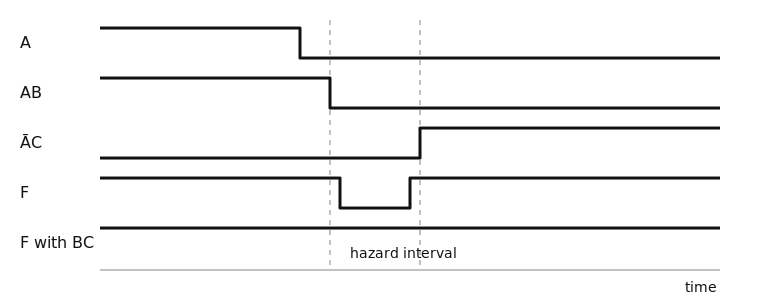

::: {.callout-note title="Chapter maturity — draft"}
This draft develops the complete functional chain from a finite logic requirement
to canonical forms, simplified networks, reusable combinational blocks,
fixed-width arithmetic, path timing, hazard analysis, and exhaustive executable
checks. Manufacturer timing data supports one bounded comparison. The Python
results are executable arithmetic evidence, not HDL simulation or physical
measurement. Lab L09 supplies aligned observations of propagation and glitches;
D04 supplies HDL, synthesis, and implementation verification. The
[reading roadmap](../roadmap.qmd) defines the book's status levels.
:::

::: {.callout-warning title="Safety boundary for this chapter"}
The physical examples assume current-limited, extra-low-voltage teaching
hardware. Reading this chapter does not authorize work on mains, high-energy
batteries, exposed high voltage, or safety-critical controls. De-energize a
circuit before changing connections, avoid floating CMOS inputs, and follow the
bench boundary established in [F01](../01-foundations/f01-safe-practice.qmd).
:::

## Central question

> How can a finite requirement become a logic network that makes the correct
> decision, produces the correct arithmetic result, and settles soon enough for
> its receiver?

A door controller might unlock when a credential is valid and an inhibit input
is clear. An address selects one sensor value from several. An arithmetic unit
adds two words and reports whether the encoded result overflowed. Each output
depends on the inputs presented now, not on an earlier input. A
**combinational circuit** is a logic network whose settled output values are
functions only of its current input values [@harris2021digital]. It contains no
intentional storage state or feedback that preserves history, and each permitted
input vector must lead to one unique settled output vector. A loop of ordinary
gates can store state or oscillate, so “built from gates” does not by itself mean
combinational.

That definition describes settled values, not instantaneous voltage. Physical
gates take time to respond. Two paths can respond at different times and create
a short pulse even when the initial and final truth-table values agree. The
complete contract therefore has three layers:

- the **functional contract** maps every permitted input vector to the required
  output vector;
- the **electrical contract** supplies valid input and output levels, loading,
  power-state behavior, and transition conditions from D01; and
- the **timing contract** states when an output may change and when it must have
  settled after an input change.

The architectural schematic in @fig-d02-contract keeps those layers distinct.
Its arrows mean “constrains and is checked against.” A correct truth table cannot
repair an overloaded output, and a valid static voltage cannot prove that the
result arrived before a deadline.

```{mermaid}
%%| label: fig-d02-contract
%%| fig-cap: "Synchronized descriptions of a combinational circuit. The requirement determines the finite input-output mapping; minimization and hierarchy realize that mapping; physical gates add electrical and timing behavior; verification compares observations with the same functional and timing contracts."
%%| fig-alt: "A vertical flow starts with a finite requirement and complete function table, continues through Boolean expressions and reusable logic blocks to physical gates and interconnect, then reaches output voltage versus time. Verification branches back to compare the realized outputs with the original functional and timing contracts."
%%| fig-width: 5.4
flowchart TB
  R["finite requirement"]
  T["complete input-output mapping"]
  B["Boolean expressions and block interfaces"]
  P["physical gates and interconnect"]
  O["output voltage versus time"]
  V["exhaustive functional and bounded timing checks"]
  R --> T --> B --> P --> O
  T --> V
  O --> V
```

Before deriving a circuit, predict the scaling. If a specification has $m$
independent input bits and $k$ output bits, how many input rows must a complete
table contain? The answer is $2^m$, with $k$ output entries per row. That
exponential growth makes exact enumeration powerful for small blocks and
impractical for a large system. Canonical forms, simplification, hierarchy, and
verification strategy all respond to that one scaling law.

## Learning outcomes

After completing this chapter, with Boolean operations, fixed-width codes, and
electrical logic contracts from [D01](d01-bits-codes-logic.qmd), you should be
able to:

- translate a finite decision requirement into a complete table and into
  expressions constructed systematically from its required-one or required-zero
  rows;
- reduce a small Boolean function algebraically or with a visual adjacency table
  while preserving the behavior required for every specified input;
- interpret both formal symbol families used for logic diagrams, then draw new
  gate schematics consistently with the book's declared convention;
- derive and connect reusable selection, distribution, encoding, comparison, and
  arithmetic blocks from explicit interface contracts;
- distinguish unsigned carry, unsigned borrow, and two's-complement signed
  overflow, then calculate each from operand and result bits;
- calculate a bounded combinational path delay, identify the longest bounded
  input-to-output path, and explain how unequal paths create an unintended pulse;
- check every input vector of a finite reference function and explain why that
  check does not establish electrical or implementation correctness; and
- make a requirements-based choice among direct gates, lookup structure, and
  reusable blocks, with the remaining evidence stated explicitly.

## The finite input-output contract

The function table inherited from D01 is already a complete mathematical
description when it assigns an output to every possible input combination. D02
now asks how to realize that table without accidentally changing its meaning.

For $m\ge 0$ Boolean inputs, the input vector is
$\mathbf{x}=(x_{m-1},\ldots,x_0)\in\{0,1\}^m$. For $k\ge1$ outputs, a
combinational function is the exact mapping

$$
f:\{0,1\}^m\rightarrow\{0,1\}^k.
$$ {#eq-d02-function}

The domain and codomain in @eq-d02-function are finite sets; time and voltage do
not appear in this abstract definition. This $f$ is a completed Boolean
function. A physical realization approximates it only after its inputs meet
their electrical contract and enough time has elapsed for the outputs to settle.

### Complete, incomplete, and don't-care specifications

A **completely specified function** assigns every input vector a required output
value. An **incomplete requirement** instead allows more than one acceptable
completion. Formally, it assigns each permitted input $\mathbf{x}\in P$ a
nonempty set $R(\mathbf{x})\subseteq\{0,1\}^k$ of acceptable outputs. A chosen
implementation $f$ satisfies the requirement when
$f(\mathbf{x})\in R(\mathbf{x})$ for every $\mathbf{x}\in P$. A
**don't-care condition** is a row or output bit for which both 0 and 1 are
acceptable because the environment excludes that case or the output is
irrelevant. The symbol `X` often marks this freedom in a design table. It does
not mean that the physical output may float, nor that a simulator's unknown
value is acceptable. Inputs outside $P$ still need an explicit safe behavior
when the system consequence requires one [@harris2021digital].

| input condition | table entry | design meaning | verification meaning |
|---|:---:|---|---|
| permitted, output required low | `0` | implementation must produce 0 | compare with 0 |
| permitted, output required high | `1` | implementation must produce 1 | compare with 1 |
| prohibited or output irrelevant | `X` | implementation may choose 0 or 1 | mask this output only under the stated condition |
| omitted accidentally | blank | contract is incomplete by error | reject the specification |

: Don't-care freedom is part of the requirement, not an observed third logic value. {#tbl-d02-dont-care}

The distinction affects safety. A binary-coded-decimal decoder may treat input
patterns 10 through 15 as don't-cares only when upstream logic guarantees that
they cannot occur. A broken wire, reset transient, or software fault can violate
that assumption. A safe output for illegal codes must be specified when the
system consequence requires one.

## Logic-diagram symbols and conventions

A Boolean expression states a function, while a **logic diagram** shows gates
and signal connections that realize it. Standards permit more than one
representation; “IEEE” and “IEC” are therefore not mutually exclusive names for
two shapes. This book uses the **distinctive-shape family** documented in IEEE
91/91a for elementary gates: AND, OR, and XOR have different outlines
[@ieee1991logic]. It also introduces the IEC 60617 **rectangular form**, whose
internal qualifying marks identify the function, so learners can interpret
documentation that uses it [@iec60617db; @iec61734].

This book uses *Anglo-Saxon convention* as an informal house label for the
distinctive-shape family; *American* and *Anglo-American* are other teaching
labels a learner may encounter. None is the title of a standard. This chapter
and later book schematics use the distinctive-shape family for elementary gates
unless a figure explicitly compares or reproduces another convention.
Functional blocks such as multiplexers use their labeled tapered or rectangular
block symbols.

The formal comparison in @fig-d02-logic-symbols shows the same six functions in
both families. The symbols differ in shape, not in truth-table meaning.

{#fig-d02-logic-symbols fig-alt="Two rows compare six logic-gate symbols. The upper IEEE distinctive-shape row shows AND, OR, XOR, triangular NOT, NAND, and NOR. The lower IEC row shows the same functions as rectangles with internal qualifying marks. NAND and NOR add an inversion mark to the corresponding AND and OR outputs." width="84%" fig-pos="H"}

| function | IEEE distinctive shape | IEC rectangular qualifier |
|---|---|---|
| AND | flat input side and rounded output side | `&` |
| OR | curved input and pointed curved output | $\ge1$ |
| XOR | OR outline with an extra input-side curve | $=1$ for two inputs |
| NOT | triangle with an output inversion bubble | `1` with output negation mark |
| NAND | AND with an output inversion bubble | `&` with output negation mark |
| NOR | OR with an output inversion bubble | $\ge1$ with output negation mark |

: Equivalent logic functions in the two symbol traditions. Qualifier details and expanded-input functions must follow the applicable standard rather than be inferred from the rectangle alone. {#tbl-d02-symbol-conventions}

An **inversion bubble** is the small circle at a gate terminal that complements
the logic value at that terminal. A bubble at an output turns AND into NAND, OR
into NOR, and XOR into XNOR. A triangle without a bubble is a buffer; the same
triangle with an output bubble is an inverter. Bubbles also express active-low
pins, but the signal name and truth table still determine whether a low level
means assertion [@ieee1991logic; @iec61734].

Logic schematics in this book follow four drawing rules derived from the
standard symbol grammar [@ieee1991logic; @iec61734]:

- signals normally flow left to right, with inputs on the left and outputs on
  the right;
- a filled dot marks an electrical branch where three or more conductors join;
- crossing lines without a dot are not connected, and avoidable crossings are
  removed by placement; and
- one schematic uses one gate-symbol family consistently. The comparison figure
  above is intentionally the exception.

The gate outline identifies a Boolean operation, not a particular transistor
circuit or package. Reference designators, pin numbers, power pins, electrical
family, unused-input treatment, and decoupling still belong in an implementation
schematic. A logic diagram may omit those physical details only when its caption
declares the abstraction [@ieee1991logic; @iec60617db; @iec61734].

## Canonical forms and simplification

A truth table lists behavior row by row. A **canonical form** converts each
selected row into a Boolean term by a mechanical rule, so the expression is
traceable back to the table [@harris2021digital]. Canonical expressions are
usually not the smallest implementation, but they provide a reliable starting
point.

### Minterms and sum of products

For variables $(A,B,C)$, a **literal** is a variable or its complement. A
**minterm** is an AND of all input variables, complemented where the row contains
0 and uncomplemented where it contains 1. It evaluates to 1 for exactly one row.
With $A$ as the most significant index bit, row `101` has index 5 and minterm
$m_5=A\overline{B}C$.

The **canonical sum of products (SOP)** ORs the minterms for every row where the
output is 1. The notation $\Sigma m(\cdots)$ lists their indices. The illustrative
function in @tbl-d02-example-function is high for rows 1, 2, 3, 5, and 7.

| $A$ | $B$ | $C$ | row index | $F$ |
|:---:|:---:|:---:|---:|:---:|
| 0 | 0 | 0 | 0 | 0 |
| 0 | 0 | 1 | 1 | 1 |
| 0 | 1 | 0 | 2 | 1 |
| 0 | 1 | 1 | 3 | 1 |
| 1 | 0 | 0 | 4 | 0 |
| 1 | 0 | 1 | 5 | 1 |
| 1 | 1 | 0 | 6 | 0 |
| 1 | 1 | 1 | 7 | 1 |

: Complete illustrative truth table for $F(A,B,C)=\Sigma m(1,2,3,5,7)$. {#tbl-d02-example-function}

The canonical SOP is therefore

$$
\begin{aligned}
F={}&\overline A\,\overline B C
 +\overline A B\overline C
 +\overline A BC\\
 &+A\overline B C+ABC
 =\Sigma m(1,2,3,5,7).
\end{aligned}
$$ {#eq-d02-canonical-sop}

The equality is exact for Boolean inputs. Each product term is dimensionless and
selects one row; their OR selects the union of those rows.

### Maxterms and product of sums

A **maxterm** is an OR of all input variables that evaluates to 0 for exactly one
row. A variable is uncomplemented where that row contains 0 and complemented
where it contains 1. Row `100` therefore gives
$M_4=\overline A+B+C$. The **canonical product of sums (POS)** ANDs the maxterms
for every row where the output is 0. The same function has

$$
F=(A+B+C)(\overline A+B+C)(\overline A+\overline B+C)
  =\Pi M(0,4,6).
$$ {#eq-d02-canonical-pos}

Substitution of row 4 makes the second factor zero, so the whole product is zero.
Substitution of any required-one row leaves all three factors at one. That check
also catches the common error of complementing a maxterm literal in the minterm
direction.

### Algebraic reduction

Canonical form preserves traceability, but it repeats many literals. Boolean
identities from D01 remove the repetition. The idempotent identity $X=X+X$
allows row 3 to participate in two groups without changing the function.
Grouping the four minterms whose $C=1$ and the adjacent pair for rows 2 and 3
then gives

$$
\begin{aligned}
F
&=C(\overline A\,\overline B+\overline AB
      +A\overline B+AB)
  +\overline AB(\overline C+C)\\
&=C(\overline A+A)(\overline B+B)+\overline AB\\
&=C+\overline AB.
\end{aligned}
$$ {#eq-d02-simplified}

The reduced expression uses three literals instead of fifteen. It predicts a
high output whenever $C=1$, plus the one additional case $A=0,B=1,C=0$.
Those are exactly the five high rows in @tbl-d02-example-function.

### Karnaugh adjacency

A **Karnaugh map** places truth-table cells in Gray-code order, so horizontally
or vertically adjacent cells differ in exactly one input bit. Rectangular groups
of $1,2,4,\ldots$ required-one cells eliminate the variables that change within
the group. Map edges wrap: the leftmost and rightmost columns are adjacent
[@karnaugh1953map; @harris2021digital; @plantz2022computerorganization].

Use this procedure for a conventional sum-of-products reduction:

1. Label the rows and columns in Gray-code order, then copy every required one,
   required zero, and don't-care from the truth table. Write minterm indices in
   the cells while learning; they expose bit-order mistakes.
2. Treat cells as adjacent only when they share an edge and differ in one
   variable. Opposite map edges touch. Diagonal cells do not.
3. Enclose required ones in rectangular groups containing $1,2,4,8,\ldots$
   cells. A group may include don't-cares but never a required zero. Make groups
   as large as the contract permits.
4. Cover every required one. Overlap groups when it enlarges a group, covers an
   otherwise isolated one, or supplies a deliberate consensus implicant.
5. For each group, retain only variables that remain constant. Write an
   uncomplemented literal for a constant 1 and a complemented literal for a
   constant 0. OR the group products.

@fig-d02-kmap-rules makes the geometry explicit. The two separated red regions
in panel (b) are one group because the map is conceptually wrapped into a
cylinder. Panel (c) shows two frequent errors: visual proximity is not
one-bit adjacency, and a conventional implicant group cannot contain three
cells [@karnaugh1953map; @harris2021digital].

{#fig-d02-kmap-rules fig-alt="Three small Karnaugh maps compare a legal four-cell rectangle, a legal four-cell group wrapping between the left and right edges, and illegal diagonal and three-cell groupings." width="96%"}

| $A\backslash BC$ | `00` | `01` | `11` | `10` |
|:---:|:---:|:---:|:---:|:---:|
| 0 | 0 | 1 $(C)$ | 1 $(C,\overline AB)$ | 1 $(\overline AB)$ |
| 1 | 0 | 1 $(C)$ | 1 $(C)$ | 0 |

: Karnaugh arrangement of @tbl-d02-example-function. The four cells in columns `01` and `11` produce $C$; the two cells in the $A=0$ row at `11` and `10` produce $\overline AB$. {#tbl-d02-kmap}

The worked reduction in @fig-d02-kmap-worked makes each elimination visible.
The blue four-cell group covers minterms 1, 3, 5, and 7. Only $C=1$ remains
constant, so the group produces $C$. The red group covers minterms 2 and 3. It
lies entirely in the $A=0$ row and the $B=1$ columns while $C$ changes, so it produces
$\overline A B$. Minterm 3 belongs to both groups; overlap does not duplicate a
truth-table row or change the function. ORing the two products gives the same
$F=C+\overline A B$ obtained algebraically
[@harris2021digital; @plantz2022computerorganization].

{#fig-d02-kmap-worked fig-alt="A Gray-ordered two-row Karnaugh map contains the required values for minterms zero through seven. A blue four-cell group yields C. An overlapping red two-cell group yields not-A B. Explanatory text shows that variables changing inside a group are eliminated." width="100%"}

Each group must contain only required ones and optional don't-cares. Every
required one must belong to at least one group. Overlap is allowed when it
removes a literal or later prevents a hazard. Grouping a zero changes the
function. Grouping an `X` commits the implementation to a value that the original
contract allowed but did not require [@harris2021digital;
@plantz2022computerorganization].

If row 6 (`110`) were an `X` instead of a required zero, the four cells with
$B=1$ could form one group. The reduced expression could then become $F=C+B$.
That implementation would choose $F(110)=1$. The change is valid only because
the revised requirement explicitly permits either value on that row; it would be
an error for @tbl-d02-example-function as written.

Karnaugh maps expose structure well for a few variables. Larger functions use
algorithmic minimization or synthesis tools, but the objective is not universally
“fewest gates.” **Fan-in** is the number of inputs accepted by one gate. Area,
fan-in, delay, power, routing, available cells, testability,
and hazard behavior can favor a logically redundant term. Functional equivalence
is necessary; implementation quality depends on the physical target
[@harris2021digital].

## Selection, decoding, encoding, and comparison

Canonical expressions can realize any finite function directly. Reusable blocks
package recurring structures and make hierarchy visible. The block name never
replaces its interface contract: polarity, enable behavior, invalid inputs, bit
order, electrical family, and timing still need specification.

### Multiplexers select data

A **multiplexer (MUX)** routes one of several data inputs to one output under the
control of select inputs. For a positive-true 2-to-1 multiplexer, select $S=0$
chooses $D_0$ and $S=1$ chooses $D_1$ [@harris2021digital]. Its exact Boolean
function is

$$
Y=\overline S D_0+S D_1.
$$ {#eq-d02-mux2}

@fig-d02-mux-demux-symbols introduces the book's tapered functional-block
symbols. The wide side carries the multiple ports; the narrow side carries the
single port. Numbers beside the wide-side ports bind select values to routes.
This labeled block is a hierarchy symbol, not a new elementary gate. IEC 60617
also defines general multiplexer and demultiplexer symbols, S01626 and S01627;
when reading another drawing, its qualifying marks and port labels govern
[@iec60617db; @ieee1991logic].

{#fig-d02-mux-demux-symbols fig-alt="A tapered multiplexer has D0 and D1 on its wide input side, select S below, and Y on its narrow output side. A reverse-tapered demultiplexer has D on its narrow input side, select S below, and Y0 and Y1 on its wide output side. Positive-true route equations appear below." width="94%"}

When $S=0$, the second product is zero and $Y=D_0$; when $S=1$, the first product
is zero and $Y=D_1$. The equation also reveals two reconvergent paths from $S$,
one through inversion and one direct. Their unequal physical delays can matter
during selection changes [@harris2021digital].

The hierarchical schematic in @fig-d02-mux-tree uses three 2-to-1 multiplexers
arranged in two logic levels to select one of four inputs. $S_0$ selects within
each pair, and $S_1$ selects the pair. Every block is combinational; the cascade
adds path delay.

```{mermaid}
%%| label: fig-d02-mux-tree
%%| fig-cap: "A 4-to-1 multiplexer assembled from three 2-to-1 multiplexers. Select bit 0 chooses within data-input pairs 0/1 and 2/3; select bit 1 chooses which pair result reaches Y."
%%| fig-alt: "Four data inputs enter two first-stage two-to-one multiplexers controlled by S0. Their outputs enter a final two-to-one multiplexer controlled by S1, which drives Y."
%%| fig-width: 5.4
flowchart TB
  D01["D₀, D₁"] --> M0["2:1 MUX<br/>select S₀"]
  D23["D₂, D₃"] --> M1["2:1 MUX<br/>select S₀"]
  M0 --> M2["2:1 MUX<br/>select S₁"]
  M1 --> M2
  M2 --> Y["Y"]
```

A multiplexer can also realize logic. With one variable chosen as $S$, the target
function evaluated at $S=0$ and $S=1$ supplies $D_0$ and $D_1$. This is Shannon
expansion [@shannon1938relay]:

$$
F(S,\mathbf{x})=\overline S F(0,\mathbf{x})+S F(1,\mathbf{x}).
$$ {#eq-d02-shannon-expansion}

The relation follows by cases and is exact. Repeated expansion builds any
Boolean function as a multiplexer tree. It also explains why lookup tables in
programmable logic can represent arbitrary functions of a bounded number of
inputs.

### Decoders and demultiplexers distribute selection

A **decoder** asserts one of $2^n$ outputs for an $n$-bit input code. With
positive-true outputs and enable $E$, a 2-to-4 decoder produces the following
outputs [@harris2021digital]:

$$
\begin{aligned}
Y_0&=E\overline A_1\overline A_0,&
Y_1&=E\overline A_1 A_0,\\
Y_2&=EA_1\overline A_0,&
Y_3&=EA_1A_0.
\end{aligned}
$$ {#eq-d02-decoder}

Exactly one output is high when $E=1$ and both address bits are valid. All
outputs are low when $E=0$. Real parts often use active-low enables or outputs,
so the assertion polarity must be read from the function table rather than
guessed from the block name.

A **demultiplexer** routes one data input to one selected output. A decoder plus
an enable that carries the data can implement this behavior. A decoder used for
address selection instead asserts a **one-hot control**, a vector with exactly
one asserted bit; it does not transport the addressed data itself.
For the 1-to-2 symbol in @fig-d02-mux-demux-symbols,
$Y_0=D\overline S$ and $Y_1=DS$; therefore an unselected output is forced low
rather than left floating [@harris2021digital; @iec60617db].

Large decoders can be built hierarchically. Cascading enable inputs reduces gate
fan-in and permits construction from reusable smaller decoder blocks, but each
added level extends the path and can produce brief multiple or missing
assertions while address bits change. A one-hot requirement at settled inputs
does not prove one-hot behavior during a transition [@harris2021digital].

### Encoders compress asserted inputs

An **encoder** maps one asserted input among many to a binary code. A plain
encoder assumes exactly one input is asserted. If two inputs are high, its
contract is violated and the output can be ambiguous.

A **priority encoder** resolves multiple assertions by assigning a fixed order.
For four positive-true requests $R_3$ through $R_0$, with $R_3$ highest priority,
the outputs may be defined as follows [@harris2021digital]:

| inputs matching | valid $V$ | code $Q_1Q_0$ | selected request |
|---|:---:|:---:|---|
| `1xxx` | 1 | `11` | $R_3$ |
| `01xx` | 1 | `10` | $R_2$ |
| `001x` | 1 | `01` | $R_1$ |
| `0001` | 1 | `00` | $R_0$ |
| `0000` | 0 | `00` | none |

: A complete priority-encoder contract. `x` means the lower-priority input does not affect the selected result in that row pattern. {#tbl-d02-priority}

The valid output is essential because code `00` otherwise cannot distinguish
$R_0$ from no request. Priority is a policy decision, not a mathematical
necessity. A fixed-priority arbiter can starve a continuously lower-priority
request; adding fair history would require state and therefore belongs outside a
pure combinational encoder [@harris2021digital].

### Comparators decide order

An **equality comparator** reports whether corresponding bits match. For two
$n$-bit vectors $A$ and $B$ [@harris2021digital],

$$
A=B\quad\Longleftrightarrow\quad
E=\prod_{i=0}^{n-1}\overline{A_i\oplus B_i}=1.
$$ {#eq-d02-equality}

The product is Boolean AND. Every XNOR factor must be one, so one mismatched bit
forces $E=0$.

Unsigned magnitude comparison starts at the most significant bit because the
first differing bit has greater weight than all lower bits combined. The
recurrence starts with $e_n=1$ and $g_n=0$ and scans from $i=n-1$ down to 0:

$$
\begin{aligned}
e_i&=e_{i+1}\,\overline{A_i\oplus B_i},\\
g_i&=g_{i+1}+e_{i+1}A_i\overline{B_i}.
\end{aligned}
$$ {#eq-d02-unsigned-compare}

At the end, $g_0=1$ means unsigned $A>B$, and $e_0=1$ means equality. The term
$e_{i+1}$ allows bit $i$ to decide only when all more-significant bits matched.
The remaining unsigned output is
$LT=\overline{e_0+g_0}$: exactly one of less-than, equal, and greater-than is
asserted for valid binary operands.
Signed two's-complement comparison cannot reuse this unsigned rule unchanged;
opposite sign bits decide signed order in the reverse sense.

@fig-d02-comparator connects the equations to structure. Panel (a) implements
equality with one XNOR per bit followed by a balanced two-level AND tree. The
tree keeps all four match nets distinct and reduces them to one equality output.
Panel (b) carries the pair $(e,g)$ from the most-significant slice to the least-significant slice. For
$A=1010$ and $B=1001$, bits 3 and 2 preserve “equal so far.” Bit 1 is the first
difference and sets “greater so far”; bit 0 cannot reverse a decision made at a
more-significant position. This serial cascade explains the recurrence, although
a physical comparator may use a balanced or parallel hierarchy for lower delay
[@harris2021digital].

{#fig-d02-comparator fig-alt="Four XNOR gates compare corresponding operand bits. Two pairwise AND gates and one final AND gate form a balanced, crossing-free equality tree. Beside them, four magnitude-comparator slices run from bit 3 to bit 0, carrying equal-so-far and greater-so-far state. A worked trace compares 1010 with 1001 and shows bit 1 fixing greater-than." width="100%"}

## Fixed-width arithmetic

Arithmetic circuits operate on bit vectors. The code determines how the result
is interpreted. The same adder produces the same output bits for unsigned and
two's-complement operands, but carry and signed overflow answer different
questions. In the Boolean equations below, $+$ means OR as established in D01.
In weighted-value balances and explicitly named integer arithmetic, $+$ means
ordinary addition. The surrounding statement identifies which algebra applies.
The distinction follows the arithmetic or Boolean context [@harris2021digital].

### Half adders and full adders

A **half adder** adds two one-bit operands without an incoming carry. Integer
addition of $A,B\in\{0,1\}$ produces sum bit $S$ and carry $C$ such that

$$
A+B=2C+S.
$$ {#eq-d02-half-balance}

Checking the four input pairs gives

$$
S=A\oplus B,\qquad C=AB.
$$ {#eq-d02-half-adder}

The relation in @eq-d02-half-balance is an exact weighted-value balance. Both
sides are dimensionless integers. For the limiting input $A=B=1$, the left side
is 2 and the output `10` has value $2(1)+0=2$.

A **full adder** includes carry-in $C_i$ and produces sum $S_i$ and carry-out
$C_{i+1}$. Its propagate and generate terms are

$$
P_i=A_i\oplus B_i,\qquad G_i=A_iB_i.
$$ {#eq-d02-propagate-generate}

The full-adder equations are

$$
S_i=P_i\oplus C_i,\qquad
C_{i+1}=G_i+P_iC_i.
$$ {#eq-d02-full-adder}

$G_i=1$ creates a carry regardless of $C_i$. When exactly one operand bit is 1,
$P_i=1$ passes the incoming carry onward. The two carry terms cannot both be 1
for this XOR definition of propagate, so Boolean OR also matches their integer
combination.

The formal gate schematic in @fig-d02-full-adder exposes both the value path and
the carry chain. The first XOR and AND form $P_i$ and $G_i$. The second XOR forms
$S_i$; the second AND and final OR form $C_{i+1}$. The diagram uses the declared
IEEE distinctive-shape convention and realizes @eq-d02-full-adder
[@harris2021digital].

{#fig-d02-full-adder fig-alt="A i and B i feed an XOR producing P i and an AND producing G i. Repeated net labels connect P i and carry-in C i to a second XOR producing S i and a second AND producing P i C i. An OR combines G i and P i C i into carry-out C i plus 1." width="96%"}

### Ripple carry and lookahead

An $n$-bit **ripple-carry adder** connects $C_{i+1}$ from each full adder to the
next more-significant stage. It is structurally regular and exact after settling.
Its longest carry-dependent path grows approximately linearly with word width.
The four-bit structure in @fig-d02-ripple-adder makes the serial dependency
visible: bit 3 cannot produce its carry-dependent sum until the carry has passed
through bits 0, 1, and 2 [@harris2021digital].

{#fig-d02-ripple-adder fig-alt="Four full-adder blocks for bits zero through three receive operand bits from above and produce sum bits below. A highlighted carry path runs from C0 through C1, C2, and C3 to the final full adder and S3." width="98%"}

Predict the path before calculating it. If each illustrative full-adder stage
takes at most 4 ns from carry-in to carry-out and 6 ns from carry-in to sum, a
change at $C_0$ must traverse three carry stages before it can affect $S_3$ in a
4-bit adder. The bounded path screen is

$$
t_{C_0\rightarrow S_3,\max}
\le 3(4~\text{ns})+6~\text{ns}=18~\text{ns}.
$$ {#eq-d02-ripple-delay}

The coefficient has units of time per stage, and stage count is dimensionless,
so the result has units of time. The 18 ns value is **illustrative**, not a
device specification or measurement. It teaches path accumulation. Real cell
delay depends on input slew, output load, supply, temperature, process, routing,
and the direction of each transition [@harris2021digital].

A **carry-lookahead adder** reduces serial dependence by expanding the recurrence.
For example,

$$
\begin{aligned}
C_1&=G_0+P_0C_0,\\
C_2&=G_1+P_1G_0+P_1P_0C_0,\\
C_3&=G_2+P_2G_1+P_2P_1G_0+P_2P_1P_0C_0.
\end{aligned}
$$ {#eq-d02-lookahead}

Parallel logic can evaluate these terms without waiting for a physical carry to
pass through every bit. The trade-off is larger fan-in, more wiring, and more
complex hierarchy. Practical fast adders group propagate/generate signals or use
**parallel-prefix structures**, trees that combine carry summaries across bit
groups, so neither fan-in nor route length grows without control
[@harris2021digital].

### Subtraction and borrow meaning

For an $n$-bit word, two's-complement negation forms
$-B\equiv\overline B+1\pmod{2^n}$. The same adder therefore computes

$$
D=A-B\equiv A+\overline B+1\pmod{2^n}.
$$ {#eq-d02-subtraction}

A combined adder-subtractor uses control $SUB$ to XOR every $B_i$ with $SUB$ and
sets $C_0=SUB$:

$$
X_i=B_i\oplus SUB,\qquad C_0=SUB.
$$ {#eq-d02-adder-subtractor}

The architecture in @fig-d02-adder-subtractor shows why one control performs
both changes. The XOR bank conditionally complements all bits of $B$, while the
same $SUB$ supplies the low-order carry. Rectangles denote vector-wide
combinational blocks; the XOR operation inside the bank uses the declared
distinctive-shape gate wherever it is expanded [@harris2021digital].

{#fig-d02-adder-subtractor fig-alt="Panel a shows one B bit and SUB entering an XOR to form conditioned bit X. Panel b shows A entering an n-bit adder directly, B passing through an n-bit XOR bank, and SUB controlling both the XOR bank and carry-in C0. The adder produces D, carry Cn, and carries Cn minus 1 and Cn feeding an overflow XOR." width="100%"}

When $SUB=0$, $X=B$ and $C_0=0$, so the circuit adds. When $SUB=1$, $X=\overline
B$ and $C_0=1$, so it subtracts. The circuit does not “know” whether the operands
are signed. Interpretation happens at the interface [@harris2021digital].

For unsigned subtraction implemented this way, final carry $C_n=1$ means **no
borrow** was required; $C_n=0$ means $A<B$ and a borrow occurred. Some interfaces
export the complemented borrow flag instead. The flag name and polarity must be
declared [@harris2021digital].

### Carry and signed overflow

An unsigned $n$-bit addition has mathematical sum
$U_A+U_B=2^nC_n+U_S$. Carry-out $C_n$ is therefore the discarded weight-$2^n$
bit. Unsigned overflow occurs exactly when $C_n=1$ [@harris2021digital].

**Signed overflow** means that the exact mathematical result lies outside the
$n$-bit two's-complement interval $[-2^{n-1},2^{n-1}-1]$. Adding operands of
opposite signs cannot overflow because the result lies between them. Adding two
operands of the same sign overflows exactly when the result has the opposite
sign:

$$
V_{add}
=\overline{A_{n-1}}\,\overline{B_{n-1}}S_{n-1}
 +A_{n-1}B_{n-1}\overline{S_{n-1}}.
$$ {#eq-d02-signed-overflow}

An equivalent full-adder relation is

$$
V_{add}=C_n\oplus C_{n-1}.
$$ {#eq-d02-carry-overflow}

The carry into and out of the sign position differ exactly when the sign result
is inconsistent with same-sign addition. Carry-out alone cannot diagnose signed
overflow [@harris2021digital].

For subtraction $S=A-B$, signed overflow requires opposite-sign operands and a
result whose sign differs from $A$. Its exact Boolean test is

$$
V_{sub}
=A_{n-1}\overline{B_{n-1}}\,\overline{S_{n-1}}
 +\overline{A_{n-1}}B_{n-1}S_{n-1}.
$$ {#eq-d02-subtract-overflow}

The first term covers a positive-coded result produced by negative minus
positive; the second covers a negative-coded result produced by positive minus
negative. The difference of two same-sign $n$-bit two's-complement values always
remains within the representable interval, so same-sign subtraction cannot
overflow [@harris2021digital].

Two boundary cases test the subtraction rule. In four bits, `0111 - 1111`
means $7-(-1)=8$, which wraps to `1000`; positive minus negative produced a
negative-coded result, so $V_{sub}=1$. Conversely, `1000 - 0001` means
$-8-1=-9$, which wraps to `0111`; negative minus positive produced a
positive-coded result, so $V_{sub}=1$ again.

For a 4-bit example, `0111 + 0011` gives `1010` with $C_4=0$. As unsigned
values, $7+3=10$ fits and there is no unsigned carry. As signed values, $7+3$
cannot fit the range $[-8,7]$; two positive operands produced a negative-coded
result, so $V_{add}=1$. Conversely, `1111 + 0001` gives `0000` with $C_4=1$.
Unsigned $15+1$ overflows, while signed $-1+1=0$ does not.

### Arithmetic logic units

An **arithmetic logic unit (ALU)** is a combinational block that applies a
selected arithmetic or bitwise operation to operand vectors and reports result
and status outputs. The selector is part of the code contract
[@harris2021digital]. A small 4-bit ALU might define:

| `OP[1:0]` | result $Y$ | carry flag $C$ | signed-overflow flag $V$ |
|:---:|---|:---:|:---:|
| `00` | $A\mathbin{\&}B$ | 0 | 0 |
| `01` | $A\mathbin{|}B$ | 0 | 0 |
| `10` | $A+B\pmod{16}$ | adder $C_4$ | @eq-d02-signed-overflow |
| `11` | $A-B\pmod{16}$ | 1 means no borrow | @eq-d02-subtract-overflow |

: Illustrative 4-bit ALU interface contract. Logical-operation flags are defined as zero rather than left unspecified. {#tbl-d02-alu-contract}

A zero flag may be defined by $Z=1$ exactly when $Y=0$, or equivalently
$Z=\overline{Y_3+Y_2+Y_1+Y_0}$. A negative flag for two's-complement
interpretation is $N=Y_3$. Neither flag proves that the selected code or width
matches the software interpretation.

The block schematic in @fig-d02-alu separates result generation from selection.
$OP_0$ is the subtract control inside the shared arithmetic path.
The result multiplexer maps ports 0 through 3 directly to the four rows of
@tbl-d02-alu-contract; the arithmetic result $R$ feeds both ports 2 and 3 because
$OP_0$ has already selected addition or subtraction. The flag equations shown in
the diagram implement the table exactly:

$$
\begin{aligned}
C&=OP_1C_4,&
V&=OP_1(C_3\oplus C_4),\\
N&=Y_3,&
Z&=\overline{Y_3+Y_2+Y_1+Y_0}.
\end{aligned}
$$ {#eq-d02-alu-flags}

The factor $OP_1$ forces $C=V=0$ for the two logical operations. For subtraction,
$C_4=1$ retains the declared “no borrow” polarity. Repeated $C_3,C_4$ labels in
the schematic denote the same carry nets at the arithmetic block and flag block;
they avoid routing those buses through the result MUX
[@harris2021digital].

{#fig-d02-alu fig-alt="A and B feed parallel bitwise AND, bitwise OR, and shared adder-subtractor blocks. A four-to-one tapered result multiplexer receives the logic results on ports zero and one and the shared arithmetic result on ports two and three. OP selects the result, OP0 controls subtraction, and a flag block uses Y, OP1, C3, and C4 to produce C, V, N, and Z." width="100%"}

The four operations in @tbl-d02-alu-contract are representative, not an
exhaustive ALU family. A fixed shift can be wiring plus declared inserted bits.
A variable **barrel shifter** uses multiplexer levels that conditionally shift
by $1,2,4,\ldots$ positions. Combinational multiplication forms partial products
$A_iB_j$, shifts them by their positional weights, and adds them; a full unsigned
$n$-by-$n$ product requires $2n$ result bits. Truncation, signed correction,
rounding, and overflow therefore need explicit contracts. Large shifters,
multipliers, and dividers may instead reuse smaller hardware over several cycles,
which introduces state and belongs with D03 and D05 [@harris2021digital].

## Hierarchy and interface contracts

Hierarchy controls complexity by giving a subcircuit a stable boundary. A
**module interface** specifies input and output names, widths, encodings,
polarities, allowed combinations, and settled timing. The implementation behind
that boundary can change without changing its users when the contract remains
true [@harris2021digital].

Width is never implied by a signal name. Connecting an 8-bit producer to a
4-bit adder requires an explicit truncation, saturation, rejection, or width
extension rule. Signed extension repeats the sign bit; zero extension inserts
zeros. Using the wrong extension changes both value and overflow behavior.

Enable behavior is equally concrete. A disabled output might hold zero, hold one,
be high impedance, or be unconstrained. Only the first two are ordinary
combinational Boolean values. Holding a previous value requires storage, while
high impedance is an electrical drive state governed by D01.

The following questions make a reusable combinational boundary auditable:

- What are the bit order, width, code, and assertion polarity of every port?
- Which input combinations are permitted, prohibited, or don't-care?
- Does every output have a specified value for every permitted input?
- From which input transition to which output threshold is each delay measured?
- What supply, load, temperature, process, and input-slew conditions bound that
  delay?
- What happens during disable, power-up, and invalid input conditions?
- Which properties have been checked by calculation, exhaustive evaluation,
  simulation, synthesis, or physical measurement?

These questions connect the finite function to a physical implementation without
mixing their evidence levels.

### Choosing a realization structure

Equivalent functions can have very different physical structures. A
**lookup table (LUT)** stores one output value for each input-address pattern;
small programmable-logic elements use this principle to realize a bounded-input
Boolean function. The comparison in @tbl-d02-realization-choice frames an early
architecture choice [@harris2021digital].

| realization | strongest fit | main cost or risk | evidence needed next |
|---|---|---|---|
| direct SOP/POS gates | few inputs and a compact minimized expression | fan-in, reconvergent hazards, technology-specific gate availability | equivalence plus gate/path timing |
| decoder and output OR gates | several outputs share the same decoded minterms | decoder depth and transition overlap | enable/polarity checks and decoded-path timing |
| multiplexer tree | natural conditional selection or Shannon decomposition | select fanout and delay per logic level | selected-path and select-transition timing |
| LUT | small bounded input count on a programmable target | fixed LUT input capacity and routing delay | truth contents, synthesis mapping, and routed timing |
| reusable arithmetic block | word operations with carry or comparison hierarchy | width-dependent critical path and flag contract | exhaustive small-width reference checks and implementation timing |

: Structure choice depends on the requirement and target, not only on literal count. {#tbl-d02-realization-choice}

Direct gates often win for a very small fixed function. A decoder is attractive
when several outputs reuse the same input combinations. A multiplexer matches a
function organized around cases. A LUT makes truth-table realization direct on
a programmable target. The decision changes when don't-cares, logic depth,
fan-in, routing, hazard policy, or available cells change.

## Propagation, critical paths, and hazards

The abstract function in @eq-d02-function has no time coordinate. Every physical
gate stores and moves charge through finite resistance and capacitance, so its
output crosses a receiving threshold after an input transition rather than at
the same instant. D01 established the voltage contract; this section adds a
bounded time interval.

### Propagation and contamination delay

**Propagation delay** is the bounded time from a specified input reference
crossing to the corresponding output reference crossing. Datasheets commonly
separate low-to-high delay $t_{PLH}$ and high-to-low delay $t_{PHL}$. The
subscripts describe the output transition. The reference thresholds, load,
supply, input slew, and temperature are part of each number.
These definitions and conditions follow standard digital timing analysis
[@harris2021digital].

**Contamination delay** is the earliest time after an input change at which an
output is allowed to begin changing. For a path from input $x$ to output $y$,
$t_{cd,x\rightarrow y}$ is a lower bound and $t_{pd,x\rightarrow y}$ is an upper
bound under stated conditions:

$$
\begin{aligned}
t<t_{cd,x\rightarrow y}
&\Rightarrow y\text{ retains its old valid value},\\
t\ge t_{pd,x\rightarrow y}
&\Rightarrow y\text{ has its new settled value}.
\end{aligned}
$$ {#eq-d02-delay-window}

Between those bounds, the output may be old, new, invalid, or changing. A
datasheet that specifies only maximum propagation delay does not automatically
supply a minimum contamination delay.

For a series path of $r$ blocks under compatible conditions, a conservative
first-order upper bound sums the maximum block delays:

$$
t_{pd,path,\max}\le\sum_{j=1}^{r}t_{pd,j,\max}+t_{route,\max}.
$$ {#eq-d02-path-delay}

The inequality is a bound, not an exact equality. It assumes that each listed
maximum applies to the slew and load delivered by the preceding stage and that
the route term includes interconnect effects not already embedded in a cell
value. The **critical path** is the input-to-output path with the largest bounded
settling delay for the implementation and conditions being checked
[@harris2021digital].

### Datasheet timing screen for a multiplexer tree

The current SN74HC157 manufacturer datasheet specifies four asynchronous 2-to-1
multiplexers with a common select. At $V_{CC}=4.5$ V and $C_L=50$ pF, its
SN74HC157 propagation-delay maximum is 38 ns over the recommended free-air
temperature range for both data-to-output and select-to-output paths. The test
uses output threshold crossings, includes probe and fixture capacitance in
$C_L$, and specifies generator repetition rate, impedance, and 6 ns input rise
and fall times [@ti2025sn74hc157].

If two such stages form the selected path of a 4-to-1 tree and each stage sees no
more than the specified load under otherwise compatible conditions, the simple
datasheet screen gives

$$
t_{pd,devices,\max}\le2(38~\text{ns})=76~\text{ns}.
$$ {#eq-d02-mux-datasheet-screen}

The result has the predicted factor-of-two dependence on logic depth. It is a
conservative two-device contribution using guaranteed per-device maxima at
named conditions, not a bound on the complete physical tree. The complete path
still requires $t_{route,\max}$ and any other unallocated stage delay as defined
by @eq-d02-path-delay. The screen also omits supply tolerance,
the actual first-stage output load, the second-stage input slew, and measurement
uncertainty. A requirement of “settled in less than 80 ns” would have only 4 ns
of arithmetic margin and cannot pass from this screen. A slower requirement may
be feasible, but physical evidence must use the actual path and loading.

### Reconvergent paths and glitches

A **glitch** is an unintended short output transition while the circuit moves
between two settled states. A **logic hazard** is a network structure in which
unequal path delays can produce a glitch for a particular input transition. A
**static-1 hazard** can make an output pulse low when its required initial and
final values are both high. A truth table contains only settled rows and
therefore cannot reveal the pulse [@harris2021digital].

The function

$$
F=AB+\overline A C
$$ {#eq-d02-hazard-function}

should remain high while $A$ changes when $B=C=1$: before the transition one
product is high, and afterward the other product is high. The two paths from $A$
reconverge at the OR gate. If $AB$ turns off before inversion and the second AND
turn $\overline AC$ on, both product terms are briefly low and $F$ falls.

{#fig-d02-hazard-network fig-alt="A and B enter an upper AND gate. A also enters a NOT gate whose output is aligned and directly connected to a lower AND gate with C. Both products enter an OR gate producing F. Repeated B and C net labels feed a dashed optional consensus AND whose output reaches the third OR input." width="96%"}

The timing sketch in @fig-d02-hazard-waveform is illustrative rather than
measured. It shows the causal chain: $A$ falls; the direct product $AB$ falls;
the inverted path has not yet made $\overline AC$ rise; both OR inputs are low;
the output produces a negative pulse.

{#fig-d02-hazard-waveform fig-alt="Five traces share a left-to-right time axis. A falls while B and C remain high. Product AB falls before product not-A times C rises. Their gap makes F fall briefly, while the hazard-covered output with consensus term BC remains high." width="96%"}

Adding the **consensus term** $BC$ gives

$$
F_{covered}=AB+\overline AC+BC.
$$ {#eq-d02-consensus}

The consensus theorem makes $BC$ logically redundant: it does not change any
settled truth-table row. When $B=C=1$, however, that path remains high while $A$
changes and covers the static-1 hazard, provided the added path itself meets its
electrical and timing assumptions [@harris2021digital].

Hazard removal is not always best achieved by adding terms. Registered sampling,
Gray-coded transitions, one-hot protocols, matched paths, or a hazard-free logic
style may be more appropriate. Multiple inputs changing together can create
dynamic hazards that a single consensus term does not settle. D03 develops when
a state element samples a combinational result; D04 develops timing-aware HDL
and verification [@harris2021digital].

## Exhaustive functional verification

Derivation establishes intent, but transcription and implementation errors are
common. A **reference function** is an independently written executable
description of the required input-output mapping. For a block with $m$ Boolean
inputs, **exhaustive verification** checks all $2^m$ input vectors against that
reference.

Exhaustiveness applies only to the enumerated abstract domain. It does not cover
voltage, unknown simulation states, path delay, glitches, power-up, or a mistake
shared by the implementation and reference. Independence of representation
matters: comparing two copies of the same expression proves little.

The language-independent verification algorithm enumerates every `a`, `b`, and
`op`; evaluates the structural recurrence and an independent integer reference;
compares every result and flag; and reports the complete vector at the first
disagreement.

The following standard-library Python program implements that algorithm for the
4-bit ALU contract in @tbl-d02-alu-contract. The `addsub4` function follows the
bit-level recurrence, while `reference` uses integer arithmetic. The two
descriptions intentionally differ. Shifts `>>`, masks `&`, and `|` extract or
assemble individual bits as established in D01.

```python
MASK = 0xF
SIGN = 0x8

def addsub4(a, b, subtract):
    carry = subtract
    result = 0
    carry_into_sign = 0
    for bit in range(4):
        ai = (a >> bit) & 1
        bi = ((b >> bit) & 1) ^ subtract
        if bit == 3:
            carry_into_sign = carry
        total = ai + bi + carry
        result |= (total & 1) << bit
        carry = 1 if total >= 2 else 0
    overflow = carry_into_sign ^ carry
    return result, carry, overflow

def implementation(a, b, op):
    if op == 0:
        result, carry, overflow = a & b, 0, 0
    elif op == 1:
        result, carry, overflow = a | b, 0, 0
    else:
        result, carry, overflow = addsub4(a, b, op == 3)
    negative = (result >> 3) & 1
    zero = int(result == 0)
    return result, carry, overflow, negative, zero

def reference(a, b, op):
    if op == 0:
        result, carry, overflow = a & b, 0, 0
    elif op == 1:
        result, carry, overflow = a | b, 0, 0
    else:
        exact = a + b if op == 2 else a - b
        result = exact & MASK
        carry = int(exact >= 16) if op == 2 else int(a >= b)
        signed_a = a - 16 if a & SIGN else a
        signed_b = b - 16 if b & SIGN else b
        signed_exact = (
            signed_a + signed_b if op == 2
            else signed_a - signed_b
        )
        overflow = int(not -8 <= signed_exact <= 7)
    negative = int(result >= 8)
    zero = int(result == 0)
    return result, carry, overflow, negative, zero

checked = 0
for a in range(16):
    for b in range(16):
        for op in range(4):
            assert implementation(a, b, op) == reference(a, b, op)
            checked += 1

print(f"checked {checked} input vectors")
print("7 + 3:", implementation(0x7, 0x3, 2))
print("15 + 1:", implementation(0xF, 0x1, 2))
print("3 - 5:", implementation(0x3, 0x5, 3))
```

Expected output:

```text
checked 1024 input vectors
7 + 3: (10, 0, 1, 1, 0)
15 + 1: (0, 1, 0, 0, 1)
3 - 5: (14, 0, 0, 1, 0)
```

Each tuple is ordered $(Y,C,V,N,Z)$. The last two fields confirm that the
advertised negative and zero outputs were included in the comparison rather than
inferred after the check.

The count is $16\times16\times4=1024$, as predicted from eight operand bits and
two operation bits. The first two vectors reproduce the carry-versus-overflow
contrast derived earlier. For `3 - 5`, result `1110` represents unsigned 14
modulo 16 or signed -2; carry 0 reports unsigned borrow, and signed overflow is
0 because -2 fits.

This pass proves equality between two finite Python descriptions for all listed
binary inputs. It does not prove that an HDL description synthesizes to the same
function, that a gate network meets 76 ns, or that a board respects D01's voltage
contract. Those claims require their own representations and evidence.

### Properties, tables, and fault localization

Known properties make failures easier to localize than one giant equality check.
Useful arithmetic properties include:

- addition and bitwise AND are commutative;
- $A+0=A$ modulo the word width;
- $A-A=0$ with no unsigned borrow;
- `AND` cannot set a bit that is zero in either operand;
- a zero flag equals one if and only if every result bit is zero; and
- signed overflow is impossible for addition of opposite-sign operands.

A failure report should retain the complete input vector, expected outputs,
actual outputs, and operation interpretation. Patterns often identify the fault:

| observed pattern | plausible defect | discriminating check |
|---|---|---|
| every result bit inverted | output polarity error | compare assertion convention and one all-zero vector |
| failures begin when carry crosses bit 2 | broken carry connection | test `0011 + 0001` and inspect $C_2$ |
| result bits correct, overflow wrong | carry/overflow confusion | compare `0111+0011` with `1111+0001` |
| only subtraction is wrong by one | missing initial carry | inspect $C_0=SUB$ in @eq-d02-adder-subtractor |
| settled rows pass, receiver fails intermittently | timing, glitch, or electrical issue | measure the path under the D01/D03 conditions |

: Functional failure patterns narrow the next test but do not identify a physical defect without additional evidence. {#tbl-d02-debug}

## Worked feasibility assessment: alarm and arithmetic block

A small controller needs one combinational block with two independent output
groups:

1. `TRIP` shall assert when enabled and at least two of three fault inputs
   $P,T,L$ are high.
2. A 4-bit ALU shall implement @tbl-d02-alu-contract.
3. For stable valid inputs, every output shall settle in less than 100 ns at the
   receiving threshold under the approved supply, load, temperature, and input
   transition conditions.
4. The functional requirement covers stable inputs. D02 must identify relevant
   single- and multi-input transition hazards. D03 owns sampling, setup and hold,
   reset, and metastability requirements.

With variable order $(E,P,T,L)$, the alarm is high for canonical rows 11, 13,
14, and 15:

$$
\begin{aligned}
TRIP
={}&E\overline PTL+EP\overline TL+EPT\overline L+EPTL\\
={}&E(PT+PL+TL).
\end{aligned}
$$ {#eq-d02-majority}

The first line is traceable to the four required-one rows. The reduced second
line states the majority-of-three function gated by enable $E$. Each product
represents one pair of asserted faults. If all three faults are
high, all products are high but the OR still produces one asserted result. If
fewer than two are high, every product is zero. The expression is already a
compact SOP and includes all three consensus pairings, which helps preserve a
high output during some single-input changes while the other two faults remain
high. It does not guarantee hazard-free behavior for arbitrary simultaneous
changes.

The four canonical minterms cover every required-one row, and all other rows
force every minterm low. This is an exhaustive proof of the 16-row alarm
mapping. The equivalent plain-language reference is “$E=1$ and
$P+T+L\ge2$,” where the plus signs mean integer addition. The ALU can use
parallel AND/OR logic, one shared XOR-controlled adder-subtractor,
and a result multiplexer as shown in @fig-d02-alu. Exhaustive Python comparison
has checked all 1024 binary input vectors and all five advertised output fields
for the abstract 4-bit contract. Because the alarm and ALU functions share no
logical inputs in this architecture, the canonical alarm proof and exhaustive
ALU check establish their combined stable mapping. That is stronger functional
evidence than a few examples but remains below HDL and physical implementation
evidence.

For the 100 ns requirement, the two-stage SN74HC157 screen from @eq-d02-mux-datasheet-screen
consumes at most 76 ns under its stated datasheet
conditions, leaving only

$$
100~\text{ns}-76~\text{ns}=24~\text{ns}
$$

for upstream logic, routing, incompatible slew effects, and decision margin.
The screen cannot qualify the complete ALU because the actual adder and flag
paths have not been mapped to specified devices. The defensible decision is
therefore:

- the Boolean architecture is **functionally feasible** and its small abstract
  domain is exhaustively checked;
- a two-level HC157 selection path is **timing-feasible as a component screen**
  for a 100 ns deadline under the cited conditions;
- the complete implementation is **not timing-qualified** until every input-to-
  output path is built from compatible maximum-delay data or extracted timing;
  and
- physical acceptance still requires the actual supply, logic levels, load,
  temperature, transition conditions, probe loading, and uncertainty.

A functional acceptance test would drive each stable binary input vector and
compare every output at named receiver-side test points with the complete table.
Timing acceptance is a separate transition test. It must declare the initial vector,
the changed input or permitted simultaneous-input set, transition direction,
sensitized path, input reference threshold, output endpoint threshold, and the
output that must settle. The test configuration must record supply range,
ambient temperature, input generator impedance and slew, output loading
including the probe, instrument bandwidth, calibration state, and timing
uncertainty. A strict requirement $t_{settle}<100$ ns passes only when the upper
guarded bound for every required transition remains below 100 ns. Equality
fails the strict requirement.

## Combinational design as a traceable chain

A reliable combinational design preserves one meaning across several
descriptions:

- the requirement states permitted inputs, exact outputs, codes, and deadlines;
- the table enumerates the finite functional contract;
- canonical form makes every required row traceable;
- simplification or hierarchy changes structure without changing specified
  rows;
- arithmetic equations preserve positional weight while flags preserve the
  chosen signed or unsigned interpretation;
- path analysis bounds when the physical output settles and exposes possible
  hazards; and
- independent checks compare the implementation with the original contract.

Disagreement locates work. A truth-table mismatch is functional. A correct
settled result with an intermediate pulse is a hazard or sampling problem. A
correct simulated waveform with invalid pin voltage is electrical. A correct
block whose result arrives after the receiving deadline is a timing failure.
D03 adds state and sampling so these settled combinational results can be used
reliably in time.

## Exercises

State bit order, code, assertion polarity, and timing assumptions. Estimate
before calculating. Full solutions and assessment variants remain outside the
public book; selected self-checks appear below.

Several exercises use @fig-d02-exercise-analysis. Panel (a) uses the declared
distinctive-shape gate convention. Panel (b) is a functional block: the port
numbers and the declared significance of $S_1S_0$ determine which data input is
selected. These author-created drawings apply the notation and design methods
cited in this chapter [@ieee1991logic; @harris2021digital].

{#fig-d02-exercise-analysis fig-alt="Panel a shows A and B entering an AND, C entering an inverter, and both intermediate results entering an XOR that produces Y. Panel b shows a four-to-one multiplexer with blank data inputs D0 through D3, select S1 equal to B and S0 equal to C, and output F." width="98%"}

### Quick check

One best answer each; the key follows.

1. A combinational circuit's settled output depends on
    a. only its current permitted inputs;
    b. its previous output and current inputs;
    c. the clock edge only;
    d. supply voltage but not input values.
2. In a truth table, a requirement entry `X` means
    a. the physical output must be halfway between rails;
    b. either Boolean output is acceptable under that stated input condition;
    c. the output must be high impedance;
    d. the input row may be omitted from verification without documenting why.
3. A 4-bit addition produces carry-out 1. This proves
    a. signed overflow occurred;
    b. unsigned overflow occurred;
    c. both signed and unsigned overflow occurred;
    d. the result bits are electrically valid.
4. The expression $Y=\overline SD_0+SD_1$ describes
    a. a 2-to-1 multiplexer;
    b. a 2-to-4 decoder;
    c. a half adder;
    d. a storage latch.
5. Two equivalent SOP expressions have the same settled truth table. They
    a. must have the same propagation delay;
    b. must produce identical transient waveforms;
    c. may differ in delay and hazard behavior;
    d. need no electrical qualification.
6. Exhaustively checking all 1024 binary inputs of the illustrative ALU proves
    a. the Python implementation matches its independent Python reference for
       that domain;
    b. any synthesized hardware meets timing;
    c. no physical output can glitch;
    d. the receiver voltage margins are positive.
7. Panel (a) of @fig-d02-exercise-analysis realizes
    a. $Y=AB\oplus\overline C$;
    b. $Y=(A+B)\overline C$;
    c. $Y=\overline{AB}+C$;
    d. $Y=A\oplus B\oplus C$.

*[Key: 1-a, 2-b, 3-b, 4-a, 5-c, 6-a, 7-a.]*

### Retrieval and explanation

1. Define combinational circuit, canonical form, minterm, maxterm, multiplexer,
   decoder, priority encoder, and critical path. State the interface question
   answered by each block term. Then explain how IEEE distinctive-shape and IEC
   rectangular symbols represent the same AND, OR, XOR, and inversion functions.
2. Explain why a don't-care row is design freedom rather than a third physical
   logic value.
3. Distinguish propagation delay, contamination delay, a glitch, and a logic
   hazard.
4. Explain why a priority encoder requires a valid output when code zero also
   represents its lowest-priority request.

### Canonical form and minimization

5. Write canonical SOP and POS expressions for
   $F(A,B,C)=\Sigma m(0,2,3,6)$. Keep $A$ as the most significant index bit.
6. Simplify the function in Exercise 5 with Boolean algebra and a Karnaugh map.
   Draw the Gray-ordered map, outline every group, label each group product, and
   check the result against all eight rows. Then use
   @fig-d02-kmap-rules to explain why a diagonal pair and a three-cell loop
   would be invalid.
7. A BCD input uses patterns 0 through 9. Design an output that is high for
   decimal values 0, 2, 3, 5, and 7. First treat 10 through 15 as required zeros;
   then treat them as don't-cares. Compare the minimized expressions and state
   the system promise required by the second design.
8. Use Shannon expansion about $B$ to decompose
   $F=AB+\overline AC+BC$ into two multiplexer data inputs. *[Self-check:
   $F(B=0)=\overline AC$ and $F(B=1)=A+C$.]*

### Building blocks

9. Derive the output equations for a positive-true 3-to-8 decoder with enable.
   State the output vector when disabled.
10. Extend @tbl-d02-priority to include an active-high `MULTIPLE` output that
    reports whether at least two requests are asserted. Give a canonical
    expression and a simplified form.
11. Apply @eq-d02-unsigned-compare to $A=1010$ and $B=1001$. Show $e_i$ and
    $g_i$ after each bit by annotating a copy of the cascade in
    @fig-d02-comparator. Mark the first stage at which the final ordering is
    fixed, and explain why less-significant stages cannot reverse it.
12. For panel (b) of @fig-d02-exercise-analysis, realize
    $F(A,B,C)=\Sigma m(1,3,5,6)$ by filling $D_0$ through $D_3$ with one of
    $0$, $1$, $A$, or $\overline A$. Verify each selection case. Then design
    the same 4-to-1 multiplexer directly from formal AND, OR, and NOT symbols
    and as three 2-to-1 multiplexer instances in two block levels. Compare
    block depth and select fanout first. Then expand each 2-to-1 MUX with
    @eq-d02-mux2 before comparing elementary-gate depth. *[Self-check for the block:
    $D_0=0,D_1=1,D_2=A,D_3=\overline A$.]*

### Arithmetic and estimation

13. Derive @eq-d02-full-adder from the eight-row truth table and verify the
    integer balance $A_i+B_i+C_i=2C_{i+1}+S_i$ for every row.
14. Calculate 8-bit results, carry, and signed overflow for `0x7F + 0x01`,
    `0xFF + 0x01`, `0x80 + 0x80`, and `0x40 + 0xC0`. Interpret each operation
    both unsigned and two's-complement signed.
15. Use @eq-d02-adder-subtractor to calculate `0011 - 0101`. Trace every carry.
    Explain why final carry zero means borrow for this unsigned interpretation.
    Then evaluate $V_{sub}$ for `0111 - 1111` and `1000 - 0001`.
16. An illustrative 16-bit ripple adder has
    $t_{C_i\rightarrow C_{i+1},\max}=0.35$ ns and
    $t_{C_i\rightarrow S_i,\max}=0.50$ ns. Estimate, then calculate, the
    $C_0$-to-$S_{15}$ path bound. First copy @fig-d02-ripple-adder, extend it
    symbolically to 16 bits, and highlight the path being summed. *[Self-check:
    $15(0.35)+0.50=5.75$ ns.]*
17. Expand $C_4$ in propagate and generate terms. Count the maximum product-term
    fan-in and explain why direct expansion becomes awkward at large width.

### Timing data and hazards

18. Using the cited SN74HC157 conditions, calculate the simple bound for three
    cascaded data-selection stages at $V_{CC}=4.5$ V and $C_L=50$ pF. Does the
    arithmetic screen pass a strict 120 ns requirement? State what remains
    unqualified. *[Self-check: $3(38)=114$ ns; only 6 ns arithmetic margin remains,
    so the complete path is not qualified.]*
19. For @eq-d02-hazard-function with $B=C=1$, assume the direct product falls
    3 ns after $A$ falls and the complemented product rises 8 ns after $A$ falls.
    Predict the output pulse polarity and idealized width. Explain why OR-gate
    delay and threshold behavior keep this from being a physical pulse-width
    guarantee.
20. Identify the static-1 hazard in $F=\overline AB+AC$. Add a consensus term
    by copying @fig-d02-hazard-network and changing its dashed optional $BC$
    path into an implemented path. Prove that the added term does not change the
    settled function.
21. A decoder is one-hot for every settled address, but two outputs overlap for
    4 ns when the address changes from `011` to `100`. Explain why exhaustive
    settled-value tests miss the failure. Propose a waveform measurement and a
    system-level mitigation.

### Data interpretation and debugging

22. A synthetic test log shows ALU failures only for subtraction results that
    require a carry into bit 2. Identify two plausible connection faults and
    choose vectors that distinguish them.
23. A physical multiplexer passes DC logic tests but misses a 90 ns deadline only
    when driving a probe and four receivers. List the load, slew, supply, and
    measurement evidence needed before blaming its Boolean design.
24. A result is correct for `OP=10` and `OP=11`, but the carry flag has opposite
    meaning after subtraction. Trace the result and flag paths in
    @fig-d02-alu. Is the likely fault in the result datapath or the interface
    contract? Mark the signal whose interpretation must be checked, then design
    a two-vector discriminating test.

### Open design

25. Specify and design a seven-segment hexadecimal decoder. Declare segment
    polarity, bit order, blanking behavior, invalid inputs, output drive
    assumptions, and at least three exhaustive-check properties. Draw and label
    the seven-segment glyph, complete its function table, and provide a formal
    gate or decoder-based schematic for at least one segment. Do not treat LED
    current limiting as part of the Boolean function.
26. Design an 8-request priority encoder with valid and multiple-request outputs.
    Compare a flat expression with a hierarchy of two 4-request encoders. State
    the expected functional, fanout, and timing trade-offs.
27. Design an 8-bit saturating adder for unsigned values. Derive how carry-out
    selects between the wrapped sum and `0xFF`. Add a status flag and define the
    exhaustive reference check.
28. Choose between direct SOP gates, a multiplexer tree, and a small lookup
    implementation for a four-input, two-output safety interlock. State the
    permitted input set, safe behavior for illegal codes, hazard policy, timing
    deadline, evidence needed, and the decision rule. A Boolean truth-table pass
    alone is insufficient.

## Connections

Chapter ID: `D02`. Its direct registry prerequisite is D01.

- [D01](d01-bits-codes-logic.qmd) supplies bit-vector width, code meaning,
  Boolean operations, truth tables, electrical levels, polarity, loading, and
  static interface decisions. This chapter preserves those contracts while
  assembling larger functions.
- [D03](d03-state-clock-timing.qmd) adds latches, flip-flops, clocks, setup and
  hold, metastability, reset, and clock-domain crossings. It consumes D02's
  combinational settling and hazard results at sampling boundaries.
- [D04](d04-hdl-verification.qmd) expresses these structures in HDL and adds
  lint, simulation, assertions, synthesis, coverage, and equivalence.
- [D05](d05-memory-computer-architecture.qmd) uses decoders, multiplexers,
  comparators, adders, and ALUs inside datapaths, control, addressing, and
  processors.
- [E01](../04-embedded/e01-c-hardware-boundary.qmd) connects fixed-width
  arithmetic, masks, carry, and signed overflow to C expressions and hardware
  registers.
- [M01](../appendices/m01-algebra-units-complex.qmd) supports indexed sums,
  modular arithmetic, inequalities, and unit checks used in the derivations.
- [T02](../appendices/t02-tools-version-control.qmd) supports reproducible code
  execution and versioned verification artifacts.
- [T01](../appendices/t01-datasheets-standards.qmd) supports interpretation of
  manufacturer timing limits and their attached test conditions.
- [F06](../01-foundations/f06-measurement-uncertainty-debug.qmd) supplies the
  uncertainty and guarded-decision method needed by the physical timing
  acceptance test.
- **Lab L09** is catalogued to D01 and D03, where it measures logic levels,
  timing, and state. D02 supplies combinational path and hazard reasoning that
  prepares that work but is not a catalogued L09 mapping. **Lab L10** is
  catalogued to D04 and D06; it later implements verified HDL on an FPGA. The
  [practice and project spine](../roadmap.qmd#practice-and-project-spine)
  identifies both labs' course positions.

## References

Claims are cited at their point of use. Boolean decomposition, minimization,
combinational building blocks, arithmetic, and fast-carry structure follow the
canonical digital-design treatment [@harris2021digital]. Karnaugh-map origins
and grouping principles are traced to Karnaugh's primary paper
[@karnaugh1953map]; the worked, diagram-first teaching progression also draws on
Plantz's classroom-oriented treatment [@plantz2022computerorganization]. The
foundation linking Boolean algebra to switching networks is Shannon's primary
work [@shannon1938relay]. Logic-symbol conventions follow IEEE 91a and the IEC
60617 database with IEC application guidance
[@ieee1991logic; @iec60617db; @iec61734]. The physical timing example uses the
current manufacturer datasheet for the SN74HC157 [@ti2025sn74hc157]. The complete
[bibliography](../references.qmd) collects these sources.
