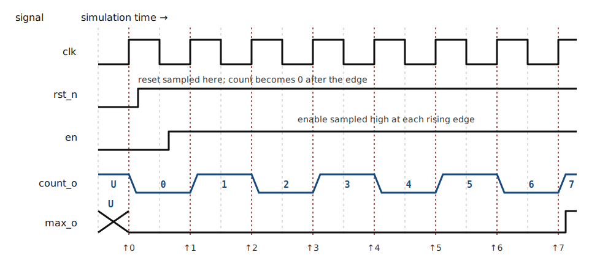

::: {.callout-note title="Chapter maturity — draft"}
This draft develops a complete introductory hardware-description chain: interface requirements,
concurrent and clocked VHDL, event-driven simulation, a self-checking testbench,
assertions, coverage, synthesis inspection, equivalence, and a bounded release
decision. The running VHDL-2008 example is executable simulation evidence. It is
not physical measurement, placed-and-routed timing evidence, or proof that every
tool implements every language feature identically. During authoring, GHDL 5.1.1
analyzed, elaborated, and ran the counter and testbench under `--std=08`; all 24
checked observations passed, and the same tool's synthesis front end accepted
the counter. This chapter stops at portable RTL commands and target-neutral
synthesis inspection. D06 develops target architecture, constraints,
place-and-route, timing, and configuration concepts. Lab **L10** then turns
those concepts into the board-specific workflow that installs the selected
tools, builds a configuration image, configures or programs the approved
**field-programmable gate array (FPGA)** platform, and observes its behavior. The
[reading roadmap](../roadmap.qmd) defines the book's status levels.
:::

::: {.callout-warning title="Safety boundary for this chapter"}
Simulation changes data in a computer; FPGA implementation can drive physical
pins and connected loads. Reading or simulating this chapter does not authorize
connection to mains, high-energy sources, actuators, safety interlocks, or other
safety-critical hardware. Any later implementation remains inside the
current-limited, extra-low-voltage boundary established in
[F01](../01-foundations/f01-safe-practice.qmd) and the approved procedure for
Lab L10.
:::

## Central question

> How can executable hardware intent be written so that consequential errors
> are exposed before the design reaches physical hardware?

A software assignment usually changes one stored value when the processor
executes that statement. A hardware description can instead denote several
gates, registers, and connections that operate at the same time. Reading an HDL
as a software program therefore creates a dangerous false picture: source order
may appear to determine behavior even though the described hardware is
concurrent.

A **hardware description language (HDL)** is a formal language for describing
the structure and behavior of hardware. This chapter uses the IEEE-standard
VHSIC Hardware Description Language, **VHDL**, whose design units can serve as
machine-readable hardware intent, executable simulation input, and synthesis
input [@ieee2019vhdl]. *Free Range VHDL* provides a complementary introductory
route through the language and small design examples [@mealy2024freerangevhdl].

The central prediction concerns two assignments inside one clocked process:

```vhdl
first_q  <= data_i;
second_q <= first_q;
```

After a rising clock edge, does `second_q` receive the new `data_i`, or the value
that `first_q` held before the edge? Commit to one answer before reading further.
The correct answer distinguishes a two-register pipeline from two software
assignments, and the simulator's event rules make the distinction precise.

Writing legal VHDL is only the first step. A verified design needs agreement
among the requirement, interface, RTL, reference behavior, assertions,
waveforms, synthesized structure, constraints, and recorded test result. Each
comparison can reveal a different class of disagreement. None alone establishes
physical timing or electrical correctness.

## Learning outcomes

This chapter assumes [D03](d03-state-clock-timing.qmd): registers, synchronous
state transitions, clock edges, reset, setup and hold, metastability, and CDC;
and [T02](../appendices/t02-tools-version-control.qmd): files, commands,
automation, tool versions, and version control. After completing it, you should
be able to:

- explain how concurrent statements, processes, signals, variables, events, and
  delta cycles determine VHDL simulation behavior;
- define a type-safe entity with explicit widths, bit order, polarity, clock,
  reset, and parameter contracts, then connect instances through hierarchy;
- write synthesizable combinational and edge-triggered VHDL that infers the
  intended logic without accidental storage, priority, or clock behavior;
- construct a self-checking testbench with independent expected behavior,
  assertions, deterministic stimulus, and an unambiguous pass or fail result;
- distinguish requirements coverage, functional coverage, code coverage,
  assertion results, simulation traces, synthesis evidence, equivalence, static
  timing analysis, and physical measurement;
- diagnose common mismatches involving delta cycles, incomplete assignment,
  reset priority, numeric types, width conversion, unknown values, and stale
  build inputs; and
- define a reproducible, requirements-based acceptance boundary for RTL while
  separating the target concepts developed in D06 from the tool setup,
  bitstream build, device programming, and physical evidence produced in Lab
  L10.

## Executable hardware descriptions

An HDL source file is neither a schematic nor fabricated hardware. It is a
formal description that a tool interprets under a particular language revision.
**Register-transfer level (RTL)** describes operations and data transfers across
explicit register boundaries. A **netlist** is a machine-readable collection of
component instances and their connections. These definitions locate the source
within the larger transformation chain shown in @fig-d04-representations. Each
arrow means “is interpreted or compared under the recorded configuration”; no
arrow implies that timing or physical properties transfer automatically.

```{mermaid}
%%| label: fig-d04-representations
%%| fig-cap: "One hardware object described and checked through several representations. Requirements constrain an interface and RTL; simulation executes the elaborated description; synthesis constructs a target-independent or target-specific netlist; implementation adds physical resources and delays. Comparison paths expose disagreements, while each stage has a narrower evidence claim than the complete physical system."
%%| fig-alt: "A vertical chain runs from requirements through interface and RTL, elaborated simulation, synthesized netlist, placed implementation, and physical hardware. Side arrows connect assertions and reference behavior to simulation, and constraints to synthesis and implementation."
%%| fig-width: 5.5
flowchart TB
  accTitle: HDL representation and evidence chain
  accDescr: Requirements constrain VHDL, simulation, synthesis, implementation, and physical hardware, while tests and constraints enter at their relevant stages.
  R["requirements and interface contract"]
  H["VHDL entity and RTL architecture"]
  E["elaborated simulation hierarchy"]
  N["synthesized netlist"]
  P["placed and routed implementation"]
  B["configured physical hardware"]
  T["testbench, assertions,<br/>and reference behavior"]
  C["clock, I/O, and target constraints"]
  R --> H
  H --> E
  H --> N --> P --> B
  R --> T
  T --> E
  C --> N
  C --> P
```

Four translations in this chain need separate names:

- **Analysis** parses and checks a design unit against the selected VHDL
  revision and referenced libraries.
- **Elaboration** binds entities to architectures, applies generic values,
  creates instances, and forms the executable hierarchy.
- **Simulation** advances that hierarchy through events and reports the signal
  behavior produced by the language semantics.
- **Synthesis** infers registers, combinational logic, memories, and connections,
  then maps or prepares them for a hardware technology [@amd2026ug901].

Analysis can reject a misspelled type without knowing whether the algorithm is
right. Simulation can expose a wrong state transition without establishing that
the chosen clock period will pass after routing. Synthesis can infer the wrong
latch perfectly from legal source. The evidence claim must therefore name both
the transformation and the property checked.

### Entity and architecture

A VHDL **entity** declares a design unit's external contract: generics and
ports. An **architecture** supplies one implementation of that entity. Keeping
the two roles distinct allows the same interface to have an RTL architecture, a
simulation-only behavioral architecture, or another implementation selected by
a VHDL configuration declaration [@ieee2019vhdl].

The small interface below declares signal direction, type, width, and bit order.
Its architecture gives `y_o` one concurrent Boolean driver.

```vhdl
library ieee;
use ieee.std_logic_1164.all;

entity majority3 is
  port (
    a_i : in  std_logic;
    b_i : in  std_logic;
    c_i : in  std_logic;
    y_o : out std_logic
  );
end entity majority3;

architecture rtl of majority3 is
begin
  y_o <= (a_i and b_i) or (a_i and c_i) or (b_i and c_i);
end architecture rtl;
```

The complete listing has two regions separated by the architecture's `begin`:

| Source element | Role |
|---|---|
| `library` and `use` | make named standard-library declarations visible |
| `entity ... port` | declare the external interface, directions, and types |
| `architecture ... is` | begin one implementation and its local declarations |
| architecture `begin` | begin the concurrent statement region |
| `end ...` | close the named design unit so boundaries remain auditable |

: Anatomy of the first complete VHDL design. The semicolons terminate
declarations or statements; indentation communicates structure to humans but
does not change the language meaning [@ieee2019vhdl]. {#tbl-d04-source-anatomy}

The suffixes `_i` and `_o` are local naming conventions, not VHDL syntax. They
make port direction visible wherever a signal name appears. The architecture
implements the two-of-three function derived in D02. The statement remains
active for the entire simulation; it is not executed once and discarded.

## Concurrent execution and event simulation

Statements directly inside an architecture are **concurrent statements**. Each
describes behavior active in parallel with its neighbors. Reordering independent
concurrent assignments does not change their logical connectivity.

```vhdl
sum_o   <= a_i xor b_i xor carry_i;
carry_o <= (a_i and b_i) or
           (carry_i and (a_i xor b_i));
```

These assignments describe the full-adder functions from D02. They do not mean
that `sum_o` finishes before `carry_o`. Physical delay depends on the synthesized
logic and routed paths, not on which source line appears first.

A **process** is a concurrent statement whose contents execute sequentially
whenever the process wakes. Sequential source order matters *inside* one process,
but all processes remain concurrent with one another. This two-level rule is the
foundation of RTL reading.

### Events and delta cycles

An event-driven simulator does not continuously recalculate every statement.
A **transaction** is a scheduled value for a signal. When a transaction
changes the signal's effective value, that change is an **event**, which wakes
processes sensitive to the signal. Those processes execute until they suspend,
schedule further transactions, and allow the simulator to update signals. A
transaction that leaves the effective value unchanged creates no event on that
signal. The simulator can
repeat this sequence several times at the same simulation time before advancing
physical time [@ieee2019vhdl; @amd2026ug900].

A **delta cycle** is one zero-physical-time ordering step used to settle those
scheduled events. Delta cycles make concurrency deterministic without claiming
that real gates respond in zero seconds. They also explain why a testbench that
samples immediately after driving an input can see an old value.

The following zero-delay chain needs two propagation stages:

```vhdl
b_s <= not a_s;
c_s <= not b_s;
```

When `a_s` changes, the first assignment schedules `b_s`. After that update,
the second assignment wakes and schedules `c_s`. All three changes can share the
same printed simulation time while occupying different delta cycles. Adding
arbitrary `wait for 1 ns` delays can hide the scheduling issue; a stronger
testbench synchronizes to a defined interface event and samples only after the
declared settling relationship.

The event table below makes that zero-time ordering visible. Before 20 ns, the
chain has settled for `a_s='0'`. Delta 0 applies the input event. Each following
row applies transactions scheduled by the preceding row.

| Observation point | `a_s` | `b_s` | `c_s` | Newly scheduled transaction |
|---|---:|---:|---:|---|
| before 20 ns | 0 | 1 | 0 | input source schedules `a_s='1'` |
| 20 ns, delta 0 | 1 | 1 | 0 | first assignment schedules `b_s='0'` |
| 20 ns, delta 1 | 1 | 0 | 0 | second assignment schedules `c_s='1'` |
| 20 ns, delta 2 | 1 | 0 | 1 | none; the chain is settled |

: Logical event ordering for the two-inverter chain. The table is an exact
simulation-semantic trace for the stated initial values, not a physical-delay
waveform. {#tbl-d04-delta-chain}

### Signals and variables

A **signal** represents communication among concurrent statements and has an
event history. A signal assignment with `<=` schedules an update; it does not
change the signal immediately within the executing process. An ordinary
process-declared **variable** takes a new value immediately after `:=` and retains
that value between process activations. Reading it before assignment can
therefore describe stored behavior. Subprogram-local variables and specialized
shared or protected variables have different lifetimes and access rules
[@ieee2019vhdl].

The prediction from the chapter opening can now be resolved:

```vhdl
process (clk_i)
begin
  if rising_edge(clk_i) then
    first_q  <= data_i;
    second_q <= first_q;
  end if;
end process;
```

Both right-hand sides are evaluated using values visible when the process wakes.
The scheduled signal updates take effect after the process suspends. Therefore
`second_q` receives the *old* `first_q`, which describes two cascaded registers.
Reversing the source lines does not turn them into one register.

A variable produces different intra-process behavior:

```vhdl
process (clk_i)
  variable next_v : std_logic;
begin
  if rising_edge(clk_i) then
    next_v    := a_i xor b_i;
    parity_q  <= next_v;
    inverse_q <= not next_v;
  end if;
end process;
```

Here both scheduled outputs use the newly calculated `next_v`. The variable is a
calculation aid, but synthesis still depends on every assignment path and use.
Variables are not “software,” and signals are not automatically “hardware.” The
data dependencies and clock boundaries described by the complete process
determine the inferred structure.

## Types, numeric meaning, and reusable interfaces

The event rules explain when a value changes, but they do not explain what that
value means. VHDL's type system supplies this second part of the contract and
checks it more strongly than many HDLs. A design must therefore state whether a
vector is merely a bundle of bits, an unsigned number, a signed two's-complement
number, an enumeration, or a bounded integer [@ieee2019vhdl].

### Multi-valued logic

The first type question is whether a signal can represent more than the two
binary logic values. The IEEE `std_logic_1164` package defines the commonly used
resolved type `std_logic` and its unresolved base type. Their nine values carry
simulation information that a binary hardware abstraction would otherwise
discard [@ieee2019vhdl]:

| Value | Simulation meaning | Typical cause or use |
|---|---|---|
| `'U'` | uninitialized | no effective initialization yet |
| `'X'` | forcing unknown | conflicting or unknown forcing behavior |
| `'0'`, `'1'` | forcing binary values | ordinary actively driven logic |
| `'Z'` | high impedance | released tri-state driver |
| `'W'` | weak unknown | conflicting or unknown weak behavior |
| `'L'`, `'H'` | weak binary values | weak pull-down or pull-up abstraction |
| `'-'` | don't care | pattern or optimization intent in defined contexts |

: IEEE multi-valued logic symbols and their principal simulation meanings. A
logic symbol is not an analog voltage measurement, and `'-'` is not a wildcard
for every operator [@ieee2019vhdl]. {#tbl-d04-logic-values}

A **resolved type** has a resolution function that combines multiple drivers.
Resolution helps represent a bus with several possible drivers, but it can also
allow an unintended multiple-driver design to compile and become `'X'` only in
simulation. An unresolved signal, such as `std_ulogic`, lets analysis or
elaboration reject multiple sources when the interface genuinely permits only
one. Tool and team support determine whether an all-unresolved style is
practical.

The symbols `'U'` and `'X'` are evidence of uncertainty in the *simulation
description*. They do not represent metastable voltages from D03. RTL simulation
does not reproduce the analog resolution trajectory, setup/hold aperture, or
device-dependent probability of metastability.

D02 and D03 also use an unquoted table entry $X$ for design freedom: either
binary value is acceptable while deriving a function. That notation is not the
VHDL literal `'X'`, which means forcing unknown. VHDL's `'-'` literal expresses
a don't-care value only in operators and contexts that define matching or
optimization behavior.

### Arithmetic types and conversions

Multi-valued logic records the state of each bit, but a vector still needs an
explicit interpretation before arithmetic has meaning. `std_logic_vector`
declares an ordered logic bundle but assigns no numeric
interpretation. The IEEE `numeric_std` package supplies `unsigned` and `signed`
types and their arithmetic operations [@ieee2019vhdl]. The declaration should
carry the intended meaning:

```vhdl
signal address_s : unsigned(11 downto 0);
signal offset_s  : signed(12 downto 0);
signal flags_s   : std_logic_vector(7 downto 0);
```

Width changes require an explicit rule. `resize` sign-extends a `signed` value
and zero-extends an `unsigned` value when growing. When narrowing, `unsigned`
retains the rightmost bits and discards high-order bits. `signed` retains the
original sign bit plus the required rightmost bits, discarding high-order
magnitude bits. Either operation can change the represented value, so overflow
behavior must come from the interface contract rather than from an accidental
conversion. A conversion changes interpretation, not the stored bit pattern:

```vhdl
sum_ext_s <= resize(a_s, sum_ext_s'length) +
             resize(b_s, sum_ext_s'length);
flags_s   <= std_logic_vector(sum_ext_s(7 downto 0));
```

The target width is derived from the receiving object rather than duplicated as
a literal. Attributes such as `'length`, `'range`, `'high`, and `'low` keep a
description synchronized when a generic changes.

### Generics and hierarchy

Explicit types and widths define one interface; generics extend that interface
to a controlled family of instances. A **generic** is an elaboration-time
parameter that creates a family of related instances without turning width into
a runtime signal. An **instance** connects one elaborated entity/architecture
pair into a parent architecture. Named association makes those connections
auditable:

```vhdl
counter_u : entity work.event_counter(rtl)
  generic map (
    WIDTH_G => 12
  )
  port map (
    clk_i   => system_clk_s,
    rst_n_i => system_rst_n_s,
    en_i    => sample_event_s,
    count_o => sample_count_s,
    max_o   => sample_count_max_s
  );
```

The instance label `counter_u` identifies one hardware occurrence. The library
name `work` denotes the current working library, not a source directory. Direct
entity instantiation and named association reduce the risk of binding the wrong
component or swapping same-typed ports.

The interface diagram in @fig-d04-counter-interface exposes every runtime input,
output, polarity, and generic before the RTL is introduced. It is architectural,
not a gate-level schematic.

```{mermaid}
%%| label: fig-d04-counter-interface
%%| fig-cap: "Interface of the width-parameterized event counter. WIDTH_G fixes the count width during elaboration. The block samples active-low synchronous reset and enable on each rising clock edge. count_o is an unsigned WIDTH_G-bit output; max_o is combinationally high exactly while every count bit is one."
%%| fig-alt: "A block named event_counter has WIDTH_G shown above. Inputs are clk_i, synchronous active-low rst_n_i, and en_i. Outputs are unsigned count_o ordered WIDTH_G minus 1 down to 0 and one-bit max_o."
flowchart TB
  accTitle: Parameterized event-counter interface
  accDescr: A positive width generic configures a rising-edge counter with synchronous active-low reset, enable, unsigned count output, and maximum flag.
  G["generic: WIDTH_G positive"]
  B["event_counter<br/>rising-edge state"]
  I["inputs:<br/>clk_i<br/>rst_n_i active low, synchronous<br/>en_i"]
  O["outputs:<br/>count_o unsigned<br/>WIDTH_G−1 downto 0<br/>max_o"]
  G --> B
  I --> B --> O
```

## Synthesizable combinational and clocked patterns

Types constrain the values that a design can express, while statement structure
determines whether those values flow through combinational logic or cross a
storage boundary. An RTL architecture expresses data operations and transfers
across explicit storage boundaries, but VHDL can also describe file I/O,
arbitrary time delays, test stimulus, and abstract behavior that no synthesis
tool maps to ordinary hardware. “Synthesizable VHDL” is therefore not one
timeless subset: the selected tool, version, target, and coding construct
determine support [@amd2026ug901].

### Combinational completeness

A combinational description must determine every driven output for every input
combination. A concurrent selected assignment makes that completeness visible:

```vhdl
with select_i select
  y_o <= a_i when '0',
         b_i when '1',
         'X' when others;
```

The `others` choice covers non-binary simulation values. Driving `'X'` can make
an invalid control visible in simulation; whether that is suitable synthesis
intent depends on the design policy. A safety-relevant interface normally needs
a defined safe response rather than an optimization don't-care.

A process can describe the same settled logic, but every output needs a value on
every path:

```vhdl
process (all)
begin
  y_o <= 'X';                 -- explicit invalid-control policy
  if select_i = '0' then
    y_o <= a_i;
  elsif select_i = '1' then
    y_o <= b_i;
  end if;
end process;
```

`process(all)` is a VHDL-2008 sensitivity shorthand for signals read by the
process. Under older revisions, a manually incomplete sensitivity list can make
simulation retain a stale result even when synthesis builds combinational logic.
The build must therefore record the language revision.

The following legal process does *not* describe combinational logic:

```vhdl
process (all)
begin
  if enable_i = '1' then
    y_o <= data_i;
  end if;
end process;
```

When `enable_i` is not `'1'`, `y_o` must retain its previous value. Synthesis
therefore needs a level-sensitive storage element. Unexpected **latch inference**
is a common consequence of incomplete assignment and should be treated as a
defect unless the requirement explicitly calls for a latch [@amd2026ug901].

### Edge-triggered state and reset priority

D03 derived the behavior and timing of registers. RTL should preserve that
contract in a recognizable clocked pattern:

```vhdl
process (clk_i)
begin
  if rising_edge(clk_i) then
    if rst_n_i = '0' then
      state_q <= IDLE;
    elsif enable_i = '1' then
      state_q <= state_d;
    end if;
  end if;
end process;
```

Reset is synchronous because its test occurs inside the edge condition. Reset
has priority over enable because the `if` branch precedes the `elsif` branch.
Moving the reset test outside `rising_edge` describes asynchronous assertion,
but RTL simulation also requires `rst_n_i` in the sensitivity list, as in
`process (clk_i, rst_n_i)`. Both changes alter the interface and timing
obligations. The source should not change
reset style merely to match a familiar template; D03's reset requirement comes
first.

Clock enables belong inside the clocked process. Using ordinary combinational
logic to gate a clock can create narrow pulses, skew, and a new clock domain.
Target-specific clock-control resources and their constraints belong to D06.

### Simulation-only constructs

The preceding combinational and clocked forms describe hardware. Verification
also needs constructs that deliberately remain outside that synthesizable
subset. Testbenches may use time and operating-system-like services because
they do not become hardware:

```vhdl
clk_s <= not clk_s after 5 ns;

stimulus : process
begin
  wait for 20 ns;
  request_s <= '1';
  wait until rising_edge(clk_s);
  request_s <= '0';
  wait;
end process;
```

The `after` and `wait for` clauses schedule simulation time. An ordinary counter
cannot synthesize “wait 20 ns” without a clock and a target-dependent mapping
from cycles to seconds. RTL represents that physical interval as a number of
qualified clock edges under a declared clock constraint.

## Worked RTL design: a parameterized event counter

The type, interface, combinational, and clocked rules now combine in one complete
RTL block. The running design counts accepted events modulo $2^{W}$, where $W$ is the
positive generic `WIDTH_G`. The requirement table fixes the behavior before the
source does. An edge index $k$ refers to values sampled immediately before the
$k$th rising edge and state observed after the scheduled register update.

Both `rst_n_i` and `en_i` are synchronous controls in the `clk_i` domain. The
source driving each control must meet the register's setup and hold contract from
[D03](d03-state-clock-timing.qmd#setup-and-hold-at-a-register-boundary). This
counter is not a synchronizer or pulse stretcher. A narrow or asynchronous event
can be missed or can violate the sampling boundary, so it needs the appropriate
CDC or event-transfer structure from
[D03](d03-state-clock-timing.qmd#clock-domain-crossings-by-information-type).

| ID | Requirement |
|---|---|
| EC-1 | `WIDTH_G` shall be positive; `count_o` shall contain exactly `WIDTH_G` bits ordered `WIDTH_G-1 downto 0`. |
| EC-2 | If `rst_n_i='0'` at a rising edge, the next count shall be zero regardless of `en_i`. Reset shall be synchronous and active low. |
| EC-3 | If `rst_n_i='1'` and `en_i='1'` at a rising edge, the next count shall equal the current unsigned count plus one modulo $2^W$. |
| EC-4 | If `rst_n_i='1'` and `en_i/='1'` at a rising edge, the count shall hold. Non-binary enable values therefore shall not request a count. |
| EC-5 | `max_o` shall be `'1'` exactly when every bit of the current count is `'1'`; otherwise it shall be `'0'` for binary count values. |

: Functional contract for the event counter. The table specifies abstract
edge-to-edge behavior, not propagation delay, clock frequency, startup before a
reset edge, or physical pin behavior. {#tbl-d04-counter-requirements}

With $q[k]$ denoting the unsigned integer represented by the current binary count
and $M=2^W$, the exact functional transition for binary inputs is

$$
q[k+1] =
\begin{cases}
0, & r_n[k]=0,\\
(q[k]+1)\bmod M, & r_n[k]=1 \text{ and } e[k]=1,\\
q[k], & r_n[k]=1 \text{ and } e[k]=0.
\end{cases}
$$ {#eq-d04-counter-transition}

Here $r_n[k]$ and $e[k]$ are the binary values of `rst_n_i` and `en_i` sampled at
the $k$th rising edge. This is a definition of the required transition, not a
physical timing equation. The range is $0\le q<M$. At $q=M-1$, enabled addition
produces $M$, and reduction modulo $M$ gives zero. That limiting case is the
wraparound test.

The corresponding VHDL-2008 RTL is compact because its types and declarations
carry much of the contract:

```vhdl
library ieee;
use ieee.std_logic_1164.all;
use ieee.numeric_std.all;

entity event_counter is
  generic (
    WIDTH_G : positive := 4
  );
  port (
    clk_i   : in  std_logic;
    rst_n_i : in  std_logic;
    en_i    : in  std_logic;
    count_o : out unsigned(WIDTH_G - 1 downto 0);
    max_o   : out std_logic
  );
end entity event_counter;

architecture rtl of event_counter is
  signal count_q : unsigned(WIDTH_G - 1 downto 0);
begin
  count_register : process (clk_i)
  begin
    if rising_edge(clk_i) then
      if rst_n_i = '0' then
        count_q <= (others => '0');
      elsif en_i = '1' then
        count_q <= count_q + 1;
      end if;
    end if;
  end process count_register;

  count_o <= count_q;
  max_o <= and std_logic_vector(count_q);
end architecture rtl;
```

The clocked process maps EC-2 through EC-4 directly. The fixed width of
`count_q` supplies modulo-$2^W$ arithmetic: the carry beyond its high bit is not
stored. The unary `and` is a VHDL-2008 reduction across every count bit. It
implements EC-5 exactly for the reachable post-reset binary count. Before reset,
it follows the standard nine-value logic table: a known zero can force the
reduction low, while other weak or unknown combinations need not produce a
binary result. The two output assignments are concurrent.
`max_o` therefore reflects the updated count after the necessary delta-cycle
settling; it is not another register.

The construction view in @fig-d04-counter-construction connects that RTL to the
inferred data path. The control selector applies reset priority, then enable,
before the single register samples its next value. The current count feeds both
the increment path and the hold path. A separate reduction path produces the
maximum flag.

```{mermaid}
%%| label: fig-d04-counter-construction
%%| fig-cap: "Construction view of the event counter. A WIDTH_G-bit register feeds an incrementer, the hold path, count_o, and an all-ones detector. A reset/enable next-value selector chooses zero, incremented count, or held count before the next rising edge. The diagram shows inferred logical structure, not target-specific gates or routed delays."
%%| fig-alt: "The WIDTH_G-bit current count branches to a plus-one modulo block, a hold input of a reset-and-enable selector, count_o, and a reduction AND that drives max_o. Zero and the incremented count also enter the selector. The selector drives a WIDTH_G-bit rising-edge register controlled by clk_i; the register output is the current count."
%%| fig-width: 5.5
flowchart TB
  accTitle: Event-counter construction
  accDescr: Current count feeds increment, hold, output, and all-ones paths; reset and enable select the next value for one rising-edge register.
  CTRL["rst_n_i and en_i<br/>reset has priority"]
  ZERO["WIDTH_G-bit zero"]
  INC["+1 modulo 2^W"]
  SEL["next-value selector"]
  REG["WIDTH_G-bit register"]
  CUR["current count"]
  DET["reduction AND"]
  OUT["count_o"]
  MAX["max_o"]
  CTRL --> SEL
  ZERO --> SEL
  CUR --> INC --> SEL
  CUR --> SEL
  SEL --> REG
  CLK["clk_i rising edge"] --> REG
  REG --> CUR
  CUR --> OUT
  CUR --> DET --> MAX
```

Before trusting the source, inspect three boundary cases:

- With reset low and enable high, the first branch wins and the count becomes
  zero. This checks priority.
- With reset high and enable low, no signal assignment occurs in the clocked
  branch, so the register holds. This is intentional storage, unlike a missing
  assignment in a combinational process.
- With an all-ones count and enable high, addition wraps to zero. `max_o` is high
  before that edge and low after the output logic settles.

The author-generated waveform in @fig-d04-counter-waveform shows the first reset
and enabled count sequence for `WIDTH_G=3`. Every count bit begins as `'U'`
because the RTL declares no hardware initialization. The first rising edge with
reset low establishes the known zero state, so the trace separates simulation
startup from the specified reset event [@ieee2019vhdl].

{#fig-d04-counter-waveform fig-alt="Clock, active-low synchronous reset, enable, three-bit count, and maximum flag waveforms. Count is initially unknown. Reset is low at the first rising edge and makes count zero after that edge. Enable is then high, so count advances on each rising edge from zero through seven. The maximum flag becomes high only when count is seven." width="100%"}

The diagram shows logical event ordering, not target delay. A physical register
has clock-to-output delay, and the all-ones detection logic has propagation
delay. Both delays depend on the synthesized and routed implementation, which
D06 reconnects to this RTL contract.

### Translating a state-transition contract

The counter has an implicit numeric state type. A controller benefits from an
enumerated type because state names then appear in the source, simulator, and
synthesis report. The acquisition controller from
[D03](d03-state-clock-timing.qmd#state-transition-functions) has states `IDLE`,
`ACQUIRE`, `REPORT`, and `FAULT`; `TIMEOUT` has priority over `DONE` in
`ACQUIRE`. The two-process RTL below preserves D03's next-state equation and
Moore outputs without exposing a binary encoding at the interface:

```vhdl
architecture rtl of acquisition_controller is
  type state_t is (IDLE_ST, ACQUIRE_ST, REPORT_ST, FAULT_ST);
  signal state_q : state_t;
  signal state_d : state_t;
begin
  next_state_logic : process (all)
  begin
    state_d <= state_q;

    case state_q is
      when IDLE_ST =>
        if start_i = '1' then
          state_d <= ACQUIRE_ST;
        end if;

      when ACQUIRE_ST =>
        if timeout_i = '1' then
          state_d <= FAULT_ST;
        elsif done_i = '1' then
          state_d <= REPORT_ST;
        end if;

      when REPORT_ST =>
        state_d <= IDLE_ST;

      when FAULT_ST =>
        if clear_i = '1' then
          state_d <= IDLE_ST;
        end if;
    end case;
  end process next_state_logic;

  state_register : process (clk_i)
  begin
    if rising_edge(clk_i) then
      if rst_n_i = '0' then
        state_q <= IDLE_ST;
      else
        state_q <= state_d;
      end if;
    end if;
  end process state_register;

  busy_o   <= '1' when state_q = ACQUIRE_ST else '0';
  report_o <= '1' when state_q = REPORT_ST else '0';
  fault_o  <= '1' when state_q = FAULT_ST else '0';
end architecture rtl;
```

The `_ST` suffix maps each literal back to D03's state name and avoids VHDL's
reserved keyword `report`. The default `state_d <= state_q` implements the
documented hold cases. The order of the `if` branches implements timeout
priority. The register alone stores history. The three concurrent comparisons
implement Moore outputs.

This source matches D03's transition table for binary controls. Its comparisons
treat only literal `'1'` as asserted. For example, `timeout_i='X'` with
`done_i='1'` selects `REPORT_ST`, so a product contract must define whether a
non-binary control should hold, fault, or propagate uncertainty. VHDL also gives
an uninitialized scalar enumeration its leftmost literal, so `state_q` begins as
`IDLE_ST` in this RTL simulation. That language default is not evidence that a
physical state register powers up in `IDLE`; the qualified reset edge remains
the hardware contract.
Synthesis may choose a binary, one-hot, or another state encoding unless a
target-specific constraint or exposed interface code requires one.

The enumeration does not eliminate physical illegal behavior. A simulator
cannot inject an arbitrary bit pattern into a source-level enumerated signal,
and a synthesis tool may add recovery behavior or optimize unreachable states.
Reset release, encoding, upset behavior, and implementation checks therefore
remain explicit verification questions rather than benefits inferred from the
type declaration.

## Testbenches, assertions, and expected behavior

Recognizable RTL supports review, but source inspection alone cannot decide
whether the implementation satisfies its contract. A useful test must
distinguish correct behavior from plausible defects. A **testbench** is an HDL
design that provides the simulator environment for such a test. It instantiates
the **design under test (DUT)**—the specific implementation being checked—then
provides stimulus, observes responses, and decides whether those observations
meet the contract. A top-level VHDL testbench normally has no ports because the
simulator is its environment [@bergeron2003testbenches].

The verification architecture in @fig-d04-testbench separates stimulus from
expected behavior. Arrows into the comparator mean “supply an observed or
expected value.” The coverage collector receives facts about exercised
conditions; it does not decide correctness by itself.

```{mermaid}
%%| label: fig-d04-testbench
%%| fig-cap: "Self-checking verification architecture. A stimulus source drives the DUT and, through the accepted input transaction, an independently expressed reference function. A monitor samples the DUT at the interface's observation point. Assertions and a comparator turn disagreement into failure; coverage records which required situations occurred."
%%| fig-alt: "Stimulus drives both a design under test and reference behavior. A monitor observes the design. Observed and expected values enter a comparator and assertions. A coverage collector records exercised requirement cases, and all checks feed a test report."
%%| fig-width: 5.6
flowchart TB
  accTitle: Self-checking testbench architecture
  accDescr: Stimulus drives the design and reference behavior, a monitor samples the design, assertions compare expected and observed values, and coverage records exercised cases.
  S["deterministic or seeded stimulus"]
  D["design under test"]
  R["reference behavior from requirements"]
  M["interface monitor"]
  A["assertions and comparator"]
  C["requirements and functional coverage"]
  O["pass or fail report with configuration"]
  S --> D --> M --> A --> O
  S --> R --> A
  S --> C
  M --> C
  C --> O
```

### Assertions make a failed condition executable

The comparator in @fig-d04-testbench becomes executable through assertions. An
**assertion** states a Boolean condition that must hold at a specified
observation point. If the condition is false, VHDL reports the attached message
and severity [@ieee2019vhdl]. An assertion should identify the requirement,
cycle or transaction, expected value, and observed value when those details
help diagnosis.

```vhdl
assert not (grant_a_o = '1' and grant_b_o = '1')
  report "ARB-4: both grants asserted"
  severity failure;
```

This assertion checks mutual exclusion whenever execution reaches it. It says
nothing about whether a waiting request eventually receives a grant, whether
the assertion ran at the correct sampling point, or whether electrical outputs
meet their voltage limits. A passing assertion supports only its stated
property over the exercised run or formal domain.

A **safety property** states that a prohibited condition never occurs at its
declared observation points. Mutual exclusion is one example. A **bounded
progress property** states that an accepted trigger produces a required response
within a finite number of accepted clock edges, provided its named assumptions
hold. Finite simulation checks only the trigger windows that occur in the run;
formal analysis can attempt to establish the property over every state and input
allowed by its assumptions [@seligman2023formal].

Severity names such as `note`, `warning`, `error`, and `failure` classify the
report. The simulator's stop policy is tool configuration, so a reproducible
test records which severities cause a nonzero exit. A warning that the build
ignores is not automatically harmless.

### Reference behavior should fail differently

An assertion can compare observed and expected values only if the testbench can
derive that expectation. A **reference function** computes the expected result
from the requirement in a representation separate from the DUT. Copying the RTL
expression into the testbench creates a common-mode error: the same wrong
operator can appear on both sides and agree.

For the counter, the DUT uses fixed-width `unsigned` addition. The reference
function below uses a bounded natural number and explicit modulo arithmetic
from the counter transition in @eq-d04-counter-transition:

```vhdl
function next_count (
  current_n : natural;
  reset_n   : std_logic;
  enable_n  : std_logic;
  modulus_n : positive
) return natural is
begin
  assert current_n < modulus_n
    report "reference count outside its declared modulus"
    severity failure;

  if reset_n = '0' then
    return 0;
  elsif enable_n = '1' then
    if current_n = modulus_n - 1 then
      return 0;
    else
      return current_n + 1;
    end if;
  else
    return current_n;
  end if;
end function next_count;
```

The function is still human-authored from the same requirement, so it is not an
independent physical oracle. Review and requirement-based cases reduce, but do
not eliminate, common misunderstanding.

### Complete self-checking counter testbench

The separated stimulus, reference function, assertions, and observation point
now combine in one executable test. The following VHDL-2008 testbench fixes
`WIDTH_C=3`, generates a 10 ns clock,
and samples 1 ns after each rising edge. The 1 ns offset is a testbench
observation convention chosen to pass all zero-delay RTL delta cycles; it is not
a claimed physical clock-to-output limit. A gate-level or timed interface would
replace it with an observation point derived from that interface's timing
contract.

```vhdl
library ieee;
use ieee.std_logic_1164.all;
use ieee.numeric_std.all;

library std;
use std.env.all;

entity event_counter_tb is
end entity event_counter_tb;

architecture sim of event_counter_tb is
  constant WIDTH_C      : positive := 3;
  constant MODULUS_C    : positive := 2 ** WIDTH_C;
  constant CLK_PERIOD_C : time     := 10 ns;

  signal clk_s   : std_logic := '0';
  signal rst_n_s : std_logic := '0';
  signal en_s    : std_logic := '0';
  signal count_s : unsigned(WIDTH_C - 1 downto 0);
  signal max_s   : std_logic;

  function next_count (
    current_n : natural;
    reset_n   : std_logic;
    enable_n  : std_logic
  ) return natural is
  begin
    assert current_n < MODULUS_C
      report "reference count outside configured range"
      severity failure;

    if reset_n = '0' then
      return 0;
    elsif enable_n = '1' then
      if current_n = MODULUS_C - 1 then
        return 0;
      else
        return current_n + 1;
      end if;
    else
      return current_n;
    end if;
  end function next_count;
begin
  clk_s <= not clk_s after CLK_PERIOD_C / 2;

  dut_u : entity work.event_counter(rtl)
    generic map (
      WIDTH_G => WIDTH_C
    )
    port map (
      clk_i   => clk_s,
      rst_n_i => rst_n_s,
      en_i    => en_s,
      count_o => count_s,
      max_o   => max_s
    );

  stimulus : process
    variable expected_n : natural := 0;
    variable checks_n   : natural := 0;

    procedure tick_and_check is
      variable expected_max_v : std_logic;
    begin
      wait until rising_edge(clk_s);
      expected_n := next_count(expected_n, rst_n_s, en_s);
      wait for 1 ns;

      if expected_n = MODULUS_C - 1 then
        expected_max_v := '1';
      else
        expected_max_v := '0';
      end if;

      checks_n := checks_n + 1;
      assert count_s = to_unsigned(expected_n, WIDTH_C)
        report "EC count mismatch at check" &
               natural'image(checks_n)
        severity failure;
      assert max_s = expected_max_v
        report "EC max mismatch at check" &
               natural'image(checks_n)
        severity failure;
    end procedure tick_and_check;
  begin
    tick_and_check;              -- reset with enable low

    rst_n_s <= '1';
    tick_and_check;              -- hold zero

    en_s <= '1';
    for value_n in 1 to MODULUS_C - 1 loop
      tick_and_check;            -- every nonzero count value
    end loop;

    en_s <= '0';
    tick_and_check;              -- hold at maximum

    en_s <= '1';
    tick_and_check;              -- maximum wraps to zero

    for value_n in 1 to 3 loop
      tick_and_check;            -- establish a nonzero state
    end loop;

    rst_n_s <= '0';
    wait until falling_edge(clk_s);
    wait for 1 ns;
    checks_n := checks_n + 1;
    assert count_s = to_unsigned(expected_n, WIDTH_C)
      report "EC synchronous reset changed count before rising edge"
      severity failure;
    assert max_s = '0'
      report "EC max changed before synchronous reset edge"
      severity failure;
    tick_and_check;              -- reset dominates enable at rising edge

    rst_n_s <= '1';
    en_s    <= '0';
    tick_and_check;              -- hold after reset release

    en_s <= 'U'; tick_and_check;
    en_s <= 'X'; tick_and_check;
    en_s <= 'Z'; tick_and_check;
    en_s <= 'W'; tick_and_check;
    en_s <= 'L'; tick_and_check;
    en_s <= 'H'; tick_and_check;
    en_s <= '-'; tick_and_check;

    report "PASS: " & natural'image(checks_n) &
           " checked observations; reset, hold, count, " &
           "max, wrap, and non-binary enable passed."
      severity note;
    stop;
    wait;
  end process stimulus;
end architecture sim;
```

The expected transcript contains the test's own pass line and no assertion
failure. A simulator can prefix file, line, time, or severity information, so
the portable expected content is:

```text
PASS: 24 checked observations; reset, hold, count, max, wrap, and non-binary enable passed.
```

This run checks all eight binary count values, ordinary increment, wraparound,
hold at zero and maximum, every non-binary `std_logic` enable value, reset with
both enable values, and no premature response to synchronous reset. The 24
observations are executable simulation evidence for the `WIDTH_G=3`
configuration. They are not a measurement, a proof for every width, a test of
non-binary clock/reset behavior, a synthesis result, or a physical timing test.

::: {.callout-tip title="A waveform supports diagnosis; an assertion decides"}
A waveform viewer is excellent for locating the event preceding a failure.
Manual visual inspection is weak as the only regression decision because it is
hard to repeat consistently and easy to truncate. The testbench should produce
a machine-detectable failure first, then preserve enough waveform and context to
explain it.
:::

## Verification scope and coverage

The 24-observation run gives detailed evidence for one configuration, but its
finite stimulus cannot cover every width or history. Verification scope names
the behavior set over which a claim applies. Within that broader strategy,
**formal verification** uses mathematical state-space reasoning to establish a
stated property for every behavior allowed by explicit assumptions and by the
tool's semantic and abstraction boundary [@seligman2023formal].

A test suite needs a reason for each stimulus. Directed examples find expected
boundary mistakes quickly, exhaustive enumeration can close small finite
domains, randomized sequences explore combinations that humans may not choose,
and formal analysis can prove stated properties under declared assumptions.
These methods complement rather than rank one another [@bergeron2003testbenches;
@seligman2023formal].

### Directed, exhaustive, and randomized stimulus

Useful directed cases come from partitions and boundaries:

- reset asserted and released, including simultaneous control requests;
- minimum, maximum, zero, one, and wrap or saturation boundaries;
- each priority branch and each legal state transition;
- back-to-back transactions, idle gaps, and the shortest or longest permitted
  interval;
- invalid encodings and non-binary simulation values when the interface defines
  their treatment; and
- parameter extremes supported by the contract, not only the default generic.

**Exhaustive testing** applies every element of a declared finite input domain.
It is powerful for a D02 combinational block with few inputs. Sequential systems
add state and history. For $n$ binary state bits and $m$ binary input bits, the
number of candidate one-step state/input pairs is exactly

$$
N_1 = 2^n 2^m = 2^{n+m}.
$$ {#eq-d04-one-step-space}

This count assumes every encoded state and input vector is included. It does not
say every state is reachable. For sequences of length $L$ from every candidate
initial state, the raw sequence count becomes

$$
N_L = 2^n\left(2^m\right)^L = 2^{n+mL}.
$$ {#eq-d04-sequence-space}

Both relations are dimensionless counts. With $n=32$ and $m=8$,
$N_1=2^{40}=1.0995\times10^{12}$ candidate pairs. Even at an illustrative rate
of $10^6$ checked pairs per second, one pass would require

$$
t = \frac{2^{40}}{10^6~\text{s}^{-1}}
  = 1.0995\times10^6~\text{s}
  \approx 12.7~\text{days}.
$$

The estimate ignores simulator overhead variation and checks only one-step
pairs. Doubling the state width adds a factor of $2^{32}$, so simulation cannot
enumerate arbitrary system histories. Structure, properties, abstraction, and
requirements-based selection become necessary.

**Randomized stimulus** samples a specified distribution rather than covering
everything. A reproducible random result records the generator algorithm or
library, seed, number of generated transactions, constraints, rejected samples,
parameter configuration, and failure rule. Zero observed failures means only
that no failure occurred in that finite sample; it does not prove a zero defect
probability.

### Coverage measures exercised sets

**Coverage** records which declared items a run exercised. A **coverage bin** is
one named subset or situation counted by a functional coverage plan. Different
coverage spaces answer different questions:

| Coverage space | Typical item | Question answered | What 100% does not prove |
|---|---|---|---|
| requirements | `EC-2` reset priority checked | Did every listed requirement receive linked evidence? | that the requirement set is complete or the check is correct |
| functional | wrap, reset-with-enable, hold-at-max bins | Did the planned situations occur? | that outputs were correct unless checks also passed |
| assertion | property attempted and passed | Did this property hold at its sampling points? | unasserted behavior or omitted assumptions |
| statement/line | executable RTL statement reached | Did stimulus execute each instrumented statement? | correct values, missing logic, or specification completeness |
| branch/condition | each decision outcome taken | Did both sides of decisions occur? | correct priority or temporal behavior |
| toggle | bit changed 0→1 and 1→0 | Did a signal transition both ways? | correct ordering, encoding, or destination response |

: Coverage spaces describe different exercised sets. Tool-specific code coverage
can include statement, branch, condition, and toggle metrics [@amd2026ug900];
requirements-based functional coverage can be implemented with VHDL libraries
such as OSVVM [@osvvm2026]. {#tbl-d04-coverage}

A percentage needs a denominator. “90% covered” is incomplete unless it names
the coverage space, included items, exclusions, merge rules, and configuration.
An exclusion needs a reviewed reason; removing an unreachable branch from the
denominator without demonstrating unreachability manufactures progress rather
than evidence.

For the 3-bit counter test, a compact functional plan is:

| Bin | Requirement | Observed in the 24-observation run? |
|---|---|---|
| reset, enable low | EC-2 | yes |
| reset, enable high | EC-2 priority | yes |
| reset does not act before a rising edge | EC-2 synchronous behavior | yes |
| hold at zero | EC-4 | yes |
| each non-binary enable value holds | EC-4 | yes |
| each binary count value 0–7 | EC-3/EC-5 | yes |
| hold at maximum | EC-4/EC-5 | yes |
| maximum-to-zero wrap | EC-3 | yes |

: Declared functional bins for the illustrative `WIDTH_G=3` run. “Yes” means
the condition occurred and the attached assertions passed in the executed
simulation; it does not extend the claim to another configuration. {#tbl-d04-counter-coverage}

## Lint, simulation, synthesis, and equivalence

Coverage records which planned situations occurred, but it does not inspect
every source hazard or every transformation of the design. No single tool stage
asks every useful question. A disciplined flow therefore places cheap and
discriminating checks early while preserving the stronger downstream evidence
boundaries.

```{mermaid}
%%| label: fig-d04-verification-flow
%%| fig-cap: "Progressive RTL-to-hardware verification flow. D04 owns portable analysis, simulation, synthesis inspection, and equivalence concepts. D06 develops target constraints, place-and-route, timing, and configuration-image concepts. Lab L10 executes the selected tool flow, configures or programs the approved board, and observes the physical result."
%%| fig-alt: "Three connected blocks divide the workflow. D04 covers requirements, analysis and lint, self-checking simulation, synthesis inspection, and equivalence. D06 covers target resources and constraints, place-and-route, static timing, and configuration-image meaning. Lab L10 covers tool and board setup, image building, device or memory programming, observation, and recording."
%%| fig-width: 6.5
%%| fig-height: 3.2
flowchart LR
  accTitle: Chapter-to-lab FPGA workflow
  accDescr: Portable RTL evidence from D04 feeds target reasoning in D06, which feeds board-specific build, programming, and observation in Lab L10.
  D04["D04 — portable RTL<br/>requirements → analysis and lint<br/>→ self-checking simulation<br/>→ synthesis inspection and equivalence"]
  D06["D06 — target reasoning<br/>resources + versioned constraints<br/>→ place-and-route + static timing<br/>→ configuration-image meaning"]
  L10["Lab L10 — board execution<br/>verify tools + board files<br/>→ build image → configure or program<br/>→ observe + record"]
  D04 --> D06 --> L10
```

The first stage in the flow examines source without waiting for stimulus.
**Lint** is static analysis that reports suspicious constructs without running
stimulus. Rules can flag incomplete combinational assignment, unused signals,
implicit width changes, multiple drivers, suspicious resets, or nonportable
constructs. A lint warning is a hypothesis about a defect, not proof of one.
Each warning should be fixed or waived with a local technical reason and review.

After source-level checks, RTL simulation executes the elaborated description.
It is strong evidence for the checked logical traces and weak evidence for
properties the testbench never observes. Zero-delay RTL also omits physical path
delays unless explicit timing behavior is present.

Simulation checks behavior in the RTL representation; synthesis then asks
whether one tool and configuration can translate that source. Its reports expose
the inferred structure. Review should compare expected and reported
registers, latches, memories, clocks, enables, resets, widths, hierarchy, and
warnings. Synthesis success alone does not establish behavioral equivalence,
timing closure, pin behavior, or hardware correctness [@amd2026ug901].

Because synthesis changes representation, **equivalence checking** compares the
two representations under declared mapping and assumptions. A combinational
check may compare RTL outputs with a synthesized netlist for every input
combination. A sequential check may also map state and reason over transitions.
A passing result is bounded by clock/reset assumptions, black boxes, memory
abstractions, undriven or unknown-state treatment, and the exact compared
artifacts [@seligman2023formal; @yosys2026eqy]. It does not prove the original
requirement if both representations share the same design error.

### Constraints are source inputs

The preceding checks interpret more than VHDL source alone. A **constraint**
supplies intent not fully contained in the RTL, such as the target part,
top-level clock definition, I/O timing relationship, false or multicycle path,
pin assignment, or electrical standard. Constraints can change whether the same
VHDL passes timing or connects safely. They therefore belong in version control,
review, and the build identity rather than in an undocumented interactive
session [@amd2026ug949].

D04 therefore treats constraints as versioned interface inputs rather than
teaching a particular board file. D06 develops their target-specific timing and
physical meaning. A simulation that ignores a clock constraint cannot establish
the clock period, and a synthesis run without the actual target configuration
cannot establish implementation feasibility.

### Chapter, FPGA chapter, and lab responsibilities

The flow changes character when portable RTL becomes a target-specific build.
Concepts that transfer across boards belong in the chapters, whereas commands
that depend on an installed release, device family, board files, cable, and
configuration memory belong in the lab procedure.

| Learning layer | Responsibility | Resulting evidence |
|---|---|---|
| D04 | express RTL, run self-checking simulation, inspect target-neutral synthesis, and record reproducible inputs and outputs | portable functional and translation evidence |
| D06 | explain FPGA resources, target constraints, place-and-route, static timing, configuration architecture, and what a bitstream or device image represents | target-aware reasoning and acceptance criteria |
| Lab L10 | install and verify the selected tool release, obtain the approved board support files, run the complete build, generate the required image, configure or program the board, and observe named test points | board- and tool-version-specific implementation evidence |

: Division of responsibility between the portable HDL chapter, the FPGA systems
chapter, and the practical lab. The lab records exact commands because those
commands are part of its reproducible evidence. {#tbl-d04-workflow-responsibility}

“Configure the FPGA” and “flash the FPGA” must not be treated as universal
synonyms. A tool can load configuration directly into a programmable device,
whereas persistent boot can require a separate operation that programs attached
or internal nonvolatile configuration memory. For example, AMD's programming
guide distinguishes direct device configuration from indirect programming of a
supported flash configuration-memory device [@amd2026ug908]. Lab L10 must
therefore name the target device, image type, destination memory, connection,
verification step, and whether the result survives power removal.

### Reproducible RTL commands

The official GHDL workflow separates analysis, elaboration, and simulation and
requires the selected standard to remain consistent across stages
[@ghdldocs]. For the two files shown in this chapter, an illustrative command
sequence is:

```sh
ghdl -a --std=08 event_counter.vhd
ghdl -a --std=08 event_counter_tb.vhd
ghdl -e --std=08 event_counter_tb
ghdl -r --std=08 event_counter_tb --assert-level=error
```

These commands define D04's portable command boundary; they are not a promise
that a particular GHDL release is installed with the book. Lab L10 extends the
same reproducibility pattern with the selected FPGA tools and board. In either
environment, a project build should record:

- tool name, exact version, installation source, and platform;
- VHDL revision, library paths, source manifest, analysis order, and top entity;
- generic values, test name, random seeds, stop conditions, and assertion policy;
- target part and every constraint file for synthesis or implementation;
- source commit, dirty-worktree status, generated-report identity, and command
  exit status; and
- resolved warnings, waivers, coverage denominator, expected output, and actual
  output.

Generated work libraries, logs, waveforms, and netlists are rebuildable outputs;
the source, manifest, tests, constraints, and reviewed waivers are controlled
inputs. A cached work library built with another standard or source revision can
create stale evidence, so clean rebuilds and dependency tracking belong in the
automated flow from T02. Once that build identity is stable, diagnosis can ask
which representation first diverged instead of confusing changed inputs with a
changed design.



## Mismatch diagnosis

A failing assertion is valuable because it fixes an observation point and a
condition. Diagnosis then asks which representation first disagrees. The table
below begins with mismatches that can be localized within language semantics,
RTL structure, types, or synthesis inference. Separating these signatures avoids
treating every red waveform as the same RTL logic error.

| Observation | Likely causes | Discriminating check |
|---|---|---|
| output is one delta late at the same printed time | sampling before scheduled signal updates; extra concurrent assignment stage | display delta cycles or sample at the specified monitor point |
| `second_q` receives previous `first_q` | expected software-like immediate signal assignment | trace pre-edge values; use a variable only if the required data dependency is same-cycle |
| output holds when an input branch is inactive | incomplete combinational assignment inferred a latch | inspect every assignment path and synthesis latch report |
| RTL simulation and synthesis differ | incomplete sensitivity list, unsupported construct, initialization assumption, or tool defect | use `process(all)`, compare language/tool settings, and minimize a reproducer |
| count fails only at maximum | width, carry, saturation, or modulo requirement mismatch | calculate the all-ones transition and inspect conversions |
| signed negative values compare as large positive values | `std_logic_vector`/`unsigned` interpretation at a boundary | declare numeric intent and inspect explicit casts and resize operations |

: Language, scheduling, type, and inferred-structure diagnostic signatures.
Each discriminating check targets the earliest representation that can explain
the observation. {#tbl-d04-rtl-diagnostics}

If those checks agree, diagnosis moves outward to control qualification, build
identity, or the physical implementation boundary.

| Observation | Likely causes | Discriminating check |
|---|---|---|
| count remains `'U'` | no qualified reset edge, reset polarity error, or omitted reset path | trace clock and reset at the sampling edge; do not call `'U'` metastability |
| output becomes `'X'` | conflicting drivers or unknown control/data propagation | list drivers and inspect the first signal that became non-binary |
| reset works alone but not with enable | wrong priority or testbench changes controls at the edge | assert setup relative to the test clock and test simultaneous requests |
| local run passes but automation fails | different source list, standard, generic, tool version, path, seed, or cached library | compare the recorded build manifests and run a clean build |
| RTL passes but routed design misses deadline | functional simulation omitted physical delay; constraint or critical path fails | preserve the RTL result and inspect D06 static timing by path and corner |

: Control, build, and physical-boundary diagnostic signatures. These checks
continue the same inside-to-outside search; they do not replace the downstream
evidence stage. {#tbl-d04-boundary-diagnostics}

Unknown values deserve event-chain reasoning. A register begins uninitialized;
its `'U'` value enters arithmetic; the result becomes unknown; a comparison or
output propagates or sometimes masks that uncertainty; an assertion then fails
away from the source. Tracing backward to the first non-binary event finds the
missing initialization or reset evidence faster than forcing the final output
to zero.



## A bounded RTL release decision

The counter can now be evaluated as a small deliverable. The decision is not
“the waveform looks right.” It is a requirements-based claim about exact source
and configuration artifacts.

For a candidate release, the verification record shall:

1. identify the source commit, clean or dirty status, VHDL revision, tool
   versions, source manifest, top entities, and `WIDTH_G` configurations;
2. link EC-1 through EC-5 to review items, assertions, tests, and functional
   coverage bins;
3. require analysis, elaboration, and every self-checking simulation to exit
   successfully with no assertion at or above the configured failure severity;
4. require every declared functional bin to be hit for each accepted width, or
   document a reviewed exclusion without changing the requirement;
5. require lint and synthesis reports to contain no unreviewed warning, no
   unintended latch, and exactly the expected state width, clock, reset, enable,
   and output logic;
6. require equivalence between the identified RTL and synthesized netlist when
   the chosen flow supports the used constructs, with assumptions, black boxes,
   and mapping recorded; and
7. reject any claim of clock frequency, routed timing, pin correctness, power,
   or physical FPGA behavior until D06 supplies the target reasoning and Lab
   L10 supplies the corresponding implementation evidence.



The authoring run produces the following bounded disposition:

| Evidence item | Artifact and configuration | Observed result | Status |
|---|---|---|---|
| EC-1 through EC-5 trace | displayed VHDL-2008 RTL, `WIDTH_G=3` | types, priority, modulo path, hold path, and maximum path map to the requirement table | passed by source review |
| executable functional check | GHDL 5.1.1, `--std=08`, displayed DUT and testbench | 24 checked observations; no failed assertion; process exited successfully | passed for `WIDTH_G=3` |
| synthesis feasibility | GHDL 5.1.1 synthesis front end, `WIDTH_G=3` | three-bit register, increment path, reset/enable selection, and all-ones output logic present; no latch reported | passed as target-neutral synthesis evidence |
| independent lint policy | no separately configured lint rule set | no result | not assessed |
| RTL-to-netlist equivalence | no equivalence configuration or mapping | no result | unproven |
| placed timing and physical behavior | no target, timing constraints, placement, pins, or board | no result | D06 explains the criteria; Lab L10 executes the target flow |

: Evidence matrix for the exact worked counter. “Passed” applies only to the
listed artifact and configuration; a missing stage is not converted into a
pass. {#tbl-d04-release-evidence}

The worked design is therefore **accepted for the bounded `WIDTH_G=3` functional
simulation claim and target-neutral synthesis-feasibility claim**. It is **not
yet accepted as a reusable implementation release** under the seven-item rule:
other supported widths, an independent lint policy, equivalence, target
constraints, routed timing, and hardware evidence remain open.

The acceptance rule is conjunction: every applicable item must pass. A coverage
percentage cannot compensate for a failed assertion, and synthesis success
cannot compensate for an untested reset priority. Equality at a strict timing
limit would not pass that later limit; this D04 functional release deliberately
makes no such physical timing claim.

The resulting capability is broader than this counter. A reliable HDL block
starts with a finite or state-transition contract, gives types and interfaces
their full meaning, uses recognizable concurrent and clocked structures, and
turns expected behavior into automated decisions. The remaining disagreements
then have names: requirement, RTL, simulation scheduling, synthesis inference,
constraint, routed timing, or physical interface. D05 consumes these verified
blocks in memories and processor structures; D06 carries them into an FPGA.

## Exercises

The exercises use VHDL-2008, `ieee.std_logic_1164`, and `ieee.numeric_std`
unless a prompt states otherwise. Assume rising-edge sampling and the declared
reset style. Treat simulator results as executable evidence, not measurement.

### Quick check

1. Two signal assignments in one rising-edge process are
   `a_q <= d_i; b_q <= a_q;`. What does `b_q` receive at the edge?

   a. the new `d_i` because the first line executes first<br>
   b. the pre-edge value of `a_q`<br>
   c. `'X'` because both assignments are concurrent<br>
   d. the value of `a_q` one delta after the edge, without a register

2. Which statement best describes a delta cycle?

   a. a target-dependent gate delay<br>
   b. one clock period divided by simulator resolution<br>
   c. a zero-physical-time event-ordering step<br>
   d. an uncertainty interval around a clock edge

3. Which declaration carries unsigned arithmetic intent most directly?

   a. `std_logic_vector(7 downto 0)`<br>
   b. `bit_vector(7 downto 0)`<br>
   c. `unsigned(7 downto 0)`<br>
   d. `integer`

4. A combinational process assigns `y_o` only when `en_i='1'`. What hardware is
   normally required for the omitted path?

   a. a latch that retains `y_o`<br>
   b. a clock buffer<br>
   c. an XOR gate<br>
   d. no hardware because the branch is inactive

5. What does 100% statement coverage establish?

   a. every requirement is correct<br>
   b. every instrumented statement executed under the included runs<br>
   c. synthesis preserved the RTL for every state<br>
   d. the physical device passes timing

6. Which result can synthesis success establish by itself?

   a. the source was translatable under that tool and configuration<br>
   b. the testbench covered every omitted requirement<br>
   c. the routed design meets its clock period<br>
   d. the configured FPGA pins meet their electrical limits

**Answer key:** 1-b, 2-c, 3-c, 4-a, 5-b, 6-a.

### Retrieval and explanation

7. Define analysis, elaboration, simulation, synthesis, and equivalence in one
   sentence each. For each term, name one defect it can expose and one claim it
   cannot establish alone.

8. Explain why `std_logic_vector` is appropriate for a flag bundle but
   `unsigned` is clearer for a count. Include one example in which an explicit
   conversion is required.

9. Distinguish `'U'`, `'X'`, and physical metastability. Why can a simulation
   show the first two without reproducing the third?

10. Explain why a reference function copied from RTL can allow a defect to pass.
    Propose a representation change for a parity generator or modulo counter.

11. State the difference between requirements coverage, functional coverage,
    branch coverage, and toggle coverage. Give one denominator for each.

### Coding and derivation

12. Write an entity and RTL architecture for a parameterized unsigned register
    with active-low synchronous reset, clock enable, and parallel load. Use a
    positive width generic, descending bit order, `numeric_std`, and named ports.
    State the priority of reset, load, and enable before writing the process.

13. Repair the process below so it describes a combinational 2:1 multiplexer.
    Define the required response when `sel_i` is neither `'0'` nor `'1'`.

    ```vhdl
    process (a_i)
    begin
      if sel_i = '0' then
        y_o <= a_i;
      elsif sel_i = '1' then
        y_o <= b_i;
      end if;
    end process;
    ```

14. For $n=12$ state bits, $m=5$ input bits, and length $L=4$, calculate $N_1$
    and $N_L$ from @eq-d04-one-step-space and @eq-d04-sequence-space. At an
    illustrative $2.0\times10^5$ checked sequences per second, calculate the
    raw time for $N_L$. State why the result is not a simulator benchmark.

15. Extend `event_counter` with a synchronous `load_i` and `load_value_i`.
    Write a requirement table that fixes reset, load, and enable priority before
    changing the RTL. Add directed tests for simultaneous requests.

16. Translate the D03 acquisition controller into a one-process VHDL style.
    Compare its inferred dependencies with the two-process version in this
    chapter. The comparison must preserve timeout priority and Moore outputs.

### Waveform and simulation interpretation

17. In @fig-d04-counter-waveform, identify the observation that establishes
    synchronous rather than asynchronous reset. State what additional trace
    would distinguish a clock-to-output delay from a delta-cycle update.

18. The supplied event-order diagram below represents two concurrent
    assignments. At time 20 ns, `a_s` changes from 0 to 1. Fill the missing
    values for `b_s` and `c_s` after each delta. Assume all three signals were 0
    before the input event and both assignments implement identity, not
    inversion.

    ```text
    concurrent source:  b_s <= a_s;  c_s <= b_s;

    observation       a_s       b_s       c_s
    before event        0         0         0
    time 20 ns, delta 0 1         ?         ?
    time 20 ns, delta 1 1         ?         ?
    time 20 ns, delta 2 1         ?         ?
    ```

    Then draw a waveform or event table that labels physical time separately
    from delta order. The expected settled value is `111`, but the intermediate
    values are part of the answer.

19. A stimulus process executes `wait until rising_edge(clk_s); en_s <= '1';`
    while a separate DUT process wakes on the same `clk_s` event and reads
    `en_s`. State which enable value the DUT reads and trace the scheduled
    transaction by delta cycle. Then repair the stimulus by driving `en_s` on
    the preceding falling edge and state the resulting setup convention.

### Data interpretation and debugging

20. A regression report shows: all assertions passed; functional coverage
    12/12 bins; branch coverage 100%; toggle coverage 96%; synthesis inferred
    one unexpected latch; no equivalence run exists, although the chosen flow
    supports equivalence for this block. Classify each claim as passed, failed,
    or unproven and state what evidence is needed next. Do not average the
    percentages.

21. A 4-bit counter passes values 0 through 14 but produces 0 instead of 15.
    List at least three plausible RTL or reference defects. Choose two testbench
    observations that distinguish them.

22. An RTL run passes locally but fails in continuous integration with
    `process(all)` rejected. Construct a diagnostic comparison of language
    revision, command line, source manifest, library cache, and tool version.
    Identify the first artifact that should be made identical.

23. The simulator reports `count_o="XXX"` after reset. Draw a driver and event
    path from reset and clock to the first unknown source, through the counter,
    to the failed assertion. Include at least one hypothesis involving multiple
    drivers and one involving a missing qualified reset edge.

### Open design

24. Design a parameterized pulse accumulator that counts one-cycle `event_i`
    pulses and raises `almost_full_o` at a configurable threshold. Supply:

    - a complete entity contract with width, bit order, reset, overflow, and
      threshold rules;
    - an architectural block diagram showing the register, arithmetic path,
      comparisons, and interface directions;
    - synthesizable VHDL-2008 using `numeric_std`;
    - a testbench architecture with independent expected behavior, assertions,
      and named functional coverage bins; and
    - a bounded acceptance rule that stops before physical timing claims.

25. Create a verification plan for the D03 acquisition controller. Map every
    transition-table row and the output mutual-exclusion rule to stimulus,
    assertion, and coverage. Include reset during every state, simultaneous
    `DONE` and `TIMEOUT`, unknown input policy, at least two width- or time-related
    parameters if you add timers, and the evidence needed after synthesis.

26. Compare two implementations of a small registered arbiter: a priority chain
    and a rotating priority scheme. Define fairness precisely, draw both state
    and verification architectures, write at least one safety and one bounded
    progress property, and state which claims simulation can and cannot close.

## Connections

- [D03](d03-state-clock-timing.qmd) supplies registers, state-transition
  functions, reset contracts, setup and hold, metastability, and CDC. D04
  expresses those logical contracts in HDL without treating RTL simulation as
  physical timing evidence.
- [T02](../appendices/t02-tools-version-control.qmd) supplies source/generated
  boundaries, commands, automation, version control, and tool-version recording.
  D04 applies them to HDL manifests, tests, constraints, and reports.
- [D02](d02-combinational-logic.qmd) supplies finite Boolean and arithmetic
  contracts, hierarchy, path delay, hazards, and exhaustive small-domain checks.
  D04 adds typed RTL, synthesis inference, and implementation-aware evidence.
- [D05](d05-memory-computer-architecture.qmd) consumes parameterized registers,
  controllers, arithmetic blocks, and verified cycle contracts inside memories,
  datapaths, and processors.
- [D06](d06-fpga-systems.qmd) owns target selection, clock and I/O resources,
  placement and routing, static timing closure, target CDC structures,
  configuration architecture, and the meaning and acceptance criteria of a
  bitstream or device image.
- [T01](../appendices/t01-datasheets-standards.qmd) supports interpretation of
  language standards, tool manuals, target documentation, and version-bound
  claims. [T03](../appendices/t03-reproducible-engineering.qmd) develops the
  durable verification dossier used for handover.
- **Lab L10 — HDL verification and FPGA implementation** is the direct practical
  companion catalogued to D04 and D06. Its D04 half executes self-checking HDL
  evidence. Its D06 half installs and verifies the selected target toolchain,
  runs synthesis and implementation, generates the required image, configures
  or programs the named device or configuration memory, and observes the design
  inside an approved L1 safety boundary. The [practice and project
  spine](../roadmap.qmd#practice-and-project-spine) identifies its course role.

## References

VHDL language semantics and standard packages come from IEEE 1076-2019. The
introductory text, verification references, formal-verification reference, and
official tool manuals support the learning route and version-dependent flow
claims; citations appear where each claim is used.
