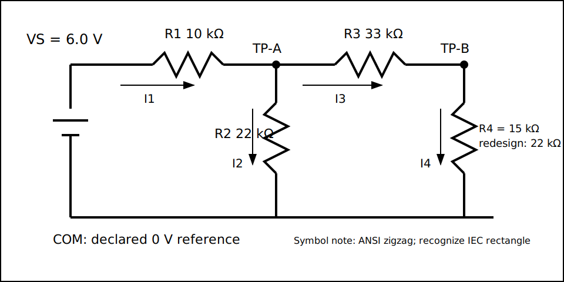

# TP LAB04 — Le réseau physique correspond-il au schéma ?

## Acquis et domaine d'activité

Pendant 150 minutes, les binômes permutent les rôles de monteur, responsable
instrument, analyste et vérificateur. Chacun doit personnellement diriger ou
réaliser une inspection, choisir la séquence de mesure et le réglage, enregistrer
des données brutes, mettre à jour une hypothèse de panne et défendre la modification.
Une aide gestuelle est admise si ces décisions restent celles de l'apprenant.
Prérequis : diagnostic et G1, ou commande directe de l'enseignant avant G1.
L'entrée courant, la soudure, une lampe réelle et un produit capteur sont exclus.

Ce document est un brouillon. Aucune mise sous tension avant approbation locale de
l'analyse de risque, du matériel, de la supervision et de l'autorisation enseignant.

## Sécurité et arrêt

- Source continue protégée approuvée : 0–6,1 V, limite réglée $\leq 20$ mA.
- Cordons uniquement sur COM et V/Ω ; entrée courant interdite.
- Sortie coupée et absence d'énergie vérifiée pour câblage ou résistance.
- Inspection obligatoire avant la première mise sous tension et après toute modification.
- Arrêtez pour cordon/pièce endommagé, nœud incertain, valeur instable/inattendue,
  limitation active, chaleur, odeur, fumée ou dépassement.
- Dites **ARRÊT**, coupez si cela est sûr, ne touchez plus et alertez. Seul
  l'enseignant autorisé libère le montage après arrêt.

Le court-circuit après R1 reste théoriquement sous
$6,1\text{ V}/9,9\text{ kΩ}<0,62\text{ mA}$. Ce calcul n'autorise ni la source
ni l'activité et ne remplace pas les protections.

## Voies matérielles et architecture

| Preuve exigée | Voie minimale | Voie standard | Équivalence |
|---|---|---|---|
| état de source | source limitée approuvée + multimètre | affichage alimentation vérifié au multimètre | l'apprenant consigne VS et la limite |
| trois tensions | un multimètre contrôlé, mesures successives | deux multimètres ou multimètre + oscilloscope approuvé | choix personnel de COM, fonction, calibre, ordre ; capture seule insuffisante |
| charge | résistance d'entrée de la notice exacte | notices exactes des deux voies | même modèle de branche et même décision d'incertitude |
| preuve physique | monter/inspecter, connecter, lire, diagnostiquer, modifier | identique | aucune automatisation ne prend les décisions |

Composants : plaque, R1=10 kΩ, R2=22 kΩ, R3=33 kΩ, R4 initiale=15 kΩ,
candidates 18/22/27/33 kΩ, proposées à 1 %. Toute substitution exige topologie,
valeur mesurée, marge de puissance, plage prévue et revue. Aucune voie avancée
n'est déclarée pour ce pilote.

{fig-alt="Une source de 6 V alimente R1 vers TP-A ; R2 relie TP-A à COM ; R3 relie TP-A à TP-B ; R4 relie TP-B à COM."}

## Prévision avant TP

Remettez avant toute révélation : flèches/polarités et ordres de grandeur ; valeurs
nominales et équations ; signatures d'une branche ouverte et d'une mauvaise valeur ;
bornes/fonction/calibre/référence/ordre de mesure ; sens de variation de TP-B quand
R4 augmente.

Les bornes simulées sont 3,559–3,655 V en TP-A et 1,087–1,155 V en TP-B pour les
coins déclarés et des instruments de 1/10 MΩ. Elles ne sont pas des plages physiques.
Le personnel doit fournir des intervalles mesurés avant l'enseignement ordinaire.

## Point de contrôle du montage

Sortie coupée et zéro énergie vérifié, apprenant et vérificateur paraphent :

- [ ] révision, identifiants source/multimètre, résistance d'entrée et contrôle fonctionnel enregistrés ;
- [ ] cordons intacts sur COM et V/Ω, fonction tension continue ;
- [ ] sortie coupée, 6,0 V, limite au plus 20 mA ;
- [ ] continuité de plaque connue ; VS, TP-A, TP-B et COM étiquetés ;
- [ ] R1–R4 isolées et mesurées ;
- [ ] topologie suivie sur le schéma, aucun court-circuit VS–COM ;
- [ ] puissances et borne de défaut vérifiées, plan de travail dégagé ;
- [ ] identifiant du contrôle enseignant enregistré.

## Procédure et données brutes

1. Créez un enregistrement conforme au schéma JSON avec classe
   `physical-measurement`, jamais `simulation` ou `prepared`.
2. Conservez la prévision individuelle sans la corriger après révélation.
3. Montez hors tension et obtenez le contrôle.
4. Mettez sous tension sans toucher ; observez la source cinq secondes.
5. Mesurez VS/COM ; notez signe, affichage brut, calibre, résolution, précision,
   incertitude et ordre avant de déplacer la pointe.
6. Répétez pour TP-A et TP-B.
7. Coupez la sortie et vérifiez l'absence d'énergie.
8. Déduisez $I_1\ldots I_4$ des différences et résistances mesurées.
9. Calculez résidus aux deux nœuds, deux mailles et bilan de puissance.
10. Ajoutez la branche d'entrée du multimètre et décidez si l'écart est compatible.
11. L'enseignant applique hors tension une panne réversible contrôlée ; seule la
    classe `open-branch` ou `incorrect-value-branch` est publique.
12. Après un nouveau contrôle, remettez sous tension et notez les symptômes sans remplacer.
13. Classez trois hypothèses ; choisissez un essai qui en sépare au moins deux,
    annoncez les issues, faites approuver, isolez, exécutez et mettez à jour.
14. Après preuve de cause, corrigez puis répétez l'acceptation initiale.
15. Comparez les candidates R4 avec marge pour 1,40–1,52 V et $\leq 0,25$ mA.
16. Isolez, montez R4 choisie, inspectez, mesurez et acceptez/refusez les deux exigences.

| N° | État | De→vers | Valeur brute/unité | Calibre/résolution | Incertitude élargie $U$ / couverture $k$ / base | Prévision | Résidu | Décision/anomalie |
|---:|---|---|---|---|---|---|---|---|
| 1 | initial | VS→COM | | | | | | |
| 2 | initial | TP-A→COM | | | | | | |
| 3 | initial | TP-B→COM | | | | | | |
| 4 | panne | essai choisi | | | | | | conservée |
| 5 | corrigé | TP-B→COM | | | | | | |
| 6 | modifié | TP-B→COM | | | | | | accepter/refuser |

## Arbre de diagnostic

Commencez par VS en charge. Si elle est fausse, isolez la source avant le réseau.
Sinon, comparez A et B aux signatures. B proche de zéro avec A plausible priorise
une liaison ouverte ou un shunt ; B élevée priorise une branche de retour forte/
ouverte. Une résistance/continuité hors tension discrimine mieux qu'un remplacement
aléatoire. Si les nœuds sont proches mais le résidu change avec la pointe, modélisez
l'instrument. Dites toujours quel résultat inverserait votre classement.

L'insertion exacte, la randomisation et la remise à zéro portent la référence
`RST-ESE111-CH04-FAULT-001`, hors historique public.

## Acceptation et limites

Acceptez uniquement si la preuve physique et son incertitude élargie montrent
$V_B-U_V\ge1,40\text{ V}$, $V_B+U_V\le1,52\text{ V}$ et
$I_S+U_I\le0,25\text{ mA}$, avec source, composants, instrument, ambiance,
facteur de couverture et base d'incertitude déclarés. Si un intervalle coupe une
limite, concluez « indécis » et améliorez la preuve ; ne l'arrondissez pas en
réussite. La réussite simulée de
22 kΩ est une candidate, pas le résultat. Consignez contact instable, entrée mal
connue, température, substitution ou marge insuffisante.

## Clôture et contrôle individuel

Coupez, isolez, vérifiez zéro, retirez les cordons, triez les résistances réutilisables,
mettez en quarantaine les pièces suspectes et appliquez la procédure déchets.
Archivez séparément données brutes et dérivées. Chacun répond : « Quelle mesure a
changé votre diagnostic ou conception, et quel autre résultat aurait changé votre
décision ? » Le barème 28 points et la remédiation ciblée s'appliquent ; sécurité
et provenance honnête sont obligatoires.
